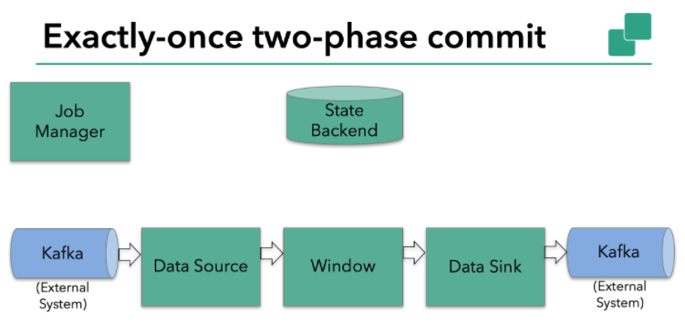
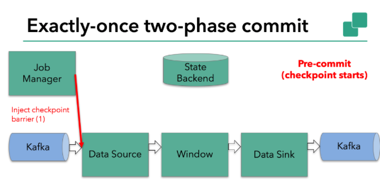
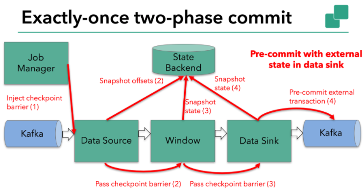

# EOS 精确一次语义

- exactly-once-semantic
- 每条消息影响应用状态一次，生效一次

# 两阶段提交Sink

- 支持EOS

- TwoPhaseCommitSinkFunction
  - 抽象类
  - 提取并封装了两阶段提交协议中的公共逻辑
  - Flink1.4引入
  - 实现方式说明
    - https://www.ververica.com/blog/end-to-end-exactly-once-processing-apache-flink-apache-kafka
    - https://www.cnblogs.com/huxi2b/p/8459342.html
    - https://ci.apache.org/projects/flink/flink-docs-release-1.4/dev/connectors/kafka.html#kafka-011
- checkpointing
  - https://www.ververica.com/blog/high-throughput-low-latency-and-exactly-once-stream-processing-with-apache-flink
  - EOS实现的基础
  - 一个一致性快照，含有
    - 应用的当前状态
    - 输入流的位置
  - 定期产生一个checkpoint
    - 默认存储到内存
    - 可持久化到HDFS、磁盘
    - 异步写入
  - Flink宕机，重启后从最新的checkpoint恢复
    - 重置应用
    - 回滚状态到checkpoint中输入流的正确位置

# Flink-kafka实现EOS应用

- kafka的Sink可以保证在出现故障时，自动恢复原先的kafka的offset

- 2阶段提交，在flink系统内部应用和外部应用协调实现
- kafka 0.11.0版本对事务的支持
  - Flink应用实现EOS的必要条件
  - Pravega 开源流式存储系统也支持，Flink也基于它实现EOS

## 示例

- 功能
  - 从kafka中消费消息，处理完成后再将处理后的数据返还给kafka

### pre-commit

- 预提交阶段
- checkpoint开始时，就进入到本次的pre-commit阶段
- jobManager在输入流中写入一个checkpoint barrier，用于分隔属于本次的checkpoint阶段和下一个checkpoint阶段的接收的kafka消息
  - ==注意该jobManager做该操作是在进入DataSource之前==
- checkpoint barrier作为输入流的一部分，进入到算子中
- 算子遇到checkpoint barrier后会触发后端给该算子的状态进行快照

- kafka source保存kafka的消费offset，保存到StateBackend完成后，将checkpoint barrier传递给下一个算子
- 在DataSource到DataSink之间，如果checkpoint失败，宕机，那么就不会提交状态到StateBackend，重新从原先的offset（最新成功记录在StateBackend中）进行读取

- snapshot offset 表示在checkpoint成功后，在stateBackend中记录了当前消费的offset值
- 消息传递到下一个window算子，由于checkpoint是异步的，因此这里(2)可以看做同步进行
- 当checkpoint barrier在所有算子中都传递一遍，且对应算子都在state Backend中保存了状态之后
  - 说明flink系统内计算全部完成
    - 如果job出现崩溃，可以回滚到最新已成功完成的快照
  - 开始第二阶段的提交 commit，DataSink 到 Kafka的提交过程
    - jobManager通知每个算子checkpoint已成功完成

### commit

- Data Sink含有外部状态，提交外部事务

- 总结
  - 所有算子完成各自的pre-commit 后，会发起一个commit操作
  - 如果有一个算子的pre-commit失败，其他的pre-commit会被终止，flink回滚到最新保存的checkpoint
  - pre-commit 成功，如果commit失败，flink应用崩溃，然后依据用户的重启策略执行重启逻辑，然后在commit
    - 如果commit一直不成功，那么就可能会丢失数据
  - kafka的数据在pre-commit时，会保存在statebackend的checkpoint中，全部成功后，checkpoint会刷新

