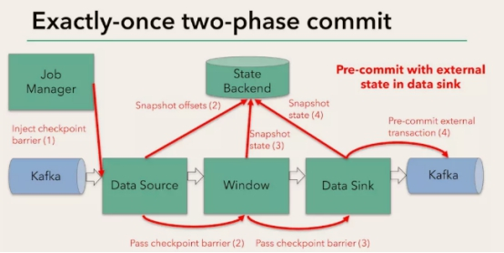
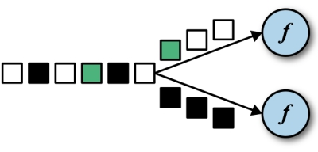
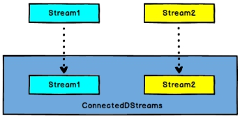
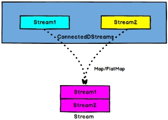
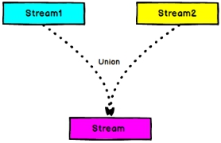

# 支持的数据类型

- Flink 流应用程序处理的是以数据对象表示的事件流
- 所以在 Flink 内部，需要能够处理这些对象。它们需要被序列化和反序列化，以便通过网络传送它们；或者从状态后端、检查点和保存点读取它们。为了有效地做到这一点，Flink 需要明确知道应用程序所处理的数据类型。Flink 使用类型信息的概念来表示数据类型，并为每个数据类型生成特定的序列化器、反序列化器和比较器
- Flink 还具有一个类型提取系统，该系统分析函数的输入和返回类型，以自动获取类型信息，从而获得序列化器和反序列化器。但是，在某些情况下，例如 lambda函数或泛型类型，需要显式地提供类型信息，才能使应用程序正常工作或提高其性能
- Flink 支持 Java 和 Scala 中所有常见数据类型
- 使用最广泛的类型有以下几种


## 基础数据类型

Flink 支持所有的 Java 和 Scala 基础数据类型，Int, Double, Long, String, …

```scala
val numbers: DataStream[Long] = env.fromElements(1L, 2L, 3L, 4L)
numbers.map( n => n + 1 )
```


## Java 和 和 Scala  元组（Tuples ）

```scala
val persons: DataStream[(String, Integer)] = env.fromElements(
("Adam", 17),
("Sarah", 23) )
persons.filter(p => p._2 > 18)
```


## scala 样例类

```scala
case class Person(name: String, age: Int)
val persons: DataStream[Person] = env.fromElements(
Person("Adam", 17),
Person("Sarah", 23) )
persons.filter(p => p.age > 18)
```


## Java简单对象

```java
public class Person {
    public String name;
    public int age;
    public Person() {}
    public Person(String name, int age) {
        this.name = name;
        this.age = age;
    }
}
DataStream<Person> persons = env.fromElements(
    new Person("Alex", 42),
    new Person("Wendy", 23));
```


## 其他

- Flink 对 Java 和 Scala 中的一些特殊目的的类型也都是支持的

- 如 Java 的ArrayList，HashMap，Enum 等等


# DataStream API

- DataSet api与其类似


## Environment


### getExecutionEnvironment

- 创建一个执行环境，表示当前执行程序的上下文。 如果程序是独立调用的，则此方法返回本地执行环境；如果从命令行客户端调用程序以提交到集群，则此方法返回此集群的执行环境

- getExecutionEnvironment会根据查询运行的方式决定返回什么样的运行环境，是最常用的一种创建执行环境的方式

```scala
//批处理
val env: ExecutionEnvironment = ExecutionEnvironment.getExecutionEnvironment
//流处理 
val env = StreamExecutionEnvironment.getExecutionEnvironment
//设置默认并行度，如果没有设置并行度，会以flink-conf.yaml中的配置为准，默认是1
env.setParallelism(2)
```


### createLocalEnvironment

- 返回本地执行环境，需要在调用时指定默认的并行度

```scala
val env = StreamExecutionEnvironment.createLocalEnvironment(1)
```


### createRemoteEnvironment

- 返回集群执行环境，将Jar提交到远程服务器。需要在调用时指定JobManager的IP和端口号，并指定要在集群中运行的Jar包

```scala
val env = ExecutionEnvironment.createRemoteEnvironment("jobmanage-hostname", 6123,"YOURPATH//wordcount.jar")
```


## Source


### 从集合读取数据

```scala
package com.stt.flink.source

import org.apache.flink.streaming.api.scala._

/**
  * 定义一个数据样例类，传感器实体
  *
  * @param id
  * @param timestamp
  * @param temperature
  */
case class SensorEntity(id:String, timestamp: Long, temperature: Double)

object Ch04_FromArray {

  def main(args: Array[String]): Unit = {

    val env = StreamExecutionEnvironment.getExecutionEnvironment

    // 从自定义的集合中读取数据
    val sensorStream: DataStream[SensorEntity] = env.fromCollection(List(
      SensorEntity("s01", 1547718199, 35.80018327300259),
      SensorEntity("s02", 1547718201, 15.402984393403084),
      SensorEntity("s03", 1547718202, 6.720945201171228),
      SensorEntity("s04", 1547718205, 38.101067604893444)
    ))

    sensorStream.print("test01").setParallelism(2)

   	// 从已有的元素中获取
    env.fromElements(1,3.0,"fromElement").print()
      
    env.execute("Ch04_FromArray")
  }
}
```

- 结果

```text
test01:1> SensorEntity(s01,1547718199,35.80018327300259)
test01:2> SensorEntity(s02,1547718201,15.402984393403084)
test01:1> SensorEntity(s03,1547718202,6.720945201171228)
test01:2> SensorEntity(s04,1547718205,38.101067604893444)
10> fromElement
9> 3.0
8> 1
```


### 从文件读取数据

- 准备文件，在resources中添加文件05_sensor.txt

```text
s05, 1547718199, 35.80018327300259
s06, 1547718201, 15.402984393403084
s07, 1547718202, 6.720945201171228
s08, 1547718205, 38.101067604893444
```

- 代码

```scala
package com.stt.flink.source

import org.apache.flink.streaming.api.scala._

object Ch05_FromFile {
  def main(args: Array[String]): Unit = {

    val env = StreamExecutionEnvironment.getExecutionEnvironment

    val sensorStream: DataStream[SensorEntity] = env
     .readTextFile(this.getClass.getClassLoader.getResource("05_sensor.txt").getPath)
      .map(item =>{
        val fields = item.split(",")
        SensorEntity(fields(0).trim,fields(1).trim.toLong,fields(2).trim.toDouble)
      })
      
    sensorStream.print("test02").setParallelism(1)
    env.execute("Ch05_FromFile")
  }
}
```

- 结果

```text
test02> SensorEntity(s06,1547718201,15.402984393403084)
test02> SensorEntity(s08,1547718205,38.101067604893444)
test02> SensorEntity(s05,1547718199,35.80018327300259)
test02> SensorEntity(s07,1547718202,6.720945201171228)
```


### 从消息队列读取数据 [kafka]

从kafka读取的是无界流

- 有界流类似于批处理

- 添加依赖

- pom

```xml
<dependency>
    <groupId>org.apache.flink</groupId>
    <artifactId>flink-connector-kafka-0.11_2.11</artifactId>
    <version>1.7.2</version>
</dependency>
```

- 代码

```scala
package com.stt.flink.source

import java.util.Properties

import org.apache.flink.api.common.serialization.SimpleStringSchema
import org.apache.flink.streaming.api.scala._
import org.apache.flink.streaming.connectors.kafka.FlinkKafkaConsumer011
import org.apache.kafka.common.serialization.StringDeserializer

object Ch06_FromKafka {

  val topic = "sensor"
  def main(args: Array[String]): Unit = {

    val env = StreamExecutionEnvironment.getExecutionEnvironment

    val kafkaStream: DataStream[String] = env.addSource(
      new FlinkKafkaConsumer011[String](
        topic,
        new SimpleStringSchema(),
        new Properties() {
          {
            setProperty("bootstrap.servers", "hadoop102:9092")
            setProperty("group.id", "consumer-group")
            setProperty("key.deserializer", classOf[StringDeserializer].toString)
            setProperty("value.deserializer", classOf[StringDeserializer].toString)
            setProperty("auto.offset.reset", "latest")
          }
        })
    )

    kafkaStream.map(item =>{
        val fields = item.split(",")
        SensorEntity(fields(0).trim,fields(1).trim.toLong,fields(2).trim.toDouble)
      }
    ).print("kafka").setParallelism(1)

    env.execute("Ch06_FromKafka")
  }
}
```

- 创建topic，发送消息

```bash
[ttshe@hadoop102 kafka]$ bin/kafka-topics.sh --zookeeper hadoop102:2181 --create --topic sensor --partitions 1 --replication-factor 1

[ttshe@hadoop102 kafka]$ bin/kafka-console-producer.sh --broker-list hadoop102:9092 --topic sensor
>s05, 1547718199, 35.80018327300259
>s06, 1547718201, 15.402984393403084
```

- 结果

```text
kafka> SensorEntity(s05,1547718199,35.80018327300259)
kafka> SensorEntity(s06,1547718201,15.402984393403084)
```


#### 关于kafka的偏移量

- 在spark-streaming和kafka对接时
  - 如果spark-streaming消费了，则发送通知给kafka修改偏移量
  - 如果spark-streaming中途宕机，重启，需要手动提交偏移量，重新消费
  - 需要手动处理


- Flink+kafka是如何实现exactly-once语义的
  - 注意关注检查点栅栏概念
  - 2阶段提交，有一个预提交过程
  - 自动处理

  

- 由JobManager协调各个TaskManager进行checkpoint存储
  - checkpoint保存在 StateBackend中
    - 默认StateBackend是内存级的
    - 可以改为文件级的进行持久化保存
- 执行过程实际上是一个两段式提交，每个算子执行完成，会进行“预提交”，直到执行完sink操作，会发起“确认提交”，如果执行失败，预提交会放弃掉
- 如果宕机需要通过StateBackend进行恢复，只能恢复所有确认提交的操作




### 自定义source

```scala
package com.stt.flink.source

import org.apache.flink.streaming.api.functions.source.SourceFunction
import org.apache.flink.streaming.api.scala._

import scala.util.Random

object Ch07_CustomSource {
  
  def main(args: Array[String]): Unit = {

    val env = StreamExecutionEnvironment.getExecutionEnvironment

    val stream: DataStream[SensorEntity] = env.addSource(new MySensorSource)

    stream.print().setParallelism(1)
    env.execute("Ch07_CustomSource")
  }

  class MySensorSource extends SourceFunction[SensorEntity]{
    var running : Boolean = true

    override def cancel(): Unit = {
      running = false
    }
    override def run(sc: SourceFunction.SourceContext[SensorEntity]): Unit = {
      val rand = new Random()

      var curTemp = (1 to 10).map(
        i => SensorEntity("s"+i, 0L,23+rand.nextGaussian()*20) 
          // nextGaussian 得到一个高斯分布的值
      )

      while(running){
        // 业务场景，10个温度检测，每次温度的变化在原先的温度的基础上
        // 更新温度 和 时间
        curTemp.foreach{
            case SensorEntity(id,t,temperature) =>
              sc.collect(
                SensorEntity(
                  id,
                  System.currentTimeMillis(),
                  temperature + rand.nextGaussian()
                )
              )
        }
        Thread.sleep(100)
      }
    }
  }
}
```


## Transform

- 转换算子


### 基本转换算子


#### map


```scala
val streamMap = stream.map { x => x * 2 }
```


#### flatMap

- flatMap的函数签名

```scala
def flatMap[A,B](as: List[A])(f: A ⇒ List[B]): List[B]
```

- 如
  - flatMap(List(1,2,3))(i ⇒ List(i,i))
    - 结果是List(1,1,2,2,3,3)
  - List("a b", "c d").flatMap(line ⇒ line.split(" "))
    - 结果是List(a, b, c, d)

#### filter


```scala
val streamFilter = stream.filter{
    x => x == 1
}
```


### 键控流转换算子


#### keyBy



- DataStream --> KeyedStream
- ==逻辑==地将一个流拆分成不相交的分区
  - 每个分区包含具有相同key的元素
  - 在内部以hash的形式实现的

- 生成KeyedStream
- 格式
  - keyBy(0)
  - keyBy(_.id)
  - keyBy("id")


### 滚动聚合算子

- 针对 KeyedStream 的每一个支流做聚合
- 返回的结果是==DataStream==

#### sum

#### min

#### max

#### minBy

#### maxBy

#### reduce

- 针对KeyedStream进行操作
- 要在keyBy之后进行
- 一个分组数据流的聚合操作，合并当前的元素和上次聚合的结果，产生一个新的值，返回的流中包含每一次聚合的结果，而不是只返回最后一次聚合的最终结果

```scala
val stream2 = env.readTextFile("YOUR_PATH\\sensor.txt").map( data => {
    val dataArray = data.split(",")
    SensorReading(
        dataArray(0).trim, 
        dataArray(1).trim.toLong, 
        dataArray(2).trim.toDouble
    )
})
.keyBy("id") // 写法2 keyBy(0) 
.reduce(
    (x, y) => 
    SensorReading(x.id, x.timestamp + 1,x.temperature + y.temperature) 
)
// 其他操作 sum(“temperature”) 统计温度叠加
```


### 多流转换算子


#### split

- DataStream -> SplitStream
- 依据某些特征把一个DataStream拆分成2个或者多个流
- 而非真正切开，而是逻辑分组，贴上了标签
- 与select配置使用
- 已过时，推荐使用侧输出流


#### select

- SplitStream -> DataStream
- 从一个SplitStream中获取一个或者多个DataStream


- 示例

```scala
package com.stt.flink.transform

import org.apache.flink.streaming.api.scala._

/**
  * 定义一个数据样例类，传感器实体
  *
  * @param id
  * @param timestamp
  * @param temperature
  */
case class SensorEntity(id:String, timestamp: Long, temperature: Double)

/**
  * 从集合中读取数据
  */
object Ch08_SplitOperator {

  def main(args: Array[String]): Unit = {

    val env = StreamExecutionEnvironment.getExecutionEnvironment

    // 从自定义的集合中读取数据
    val sensorStream: DataStream[SensorEntity] = env.fromCollection(List(
      SensorEntity("s01", 1547718199, 35.80018327300259),
      SensorEntity("s02", 1547718201, 15.402984393403084),
      SensorEntity("s03", 1547718202, 6.720945201171228),
      SensorEntity("s04", 1547718205, 38.101067604893444)
    ))

    val splitStream: SplitStream[SensorEntity] = sensorStream.split(
      item => {
        if (item.temperature > 30) Seq("high") else Seq("low")
      }
    )
    val highStream: DataStream[SensorEntity] = splitStream.select("high")
    val lowStream: DataStream[SensorEntity] = splitStream.select("low")

    highStream.print("high").setParallelism(1)
    lowStream.print("low").setParallelism(1)
    
    env.execute("Ch08_SplitOperator")
  }
}
```

- 结果

```scala
high> SensorEntity(s01,1547718199,35.80018327300259)
low> SensorEntity(s02,1547718201,15.402984393403084)
low> SensorEntity(s03,1547718202,6.720945201171228)
high> SensorEntity(s04,1547718205,38.101067604893444)
```


#### connect

- DataStream,DataStream --> ConnectedStreams
- 连接两个保持他们类型的数据流，两个数据流被Connect之后，只是被放在了一个同一个流中，内部依然保持各自的数据和形式不发生任何变化
- ==两个流相互独立==
- 只能是2个流进行合并
- 注意2个流的数据类型可以不一样



#### coMap/coFlatMap

- ConnectedStreams-->DataStream
- 作用于ConnectedStreams上，功能与map和flatMap一样，对ConnectedStreams中的每一个Stream分别进行map和flatMap处理



- 示例

```scala
package com.stt.flink.transform

import org.apache.flink.streaming.api.scala._


/**
  * 从集合中读取数据
  */
object Ch09_ConnectedOperator {

  def main(args: Array[String]): Unit = {

    val env = StreamExecutionEnvironment.getExecutionEnvironment

    // 从自定义的集合中读取数据
    val sensorStream: DataStream[SensorEntity] = env.fromCollection(List(
      SensorEntity("s01", 1547718199, 35.80018327300259),
      SensorEntity("s02", 1547718201, 15.402984393403084),
      SensorEntity("s03", 1547718202, 6.720945201171228),
      SensorEntity("s04", 1547718205, 38.101067604893444)
    ))

    val splitStream: SplitStream[SensorEntity] = sensorStream.split(
      item => {
        if (item.temperature > 30) Seq("high") else Seq("low") // 可以打上多个标记
      }
    )
    val highStream: DataStream[SensorEntity] = splitStream.select("high")
    val lowStream: DataStream[SensorEntity] = splitStream.select("low")

    val warning: DataStream[(String, Double, String)] = highStream.map(item => (item.id, item.temperature, "warn"))
    // 进行connected操作
    val connected: ConnectedStreams[(String, Double, String), SensorEntity] = warning.connect(lowStream)

    val value: DataStream[Product with Serializable] = connected.map(
      warningData => (warningData._1, warningData._2, warningData._3),
      lowData => (lowData.id, lowData.temperature, "low", lowData.timestamp)
    )

    value.print()
    
    env.execute("Ch09_ConnectedOperator")
  }
}
```

- 结果

```text
9> (s02,15.402984393403084,low,1547718201)
6> (s04,38.101067604893444,warn)
10> (s03,6.720945201171228,low,1547718202)
5> (s01,35.80018327300259,warn)
```


#### union

- 真正的合并流
- 要求数据结构完全一致
- 可以多条流进行合并
- DataStream-->DataStream
- 对两个或者两个以上的DataStream进行union操作，产生一个包含所有DataStream元素的新DataStream
- 注意
  - 如将一个DataStream跟它自己做union操作，在新的DataStream中将看到每一个元素都出现两次



```scala
val unionStream: DataStream[StartUpLog] = appStoreStream.union(otherStream)
```

- 与Connected的区别
  - Union之前两个流的类型必须是一样，Connect可以不一样，在之后的coMap中再去调整成为一样的
  - Connect只能操作两个流，Union可以操作多个


## 实现UDF

- 自定义UDF，可更细粒度的控制流
- Flink 暴露了所有 udf 函数的接口
  - 实现方式为接口或者抽象类
  - 如MapFunction, FilterFunction, ProcessFunction 等


### 函数类


#### FilterFunction

```scala
class MyFilter extends FilterFunction[String] {
    override def filter(value: String): Boolean = {
        value.contains("flink")
    }
}

val flinkTweets = tweets.filter(new MyFilter)
// 匿名实现
val flinkTweets = tweets.filter(
    new RichFilterFunction[String] {
        override def filter(value: String): Boolean = {
            value.contains("flink")
        }
    }
)
```

- 传递参数的filter

```scala
val tweets: DataStream[String] = ...

val flinkTweets = tweets.filter(new KeywordFilter("flink"))

class KeywordFilter(keyWord: String) extends FilterFunction[String] {
    override def filter(value: String): Boolean = {
        value.contains(keyWord)
    }
}
```

- 匿名函数

```scala
val tweets: DataStream[String] = ...
val flinkTweets = tweets.filter(_.contains("flink"))
```


### 富函数

- “富函数”是 DataStream API 提供的一个函数类的接口，所有 Flink 函数类都有其 Rich 版本
- 可获取运行环境的上下文，并拥有一些生命周期方法，实现更复杂的功能
  - RichMapFunction
  - RichFlatMapFunction
  - RichFilterFunction
- Rich Function 有一个生命周期的概念，生命周期方法有
  - open()
    - rich function 的初始化方法
    - 当一个算子例如 map 或者 filter 被调用之前 open() 会被调用
  - close()
    - 生命周期中的最后一个调用的方法，做一些清理工作
  - getRuntimeContext()
    - 提供了函数的 RuntimeContext 的一些信息
      - 如函数执行的并行度，任务的名字，以及 state 状态

```scala
class MyFlatMap extends RichFlatMapFunction[Int, (Int, Int)] {
    
    var subTaskIndex = 0
    
    override def open(configuration: Configuration): Unit = {
        subTaskIndex = getRuntimeContext.getIndexOfThisSubtask
        //  以下可以做一些初始化工作 ， 例如建立一个和 HDFS 的连接
    }
    
    override def flatMap(in: Int, out: Collector[(Int, Int)]): Unit = {
        if (in % 2 == subTaskIndex) {
            out.collect((subTaskIndex, in))
        }
    }
    
    override def close(): Unit = {
        //  以下做一些清理工作，例如断开和 HDFS 的连接。
    }
}
```


## Sink

- 实现了RichSinkFunction方法

- Flink 没有类似于 spark 中 foreach 方法，让用户进行迭代的操作
- 对外的输出操作都要利用 Sink 完成
- 官方提供了一部分的框架的 sink，除此以外，需要用户自定义实现 sink

```scala
stream.addSink(new MySink(xxxx))
```


### print

- 调用的print方法也是一个sink

```scala
@PublicEvolving
def print(sinkIdentifier: String): DataStreamSink[T] = stream.print(sinkIdentifier)
```


### Kafka

- pom

```xml
<dependency>
    <groupId>org.apache.flink</groupId>
    <artifactId>flink-connector-kafka-0.11_2.11</artifactId>
    <version>1.7.2</version>
</dependency>
```

- 主函数中添加 sink

```scala
val union = high.union(low).map(_.temperature.toString)
union.addSink(new FlinkKafkaProducer011[String](
    "localhost:9092",
    "test", 
    new SimpleStringSchema())
)
```

- 代码

```scala
package com.stt.flink.sink

import com.stt.flink.source.SensorEntity
import org.apache.flink.api.common.serialization.SimpleStringSchema
import org.apache.flink.streaming.api.scala._
import org.apache.flink.streaming.connectors.kafka.FlinkKafkaProducer011

object KafkaSinkTest {
  def main(args: Array[String]): Unit = {

    val env = StreamExecutionEnvironment.getExecutionEnvironment

    // 从自定义的集合中读取数据
    val sensorStream: DataStream[SensorEntity] = env.fromCollection(List(
      SensorEntity("s01", 1547718199, 35.80018327300259),
      SensorEntity("s02", 1547718201, 15.402984393403084),
      SensorEntity("s03", 1547718202, 6.720945201171228),
      SensorEntity("s04", 1547718205, 38.101067604893444)
    ))
      
    val dataStream = sensorStream.map(data=>data.toString)

    // 向kafka发送消息
    dataStream.addSink(new FlinkKafkaProducer011[String](
      "hadoop102:9092",
      "sensorTest",
      new SimpleStringSchema())
    )
    
    env.execute("KafkaSinkTest")
  }
}
```

- 结果

```text
[ttshe@hadoop102 kafka]$ bin/kafka-console-consumer.sh --zookeeper hadoop102:2181 --from-beginning --topic sensorTest
Using the ConsoleConsumer with old consumer is deprecated and will be removed in a future major release. Consider using the new consumer by passing [bootstrap-server] instead of [zookeeper].
SensorEntity(s01,1547718199,35.80018327300259)
SensorEntity(s03,1547718202,6.720945201171228)
SensorEntity(s02,1547718201,15.402984393403084)
SensorEntity(s04,1547718205,38.101067604893444)
```


### Redis

- pom

```xml
<dependency>
    <groupId>org.apache.bahir</groupId>
    <artifactId>flink-connector-redis_2.11</artifactId>
    <version>1.0</version>
</dependency>
```

- 示例

```scala
package com.stt.flink.sink

import com.stt.flink.source.SensorEntity
import org.apache.flink.streaming.api.scala._
import org.apache.flink.streaming.connectors.redis.RedisSink
import org.apache.flink.streaming.connectors.redis.common.config.FlinkJedisPoolConfig
import org.apache.flink.streaming.connectors.redis.common.mapper.{RedisCommand, RedisCommandDescription, RedisMapper}

object RedisSinkTest {
  def main(args: Array[String]): Unit = {

    val env = StreamExecutionEnvironment.getExecutionEnvironment

    // 从自定义的集合中读取数据
    val sensorStream: DataStream[SensorEntity] = env.fromCollection(List(
      SensorEntity("s01", 1547718199, 35.80018327300259),
      SensorEntity("s02", 1547718201, 15.402984393403084),
      SensorEntity("s03", 1547718202, 6.720945201171228),
      SensorEntity("s04", 1547718205, 38.101067604893444)
    ))

    // 定义redis配置
    val config: FlinkJedisPoolConfig =
      new FlinkJedisPoolConfig.Builder().setHost("hadoop102").setPort(6379).build()

    // 向kafka发送消息
    sensorStream.addSink(new RedisSink[SensorEntity](config,new MyRedisMapper))

    env.execute("RedisSinkTest")
  }

  class MyRedisMapper  extends RedisMapper[SensorEntity]{

    // 定义执行的命令
    override def getCommandDescription: RedisCommandDescription = {
      new RedisCommandDescription(RedisCommand.HSET,"sensor_key")
    }
    // 定义value
    override def getValueFromData(t: SensorEntity): String = {
      t.temperature.toString
    }
    // 定义key
    override def getKeyFromData(t: SensorEntity): String = {
      t.id
    }
  }
}
```

- 结果

```text
[ttshe@hadoop102 ~]$ redis-cli 
127.0.0.1:6379> keys *
1) "sensor_key"
127.0.0.1:6379> hgetall sensor_key
1) "s02"
2) "15.402984393403084"
3) "s03"
4) "6.720945201171228"
5) "s01"
6) "35.80018327300259"
7) "s04"
8) "38.101067604893444"
```


### Elasticsearch

- pom

```xml
<dependency>
    <groupId>org.apache.flink</groupId>
    <artifactId>flink-connector-elasticsearch6_2.11</artifactId>
    <version>1.7.2</version>
</dependency>
```

- 示例

```scala
package com.stt.flink.sink

import java.util

import com.stt.flink.source.SensorEntity
import org.apache.flink.api.common.functions.RuntimeContext
import org.apache.flink.streaming.api.scala._
import org.apache.flink.streaming.connectors.elasticsearch.{ElasticsearchSinkFunction, RequestIndexer}
import org.apache.flink.streaming.connectors.elasticsearch6.ElasticsearchSink
import org.apache.http.HttpHost
import org.elasticsearch.client.Requests

object ESSinkTest {
  def main(args: Array[String]): Unit = {

    val env = StreamExecutionEnvironment.getExecutionEnvironment

    // 从自定义的集合中读取数据
    val sensorStream: DataStream[SensorEntity] = env.fromCollection(List(
      SensorEntity("s01", 1547718199, 35.80018327300259),
      SensorEntity("s02", 1547718201, 15.402984393403084),
      SensorEntity("s03", 1547718202, 6.720945201171228),
      SensorEntity("s04", 1547718205, 38.101067604893444)
    ))

    sensorStream.addSink(esSinkBuilder.build()).setParallelism(1)

    env.execute("ESSinkTest")
  }

  val esSinkBuilder = new ElasticsearchSink.Builder[SensorEntity](
    new util.ArrayList[HttpHost](){{
      add(new HttpHost("hadoop102",9200))
    }},
    new ElasticsearchSinkFunction[SensorEntity] {
      override def process(t: SensorEntity,
                           ctx: RuntimeContext,
                           requestIndexer: RequestIndexer): Unit = {
        println("data:"+t)

        requestIndexer.add(
          Requests.indexRequest()
            .index("sensor")
            .`type`("sensorData")
            .source(new util.HashMap[String,String](){{
              put("id",t.id)
              put("temperature",t.temperature.toString)
              put("timestamp",t.timestamp.toString)
            }})
        )

        println("success")
      }
    }
  )
}
```

- 查询es

```http
GET sensor/sensorData/_search
{
  "query":{
    "match_all": {}
  }
}
```

或者

```http
http://hadoop102:9200/sensor/_search?pretty
```


### JDBC

- pom

```xml
<dependency>
    <groupId>mysql</groupId>
    <artifactId>mysql-connector-java</artifactId>
    <version>5.1.44</version>
</dependency>
<dependency>
    <groupId>com.alibaba</groupId>
    <artifactId>druid</artifactId>
    <version>1.1.10</version>
</dependency>
```

- 示例

```scala
class MyJdbcSink(sql:String ) extends  RichSinkFunction[Array[Any]] {

  val driver="com.mysql.jdbc.Driver"

  val url="jdbc:mysql://localhost:3306/sensor?useSSL=false"

  val username="root"

  val password="123456"

  val maxActive="20"

  var connection:Connection=null;

  //创建连接
  override def open(parameters: Configuration): Unit = {
    val properties = new Properties()
    properties.put("driverClassName",driver)
    properties.put("url",url)
    properties.put("username",username)
    properties.put("password",password)
    properties.put("maxActive",maxActive)

    val dataSource: DataSource = DruidDataSourceFactory.createDataSource(properties)
    connection = dataSource.getConnection()
  }

//反复调用连接，执行sql
  override def invoke(values: Array[Any]): Unit = {
// 预编译器
    val ps: PreparedStatement = connection.prepareStatement(sql )
    println(values.mkString(","))
    for (i <- 0 until values.length) {
// 坐标从1开始
      ps.setObject(i + 1, values(i))
    }
// 执行操作
    ps.executeUpdate()
  }

  override def close(): Unit = {
    if(connection!=null){
      connection.close()
    }
  }
}
```

- 在main方法中增加

```scala
val jdbcSink = new MyJdbcSink("insert into sensorReading values(?,?,?)")
dataDstream.map(data=>Array(data.id,data.timestamp,data.temperature)).addSink(jdbcSink)
```

- 示例2

```scala
package com.stt.flink.sink

import java.sql.{Connection, DriverManager, PreparedStatement}

import com.stt.flink.source.SensorEntity
import org.apache.flink.configuration.Configuration
import org.apache.flink.streaming.api.functions.sink.{RichSinkFunction, SinkFunction}
import org.apache.flink.streaming.api.scala._

object JDBCSinkTest {
  def main(args: Array[String]): Unit = {

    val env = StreamExecutionEnvironment.getExecutionEnvironment

    // 从自定义的集合中读取数据
    val sensorStream: DataStream[SensorEntity] = env.fromCollection(List(
      SensorEntity("s01", 1547718199, 35.80018327300259),
      SensorEntity("s02", 1547718201, 15.402984393403084),
      SensorEntity("s03", 1547718202, 6.720945201171228),
      SensorEntity("s04", 1547718205, 38.101067604893444)
    ))

    sensorStream.addSink(new MyJdbcSink())

    env.execute("JDBCSinkTest")
  }

  class MyJdbcSink() extends RichSinkFunction[SensorEntity]{
    // 定义sql连接器，预编译器
    var conn: Connection = _
    var insertStatement : PreparedStatement = _
    var updateStatement : PreparedStatement = _

    // 初始化 创建连接和预编译
    override def open(parameters: Configuration): Unit = {
      super.open(parameters)
      conn = DriverManager.getConnection("jdbc:mysql://hadoop102:3306/test","root","123456")
      insertStatement = conn.prepareStatement("INSERT INTO temperature (sensor, temper) VALUES (?,?)")
      updateStatement = conn.prepareStatement("UPDATE temperature SET temper = ? WHERE sensor = ?")
    }

    // 调用连接，执行sql
    override def invoke(value: SensorEntity, context: SinkFunction.Context[_]): Unit = {

      updateStatement.setDouble(1,value.temperature)
      updateStatement.setString(2,value.id)
      updateStatement.execute()
      // 先执行更新操作，如果成功，则不进行插入
      if(updateStatement.getUpdateCount == 0){
        insertStatement.setString(1,value.id)
        insertStatement.setDouble(2,value.temperature)
        insertStatement.execute()
      }
    }

    override def close(): Unit = {
      conn.close()
      insertStatement.close()
      updateStatement.close()
    }
  }
}
```

- 测试，建表，查询

```sql
CREATE TABLE temperature(
	sensor VARCHAR(20) not null,
	temper DOUBLE(5,2) not null
)
select * from temperature;
```

