# 概述

- 国外开源的**ETL工具**
- java编写，可以在Window、Linux、Unix上运行，绿色无需安装，数据抽取高效稳定
- 进行数据转换输出
- kettle可做调度，但是性能比较慢，一般用于ETL数据处理


## 工程存储方式

- xml格式
- 以资源库方式存储
  - 数据资源库，文件资源库


## 设计


### 转换

- Transformation
- 完成针对数据的基础转换
- 数据流
- 一次性将所有控件模块启动，每条记录从第一个控件开始依次向下处理
  - 每个控件对应一个线程
- 转换可以是作业job的一个步骤


### 作业

- job
- 完成整个工作流的控制
- 步骤流程
- 每一个步骤必须等到前一个步骤都完成，后面的步骤才会执行

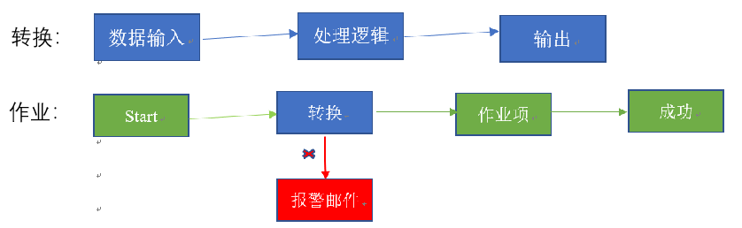

## 组成

- spoon.sh
  - 勺子
  - 图形化页面，使用图形化开发转换和作业
- pan.sh
  - 煎锅
  - 使用命令的形式调用job
- kitchen.sh
  - 厨房
  - 命令形式调用Transform
- carte.sh
  - 菜单
  - 轻量级web容器，用于建立专用，远程的ETL Server


## 特点

- 流程式设计方便易用，公司不懂代码的运营人员也可以使用，学习成本低
- 常用的数据库和大数据存储系统的数据都可以直接接入kettle
- 可以跑在不同的平台上，支持linux，windows，unix
- 开源免费，社区支持较好


# 安装

- 官网地址
  - https://community.hitachivantara.com/docs/DOC-1009855

- 下载地址
  - https://sourceforge.net/projects/pentaho/files/Data%20Integration/


## windows下安装

在实际企业开发中，都是在本地环境下进行kettle的job和Transformation开发的，可以在本地运行，也可以连接远程机器运行

1) 安装jdk

2) 下载kettle压缩包，因kettle为绿色软件，解压缩到任意本地路径即可

3) 双击Spoon.bat，启动图形化界面工具，就可以直接使用

- 注意使用mysql需要安装`mysql-connector-java-5.1.27-bin.jar`到lib文件夹下


## 配置

- 修改解压目录下的data-integration\plugins\pentaho-big-data-plugin下的plugin.properties
- 设置active.hadoop.configuration=hdp26
- 配置文件拷贝到data-integration\plugins\pentaho-big-data-plugin\hadoop-configurations\hdp26下
  - hadoop中
    - core-site.xml
    - hdfs-site.xml
    - yarn-site.xml
    - mapred-site.xml
  - hive中
    - hive-site.xml
  - hbase中
    - hbase-site.xml
- 启动hadoop
- 启动zk
- 启动hbase
- 启动hive服务

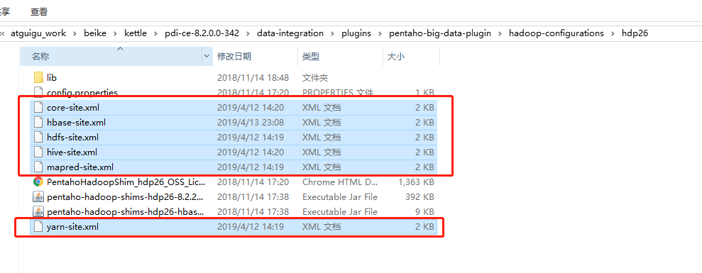

- 启动其他服务

```bash
[ttshe@hadoop102 ~]$ /opt/module/hadoop-2.7.2/sbin/start-all.sh
#开启HBase前启动Zookeeper
[ttshe@hadoop102 ~]$ /opt/module/hbase-1.3.1/bin/start-hbase.sh
[ttshe@hadoop102 ~]$ /opt/module/hive/bin/hiveserver2
```

- 进入beeline，查看10000端口开启情况

```bash
[atguigu@hadoop102 ~]$ /opt/module/hive/bin/beeline
Beeline version 1.2.1 by Apache Hive
beeline> !connect jdbc:hive2://hadoop102:10000（回车）
Connecting to jdbc:hive2://hadoop102:10000
Enter username for jdbc:hive2://hadoop102:10000: ttshe（输入atguigu）
Enter password for jdbc:hive2://hadoop102:10000:（直接回车）
Connected to: Apache Hive (version 1.2.1)
Driver: Hive JDBC (version 1.2.1)
Transaction isolation: TRANSACTION_REPEATABLE_READ
0: jdbc:hive2://hadoop102:10000>（到了这里说明成功开启10000端口）
```


## linux下安装

- 上传压缩包

- 解压

```bash
[ttshe@hadoop102 software]$ unzip pdi-ce-8.2.0.0-342.zip -d /opt/module/kettle
```

- 拷贝mysql驱动

- 将上节配置操作执行

  

### 单机

- 将本地用户家目录下的隐藏目录C:\Users\自己用户名\.kettle，整个上传到linux的家目录/home/ttshe/下
- 查看repositories.xml中查看连接信息


# 界面操作


## 示例1：转换mysql2mysql

- 把stu1的数据按id同步到stu2，stu2有相同id则更新数据

- 在mysql中创建表，并插入数据
  - 注意stu1和stu2的表结果不一样，id为1 的数据不一样

```sql
mysql> use test;
mysql> create table stu1(id int,name varchar(20),age int);
mysql> create table stu2(id int,name varchar(20));

mysql> insert into stu1 values(1,'lis',22),(2,'zhang',23),(3,'wang',12);
mysql> insert into stu2 values(1,'she');
```

- kettle中新建转换
  - 文件：新建：转换

- 输入：双击表输入
- 输出：双击插入/更新
- 将表输入和表输出连接

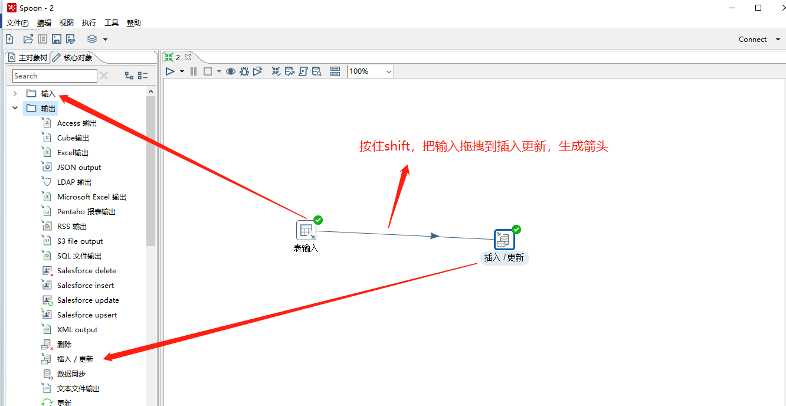

- 编辑表输入
  - 填写相关配置，测试是否成功
  - 点击新建：连接类型->MySQL
  - ==编写读取数据的sql==
    - `SELECT * FROM stu1`
    - 点击预览可以查看预览的结果

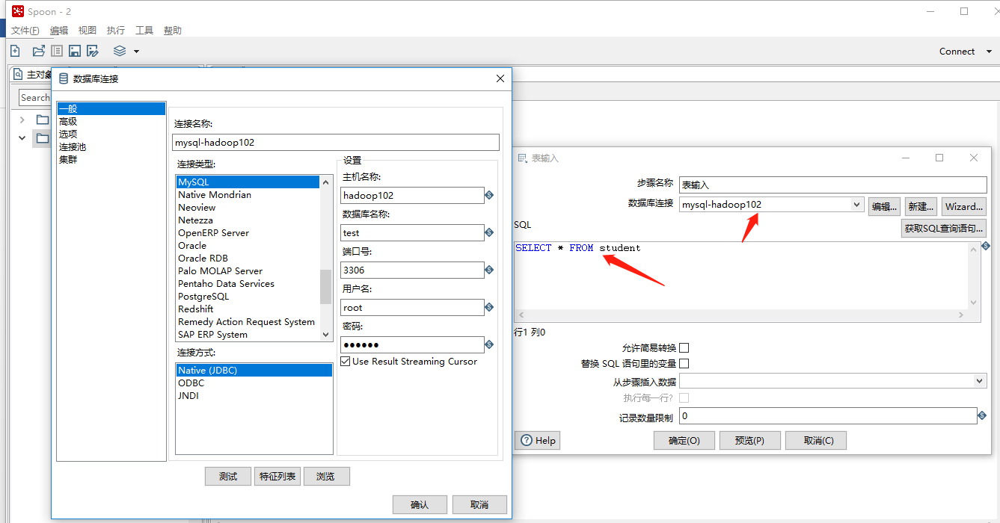

- 编辑插入/更新
  - 选择要更新的表和字段，以及匹配的字段

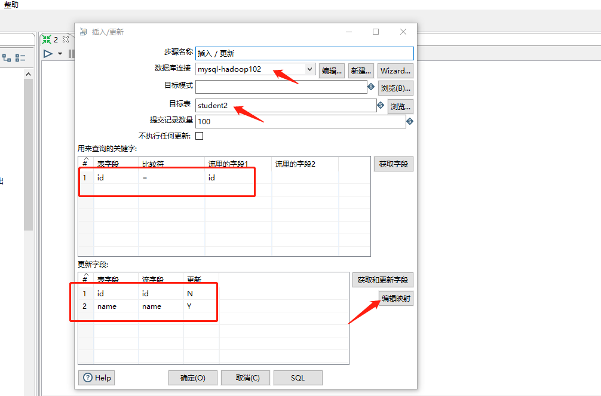

- 保存转换，启动运行，去mysql表查看结果
  - 注意：如果需要连接mysql数据库，需要要先将mysql的连接驱动包复制到kettle的根目录下的lib目录中，否则会报错找不到驱动

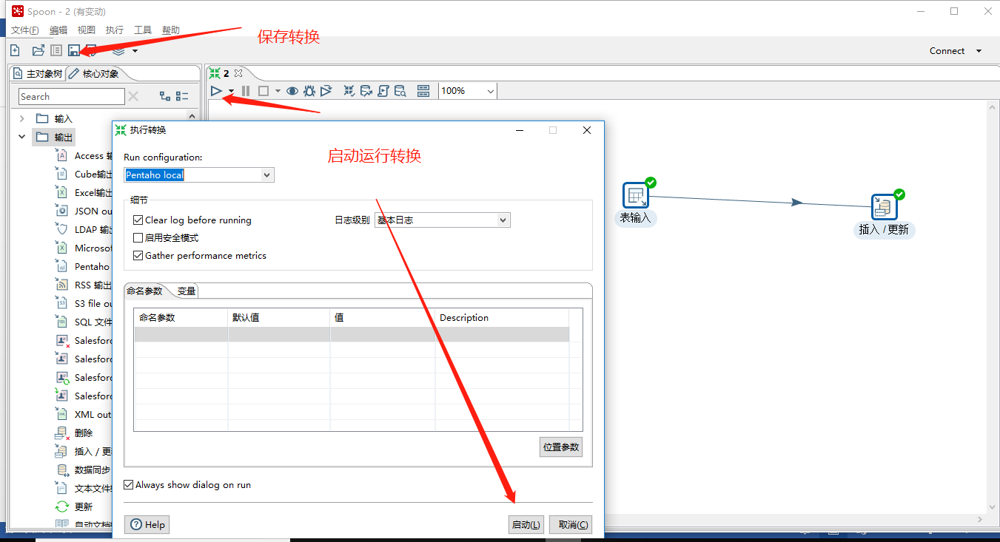


## 示例2：作业mysql2mysql

- 使用**作业**执行上述转换，并且额外在表stu2中添加一条数据

- 新建作业
  - 新建：作业

- 按图示拉取组件
  - 通用->start
    - 有一个锁的标志表示不论成功与否都执行下一个阶段
  - 通用->转换
  - 脚本->SQL
  - 通用->Dummy
    - 表示什么也不做，用于表示end

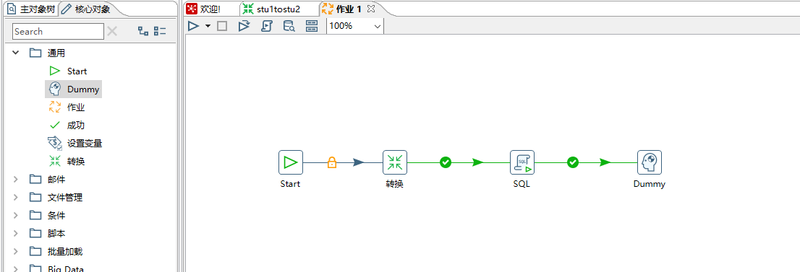

- 双击编辑start

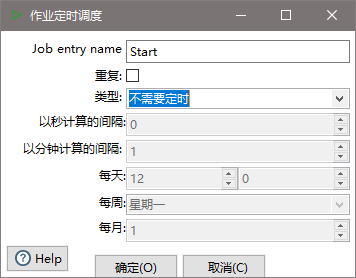

- 双击转换，选择上个案例保存的transform文件

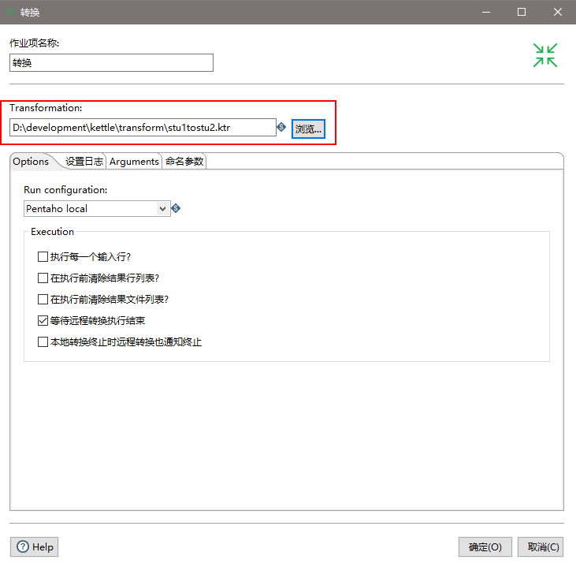

- 双击sql，填写插入的sql文件

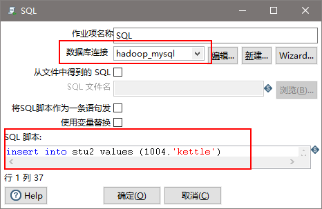

- 保存执行

- 也可以添加组件，发送邮件


## 示例3：hive2hdfs


### 准备

- 创建两张表dept和emp

```sql
CREATE TABLE dept(deptno int, dname string,loc string)
ROW FORMAT DELIMITED
FIELDS TERMINATED BY '\t';

CREATE TABLE emp(
empno int,
ename string,
job string,
mgr int,
hiredate string,
sal double,
comm int,
deptno int)
ROW FORMAT DELIMITED
FIELDS TERMINATED BY '\t';
```

- 插入数据

```sql
insert into dept values(10,'accounting','NEW YORK'),(20,'RESEARCH','DALLAS'),(30,'SALES','CHICAGO'),(40,'OPERATIONS','BOSTON');

insert into emp values
(7369,'SMITH','CLERK',7902,'1980-12-17',800,NULL,20),
(7499,'ALLEN','SALESMAN',7698,'1980-12-17',1600,300,30),
(7521,'WARD','SALESMAN',7698,'1980-12-17',1250,500,30),
(7566,'JONES','MANAGER',7839,'1980-12-17',2975,NULL,20);
```


### 方式1操作

- 按下图建立流程图

  - ==表输入后需要先排序，否则会丢数据==

  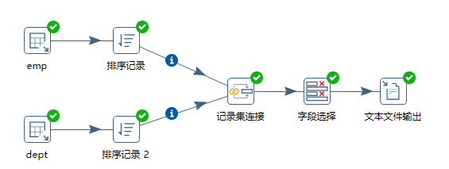

- 配置表输入
  - 新建连接，配置hive连接
  - 注意预览

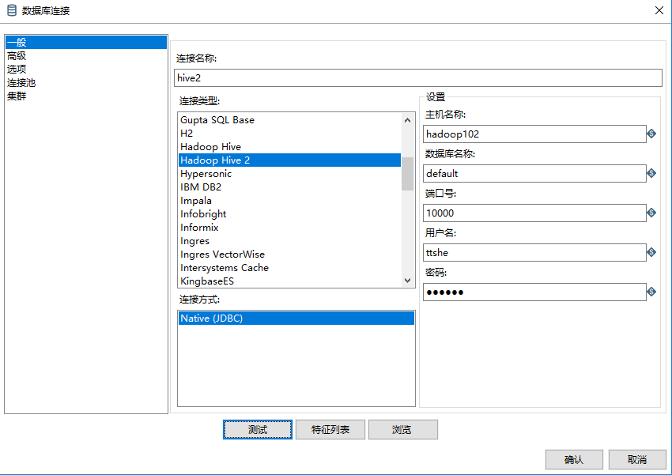

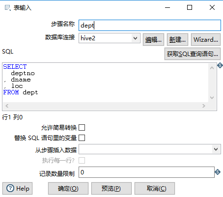

- 编辑表输入2


- 配置排序

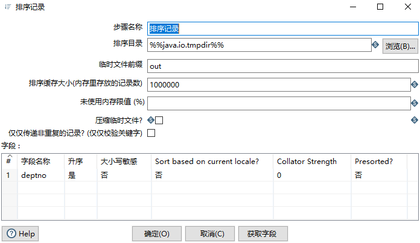

- 配置连接：记录集连接

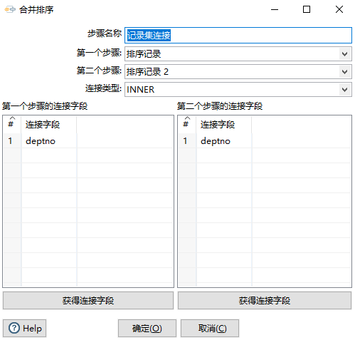

- 配置转换：字段选择

  - 注意在移除中配置要罗盘的字段数据
  - 元数据中不要配置

  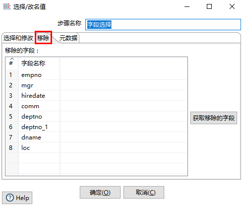

- 配置文件输出
  - 新建hdfs配置

  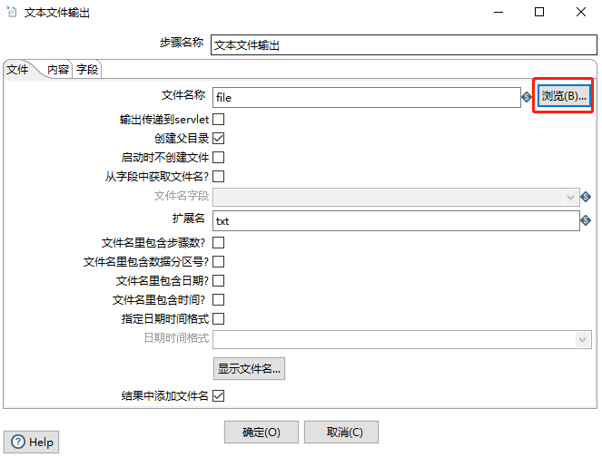

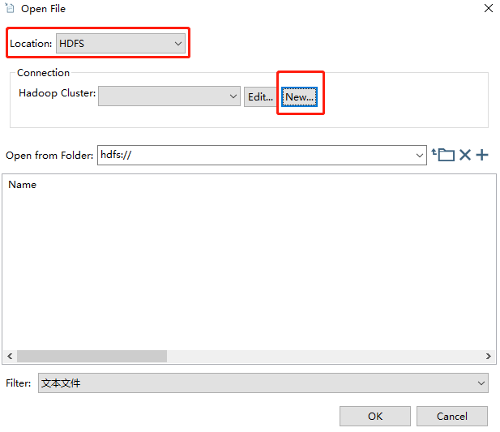

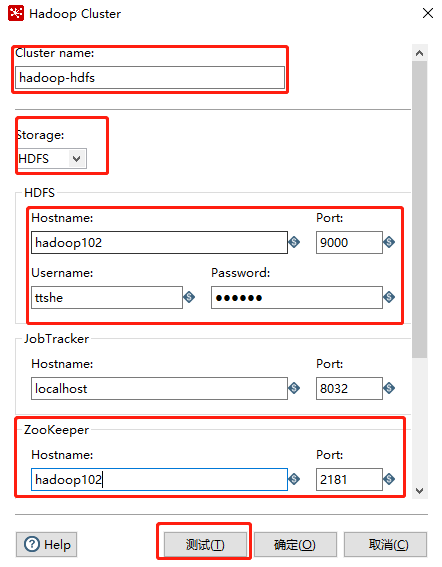

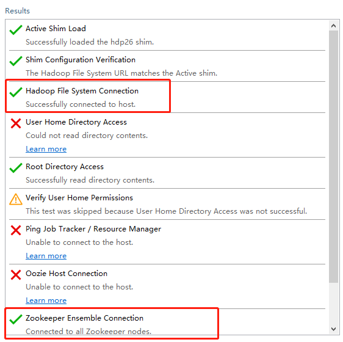

- 选择hdfs上需要导出的文件路径

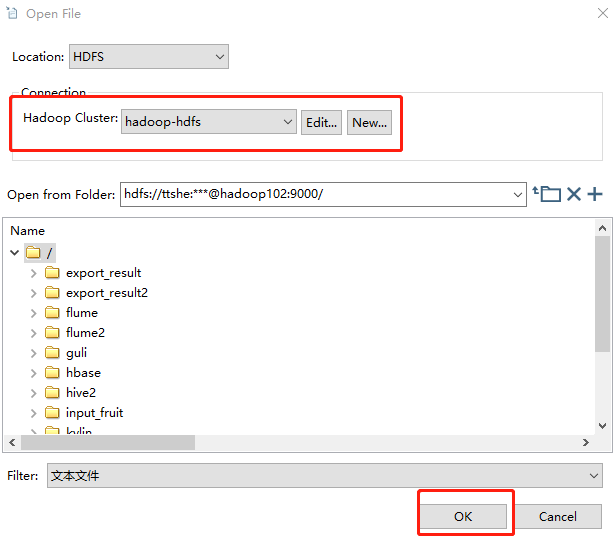

- 配置输出文件名和扩展字段

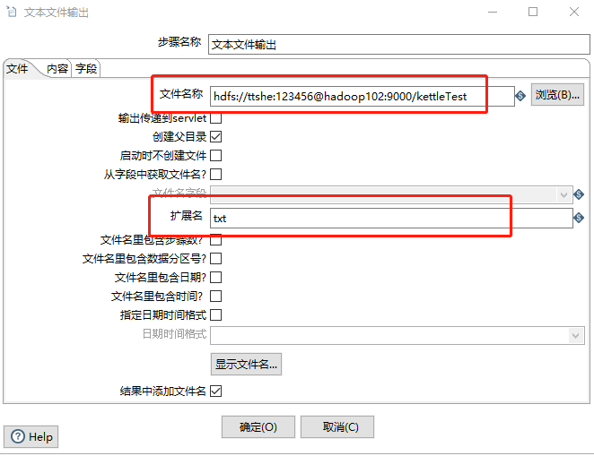

- 点击获取字段，设置格式宽度，防止oom

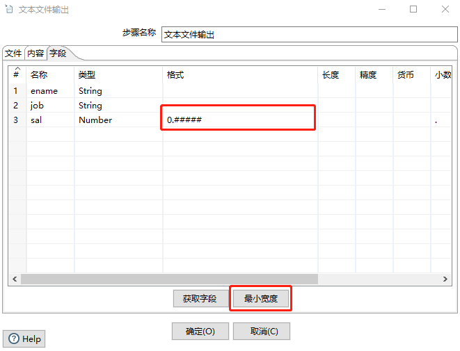

- 保存并运行查看hdfs

- 运行出错
  - 权限问题解决办法
    - 添加用户，分配权限，修改权限
      - hadoop fs -mkdir /kettle
      - hadoop fs -chown admin:hdfs /kettle
      - hadoop fs -chmod -R 777 /


### 方式2操作

- 类似于方式1，将输出的文件改为hadoopfile
  - 只能输出到hdfs

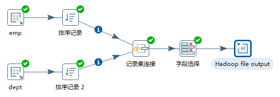

- 点击配置

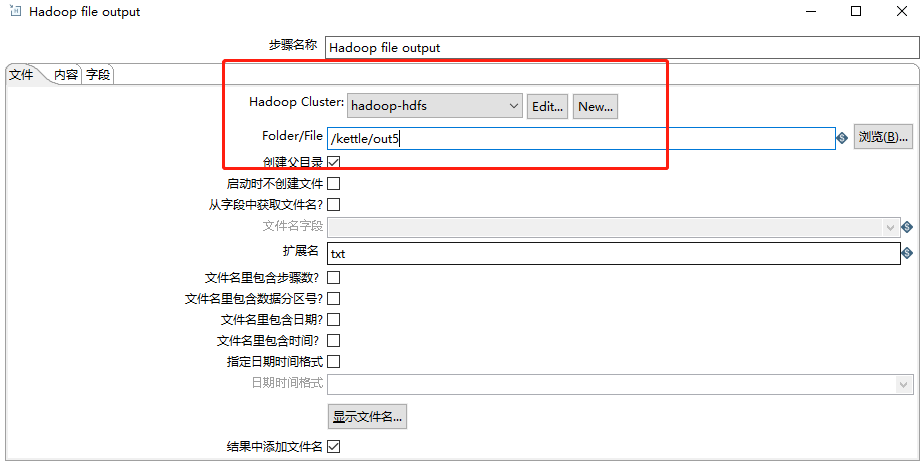

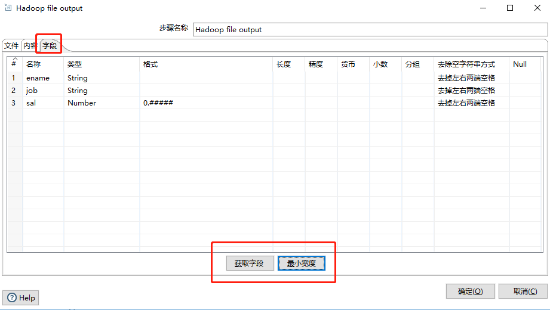

- 保存并执行


## 示例4：hdfs2hbase

- 读取hdfs文件并将sal大于1000的数据保存到hbase中


### 方式1操作

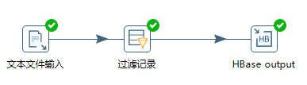

- 配置读取的文件流

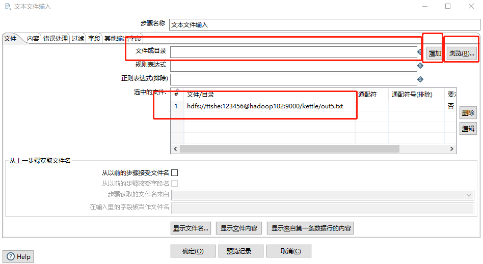


- 配置流程：过滤记录
  - 点击黑框配置过滤条件

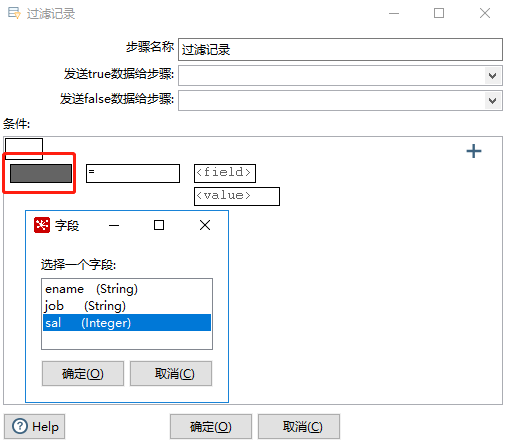

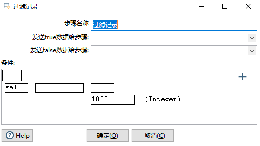

- hbase创建表

```bash
[ttshe@hadoop102 ~]$ /opt/module/hbase/bin/hbase shell
hbase(main):004:0> create 'emp','info'
```

- 配置Big Data：Hbase output
  - 找到本地的hbase配置文件

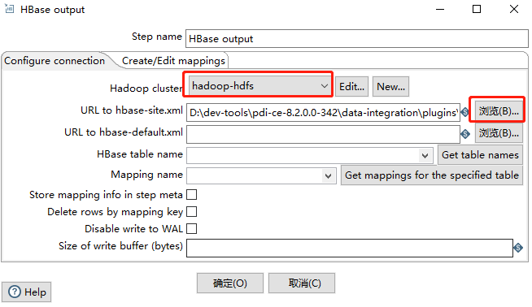

- 在配置Key时，type会丢失，需要重新配置
- 对于数值类型Hbase会存储成16进制，无法做判断，需要修改为String类型

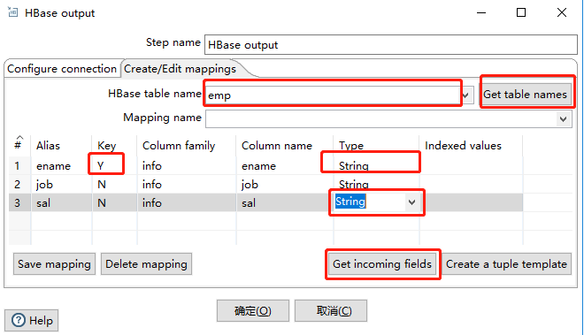

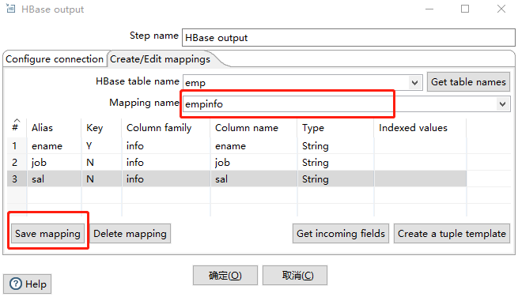

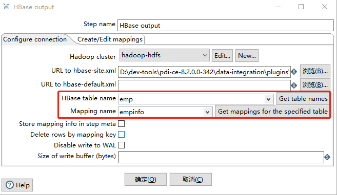

- 保存并执行
- 查看hbase是否成功

```bash
hbase(main):003:0> scan 'emp'
ROW      COLUMN+CELL                                             
ALLEN   column=info:job, timestamp=1576856019159, value=SALESMAN 
ALLEN   column=info:sal, timestamp=1576856019159, value=1600     
JONES   column=info:job, timestamp=1576856019152, value=MANAGER   
JONES   column=info:sal, timestamp=1576856019152, value=2975     
WARD    column=info:job, timestamp=1576856019162, value=SALESMAN 
WARD    column=info:sal, timestamp=1576856019162, value=1250
```


### 方式2操作

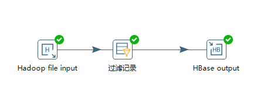

- 更换输入模块

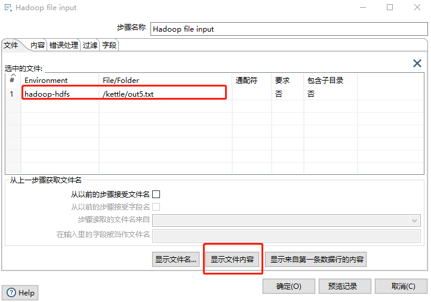

- 保存并执行


## 示例5：hdfs2hbase

- 创建一个job，组合之前2个转换完成

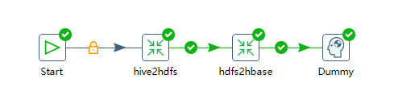

- 配置hive2hdfs

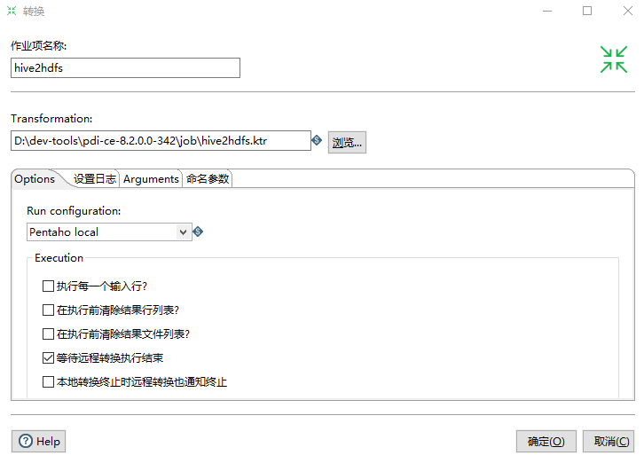

- 配置hdfs2hbase

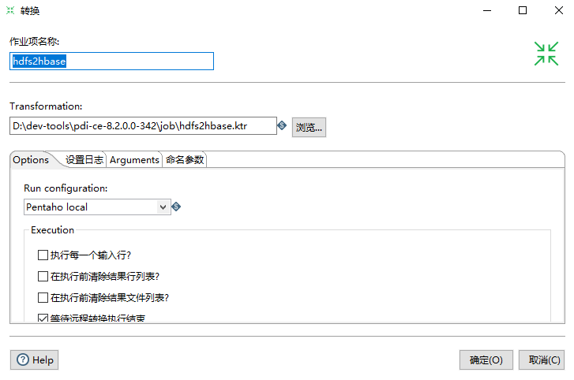


# 资源库

- 数据库资源库是将作业和转换相关的信息存储在数据库中，执行的时候直接去数据库读取信息，很容易跨平台使用
- 将job和transform放到资源库中，共享调用
- 一般资源库使用数据库方式


## 数据库方式

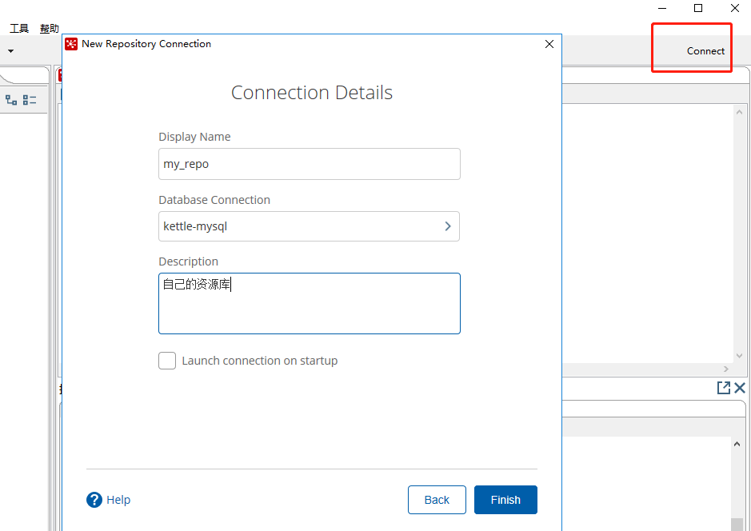

- 配置数据库连接

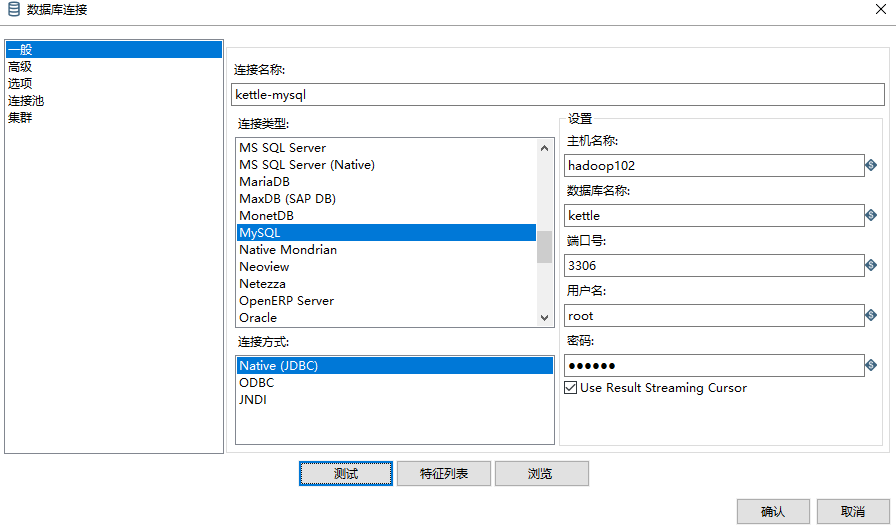

- 登录，用户名/密码：admin/admin

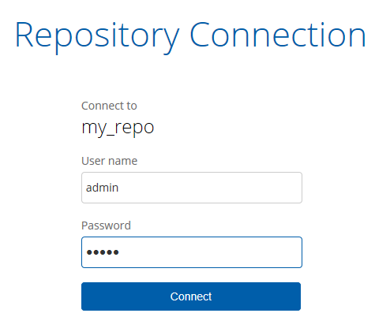

- 点击文件：打开
  - 点击文件：从XML文件中导入
  - 保存后会提示到数据库

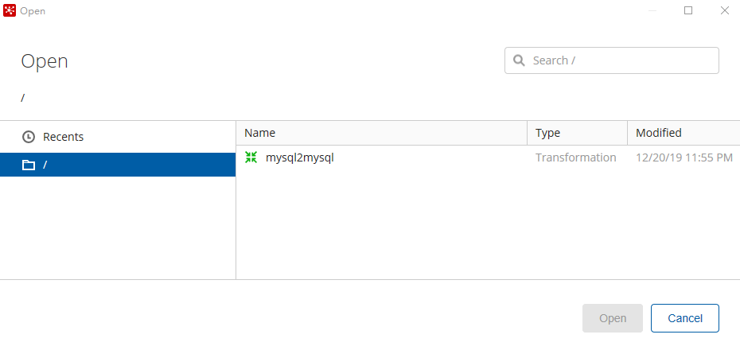


## 文件方式

...


# 命令行操作


## 执行转换

- 在linux上操作提交transform

```bash
[ttshe@hadoop102 data-integration]$./pan.sh -rep=my_repo -user=admin -pass=admin -trans=hive2hdfs_2 -dir=/
```

参数说明：

-rep         资源库名称

-user        资源库用户名

-pass        资源库密码

-trans       要启动的转换名称

-dir         目录(不要忘了前缀 /)


## 执行job

```bash
[ttshe@hadoop102 data-integration]$./pan.sh -rep=my_repo -user=admin -pass=admin -job=jobDemo -logfile=./log/log.txt -dir=/
```

参数说明：

-rep - 资源库名

-user - 资源库用户名

-pass – 资源库密码

-job – job名

-dir – job路径

-logfile – 日志目录


# 集群模式

- master节点负责调度
- slave节点负责执行


## 配置

1) 准备三台服务器，hadoop102作为Kettle主服务器，服务器端口号为8080，hadoop103和hadoop104作为两个子服务器，端口号分别为8081和8082。

2) 安装部署jdk

3) hadoop完全分布式环境搭建，并启动进程(因为要使用hdfs)

4) 上传解压kettle的安装包

5) 进到/opt/module/data-integration/pwd目录，修改配置文件

- 修改主服务器配置文件carte-config-master-8080.xml

```xml
<slaveserver>
    <name>master</name>
    <hostname>hadoop102</hostname>
    <port>8080</port>
    <master>Y</master>
    <username>cluster</username>
    <password>cluster</password>
</slaveserver>
```

- 修改从服务器配置文件carte-config-8081.xml

```xml
<masters>
    <slaveserver>
        <name>master</name>
        <hostname>hadoop102</hostname>
        <port>8080</port>
        <username>cluster</username>
        <password>cluster</password>
        <master>Y</master>
    </slaveserver>
</masters>
<report_to_masters>Y</report_to_masters>
<slaveserver>
    <name>slave1</name>
    <hostname>hadoop103</hostname>
    <port>8081</port>
    <username>cluster</username>
    <password>cluster</password>
    <master>N</master>
</slaveserver>
```

- 修改从配置文件carte-config-8082.xml

```xml
<masters>
    <slaveserver>
        <name>master</name>
        <hostname>hadoop102</hostname>
        <port>8080</port>
        <username>cluster</username>
        <password>cluster</password>
        <master>Y</master>
    </slaveserver>
</masters>
<report_to_masters>Y</report_to_masters>
<slaveserver>
    <name>slave2</name>
    <hostname>hadoop104</hostname>
    <port>8082</port>
    <username>cluster</username>
    <password>cluster</password>
    <master>N</master>
</slaveserver>
```

- 分发整个kettle的安装目录

```bash
xsync data-integration
```

- 启动相关进程，在hadoop102,hadoop103,hadoop104上执行
  - 先启动master，再启动slave

```bash
[ttshe@hadoop102 data-integration]$./carte.sh hadoop102 8080
[ttshe@hadoop103 data-integration]$./carte.sh hadoop103 8081
[ttshe@hadoop104 data-integration]$./carte.sh hadoop104 8082
```

- 访问web页面http://hadoop102:8080
  - 用户名/密码：cluster/cluster


## 示例

- 读取hive中的emp表，根据id进行排序，并将结果输出到hdfs上
- 注意：因为涉及到hive和hbase的读写，需要修改相关配置文件
  - 修改解压目录下的data-integration\plugins\pentaho-big-data-plugin下的plugin.properties，设置active.hadoop.configuration=hdp26，并将如下配置文件拷贝到data-integration\plugins\pentaho-big-data-plugin\hadoop-configurations\hdp26下

- 创建转换，编辑步骤，填好相关配置

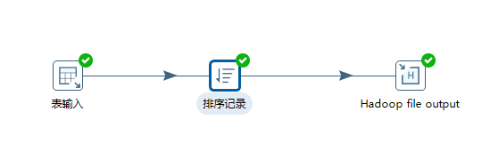

- 创建子服务器，填写相关配置，跟集群上的配置相同

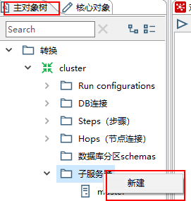

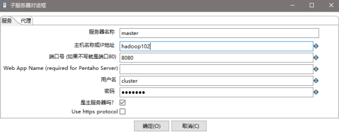


- 创建集群schema，选中上一步的几个服务器

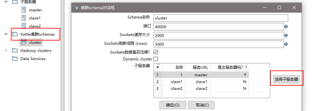


- 对于要在集群上执行的==模块==，右键选择集群，选中上一步创建的集群schema

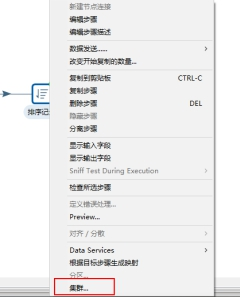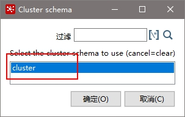 


- 创建Run Configuration,选择集群模式，直接运行

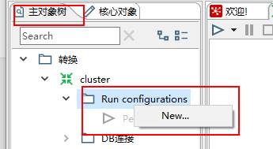

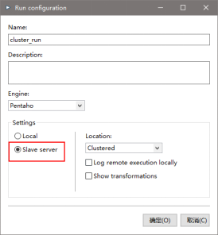


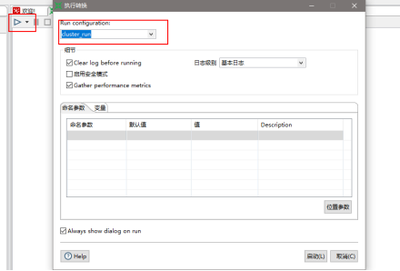


# 调优

- 调整JVM大小进行性能优化，修改Kettle根目录下的Spoon脚本


- 参数参考
  - -Xmx1024m：设置JVM最大可用内存为1024M
  - -Xms512m：设置JVM促使内存为512m
    - 此值可以设置与-Xmx相同，以避免每次垃圾回收完成后JVM重新分配内存
    - xmx与xms设置相同，防止fullgc，fullgc会全局暂停，设置相同则减少fullgc次数
  - -Xmn2g：设置年轻代大小为2G。整个JVM内存大小=年轻代大小 + 年老代大小 + 持久代大小。持久代一般固定大小为64m，所以增大年轻代后，将会减小年老代大小。此值对系统性能影响较大，Sun官方推荐配置为整个堆的3/8
  - -Xss128k：设置每个线程的堆栈大小。JDK5.0以后每个线程堆栈大小为1M，以前每个线程堆栈大小为256K。更具应用的线程所需内存大小进行调整。在相同物理内存下，减小这个值能生成更多的线程。但是操作系统对一个进程内的线程数还是有限制的，不能无限生成，经验值在3000~5000左右。

- 调整提交（Commit）记录数大小进行优化，Kettle默认Commit数量为：1000，可以根据数据量大小来设置Commitsize：1000~50000

- 尽量使用数据库连接池
- 尽量提高批处理的commit size
- 尽量使用缓存，缓存尽量大一些（主要是文本文件和数据流）；

- Kettle是Java做的，尽量用大一点的内存参数启动Kettle；

- 可以使用sql来做的一些操作尽量用sql
  - Group , merge , stream lookup,split field这些操作都是比较慢的，想办法避免他们
  - 能用sql就用sql

- 插入大量数据的时候尽量把索引删掉
- 尽量避免使用update , delete操作，尤其是update
  - 如果可以把update变成先delete,  后insert

- 能使用truncate table的时候，就不要使用deleteall row这种类似sql合理的分区，如果删除操作是基于某一个分区的，就不要使用delete row这种方式（不管是deletesql还是delete步骤）,直接把分区drop掉，再重新创建
- 尽量缩小输入的数据集的大小
  - 增量更新也是为了这个目的
- 尽量使用数据库原生的方式装载文本文件(Oracle的sqlloader, mysql的bulk loader步骤)
- 尽量不要用kettle的calculate计算步骤，能用数据库本身的sql就用sql ,不能用sql就尽量想办法用procedure,实在不行才是calculate步骤
- 要知道你的性能瓶颈在哪，可能有时候你使用了不恰当的方式，导致整个操作都变慢，观察kettle log生成的方式来了解你的ETL操作最慢的地方
- 远程数据库用文件+FTP的方式来传数据，文件要压缩。（只要不是局域网都可以认为是远程连接）


# 问题


## 异常：模块名中文乱码

- 注意，所有的模块命名要是英文

- 若报错没有权限往hdfs写文件
  - 在Spoon.bat中第119行添加参数"-DHADOOP_USER_NAME=ttshe" "-Dfile.encoding=UTF-8"，注意每个“”之间添加空格


## 异常：在使用kettle的spoon界面时，大家都遇见过怎么资源库里的按钮都是灰色的并且spoon界面右上角的connect按钮不见了

- 解决方法
  - 找到.kettle目录
  - 把这个目录下的repositories.xml，.spoonrc文件和db.cache文件都删掉
  - 重启
- 原因
  - 创建资源库时不要使用中文
  - 在配置资源库时使用中文，可能导致repositories.xml出现乱码
  - 导致你为了解决connect按钮不见的问题不断的删除文件重启kettle


## 错误：No suitable driver found for jdbc:hive2://hadoop102:10000/default

- 需要清空执行缓存

```bash
[ttshe@hadoop102 karaf]$ rm -rf caches/
[ttshe@hadoop102 karaf]$ pwd
/opt/module/kettle/data-integration/system/karaf
```


