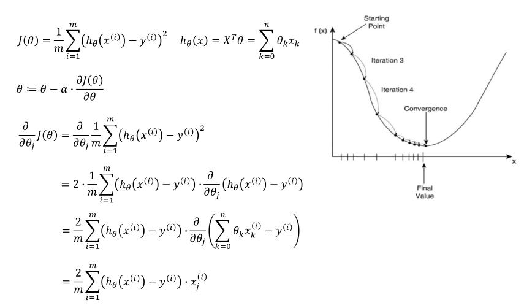
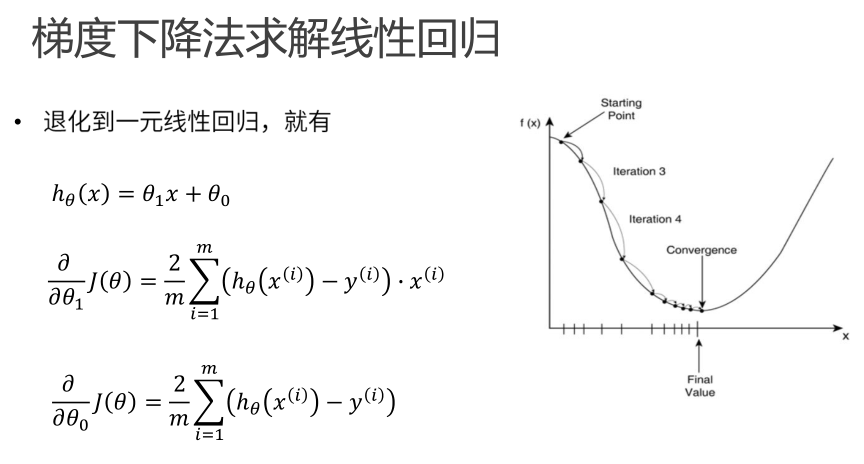

# 简单线性回归-梯度下降法






### 0.引入依赖


```python
import numpy as np
import matplotlib.pyplot as plt
```


### 1.导入数据 


```python
points = np.genfromtxt('data.csv',delimiter=',') # 解析的是一个2*2矩阵

x = points[:,0]# 获取第一列所有元素
y = points[:,1]# 获取第二列所有元素

# 提取points中的2列数据，画图
plt.scatter(x,y)
plt.show()
```


### 2.定义损失函数 


```python
# 损失函数式系数的函数，还要传入数据的x,y
def compute_cost(w, b, points):
    total_cost = 0
    M = len(points)
    
    # 逐点计算平方误差，然后求平均数
    for i in range(M):
        x = points[i, 0]
        y = points[i, 1]
        total_cost += (y - w * x - b) ** 2
    # python的除法计算后是一个浮点型 如果要取整数，如 1//3 = 0     
    return total_cost / M 
```


### 3.定义模型的超参数


```python
alpha = 0.0001
init_w = 0 # 可以随机生成，最后查看各个随机的点的损失函数哪个最小
init_b = 0
num_iter = 10 # 迭代次数
```


### 4.定义核心梯度下降算法函数


```python
def grad_desc(points,init_w,init_b,alpha,num_iter):
    w = init_w
    b = init_b
    # 用于显示所有的损失函数的值，显示下降的过程
    cost_list = []
    w_b_list=[]
    for i in range(num_iter):
        cost_list.append(compute_cost(w, b, points))
        w_b_list.append((w,b))
        # 计算每一步梯度下降的结果值
        w, b = step_grad_desc(points, w, b, alpha)
        
    return w, b, cost_list,w_b_list
        
def step_grad_desc(points, w, b, alpha):
    M = len(points)
    sum_grad_w = 0
    sum_grad_b = 0
    for i in range(M):
        x = points[i, 0]
        y = points[i, 1]
        
        sum_grad_w += (w * x + b - y) * x
        sum_grad_b += (w * x + b - y)
        
    # 用公式求当前梯度
    current_w = w - alpha * 2 / M * sum_grad_w 
    current_b = b - alpha * 2 / M * sum_grad_b
    return current_w, current_b
```


```python
w, b, cost_list ,w_b_list = grad_desc(points,init_w,init_b,alpha,num_iter)
print("w is ",w)
print("b is ",b)

cost = compute_cost(w, b, points)
print("cost is ",cost)
```

    w is  1.4774173755483797
    b is  0.029639347874732377
    cost is  112.65585181499748

- 从结果中cost逼近最小二乘法的结果

```python
# 绘制cost的代价曲线，最后趋于稳定
plt.plot(cost_list)
plt.show()
```


### 5.绘制拟合曲线

- 10次迭代，不断贴合


```python
plt.scatter(x, y)
list_len = len(w_b_list)
print("len is ",list_len)
for i in range(list_len):
    item = w_b_list[i]
    plt.plot(x,x* item[0]+item[1],'--')

plt.show()
```

    len is  10


```python
plt.scatter(x, y)
pred_y = x * w + b
plt.plot(x,pred_y,c='r')

plt.show()
```


