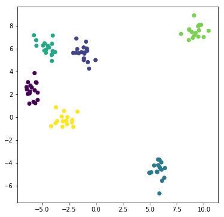

# k means 算法


### 0.引入依赖


```python
import numpy as np
import matplotlib.pyplot as plt

# 从sklearn 中直接生成聚类数据
from sklearn.datasets.samples_generator import make_blobs
```


### 1.加载数据


```python
# 创建100个点，6个中心点，随机因子，聚类的标准差（生成的点偏差多大）
# x, y = make_blobs(n_samples = 100, centers = 6, random_state=33, cluster_std=0.6)
x, y = make_blobs( n_samples=100, centers=6, random_state=1234, cluster_std=0.6 )
# x 是二维数组，100个元素，每个元素2个坐标
# y 是一维数组，表示结果  
print(x.shape, y.shape)
```

    (100, 2) (100,)


### 2.绘制图像


```python
# 指定画布大小
plt.figure(figsize = (6,6))
# c = y 指定 c颜色的种类，按照y数组进行划分
plt.scatter(x[:,0],x[:,1],c=y)
plt.show()
```





### 3.算法实现


```python
# 使用np.array，转换为np的array读写
arr = np.array([1,2,3])
print(arr)
print(arr.shape)
arr
```

    [1 2 3]
    (3,)
    array([1, 2, 3])


```python
# 引入scipy中的距离函数，默认欧式距离
from scipy.spatial.distance import cdist

class K_Means(object):
    # 初始化，参数 n_cluster(K) ，迭代次数 max_iter， 初始质心 centroids
    def __init__(self, n_cluster = 6, max_iter = 300, centroids = []):
        self.n_cluster = n_cluster
        self.max_iter = 300
        #使用np.array，转换为np的array读写
        self.centroids = np.array( centroids, dtype = np.float )
    
    # 训练模型的方法，k-means聚类过程，传入原始数据
    def fit(self, data):
        # 如果没有指定初始质心，随机选取data中的点作为初始质心
        if(self.centroids.shape == (0,)):
            # 从data中获取随机0到data行数的 n_cluster 个随机索引值
            self.centroids = data[ np.random.randint( 0, data.shape[0], self.n_cluster ) ,:]
        
        # 开始迭代计算
        for i in range(self.max_iter):
            # 计算距离矩阵，得到一个100*6的矩阵
            # 100个点与6个质点的距离
            # 如[[2,3,4,5,6],[4,3,5,6,7]...]
            distances = cdist(data, self.centroids)
            
            # 对距离按有近到远排序，选取最近的质心点的类别，作为当前点的分类
            # 得到最小距离，形成100*1的矩阵，值是最小距离的索引
            # axis =1 ：压缩列，对各行求均值，返回 m *1 矩阵
            # 如 [0,1...]
            c_index = np.argmin(distances, axis = 1)
            
            # 对每一类质心点进行均值计算，更新质心点的坐标
            for j in range(self.n_cluster):
                # 排除掉没有出现在c_index里的类别
                if j in c_index :
                    # 选出所有类别是j的点，取data里面坐标的均值，更新第j个质心
                    # c_index == j 可以形成一个boolean数组 j=0 时 [true,false...]
                    # data 通过传入的数组返回为true形成的新数组
                    # 得到的数组就是 归类为标号0的 所有点
                    data_true = data[c_index == j]
                    # 对一个标号下所有的点求坐标平均值
                    # axis = 0：压缩行，对各列求均值，返回 1* n 矩阵
                    self.centroids[j] = np.mean(data_true, axis = 0)
                     
    # 实现预测方法
    def predict(self, samples):
        # 计算距离
        distance = cdist(samples,self.centroids)
        # 选取距离最近的那个质心的类别
        c_index = np.argmin(distance, axis = 1)
        return c_index
```


### 4.测试


```python
# 定义绘制图像的函数
def plotKMeans(x, y, centroids, subplot, title):
    # 分配子图显示，subplot = 121表示 1行2列的子图的第一个，固定写法
    plt.subplot(subplot)
    plt.scatter(x[:,0], x[:,1], c='r')
    # 绘制质心点
    plt.scatter(centroids[:,0], centroids[:,1], c=np.array(range(len(centroids))), s=100)
    plt.title(title)
```


```python
kmeans = K_Means(max_iter= 500 , centroids=np.array([[2,1],[2,2],[2,3],[2,4],[2,5],[2,6]]))


plt.figure(figsize=(16, 6))
plotKMeans(x, y, kmeans.centroids, 121, "inital state")

#开始聚类操作
kmeans.fit(x)

plotKMeans(x, y, kmeans.centroids, 122, "final state")


# 预测
x_new = np.array([[6,-4],[0,0]])
y_pred = kmeans.predict(x_new)
print(kmeans.centroids)
print(y_pred)

plt.scatter(x_new[:,0], x_new[:,1], s=100, c='black')
```

    [[ 5.76444812 -4.67941789]
     [-2.89174024 -0.22808556]
     [-5.89115978  2.33887408]
     [-4.53406813  6.11523454]
     [-1.15698106  5.63230377]
     [ 9.20551979  7.56124841]]
    [0 1]


- 注意：初始质心点的选择尤为重要，可以决定是否能正确分类的关键