# 监督学习

## 回归模型

### 线性回归

#### 一元线性回归

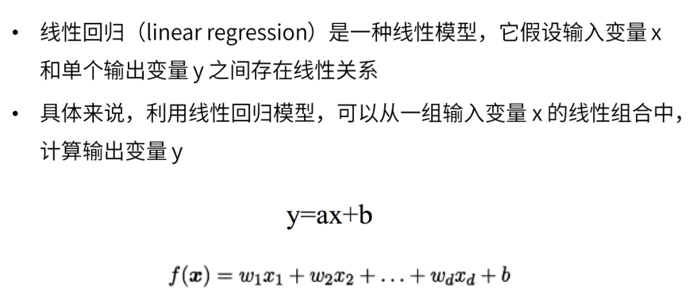

#### 多元线性回归

#### 最小二乘法

- 求解线性回归函数的方法

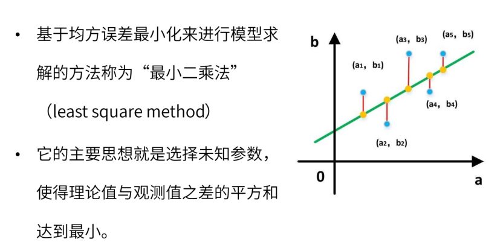

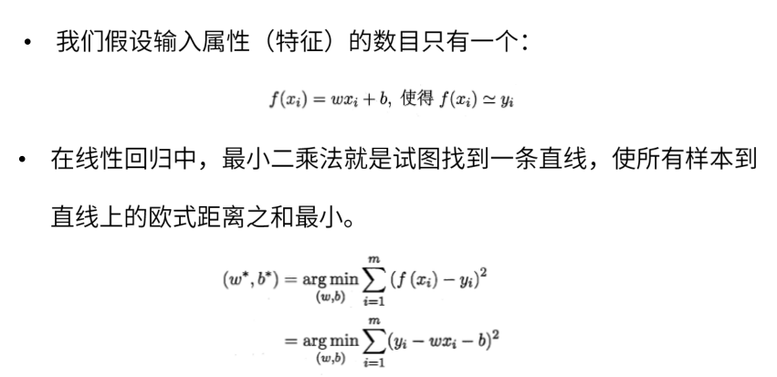

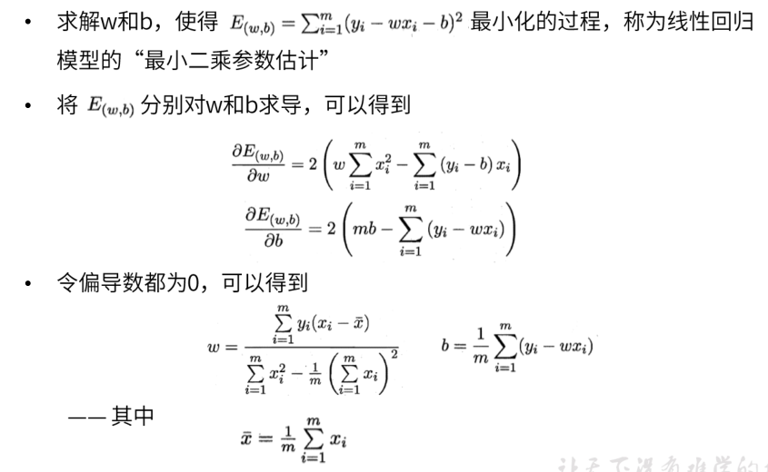

#### 梯度下降法

- 对于多元线性回归，采用最小二乘法特别复杂，一般使用梯度下降法实现
- 梯度下降法求得近似解

##### 求一元线性回归

##### 注意事项

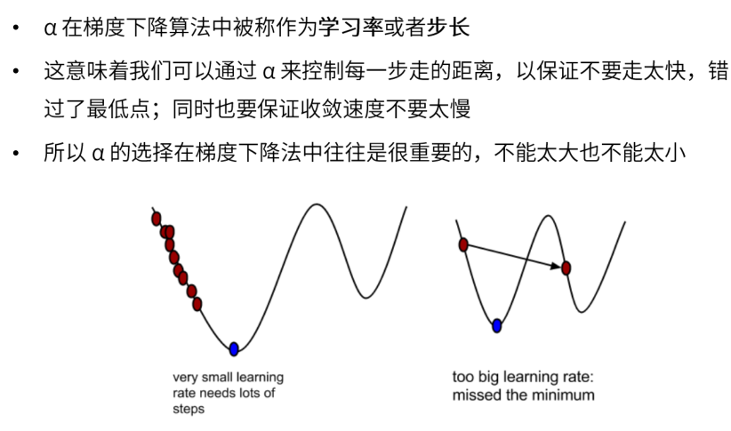

##### 与最小二乘法区别

## 分类模型

### k近邻 KNN

#### 示例

#### 距离计算

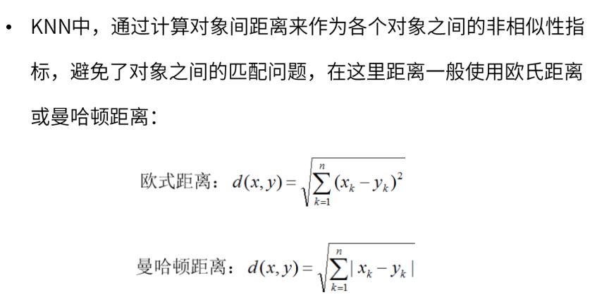

#### 算法

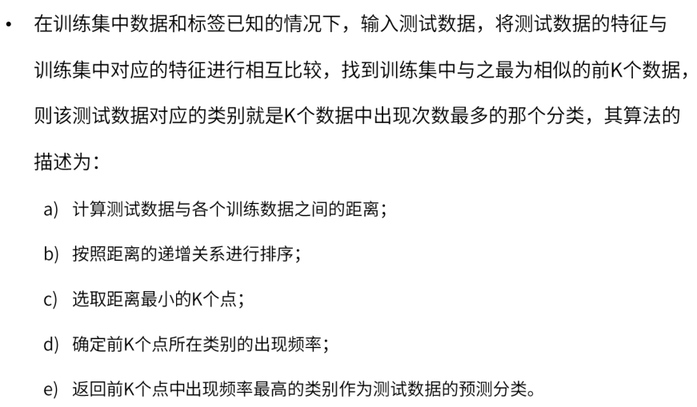

### 逻辑斯蒂回归

#### 线性回归解决分类问题

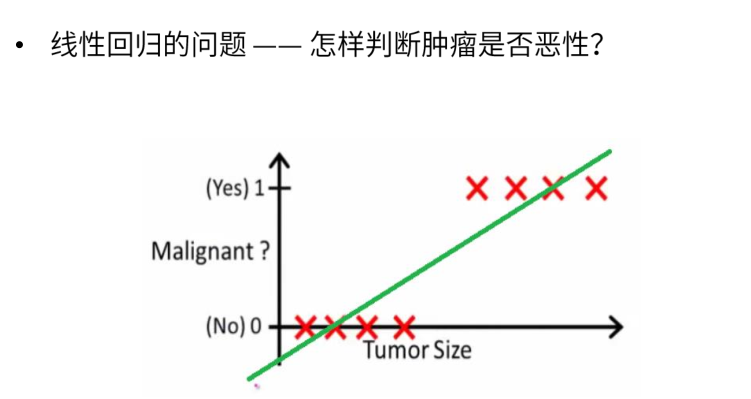

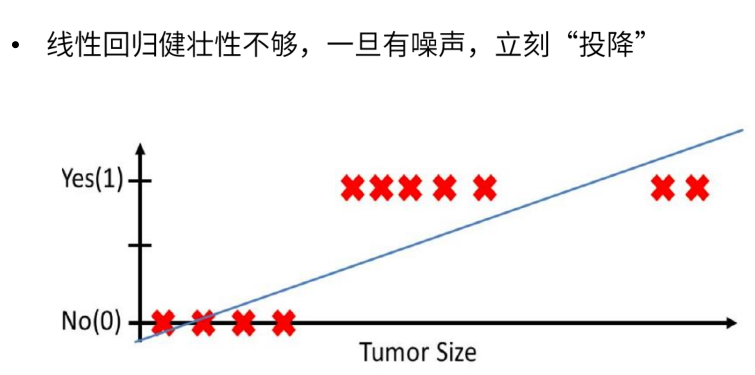

#### 使用逻辑回归解决分类问题

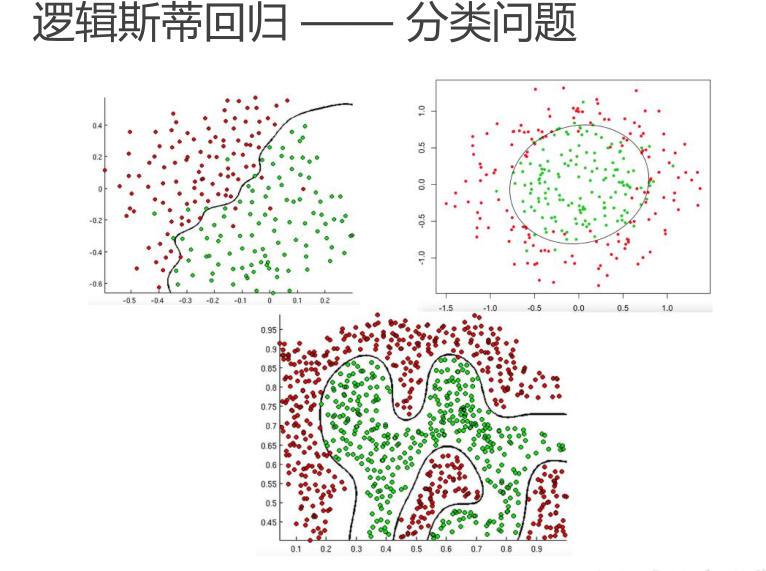

##### 压缩函数 sigmoid

- 使用压缩函数的特性对原先的函数进行结果判断
- 结果只有2种

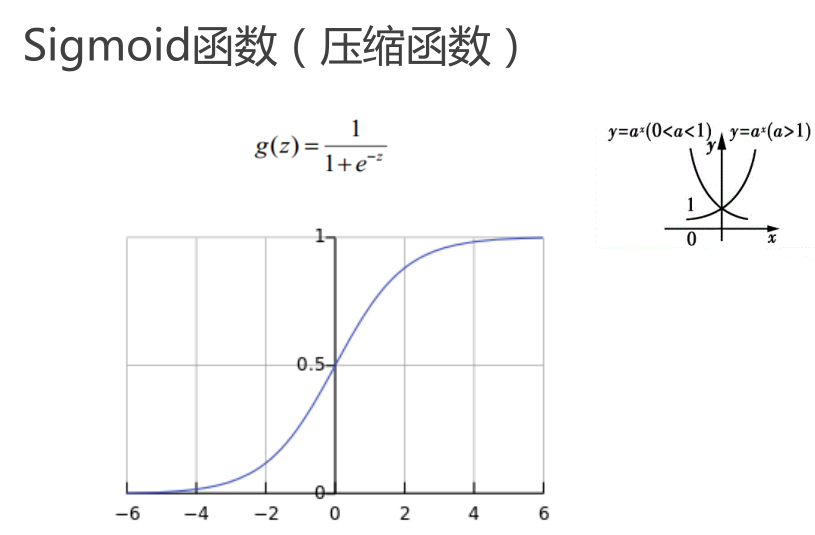

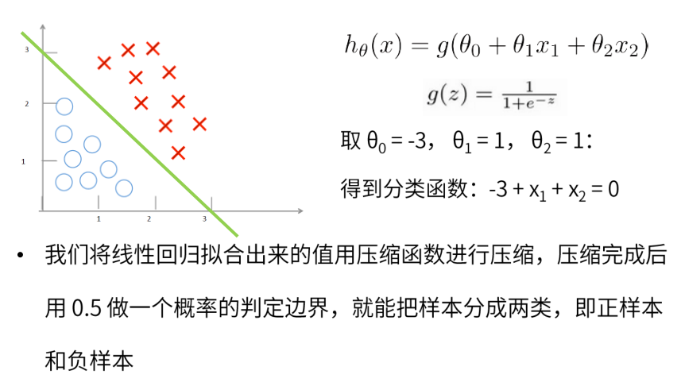

##### 逻辑斯蒂回归损失函数

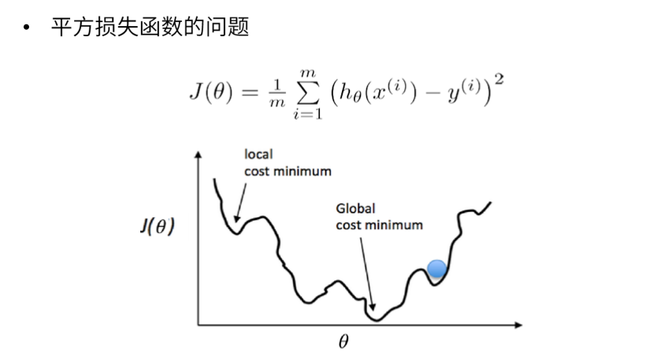

- 使用平方损失函数计算，对于复杂的曲线只能使用梯度下降处理，容易出现局部最小值，获得不到全局最小值

  - 平方损失函数适用于凸函数，可以使用梯度下降近似获得全局最小值

  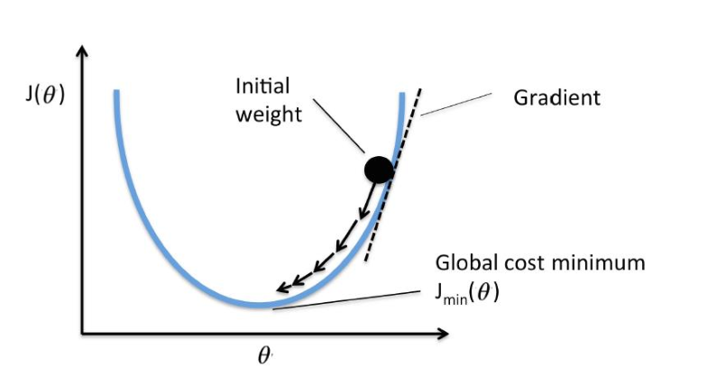

###### 引入新的损失函数

###### 使用梯度下降求解

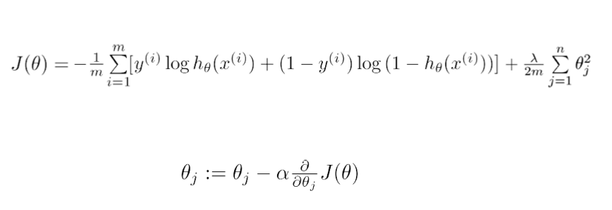

### 决策树

#### 示例

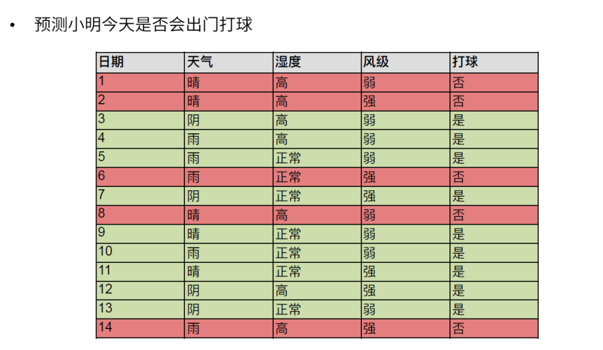

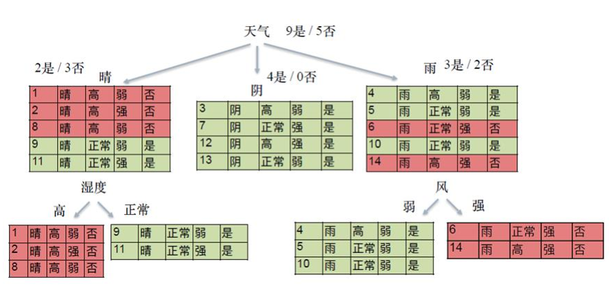

#### if-then 规则

- 互斥且完备
  - 互斥，条件互斥
  - 完备，条件全集

#### 目标

#### 特征选择

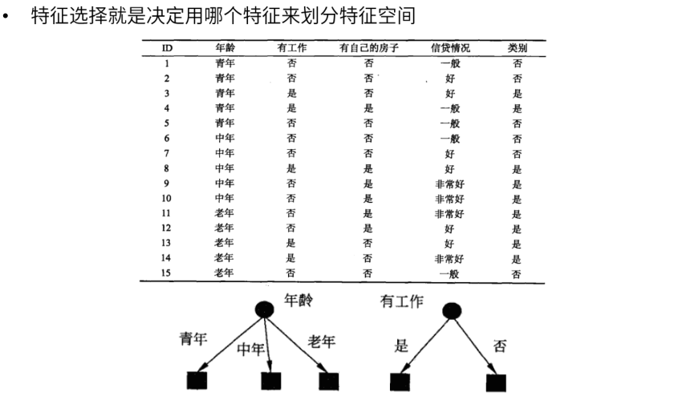

#### 随机变量

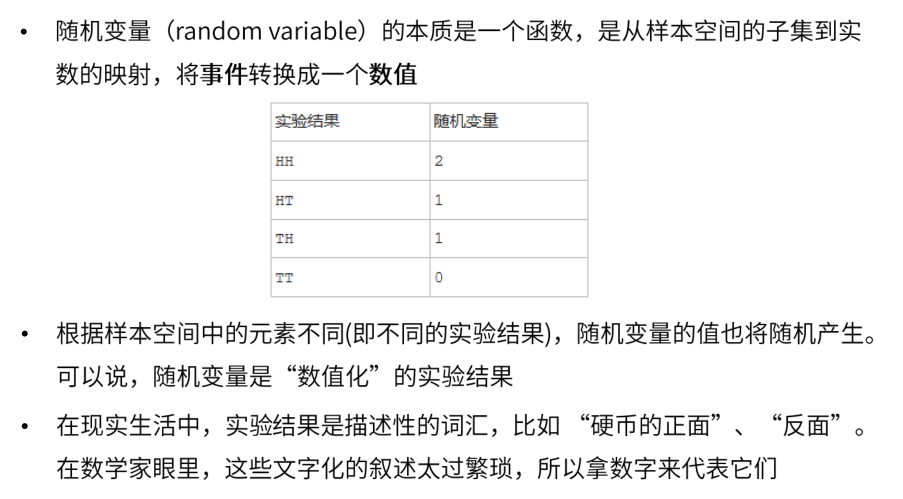

- HH表示2次正面，TT表示2次反面

#### 熵

##### 示例

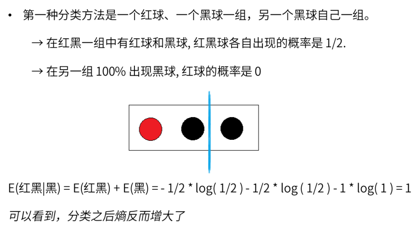

#### 目标

#### 条件熵

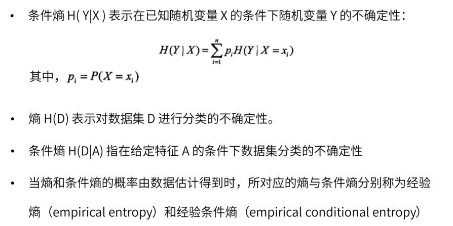

#### 信息增益

- 评判标准
  - 求信息增益的最大值

#### 生成算法

- 剪枝
  - 防止过拟合

# 无监督学习

- 聚类
  - K 均值
  - 基于密度的聚类
  - 最大期望聚类
- 降维
  - 潜语义分析 LSA
  - 主成分分析 PCA
  - 奇异值分解 SVD

## 聚类

### k 均值 k-means

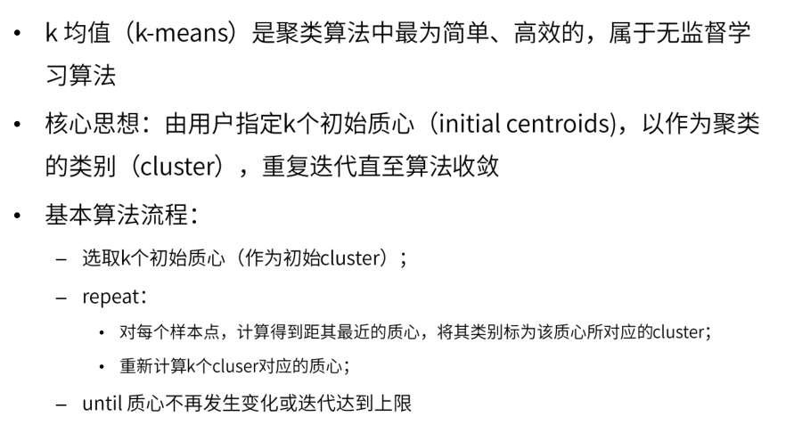

## 降维

