# 常用推荐算法分类


## 基于人口统计学的推荐 DB

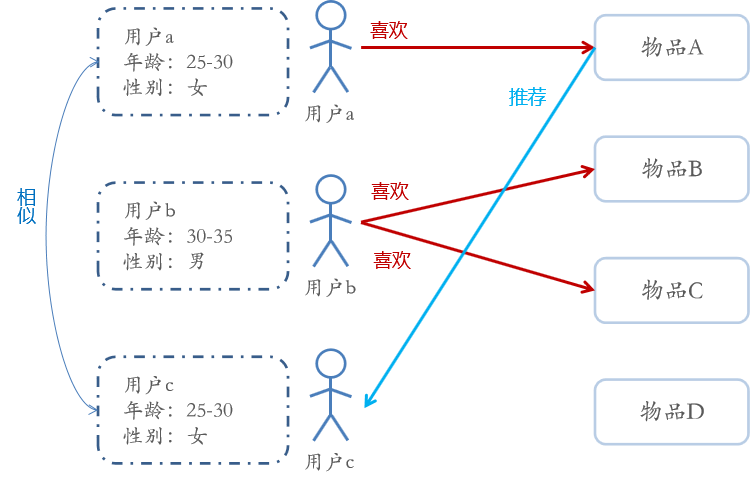

- 基于人口统计学的推荐机制（Demographic-based Recommendation）是一种最易于实现的推荐方法，它只是简单的根据系统用户的基本信息发现用户的相关程度，然后将相似用户喜爱的其他物品推荐给当前用户
- 对于没有明确含义的用户信息（比如登录时间、地域等上下文信息），可通过**聚类**等手段，给用户打上分类标签
- 对于特定标签的用户，又可根据预设的规则（知识）或者模型，推荐出对应的物品
- 用户信息标签化的过程一般又称为**用户画像（User Profiling）**


### 用户画像

- 用户画像（User Profile）就是企业通过收集与分析消费者社会属性、生活习惯、消费行为等主要信息的数据之后，完美地抽象出一个用户的商业全貌作是企业应用大数据技术的基本方式
- 用户画像为企业提供了足够的信息基础，能够帮助企业快速找到精准用户群体以及用户需求等更为广泛的反馈信息
- 作为大数据的根基，它完美地抽象出一个用户的信息全貌，为进一步精准、快速地分析用户行为习惯、消费习惯等重要信息，提供了足够的数据基础


## 基于内容的推荐 CB

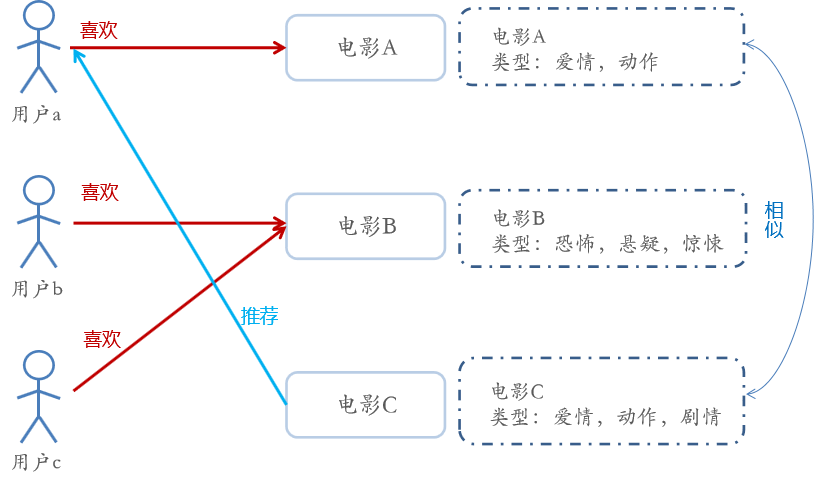

- Content-based Recommendations (CB) 根据推荐物品或内容的元数据，发现物品的相关性，再基于用户过去的喜好记录，为用户推荐相似的物品
- 通过抽取物品内在或者外在的**特征值**，实现相似度计算
  - 如一个电影，有导演、演员、用户标签UGC、用户评论、时长、风格等等，都可以算是特征
- 将用户（user）个人信息的特征（基于喜好记录或是预设兴趣标签），和物品（item）的特征相匹配，就能得到用户对物品感兴趣的程度
  - 在一些电影、音乐、图书的社交网站有很成功的应用
  - 有些网站还请专业的人员对物品进行基因编码/打标签（PGC）


### 相似度计算

- 相似度的评判，可以用距离表示，而一般更常用的是“余弦相似度”

- 欧式距离

  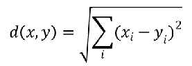

- 余弦相似度

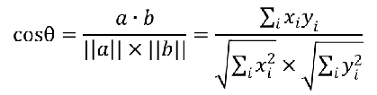

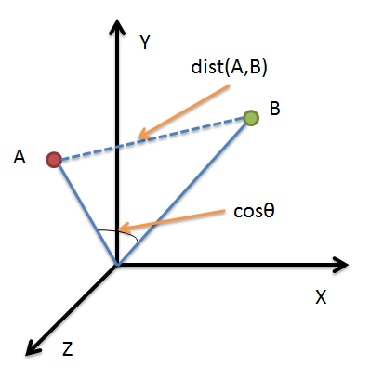

- 对于物品的特征提取 —— 打标签（tag）
  - 专家标签（PGC）
  - 用户自定义标签（UGC）
  - 降维分析数据，提取隐语义标签（LFM）
- 对于文本信息的特征提取 —— 关键词
  - 分词、语义处理和情感分析（NLP）
  - 潜在语义分析（LSA）


### 结构


- 信息源
- 内容分析
  - 数据的预处理，特征工程的一部分
- 结构化的物品描述
  - 等价于输入
- 特征学习
  - 构建模型
  - 收集物品的信息
  - 与用户的偏好数据进行对应
  - 将物品的特征与用户的特征进行匹配

- 过滤组件
- 反馈
  - 收集用户的反馈
    - 如是否点击了推荐，或者点赞


### 特征工程

- 在进行特征学习之前的准备工作

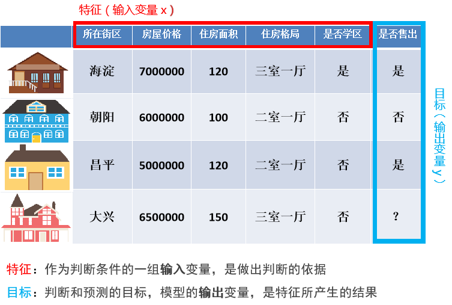


- 特征 （feature）
  - 数据中抽取出来的对结果预测有用的信息
- 特征的个数就是数据的观测维度
- 特征工程是使用专业背景知识和技巧处理数据，使得特征能在机器学习算法上发挥更好的作用的过程
- 特征工程一般包括特征清洗（采样、清洗异常样本），特征处理和特征选择
  - 对噪音数据进行过滤，防止过拟合
  - 特征是否发散，发散的特征可以有效的提高模型的准确率
- 特征按照不同的数据类型分类，有不同的特征处理方法
  - 数值型
  - 类别型
  - 时间型
  - 统计型


#### 数值特征处理

- 用连续数值表示当前维度特征，通常会对数值型特征进行数学上的处理，主要的做法是
  - 归一化
  - 离散化


##### 幅度调整/归一化

- 特征与特征之间应该是平等的，区别应该体现在特征内部
  - 如房屋价格和住房面积的幅度是不同的，房屋价格可能在3000000 ~ 15000000（万）之间，而住房面积在40~300（平方米）之间，那么明明是平等的两个特征，输入到相同的模型中后由于本身的幅值不同导致产生的效果不同，这是不合理的

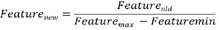

| 所在街区 | 房屋价格                 | 住房面积        | 住房格局     | 是否学区 | 是否售出 |
| -------- | ------------------------ | --------------- | ------------ | -------- | -------- |
| **海淀** | **7000000/2000000=3.5**  | **120/50 =2.4** | **三室一厅** | **是**   | **是**   |
| **朝阳** | **6000000/2000000=3**    | **100/50 =2**   | **二室一厅** | **否**   | **否**   |
| **昌平** | **5000000/2000000=2.5**  | **120/50=2.4**  | **二室一厅** | **否**   | **是**   |
| **大兴** | **6500000/2000000=3.25** | **150/50=3**    | **三室一厅** | **否**   | **？**   |


##### 离散化

- 将原始连续值切断，转化为离散值

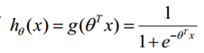

- 让座问题：假设我们要训练一个模型判断在公交车上应不应该给一个人让座，按照常理，应该是给年龄很大和年龄很小的人让座
  - 对于以上让座问题中的年龄特征，对于一些模型，假设模型为 y = θx，输入的 x（年龄）对于最后的贡献是正/负相关的，即 x 越大越应该让座，但很明显让座问题中，年龄和是否让座不是严格的正相关或者负相关，这样只能兼顾年龄大的人，无法兼顾年龄大的人和年龄小的人
  - 对于让座问题，我们可以使用阈值将年龄进行分段，将一个 age 特征分为多个特征，将连续值离散化

|      | **1 ~ 10** | **11** **~ 20** | **21 ~ 30** | **31 ~ 40** | **41 ~ 50** | **50** **~ 100** |
| ---- | ---------- | --------------- | ----------- | ----------- | ----------- | ---------------- |
| 25   | 0          | 0               | 1           | 0           | 0           | 0                |
| 60   | 0          | 0               | 0           | 0           | 0           | 1                |

- 在电商中，每个人对于价格的喜好程度不同，但它不一定是严格的正相关或负相关，某些人可能就喜欢某一价格段内的商品

- 离散化的两种方式
  - 等步长
    - 简单但不一定有效
  - 等频
    - min  ->  25%  ->  75%  ->  max
  - 两种方法对比
    - 等频的离散化方法很精准，但需要每次都对数据分布进行一遍从新计算，因为昨天用户在淘宝上买东西的价格分布和今天不一定相同，因此昨天做等频的切分点可能并不适用，而线上最需要避免的就是不固定，需要现场计算，所以昨天训练出的模型今天不一定能使用
    - 等频不固定，但很精准，等步长是固定的，非常简单，因此两者在工业上都有应用


#### 类别型特征处理

- 类别型数据本身没有大小关系，需要将它们编码为数字，但它们之间不能有预先设定的大小关系，因此既要做到公平，又要区分开它们，那么直接开辟多个空间
- One-Hot 编码/哑变量
  - 将类别型数据 平行地展开
  - 经过 One-Hot 编码/哑变量后，这个特征的空间会膨胀

- 示例

|      | Color_red | Color_yellow | Color_blue |
| ---- | --------- | ------------ | ---------- |
| 红   | 1         | 0            | 0          |
| 黄   | 0         | 1            | 0          |
| 蓝   | 0         | 0            | 1          |

| 格局     | 一室一厅 | 二室一厅 | 三室一厅 |
| -------- | -------- | -------- | -------- |
| 一室一厅 | 1        | 0        | 0        |
| 二室一厅 | 0        | 1        | 0        |
| 三室一厅 | 0        | 0        | 1        |

| 所在街区 | 房屋价格 | 住房面积 | 一室一厅 | 二室一厅 | 三室一厅 | 学区  | 非学区 | 是否售出 |
| -------- | -------- | -------- | -------- | -------- | -------- | ----- | ------ | -------- |
| **海淀** | **3.5**  | **2.4**  | **0**    | **0**    | **1**    | **1** | **0**  | 是       |
| **朝阳** | **3**    | **2**    | **0**    | **1**    | **0**    | **0** | **1**  | 否       |
| **昌平** | **2.5**  | **2.4**  | **0**    | **1**    | **0**    | **0** | **1**  | 是       |
| **大兴** | **3.25** | **3**    | **0**    | **0**    | **1**    | **0** | **1**  | ？       |


#### 时间类型特征处理

- 时间型特征既可以做连续值，又可以看做离散值

- 连续值
  - 持续时间（网页浏览时长）
  - 间隔时间（上一次购买/点击离现在的时间间隔）
- 离散值
  - 一天中哪个时间段
  - 一周中的星期几
  - 一年中哪个月/星期


#### 统计型特征处理

- 加减平均
  - 商品价格高于平均价格多少，用户在某个品类下消费超过多少
- 分位线
  - 商品属于售出商品价格的分位线处
- 次序性
  - 商品处于热门商品第几位
- 比例类
  - 电商中商品的好/中/差评比例


###   推荐系统常见反馈数据

| 用户行为          | 类型 | 特征                                                         | 作用                                                         |
| ----------------- | ---- | ------------------------------------------------------------ | ------------------------------------------------------------ |
| 评分              | 显式 | 整数量化的偏好，可能的取值是 [0, n]；n 一般取值为 5 或者是 10 | 通过用户对物品的评分，可以精确地得到用户偏好                 |
| 投票              | 显式 | 布尔量化的偏好，取值是 0 或 1                                | 通过用户投票，可以较精确地得到用户偏好                       |
| 转发              | 显式 | 布尔量化的偏好，取值是 0 或 1                                | 通过用户转发行为，可以精确地得到用户偏好。如果是站内，同时可以推理得到被转发人的偏好（不太精确） |
| 保存/收藏         | 显示 | 布尔量化的偏好，取值是 0 或 1                                | 通过收藏行为，可以精确地得到用户偏好。                       |
| 打标签 (Tag)      | 显示 | 一些单词，需要对单词进行分析，得到偏好                       | 通过分析用户打的标签，可以得到用户对项目的理解，同时可以分析出用户的情感：喜欢还是讨厌 |
| 评论              | 显示 | 一段文字，需要进行文本分析，得到偏好                         | 通过分析用户的评论，可以得到用户的情感：喜欢还是讨厌         |
| 点击浏览 ( 查看 ) | 隐式 | 一组用户的点击，用户对物品感兴趣，需要进行分析，得到偏好     | 用户的点击一定程度上反映了用户的注意力，所以它也可以从一定程度上反映用户的喜好。 |
| 页面停留时间      | 隐式 | 一组时间信息，噪音大，需要进行去噪，分析，得到偏好           | 用户的页面停留时间一定程度上反映了用户的注意力和喜好，但噪音偏大，不好利用。 |
| 购买              | 隐式 | 布尔量化的偏好，取值是 0 或 1                                | 购买行为可以很明确地说明用户感兴趣。                         |


## 基于 UGC 的推荐

- 用户用标签来描述对物品的看法，所以用户生成标签（UGC）是联系用户和物品的纽带，也是反应用户兴趣的重要数据源
- 一个用户标签行为的数据集一般由一个三元组（用户，物品，标签）的集合表示，其中一条记录（u，i，b）表示用户 u 给物品 i 打上了标签 b
- 一个最简单的算法
  - 统计每个用户最常用的标签
  - 对于每个标签，统计被打过这个标签次数最多的物品
  - 对于一个用户，首先找到他常用的标签，然后找到具有这些标签的最热门的物品，推荐给他
  - 所以用户 u 对物品 i 的兴趣公式为


- 其中，nu,b 是用户 u 打过标签 b 的次数，nb,i 是物品 i 被打过标签 b 的次数


### 存在的问题

- 简单算法中直接将用户打出标签的次数和物品得到的标签次数相乘，可以简单地表现出用户对物品某个特征的兴趣
- 这种方法倾向于给热门标签（谁都会给的标签，如“大片”、“搞笑”等）、热门物品（打标签人数最多）比较大的权重，如果一个热门物品同时对应着热门标签，那它就会“霸榜”，推荐的个性化、新颖度就会降低

- 类似的问题，出现在新闻内容的关键字提取中。比如以下新闻中，哪个关键字应该获得更高的权重？

```text
五届世界最佳球员莱昂内尔·梅西与阿根廷一起遭遇了更多的心碎 —— 在世界杯1/8淘汰赛上，阿根廷3-4输给了法国队。
梅西在俄罗斯只进了一球，在世界杯淘汰赛阶段还没有进球。尽管被广泛认为是史上最伟大的球员之一，巴塞罗那球星在他的祖国阿根廷却仍然受到许多人的质疑，特别是与1986年夺得世界杯的球王马拉多纳相比。曾经的“球王接班人”如今已年满31岁，他可能已经失去了为祖国争夺荣誉的最后机会。
```


### TF-IDF

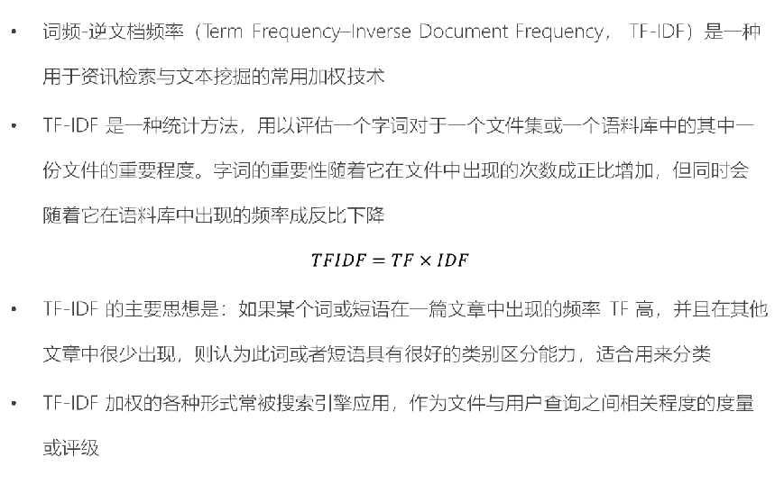

- 词频（Term Frequency，TF）

  - 指的是某一个给定的词语在该文件中出现的频率。这个数字是对词数的归一化，以防止偏向更长的文件
  - 同一个词语在长文件里可能会比短文件有更高的词数，而不管该词语重要与否
  - 其中 TFi,j 表示词语 i 在文档 j 中出现的频率，ni,j 表示 i 在 j 中出现的次数，n*,j 表示文档 j 的总词数

  

- 逆向文件频率（Inverse Document Frequency，IDF）

  - 是一个词语普遍重要性的度量，某一特定词语的 IDF，可以由总文档数目除以包含该词语之文档的数目，再将得到的商取对数得到
  - 其中 IDFi 表示词语 i 在文档集中的逆文档频率，N 表示文档集中的文档总数，Ni 表示文档集中包含了词语 i 的文档数

  

### TF-IDF 对基于 UGC 推荐的改进

- 为了避免热门标签和热门物品获得更多的权重，我们需要对“热门”进行惩罚

- 借鉴 TF-IDF 的思想，以一个物品的所有标签作为“文档”，标签作为“词语”，从而计算标签的“词频”（在物品所有标签中的频率）和“逆文档频率”（在其它物品标签中普遍出现的频率）

- 由于“物品 i 的所有标签”n*,i 应该对标签权重没有影响，而“所有标签总数”N 对于所有标签是一定的，所以这两项可以略去

- 在简单算法的基础上，直接加入对热门标签和热门物品的惩罚项

  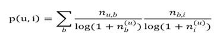

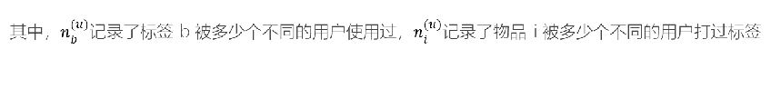

## 基于协同过滤的推荐 CF

- 协同过滤（Collaborative Filtering，CF）
  - 基于近邻的协同过滤
    - 基于用户（User-CF）
    - 基于物品（Item-CF）
  - 基于模型的协同过滤
    - 奇异值分解（SVD）
    - 潜在语义分析（LSA）
    - 支撑向量机（SVM）


- 基于内容（Content based，CB）主要利用的是用户评价过的物品的内容特征，而CF方法还可以利用其他用户评分过的物品内容
- CF 可以解决 CB 的一些局限
  - 物品内容不完全或者难以获得时，依然可以通过其他用户的反馈给出推荐
  - CF基于用户之间对物品的评价质量，避免了CB仅依赖内容可能造成的对物品质量判断的干扰
  - CF推荐不受内容限制，只要其他类似用户给出了对不同物品的兴趣，CF就可以给用户推荐出内容差异很大的物品（但有某种内在联系）
  - 分为两类：基于近邻和基于模型


### 基于近邻的协同过滤

- 基于近邻的推荐系统根据的是相同“口碑”准则
- 示例
  - 是否应该给Cary推荐《泰坦尼克号》？

|       | 黑客帝国 | 泰坦尼克号 | 虎胆龙威 | 阿甘正传 | 机器人总动员 |
| ----- | -------- | ---------- | -------- | -------- | ------------ |
| Alice | 1        | 5          | 2        | 5        | 5            |
| Bob   | 5        | 1          |          | 2        | 2            |
| Cary  | 2        | ==?==      | 3        | 5        | 4            |
| Diane | 4        | 3          | 5        | 3        |              |


#### 基于用户的协同过滤 User-CF


##### 基本原理

- 根据所有用户对物品的偏好，发现与当前用户口味和偏好相似的“邻居”用户群，并推荐近邻所偏好的物品

- 在一般的应用中是采用计算“K- 近邻”的算法

- 基于这 K 个邻居的历史偏好信息，为当前用户进行推荐

  

##### User-CF 和基于人口统计学的推荐机制

- 相同点
  - 都是计算用户的相似度，并基于相似的“邻居”用户群计算推荐
- 不同点
  - 如何计算用户的相似度
    - 基于人口统计学的机制只考虑用户本身的特征
    - User-CF 是在用户的历史偏好的数据上计算用户的相似度
      - 基本假设：喜欢类似物品的用户可能有相同或者相似的口味和偏好


#### 基于物品的协同过滤 Item-CF


- 基本原理与基于用户的类似
- 只是使用所有用户对物品的偏好，发现物品和物品之间的相似度，根据用户的历史偏好信息，将类似的物品推荐给用户
- Item-CF 和基于内容（CB）的推荐
  - 都是基于物品相似度预测推荐，只是相似度计算的方法不一样
  - 前者是从用户历史的偏好推断
  - 后者是基于物品本身的属性特征信息
- 同样是协同过滤，在基于用户和基于项目两个策略中应该如何选择呢？
  - 电商、电影、音乐网站，用户数量远大于物品数量
  - 新闻网站，物品（新闻文本）数量可能大于用户数量


##### User-CF 和 Item-CF的比较

- 同样是协同过滤，在 User-CF 和 Item-CF 两个策略中应该如何选择呢？
  - Item-CF 应用场景
    - 基于物品的协同过滤（Item-CF）推荐机制是 Amazon 在基于用户的机制上改良的一种策略。因为在大部分的 Web 站点中，物品的个数是远远小于用户的数量的，而且物品的个数和相似度相对比较稳定，同时基于物品的机制比基于用户的实时性更好一些，所以 Item-CF 成为了目前推荐策略的主流
  - User-CF 应用场景
    - 设想一下在一些新闻推荐系统中，也许物品——也就是新闻的个数可能大于用户的个数，而且新闻的更新程度也有很快，所以它的相似度依然不稳定，这时用 User-CF可能效果更好
  - 所以，推荐策略的选择其实和具体的应用场景有很大的关系


### 优缺点

- 基于协同过滤的推荐机制的优点
  - 不需要对物品或者用户进行严格的建模
  - 不要求对物品特征的描述是机器可理解的，所以这种方法也是领域无关的
  - 这种方法计算出来的推荐是开放的，可共用他人的经验，很好的支持用户发现潜在的兴趣偏好
- 存在的问题
  - 方法的核心是基于历史数据，所以对新物品和新用户都有“冷启动”的问题
  - 推荐的效果依赖于用户历史偏好数据的多少和准确性
  - 在大部分的实现中，用户历史偏好是用稀疏矩阵进行存储的，而稀疏矩阵上的计算有些明显的问题
    - 包括可能少部分人的错误偏好会对推荐的准确度有很大的影响等
  - 对于一些特殊品味的用户不能给予很好的推荐


### 基于模型的协同过滤


#### 基本思想

- 用户具有一定的特征，决定着他的偏好选择
- 物品具有一定的特征，影响着用户需是否选择它
- 用户之所以选择某一个商品，是因为用户特征与物品特征相互匹配


- 基于这种思想，模型的建立相当于从行为数据中提取特征，给用户和物品同时打上“标签”
  - 这和基于人口统计学的用户标签、基于内容方法的物品标签本质是一样的，都是特征的提取和匹配
- 有显性特征时（比如用户标签、物品分类标签）可直接匹配做出推荐
  - 没有时可根据已有的偏好数据，去发掘出隐藏的特征，这需要用到**隐语义模型（LFM）**


- 基于模型的协同过滤推荐，就是基于样本的用户偏好信息，训练一个推荐模型，然后根据实时的用户喜好的信息进行预测新物品的得分，计算推荐

  

#### 基于近邻的推荐和基于模型的推荐

- 基于近邻的推荐
  - 在预测时直接使用已有的用户偏好数据，通过近邻数据来预测对新物品的偏好
  - 类似分类
- 基于模型的方法
  - 要使用这些偏好数据来训练模型，找到内在规律，再用模型来做预测
  - 类似回归
  - 训练模型时可基于标签内容来提取物品特征，也可以让模型去发掘物品的潜在特征
    - 这样的模型被称为隐语义模型（Latent Factor Model，LFM）


#### 隐语义模型（LFM）

- 用隐语义模型来进行协同过滤的目标
  - 揭示隐藏的特征，这些特征能够解释为什么给出对应的预测评分
  - 这类特征可能是无法直接用语言解释描述的，事实上我们并不需要知道，类似“玄学”
- 通过矩阵分解进行降维分析
  - 协同过滤算法非常依赖历史数据，而一般的推荐系统中，偏好数据又往往是稀疏的
    - 需要对原始数据做降维处理
  - 分解之后的矩阵，就代表了用户和物品的隐藏特征
- 隐语义模型的实例
  - 基于概率的隐语义分析（pLSA）
  - 隐式迪利克雷分布模型（LDA）
  - 矩阵因子分解模型
    - 基于奇异值分解的模型
    - SVD


##### LFM 降维方法-矩阵因子分解模型

- 假设用户物品评分矩阵为 R，现在有 m 个用户，n 个物品
- 想要发现 k 个隐类，我们的任务就是找到两个矩阵 P 和 Q
- 使这两个矩阵的乘积近似等于 R
- 即将用户物品评分矩阵 R 分解成为两个低维矩阵相乘

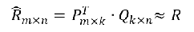

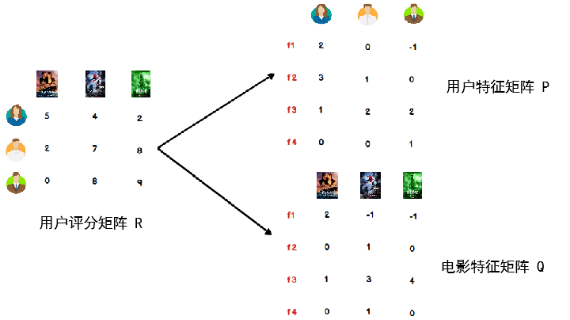


- 我们可以认为，用户之所以给电影打出这样的分数，是有内在原因的，我们可以挖掘出影响用户打分的隐藏因素，进而根据未评分电影与这些隐藏因素的关联度，决定此未评分电影的预测评分
- 应该有一些隐藏的因素，影响用户的打分，比如电影：演员、题材、年代…甚至不一定是人直接可以理解的隐藏因子
- 找到隐藏因子，可以对 user 和 item 进行关联（找到是由于什么使得 user 喜欢/不喜欢此 item，什么会决定 user 喜欢/不喜欢此 item），就可以推测用户是否会喜欢某一部未看过的电影

- 对于用户看过的电影，会有相应的打分，但一个用户不可能看过所有电影，对于用户没有看过的电影是没有评分的，因此用户评分矩阵大部分项都是空的，是一个稀疏矩阵

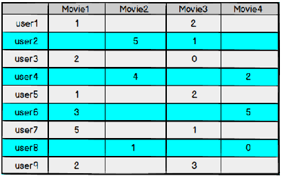

- 如果我们能够根据用户给已有电影的打分推测出用户会给没有看过的电影的打分，那么就可以根据预测结果给用户推荐他可能打高分的电影


##### 矩阵因子分解


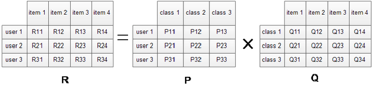


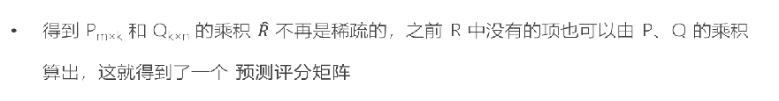


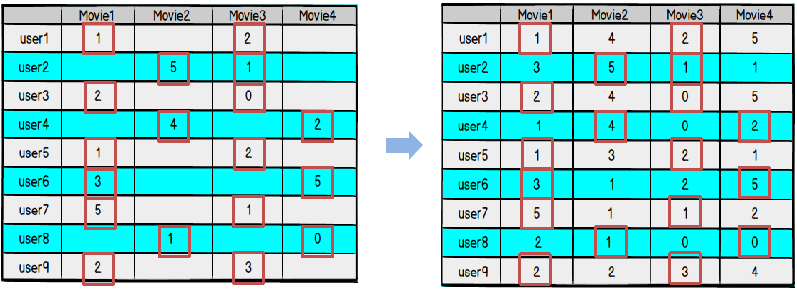


##### 损失函数

- 引入正则化项，防止过拟合


##### 求解算法 [交替最小二乘法 ALS]

- 现在，矩阵因子分解的问题已经转化成了一个标准的优化问题，需要求解 P、Q，使目标损失函数取最小值
- 最小化过程的求解，一般采用随机梯度下降算法或者交替最小二乘法来实现
- 交替最小二乘法（Alternating Least Squares，ALS）
  - 思想
    - 由于两个矩阵P和Q都未知，且通过矩阵乘法耦合在一起，为了使它们解耦，可以先固定Q，把P当作变量，通过损失函数最小化求出P
      - 这就是一个经典的最小二乘问题
    - 再反过来固定求得的P，把Q当作变量，求解出Q
    - 如此交替执行，直到误差满足阈值条件，或者到达迭代上限

- 具体过程
  - 为 Q 指定一个初值 Q0，可以是 0 或者全局平均值
  - 固定当前 Q0 值，求解 P0
  - 固定当前 P0 值，求解 Q1
  - 固定当前 Q1 值，求解 P1
  - …（重复以上过程）
  - 直到损失函数的值 C 收敛，迭代结束

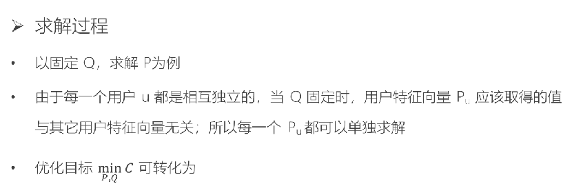


##### 求解算法 [梯度下降法]

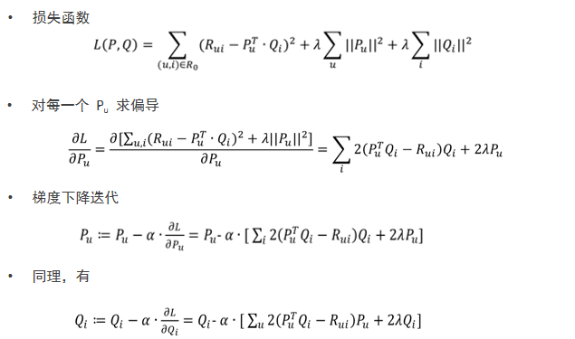

