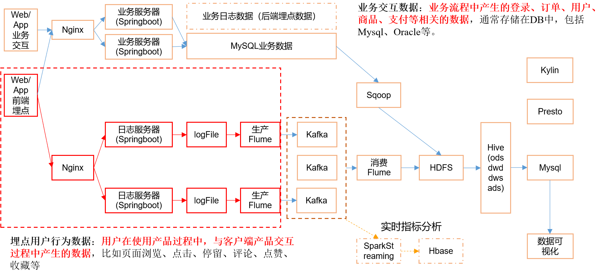
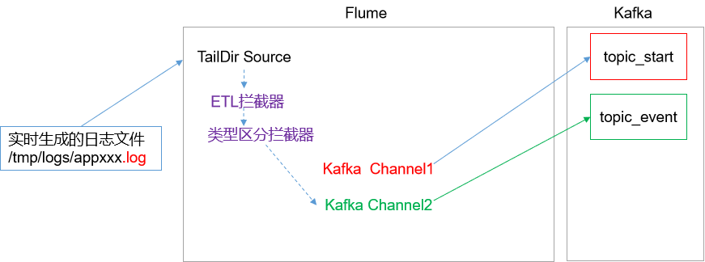
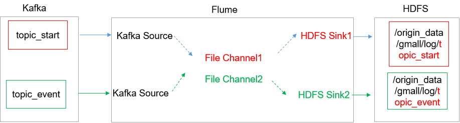

- Flume官网地址

http://flume.apache.org/

- 文档查看地址

http://flume.apache.org/FlumeUserGuide.html

- 下载地址

http://archive.apache.org/dist/flume/


# 规划

|                 | 服务器hadoop102 | 服务器hadoop103 | 服务器hadoop104 |
| --------------- | --------------- | --------------- | --------------- |
| Flume(采集日志) | Flume           | Flume           |                 |


# 安装部署

- 将apache-flume-1.7.0-bin.tar.gz上传到linux的/opt/software目录下

- 解压apache-flume-1.7.0-bin.tar.gz到/opt/module/目录下

- 修改apache-flume-1.7.0-bin的名称为flume

- 将flume/conf下的flume-env.sh.template文件修改为flume-env.sh，并配置flume-env.sh文件

```bash
[ttshe@hadoop102 software]$ tar -zvxf apache-flume-1.7.0-bin.tar.gz -C /opt/module/
[ttshe@hadoop102 module]$ mv apache-flume-1.7.0-bin/ flume/
[ttshe@hadoop102 conf]$ cp flume-env.sh.template flume-env.sh
[ttshe@hadoop102 conf]$ vim flume-env.sh
# 修改jdk
export JAVA_HOME=/opt/module/jdk1.8.0_14
# 修改启动为4G，在实际生产中，防止内存抖动
export JAVA_OPTS="-Xms4096m -Xmx4096m -Dcom.sun.management.jmxremote"
```

- 分发flume

```bash
[ttshe@hadoop102 module]$ xsync flume/
```


# 日志采集Flume

- Flume直接读log日志的数据
  - log日志的格式是app-yyyy-mm-dd.log
- Flume的ETL拦截器功能简单，不做复杂拦截，减少Flume数据处理压力，防止数据拥塞



- 在/opt/module/flume/job目录下创建file-flume-kafka.conf文件
  - 注意com.stt.flume.LogETLInterceptor和com.stt.flume.LogTypeInterceptor是自定义的拦截器的全类名
    - 需要用户自定义的拦截器做相应修改

```bash
[ttshe@hadoop102 flume]$ mkdir job
[ttshe@hadoop102 flume]$ cd job
[ttshe@hadoop102 job]$ vim file-flume-kafka.conf
```

```bash
a1.sources=r1
a1.channels=c1 c2

# configure source
# 支持断点续传
a1.sources.r1.type = TAILDIR
# 记录读取文件的位置
a1.sources.r1.positionFile = /opt/module/flume/test/log_position.json
# 支持读取多个文件
a1.sources.r1.filegroups = f1
# 读取文件的名称规则，正则表达式
a1.sources.r1.filegroups.f1 = /tmp/logs/app.+
a1.sources.r1.fileHeader = true
a1.sources.r1.channels = c1 c2

#interceptor
a1.sources.r1.interceptors = i1 i2
# ETL拦截器，注意这里需要在拦截器中实现内部类Builder，进行初始化工作
a1.sources.r1.interceptors.i1.type = com.stt.flume.LogETLInterceptor$Builder
# 日志类型选择拦截器
a1.sources.r1.interceptors.i2.type = com.stt.flume.LogTypeInterceptor$Builder

# 使用多路复用类型，依据选择进行匹配发送给channel
a1.sources.r1.selector.type = multiplexing
# 读取header中的topic字段，header是map结构，如header.put("topic","topic_start")
a1.sources.r1.selector.header = topic
# topic字段的值是topic_start,event发送到c1
a1.sources.r1.selector.mapping.topic_start = c1
a1.sources.r1.selector.mapping.topic_event = c2

# configure channel
a1.channels.c1.type = org.apache.flume.channel.kafka.KafkaChannel
a1.channels.c1.kafka.bootstrap.servers = hadoop102:9092,hadoop103:9092,hadoop104:9092
# 发送到kafka的主题
a1.channels.c1.kafka.topic = topic_start
a1.channels.c1.parseAsFlumeEvent = false 
# 表示返回的event信息中不包含来源的flume信息前缀，默认true，这里不需要，否则在hive节点需要二次过滤
a1.channels.c1.kafka.consumer.group.id = flume-consumer

a1.channels.c2.type = org.apache.flume.channel.kafka.KafkaChannel
a1.channels.c2.kafka.bootstrap.servers = hadoop102:9092,hadoop103:9092,hadoop104:9092
a1.channels.c2.kafka.topic = topic_event
a1.channels.c2.parseAsFlumeEvent = false
a1.channels.c2.kafka.consumer.group.id = flume-consumer
```

- 粘贴注意使用set paste，否则会丢失头部字段
- 同步配置

```bash
[ttshe@hadoop102 flume]$ xsync job/
```


## Flume拦截器

- 创建Maven工程flume-interceptor

- 创建包名：com.stt.flume.interceptor

- pom.xml文件中添加如下配置

```xml
<dependencies>
    <dependency>
        <groupId>org.apache.flume</groupId>
        <artifactId>flume-ng-core</artifactId>
        <version>1.7.0</version>
    </dependency>
</dependencies>

<build>
    <plugins>
        <plugin>
            <artifactId>maven-compiler-plugin</artifactId>
            <version>2.3.2</version>
            <configuration>
                <source>1.8</source>
                <target>1.8</target>
            </configuration>
        </plugin>
        <plugin>
            <artifactId>maven-assembly-plugin</artifactId>
            <configuration>
                <descriptorRefs>
                    <descriptorRef>jar-with-dependencies</descriptorRef>
                </descriptorRefs>
            </configuration>
            <executions>
                <execution>
                    <id>make-assembly</id>
                    <phase>package</phase>
                    <goals>
                        <goal>single</goal>
                    </goals>
                </execution>
            </executions>
        </plugin>
    </plugins>
</build>
```


### ETL拦截器

- 过滤时间戳不合法和Json数据不完整的日志

- 在com.stt.flume.interceptor包下创建LogETLInterceptor类名

```java
package com.stt.flume;

import org.apache.commons.codec.Charsets;
import org.apache.commons.lang.StringUtils;
import org.apache.commons.lang.math.NumberUtils;
import org.apache.flume.Context;
import org.apache.flume.Event;
import org.apache.flume.interceptor.Interceptor;

import java.util.ArrayList;
import java.util.List;
import java.util.Objects;

public class LogETLInterceptor implements Interceptor {

	@Override
	public void initialize() {
	}

	@Override
	public Event intercept(Event event) {
		// 获取数据
		String log = new String(event.getBody(), Charsets.UTF_8);
		// 判断数据类型进行判断是否合法
		if(log.contains("start")){
			if(validateStart(log.trim())){
				return event;
			}
		}else{
			if(validateEvent(log.trim())){
				return event;
			}
		}
		return null;
	}

	private boolean validateStart(String log) {
//		{"action":"1","ar":"MX","ba":"HTC","detail":"542","en":"start","entry":"2","extend1":"","g":"S3HQ7LKM@gmail.com","hw":"640*960","l":"en","la":"-43.4","ln":"-98.3","loading_time":"10","md":"HTC-5","mid":"993","nw":"WIFI","open_ad_type":"1","os":"8.2.1","sr":"D","sv":"V2.9.0","t":"1559551922019","uid":"993","vc":"0","vn":"1.1.5"}

		if(StringUtils.isBlank(log)){
			return false;
		}
		return validateJson(log);
	}

	private boolean validateEvent(String log) {
		// 服务器时间 | json
		// 1549696569054 | {"cm":{"ln":"-89.2","sv":"V2.0.4","os":"8.2.0","g":"M67B4QYU@gmail.com","nw":"4G","l":"en","vc":"18","hw":"1080*1920","ar":"MX","uid":"u8678","t":"1549679122062","la":"-27.4","md":"sumsung-12","vn":"1.1.3","ba":"Sumsung","sr":"Y"},"ap":"weather","et":[]}
		
		String[] split = log.split("\\|");
		
		if(split.length != 2){
			return false;
		}
		// 时间戳非法
		if(split[0].length()!=13 || !NumberUtils.isDigits(split[0])){
			return false;
		}
		return validateJson(split[1].trim());
	}

	private boolean validateJson(String json){
		// 说明不是json格式
		if(!json.startsWith("{")||!json.endsWith("}")){
			return false;
		}
		return true;
	}
	
	@Override
	public List<Event> intercept(List<Event> events) {
		List<Event> re = new ArrayList<>(events.size());
		for (Event event : events) {
			Event intercept = intercept(event);
			if(!Objects.isNull(intercept)){
				re.add(intercept);
			}
		}
		return re;
	}

	@Override
	public void close() {
	}

	// 必须实现Interceptor的Builder类
	public static class Builder implements Interceptor.Builder{

		@Override
		public Interceptor build() {
			return new LogETLInterceptor();
		}

		@Override
		public void configure(Context context) {

		}
	}
}
```


### 分类型拦截器

- 将启动日志和事件日志区分开来，方便发往Kafka的不同Topic

```java
package com.stt.flume;

import org.apache.commons.codec.Charsets;
import org.apache.flume.Context;
import org.apache.flume.Event;
import org.apache.flume.interceptor.Interceptor;

import java.util.ArrayList;
import java.util.List;
import java.util.Objects;

public class LogTypeInterceptor implements Interceptor {

	@Override
	public void initialize() {
	}

	@Override
	public Event intercept(Event event) {
		// 获取数据
		String log = new String(event.getBody(), Charsets.UTF_8);
		// 对header头部进行处理
		if(log.contains("start")){
			event.getHeaders().put("topic","topic_start");
		}else{
			event.getHeaders().put("topic","topic_event");
		}
		return event;
	}

	@Override
	public List<Event> intercept(List<Event> events) {
		List<Event> re = new ArrayList<>(events.size());
		events.forEach(event -> re.add(intercept(event)));
		return re;
	}
	@Override
	public void close() {
	}

	// 必须实现Interceptor的Builder类
	public static class Builder implements Interceptor.Builder{

		@Override
		public Interceptor build() {
			return new LogTypeInterceptor();
		}

		@Override
		public void configure(Context context) {

		}
	}
}
```


### 打包

- 打包生成 flume-interceptor-1.0-SNAPSHOT.jar

- 拦截器打包之后，只需要单独包，不需要将依赖的包上传
  - 为什么不需要依赖包？因为依赖包在flume的lib目录下面已经存在了
- 打包之后要放入Flume的lib文件夹下面
- 注意分发给其他节点

```bash
[ttshe@hadoop102 lib]$ xsync flume-interceptor-1.0-SNAPSHOT.jar 
```


## 启动

```bash
[ttshe@hadoop102 flume]$ bin/flume-ng agent -n a1 -f /opt/module/flume/job/file-flume-kafka.conf &
```


## 群起停止脚本编写

- 在/home/ttshe/bin目录下创建脚本f1.sh

```bash
[ttshe@hadoop102 bin]$ vim f1.sh
[ttshe@hadoop102 bin]$ chmod 777 f1.sh
```

```bash
#!/bin/bash

case $1 in
"start"){
	for i in hadoop102 hadoop103
    do
    	echo " --------启动 $i 采集flume-------"
    	ssh $i "nohup /opt/module/flume/bin/flume-ng agent --conf-file /opt/module/flume/job/file-flume-kafka.conf --name a1 -Dflume.root.logger=INFO,LOGFILE >/dev/null 2>&1 &"
   	done
};;	
"stop"){
	for i in hadoop102 hadoop103
	do
    	echo " --------停止 $i 采集flume-------"
        ssh $i "ps -ef | grep file-flume-kafka | grep -v grep |awk '{print \$2}' | xargs kill"
	done
};;
esac
```

- 说明

  - nohup
    - 可在退出帐户/关闭终端之后继续运行相应的进程
    - 不挂起，不挂断地运行命令

  - /dev/null
    - 代表linux的空设备文件
    - 所有往这个文件里面写入的内容都会丢失，俗称“黑洞”
    - 一般在开发时需要指定文件用于查看日志

  - 标准输入0
  
- 从键盘获得输入 /proc/self/fd/0 
  
  - 标准输出1
  
  - 输出到屏幕（即控制台） /proc/self/fd/1 
  
  - 错误输出2

    - 输出到屏幕（即控制台） /proc/self/fd/2

  - 2>&1

    - 将输入2和1进行合并

  - grep -v 

    - 用于排除某个字段

  - `print  \$2`

    - 这里使用转义，表示不是从命令行中输入的参数，而是读取的参数

  - grep file-flume-kafka

    - 明确要过滤的进程

  - xargs

    - 表示将查询的结果作为当前命令的入参

    - 也可以写作
  
    ```bash
  kill -9 `ps -ef | grep file-flume-kafka | grep -v grep |awk '{print \$2}'`
    ```
  


# 消费Flume


## 配置

- 注意在kafka搭建完成后进行配置

- 规划
  - 可配置2个flume，用于解耦

|                    | 服务器hadoop102 | 服务器hadoop103 | 服务器hadoop104 |
| ------------------ | --------------- | --------------- | --------------- |
| Flume（消费Kafka） |                 |                 | Flume           |



- 在hadoop104的/opt/module/flume/job目录下创建kafka-flume-hdfs.conf文件

```bash
[ttshe@hadoop104 job]$ vim kafka-flume-hdfs.conf
```

```bash
## 组件
a1.sources=r1 r2
a1.channels=c1 c2
a1.sinks=k1 k2

## source1 
a1.sources.r1.type = org.apache.flume.source.kafka.KafkaSource
a1.sources.r1.batchSize = 5000
a1.sources.r1.batchDurationMillis = 2000
a1.sources.r1.kafka.bootstrap.servers = hadoop102:9092,hadoop103:9092,hadoop104:9092
a1.sources.r1.kafka.topics=topic_start

## source2
a1.sources.r2.type = org.apache.flume.source.kafka.KafkaSource
a1.sources.r2.batchSize = 5000
a1.sources.r2.batchDurationMillis = 2000
a1.sources.r2.kafka.bootstrap.servers = hadoop102:9092,hadoop103:9092,hadoop104:9092
a1.sources.r2.kafka.topics=topic_event

## channel1 扩展使用file，数据比较重要，不能丢失，momery则速度快
a1.channels.c1.type = file
# 检查点
a1.channels.c1.checkpointDir = /opt/module/flume/checkpoint/behavior1
# 缓存数据的位置
a1.channels.c1.dataDirs = /opt/module/flume/data/behavior1/
# file文件size最大值
a1.channels.c1.maxFileSize = 2146435071
# file的容量，100万
a1.channels.c1.capacity = 1000000
# 6s 删除或添加一个event的超时时间
a1.channels.c1.keep-alive = 6

## channel2
a1.channels.c2.type = file
a1.channels.c2.checkpointDir = /opt/module/flume/checkpoint/behavior2
a1.channels.c2.dataDirs = /opt/module/flume/data/behavior2/
a1.channels.c2.maxFileSize = 2146435071
a1.channels.c2.capacity = 1000000
a1.channels.c2.keep-alive = 6

## sink1
a1.sinks.k1.type = hdfs
a1.sinks.k1.hdfs.path = /origin_data/gmall/log/topic_start/%Y-%m-%d
a1.sinks.k1.hdfs.filePrefix = logstart-
a1.sinks.k1.hdfs.round = true
# 10s变化一次文件夹的路径 ，为了演示使用秒，实际用min
a1.sinks.k1.hdfs.roundValue = 10
a1.sinks.k1.hdfs.roundUnit = second
## 不要产生大量小文件
# 每10s添加一个新文件
a1.sinks.k1.hdfs.rollInterval = 10
# 文件大小超过128M，生成一个新文件
a1.sinks.k1.hdfs.rollSize = 134217728
# event的个数，设置为0忽略此配置。默认10，表示10个events事件滚动一次file
a1.sinks.k1.hdfs.rollCount = 0
## 控制输出文件，使用lzop压缩，默认sequenceFile
a1.sinks.k1.hdfs.fileType = CompressedStream
a1.sinks.k1.hdfs.codeC = lzop

##sink2
a1.sinks.k2.type = hdfs
a1.sinks.k2.hdfs.path = /origin_data/gmall/log/topic_event/%Y-%m-%d
a1.sinks.k2.hdfs.filePrefix = logevent-
a1.sinks.k2.hdfs.round = true
a1.sinks.k2.hdfs.roundValue = 10
a1.sinks.k2.hdfs.roundUnit = second
a1.sinks.k2.hdfs.rollInterval = 10
a1.sinks.k2.hdfs.rollSize = 134217728
a1.sinks.k2.hdfs.rollCount = 0
a1.sinks.k2.hdfs.fileType = CompressedStream 
a1.sinks.k2.hdfs.codeC = lzop

## 拼装
a1.sources.r1.channels = c1
a1.sinks.k1.channel= c1

a1.sources.r2.channels = c2
a1.sinks.k2.channel= c2
```


## 启动脚本

- 在/home/ttshe/bin目录下创建脚本f2.sh

```bash
[ttshe@hadoop102 bin]$ vim f2.sh
[ttshe@hadoop102 bin]$ chmod 777 f2.sh
```

```bash
#!/bin/bash

case $1 in
"start"){
	for i in hadoop104
    do
    	echo " --------启动 $i 消费flume-------"
        ssh $i "nohup /opt/module/flume/bin/flume-ng agent --conf-file /opt/module/flume/job/kafka-flume-hdfs.conf --name a1 -Dflume.root.logger=INFO,LOGFILE >/opt/module/flume/log.txt 2>&1 &"
    done
};;
"stop"){
	for i in hadoop104
    do
    	echo " --------停止 $i 消费flume-------"
        ssh $i "ps -ef | grep kafka-flume-hdfs | grep -v grep |awk '{print \$2}' | xargs kill"
    done
};;
esac
```


