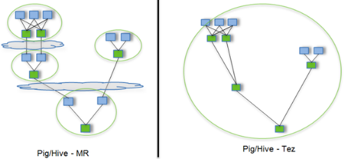

# Hive安装

- 把apache-hive-1.2.1-bin.tar.gz上传到linux的/opt/software目录下

- 解压apache-hive-1.2.1-bin.tar.gz到/opt/module/目录下面
- 修改apache-hive-1.2.1-bin.tar.gz的名称为hive
- 修改/opt/module/hive/conf目录下的hive-env.sh.template名称为hive-env.sh
- 配置hive-env.sh文件
  - 配置HADOOP_HOME路径
  - 配置HIVE_CONF_DIR路径

```bash
[ttshe@hadoop102 software]$ tar -zvxf apache-hive-1.2.1-bin.tar.gz -C /opt/module/
[ttshe@hadoop102 module]$ mv apache-hive-1.2.1-bin/ hive/
[ttshe@hadoop102 module]$ cd hive/conf/
[ttshe@hadoop102 conf]$ cp hive-env.sh.template hive-env.sh
[ttshe@hadoop102 conf]$ vim hive-env.sh

# 配置如下
export HADOOP_HOME=/opt/module/hadoop-2.7.2
export HIVE_CONF_DIR=/opt/module/hive/conf
```


## Hadoop集群配置

- 必须启动HDFS和YARN
- 在HDFS上创建/tmp和/user/hive/warehouse两个目录并修改他们的同组权限可写

```bash
[ttshe@hadoop102 hadoop-2.7.2]$ sbin/start-dfs.sh
[ttshe@hadoop103 hadoop-2.7.2]$ sbin/start-yarn.sh

[ttshe@hadoop102 hadoop-2.7.2]$ bin/hadoop fs -mkdir /tmp
[ttshe@hadoop102 hadoop-2.7.2]$ bin/hadoop fs -mkdir -p /user/hive/warehouse
[ttshe@hadoop102 hadoop-2.7.2]$ bin/hadoop fs -chmod g+w /tmp
[ttshe@hadoop102 hadoop-2.7.2]$ bin/hadoop fs -chmod g+w /user/hive/warehouse
```


# Hive基本操作

```bash
[ttshe@hadoop102 hive]$ bin/hive
hive> show databases;
hive> use default;
hive> show tables;
hive> create table student(id int,name string);
hive> desc student;
hive> insert into student values(1000,"stt");
hive> select * from student;
hive> quit;
```


# MySql安装

- 查看mysql是否安装，如果安装了，卸载mysql
- 解压mysql-libs.zip文件到当前目录
- 进入到mysql-libs文件夹下
- 安装mysql服务端
- 查看产生的随机密码
- 查看mysql状态
- 启动mysql
- 安装mysql客户端
- 链接mysql
- 修改密码
- 退出mysql

```bash
# 切换到root下进行安装
[root@hadoop102 hive]$ rpm -qa | grep mysql
mysql-libs-5.1.73-7.el6.x86_64
[root@hadoop102 hive]$ rpm -e --nodeps mysql-libs-5.1.73-7.el6.x86_64

[root@hadoop102 software]# unzip mysql-libs.zip 
[root@hadoop102 software]# cd mysql-libs
[root@hadoop102 mysql-libs]# ll
总用量 76048
-rw-r--r-- 1 root root 18509960 3月  26 2015 MySQL-client-5.6.24-1.el6.x86_64.rpm
-rw-r--r-- 1 root root  3575135 12月  1 2013 mysql-connector-java-5.1.27.tar.gz
-rw-r--r-- 1 root root 55782196 3月  26 2015 MySQL-server-5.6.24-1.el6.x86_64.rpm

[root@hadoop102 mysql-libs]# rpm -ivh MySQL-server-5.6.24-1.el6.x86_64.rpm 
[root@hadoop102 mysql-libs]# cat /root/.mysql_secret
# The random password set for the root user at Mon Feb 11 12:29:37 2019 (local time): Gy1cYyYjgO_P69B5

[root@hadoop102 mysql-libs]# service mysql status
MySQL is not running                                       [失败]
[root@hadoop102 mysql-libs]# service mysql start
Starting MySQL.                                            [确定]

[root@hadoop102 mysql-libs]# rpm -ivh MySQL-client-5.6.24-1.el6.x86_64.rpm 
[root@hadoop102 mysql-libs]# mysql -uroot -pGy1cYyYjgO_P69B5
mysql> set password = password("123456");
mysql> exit;
```


## 修改user表配置

- 配置只要是root用户+密码，在任何主机上都能登录MySQL数据库

- 查询user表
- 修改user表，把Host表内容修改为%
- 删除root用户的其他host
- 刷新

```bash
[root@hadoop102 mysql-libs]# mysql -uroot -p123456
mysql> show databases;
mysql> use mysql
mysql> show tables;
mysql> desc user;
mysql> select User,Host,Password from user;
+------+-----------+-------------------------------------------+
| User | Host      | Password                                  |
+------+-----------+-------------------------------------------+
| root | localhost | *6BB4837EB74329105EE4568DDA7DC67ED2CA2AD9 |
| root | hadoop102 | *206695FE1C08FFF24E4A7F7E5AEDDE5609B93116 |
| root | 127.0.0.1 | *206695FE1C08FFF24E4A7F7E5AEDDE5609B93116 |
| root | ::1       | *206695FE1C08FFF24E4A7F7E5AEDDE5609B93116 |
+------+-----------+-------------------------------------------+
4 rows in set (0.00 sec)
mysql>update user set host='%' where host='localhost';
mysql>
delete from user where Host='hadoop102';
delete from user where Host='127.0.0.1';
delete from user where Host='::1';
mysql>flush privileges;
mysql>quit;
```


# Hive元数据配置到MySql

- 拷贝驱动

- 在/opt/software/mysql-libs目录下解压mysql-connector-java-5.1.27.tar.gz驱动包
- 拷贝/opt/software/mysql-libs/mysql-connector-java-5.1.27目录下的mysql-connector-java-5.1.27-bin.jar到/opt/module/hive/lib/

```bash
[root@hadoop102 mysql-libs]# tar -zxvf mysql-connector-java-5.1.27.tar.gz
[root@hadoop102 mysql-connector-java-5.1.27]# cp mysql-connector-java-5.1.27-bin.jar /opt/module/hive/lib/
```

- 配置Metastore到Mysql
- 在/opt/module/hive/conf目录下创建一个hive-site.xml
- 根据官方文档配置参数，拷贝数据到hive-site.xml文件
  - https://cwiki.apache.org/confluence/display/Hive/AdminManual+MetastoreAdmin

```bash
# 切换到ttshe用户
[ttshe@hadoop102 mysql-libs]$ cd /opt/module/hive/conf/
[ttshe@hadoop102 conf]$ vim hive-site.xml
```

```xml
<?xml version="1.0"?>
<?xml-stylesheet type="text/xsl" href="configuration.xsl"?>
<configuration>
	<property>
	  <name>javax.jdo.option.ConnectionURL</name>
	  <value>jdbc:mysql://hadoop102:3306/metastore?createDatabaseIfNotExist=true</value>
	  <description>JDBC connect string for a JDBC metastore</description>
	</property>

	<property>
	  <name>javax.jdo.option.ConnectionDriverName</name>
	  <value>com.mysql.jdbc.Driver</value>
	  <description>Driver class name for a JDBC metastore</description>
	</property>

	<property>
	  <name>javax.jdo.option.ConnectionUserName</name>
	  <value>root</value>
	  <description>username to use against metastore database</description>
	</property>

	<property>
	  <name>javax.jdo.option.ConnectionPassword</name>
	  <value>123456</value>
	  <description>password to use against metastore database</description>
	</property>
    
    <!--在hive-site.xml文件中添加如下配置信息，就可以实现显示当前数据库，以及查询表的头信息配置-->
    <property>
		<name>hive.cli.print.header</name>
		<value>true</value>
	</property>

	<property>
		<name>hive.cli.print.current.db</name>
		<value>true</value>
	</property>
    
</configuration>
```

- 配置完毕后，如果启动hive异常，可以重新启动虚拟机。（重启后，别忘了启动hadoop集群）


# Hive运行日志信息配置

- Hive的log默认存放在/tmp/ttshe/hive.log目录下（当前用户名下）

- 修改hive的log存放日志到/opt/module/hive/logs

- 修改/opt/module/hive/conf/hive-log4j.properties.template文件名称为

  hive-log4j.properties

- 在hive-log4j.properties文件中修改log存放位置

```bash
[ttshe@hadoop102 conf]$ cp hive-log4j.properties.template hive-log4j.properties
[ttshe@hadoop102 conf]$ vim hive-log4j.properties
# 修改
hive.log.dir=/opt/module/hive/logs
```


# 关闭元数据检查

- 由于在测试环境元数据检查比较耗费资源。此处进行关闭

```bash
[atguigu@hadoop102 conf]$ pwd
/opt/module/hive/conf
[atguigu@hadoop102 conf]$ vim hive-site.xml
# 增加
<property>
    <name>hive.metastore.schema.verification</name>
    <value>false</value>
</property>
```


# Hive运行Tez引擎

- Tez是一个Hive的运行引擎，性能优于MR。为什么优于MR呢？看下图



- 用Hive直接编写MR程序，假设有四个有依赖关系的MR作业
- 上图中，绿色是Reduce Task，云状表示写屏蔽，需要将中间结果持久化写到HDFS
- Tez可以将多个有依赖的作业转换为一个作业，这样只需写一次HDFS，且中间节点较少，从而大大提升作业的计算性能


## 安装Tez

- 下载tez的依赖包：http://tez.apache.org
- 拷贝apache-tez-0.9.1-bin.tar.gz到hadoop102的/opt/module目录
- 解压缩apache-tez-0.9.1-bin.tar.gz
- 修改名称

```bash
[ttshe@hadoop102 software]$ tar -zxvf apache-tez-0.9.1-bin.tar.gz -C /opt/module/
[ttshe@hadoop102 module]$ mv apache-tez-0.9.1-bin/ tez-0.9.1/
```


## Hive中配置Tez

- 进入到Hive的配置目录：/opt/module/hive/conf
- 在hive-env.sh文件中添加tez环境变量配置和依赖包环境变量配置
- 在hive-site.xml文件中添加如下配置，更改hive计算引擎

```bash
[ttshe@hadoop102 conf]$ pwd
/opt/module/hive/conf
[ttshe@hadoop102 conf]$ vim hive-env.sh
```

```bash
# Set HADOOP_HOME to point to a specific hadoop install directory
export HADOOP_HOME=/opt/module/hadoop-2.7.2

# Hive Configuration Directory can be controlled by:
export HIVE_CONF_DIR=/opt/module/hive/conf

# Folder containing extra libraries required for hive compilation/execution can be controlled by:
#tez的解压目录
export TEZ_HOME=/opt/module/tez-0.9.1    
export TEZ_JARS=""
# 遍历目录中的jar文件，获取名称进行配置
for jar in `ls $TEZ_HOME |grep jar`; do
    export TEZ_JARS=$TEZ_JARS:$TEZ_HOME/$jar
done
for jar in `ls $TEZ_HOME/lib`; do
    export TEZ_JARS=$TEZ_JARS:$TEZ_HOME/lib/$jar
done
# 支持lzo压缩
export HIVE_AUX_JARS_PATH=/opt/module/hadoop-2.7.2/share/hadoop/common/hadoop-lzo-0.4.20.jar$TEZ_JARS
```

- 在hive-site.xml文件中添加如下配置，更改hive计算引擎

```bash
[ttshe@hadoop102 conf]$ vim hive-site.xml 
```

```xml
<property>
    <name>hive.execution.engine</name>
    <value>tez</value>
</property>
```

- 在Hive的/opt/module/hive/conf下面创建一个tez-site.xml文件
  - tez的jar包是存放在HDFS上的

```bash
[ttshe@hadoop102 conf]$ pwd
/opt/module/hive/conf
[ttshe@hadoop102 conf]$ vim tez-site.xml
```

```xml
<?xml version="1.0" encoding="UTF-8"?>
<?xml-stylesheet type="text/xsl" href="configuration.xsl"?>
<configuration>
<property>
	<name>tez.lib.uris</name>    <value>${fs.defaultFS}/tez/tez-0.9.1,${fs.defaultFS}/tez/tez-0.9.1/lib</value>
</property>
<property>
	<name>tez.lib.uris.classpath</name>    	<value>${fs.defaultFS}/tez/tez-0.9.1,${fs.defaultFS}/tez/tez-0.9.1/lib</value>
</property>
<property>
     <name>tez.use.cluster.hadoop-libs</name>
     <value>true</value>
</property>
<property>
     <name>tez.history.logging.service.class</name>        <value>org.apache.tez.dag.history.logging.ats.ATSHistoryLoggingService</value>
</property>
</configuration>
```


## 上传Tez到集群

- 将/opt/module/tez-0.9.1上传到HDFS的/tez路径

```bash
[ttshe@hadoop102 conf]$ hadoop fs -mkdir /tez
[ttshe@hadoop102 conf]$ hadoop fs -put /opt/module/tez-0.9.1/ /tez
[ttshe@hadoop102 conf]$ hadoop fs -ls /tez
Found 1 items
drwxr-xr-x   - ttshe supergroup          0 2019-02-11 13:38 /tez/tez-0.9.1
```


## 测试

```bash
[ttshe@hadoop102 hive]$ bin/hive
hive (default)> create table student(id int,name string);
hive (default)> insert into student values(1,"zhangsan");
# 如果没有报错就表示成功了
hive (default)> select * from student;
1       zhangsan
```

- 运行Tez时检查到用过多内存而被NodeManager杀死进程问题

```bash
Status: Failed
Application application_1549861757712_0002 failed 2 times due to AM Container for appattempt_1549861757712_0002_000002 exited with  exitCode: -103
For more detailed output, check application tracking page:http://hadoop103:8088/cluster/app/application_1549861757712_0002Then, click on links to logs of each attempt.
Diagnostics: Container [pid=20134,containerID=container_1549861757712_0002_02_000001] is running beyond virtual memory limits. Current usage: 289.3 MB of 1 GB physical memory used; 2.7 GB of 2.1 GB virtual memory used. Killing container.
Dump of the process-tree for container_1549861757712_0002_02_000001 :
	|- PID PPID PGRPID SESSID CMD_NAME USER_MODE_TIME(MILLIS) SYSTEM_TIME(MILLIS) VMEM_USAGE(BYTES) RSSMEM_USAGE(PAGES) FULL_CMD_LINE
	|- 20134 20132 20134 20134 (bash) 0 1 108658688 298 /bin/bash -c /opt/module/jdk1.8.0_144/bin/java  -Xmx819m -Djava.io.tmpdir=/opt/module/hadoop-2.7.2/data/tmp/nm-local-dir/usercache/ttshe/appcache/application_1549861757712_0002/container_1549861757712_0002_02_000001/tmp -server -Djava.net.preferIPv4Stack=true -Dhadoop.metrics.log.level=WARN -XX:+PrintGCDetails -verbose:gc -XX:+PrintGCTimeStamps -XX:+UseNUMA -XX:+UseParallelGC -Dlog4j.configuratorClass=org.apache.tez.common.TezLog4jConfigurator -Dlog4j.configuration=tez-container-log4j.properties -Dyarn.app.container.log.dir=/opt/module/hadoop-2.7.2/logs/userlogs/application_1549861757712_0002/container_1549861757712_0002_02_000001 -Dtez.root.logger=INFO,CLA -Dsun.nio.ch.bugLevel='' org.apache.tez.dag.app.DAGAppMaster --session 1>/opt/module/hadoop-2.7.2/logs/userlogs/application_1549861757712_0002/container_1549861757712_0002_02_000001/stdout 2>/opt/module/hadoop-2.7.2/logs/userlogs/application_1549861757712_0002/container_1549861757712_0002_02_000001/stderr  
	|- 20188 20134 20134 20134 (java) 453 111 2774142976 73767 /opt/module/jdk1.8.0_144/bin/java -Xmx819m -Djava.io.tmpdir=/opt/module/hadoop-2.7.2/data/tmp/nm-local-dir/usercache/ttshe/appcache/application_1549861757712_0002/container_1549861757712_0002_02_000001/tmp -server -Djava.net.preferIPv4Stack=true -Dhadoop.metrics.log.level=WARN -XX:+PrintGCDetails -verbose:gc -XX:+PrintGCTimeStamps -XX:+UseNUMA -XX:+UseParallelGC -Dlog4j.configuratorClass=org.apache.tez.common.TezLog4jConfigurator -Dlog4j.configuration=tez-container-log4j.properties -Dyarn.app.container.log.dir=/opt/module/hadoop-2.7.2/logs/userlogs/application_1549861757712_0002/container_1549861757712_0002_02_000001 -Dtez.root.logger=INFO,CLA -Dsun.nio.ch.bugLevel= org.apache.tez.dag.app.DAGAppMaster --session 

Container killed on request. Exit code is 143
Container exited with a non-zero exit code 143
Failing this attempt. Failing the application.
FAILED: Execution Error, return code 2 from org.apache.hadoop.hive.ql.exec.tez.TezTask. Application application_1549861757712_0002 failed 2 times due to AM Container for appattempt_1549861757712_0002_000002 exited with  exitCode: -103
For more detailed output, check application tracking page:http://hadoop103:8088/cluster/app/application_1549861757712_0002Then, click on links to logs of each attempt.
Diagnostics: Container [pid=20134,containerID=container_1549861757712_0002_02_000001] is running beyond virtual memory limits. Current usage: 289.3 MB of 1 GB physical memory used; 2.7 GB of 2.1 GB virtual memory used. Killing container.
Dump of the process-tree for container_1549861757712_0002_02_000001 :
	|- PID PPID PGRPID SESSID CMD_NAME USER_MODE_TIME(MILLIS) SYSTEM_TIME(MILLIS) VMEM_USAGE(BYTES) RSSMEM_USAGE(PAGES) FULL_CMD_LINE
	|- 20134 20132 20134 20134 (bash) 0 1 108658688 298 /bin/bash -c /opt/module/jdk1.8.0_144/bin/java  -Xmx819m -Djava.io.tmpdir=/opt/module/hadoop-2.7.2/data/tmp/nm-local-dir/usercache/ttshe/appcache/application_1549861757712_0002/container_1549861757712_0002_02_000001/tmp -server -Djava.net.preferIPv4Stack=true -Dhadoop.metrics.log.level=WARN -XX:+PrintGCDetails -verbose:gc -XX:+PrintGCTimeStamps -XX:+UseNUMA -XX:+UseParallelGC -Dlog4j.configuratorClass=org.apache.tez.common.TezLog4jConfigurator -Dlog4j.configuration=tez-container-log4j.properties -Dyarn.app.container.log.dir=/opt/module/hadoop-2.7.2/logs/userlogs/application_1549861757712_0002/container_1549861757712_0002_02_000001 -Dtez.root.logger=INFO,CLA -Dsun.nio.ch.bugLevel='' org.apache.tez.dag.app.DAGAppMaster --session 1>/opt/module/hadoop-2.7.2/logs/userlogs/application_1549861757712_0002/container_1549861757712_0002_02_000001/stdout 2>/opt/module/hadoop-2.7.2/logs/userlogs/application_1549861757712_0002/container_1549861757712_0002_02_000001/stderr  
	|- 20188 20134 20134 20134 (java) 453 111 2774142976 73767 /opt/module/jdk1.8.0_144/bin/java -Xmx819m -Djava.io.tmpdir=/opt/module/hadoop-2.7.2/data/tmp/nm-local-dir/usercache/ttshe/appcache/application_1549861757712_0002/container_1549861757712_0002_02_000001/tmp -server -Djava.net.preferIPv4Stack=true -Dhadoop.metrics.log.level=WARN -XX:+PrintGCDetails -verbose:gc -XX:+PrintGCTimeStamps -XX:+UseNUMA -XX:+UseParallelGC -Dlog4j.configuratorClass=org.apache.tez.common.TezLog4jConfigurator -Dlog4j.configuration=tez-container-log4j.properties -Dyarn.app.container.log.dir=/opt/module/hadoop-2.7.2/logs/userlogs/application_1549861757712_0002/container_1549861757712_0002_02_000001 -Dtez.root.logger=INFO,CLA -Dsun.nio.ch.bugLevel= org.apache.tez.dag.app.DAGAppMaster --session 

Container killed on request. Exit code is 143
Container exited with a non-zero exit code 143
Failing this attempt. Failing the application.
```

- 解决方法
- 方案一
  - 测试时使用
  - 关掉虚拟内存检查，修改yarn-site.xml
  - 修改后一定要分发，并重新启动hadoop集群

```xml
<property>
    <name>yarn.nodemanager.vmem-check-enabled</name>
    <value>false</value>
</property>
```

- 方案二
  - mapred-site.xml中设置Map和Reduce任务的内存配置如下
  - value中实际配置的内存需要根据自己机器内存大小及应用情况进行修改

```xml
<property>
　　<name>mapreduce.map.memory.mb</name>
　　<value>1536</value>
</property>
<property>
　　<name>mapreduce.map.java.opts</name>
　　<value>-Xmx1024M</value>
</property>
<property>
　　<name>mapreduce.reduce.memory.mb</name>
　　<value>3072</value>
</property>
<property>
　　<name>mapreduce.reduce.java.opts</name>
　　<value>-Xmx2560M</value>
</property>
```


