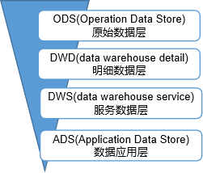
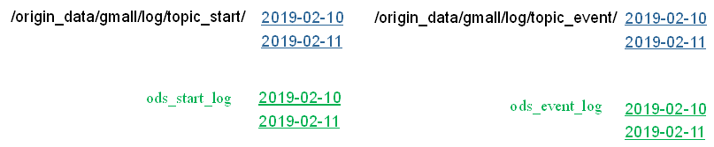
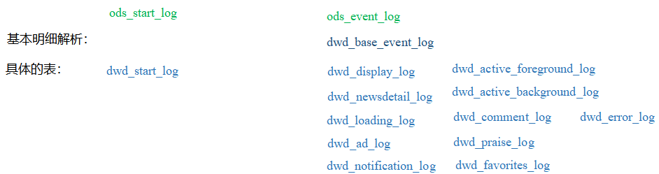
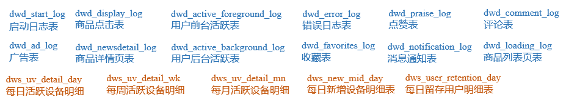
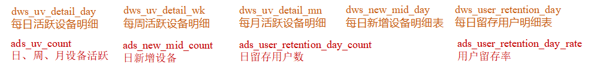
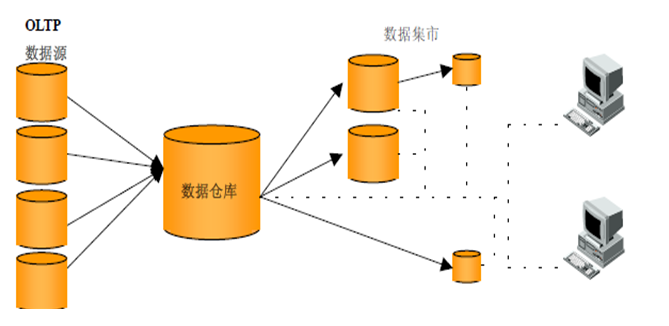
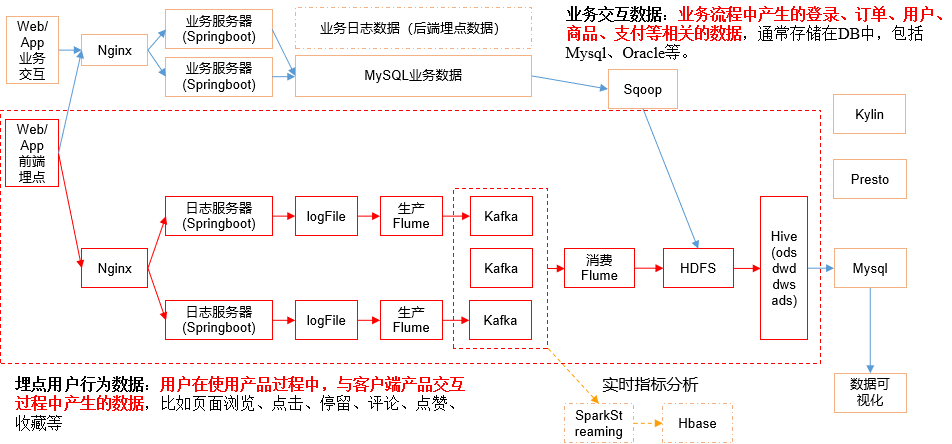
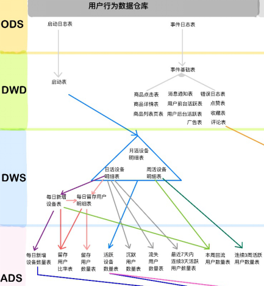

# 数仓分层

## 为什么要分层

- 把复杂的问题简单化
  - 将一个复杂的任务分解多个步骤完成
  - 每一层只做单一的步骤，比较简单
  - ==方便定位问题==

- 减少重复开发
  - 规范数据分层，通过中间数据层数据，可减少极大的重复计算
  - ==增加==一次计算结果的==复用性==

- 隔离原始数据
  - 不论是数据异常还是数据的敏感性，让真实数据与统计数据==解耦==

## 原始数据层 ODS

- ==存放原始数据==
- 直接加载日志，数据
- 数据保持原样不处理

## 明细数据层 DWD

- 结构和粒度与原始表保持一致
- 对ODS层的==数据进行清洗==
  - 去除空值
  - 去除脏数据
  - 去除超过极限范围的数据

## 服务数据层 DWS

- 以DWD为基础，==进行轻度汇总==

- 一般聚集到用户当日，设备当日，商家当日，商品当日等粒度
- 以某一个维度为线索，组成跨主题的==宽表==
- 如一个用户当日的如下数据的多列表
  - 签到数
  - 收藏数
  - 评论数
  - 抽奖数
  - 订阅数
  - 点赞数
  - 浏览商品数
  - 添加购物车数
  - 下单数
  - 支付数
  - 退款数
  - 点击广告数

## 数据应用层 ADS

- ==为各种报表提供数据==

- 也成为APP层，DM层

# 数据集市

- Data Market
- 一种微型的数据仓库
- 有更少的数据
- 更少的主题
- 更少的历史数据
- ==部门级别==
- 一般只能为某个局部范围内的管理人员服务
- 数据仓库是企业级别的
  - 可以为整个企业各个部门的运行提供决策支持手段
- 是数据仓库的子集

# 命名规范

- ODS层命名为ods

- DWD层命名为dwd

- DWS层命名为dws

- ADS层命名为ads

- 临时表数据库命名为xxx_tmp

- 备份数据数据库命名为xxx_bak

# 数仓搭建环境准备

## 集群规划

|       | 服务器hadoop102 | 服务器hadoop103 | 服务器hadoop104 |
| ----- | --------------- | --------------- | --------------- |
| Hive  | Hive            |                 |                 |
| MySQL | MySQL           |                 |                 |

# 总结

## 数仓分几层？每层做什么的？

1）ODS层（原始数据层）

存储原始数据，直接加载原始日志、数据，数据保持原貌不做处理。

2）DWD层（明细层）

对ODS层数据进行清洗（去除空值、脏数据，超过极限范围的数据）

3）DWS层（服务数据层）

以DWD层为基础，进行轻度汇总。比如：用户当日、设备当日、商品当日。

4）ADS层（数据应用层）

## Tez引擎优点？

Tez可以将多个有依赖的作业转换为一个作业，这样只需写一次HDFS，且中间节点较少，从而大大提升作业的计算性能。

## 在项目中是否自定义过UDF、UDTF函数，以及用他们处理了什么问题？

自定义过。

用UDF函数解析公共字段；用UDTF函数解析事件字段

## 如何分析用户活跃？

在启动日志中统计不同设备id 出现次数。

## 如何分析用户新增？

用活跃用户表 left join 用户新增表，用户新增表中mid为空的即为用户新增

## 如何分析用户1天留存？

留存用户=前一天新增 join 今天活跃

用户留存率=留存用户/前一天新增

## 如何分析沉默用户？

按照设备id对日活表分组，登录次数为1，且是在一周前登录

## 如何分析本周回流用户？

本周活跃left join本周新增 left join上周活跃，且本周新增id和上周活跃id都为null

## 如何分析流失用户？

按照设备id对日活表分组，且七天内没有登录过

## 如何分析最近连续3周活跃用户数？

按照设备id对周活进行分组，统计次数等于3次

## 如何分析最近七天内连续三天活跃用户数？

1）查询出最近7天的活跃用户，并对用户活跃日期进行排名

2）计算用户活跃日期及排名之间的差值

3）对同用户及差值分组，统计差值个数

4）将差值相同个数大于等于3的数据取出，然后去重，即为连续3天及以上活跃的用户

## 整个文档中涉及的所有层级及表

 