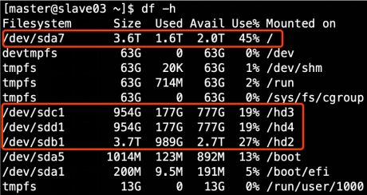

# Hadoop


## HDFS存储多目录

- 确认HDFS的存储目录，保证存储在空间最大硬盘上



- 在hdfs-site.xml文件中配置多目录，最好提前配置好，否则更改目录需要重新启动集群

```xml
<property>
    <name>dfs.datanode.data.dir</name>
<value>file:///${hadoop.tmp.dir}/dfs/data1,file:///hd2/dfs/data2,file:///hd3/dfs/data3,file:///hd4/dfs/data4</value>
</property>
```


## 支持LZO压缩配置

- 先下载lzo的jar项目
- https://github.com/twitter/hadoop-lzo/archive/master.zip
- 下载后的文件名是hadoop-lzo-master，它是一个zip格式的压缩包，先进行解压，然后用maven编译。生成hadoop-lzo-0.4.20.jar
- 将编译好后的hadoop-lzo-0.4.20.jar 放入hadoop-2.7.2/share/hadoop/common/
- 同步hadoop-lzo-0.4.20.jar到hadoop103、hadoop104
- core-site.xml增加配置支持LZO压缩
- 同步core-site.xml到hadoop103、hadoop104

- 启动及查看集群
  - web和进程查看
    - Web查看：http://hadoop102:50070
    - 进程查看：jps查看各个节点状态。
  - 当启动发生错误的时候：
    - 查看日志：/home/atguigu/module/hadoop-2.7.2/logs
    - 如果进入安全模式，可以通过hdfs dfsadmin -safemode leave
    - 停止所有进程，删除data和log文件夹，然后hdfs namenode -format 来格式化

```bash
[ttshe@hadoop102 common]$ pwd
/opt/module/hadoop-2.7.2/share/hadoop/common
[ttshe@hadoop102 software]$ mv hadoop-lzo-0.4.20.jar /opt/module/hadoop-2.7.2/share/hadoop/common/
[ttshe@hadoop102 hadoop]$ vim core-site.xml
```
- 增加如下配置
```xml
<property>
<name>io.compression.codecs</name>
<value>
    org.apache.hadoop.io.compress.GzipCodec,
    org.apache.hadoop.io.compress.DefaultCodec,
    org.apache.hadoop.io.compress.BZip2Codec,
    org.apache.hadoop.io.compress.SnappyCodec,
    com.hadoop.compression.lzo.LzoCodec,
    com.hadoop.compression.lzo.LzopCodec
</value>
</property>
<property>
    <name>io.compression.codec.lzo.class</name>
    <value>com.hadoop.compression.lzo.LzoCodec</value>
</property>
```

```bash
[ttshe@hadoop102 hadoop]$ xsync core-site.xml
```


## 基准测试


### HDFS写性能

- 向HDFS集群写10个128M的文件

```bash
[ttshe@hadoop102 hadoop-2.7.2]$  hadoop jar /opt/module/hadoop-2.7.2/share/hadoop/mapreduce/hadoop-mapreduce-client-jobclient-2.7.2-tests.jar TestDFSIO -write -nrFiles 10 -fileSize 128MB

19/10/04 17:35:16 INFO fs.TestDFSIO: TestDFSIO.1.8
19/10/04 17:35:16 INFO fs.TestDFSIO: nrFiles = 10
19/10/04 17:35:16 INFO fs.TestDFSIO: nrBytes (MB) = 128.0
19/10/04 17:35:16 INFO fs.TestDFSIO: bufferSize = 1000000
19/10/04 17:35:16 INFO fs.TestDFSIO: baseDir = /benchmarks/TestDFSIO
19/10/04 17:35:17 INFO fs.TestDFSIO: creating control file: 134217728 bytes, 10 files
19/10/04 17:35:18 INFO fs.TestDFSIO: created control files for: 10 files
19/10/04 17:35:18 INFO client.RMProxy: Connecting to ResourceManager at hadoop103/192.168.1.103:8032
19/10/04 17:35:18 INFO client.RMProxy: Connecting to ResourceManager at hadoop103/192.168.1.103:8032
19/10/04 17:35:18 INFO mapred.FileInputFormat: Total input paths to process : 10
19/10/04 17:35:19 INFO mapreduce.JobSubmitter: number of splits:10
19/10/04 17:35:19 INFO mapreduce.JobSubmitter: Submitting tokens for job: job_1570170764880_0001
19/10/04 17:35:19 INFO impl.YarnClientImpl: Submitted application application_1570170764880_0001
19/10/04 17:35:19 INFO mapreduce.Job: The url to track the job: http://hadoop103:8088/proxy/application_1570170764880_0001/
19/10/04 17:35:19 INFO mapreduce.Job: Running job: job_1570170764880_0001
19/10/04 17:35:25 INFO mapreduce.Job: Job job_1570170764880_0001 running in uber mode : false
19/10/04 17:35:25 INFO mapreduce.Job:  map 0% reduce 0%
19/10/04 17:35:35 INFO mapreduce.Job:  map 20% reduce 0%
19/10/04 17:35:44 INFO mapreduce.Job:  map 20% reduce 7%
19/10/04 17:35:50 INFO mapreduce.Job:  map 30% reduce 7%
19/10/04 17:35:52 INFO mapreduce.Job:  map 37% reduce 7%
19/10/04 17:35:53 INFO mapreduce.Job:  map 37% reduce 10%
19/10/04 17:35:54 INFO mapreduce.Job:  map 77% reduce 10%
19/10/04 17:35:57 INFO mapreduce.Job:  map 80% reduce 10%
19/10/04 17:35:58 INFO mapreduce.Job:  map 83% reduce 10%
19/10/04 17:35:59 INFO mapreduce.Job:  map 100% reduce 100%
19/10/04 17:36:00 INFO mapreduce.Job: Job job_1570170764880_0001 completed successfully
19/10/04 17:36:00 INFO mapreduce.Job: Counters: 51
	File System Counters
		FILE: Number of bytes read=855
		FILE: Number of bytes written=1304923
		FILE: Number of read operations=0
		FILE: Number of large read operations=0
		FILE: Number of write operations=0
		HDFS: Number of bytes read=2350
		HDFS: Number of bytes written=1342177360
		HDFS: Number of read operations=43
		HDFS: Number of large read operations=0
		HDFS: Number of write operations=12
	Job Counters 
		Killed map tasks=1
		Launched map tasks=11
		Launched reduce tasks=1
		Data-local map tasks=8
		Rack-local map tasks=3
		Total time spent by all maps in occupied slots (ms)=250002
		Total time spent by all reduces in occupied slots (ms)=22609
		Total time spent by all map tasks (ms)=250002
		Total time spent by all reduce tasks (ms)=22609
		Total vcore-milliseconds taken by all map tasks=250002
		Total vcore-milliseconds taken by all reduce tasks=22609
		Total megabyte-milliseconds taken by all map tasks=256002048
		Total megabyte-milliseconds taken by all reduce tasks=23151616
	Map-Reduce Framework
		Map input records=10
		Map output records=50
		Map output bytes=749
		Map output materialized bytes=909
		Input split bytes=1230
		Combine input records=0
		Combine output records=0
		Reduce input groups=5
		Reduce shuffle bytes=909
		Reduce input records=50
		Reduce output records=5
		Spilled Records=100
		Shuffled Maps =10
		Failed Shuffles=0
		Merged Map outputs=10
		GC time elapsed (ms)=9328
		CPU time spent (ms)=82930
		Physical memory (bytes) snapshot=3074449408
		Virtual memory (bytes) snapshot=23327510528
		Total committed heap usage (bytes)=2098200576
	Shuffle Errors
		BAD_ID=0
		CONNECTION=0
		IO_ERROR=0
		WRONG_LENGTH=0
		WRONG_MAP=0
		WRONG_REDUCE=0
	File Input Format Counters 
		Bytes Read=1120
	File Output Format Counters 
		Bytes Written=80
19/10/04 17:36:00 INFO fs.TestDFSIO: ----- TestDFSIO ----- : write
# 写的测试结果
19/10/04 17:36:00 INFO fs.TestDFSIO:            Date & time: Fri Oct 04 17:36:00 CST 2019
19/10/04 17:36:00 INFO fs.TestDFSIO:        Number of files: 10
19/10/04 17:36:00 INFO fs.TestDFSIO: Total MBytes processed: 1280.0
# 吞吐量
19/10/04 17:36:00 INFO fs.TestDFSIO:      Throughput mb/sec: 21.999553134076965
19/10/04 17:36:00 INFO fs.TestDFSIO: Average IO rate mb/sec: 37.18858337402344
19/10/04 17:36:00 INFO fs.TestDFSIO:  IO rate std deviation: 32.58706395698196
19/10/04 17:36:00 INFO fs.TestDFSIO:     Test exec time sec: 42.302
19/10/04 17:36:00 INFO fs.TestDFSIO: 
```


### HDFS读性能

- 读取HDFS集群10个128M的文件

```bash
[ttshe@hadoop102 mapreduce]$ hadoop jar /opt/module/hadoop-2.7.2/share/hadoop/mapreduce/hadoop-mapreduce-client-jobclient-2.7.2-tests.jar TestDFSIO -read -nrFiles 10 -fileSize 128MB

19/10/04 17:39:54 INFO fs.TestDFSIO: TestDFSIO.1.8
19/10/04 17:39:54 INFO fs.TestDFSIO: nrFiles = 10
19/10/04 17:39:54 INFO fs.TestDFSIO: nrBytes (MB) = 128.0
19/10/04 17:39:54 INFO fs.TestDFSIO: bufferSize = 1000000
19/10/04 17:39:54 INFO fs.TestDFSIO: baseDir = /benchmarks/TestDFSIO
19/10/04 17:39:55 INFO fs.TestDFSIO: creating control file: 134217728 bytes, 10 files
19/10/04 17:39:55 INFO fs.TestDFSIO: created control files for: 10 files
19/10/04 17:39:55 INFO client.RMProxy: Connecting to ResourceManager at hadoop103/192.168.1.103:8032
19/10/04 17:39:55 INFO client.RMProxy: Connecting to ResourceManager at hadoop103/192.168.1.103:8032
19/10/04 17:39:55 INFO mapred.FileInputFormat: Total input paths to process : 10
19/10/04 17:39:56 INFO mapreduce.JobSubmitter: number of splits:10
19/10/04 17:39:56 INFO mapreduce.JobSubmitter: Submitting tokens for job: job_1570170764880_0002
19/10/04 17:39:56 INFO impl.YarnClientImpl: Submitted application application_1570170764880_0002
19/10/04 17:39:56 INFO mapreduce.Job: The url to track the job: http://hadoop103:8088/proxy/application_1570170764880_0002/
19/10/04 17:39:56 INFO mapreduce.Job: Running job: job_1570170764880_0002
19/10/04 17:40:00 INFO mapreduce.Job: Job job_1570170764880_0002 running in uber mode : false
19/10/04 17:40:00 INFO mapreduce.Job:  map 0% reduce 0%
19/10/04 17:40:07 INFO mapreduce.Job:  map 10% reduce 0%
19/10/04 17:40:08 INFO mapreduce.Job:  map 90% reduce 0%
19/10/04 17:40:09 INFO mapreduce.Job:  map 100% reduce 0%
19/10/04 17:40:11 INFO mapreduce.Job:  map 100% reduce 100%
19/10/04 17:40:11 INFO mapreduce.Job: Job job_1570170764880_0002 completed successfully
19/10/04 17:40:11 INFO mapreduce.Job: Counters: 50
	File System Counters
		FILE: Number of bytes read=847
		FILE: Number of bytes written=1304885
		FILE: Number of read operations=0
		FILE: Number of large read operations=0
		FILE: Number of write operations=0
		HDFS: Number of bytes read=1342179630
		HDFS: Number of bytes written=80
		HDFS: Number of read operations=53
		HDFS: Number of large read operations=0
		HDFS: Number of write operations=2
	Job Counters 
		Launched map tasks=10
		Launched reduce tasks=1
		Data-local map tasks=8
		Rack-local map tasks=2
		Total time spent by all maps in occupied slots (ms)=54925
		Total time spent by all reduces in occupied slots (ms)=1526
		Total time spent by all map tasks (ms)=54925
		Total time spent by all reduce tasks (ms)=1526
		Total vcore-milliseconds taken by all map tasks=54925
		Total vcore-milliseconds taken by all reduce tasks=1526
		Total megabyte-milliseconds taken by all map tasks=56243200
		Total megabyte-milliseconds taken by all reduce tasks=1562624
	Map-Reduce Framework
		Map input records=10
		Map output records=50
		Map output bytes=741
		Map output materialized bytes=901
		Input split bytes=1230
		Combine input records=0
		Combine output records=0
		Reduce input groups=5
		Reduce shuffle bytes=901
		Reduce input records=50
		Reduce output records=5
		Spilled Records=100
		Shuffled Maps =10
		Failed Shuffles=0
		Merged Map outputs=10
		GC time elapsed (ms)=2153
		CPU time spent (ms)=13300
		Physical memory (bytes) snapshot=2896904192
		Virtual memory (bytes) snapshot=23212634112
		Total committed heap usage (bytes)=2170028032
	Shuffle Errors
		BAD_ID=0
		CONNECTION=0
		IO_ERROR=0
		WRONG_LENGTH=0
		WRONG_MAP=0
		WRONG_REDUCE=0
	File Input Format Counters 
		Bytes Read=1120
	File Output Format Counters 
		Bytes Written=80
19/10/04 17:40:11 INFO fs.TestDFSIO: ----- TestDFSIO ----- : read
19/10/04 17:40:11 INFO fs.TestDFSIO:            Date & time: Fri Oct 04 17:40:11 CST 2019
19/10/04 17:40:11 INFO fs.TestDFSIO:        Number of files: 10
19/10/04 17:40:11 INFO fs.TestDFSIO: Total MBytes processed: 1280.0
19/10/04 17:40:11 INFO fs.TestDFSIO:      Throughput mb/sec: 376.9140164899882
19/10/04 17:40:11 INFO fs.TestDFSIO: Average IO rate mb/sec: 588.0826416015625
19/10/04 17:40:11 INFO fs.TestDFSIO:  IO rate std deviation: 270.15683018744534
19/10/04 17:40:11 INFO fs.TestDFSIO:     Test exec time sec: 16.109
19/10/04 17:40:11 INFO fs.TestDFSIO: 
```

- 知道读取和写入速度，可以知道业务场景每日可以处理数据的速率

  

### 删除测试数据

```bash
[ttshe@hadoop102 mapreduce]$ hadoop jar /opt/module/hadoop-2.7.2/share/hadoop/mapreduce/hadoop-mapreduce-client-jobclient-2.7.2-tests.jar TestDFSIO -clean
```


### 用Sort程序评测MapReduce

- 使用RandomWriter来产生随机数，每个节点运行10个Map任务，每个Map产生大约1G大小的二进制随机数

```bash
[ttshe@hadoop102 mapreduce]$ hadoop jar /opt/module/hadoop-2.7.2/share/hadoop/mapreduce/hadoop-mapreduce-examples-2.7.2.jar randomwriter random-data
```

- 执行sort

```bash
[ttshe@hadoop102 mapreduce]$ hadoop jar /opt/module/hadoop-2.7.2/share/hadoop/mapreduce/hadoop-mapreduce-examples-2.7.2.jar sort random-data sorted-data
```

- 验证数据是否真正排好序

```bash
[ttshe@hadoop102 mapreduce]$ hadoop jar /opt/module/hadoop-2.7.2/share/hadoop/mapreduce/hadoop-mapreduce-examples-2.7.2.jar testmapredsort -sortInput random-data -sortOutput sorted-data
```

- 注意：测试集群不好不要尝试，容易崩


## Hadoop参数调优


### HDFS参数调优

- hdfs-site.xml
  - dfs.namenode.handler.count=20 * log2(Cluster Size)
    - 比如集群规模为8台时，此参数设置为60
    - The number of Namenode RPC server threads that listen to requests from clients. If dfs.namenode.servicerpc-address is not configured then Namenode RPC server threads listen to requests from all nodes.
    - ==NameNode有一个工作线程池，用来处理不同DataNode的并发心跳以及客户端并发的元数据操作==
    - 对于大集群或者有大量客户端的集群来说，通常需要增大参数dfs.namenode.handler.count
      - 默认值10
      - 设置该值的一般原则是将其设置为集群大小的自然对数乘以20
        - 即20logN，N为集群大小
  - 编辑日志存储路径dfs.namenode.edits.dir设置与镜像文件存储路径dfs.namenode.name.dir尽量分开
    - 达到最低写入延迟


### YARN参数调优

- yarn-site.xml
- 情景描述
  - 总共7台机器，每天几亿条数据，数据源->Flume->Kafka->HDFS->Hive
- 面临问题
  - 数据统计主要用HiveSQL，没有数据倾斜，小文件已经做了合并处理，开启的JVM重用，而且IO没有阻塞，==内存用了不到50%==
  - 但是还是跑的非常慢，而且数据量洪峰过来时，整个集群都会宕掉。基于这种情况有没有优化方案
- 解决办法
  - 内存利用率不够。这个一般是Yarn的2个配置造成的
    - 单个任务可以申请的最大内存大小
    - Hadoop单个节点可用内存大小
  - 调节这两个参数能提高系统内存的利用率
  - yarn.nodemanager.resource.memory-mb
    - 表示该节点上YARN可使用的物理内存总量
    - 默认是8192MB
    - 注意如果你的节点内存资源不够8GB，则需要调减小这个值，而YARN不会智能的探测节点的物理内存总量
  - yarn.scheduler.maximum-allocation-mb
    - 单个任务可申请的最多物理内存量
    - 默认是8192MB


### Hadoop宕机

- 如果MR造成系统宕机
  - 控制Yarn同时运行的任务数
  - 控制每个任务申请的最大内存
  - 调整参数：yarn.scheduler.maximum-allocation-mb
    - 单个任务可申请的最多物理内存量，默认是8192MB

- 如果写入文件过量造成NameNode宕机
  - 调高Kafka的存储大小
  - 控制从Kafka到HDFS的写入速度
  - 高峰期的时候用Kafka进行缓存
  - 高峰期过去数据同步会自动跟上


# Zookeeper

- Zookeeper群起脚本失效，远程ssh失效


## Linux环境变量

- 修改/etc/profile文件
  - 用来设置系统环境参数
    - 如$PATH
  - 这里面的环境变量是对系统内所有用户生效
  - 使用bash命令，需要source  /etc/profile一下

- 修改~/.bashrc文件
  - 针对==某一个特定的用户==，环境变量的设置只对该用户自己有效
  - 使用bash命令，==只要以该用户身份运行命令行就会读取该文件==

- 把/etc/profile里面的环境变量追加到~/.bashrc目录

```bash
[ttshe@hadoop102 ~]$ cat /etc/profile >> ~/.bashrc
[ttshe@hadoop103 ~]$ cat /etc/profile >> ~/.bashrc
[ttshe@hadoop104 ~]$ cat /etc/profile >> ~/.bashrc
```


# Flume

## Flume组件

- Source
  - **Taildir Source**
    - 相比Exec Source、Spooling Directory Source的优势
      - ==断点续传==
      - 多目录
      - Flume1.6以前要自定义Source记录每次读取文件位置，实现断点续传
  - Exec Source
    - 可实时搜集数据
    - 在Flume不运行或者Shell命令出错的情况下，数据将会丢失
  - Spooling Directory Source
    - 监控目录
    - 不支持断点续传

- batchSize大小如何设置
  - Event 1K左右时，500-1000合适
  - 默认为100

- Channel
  - 采用==Kafka Channel==
    - 省去Sink
    - 提高效率


## 内存优化

- 问题描述：如果启动消费Flume抛出如下异常

```bash
ERROR hdfs.HDFSEventSink: process failed
java.lang.OutOfMemoryError: GC overhead limit exceeded
```

- 解决方案步骤
  - 在hadoop102服务器的/opt/module/flume/conf/flume-env.sh文件中增加如下配置
  - 同步配置到hadoop103、hadoop104服务器

```bash
export JAVA_OPTS="-Xms4096m -Xmx4096m -Dcom.sun.management.jmxremote"
```

- Flume内存参数设置及优化
  - JVM heap一般设置为4G或更高，部署在单独的服务器上
    - 4核8线程16G内存
  - -Xmx与-Xms最好设置一致
    - 减少内存抖动带来的性能影响
    - 如果设置不一致容易导致频繁fullgc


## Channel优化

- FileChannel和MemoryChannel区别
  - MemoryChannel
    - 传输数据速度更快，但因为数据保存在JVM的堆内存中
    - Agent进程挂掉会导致数据丢失，适用于对数据质量要求不高的需求
  - FileChannel
    - 传输速度相对于Memory慢，但数据安全保障高
    - Agent进程挂掉也可以从失败中恢复数据

- FileChannel优化

  - 通过配置==dataDirs指向多个路径==，每个路径对应不同的硬盘，增大Flume吞吐量
  - checkpointDir和backupCheckpointDir也尽量配置在不同硬盘对应的目录中
    - 保证checkpoint坏掉后，可快速使用backupCheckpointDir恢复数据

  - 官方说明如下

```text
Comma separated list of directories for storing log files. Using multiple directories on separate disks can improve file channel peformance
```


## HDFS Sink优化

- HDFS存入大量小文件，有什么影响
  - 元数据层面
    - 每个小文件都有一份元数据，其中包括文件路径，文件名，所有者，所属组，权限，创建时间等，这些信息都保存在Namenode内存中
    - 小文件过多，会占用Namenode服务器大量内存，影响Namenode性能和使用寿命
  - 计算层面
    - 默认情况下MR会对每个小文件启用一个Map任务计算，非常影响计算性能
    - 同时也影响磁盘寻址时间
- ==HDFS小文件处理==
  - 官方默认的三个参数配置写入HDFS后会产生小文件
    - hdfs.rollInterval
    - hdfs.rollSize
    - hdfs.rollCount
  - 基于以上hdfs.rollInterval=3600，hdfs.rollSize=134217728，hdfs.rollCount =0，hdfs.roundValue=10，hdfs.roundUnit= second几个参数综合作用，效果如下
    - tmp文件在达到128M时会滚动生成正式文件
    - tmp文件创建超3600秒时会滚动生成正式文件
      - 时间优先级高
    - 如：
      - 在2018-01-01 05:23的时侯sink接收到数据，那会产生如下tmp文件
        - /atguigu/20180101/atguigu.201801010620.tmp
        - 即使文件内容没有达到128M，也会在06:23时滚动生成正式文件


# Kafka


## 压测

- 用Kafka官方自带的脚本，对Kafka进行压测
- Kafka压测时，可查看到哪个地方出现了瓶颈（CPU，内存，网络IO）
  - 一般都是网络IO达到瓶颈
  - kafka-consumer-perf-test.sh
  - kafka-producer-perf-test.sh


### Kafka Producer压力测试

- record-size
  - 是一条信息有多大
  - 单位是字节
- num-records
  - 是总共发送多少条信息
- throughput
  - 是每秒多少条信息

```bash
[ttshe@hadoop102 kafka]$ bin/kafka-producer-perf-test.sh  --topic test --record-size 100 --num-records 100000 --throughput 1000 --producer-props bootstrap.servers=hadoop102:9092,hadoop103:9092,hadoop104:9092
```

- 结果

```bash
[2019-10-05 06:58:30,137] WARN Error while fetching metadata with correlation id 3 : {test=LEADER_NOT_AVAILABLE} (org.apache.kafka.clients.NetworkClient)
5002 records sent, 1000.0 records/sec (0.10 MB/sec), 2.3 ms avg latency, 220.0 max latency.
5007 records sent, 1001.2 records/sec (0.10 MB/sec), 0.7 ms avg latency, 9.0 max latency.
...
5002 records sent, 1000.2 records/sec (0.10 MB/sec), 0.6 ms avg latency, 8.0 max latency.
5001 records sent, 1000.2 records/sec (0.10 MB/sec), 0.5 ms avg latency, 6.0 max latency.

100000 records sent, 999.970001 records/sec (0.10 MB/sec), 0.73 ms avg latency, 220.00 ms max latency, 0 ms 50th, 2 ms 95th, 4 ms 99th, 32 ms 99.9th.
```

- 本例中一共写入10w条消息，每秒向Kafka写入了0.10MB的数据，平均是1000条消息/秒，每次写入的平均延迟为0.7ms，最大的延迟为220ms

- 测试与生产环境的数据一致，测试是否符合生产条件


### Kafka Consumer压力测试

- Consumer的测试，如果这四个指标（IO，CPU，内存，网络）都不能改变，考虑增加分区数来提升性能

```bash
[ttshe@hadoop102 kafka]$ bin/kafka-consumer-perf-test.sh --zookeeper hadoop102:2181 --topic test --fetch-size 10000 --messages 10000000 --threads 1
```

- 消费的速度要大于生产的速度，否则会有堆积

- 参数说明：
  - --zookeeper 指定zookeeper的链接信息
  - --topic 指定topic的名称
  - --fetch-size 指定每次fetch的数据的大小
  - --messages 总共要消费的消息个数
  - --threads 线程数个数
- 结果
  - 开始测试时间
  - 测试结束数据
  - 最大吞吐率
    - 9.5367MB/s
  - 平均每秒消费
    - 7.8042MB/s
  - 最大每秒消费
    - 100000条
  - 平均每秒消费
    - 81833.0606条

```bash
start.time, end.time, data.consumed.in.MB, MB.sec, data.consumed.in.nMsg, nMsg.sec
2019-10-05 07:06:44:901, 2019-10-05 07:06:46:123, 9.5367, 7.8042, 100000, 81833.0606
```


## 机器数量计算

- Kafka机器数量=`2*（峰值生产速度*副本数/100）+1`

- 先要预估一天大概产生多少数据，然后用Kafka自带的生产压测
  - 只测试Kafka的写入速度，保证数据不积压
- 计算出峰值生产速度。再根据设定的副本数，就能预估出需要部署Kafka的数量

- 比如采用压力测试测出写入的速度是10M/s一台，峰值的业务数据的速度是50M/s。副本数为2
  - Kafka机器数量=`2*（50*2/100）+ 1`=3台
    - 每天2亿条数据，3台满足


# 数仓调试

- ZK容易出现问题，要查看ZK的状态
  - myid配置的问题
- Kafka也容易出现问题，查看是否可以正常生产和消费消息
  - brokerid配置问题
- 第一级别flume
  - 开发时，日志不要放在黑洞里面


# Shell


## Shell中单引号和双引号区别

- 在/home/atguigu/bin创建一个test.sh文件

```bash
[ttshe@hadoop102 bin]$ vim test.sh 
```

- 在文件中添加如下内容

```bash
#!/bin/bash
do_date=$1

echo '$do_date'
echo "$do_date"
echo "'$do_date'"
echo '"$do_date"'
echo `date`
```

- 查看执行结果

```bash
[ttshe@hadoop102 bin]$ test.sh 2019-02-10
$do_date
2019-02-10
'2019-02-10'
"$do_date"
2019年 05月 02日 星期四 21:02:08 CST
```

- 总结
  - 单引号不取变量值
  - 双引号取变量值
  - 反引号`，执行引号中命令
  - 双引号内部嵌套单引号，取出变量值
  - 单引号内部嵌套双引号，不取出变量值


# Hive


## Union与Union all区别

- 准备两张表

```sql
tableA			                  tableB
id　　name　　score             id　　name　　score
1　　　a　　　　80               1　　  d　　　　48
2　　  b　　　　79               2　　　e　　　　23
3　　  c　　  　68               3　　　c　　　　86
```

- 采用union查询

```sql
select name from tableA　　　　　　　　　　　　　
union　　　　　　　　　　　　　　　　　　　　　　　　
select name from tableB　　　　　　　　　　　　　
查询结果
name
a
d
b
e
c
```

- 采用union all查询

```sql
select name from tableA
union all
select name from tableB
查询结果
name
a
b
c
d
e
c
```

- 总结
  - union会将联合的结果集去重，效率较union all差
  - union all不会对结果集去重，所以效率高


# Sqoop参数

```bash
/opt/module/sqoop/bin/sqoop import \
--connect \
--username \
--password \
--target-dir \
--delete-target-dir \
--num-mappers \
--fields-terminated-by   \
--query   "$2" ' and $CONDITIONS;'
```


## Sqoop导入导出Null存储一致性问题

Hive中的Null在底层是以“\N”来存储，而MySQL中的Null在底层就是Null，为了保证数据两端的一致性。在导出数据时采用--input-null-string和--input-null-non-string两个参数。导入数据时采用--null-string和--null-non-string


## Sqoop数据导出一致性问题

- 先导出到mysql临时表，临时表成功后再向目标mysql表导入数据

- 场景1：如Sqoop在导出到Mysql时，使用4个Map任务，过程中有2个任务失败，那此时MySQL中存储了另外两个Map任务导入的数据，此时老板正好看到了这个报表数据。而开发工程师发现任务失败后，会调试问题并最终将全部数据正确的导入MySQL，那后面老板再次看报表数据，发现本次看到的数据与之前的不一致，这在生产环境是不允许的

- 官网：http://sqoop.apache.org/docs/1.4.6/SqoopUserGuide.html

```text
Since Sqoop breaks down export process into multiple transactions, it is possible that a failed export job may result in partial data being committed to the database. This can further lead to subsequent jobs failing due to insert collisions in some cases, or lead to duplicated data in others. You can overcome this problem by specifying a staging table via the --staging-table option which acts as an auxiliary table that is used to stage exported data. The staged data is finally moved to the destination table in a single transaction.
```

- –staging-table方式
  - --clear-staging-table 表示成功后清除临时表

```text
sqoop export --connect jdbc:mysql://192.168.137.10:3306/user_behavior --username root --password 123456 --table app_cource_study_report --columns watch_video_cnt,complete_video_cnt,dt --fields-terminated-by "\t" --export-dir "/user/hive/warehouse/tmp.db/app_cource_study_analysis_${day}" --staging-table app_cource_study_report_tmp --clear-staging-table --input-null-string '\N'
```

- 场景2：设置map数量为1个（不推荐，面试官想要的答案不只这个）
  - 多个Map任务时，采用–staging-table方式，仍然可以解决数据一致性问题


## Sqoop底层运行的任务是什么

- 只有Map阶段，没有Reduce阶段的任务

  

## Sqoop数据导出的时候一次执行多长时间

- Sqoop任务5分钟-2个小时的都有。取决于数据量