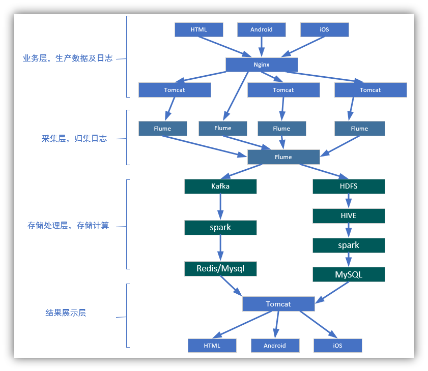
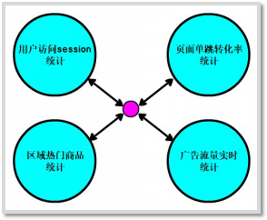

# 简介

本项目来源于企业级电商网站的大数据统计分析平台，该平台以 Spark 框架为核心，对电商网站的日志进行离线和实时分析。 

该大数据分析平台对电商网站的各种用户行为（访问行为、购物行为、广告点击行为等）进行分析，根据平台统计出来的数据，辅助公司中的 PM（产品经理）、数据分析师以及管理人员分析现有产品的情况，并根据用户行为分析结果持续改进产品的设计，以及调整公司的战略和业务。最终达到用大数据技术来帮助提升公司的业绩、营业额以及市场占有率的目标。 

本项目使用了 Spark 技术生态栈中最常用的三个技术框架，Spark Core、Spark SQL 和 Spark Streaming，进行离线计算和实时计算业务模块的开发。实现了包括用户访问 session 分析、页面单跳转化率统计、热门商品离线统计、广告流量实时统计 4 个业务模块。通过合理的将实际业务模块进行技术整合与改造，该项目几乎完全涵盖了 Spark Core、Spark SQL 和 Spark Streaming 这三个技术框架中大部分的功能点、知识点，学员对于 Spark 技术框架的理解将会在本项目中得到很大的提高

## 整体框架

## 业务需求

本项目分为**离线分析系统**与**实时分析系统**两大模块。 

在离线分析系统中，我们将模拟业务数据写入 Hive 表中，离线分析系统从 Hive 中获取数据，并根据实际需求（用户访问 Session 分析、页面单跳转化率分析、各区域热门商品统计）对数据进行处理，最终将分析完毕的统计数据存储到 MySQL 的对应表格中。 

在实时分析系统中，我们将模拟业务数据写入 Kafka 集群中，实时分析系统从 Kafka broker 中获取数据，通过 Spark Streaming 的流式处理对广告点击流量进行实时分析，最终将统计结果存储到 MySQL 的对应表格中

## 数据源分析

### user_visit_action 

- user_visit_action 表
- ==存放网站或者 APP 每天的点击流数据==
- 通俗地讲，就是用户对网站/APP 每点击一下，就会产生一条存放在这个表里面的数据

| **字段名称**           | **说明**                                                     |
| ---------------------- | ------------------------------------------------------------ |
| **date**               | 日期，代表这个用户点击行为是在哪一天发生的                   |
| **user_id**            | 用户 ID，唯一标识某个用户                                    |
| **session_id**         | Session ID，唯一标识某个用户的一个访问 session               |
| **page_id**            | 页面 ID，点击了某些商品/品类，也可能是搜索了某个关键词，然后进入了某个页面，页面的 id |
| **action_time**        | 动作时间，这个点击行为发生的时间点                           |
| **search_keyword**     | 搜索关键词，如果用户执行的是一个搜索行为，比如说在网站/app 中，搜索了某个关键词，然后会跳转到商品列表页面； |
| **click_category_id**  | 点击品类 ID，可能是在网站首页，点击了某个品类（美食、电子设备、电脑） |
| **click_product_id**   | 点击商品 ID，可能是在网站首页，或者是在商品列表页，点击了某个商品（比如呷哺呷哺火锅 XX 路店 3 人套餐、iphone 6s） |
| **order_category_ids** | 下单品类 ID，代表了可能将某些商品加入了购物车，然后一次性对购物车中的商品下了一个订单，这就代表了某次下单的行为中，有哪些商品品类，可能有 6 个商品，但是就对应了 2 个品类，比如有 3 根火腿肠（食品品类），3 个电池（日用品品类） |
| **order_product_ids**  | 下单商品 ID，某次下单，具体对哪些商品下的订单                |
| **pay_category_ids**   | 付款品类 ID，对某个订单，或者某几个订单，进行了一次支付的行为，对应了哪些品类 |
| **pay_product_ids**    | 付款商品 ID，支付行为下，对应的哪些具体的商品                |
| **city_id**            | 城市 ID，代表该用户行为发生在哪个城市 ,和城市信息表做关联    |

### user_info

- user_info 表
- 一张普通的用户基本信息表
- 存放了网站/APP 所有注册用户的基本信息

| **字段名称**     | **说明**                  |
| ---------------- | ------------------------- |
| **user_id**      | 用户 ID，唯一标识某个用户 |
| **username**     | 用户登录名                |
| **name**         | 用户昵称或真实姓名        |
| **age**          | 用户年龄                  |
| **professional** | 用户职业                  |
| **gender**       | 用户性别                  |

### product_info

- product_info 表，是一张普通的商品基本信息表；这张表中存放了网站/APP 所有商品的基本信息

| **字段名称**     | **说明**                                   |
| ---------------- | ------------------------------------------ |
| **proudct_id**   | 商品 ID，唯一标识某个商品                  |
| **product_name** | 商品名称                                   |
| **extend_info**  | 额外信息，例如商品为自营商品还是第三方商品 |

### city_info

| **字段名称**  | **说明**                       |
| ------------- | ------------------------------ |
| **city_id**   | 城市ID                         |
| **city_name** | 城市名称                       |
| **area**      | 地区名称，如：华北，华东，西北 |

### 实时数据

- 程序每 5 秒向 Kafka 集群写入数据，格式如下： 

- 格式 ：timestamp  province  city  userid  adid

| **字段名称**  | **取值范围**                                  |
| ------------- | --------------------------------------------- |
| **timestamp** | 当前时间毫秒  类型：数字                      |
| **userId**    | 用户id，类型：数字                            |
| **area**      | 东北、华北、西南   类型：文本                 |
| **city**      | 城市中文名： 北京、上海、青岛等    类型：文本 |
| **adid**      | 点击的广告编号，数字                          |

## 需求

### 用户访问 session 统计

用户在电商网站上，通常会有很多的访问行为，通常都是进入首页，然后可能点击首页上的一些商品，点击首页上的一些品类，也可能随时在搜索框里面搜索关键词，还可能将一些商品加入购物车，对购物车中的多个商品下订单，最后对订单中的多个商品进行支付。 

用户的每一次操作，其实可以理解为一个 action，在本项目中，我们关注==点击、搜索、下单、支付==这四个用户行为。 

用户 session，是在电商平台的角度定义的会话概念，指的就是，从用户第一次进入首页，session 就开始了。然后在一定时间范围内，直到最后操作完（可能做了几十次、甚至上百次操作），离开网站，关闭浏览器，或者长时间没有做操作，那么 session 就结束了。 

==以上用户在网站内的访问过程，就称之为一次 session==。简单理解，session 就是某一天某一个时间段内，某个用户对网站从打开/进入，到做了大量操作，到最后关闭浏览器。的过程，就叫做 session。 

==session 实际上就是一个电商网站中最基本的数据和大数据==。那么面向消费者/ 用户端的大数据分析（C 端），最基本的就是面向用户访问行为/用户访问 session 的分析。 

该模块主要是对用户访问 session 进行统计分析，包括 ==session 聚合指标计算（求平均每个session步长分布比例，访问时长分布比例）、按时间比例随机抽取 session、获取每天点击、下单和购买排名前 10 的品类、并获取 top10 品类中排名前 10 的 session==。该模块可以让产品经理、数据分析师以及企业管理层形象地看到各种条件下的具体用户行为以及统计指标，从而对公司的产品设计以及业务发展战略做出调整。主要使用 Spark Core 实现

### 页面单跳转化率统计

该模块主要是计算==关键页面之间的单步跳转转化率==，涉及到页面切片算法以及页面流匹配算法。该模块可以让产品经理、数据分析师以及企业管理层看到各个关键页面之间的转化率，从而对网页布局，进行更好的优化设计。主要使用 Spark Core 实现。

### 区域热门商品统计

该模块主要实现==每天统计出各个区域的 top3 热门商品==。该模块可以让企业管理层看到电商平台在不同区域出售的商品的整体情况，从而对公司的商品相关的战略进行调整。主要使用 Spark SQL 实现

### 广告流量实时统计

网站 / app 中经常会给第三方平台做广告，这也是一些互联网公司的核心收入来源；当广告位招商完成后，广告会在网站 / app 的某个广告位发布出去，当用户访问网站 / app 的时候，会看到相应位置的广告，此时，有些用户可能就会去点击那个广告。 

我们要获取用户点击广告的行为，并针对这一行为进行计算和统计。 

用户每次点击一个广告以后，会产生相应的埋点日志；在大数据实时统计系统中，会通过某些方式将数据写入到分布式消息队列中（Kafka）

日志发送给后台 web 服务器（nginx），nginx 将日志数据负载均衡到多个 Tomcat 服务器上，Tomcat 服务器会不断将日志数据写入 Tomcat 日志文件中，写入后，就会被日志采集客户端（比如 flume agent）所采集，随后写入到消息队列中（kafka），我们的实时计算程序会从消息队列中（kafka）去实时地拉取数据，然后对数据进行实时的计算和统计。 

这个模块的意义在于，让产品经理、高管可以实时地掌握到公司打的各种广告的投放效果。以便于后期持续地对公司的广告投放相关的战略和策略，进行调整和优化；以期望获得最好的广告收益。该模块负责实时统计公司的广告流量，包括广告展现流量和广告点击流量。

==实现动态黑名单机制，以及黑名单过滤；实现滑动窗口内的各城市的广告展现流量和广告点击流量的统计；实现每个区域每个广告的点击流量实时统计；实现每个区域 top3 点击量的广告的统计==。主要使用 Spark Streaming 实现

