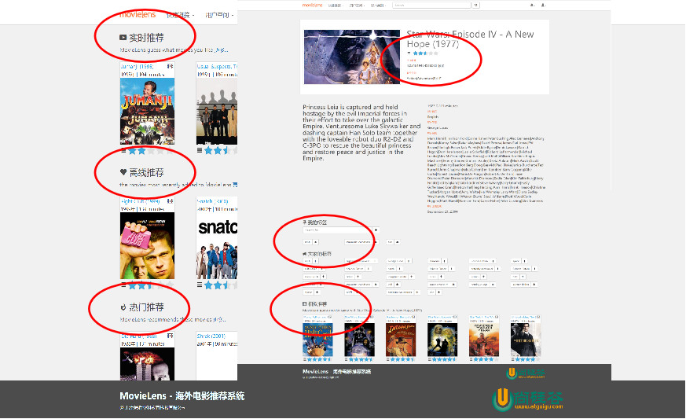
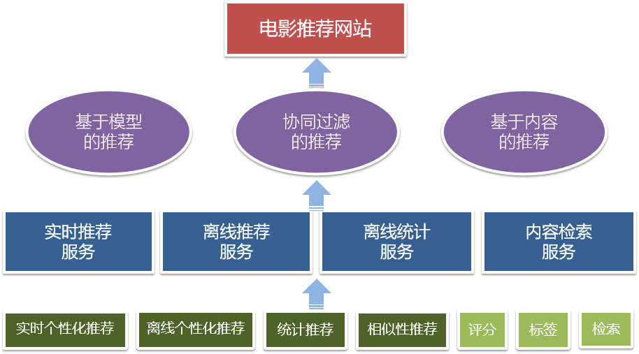
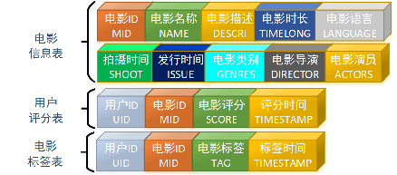
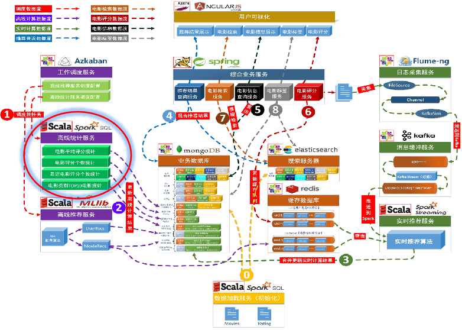
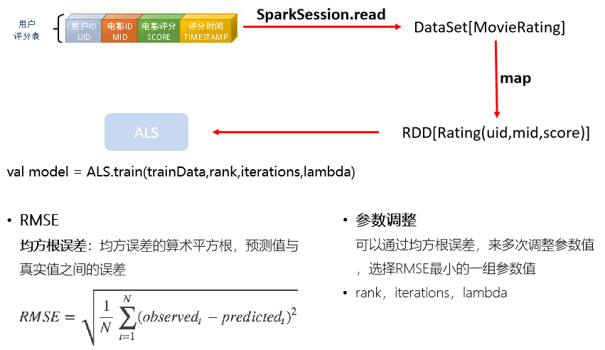
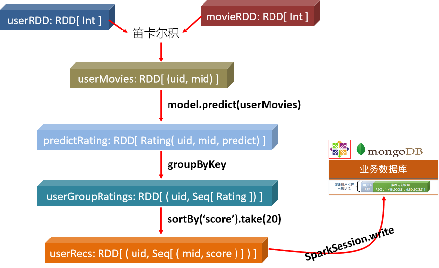
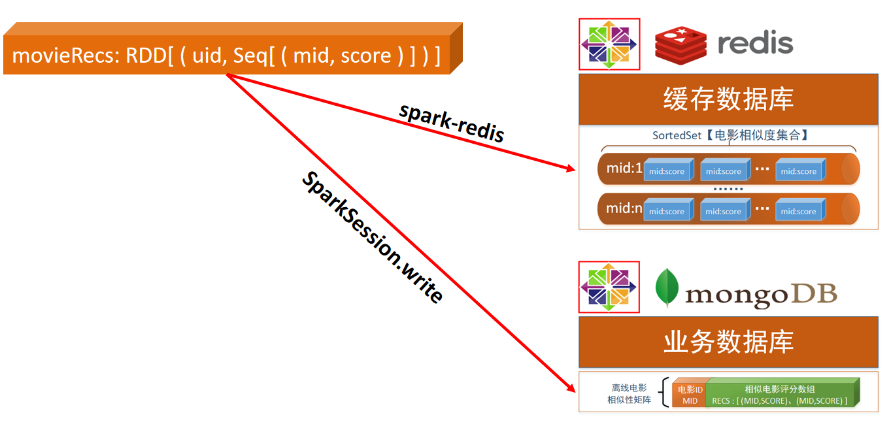
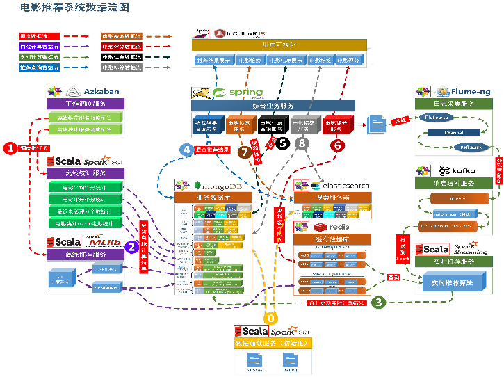

# 项目框架

- 大数据处理流程
- 系统模块设计
- 项目系统架构
- 项目数据流图


## 数据生命周期


## 大数据处理流程


### 实时处理


### 离线处理


## 目标




实时推荐

离线推荐

热门推荐

我的标签

大家的标签

相似推荐


## 系统模块设计




## 系统架构


## 数据源解析

电影信息 movies.csv
用户评分信息 ratings.csv
电影标签信息 tags.csv


### 电影信息

- 注意电影的类别

|电影ID(MID)| 电影名称(NAME) | 电影描述(DESCRI) | 电影时长(TIMELONG) | 发行时间(ISSUE)| 拍摄时间(SHOOT) | 电影语言(LANGUAGE) | 电影类别(DIRECTOR)| 电影演员(ACTORS)| 电影导演(DIRECTOR) |
| ----------- | -------------- | ---------------- | ------------------ | ---------------- | --------------- | ------------------ | -------------------------------- | ----------------------- | ------------------ |
| 1           | Toy Story      | -                | 81minutes          | March 20 2001    | 1995            | English            | Adventure\|Animation\|…\|Fantasy | Tom Hanks\|…\|Jim  | John Lasseter      |
| …           | …              | …                | …                  | …                | …               | …                  | …                                | …                       | …                  |
| 30          | Shanghai Triad | -                | 108minutes         | December 12 2000 | 1995            | Chinese            | Crime\|Drama                     | Gong Li\|…\|Li Bao-Tian | Zhang Yimou        |


### 用户评分信息

| 用户ID(UID) | 电影ID(MID) | 电影评分(SCORE) | 评分时间(TIMESTAMP) |
| ----------- | ----------- | --------------- | ------------------- |
| 671         | 5816        | 4               | 1065111963          |
| 671         | 5902        | 3.5             | 1064245507          |
| …           | …           | …               | …                   |
| 671         | 5952        | 5               | 1063502716          |


### 电影标签信息

| 用户ID(UID) | 电影ID(MID) | 电影标签(TAG)           | 标签时间(TIMESTAMP) |
| ----------- | ----------- | ----------------------- | ------------------- |
| 15          | 339         | sandra 'boring' bullock | 1138537770          |
| 15          | 1955        | dentist                 | 1193435061          |
| …           | …           | …                       | …                   |
| 15          | 100365      | uganda                  | 1425876220          |


## 主要数据模型




# 统计推荐模块

历史热门电影统计
近期热门电影统计
电影平均评分统计
各类别 Top10 优质电影统计





## 历史热门电影统计

统计所有历史数据中每个电影的评分数

RateMoreMovies

- select mid, count(mid) as count from ratings group by mid
  - RateMoreMovies
  - RateMoreMovies 数据结构：mid，count


## 近期热门电影统计

统计**每月**的电影评分个数，就代表了电影近期的热门度

ratingOfMonth

```sql
select mid, score, changeDate(timestamp) as yearmonth from ratings

/* changDate 
 UDF函数，使用 SimpleDateFormat 对 Date 进行格式转化，转化格式为“yyyyMM” */
```

RateMoreRecentlyMovies

```sql
select mid, count(mid) as count,yearmonth 
from ratingOfMonth 
group by yearmonth,mid 
order by yearmonth desc,count desc
```


## 电影平均评分统计

AverageMovies

- AverageMovies 数据结构：mid，avg

```sql
select mid, avg(score) as avg from ratings group by mid
```


## 各类别 Top10 评分电影统计

- movieWithScore
  - splitGe ：UDF函数，按照‘|’字符对字符串进行切分
  - genres 对类别进列转行操作

```sql
select a.mid, genres, if(isnull(b.avg),0,b.avg) score 
from movies a 
left join averageMovies b on a.mid = b.mid
	    
spark.sql("select * from ("+ 
           "select mid,gen,score,row_number() over(partition by gen order by score desc) rank " +
            "from (select mid,score,explode(splitGe(genres)) gen from movieWithScore) genresMovies) rankGenresMovies where rank <= 10")
```


# 离线推荐模块

用ALS算法训练隐语义模型
计算用户推荐矩阵
计算电影相似度矩阵


## LFM-ALS 推荐模型训练

- rank表示k，特征维度




## 计算用户推荐矩阵





## 计算电影相似度矩阵


- 使用余弦相似度计算
  - 使用余弦的意义
    - A对B评分 3 分 到1分，3分对A来说是最高的分
    - C对B评分 5分 到3 分，5分对C来说是最高分
    - 使用余弦计算C和A共同对B的距离，更加接近真实评分，忽略了评分的标准，如果C和A对B的评分一致，那么角度是一致的，cos值是百分比，如果完全相似，那么是100%


### 存储电影相似度矩阵



# 实时推荐模块

实时推荐架构
实时推荐优先级计算


## 基于模型的实时推荐模块


- 计算速度要快
- 结果可以不是特别精确
- 有预先设计好的推荐模型


### 推荐优先级计算

- ==基本原理：用户最近一段时间的口味是相似的==


## 基于内容的推荐



电影 A 的相似电影？—— 有相同标签的电影
Item-CF：根据标签提取电影 A 的内容特征，选取与 A 特征相似的电影
根据 UGC 的特征提取 —— TF-IDF


# 混合推荐特性

