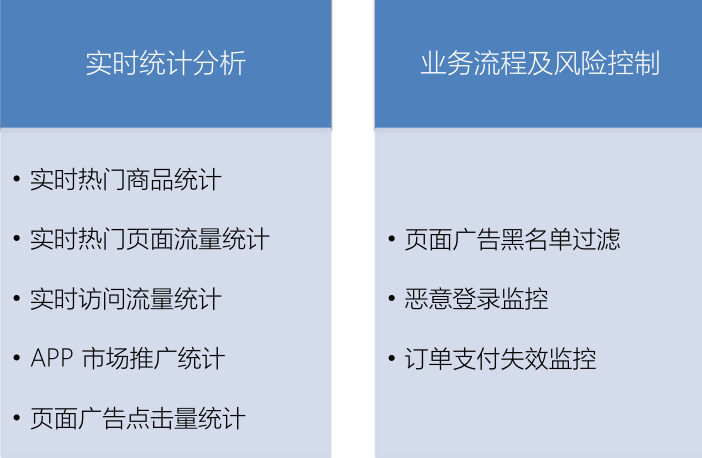
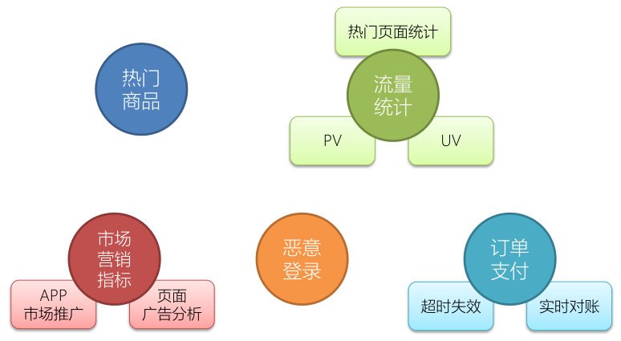

# 介绍

电商平台中的用户行为频繁且较复杂，系统上线运行一段时间后，可以收集到大量的用户行为数据，进而利用大数据技术进行深入挖掘和分析，得到感兴趣的商业指标并增强对风险的控制。电商用户行为数据多样，整体可以分为用户行为习惯数据和业务行为数据两大类。用户的行为习惯数据包括了用户的登录方式、上线的时间点及时长、点击和浏览页面、页面停留时间以及页面跳转等等，我们可以从中进行流量统计和热门商品的统计，也可以深入挖掘用户的特征；这些数据往往可以从 web 服务器日志中直接读取到。而业务行为数据就是用户在电商平台中针对每个业务（通常是某个具体商品）所作的操作，我们一般会在业务系统中相应的位置埋点，然后收集日志进行分析。业务行为数据又可以简单分为两类：一类是能够明显地表现出用户兴趣的行为，比如对商品的收藏、喜欢、评分和评价，我们可以从中对数据进行深入分析，得到用户画像，进而对用户给出个性化的推荐商品列表，这个过程往往会用到机器学习相关的算法；另一类则是常规的业务操作，但需要着重关注一些异常状况以做好风控，比如登录和订单支付

## 主要模块

统计分析
– 点击、浏览
– 热门商品、近期热门商品、分类热门商品，流量统计
• 偏好统计
– 收藏、喜欢、评分、打标签
– 用户画像，推荐列表（结合特征工程和机器学习算法）
• 风险控制
– 下订单、支付、登录
– 刷单监控，订单失效监控，恶意登录（短时间内频繁登录失败）监控

## 数据源分析

### 数据结构

- userBehavior

| 字段名     | 数据类型 | 说明                                           |
| ---------- | -------- | ---------------------------------------------- |
| userId     | Long     | 加密后的用户ID                                 |
| itemId     | Long     | 加密后的商品ID                                 |
| categoryId | Int      | 加密后的商品所属类别ID                         |
| behavior   | String   | 用户行为类型，包括(‘pv’, ‘’buy, ‘cart’, ‘fav’) |
| timestamp  | Long     | 行为发生的时间戳，单位秒                       |

- ApacheLogEvent

| 字段名    | 数据类型 | 说明                         |
| --------- | -------- | ---------------------------- |
| ip        | String   | 访问的 IP                    |
| userId    | Long     | 访问的 user ID               |
| eventTime | Long     | 访问时间                     |
| method    | String   | 访问方法 GET/POST/PUT/DELETE |
| url       | String   | 访问的 url                   |

## 项目模块

- 实时热门商品统计
- 实时流量统计
- 恶意登录监控
- 订单支付失效监控