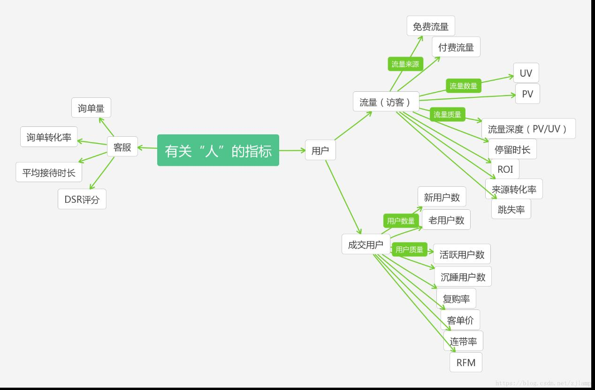
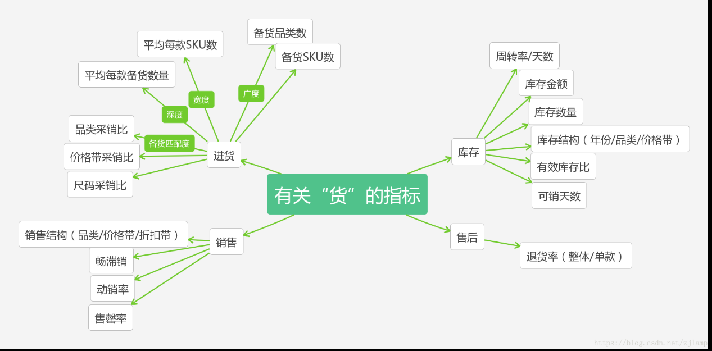
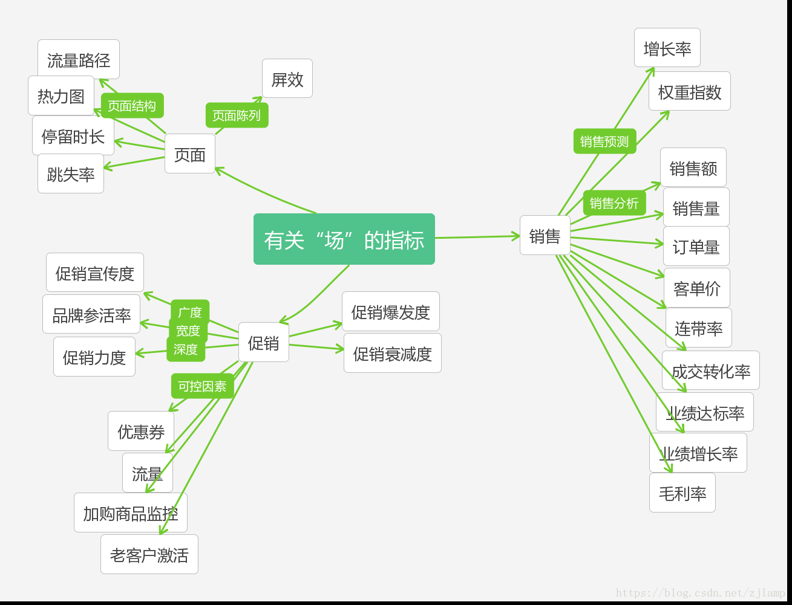
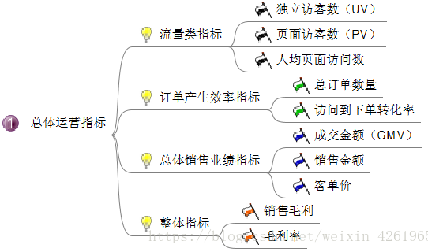
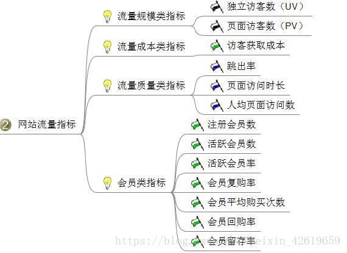
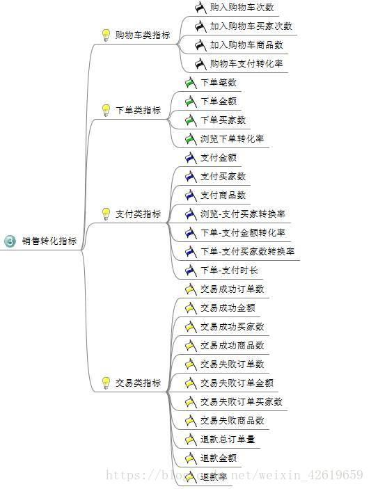
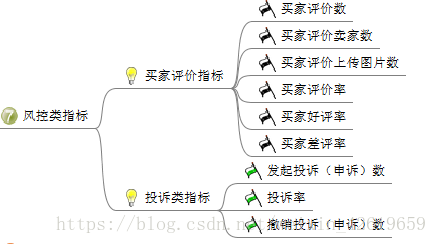
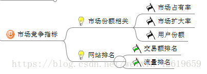

# 电商指标整理

现在的电子商务：
1、大多买家通过搜索找到所买物品，而非电商网站的内部导航，搜索关键字更为重要；
2、电商商家通过推荐引擎来预测买家可能需要的商品。推荐引擎以历史上具有类似购
买记录的买家数据以及用户自身的购买记录为基础，向用户提供推荐信息；
3、电商商家时刻优化网站性能，如 A/B Test 划分来访流量，并区别对待来源不同的访
客，进而找到最优的产品、内容和价格；
4、购买流程早在买家访问网站前，即在社交网络、邮件以及在线社区中便已开始，即
长漏斗流程（以一条推文、一段视频或一个链接开始，以购买交易结束）。
相关数据指标：关键词和搜索词、推荐接受率、邮件列表/短信链接点入率

# 电商 8 类基本指标

1）总体运营指标：从流量、订单、总体销售业绩、整体指标进行把控，起码对运营的
电商平台有个大致了解，到底运营的怎么样，是亏是赚。

2）站流量指标：即对访问你网站的访客进行分析，基于这些数据可以对网页进行改进，
以及对访客的行为进行分析等等。

3）销售转化指标：分析从下单到支付整个过程的数据，帮助你提升商品转化率。也可
以对一些频繁异常的数据展开分析。

4）客户价值指标：这里主要就是分析客户的价值，可以建立 RFM 价值模型，找出那些
有价值的客户，精准营销等等。

5）商品类指标：主要分析商品的种类，那些商品卖得好，库存情况，以及可以建立关
联模型，分析那些商品同时销售的几率比较高，而进行捆绑销售，有点像啤酒和尿布的故事。

6）市场营销活动指标，主要监控某次活动给电商网站带来的效果，以及监控广告的投
放指标。

7）风控类指标：分析卖家评论，以及投诉情况，发现问题，改正问题

8）市场竞争指标：主要分析市场份额以及网站排名，进一步进行调整

