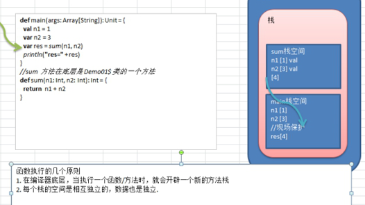

# 知识点

- 函数式编程基础

  函数定义/声明

  函数运行机制

  递归 //难点 [最短路径，邮差问题，迷宫问题, 回溯]

  过程

  惰性函数和异常

-  函数式编程高级

  值函数(函数字面量) 

  高阶函数 

  闭包 

  应用函数 

  柯里化函数，抽象控制...


- 在scala中，方法和函数几乎可以等同
  - 如定义、使用、运行机制都一样的)，只是函数的使用方式更加的灵活多样

- 函数式编程是从编程方式(范式)的角度来谈的，可以这样理解：函数式编程把函数当做一等公民，充分利用函数、 支持的函数的多种使用方式
  - 如在Scala当中，函数是一等公民，像变量一样，既可以作为函数的参数使用，也可以将函数赋值给一个变量
  - 函数的创建不用依赖于类或者对象
  - 在Java当中，函数的创建则要依赖于类、抽象类或者接口

- 面向对象编程是以对象为基础的编程方式
- 在scala中函数式编程和面向对象编程融合在一起了


## 小结

- "函数式编程"是一种"编程范式"（programming paradigm）。

- 它属于"结构化编程"的一种，主要思想是把运算过程尽量写成一系列嵌套的函数调用。

- 函数式编程中，将函数也当做**数据类型**，因此可以接受函数当作输入（参数）和输出（返回值）

- 函数式编程中，最重要的就是函数


# 函数定义

```scala
def 函数名 ([参数名: 参数类型], ...)[[: 返回值类型] =] {
    语句...
    return 返回值
}
```

- 函数声明关键字为def  (definition)
- [参数名: 参数类型], ...
  - 表示函数的输入
  - 参数列表
  - 可以没有，如果有，多个参数使用逗号间隔

- 函数中的语句：表示为了实现某一功能代码块
- 函数可以有返回值,也可以没有
- 返回值形式
  - : 返回值类型  =   
  - =  表示返回值类型不确定，使用类型推导完成
  - 表示没有返回值，return 不生效
- 如果没有return默认以执行到==最**后一行的结果作为返回**值==

```scala
object FunDemo01 {
    def main(args: Array[String]): Unit = {
        val n1 = 10
        val n2 = 20
        println("res=" + getRes(1, 2, ')'))

    }
    //定义函数/方法
    def getRes(n1: Int, n2: Int, oper: Char) = {
        if (oper == '+') {
            n1 + n2 //返回
        } else if (oper == '-') {
            n1 - n2
        } else {
            //返回null
            null
        }
    }
}
```


# 函数调用机制

```scala
object Test01 {
    def main(args: Array[String]): Unit = {
        val n1 = 1
        val n2 = 3
        val res = sum(n1, n2)
        println("res=" + res)
    }
    def sum(n1: Int, n2: Int): Int = {
        return n1 + n2
    }
}
```




# 递归调用

- 原则
  - 程序执行一个函数时，就创建一个新的受保护的独立空间(新函数栈)
  - 函数的局部变量是独立的，不会相互影响
  - 递归必须向退出递归的条件逼近，否则就是无限递归
  - 当一个函数执行完毕，或者遇到return，就会返回，遵守谁调用，就将结果返回给谁。

- 案例

  - 题1：斐波那契数 [学员练习10min]
    请使用递归的方式，求出斐波那契数1,1,2,3,5,8,13...
    给你一个整数n，求出它的斐波那契数是多少？

   

  - 题2：求函数值 [演示]
    已知 f(1)=3; f(n) = 2*f(n-1)+1; 
    请使用递归的思想编程，求出 f(n)的值?

   

  - 题3：猴子吃桃子问题
    有一堆桃子，猴子第一天吃了其中的一半，并再多吃了一个！以后每天猴子都吃其中的一半，然后再多吃一个。当到第十天时，想再吃时（还没吃），发现只有1个桃子了。问题：最初共多少个桃子？

```scala
object Exercise01 {
    def main(args: Array[String]): Unit = {
        /*
    题1：斐波那契数 [学员练习10min]
请使用递归的方式，求出斐波那契数1,1,2,3,5,8,13...
给你一个整数n，求出它的斐波那契数是多少？

     */
        println("fbn的结果是=" + fbn(7))

        /*
    题2：求函数值 [演示]
已知 f(1)=3; f(n) = 2*f(n-1)+1; 
请使用递归的思想编程，求出 f(n)的值
     */

        println(f(2)) //7
        /*
    题3：猴子吃桃子问题
有一堆桃子，猴子第一天吃了其中的一半，并再多吃了一个！以后每天猴子都吃其中的一半，然后再多吃一个。当到第十天时，想再吃时（还没吃），发现只有1个桃子了。问题：最初共多少个桃子？

     */
        println("桃子个数=" + peach(1)) // 1534

    }

    /*
  猴子吃桃子问题
有一堆桃子，猴子第一天吃了其中的一半，并再多吃了一个！以后每天猴子都吃其中的一半，然后再多吃一个。当到第十天时，想再吃时（还没吃），发现只有1个桃子了。问题：最初共多少个桃子
  分析思路
  1. day = 10 桃子有 1
  2. day = 9  桃子有  (day10[1] + 1) *2
  3. day = 8  桃子有  (day9[4] + 1) * 2

   */
    def peach(day: Int): Int = {
        if (day == 10) {
            1
        } else {
            (peach(day + 1) + 1) * 2
        }
    }

    //题2就是简单的套用公式即可
    def f(n: Int): Int = {
        if (n == 1) {
            3
        } else {
            2 * f(n - 1) + 1
        }
    }

    //函数
    def fbn(n: Int): Int = {

        //分析
        //1. 当n = 1 结果为 1
        //2. 当n = 2 结果是 1
        //3. 当 n> 2是, 结果就是  就是前面两个数的和
        if (n == 1 || n == 2) {
            1
        } else {
            fbn(n - 1) + fbn(n - 2)
        }
    }
}
```


# 函数小结

- 函数的形参列表可以是多个, 如果函数没有形参，调用时 可以不带() 
- 形参列表和返回值列表的数据类型可以是值类型和引用类型

```scala
object Details01 {
    def main(args: Array[String]): Unit = {
        //形参列表和返回值列表的数据类型可以是值类型和引用类型
        val tiger = new Tiger
        val tiger2 = test01(10, tiger)
        println(tiger2.name) // jack
        println(tiger.name) // jack
        println(tiger.hashCode() + " " + tiger2.hashCode())

    }

    def test01(n1:Int,tiger:Tiger): Tiger = {
        println("n1=" + n1)
        tiger.name = "jack"
        tiger
    }
}

class Tiger {
    //一个名字属性
    var name = ""
}
```

- Scala中的函数可以根据函数体最后一行代码自行推断函数返回值类型
  - return关键字可以省略

```scala
def getSum(n1: Int, n2: Int): Int = {
    n1 + n2
}
```

- Scala可以自行推断，在省略return关键字的场合，返回值类型也可以省略

```scala
def getSum(n1: Int, n2: Int) = { //ok
    n1 + n2
}
```

- 如果**函数明确使用return关键字**，那么函数返回就**不能使用自行推断了**
  - 要明确写成 **: 返回类型 =**  ，当然**如果你什么都不写，即使有return 返回值为()** .

```scala
object Details02 {
    def main(args: Array[String]): Unit = {
        println(getSum2(10, 30)) // ()

    }
    //如果写了return ,返回值类型就不能省略
    def getSum(n1: Int, n2: Int): Int = {
        return n1 + n2
    }
    //如果返回值这里什么什么都没有写，即表示该函数没有返回值
    //这时return无效
    def getSum2(n1: Int, n2: Int) {
        return n1 + n2
    }
}
```

- 如果函数明确声明无返回值（声明Unit），那么函数体中即使使用return关键字也不会有返回值

```scala
//如果函数明确声明无返回值（声明Unit），那么函数体中即使使用return关键字也不会有返回值
def getSum3(n1: Int, n2: Int): Unit = {
    return n1 + n2
}
```

- 如果明确函数无返回值或不确定返回值类型，那么返回值类型可以省略或声明为Any

```scala
def f2(s:String) = {
    if(s.length >= 3){
        s+"123"
    }else{
        3
    }
}
def f3(s:String) : Any = {
    if(s.length >= 3){
        s+"123"
    }else{
        3
    }
}
```

- Scala语法中任何的语法结构都可以嵌套其他语法结构(灵活)
  - 函数中可以再声明/定义函数，类中可以再声明类 ，方法中可以再声明/定义方法
  - 类似js

```scala
object Details03 {
    def main(args: Array[String]): Unit = {

        def f1(): Unit = {  //ok private final
            println("f1")
        }

        println("ok~~")

        // 在反编译中可以看到命名规则，相同名称的添加序号
        // 函数内定义函数是 private final
        def sayOk(): Unit = {  // private final sayOk$1 ()
            println("main sayOk")
            def sayOk(): Unit = { //  private final sayOk$2 ()
                println("sayok sayok")
            }
        }

    }

    def sayOk(): Unit ={  //成员
        println("main sayOk")
    }
}
```

- Scala函数的形参，在声明参数时，直接赋初始值(默认值)，这时调用函数时，如果没有指定实参，则会使用默认值。如果指定了实参，则实参会覆盖默认值

```scala
object Details04 {
    def main(args: Array[String]): Unit = {
        println(sayOk("mary"))
    }
    //name形参的默认值jack
    def sayOk(name : String = "jack"): String = {
        return name + " ok! "
    }
}
```

- 如果函数存在多个参数，每一个参数都可以设定默认值，那么这个时候，传递的参数到底是覆盖默认值，还是赋值给没有默认值的参数，就不确定了(默认按照声明顺序[从左到右])
- 在这种情况下，可以采用带名参数 [案例演示+练习]

```scala
object DetailParameter05 {
    def main(args: Array[String]): Unit = {
        //    mysqlCon()
        //    mysqlCon("127.0.0.1", 7777)   //从左到右覆盖

        //如果我们希望指定覆盖某个默认值，则使用带名参数即可,比如修改用户名和密码
        mysqlCon(user = "tom", pwd = "123")

        //f6("v2")  // (错误)
        f6(p2="v2") // (?)

    }
    def mysqlCon(add:String = "localhost",port : Int = 3306,
                 user: String = "root", pwd : String = "root"): Unit = {
        println("add=" + add)
        println("port=" + port)
        println("user=" + user)
        println("pwd=" + pwd)
    }

    def f6 ( p1 : String = "v1", p2 : String ) {
        println(p1 + p2);
    }

}
```

-  递归函数未执行之前是无法推断出来结果类型，在使用时必须有明确的返回值类型
- Scala函数支持可变参数

```scala
//支持0到多个参数
def sum(args :Int*) : Int = { 
}
//支持1到多个参数
def sum(n1: Int, args:  Int*) : Int  = { 
}
```


# 过程

- 将函数的返回类型为Unit的函数称之为过程(procedure)
- 如果明确函数没有返回值，那么等号可以省略

```scala
def f10(name: String): Unit ={
    print(name)
}
```

- 注意区分:
  - 如果函数声明时没有返回值类型，但是有 = 号，可以进行**类型推断**最后一行代码
  - 这时这个函数实际是有返回值的，该函数并不是过程

- 开发工具的自动代码补全功能，虽然会自动加上Unit，但是考虑到Scala语言的简单，灵活，最好不加


# 惰性函数

- 惰性计算（尽可能延迟表达式求值）是许多函数式编程语言的特性
- 惰性集合在需要时提供其元素，无需预先计算它们
- 好处
  - **可将耗时的计算推迟到绝对需要的时候**
  - 可以创造无限个集合，只要它们继续收到请求，就会继续提供元素
  - 函数的惰性使用可得到更高效的代码
- Java 并没有为惰性提供原生支持
- 在spark中有使用


- java实现懒加载

```scala
public class LazyDemo {
    //属性也可能是一个数据库连接，文件等资源 
    private String property; 
    
    public String getProperty() {
        //如果没有初始化过，那么进行初始化
        if (property == null) {
            property = initProperty();
        }
        return property;
    }
    private String initProperty() {
        return "property";
    }
}
//比如常用的单例模式懒汉式实现时就使用了上面类似的思路实现
```

- 当函数返回值被声明为lazy时，函数的执行将被推迟，直到我们首次对此取值，该函数才会执行
  - 在Java的某些框架代码中称之为懒加载(延迟加载)

```scala
object LazyDemo01 {
    def main(args: Array[String]): Unit = {
        lazy val res = sum(10, 20)
        println("-----------------")
        println("res=" + res) //在要使用res 前，才执行
    }

    //sum函数，返回和
    def sum(n1: Int, n2: Int): Int = {
        println("sum() 执行了..") //输出一句话
        return n1 + n2
    }
}
```

-  ==lazy 不能修饰 var 类型的变量==

- 不但是在调用函数时，加了 lazy ,会导致函数的执行被推迟，**在声明一个变量时声明了 lazy ,则变量值得分配也会推迟**
  - 如 lazy val i = 10


# 异常

- Scala提供try和catch块来处理异常
- try块用于包含可能出错的代码
- catch块用于处理try块中发生的异常
- 可根据需要在程序中有任意数量的try...catch块

- 语法处理上和Java类似，但是又不尽相同
- java的异常
  - java语言按照try—catch-catch...—finally的方式来处理异常
  - 不管**有没有异常捕获，都会执行finally**, 通常以在finally代码块**中释放资源**
  - 可有多个catch，分别捕获对应的异常
  - 需要把范围小的异常类写在前面，把范围大的异常类写在后面，否则编译错误

```java
public class JavaExceptionDemo01 {
    public static void main(String[] args) {

        try {
            // 可疑代码
            int i = 0;
            int b = 10;
            int c = b / i; // 执行代码时，会抛出ArithmeticException异常
        } catch (ArithmeticException ex) {
            ex.printStackTrace();
        } catch (Exception e) { //java中不可以把返回大的异常写在前，否则报错!!
            e.printStackTrace();
        } finally {
            // 最终要执行的代码
            System.out.println("java finally");
        }

        System.out.println("ok~~~继续执行...");
    }
}
```

- scala异常

```scala
object ScalaExceptionDemo {
    def main(args: Array[String]): Unit = {

        try {
            val r = 10 / 0
        } catch {
            //说明
            //1. 在scala中只有一个catch
            //2. 在catch中有多个case, 每个case可以匹配一种异常 case ex: ArithmeticException
            //3. => 关键符号，表示后面是对该异常的处理代码块
            //4. finally 最终要执行的
            case ex: ArithmeticException=> {
                println("捕获了除数为零的算数异常")
            }
            case ex: Exception => println("捕获了异常")
        } finally {
            // 最终要执行的代码
            println("scala finally...")
        }
        println("ok,继续执行~~~~~")
    }
}
```


## 小结

- 将**可疑代码封装在try块中**。 在try块之后使用了一个catch处理程序来捕获异常。如果发生任何异常，catch处理程序将处理它，**程序将不会异常终止**。

- Scala的异常的工作机制和Java一样，但是**Scala没有“checked(编译期)”异常**，即Scala没有编译异常这个概念，异常都是在运行的时候捕获处理。

- 用**throw关键字，抛出一个异常对象**。所有异常都是Throwable的子类型。throw表达式是有类型的，就是Nothing，因为Nothing是所有类型的子类型，所以throw表达式可以用在需要类型的地方

```scala
def test(): Nothing = {
    throw new ArithmeticException("算术异常")//Exception("异常NO1出现~")
}
```

- 在Scala里，借用了模式匹配的思想来做异常的匹配，因此，在catch的代码里，是一系列case子句来匹配异常。【**前面案例可以看出这个特点, 模式匹配我们后面详解**】，当匹配上后 => 有多条语句可以换行写，类似 java 的 switch case x: 代码块..

- 异常捕捉的机制与其他语言中一样，如果有异常发生，catch子句是按次序捕捉的。因此，在catch子句中，**越具体的异常越要靠前，越普遍的异常越靠后**，如果把越普遍的异常写在前，把具体的异常写在后，**在scala中也不会报错，但这样是非常不好的编程风格**。

- finally子句用于执行不管是正常处理还是有异常发生时都需要执行的步骤，一般用于对象的清理工作，这点和Java一样
- Scala提供了throws关键字来声明异常。可以使用方法定义声明异常。 它向调用者函数提供了此方法可能引发此异常的信息。 它有助于调用函数处理并将该代码包含在try-catch块中，以避免程序异常终止。在scala中，可以使用throws注释来声明异常

```scala
def main(args: Array[String]): Unit = {
    f11()
}
@throws(classOf[NumberFormatException])//等同于NumberFormatException.class
def f11()  = {
    "abc".toInt
}
```


