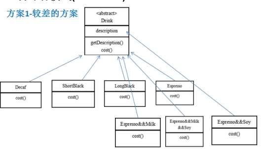
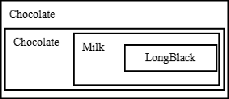
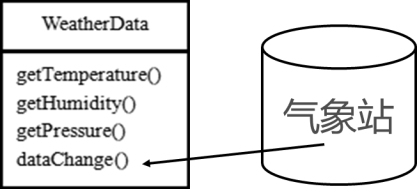
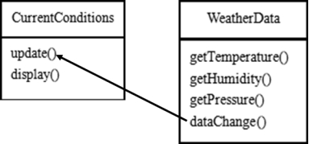
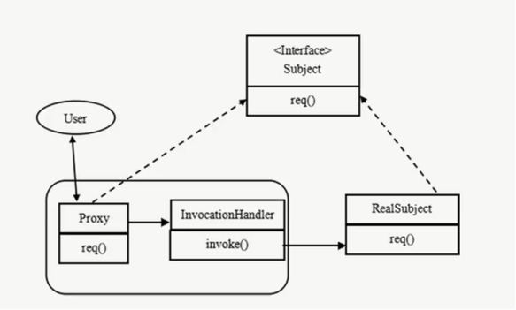

# 简介

- 创建型模式
  - 单例模式、抽象工厂模式、建造者模式、工厂模式、原型模式

- 结构型模式
  - 适配器模式、桥接模式、装饰模式、组合模式、外观模式、享元模式、代理模式

- 行为型模式
  - 模版方法模式、命令模式、迭代器模式、观察者模式、中介者模式、备忘录模式、解释器模式（Interpreter模式）、状态模式、策略模式、职责链模式(责任链模式)、访问者模式


# 简单工厂

- 简单工厂模式是属于创建型模式
- 不属于23种GOF设计模式之一
- 简单工厂模式是由一个工厂对象决定创建出哪一种产品类的实例
- 是工厂模式家族中最简单实用的模式

- 定义了一个创建对象的类，由这个类来封装实例化对象的行为(代码)

- 在软件开发中，当用到大量的创建某种、某类或者某批对象时，就会使用到工厂模式

## 示例


### 传统方式实现

```scala
package com.stt.demo.pizza

abstract class Pizza {
    var name: String = _
    // 抽象方法
    def prepare()

    def cut(): Unit = {
        println(this.name + "cutting...")
    }
    def bake(): Unit = {
        println(this.name + "bake...")
    }
    def box(): Unit = {
        println(this.name + "boxing...")
    }
}
```

```scala
package com.stt.demo.pizza

class GreekPizza extends Pizza{
    override def prepare(): Unit = {
        this.name = "希腊披萨"
        println(this.name + "prepare...")
    }
}
```

```scala
package com.stt.demo.pizza

class PepperPizza extends Pizza{

    override def prepare(): Unit = {
        this.name = "胡椒披萨"
        println(this.name + "prepare...")
    }
} 
```

```scala
package com.stt.demo.pizza

import scala.io.StdIn
import util.control.Breaks._

class OrderPizza {

    var orderType: String = _
    var pizza: Pizza = _

    breakable{
        do{
            println("输入披萨的类型：")
            orderType = StdIn.readLine()
            if(orderType.equals("greek")){
                // 创建pizza
                this.pizza = new GreekPizza
            }else if(orderType.equals("pepper")){
                this.pizza = new PepperPizza
            }else {
                break()
            }
            this.pizza.prepare()
            this.pizza.bake()
            this.pizza.cut()
            this.pizza.box()

        }while(true)
    }
}
```

```scala
package com.stt.demo.pizza
object PizzaStore {
    def main(args: Array[String]): Unit = {
        new OrderPizza
    }
}
```

- 分析
  - 优点是比较好理解，简单易操作
  - 缺点是违反了设计模式的**ocp**原则
    - 即对扩展开放，对修改关闭
      - 当给类增加新功能的时候，尽量不修改代码，或者尽可能少修改代码
    - 如要新增加一个Pizza的种类(Cheese披萨)，需要做如下修改
      - 新增 CheesePizza类，可以接受
      - 修改OrderPizza中的判断语句，增加创建CheesePizza分支
        - 如果在其他地方也有创建Pizza的代码也需要修改，不可接受


### 简单工厂模式实现

- 定义一个实例化Pizaa对象的类，封装创建对象的代码

```scala
package com.stt.demo.pizza

object SimplePizzaFactory {

    def createPizza(t: String): Pizza= {
        var pizza :Pizza = null
        if(t.equals("greek")){
            // 创建pizza
            pizza = new GreekPizza
        }else if(t.equals("pepper")){
            pizza = new PepperPizza
        }else if(t.equals("cheese")) {
            pizza = new CheezePizza
        }
        pizza
    }
}
```

```scala
package com.stt.demo.pizza

import scala.io.StdIn
import util.control.Breaks._

class OrderPizza {

    var orderType: String = _
    var pizza: Pizza = _

    breakable{
        do{
            println("输入披萨的类型：")
            orderType = StdIn.readLine()
            val pizza = SimplePizzaFactory.createPizza(orderType)
            if(pizza == null){
                break()
            }
            this.pizza.prepare()
            this.pizza.bake()
            this.pizza.cut()
            this.pizza.box()

        }while(true)
    }
}
```

- 好处
  - 新增加功能只需要修改工厂类和增加对应的Pizza类
  - 其他调用创建Pizza的代码不需要修改，==将修改的范围降到最低==


# 工厂方法模式

- 新需求
  - 客户在点披萨时，可以点不同口味的披萨，比如 北京的奶酪pizza、北京的胡椒pizza 或者是伦敦的奶酪pizza、伦敦的胡椒pizza

- 思路1
  - 使用简单工厂模式，创建不同的简单工厂类，比如BJPizzaSimpleFactory、LDPizzaSimpleFactory 等等.从当前这个案例来说，也是可以的，但是考虑到项目的规模，以及软件的可维护性、可扩展性并不是特别好
- 思路2
  - 使用工厂方法模式
  - 工厂方法模式设计方案
    - 将披萨项目的实例化功能抽象成抽象方法，在不同的口味点餐子类中具体实现

- 工厂方法模式
  - 定义了一个创建对象的抽象方法，由子类决定要实例化的类
  - **将对象的实例化推迟到子类**

- 示例

```scala
package com.stt.demo.pizza2

import scala.io.StdIn
import scala.util.control.Breaks._

abstract class OrderPizza {

    breakable{
        var orderType: String = null
        var pizza: Pizza = null
        do{
            println("输入披萨的类型：")
            orderType = StdIn.readLine()

            pizza = createPizza(orderType)
            if(pizza == null){
                break()
            }
            pizza.prepare()
            pizza.bake()
            pizza.cut()
            pizza.box()

        }while(true)
    }
    // 抽象方法，让各个子类去实现order
    def createPizza(str: String): Pizza
}
```

```scala
package com.stt.demo.pizza2

class BJCheezePizza extends Pizza{
    override def prepare(): Unit = {
        this.name = "北京奶酪披萨"
        println(this.name + "prepare...")
    }
}

class BJPepperPizza extends Pizza{
    override def prepare(): Unit = {
        this.name = "北京胡椒披萨"
        println(this.name + "prepare...")
    }
}
```

```scala
package com.stt.demo.pizza2

class BJOrderPizza extends OrderPizza{
    override def createPizza(t: String): Pizza = {
        var pizza :Pizza = null
        if(t.equals("pepper")){
            pizza = new BJPepperPizza
        }else if(t.equals("cheese")) {
            pizza = new BJCheezePizza
        }
        pizza
    }
}
```

```scala
package com.stt.demo.pizza2

object PizzaStore {
    def main(args: Array[String]): Unit = {
        new BJOrderPizza
    }
}
```

- 好像使用还是比较局限


# 抽象工厂模式

- 抽象工厂模式：定义了一个trait用于创建相关或有依赖关系的对象簇，而无需指明具体的类

- 抽象工厂模式可以将简单工厂模式和工厂方法模式进行整合

- 从设计层面看，抽象工厂模式就是对简单工厂模式的改进(或者称为进一步的抽象)

- 将工厂抽象成两层，**AbsFactory(抽象工厂)** 和 **具体实现的工厂子类**。程序员可以根据创建对象类型使用对应的工厂子类。这样将单个的简单工厂类变成了工厂簇，更利于代码的维护和扩展

```scala
package com.stt.demo.pizza3
trait AbstractFactory {
    // 定义一个抽象pizza
    def createPizza(t: String): Pizza
}
```

```scala
package com.stt.demo.pizza3

class BJFactory extends AbstractFactory{
    override def createPizza(t: String) :Pizza = {
        var pizza :Pizza = null
        if(t.equals("pepper")){
            pizza = new BJPepperPizza
        }else if(t.equals("cheese")) {
            pizza = new BJCheezePizza
        }
        pizza
    }
}
```

```scala
package com.stt.demo.pizza3

import scala.io.StdIn
import scala.util.control.Breaks._

class OrderPizza {

    var pizzaFactory :AbstractFactory = _

    def this(factory: AbstractFactory){
        this
        this.pizzaFactory = factory
        breakable{
            var orderType: String = null
            var pizza: Pizza = null
            do{
                println("输入披萨的类型：")
                orderType = StdIn.readLine()

                pizza = pizzaFactory.createPizza(orderType)
                if(pizza == null){
                    break()
                }
                pizza.prepare()
                pizza.bake()
                pizza.cut()
                pizza.box()

            }while(true)
        }
    }
}
```

```scala
package com.stt.demo.pizza3
object PizzaStore {
    def main(args: Array[String]): Unit = {
        new OrderPizza(new BJFactory)
    }
}
```


- 工厂模式的意义
  - 将**实例化对象的代码提取出来，放到一个类中统一管理和维护**，达到和主项目的**依赖关系的解耦**。从而提高项目的扩展和维护性

- 三种工厂模式 
- 设计模式的依赖抽象原则
  - 创建对象实例时，不要直接 new 类, 而是把这个new 类的动作放在一个工厂的方法中并返回
    - 变量不要直接持有具体类的引用
      - 使用工厂进行创建
      - 可进行优化或者业务逻辑等
  - 不要让类继承具体类，而是继承抽象类或者是trait（接口）
  - 不要覆盖基类中已经实现的方法


# 单例模式

- 保证在整个的软件系统中，某个类只能存在一个对象实例
  - 如Hibernate的SessionFactory，它充当数据存储源的代理，并负责创建Session对象
  - SessionFactory并不是轻量级的，一般情况下，一个项目通常只需要一个SessionFactory就够，这是就会使用到单例模式
  - Akka [ActorySystem 单例]


## 懒汉式

```scala
class SingleTon private(){}

object SingleTon {
    private var s: SingleTon = null
    def getInstance() ={
        if(s == null){
            s = new SingleTon
        }
        s
    }
}
```


## 饿汉式

```scala
class SingleTon private(){}

object SingleTon {
    private var s: SingleTon = new SingleTon
    def getInstance() ={
        s
    }
}
```


# 装饰者模式

- 需求
  - 咖啡馆订单系统项目
    - 咖啡种类/单品咖啡
      - Espresso(意大利浓咖啡)
      - ShortBlack
      - LongBlack(美式咖啡)
      - Decaf(无因咖啡)
    - 调料
      - Milk
      - Soy(豆浆)
      - Chocolate
    - 要求在扩展新的咖啡种类时，具有良好的扩展性、改动方便、维护方便
    - 使用**OO的来计算不同种类咖啡的费用**:
      - 客户可以点单品咖啡，也可单品咖啡+调料组合

- 方案1

  - Drink 是一个抽象类，表示饮料
    - description就是描述，比如咖啡的名字等
    - cost就是计算费用，是一个抽象方法
  - Decaf 等等就是具体的单品咖啡，继承Drink,并实现cost方法
  - Espresso&&Milk 等等就是单品咖啡+各种调料的组合,这个会很多
  - 缺点：会有很多的类，并且当增加一个新的单品咖啡或者调料时，类的数量就会倍增(**类爆炸**)

  

- 方案2
  - 前面分析到方案1因为咖啡单品+调料组合会造成类的倍增，因此可以做改进，将调料内置到Drink类，这样就不会造成类数量过多。从而提高项目的维护性(如图)=>同时违反ocp


## 原理

- 装饰者模式就像打包一个快递
  - 主体：比如：陶瓷、衣服 (Component)
  - 包装：比如：报纸填充、塑料泡沫、纸板、木板(Decorator)
- Component
  - 主体：如类似前面的Drink
- ConcreteComponent和Decorator
  - ConcreteComponent：具体的主体，如前面的各个单品咖啡
- Decorator: 装饰者，比如各调料
- 在如图的Component与ConcreteComponent之间，如果ConcreteComponent类很多,还可以设计一个缓冲层，将共有的部分提取出来，抽象层一个类


## 定义

- 装饰者模式：**动态的将新功能附加到对象上**
- 在对象功能扩展方面，它比**继承更有弹性(递归)**，装饰者模式也体现了开闭原则(ocp)
- 这里提到的动态的将新功能附加到对象和ocp原则，在后面的应用实例上会以代码的形式体现


## 示例

- 方案3


- 装饰者模式下的订单：2份巧克力+一份牛奶的LongBlack
  - 说明
    - Milk包含了LongBlack
    - 一份Chocolate包含了(Milk+LongBlack)
    - 一份Chocolate包含了(Chocolate+Milk+LongBlack)
    - 这样不管是什么形式的单品咖啡+调料组合，**通过递归方式可以方便的组合和维护**



```scala
package com.stt.demo.drink

abstract class Drink {
    var desc = ""
    private var price = 0.0f

    def setDesc(desc: String) = {
        this.desc = desc
    }

    def getDesc() = {
        desc+" price="+price
    }

    def getPrice(): Float={
        price
    }

    def setPrice(price: Float): Unit ={
        this.price = price
    }

    def cost(): Float
}
```

```scala
package com.stt.demo.drink

// 用于扩展，在drink和单品咖啡做了一个逻辑缓冲
class Coffee extends Drink{
    override def cost() = {
  		super.getPrice()
    }
}
class Espresso extends Coffee{
    // 使用主构造器
    super.setDesc("Espresso")
    super.setPrice(6.0f)
}
class LongBlack extends Coffee{
    super.setDesc("LongBlack")
    super.setPrice(5.0f)
}
```

```scala
package com.stt.demo.drink
// 装饰者
class Decorator extends Drink{
    // 被装饰的对象Drink，可以是单品咖啡，也可以使调料组合
    private var obj: Drink = null
    def this(obj: Drink){
        this
        this.obj = obj
    }
    override def cost() :Float = {
        // 使用递归的方式计算价格
        super.getPrice() + obj.cost()
    }
    override def getDesc(): String = {
        super.getDesc()+"&&"+obj.getDesc()
    }
}
```

```scala
package com.stt.demo.drink

class Chocolate(obj: Drink) extends Decorator(obj){
  super.setDesc("chocolate")
  super.setPrice(3.0f)
}
class Soy(obj: Drink) extends Decorator(obj){
  super.setDesc("Soy")
  super.setPrice(1.0f)
}
class Milk(obj: Drink) extends Decorator(obj){
  super.setDesc("Milk")
  super.setPrice(2.0f)
}
```

```scala
object CoffeeBar {
    def main(args: Array[String]): Unit = {
        val order = new Espresso
        println(order.cost())
        println(order.getDesc())

        val order2 = new Chocolate(new Soy(new LongBlack))
        println(order2.getDesc())
        println(order2.cost())
    }
}
```


## 应用

- Java的IO结构，FilterInputStream就是一个装饰者
  - public abstract class InputStream implements Closeable //是一个抽象类，即Component
  - public class FilterInputStream extends InputStream { //是一个装饰者类Decorator
  - protected volatile InputStream in //被装饰的对象


# 观察者模式

- 需求
  - 气象站项目，具体要求如下
    - 气象站可以将每天测量到的温度，湿度，气压等等以公告的形式发布出去(比如发布到自己的网站)
    - 需要设计开放型API，便于其他第三方公司也能接入气象站获取数据
    - 提供温度、气压和湿度的接口
    - 测量数据更新时，要能实时的通知给第三方
  - 通过对气象站项目的分析，可以初步设计出一个WeatherData类
    - 通过getXxx方法，可以让第三方公司接入，并得到相关信息
    - 当数据有更新时，气象站通过调用dataChange() 去更新数据，当第三方再次获取时，就能得到最新数据，当然也可以推送



- 方案1
  - currentConditions表示当前的天气情况，可以理解成气象局自己的网站



```scala
package com.stt.demo.weather

// 提供天气情况数据的核心类
class WeatherData {
    private var mTemperatrue: Float = _ // 温度
    private var mPressure: Float = _ // 气压
    private var mHumidity: Float = _ // 湿度
    private var mCurrentConditions: CurrentConditions = _

    def this(mcc: CurrentConditions){
        this
        this.mCurrentConditions = mcc
    }
    def getTemperature() ={
        mTemperatrue
    }
    def getPressure() = {
        mPressure
    }
    def getHumidity() = {
        mHumidity
    }
    def dataChange()={
        mCurrentConditions.update(getTemperature(),getPressure(),getHumidity())
    }
    def setData(mt:Float,mp:Float,mh:Float): Unit ={
        this.mTemperatrue = mt
        this.mPressure = mp
        this.mHumidity = mh
        this.dataChange()
    }
}
```

```scala
package com.stt.demo.weather

class CurrentConditions {
    private var mTemperatrue: Float = _ // 温度
    private var mPressure: Float = _ // 气压
    private var mHumidity: Float = _ // 湿度

    def update(fl: Float, fl1: Float, fl2: Float) = {
        this.mTemperatrue = fl
        this.mPressure = fl1
        this.mHumidity = fl2
        display()
    }

    def display(): Unit ={
        println("mTemperatrue="+mTemperatrue)
        println("mPressure="+mPressure)
        println("mHumidity="+mHumidity)
    }
}
```

```scala
package com.stt.demo
import com.stt.demo.weather.{CurrentConditions, WeatherData}

object InternetWeather {
    def main(args: Array[String]): Unit = {
        var cc = new CurrentConditions()
        var wData = new WeatherData(cc)
        // 设置最新的数据
        wData.setData(10,20,30)
    }
}
```

问题

- 其他第三方公司接入气象站获取数据的问题
- 无法在运行时动态的添加第三方
- 同时违反ocp的原则


## 原理

- 观察者模式类似订牛奶业务
  - 奶站/气象局：Subject
  - 用户/第三方网站：Observer
- Subject：登记注册、移除和通知
  - registerObserver 注册
  - removeObserver 移除
  - notifyObservers() 通知所有的注册的用户，根据不同需求，可更新数据，让用户来取，也可是实施推送

- 观察者模式
  - **对象之间多对一依赖**的一种设计方案，被依赖的对象为Subject，依赖的对象为Observer
  - Subject通知Observer变化
    - 如Subject，是1的一方。用户是Observer，是多的一方


## 示例

- 方案2


- 好处
  - 观察者模式设计后，会以集合的方式来管理用户(Observer)，包括注册，移除和通知
  - 增加观察者(这里可以理解成一个新的公告板)，不需要去修改核心类WeatherDataSt
    - 它可以作为一个独立的进程保持运行，无需重新加载

```scala
trait Subject {
    def registerObserver(o: Observer)
    def removeObserver(o: Observer)
    def notifyObservers()
}
trait Observer {
    def update(mTemperatrue: Float,mPressure: Float,mHumidity: Float)
}
```

```scala
class CurrentConditions extends Observer{
    private var mTemperatrue: Float = _ // 温度
    private var mPressure: Float = _ // 气压
    private var mHumidity: Float = _ // 湿度

    def update(fl: Float, fl1: Float, fl2: Float) = {
        this.mTemperatrue = fl
        this.mPressure = fl1
        this.mHumidity = fl2
        display()
    }
    def display(): Unit ={
        println("mTemperatrue="+mTemperatrue)
        println("mPressure="+mPressure)
        println("mHumidity="+mHumidity)
    }
}
```

```scala
class WeatherDataSubject extends Subject{

    private var mTemperatrue: Float = _ // 温度
    private var mPressure: Float = _ // 气压
    private var mHumidity: Float = _ // 湿度
    private var mObservers: ListBuffer[Observer] = ListBuffer()


    def getTemperature() ={
        mTemperatrue
    }
    def getPressure() = {
        mPressure
    }
    def getHumidity() = {
        mHumidity
    }
    def dataChange()={
        notifyObservers()
    }

    def setData(mt:Float,mp:Float,mh:Float): Unit ={
        this.mTemperatrue = mt
        this.mPressure = mp
        this.mHumidity = mh
        this.dataChange()
    }

    override def registerObserver(o: Observer): Unit = {
        mObservers.append(o)
    }

    override def removeObserver(o: Observer): Unit = {
        if(mObservers.contains(o)){
            mObservers -= o
        }
    }

    override def notifyObservers(): Unit = {
        for(item <- mObservers){
            item.update(getTemperature(),getPressure(),getHumidity())
        }
    }
}
```

```scala
object InternetWeather {
    def main(args: Array[String]): Unit = {
        var wData = new WeatherDataSubject
        var cc = new CurrentConditions
        wData.registerObserver(cc)
        // 设置最新的数据
        wData.setData(11,20,30)
        wData.removeObserver(cc)
        wData.setData(11,20,32)
    }
}
```


## 应用


### java内置观察者模式

java.util.Observable

- Observable 的作用和地位等价于，我们讲的Subject
- Observable 是类，不是接口，已经实现了核心的方法 注册，移除和通知

```java
public class Observable {
    private boolean changed = false;
    private Vector<Observer> obs;
    
    public Observable(){obs=new Vector<>();}
    ...
```

java.util.Observer

- Observer 的作用和地位等价于我们讲的Observer

- Observable和Observer 的使用方法和前面讲的案例基本一样
  - Observable是类，通过继承来实现观察者模式

```java
public interface Observer{
    void update(Observer o,Object arg);
}
```


# 代理模式

- 为一个对象提供一个替身，以控制对这个对象的访问
- 被代理的对象可以是远程对象、创建开销大的对象或需要安全控制的对象
- 代理模式有不同的形式
  - 都是为了控制与管理对象访问

需求

- 某公司需要将销售糖果的糖果机放置到本地(本地监控)和外地(远程监控)，进行糖果销售
- 给糖果机插入硬币，转动手柄，这样就可以购买糖果
- 可以监控糖果机的状态和销售情况


## 示例

```scala

```


## 远程代理


### java RMI


## 动态代理

- 动态代理：运行时动态的创建代理类(对象)，并将方法调用转发到指定类(对象)
- 动态代理调用的机制图



1) Proxy 和 InvocationHandler组合充当代理的角色.

2) RealSubject是一个实际对象，它实现接口Subject

3) 在使用时，我们不希望直接访问RealSubject的对象，比如：我们对这个对象的访问是有控制的

4) 我们使用动态代理，在程序中通过动态代理创建RealSubject，并完成调用.

5) 动态代理可以根据需要，创建多种组合

6) Proxy也会实现Subject接口的方法，因此，使用Proxy+Invocation可以完成对RealSubject 的动态调用。

7) 但是通过Proxy调用RealSubject方法是否成功，是由InvocationHandler来控制的。(这里其实就是保护代理)

8) 理解：**创建一个代理对象**替**代被调用的真实对象**，使用**反射实现控**制


### 示例

有一个婚恋网项目，女友/男友有个人信息、兴趣爱好和总体评分,要求：

1) 不能自己给自己评分

2) 其它用户可以评分，但是不能设置信息，兴趣爱好。

3) 请使用动态代理实现保护代理的效果。

4) 分析这里我们需要写两个代理。一个是自己使用，一个是提供给其它用户使用


```scala
// 动态代理的Subject
trait PersonBean {
    def getName(): String
    def getGender(): String
    def getInterests(): String
    def getScore(): Int
    
    def setName(name: String)
    def setGender(gender: String)
    def setInterests(interests: String)
    def setScore(score: Int)
}
```

```scala
// Subject 的实现 RealSubject
class PersonBeanImpl extends PersonBean{
    var name = ""
    var gender = ""
    var interests = ""
    var score = 0
    override def getName(): String = {
        name
    }
    override def getGender(): String = {
        gender
    }
    override def getInterests(): String = {
        interests
    }
    override def getScore(): Int = {
        score
    }
    // 自己可以调用，其他用户不能调用
    override def setName(name: String): Unit = {
        this.name = name
    }
    override def setGender(gender: String): Unit = {
        this.gender = gender
    }
    override def setInterests(interests: String): Unit = {
        this.interests = interests
    }
    // 自定不能调用，其他用户可以调用，需求规定
    override def setScore(score: Int): Unit = {
        this.score = score
    }
}
```

```scala
package com.stt.demo.dyn

import java.lang.reflect.{InvocationHandler, Method}

// 自己调用的代理对象
class OwnerInvocationHandler extends InvocationHandler{

  // RealSubject的引用
  var person : PersonBean = _

  def this(person : PersonBean){
    this
    this.person = person
  }

  // Proxy与Invocation合作的代理
  @throws(classOf[Throwable])
  override def invoke(proxy: scala.Any, method: Method, args: Array[AnyRef]): AnyRef = {

    if(method.getName.startsWith("get")){
      return method.invoke(person)
      // 当前是自己的代理，不能进行修改分数，但是其他的可以修改
    }else if(method.getName.equals("setScore")){
      return new IllegalAccessException()
    }else if(method.getName.startsWith("set")){
      return method.invoke(person,args(0).toString)
    }
    null
  }
}
```

```scala
package com.stt.demo.dyn

import java.lang.reflect.{InvocationHandler, Method}

// 非自己调用的代理对象
class NonOwnerInvocationHandler extends InvocationHandler{

  // RealSubject的引用
  var person : PersonBean = _

  def this(person : PersonBean){
    this
    this.person = person
  }

  // Proxy与Invocation合作的代理
  @throws(classOf[Throwable])
  override def invoke(proxy: scala.Any, method: Method, args: Array[AnyRef]): AnyRef = {

    if(method.getName.startsWith("get")){
      return method.invoke(person)
    }else if(method.getName.equals("setScore")){
      return method.invoke(person,Integer.valueOf(args(0).toString))
      // 其他的set方不执行
    }else if(method.getName.startsWith("set")){
      new IllegalAccessException()
    }
    null
  }
}
```

```scala
package com.stt.demo.dyn

import java.lang.reflect.Proxy

class MatchService {

    val tom = getPersonInfo("tom1","男","it")

    def getPersonInfo(n: String, g: String, i: String): PersonBean ={
        val person = new PersonBeanImpl()
        person.setName(n)
        person.setGender(g)
        person.setInterests(i)
        person
    }

    // 得到一个自己的代理对象
    val ownerProxy = getOwnerProxy(tom)
    println("name is "+ownerProxy.getName())
    println("interests is "+ownerProxy.getInterests())
    println("score is "+ownerProxy.getScore())

    ownerProxy.setInterests("ss")
    println("interests is "+ownerProxy.getInterests())

    ownerProxy.setScore(33)
    println("score is "+ownerProxy.getScore())

    println("----------------------------------------")

    val mary = getPersonInfo("mary", "女", "爱好购物...")

    val nonOwnerProxy = getNonOwnerProxy(mary)
    println("Name is " + nonOwnerProxy.getName())
    println("Interests is " + nonOwnerProxy.getInterests())
    //其它人不能修改兴趣，通过代理进行控制不能调用setInterests
    nonOwnerProxy.setInterests("爱好小猫咪~~")
    println("Interests is " + nonOwnerProxy.getInterests())
    nonOwnerProxy.setScore(68)//其它人可以评分
    println("score is " + nonOwnerProxy.getScore())


    def getOwnerProxy(person: PersonBean) :PersonBean = {
        Proxy.newProxyInstance(person.getClass().getClassLoader(), person.getClass().getInterfaces(), new OwnerInvocationHandler(person))
        .asInstanceOf[PersonBean]
    }
    def getNonOwnerProxy(person: PersonBean): PersonBean = {
        Proxy.newProxyInstance(person.getClass().getClassLoader(), person.getClass().getInterfaces(), new NonOwnerInvocationHandler(person))
        .asInstanceOf[PersonBean]
    }
}
```

```scala
object MainTest {
    def main(args: Array[String]): Unit = {
        var m = new MatchService()
    }
}
```


## 变体

1) 防火墙代理
内网通过代理穿透防火墙，实现对公网的访问。

2) 缓存代理
比如：当请求图片文件等资源时，先到缓存代理取，如果取到资源则ok,如果取不到资源，再到公网或者数据库取，然后缓存。

3) 静态代理
	静态代理通常用于对原有业务逻辑的扩充。
比如持有第二方包的某个类，并调用了其中的某些方法。比如记录日志、打印工作等。可以创建一个代理类实现和第二方方法相同的方法，通过让代理类持有真实对象，调用代理类方法，来达到增加业务逻辑的目的。

4) Cglib代理
	使用cglib[Code Generation Library]实现动态代理，并不要求委托类必须实现接口，底层采用**asm**字节码生成框架生成代理类的字节码。

5) 同步代理
主要使用在多线程编程中，完成多线程间同步工作