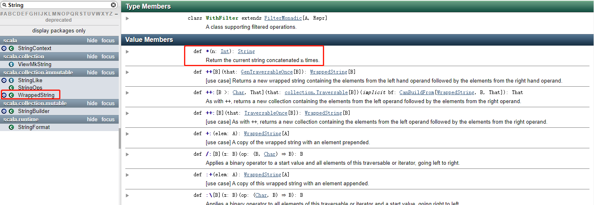

# 练习1

- 在Scala REPL(read->evaluateion->print->loop)中，计算3的平方根,然后再对该值求平方。现在，这个结果与3相差多少？ 
  - 提示：scala.math 找相应的方法

```scala
scala> scala.math.sqrt(3)
res0: Double = 1.7320508075688772

scala> res0 * res0
res1: Double = 2.9999999999999996

scala> 3 - res1
res2: Double = 4.440892098500626E-16
```

- Scala语言的sdk是什么?
  - 开发工具包

- Scala环境变量配置及其作用

- Scala程序的编写、编译、运行步骤是什么? 能否一步执行?

- Scala程序编写的规则

- 简述：在配置环境、编译、运行各个步骤中常见的错误

- 如何检测一个变量是val还是var? 
  - 定义一个var或者val，通过是否可以重新赋值判断出来是否是val

- Scala允许你用数字去乘一个字符串，去REPL中试一下"crazy"*3。这个操作做什么？在Scaladoc中如何找到这个操作? 

```scala
scala> "crazy"*3
res3: String = crazycrazycrazy
```




- 10 max 2的含义是什么？max方法定义在哪个类中？ 
  - 返回2个数中的最大值

```scala
scala> 10 max 2
res4: Int = 10

scala> 10.max(2)
res6: Int = 10

scala> 10 max 88
res5: Int = 88
```


- 用BigInt计算2的1024次方 
  - 提示：在BigInt 找相应的方法 

```scala
scala> val t = BigInt(2)
// 使用BigInt的apply进行变量声明
t: scala.math.BigInt = 2

scala> t.pow(1024)
res7: scala.math.BigInt = 179769313486231590772930519078902473361797697894230657273430081157732675805500963132708477322407536021120113879871393357658789768814416622492847430639474124377767893424865485276302219601246094119453082952085005768838150682342462881473913110540827237163350510684586298239947245938479716304835356329624224137216

scala> BigInt(2).pow(1024)
res8: scala.math.BigInt = 179769313486231590772930519078902473361797697894230657273430081157732675805500963132708477322407536021120113879871393357658789768814416622492847430639474124377767893424865485276302219601246094119453082952085005768838150682342462881473913110540827237163350510684586298239947245938479716304835356329624224137216
```

- 在Scala中如何获取字符串“Hello”的首字符和尾字符？ 
  - 提示: 在String中找相应的方法

```scala
scala> "hello".take(0)
res9: String = ""

scala> "hello".take(1)
res10: String = h

scala> "hello".takeRight(0)
res11: String = ""

scala> "hello".takeRight(1)
res12: String = o

scala> "hello"(0)
res13: Char = h

scala> "hello".reverse.take(1)
res14: String = o
```


# 对象

编写一个Conversions对象，加入 inchesToCentimeters,gallonsToLiters 和 milesToKilometers 方法

```scala
object Conversions {
    def inchesToCentimeters(value: Double) = value * 2.54
    def gallonsToLiters(value: Double) = value * 3.78541178
    def milesToKilometers(value: Double) = value * 1.609344
}
```

定义一个 Point 类和一个伴生对象,使得我们可以不用 new 而直接用 Point(3,4)来构造 Point 实例 apply 方法的使用

```scala
class Point(_x : Double,_y : Double){
    var x: Double = _x
    var y: Double = _y
    override def toString(): String ={
        "x="+x+" y="+y
    }
}

object Point{
    def apply(x: Double,y : Double) = new Point(x,y)
}
```


编写一个 Scala 应用程序,使用 App 特质,以反序打印命令行参数,用空格隔开。举例来说,scala Reverse Hello World 应该打印 World Hello

 ```scala
object Exercise03 extends App {
  val args2 = args.reverse
  println(args2.mkString(" "))
}
 ```


编写一个扑克牌 4 种花色的枚举,让其 toString 方法分别返回♣♦♥♠，并实现一个函数,检查某张牌的花色是否为红色

```scala
object test{
    def main(args: Array[String]): Unit = {
        println(Suits)
        println(Suits.isRed(Suits.Diamond))
    }
}

object Suits extends Enumeration {
    type myValue = Value // 给Value起别名 ♣♦♥♠

    val Spade = Value("♣")
    val Club = Value("♠")
    val Heart = Value("♥")
    val Diamond = Value("♦")

    override def toString(): String = {
        Suits.values.mkString(",")
    }

    def isRed(suit: myValue) = suit == Heart || suit == Diamond
}
```


# 继承

扩展如下的BankAccount类，新类CheckingAccount对每次存款和取款都收取1美元的手续费

```scala
class BankAccount(initialBalance:Double){
   private var balance = initialBalance
   def deposit(amount:Double) = { balance += amount; balance}
   def withdraw(amount:Double) = {balance -= amount; balance}
}
```

```scala
class CheckingAccount(initialBalance: Double) extends BankAccount(initialBalance){
  override def deposit(amount: Double): Double = {
    super.deposit(amount-1)
  }
  override def withdraw(amount: Double): Double = super.withdraw(amount-1)
}
```


扩展前一个练习的BankAccount类，新类SavingsAccount每个月都有利息产生(earnMonthlyInterest方法被调用)，并且有每月三次免手续费的存款或取款。在earnMonthlyInterest方法中重置交易计数

```scala
class SavingsAccount(initialBalance:Double) extends BankAccount(initialBalance){
    private var num:Int = _ // 定义了一个免手续费次数

    def earnMonthlyInterest()={ // 每个月初，我们系统调用该方法，计算利息，将num=3
        num = 3  //
        super.deposit(1) 
    }
    override def deposit(amount: Double): Double = {//取款时，如num<0收手续费,否则不收
        num -= 1 //
        if(num < 0) 
        super.deposit(amount - 1) 
        else 
        super.deposit(amount)
    }
    override def withdraw(amount: Double): Double = { //取款逻辑和存款一样
        num -= 1
        if (num < 0) super.withdraw(amount + 1) else super.withdraw(amount)
    }
}
```


设计一个Point类，其x和y坐标可以通过构造器提供。提供一个子类LabeledPoint，其构造器接受一个标签值和x,y坐标,比如:new LabeledPoint(“Black Thursday”,1929,230.07)

 ```scala
class Point(x:Double,y:Double)
class LabeledPoint(x:Double,y:Double,tag:String) extends Point(x,y)
 ```


定义一个抽象类Shape，一个抽象方法centerPoint，以及该抽象类的子类Rectangle和Circle。为子类提供合适的构造器，并重写centerPoint方法

 ```scala
abstract class Shape{ //抽象类
  def centerPoint()  //抽象方法
}
class Rectangle(startX:Int,startY:Int,endX:Int,endY:Int) extends Shape{
  def centerPoint() {} //空
}
class Circle(x:Int,y:Int,radius:Double) extends Shape{
  def centerPoint() {} //空
}
 ```


提供一个Square类，扩展自java.awt.Rectangle并且是三个构造器：一个以给定的端点和宽度构造正方形，一个以(0,0)为端点和给定的宽度构造正方形，一个以(0,0)为端点,0为宽度构造正方形

```scala
import java.awt.{Point, Rectangle}
class Square(point:Point,width:Int) extends Rectangle(point.x,point.y,width,width){
    def this(){
        this(new Point(0,0),0)
    }
    def this(width:Int){
        this(new Point(0,0),width)
    }
}
```


# 特质

- java.awt.Rectangle类有两个很有用的方法translate和grow,但可惜的是像java.awt.geom.Ellipse2D这样的类没有。在Scala中，你可以解决掉这个问题
  - 定义一个RenctangleLike特质,加入具体的translate和grow方法
  - 提供任何你需要用来实现的抽象方法,以便你可以像如下代码这样混入该特质
- val egg = new java.awt.geom.Ellipse2D.Double(5,10,20,30) with RectangleLike
- egg.translate(10,-10)
- egg.grow(10,20)

- 分析思路
  - 考察点是使用特质(自身类型)，编写方法，以动态混入的方式，来扩展一个类的功能
  - RenctangleLike 名字. translate(将x,y的值重置) 和grow方法(对x,y值进行增长)
  - new java.awt.geom.Ellipse2D.Double(5,10,20,30) with RectangleLike
  - 使用 egg.translate(10,-10) egg.grow(10,20)

```scala
import java.awt.geom.Ellipse2D

object TraitExer extends App{

    //使用我们的特质进行功能扩展
    val egg = new java.awt.geom.Ellipse2D.Double(5,10,20,30) with RectangleLike
    println("egg.x=" + egg.getX + " egg.y=" + egg.getY) //
    egg.translate(10.0,20.5)
    println("egg.x=" + egg.getX + " egg.y=" + egg.getY) //
    egg.grow(-1, 10)
    println("egg.x=" + egg.getX + " egg.y=" + egg.getY) //

}
trait RectangleLike{ //特质
    // 使用自身类型
    this:Ellipse2D.Double=>
    def translate(x:Double,y:Double){ //方法
        this.x = x
        this.y = y
    }
    def grow(x:Double,y:Double){
        this.x += x //增加
        this.y += y //增加
    }
}
```

- 传统写法，使用继承

```scala
trait RectangleLike extends Ellipse2D.Double{ 
    def translate(x:Double,y:Double){ 
        this.x = x
        this.y = y
    }
    def grow(x:Double,y:Double){
        this.x += x 
        this.y += y 
    }
}
```


# 集合

- val lines = List("atguigu han hello ", "atguigu han aaa aaa aaa ccc ddd uuu")

  使用映射集合，list中，各个单词出现的次数，并按出现次数排序

```scala
def main(args: Array[String]): Unit = {
    val lines = List("atguigu han hello ", "atguigu han aaa aaa aaa ccc ddd uuu")
    // 拆分成一个个单词
    val re1 = lines.flatMap(_.split(" "))
    // 每个单词一个数字1
    val re2 = re1.map((_,1))
    // 分组 产生一个Map
    val re3 = re2.groupBy(_._1)
    val re4 = re3.map(x=>(x._1,x._2.size))
    // 排序
    val re5 = re4.toList.sortBy(_._2).reverse
    println(re5)
}
```

