# 介绍

- 博客https://www.iteblog.com/

- 关于Hadoop
  - 2003,2004 google的2篇论文
  
  - 2006 hadoop作为一个项目开发
  
  - 2011年1.0版本
  
  - 2012年3月，稳定版本
  
  - HDFS存储框架，MapperReduce计算框架
  
  - 缺点
  
    - NameNode单点，容易出现单点故障，制约了HDFS的发展
  
    - NameNode的内存限制影响了HDFS的发展
  
    - MapperReduce初衷是单一数据计算
  
      - 将HDFS的数据打散进行reduce处理，但是进行多次MR操作，会有多次IO过程，性能差
        - 每次操作都有IO过程
  
      
  
    - MR框架中资源调度存在问题，在早期的版本中
  
      - 资源调度和任务调度耦合在一起，无法扩展，所以Hadoop1.x只支持MR计算框架
      - JobTracker负责资源和任务的调度
      - JobTracker是单点的
  
      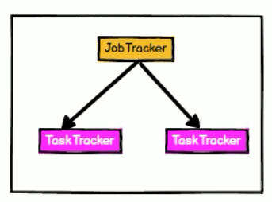
  
  - 2013年10月 Hadoop 2.x版本(Yarn)，用于解决资源调度问题
  
    - 2.X支持NameNode高可用，与ZK配合使用
    - 2.X支持Yarn资源调度框架，只做资源调度，不进行任务调度
    - MR只做任务调度，可插拔，扩展性强
  
    
  
    

- 关于Spark

  - 也是用于解决Hadoop1.x版本中出现的问题，资源调度等问题
    - Spark比Yarn要早，Hadoop2.x与Spark相互参考发展
  - Spark是一种基于==内存==的快速、通用、可扩展的大数据分析引擎
  - 2009年诞生于加州大学伯克利分校AMPLab，项目采用Scala编写
  - 2010年开源;2013年6月成为Apache孵化项目；2014年2月成为Apache顶级项目
  - 是一个计算框架，数据存储由HDFS处理
  - 结构与Hadoop的Yarn类似，相互参考

  


## Spark 内置模块


- Spark Core
  - 实现了Spark的基本功能，包含任务调度、内存管理、错误恢复、与存储系统交互等模块
  - 包含了对弹性分布式数据集(Resilient Distributed DataSet，简称RDD)的API定义

- Spark SQL
  - 是Spark用来操作结构化数据的程序包
  - 通过Spark SQL，可使用 SQL或者Apache Hive版本的SQL方言(HQL)来查询数据
  - 支持多种数据源，如Hive表、Parquet以及JSON等

- Spark Streaming
  - 是Spark提供的对实时数据进行流式计算的组件
  - 提供了用来操作数据流的API
  - 与Spark Core中的 RDD API高度对应

- Spark MLlib
  - 提供常见的机器学习(ML)功能的程序库
  - 包括分类、回归、聚类、协同过滤等
  - 提供了模型评估、数据 导入等额外的支持功能

- 集群管理器

  - Spark 设计为可以高效地在一个计算节点到数千个计算节点之间伸缩计算

  - 为了实现这样的要求，同时获得最大灵活性

  - 支持在各种集群管理器(Cluster Manager)上运行

    - Hadoop YARN

    - Apache Mesos

    - Spark自带简易调度器

      - 作独立调度器

        

- Spark得到了众多大数据公司的支持
  - Hortonworks、IBM、Intel、Cloudera、MapR、Pivotal、百度、阿里、腾讯、京东、携程、优酷土豆
  - 当前百度的Spark已应用于大搜索、直达号、百度大数据等业务
  - 阿里利用GraphX构建了大规模的图计算和图挖掘系统，实现了很多生产系统的推荐算法
  - 腾讯Spark集群达到8000台的规模，是当前已知的世界上最大的Spark集群


## 特点

- 快
  - 与Hadoop的MapReduce相比，Spark基于内存的运算要快100倍以上，基于硬盘的运算也要快10倍以上
  - Spark实现了高效的DAG执行引擎，可通过基于内存来高效处理数据流
  - 计算的中间结果是存在于内存中的
- 易用
  - Spark支持Java、Python和Scala的API，支持超过80种高级算法，使用户可以快速构建不同的应用
  - Spark支持交互式的Python和Scala的Shell，可非常方便地在这些Shell中使用Spark集群来验证解决问题的方法

- 通用
  - Spark提供了统一的解决方案
  - Spark可以用于批处理、交互式查询（Spark SQL）、实时流处理（Spark Streaming）、机器学习（Spark MLlib）和图计算（GraphX）
    - 这些不同类型的处理都可以在同一个应用中无缝使用
    - 减少了开发和维护的人力成本和部署平台的物力成本

- 兼容性
  - Spark非常方便地与其他的开源产品进行融合
    - 如Spark可使用Hadoop的YARN和Apache Mesos作为它的资源管理和调度器，并且可以处理所有Hadoop支持的数据，包括HDFS、HBase等
    - 对于已经部署Hadoop集群的用户特别重要，不需要做任何数据迁移就可以使用Spark的强大处理能力


# 运行模式


## 地址

- 官网地址http://spark.apache.org/
- 文档查看地址https://spark.apache.org/docs/2.1.1/

- 下载地址https://spark.apache.org/downloads.html


## 集群角色


### Master

- Spark==特有资源调度系统==的Leader
- 掌管着整个集群的资源信息，类似于Yarn框架中的ResourceManager，主要功能
  - 监听Worker，看Worker是否正常工作
  - Master对Worker、Application等的管理
    - 接收worker的注册并管理所有的worker
    - 接收client提交的application
    - (FIFO)调度等待的application并向worker提交


### Worker

- Spark特有资源调度系统的Slave，有多个
- 每个Slave掌管着所在节点的资源信息，类似于Yarn框架中的NodeManager，主要功能：
  - 通过RegisterWorker注册到Master
  - 定时发送心跳给Master
  - 根据master发送的application配置进程环境，并启动==StandaloneExecutorBackend==
    - 执行Task所需的临时进程


### Driver 驱动器

- Spark的驱动器是执行开发程序中的main方法的进程
- 负责创建SparkContext、创建RDD，以及进行RDD的转化操作和行动操作代码的执行
  - 如是用spark shell，当启动Spark shell时，系统后台自启了一个Spark驱动器程序，就是在Spark shell中预加载的一个叫作 sc的SparkContext对象
    - 如果驱动器程序终止，那么Spark应用也就结束了
- 主要负责
  - 把用户程序转为任务
  - 跟踪Executor的运行状况
  - 为执行器节点调度任务
  - UI展示应用运行状况


### Executor 执行器

- Spark Executor是一个工作进程，负责在 Spark 作业中运行任务，任务间相互独立
- Spark 应用启动时，Executor节点被同时启动，并且始终伴随着整个 Spark 应用的生命周期而存在
- 如果有Executor节点发生了故障或崩溃，Spark 应用也可以继续执行，会将出错节点上的任务调度到其他Executor节点上继续运行
- 主要负责
  - 运行组成 Spark 应用的任务，并将状态信息返回给驱动器进程
  - 通过自身的块管理器（Block Manager）为用户程序中要求缓存的RDD提供内存式存储
    - RDD是直接缓存在Executor进程内的，因此任务可以在运行时充分利用缓存数据加速运算
- 当executor内存不够，那么该级别的executor不够，降级处理，在同一个worker下的同级别的executor处理（同一个机器中的executor），如果此级别还不够，那么选择同一个机架上的executor


### 小结

- Master和Worker是Spark的守护进程，即Spark在特定模式下正常运行所必须的进程
- Driver和Executor是临时进程，当有具体任务提交到Spark集群才会开启的进程


## 基本语法

```bash
bin/spark-submit \
--class <main-class>
--master <master-url> \
--deploy-mode <deploy-mode> \
--conf <key>=<value> \
... # other options
<application-jar> \
[application-arguments]
```

- 参数说明
  - --master
    - 指定master的地址
      - yarn
      - local
      - spark://hadoop102:7077
  - --class
    - 应用的启动类 (如 org.apache.spark.examples.SparkPi)
  - --deploy-mode
    - 是否发布该驱动到worker节点
      - cluster 
    - 默认值
      - client
      - 作为本地客户端
  - --conf
    - 任意的Spark配置属性
    - 格式key=value
    - 如果值包含空格，可加引号“key=value” 
  - --executor-memory 1G 
    - 指定每个executor可用内存为1G
  - --total-executor-cores 2
    - 指定总的executor使用的cup核数为2个
  - application-jar
    - 打包好的应用jar,包含依赖. 这个URL在集群中全局可见
    - 如hdfs:// 共享存储系统
    - 如file:// path 则所有节点的path都包含同样的jar
  - application-arguments
    - 传给main()方法的参数


## Local 模式

- Local模式就是运行在一台计算机上的模式，通常就是用于在本机上练手和测试
- 通过以下集中方式设置Master
  - local
    - 所有计算都运行在一个线程当中，没有任何并行计算，通常在本机执行一些测试代码
  - local[K]
    - 指定使用几个线程来运行计算
    - 如local[4]就是运行4个Worker线程
    - 通常Cpu有几个Core，就指定几个线程，最大化利用Cpu的计算能力
  - local[*]
    - 直接按照Cpu最多Cores来设置线程数


### 安装

- 上传解压
  - **注意**spark的版本与hadoop的版本有关联

```bash
[ttshe@hadoop102 sorfware]$ tar -zxvf spark-2.1.1-bin-hadoop2.7.tgz -C /opt/module/
[ttshe@hadoop102 module]$ mv spark-2.1.1-bin-hadoop2.7 spark
```


### spark-submit使用

#### 官方案例

- 注意，在spark中，--class参数不可省略

```bash
[ttshe@hadoop102 spark]$ bin/spark-submit \
--class org.apache.spark.examples.SparkPi \
--executor-memory 1G \
--total-executor-cores 2 \
./examples/jars/spark-examples_2.11-2.1.1.jar \
100
```

- 执行结果
  - 该算法是蒙特·卡罗算法求PI

```bash
...
19/10/15 01:41:25 INFO Executor: Finished task 96.0 in stage 0.0 (TID 96). 1114 bytes result sent to driver
19/10/15 01:41:25 INFO TaskSetManager: Finished task 99.0 in stage 0.0 (TID 99) in 265 ms on localhost (executor driver) (99/100)
19/10/15 01:41:25 INFO TaskSetManager: Finished task 96.0 in stage 0.0 (TID 96) in 391 ms on localhost (executor driver) (100/100)
19/10/15 01:41:25 INFO DAGScheduler: ResultStage 0 (reduce at SparkPi.scala:38) finished in 4.380 s
19/10/15 01:41:25 INFO TaskSchedulerImpl: Removed TaskSet 0.0, whose tasks have all completed, from pool 
19/10/15 01:41:25 INFO DAGScheduler: Job 0 finished: reduce at SparkPi.scala:38, took 4.854334 s
Pi is roughly 3.1415635141563514 # 结果****
19/10/15 01:41:25 INFO SparkUI: Stopped Spark web UI at http://192.168.1.102:4040
19/10/15 01:41:25 INFO MapOutputTrackerMasterEndpoint: MapOutputTrackerMasterEndpoint stopped!
19/10/15 01:41:25 INFO MemoryStore: MemoryStore cleared
19/10/15 01:41:25 INFO BlockManager: BlockManager stopped
19/10/15 01:41:25 INFO BlockManagerMaster: BlockManagerMaster stopped
19/10/15 01:41:25 INFO OutputCommitCoordinator$OutputCommitCoordinatorEndpoint: OutputCommitCoordinator stopped!
19/10/15 01:41:25 INFO SparkContext: Successfully stopped SparkContext
19/10/15 01:41:25 INFO ShutdownHookManager: Shutdown hook called
19/10/15 01:41:25 INFO ShutdownHookManager: Deleting directory /tmp/spark-46dac97b-c56a-4eb9-9998-d538cf58fd80
...
```


### spark-shell使用

#### WordCount案例

- 准备文件

```bash
[ttshe@hadoop102 spark]$ mkdir input
[ttshe@hadoop102 spark]$ cd input/
[ttshe@hadoop102 input]$ vim 1.txt
[ttshe@hadoop102 input]$ cat 1.txt
hello spark
hello scala
[ttshe@hadoop102 input]$ cp 1.txt 2.txt
```

- 启动spark-shell

```bash
[ttshe@hadoop102 spark]$ bin/spark-shell
Using Spark's default log4j profile: org/apache/spark/log4j-defaults.properties
Setting default log level to "WARN".
To adjust logging level use sc.setLogLevel(newLevel). For SparkR, use setLogLevel(newLevel).
19/10/15 01:51:24 WARN NativeCodeLoader: Unable to load native-hadoop library for your platform... using builtin-java classes where applicable
19/10/15 01:51:28 WARN ObjectStore: Version information not found in metastore. hive.metastore.schema.verification is not enabled so recording the schema version 1.2.0
19/10/15 01:51:28 WARN ObjectStore: Failed to get database default, returning NoSuchObjectException
19/10/15 01:51:29 WARN ObjectStore: Failed to get database global_temp, returning NoSuchObjectException
# 注意web页面的访问地址
Spark context Web UI available at http://192.168.1.102:4040 
# 注意spark上下文对象 sc
Spark context available as 'sc' (master = local[*], app id = local-1571075485385).
# 注意spark的session对象 spark
Spark session available as 'spark'.
Welcome to
      ____              __
     / __/__  ___ _____/ /__
    _\ \/ _ \/ _ `/ __/  '_/
   /___/ .__/\_,_/_/ /_/\_\   version 2.1.1
      /_/
         
Using Scala version 2.11.8 (Java HotSpot(TM) 64-Bit Server VM, Java 1.8.0_144)
Type in expressions to have them evaluated.
Type :help for more information.

scala> 
```

- 开启另一个CRD窗口

```bash
[ttshe@hadoop102 bin]$ jps
4179 QuorumPeerMain
4949 SparkSubmit # 此时sparkSubmit的进程开启
```

- 运行WordCount程序

```scala
scala> sc.textFile("input").flatMap(_.split(" ")).map((_,1)).reduceByKey(_+_).collect
res0: Array[(String, Int)] = Array((scala,2), (hello,4), (spark,2))
```

- 登录hadoop102:4040查看程序运行

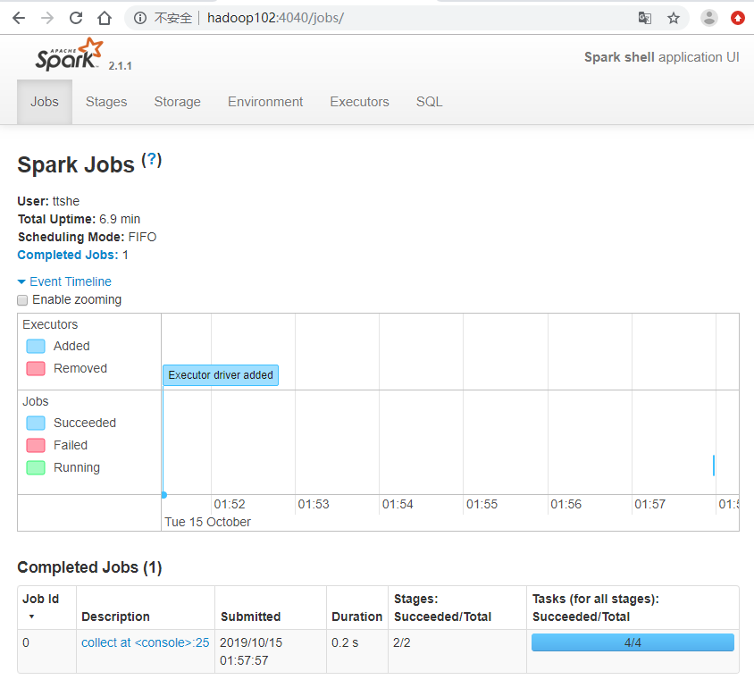


#### WordCount分析

- textFile("input")
  - 读取本地文件input文件夹数据
- `flatMap(_.split(" "))`
  - 压平操作，按照空格分割符将一行数据映射成一个个单词
- `map((_,1))`
  - 对每一个元素操作，将单词映射为元组_
- `reduceByKey(_+_)`
  - 按照key将值进行聚合，相加
- collect
  - 将数据收集到Driver端展示
- 注意
  - 在内存进行了shuffe的过程
    - reduceByKey


## 提交操作简易流程


## Standalone 模式


### 运行流程

构建一个由Master+Slave构成的Spark集群，Spark运行在集群中

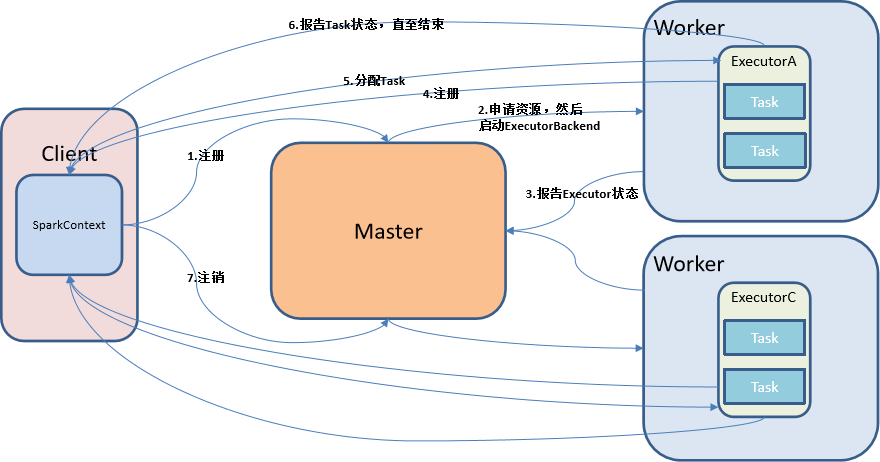

### 安装&配置

- 进入spark安装目录下的conf文件夹

```bash
[ttshe@hadoop102 spark]$ cd conf/
[ttshe@hadoop102 conf]$ cp slaves.template slaves
[ttshe@hadoop102 conf]$ cp spark-env.sh.template spark-env.sh
```

- 修改slave文件，添加work节点

```bash
[ttshe@hadoop102 conf]$ vim slaves
hadoop102
hadoop103
hadoop104
```

- 修改spark-env.sh文件，添加如下配置

```bash
[ttshe@hadoop102 conf]$ vim spark-env.sh

SPARK_MASTER_HOST=hadoop102
SPARK_MASTER_PORT=7077
```

- 分发

```bash
[ttshe@hadoop102 module]$ xsync spark/
```


### 启动

```bash
[ttshe@hadoop102 spark]$ sbin/start-all.sh
starting org.apache.spark.deploy.master.Master, logging to /opt/module/spark/logs/spark-ttshe-org.apache.spark.deploy.master.Master-1-hadoop102.out
hadoop103: starting org.apache.spark.deploy.worker.Worker, logging to /opt/module/spark/logs/spark-ttshe-org.apache.spark.deploy.worker.Worker-1-hadoop103.out
hadoop102: starting org.apache.spark.deploy.worker.Worker, logging to /opt/module/spark/logs/spark-ttshe-org.apache.spark.deploy.worker.Worker-1-hadoop102.out
hadoop104: starting org.apache.spark.deploy.worker.Worker, logging to /opt/module/spark/logs/spark-ttshe-org.apache.spark.deploy.worker.Worker-1-hadoop104.out
[ttshe@hadoop102 spark]$ xcall.sh jps
--------- hadoop102 ----------
27424 Worker
4179 QuorumPeerMain
27507 Jps
3941 NodeManager
27301 Master
3400 NameNode
--------- hadoop103 ----------
55459 DataNode
56885 Jps
56325 QuorumPeerMain
55753 ResourceManager
56809 Worker
55962 NodeManager
--------- hadoop104 ----------
50292 Jps
48629 SecondaryNameNode
48855 NodeManager
48488 DataNode
50216 Worker
49099 QuorumPeerMain
```


### 访问web

- http://hadoop102:8080/

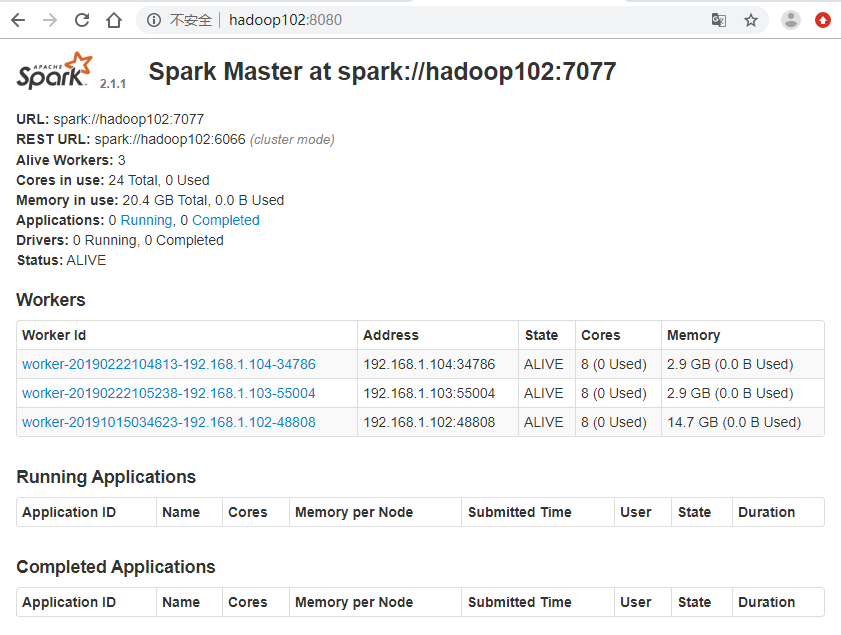


### 问题

- 如果遇到 “JAVA_HOME not set” 异常，可以在sbin目录下的spark-config.sh 文件中加入如下配置

```bash
[ttshe@hadoop102 spark]$ $JAVA_HOME
-bash: /opt/module/jdk1.8.0_144: is a directory

export JAVA_HOME=/opt/module/jdk1.8.0_144
```


### 测试

#### spark-submit 官方案例

```bash
[ttshe@hadoop102 spark]$ bin/spark-submit \
--class org.apache.spark.examples.SparkPi \
--master spark://hadoop102:7077 \
--executor-memory 1G \
--total-executor-cores 2 \
./examples/jars/spark-examples_2.11-2.1.1.jar \
100
```


#### spark-shell workCount案例

```bash
/opt/module/spark/bin/spark-shell \
--master spark://hadoop102:7077 \
--executor-memory 1g \
--total-executor-cores 2
```

- --master spark://hadoop102:7077指定要连接的集群的master
- 执行wordCount

```bash
scala>sc.textFile("input").flatMap(_.split(" ")).map((_,1)).reduceByKey(_+_).collect
res0: Array[(String, Int)] = Array((hadoop,6), (oozie,3), (spark,3), (hive,3), (atguigu,3), (hbase,6))

scala>
```

- 查看网页可以看到相应的执行情况

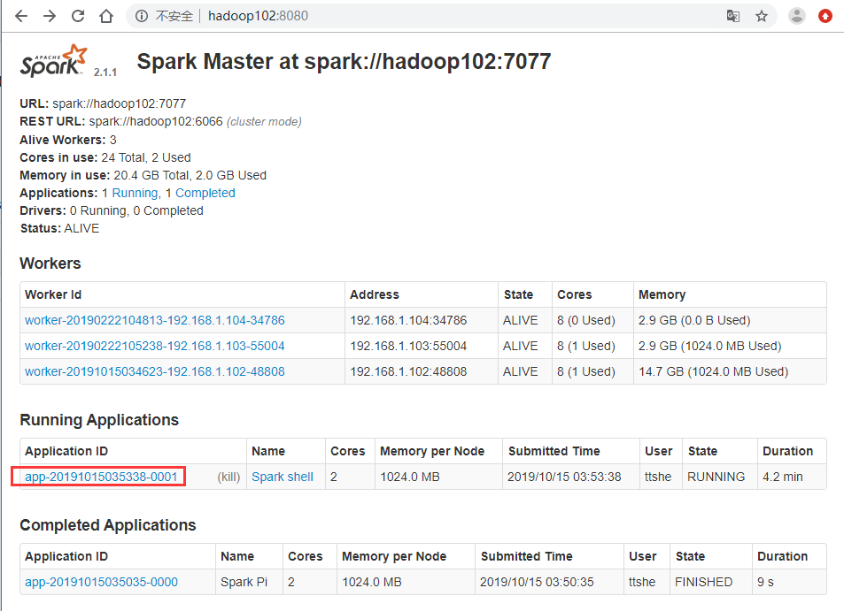

- 点击进入可以看到执行日志


- 注意没有关闭spark-shell，会一直开启进程CoarseGrainedExecutorBackend

```bash
[ttshe@hadoop102 ~]$ xcall.sh jps
--------- hadoop102 ----------
27424 Worker
28241 Jps
4179 QuorumPeerMain
3941 NodeManager
27301 Master
3400 NameNode
27897 CoarseGrainedExecutorBackend
27802 SparkSubmit
--------- hadoop103 ----------
55459 DataNode
57188 Jps
56325 QuorumPeerMain
55753 ResourceManager
56809 Worker
55962 NodeManager
57052 CoarseGrainedExecutorBackend
...
```


### HA配置


- zookeeper正常安装并启动
- 修改spark-env.sh文件，添加如下配置

```bash
[ttshe@hadoop102 conf]$ vi spark-env.sh

注释掉如下内容：
#SPARK_MASTER_HOST=hadoop102
#SPARK_MASTER_PORT=7077
添加上如下内容：
export SPARK_DAEMON_JAVA_OPTS="
-Dspark.deploy.recoveryMode=ZOOKEEPER 
-Dspark.deploy.zookeeper.url=hadoop102,hadoop103,hadoop104 
-Dspark.deploy.zookeeper.dir=/spark"
```

- 分发

```bash
[ttshe@hadoop102 conf]$ xsync spark-env.sh
```

- 在==Hadoop102==启动全部节点

```bash
# 如果没有关闭先进行关闭
[ttshe@hadoop102 spark]$ sbin/stop-all.sh 
[ttshe@hadoop102 spark]$ sbin/start-all.sh 
```

- 在==Hadoop103==上单独启动master节点（备份master节点）

```bash
[ttshe@hadoop103 spark]$ sbin/start-master.sh 
```

- 集群访问HA

```bash
/opt/module/spark/bin/spark-shell \
--master spark://hadoop102:7077,hadoop103:7077 \
--executor-memory 2g \
--total-executor-cores 2
```

- 访问hadoop103:8080
  - 当kill掉hadoop102上的master之后访问
  - 当执行一个job时，页面会有各个worker信息


### 历史服务

- JobHistoryServer配置

- 修改spark-default.conf.template名称
- 修改spark-default.conf文件，开启Log
- 注意：HDFS上的目录需要提前存在

```bash
[ttshe@hadoop102 spark]$ cd conf/
[ttshe@hadoop102 conf]$ cp spark-defaults.conf.template spark-defaults.conf
[ttshe@hadoop102 conf]$ vim spark-defaults.conf

# 修改如下
spark.eventLog.enabled           true
spark.eventLog.dir               hdfs://hadoop102:9000/directory

[ttshe@hadoop102 conf]$ hadoop fs -mkdir /directory
```

- 修改spark-env.sh文件，添加如下配置

```bash
[ttshe@hadoop102 conf]$ vim spark-env.sh

export SPARK_HISTORY_OPTS="-Dspark.history.ui.port=18080
-Dspark.history.retainedApplications=30 
-Dspark.history.fs.logDirectory=hdfs://hadoop102:9000/directory"
```

- 参数描述
  - spark.eventLog.dir
    - Application在运行过程中所有的信息均记录在该属性指定的路径下
  - spark.history.ui.port=18080
    - WEBUI访问的端口号为18080
  - spark.history.fs.logDirectory=hdfs://hadoop102:9000/directory配置了该属性后，在start-history-server.sh时就无需再显式的指定路径
    - Spark History Server页面只展示该指定路径下的信息
  - spark.history.retainedApplications=30
    - 指定保存Application历史记录的个数，如果超过这个值，旧的应用程序信息将被删除
    - 内存中的应用数，不是页面上显示的应用数

- 分发

```bash
[ttshe@hadoop102 conf]$ xsync spark-defaults.conf
[ttshe@hadoop102 conf]$ xsync spark-env.sh
```

- 启动历史服务

```bash
[ttshe@hadoop102 spark]$ sbin/start-history-server.sh
```

- 再次执行任务

```bash
[ttshe@hadoop102 spark]$ bin/spark-submit \
--class org.apache.spark.examples.SparkPi \
--master spark://hadoop102:7077 \
--executor-memory 1G \
--total-executor-cores 2 \
./examples/jars/spark-examples_2.11-2.1.1.jar \
100
```

- 查看历史服务
  - http://hadoop102:18080/

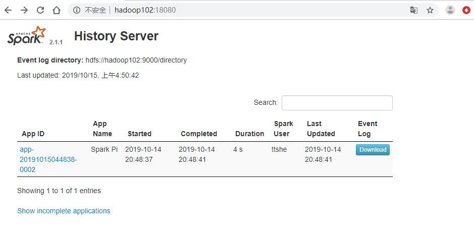

## Yarn 模式

- Spark客户端直接连接Yarn，不需要额外构建Spark集群
- 有yarn-client和yarn-cluster两种模式
  - ==主要区别在于Driver程序的运行节点==
  - yarn-client
    - Driver程序运行在客户端，适用于交互、调试，希望立即看到app的输出
    - 一般很少在生产中使用
  - yarn-cluster
    - Driver程序运行在由RM（ResourceManager）启动的AM（APPMaster）适用于生产环境

### 模式流程

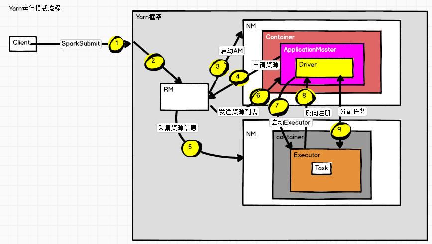

- 客户端提交应用程序
- 让RM启动spark.ApplicationMaster程序，用于spark和yarn资源之间的交互
- AM向RM申请资源，用于启动Executor
- RM获取集群的资源信息（NM）
- RM将资源信息发送给AM，由AM中的Driver判断任务的调度的地址
  - 期间Executor进行反向注册给AM
    - 将Executor所在节点的资源信息返回
  - AM通过资源位置，判断给哪个Executor执行
- 划分任务，将指定的任务发送给Executor执行
- Excutor执行任务，执行完成后，通知Driver
- Driver和AM交互通知RM回收资源

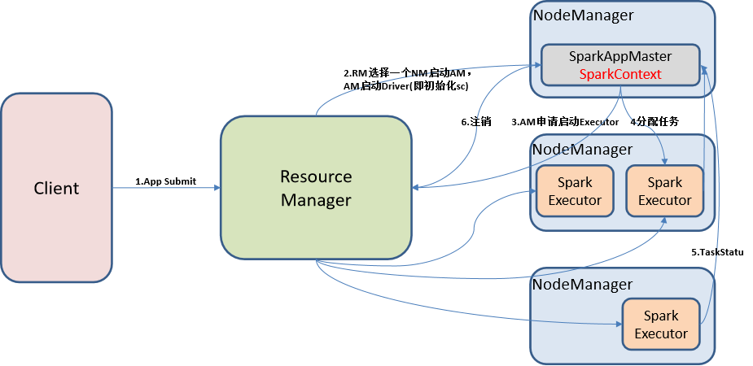

### 安装&配置

- 修改hadoop配置文件yarn-site.xml
  - 添加如下内容
  - 在生产中使用默认配置

```xml
[ttshe@hadoop102 hadoop]$ vim yarn-site.xml
<!--是否启动一个线程检查每个任务正使用的物理内存量，如果任务超出分配值，则直接将其杀掉，默认是true -->
<property>
    <name>yarn.nodemanager.pmem-check-enabled</name>
    <value>false</value>
</property>
<!--是否启动一个线程检查每个任务正使用的虚拟内存量，如果任务超出分配值，则直接将其杀掉，默认是true -->
<property>
    <name>yarn.nodemanager.vmem-check-enabled</name>
    <value>false</value>
</property>
# 分发
[ttshe@hadoop102 hadoop]$ xsync yarn-site.xml 
```

- 修改spark-env.sh，添加如下配置

```bash
[ttshe@hadoop102 spark]$ vim conf/spark-env.sh

YARN_CONF_DIR=/opt/module/hadoop-2.7.2/etc/hadoop
```


### 测试

- 如果有standalone模式执行的spark可以先关闭
- ==注意在提交任务之前需启动HDFS以及YARN集群==

```bash
[ttshe@hadoop102 spark]$ sbin/stop-all.sh 
[ttshe@hadoop102 spark]$ bin/spark-submit \
--class org.apache.spark.examples.SparkPi \
--master yarn \
--deploy-mode client \
./examples/jars/spark-examples_2.11-2.1.1.jar \
100
```

- 访问页面http://hadoop103:8088/cluster/apps 可以看到执行情况


- 访问spark执行历史页面


### 历史服务

- ==增加配置将spark的历史服务于Hadoop的历史服务进行关联==
- 修改配置文件spark-defaults.conf

```bash
[ttshe@hadoop102 spark]$ vim conf/spark-defaults.conf
# 增加
spark.yarn.historyServer.address=hadoop102:18080
spark.history.ui.port=18080
```

- 重启spark历史服务

```bash
[ttshe@hadoop102 spark]$ sbin/stop-history-server.sh 
stopping org.apache.spark.deploy.history.HistoryServer
[ttshe@hadoop102 spark]$ sbin/start-history-server.sh 
starting org.apache.spark.deploy.history.HistoryServer, logging to /opt/module/spark/logs/spark-atguigu-org.apache.spark.deploy.history.HistoryServer-1-hadoop102.out
```

- 提交任务到Yarn执行

```bash
[ttshe@hadoop102 spark]$ bin/spark-submit \
--class org.apache.spark.examples.SparkPi \
--master yarn \
--deploy-mode client \
./examples/jars/spark-examples_2.11-2.1.1.jar \
100
```

- ==注意==
  - 若发现yarn模式点击history跳转过去但看不了详细日志，需要在yarn-site.xml中加入以下下配置，并且需要启动mr的历史服务器和spark的历史服务器

```xml
[ttshe@hadoop102 hadoop]$ vim yarn-site.xml 
<property>
    <name>yarn.log.server.url</name>
    <value>http://hadoop102:19888/jobhistory/logs</value>
</property>
[ttshe@hadoop102 hadoop]$ xsync yarn-site.xml 
```

```bash
[ttshe@hadoop102 hadoop-2.7.2]$ sbin/mr-jobhistory-daemon.sh start historyserver
```

- 查看web页面

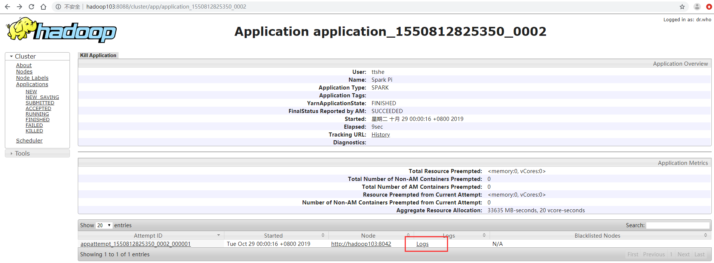

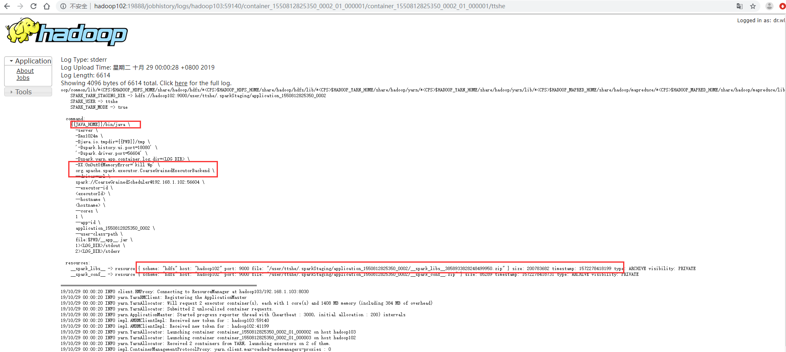


## Mesos 模式

Spark客户端直接连接Mesos；不需要额外构建Spark集群。国内应用比较少，更多的是运用yarn调度


## 模式对比

| 模式       | Spark安装机器数 | 需启动的进程   | 所属者 |
| ---------- | --------------- | -------------- | ------ |
| Local      | 1               | 无             | Spark  |
| Standalone | 3               | Master及Worker | Spark  |
| Yarn       | 1               | Yarn及HDFS     | Hadoop |


# 案例

Spark Shell仅在测试和验证我们的程序时使用的较多，在生产环境中，通常会在IDE中编制程序，然后打成jar包，然后提交到集群，最常用的是创建一个Maven项目，利用Maven来管理jar包的依赖。


## pom

```xml
<dependencies>
    <dependency>
        <groupId>org.apache.spark</groupId>
        <artifactId>spark-core_2.11</artifactId>
        <version>2.1.1</version>
    </dependency>
</dependencies>
<build>
    <finalName>WordCount</finalName>
    <plugins>
        <plugin>
            <groupId>net.alchim31.maven</groupId>
            <artifactId>scala-maven-plugin</artifactId>
            <version>3.2.2</version>
            <executions>
                <execution>
                    <goals>
                        <goal>compile</goal>
                        <goal>testCompile</goal>
                    </goals>
                </execution>
            </executions>
        </plugin>
        <plugin>
            <groupId>org.apache.maven.plugins</groupId>
            <artifactId>maven-assembly-plugin</artifactId>
            <version>3.0.0</version>
            <configuration>
                <archive>
                    <manifest>
                        <mainClass>WordCount</mainClass>
                    </manifest>
                </archive>
                <descriptorRefs>
                    <descriptorRef>jar-with-dependencies</descriptorRef>
                </descriptorRefs>
            </configuration>
            <executions>
                <execution>
                    <id>make-assembly</id>
                    <phase>package</phase>
                    <goals>
                        <goal>single</goal>
                    </goals>
                </execution>
            </executions>
        </plugin>
    </plugins>
</build>
```


## wordCount

```scala
package com.stt.spark

import org.apache.spark.rdd.RDD
import org.apache.spark.{SparkConf, SparkContext}

object WordCount {
    def main(args: Array[String]): Unit = {
          var path = args(0)
        //var path = "data/spark/wordCount"
        // 创建spark配置对象
        val conf: SparkConf = new SparkConf()
        .setMaster("local").setAppName("WordCount")
        // 创建spark上下文环境
        val sc: SparkContext = new SparkContext(conf)
        // 从开发工具的根目录读取本地文件
        val lines: RDD[String] = sc.textFile(path)
        // 将获取文件的每一行内容扁平化为单词
        val words: RDD[String] = lines.flatMap(_.split(" "))
        // 将每一单词转换为计算的元祖
        val wordAndOnes: RDD[(String, Int)] = words.map((_,1))
        // 根据元组的第一个元素进行聚合统计
        // 将每个Excutor中的结果进行返回汇聚
        val wordAndSum: RDD[(String, Int)] = wordAndOnes.reduceByKey(_+_)
        // 将统计结果收集到内存中展示
        val result: Array[(String, Int)] = wordAndSum.collect()
        // 打印
        result.foreach(println(_))
        // 关闭
        sc.stop()
    }
}
```

- 打成jar包，上传

- 打包到集群测试
  - ==注意是在standalone模式下执行==

```bash
bin/spark-submit \
--class com.stt.spark.WordCount \
--master spark://hadoop102:7077 \
/opt/software/WordCount.jar \
input
```


## 本地调试

本地Spark程序调试需要使用local提交模式，即将本机当做运行环境，Master和Worker都为本机。运行时直接加断点调试即可。如下：

创建SparkConf的时候设置额外属性，表明本地执行

```bash
val conf = new SparkConf().setAppName("WC").setMaster("local[*]")
```

如果本机操作系统是windows，如果在程序中使用了hadoop相关的东西，比如写入文件到HDFS，则会遇到如下异常

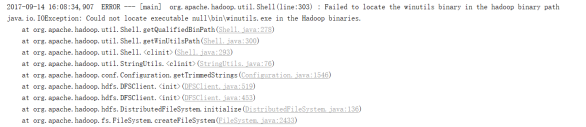

- 出现这个问题的原因，并不是程序的错误，而是用到了hadoop相关的服务，解决办法是将附加里面的hadoop-common-bin-2.7.3-x64.zip解压到任意目录
  - 在IDEA中配置Run Configuration，添加HADOOP_HOME变量


# 访问Web


## local-访问job执行

- 可以查看job执行情况

- local模式下

http://hadoop102:4040


## standalone-访问集群主页

- standalone模式下
- 查看集群地址以及内存情况

http://hadoop102:8080/


## all-历史服务

- standalone模式下
- yarn模式下
- 可以查看job执行情况

http://hadoop102:18080/


# idea技巧

- 在idea中，对于变量的类型不清楚的，可以通过设置，生成返回值时添加

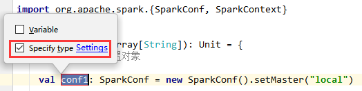