#  IO流回顾

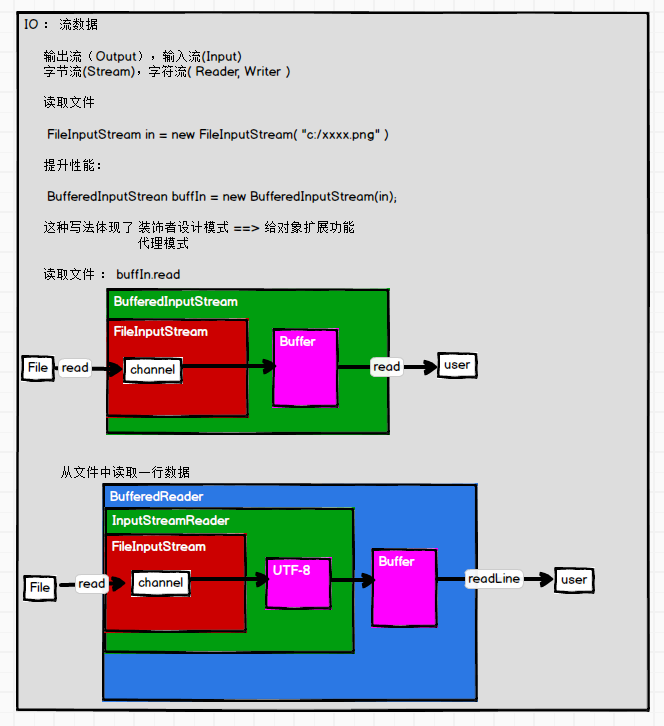


# 概述

- RDD
  - Resilient Distributed Dataset
  - 弹性分布式==数据集==
  - Spark中最基本的数据抽象，不是数据的实体
  - 代码中是一个抽象类，代表一个不可变、可分区、里面的元素可并行计算的集合
    - RDD一旦创建好数据不可用变化，只能生成新的RDD
    - 数据热点，通过分区解决

- 体现了装饰者模式
  - 算子
    - 问题（开始=> operator => 中间转换 => operator => 解决）
    - operator
    - 操作

- ==移动数据不如移动计算==
  - 提升性能
  - 如果移动数据涉及到IO访问


## 属性

```scala
Internally, each RDD is characterized by five main properties:
 - A list of partitions
 - A function for computing each split
 - A list of dependencies on other RDDs
 - Optionally, a Partitioner for key-value RDDs (e.g. to say that the RDD is hash-partitioned)
 - Optionally, a list of preferred locations to compute each split on (e.g. block locations for an HDFS file)
```

- 一组分区（Partitions）
  
- 数据集的基本组成单位
  
  ```scala
  @transient private var partitions_ : Array[Partition] = null
  ```
  
-  一个计算每个分片的函数

- RDD之间的依赖关系
  
- 数据与数据之间有依赖关系，如当前数据来自于哪个数据集
  - 入参有deps表示依赖关系集
  
  ```scala
  abstract class RDD[T: ClassTag](
      @transient private var _sc: SparkContext,
      @transient private var deps: Seq[Dependency[_]]
  ) extends Serializable with Logging {
  
      // Our dependencies and partitions will be gotten by calling subclass's methods below, and will
      // be overwritten when we're checkpointed
      private var dependencies_ : Seq[Dependency[_]] = null
  ```
  
- 一个Partitioner
  - 分区器
  - RDD的分区函数
  - 如有3个分区，那么如何确定在哪个分区，分区算法，取模，散列等

- 存储存取每个分区Partition的首选位置列表
  - preferred location
    - 数据生成task在哪个executor上执行，需要发送到首选位置的节点
    - 数据所在的节点是优先位置
      - 如果资源不够，需要降级
        - 查找同一个worker，查找同一个机架


## 特点

- RDD表示只读的分区的数据集，对RDD进行改动，只能通过RDD的==转换操作==
  - 由一个RDD得到一个新的RDD
  - 新的RDD包含了从其他RDD衍生所必需的信息
- RDD之间存在依赖，RDD的执行是按照血缘关系延时计算的
  - 如果血缘关系较长，可通过持久化RDD来切断血缘关系


### 分区

- RDD==逻辑上是分区==的，每个分区的数据是抽象存在的，计算的时候会通过一个compute函数得到每个分区的数据

- 如果RDD是通过已有的文件系统构建，则compute函数是读取指定文件系统中的数据

- 如果RDD是通过其他RDD转换而来，则compute函数是执行转换逻辑将其他RDD的数据进行转换

  

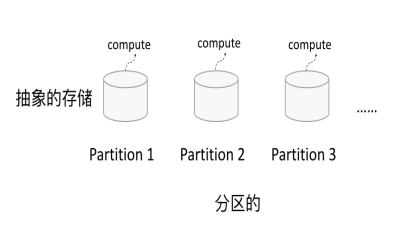

### 只读

- RDD是只读的，要想改变RDD中的数据，只能在现有的RDD基础上==创建新的RDD==
- 数据结构是固定的

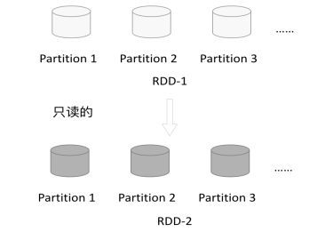

- 由一个RDD转换到另一个RDD，可以通过丰富的操作算子实现，不再像MapReduce那样只能写map和reduce


- RDD的操作算子包括两类
  - transformations
    - 将RDD进行转化
      - 构建RDD的血缘关系
  - actions
    - 触发RDD的计算
      - 得到RDD的相关计算结果或者将RDD保存的文件系统中

### 依赖

- RDDs通过操作算子进行转换，转换得到的新RDD包含了从其他RDDs衍生所必需的信息
- RDDs之间维护着这种血缘关系，也称之为依赖
- 依赖包括两种
  - 窄依赖，RDDs之间分区是一一对应的
    - 一个父RDD对应一个子RDD
      - 可以是2个父RDD对应一个子RDD
  - 宽依赖，下游RDD的每个分区与上游RDD(父RDD)的每个分区都有关，是多对多的关系
    - 一个父对应多个子RDD


### 缓存

- 缓存在内存中

- 如果在应用程序中多次使用同一个RDD，可以将该RDD缓存起来，该RDD只有在第一次计算的时候会根据血缘关系得到分区的数据，在后续其他地方用到该RDD的时直接从缓存处取而不用再根据血缘关系计算，加速后期的重用
  - RDD-1经过一系列的转换后得到RDD-n并保存到hdfs，RDD-1在这一过程中会有个中间结果，如果将其缓存到内存，那么在随后的RDD-1转换到RDD-m这一过程中，就不会计算其之前的RDD-0了

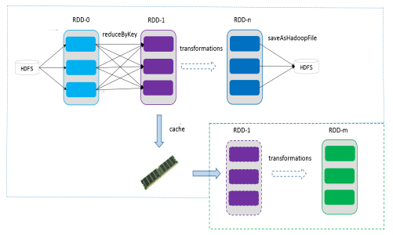

### CheckPoint

- 保存点，保存在文件中，有IO，性能降低

- 虽然RDD的血缘关系天然地可以实现容错
  - 当RDD的某个分区数据失败或丢失，可以通过血缘关系重建
- 但是对于长时间迭代型应用来说，随着迭代的进行，RDDs之间的血缘关系会越来越长，一旦在后续迭代过程中出错，则需要通过非常长的血缘关系去重建，势必影响性能
- 为此，RDD支持checkpoint将数据保存到持久化的存储中，这样就可以切断之前的血缘关系，因为checkpoint后的RDD不需要知道它的父RDDs了，可以从checkpoint处拿数据


# RDD 编程

- 操作和使用RDD

  

## 模型

- 在Spark中，RDD被表示为对象，通过对象上的方法调用来对RDD进行转换
- 经过一系列的transformations定义RDD之后，就可以调用actions触发RDD的计算，action可以是向应用程序返回结果(count, collect等)，或者是向存储系统保存数据(saveAsTextFile等)
- 注意：在Spark中，==只有到action，才依次执行RDD的计算==
  - 延迟计算
  - 懒执行
  - lazy
  - 在运行时可以通过管道的方式传输多个转换
- 要使用Spark，开发者需要编写一个Driver程序，它被提交到集群以调度运行Worker
- Driver中定义了一个或多个RDD，并调用RDD上的action
  - 在main中==创建了SparkContext对象==就是Driver类
- Worker执行RDD分区计算任务
  - 将结果返回给Driver进行汇总


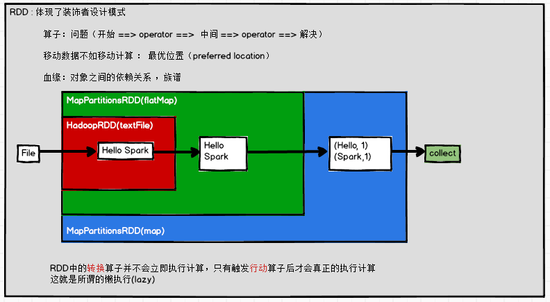

- 通过查看flatMap源码，在MapPartitionsRDD的构造方法中传入this

```scala
/**
   *  Return a new RDD by first applying a function to all elements of this
   *  RDD, and then flattening the results.
   */
def flatMap[U: ClassTag](f: T => TraversableOnce[U]): RDD[U] = withScope {
    val cleanF = sc.clean(f)
    new MapPartitionsRDD[U, T](this, (context, pid, iter) => iter.flatMap(cleanF))
}
```

- 关于懒执行

```scala
scala> sc.textFile("xxx.txt")
// 此时没有报错，还没有执行具体的操作
res1: org.apache.spark.rdd.RDD[String] = xxx.txt MapPartitionsRDD[1] at textFile at <console>:25

scala> res1.collect
// 执行action算子的时候操作后报错
org.apache.hadoop.mapred.InvalidInputException: Input path does not exist: file:/opt/module/spark/xxx.txt
at org.apache.hadoop.mapred.FileInputFormat.singleThreadedListStatus(FileInputFormat.java:287)
at org.apache.hadoop.mapred.FileInputFormat.listStatus(FileInputFormat.java:229)
...
// 执行flatMap和map也不会报错
scala> res1.flatMap(_.split(" ")).map((_,1))
res5: org.apache.spark.rdd.RDD[(String, Int)] = MapPartitionsRDD[7] at map at <console>:27
```


## RDD 创建算子

- 在Spark中创建RDD的创建方式可以分为三种
  - 从集合中创建RDD
  - 从外部存储创建RDD
  - 从其他RDD创建


### 从集合中创建


#### parallelize

```scala
scala> sc.parallelize(1 to 10)
res6: org.apache.spark.rdd.RDD[Int] = ParallelCollectionRDD[8] at parallelize at <console>:25

scala> sc.parallelize(Array(1,2,3,4,5,6))
res7: org.apache.spark.rdd.RDD[Int] = ParallelCollectionRDD[9] at parallelize at <console>:25
```

- 在sparkContext.scala中查看源码
  - 直接返回ParallelCollectionRDD对象

```scala
/** Distribute a local Scala collection to form an RDD.
   *
   * @note Parallelize acts lazily. If `seq` is a mutable collection and is altered after the call
   * to parallelize and before the first action on the RDD, the resultant RDD will reflect the
   * modified collection. Pass a copy of the argument to avoid this.
   * @note avoid using `parallelize(Seq())` to create an empty `RDD`. Consider `emptyRDD` for an
   * RDD with no partitions, or `parallelize(Seq[T]())` for an RDD of `T` with empty partitions.
   */
def parallelize[T: ClassTag](
    seq: Seq[T],
    numSlices: Int = defaultParallelism): RDD[T] = withScope {
    assertNotStopped()
    new ParallelCollectionRDD[T](this, seq, numSlices, Map[Int, Seq[String]]())
}
```


#### makeRDD

- 调用parallelize，说明makeRDD与parallelize是相同的

```scala
/** Distribute a local Scala collection to form an RDD.
   *
   * This method is identical to `parallelize`.
   */
def makeRDD[T: ClassTag](
    seq: Seq[T],
    numSlices: Int = defaultParallelism): RDD[T] = withScope {
    parallelize(seq, numSlices)
}
```


#### 并行度分区分析

- 在parallelize方法中有`numSlices: Int = defaultParallelism` 设置并行度
  - 从配置`spark.default.parallelism`取得参数，没有配置使用默认值
    - 默认值从totalCoreCount的读取和2的最大值
      - totalCoreCount 默认是1，从local[...]中读取

```scala
// SparkContext.scala
def defaultParallelism: Int = {
    assertNotStopped()
    taskScheduler.defaultParallelism
}
// TaskScheduler.scala
def defaultParallelism(): Int

// 查看TaskScheduler的实现类TaskSchedulerImpl
override def defaultParallelism(): Int = backend.defaultParallelism()

// SchedulerBackend.scala
def defaultParallelism(): Int

// 找到SchedulerBackend的实现类CoarseGrainedSchedulerBackend
override def defaultParallelism(): Int = {
    // getInt ,如果没有设置值，使用后面的默认值
   conf.getInt("spark.default.parallelism",math.max(totalCoreCount.get(), 2))
}
```


### 从外部存储创建

- 包括本地的文件系统，还有所有Hadoop支持的数据集，比如HDFS、Cassandra、HBase等

```scala
scala> val rdd2= sc.textFile("hdfs://hadoop102:9000/RELEASE")
rdd2: org.apache.spark.rdd.RDD[String] = hdfs:// hadoop102:9000/RELEASE MapPartitionsRDD[4] at textFile at <console>:24
```


#### 分区值分析

- 从textFile中有默认值minPartitions的配置
  - 默认defaultMinPartitions
    - 取得defaultParallelism并行度和2的最小值

```scala
// SparkContext.scala
def textFile(
    path: String,
    minPartitions: Int = defaultMinPartitions): RDD[String] = withScope {
    assertNotStopped()
    hadoopFile(path, classOf[TextInputFormat], classOf[LongWritable], classOf[Text],
               minPartitions).map(pair => pair._2.toString).setName(path)
}

// 与并行度有关
def defaultMinPartitions: Int = math.min(defaultParallelism, 2)
```


## RDD 转换算子（重点）

RDD整体上分为Value类型和Key-Value类型


### value类型


#### map

- map(func)

- 返回一个新的RDD，该RDD由每一个输入元素经过func函数转换后组成

- 需求：创建一个1-10数组的RDD，将所有元素*2形成新的RDD

```scala
scala> sc.makeRDD(1 to 10).map(x=>x*2).collect
res0: Array[Int] = Array(2, 4, 6, 8, 10, 12, 14, 16, 18, 20)

scala> val re = sc.makeRDD(1 to 10).map(_*2)
re: org.apache.spark.rdd.RDD[Int] = MapPartitionsRDD[3] at map at <console>:24

scala> re.collect()
res1: Array[Int] = Array(2, 4, 6, 8, 10, 12, 14, 16, 18, 20)
```


#### mapPartitions

- mapPartitions(func)

- 类似于map，但独立地在RDD的每一个分片上运行
- 在类型为T的RDD上运行时，func的函数类型必须是Iterator[T] => Iterator[U]
- 假设有N个元素，有M个分区
  - map的函数的将被调用N次
  - mapPartitions被调用M次，一个函数一次处理所有分区

- 需求：创建一个RDD，使每个元素*2组成新的RDD

```scala
scala> sc.makeRDD(1 to 10).mapPartitions(x=>x.map(_*2)).collect
res2: Array[Int] = Array(2, 4, 6, 8, 10, 12, 14, 16, 18, 20)
```


#### map与mapPartitions的区别

- map()
  - 每次处理一条数据
- mapPartitions()
  - 每次处理一个分区的数据，这个分区的数据处理完后，原RDD中分区的数据才能释放，可能导致OOM

- 开发指导：当内存空间较大的时候建议使用mapPartition()，以提高处理效率


#### mapPartitionsWithIndex

- mapPartitionsWithIndex(func)

- 类似于mapPartitions，但func带有一个整数参数表示分片的索引值
- 在类型为T的RDD上运行时，func的函数类型必须是(Int, Interator[T]) => Iterator[U]

```scala
def mapPartitionsWithIndex[U: ClassTag](
    f: (Int, Iterator[T]) => Iterator[U],
    preservesPartitioning: Boolean = false): RDD[U] = withScope {
```

- 使用场景，需要对每个分区内部进行统计或者计算

- 需求：创建一个RDD，使每个元素跟所在分区形成一个元组组成一个新的RDD

```scala
scala> sc.makeRDD(1 to 10).mapPartitionsWithIndex((index,items)=>items.map(v=>(index,v))).collect
res5: Array[(Int, Int)] = Array((0,1), (1,2), (2,3), (3,4), (3,5), (4,6), (5,7), (6,8), (7,9), (7,10))

// 注意这里index和items不能省略，可省略的前提是可以推断出来
scala> sc.makeRDD(1 to 10,2).mapPartitionsWithIndex((index,items)=>items.map((index,_))).collect
res6: Array[(Int, Int)] = Array((0,1), (0,2), (0,3), (0,4), (0,5), (1,6), (1,7), (1,8), (1,9), (1,10))
```

- 注意默认逻辑分区是8
  - `Spark context available as 'sc' (master = local[*], app id = local-1572459943426).`
  - 使用的是local[*]，在makeRDD中，当前环境是8核>2
- 查看执行的job情况
  - 2个分区就是2个task

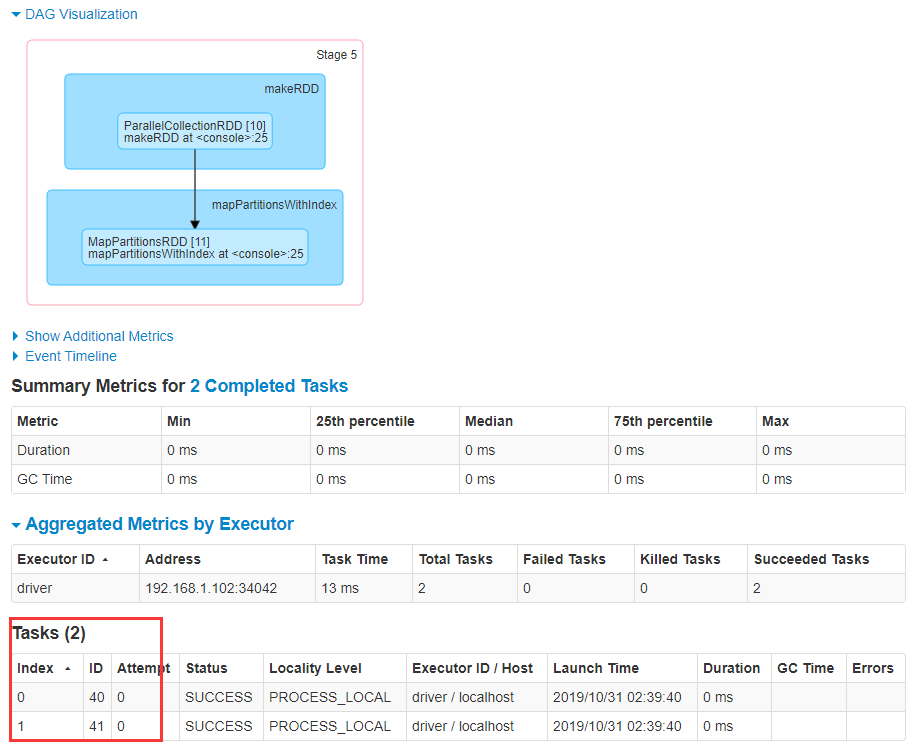


- 分析map，mapPartition和mapPartitionWithIndex的操作过程


#### flatMap

- flatMap(func)
- 类似于map，每一个输入元素可以被映射为0或多个输出元素
- func应该返回一个序列，而不是单一元素
  - TraversableOnce返回值需要是可迭代类型

```scala
def flatMap[U: ClassTag](f: T => TraversableOnce[U]): RDD[U] = withScope {
    val cleanF = sc.clean(f)
    new MapPartitionsRDD[U, T](this, (context, pid, iter) => iter.flatMap(cleanF))
}
```

- 示例
  - 返回值是一个字符串，而字符串是可迭代的类型

```scala
scala> sc.makeRDD(1 to 6).flatMap(_.toString).collect
res10: Array[Char] = Array(1, 2, 3, 4, 5, 6)
```

- 需求
  - 创建一个元素为1-5的RDD，运用flatMap创建一个新的RDD

```scala
scala> sc.makeRDD(1 to 5).flatMap(1 to _).collect
res18: Array[Int] = Array(1, 1, 2, 1, 2, 3, 1, 2, 3, 4, 1, 2, 3, 4, 5)
```


#### glom

- 将==每一个分区形成一个数组==，形成新的RDD类型时RDD[Array[T]]

- 需求
  - 创建一个4个分区的RDD，并将每个分区的数据放到一个数组
  - 将每个分区的数据放到一个数组并收集到Driver端打印

```scala
scala> sc.makeRDD(1 to 16,4).glom.collect
res19: Array[Array[Int]] = Array(Array(1, 2, 3, 4), Array(5, 6, 7, 8), Array(9, 10, 11, 12), Array(13, 14, 15, 16))
```

- 应用：计算最大值
  - 先将分区内的数据进行求最大值，再计算最终的最大值
  - 好处：减少shuffle过程中的数据传输，提高效率

```scala
scala> sc.makeRDD(1 to 4,2).glom.map(items=>items.max).reduce(_.max(_))
res5: Int = 4
```


#### groupBy

- groupBy(func)
- 有shuffle过程

- 分组，按照传入函数的返回值进行分组
- 将相同的key对应的值放入一个迭代器

- 需求
  - 创建一个RDD，按照元素模以2的值进行分

```scala
scala> sc.makeRDD(1 to 4).groupBy(_%2).collect
res0: Array[(Int, Iterable[Int])] = Array((0,CompactBuffer(2, 4)), (1,CompactBuffer(1, 3)))
```

- 示例

```scala
scala> sc.makeRDD(Array("abc","def","aaa")).groupBy(_.contains("a")).collect
res8: Array[(Boolean, Iterable[String])] = Array((false,CompactBuffer(def)), (true,CompactBuffer(abc, aaa)))
```


#### filter

- filter(func)

- 过滤
- 返回一个新的RDD，该RDD由经过func函数计算后返回值为true的输入元素组成。

- 需求
  - 创建一个RDD（由字符串组成），过滤出一个新RDD（包含”x”子串）

```scala
scala> sc.makeRDD(Array("xyz","abc","xxx","ttt")).filter(_.contains("x")).collect
res3: Array[String] = Array(xyz, xxx)
```


#### sample

- sample(withReplacement,fraction,seed)

```scala
def sample(
    withReplacement: Boolean,
    fraction: Double,
    seed: Long = Utils.random.nextLong): RDD[T] = {
    require(fraction >= 0, s"Fraction must be nonnegative, but got ${fraction}")
    withScope {
        require(fraction >= 0.0, "Negative fraction value: " + fraction)
        if (withReplacement) {
            new PartitionwiseSampledRDD[T, T](this, new PoissonSampler[T](fraction), true, seed)
        } else {
            // fraction 表示抽取出的概率
            new PartitionwiseSampledRDD[T, T](this, new BernoulliSampler[T](fraction), true, seed)
        }
    }
}
```

- 以指定的随机种子随机抽样出数量为fraction的数据
  - withReplacement表示是抽出的数据是否放回
    - true为有放回的抽样
      - 泊松抽样
    - false为无放回的抽样
      - 伯努利抽样
  - seed用于指定随机数生成器种子
- 需求：创建一个RDD（1-10），从中选择放回和不放回抽样

```scala
scala> var rdd = sc.makeRDD(1 to 10)
rdd: org.apache.spark.rdd.RDD[Int] = ParallelCollectionRDD[19] at makeRDD at <console>:24
// 0.4 表示40%的概率可以抽取出来
scala> rdd.sample(false,0.4,5).collect
res9: Array[Int] = Array(10)

scala> rdd.sample(false,0.4,3).collect
res10: Array[Int] = Array(1, 4, 10)

scala> rdd.sample(false,0,3).collect
res12: Array[Int] = Array()

scala> rdd.sample(false,1,3).collect
res13: Array[Int] = Array(1, 2, 3, 4, 5, 6, 7, 8, 9, 10)

// 真正随机需要种子是变化的
scala> rdd.sample(false,0.4,System.currentTimeMillis).collect
```

```scala
scala> rdd.sample(true,3,3).collect
res15: Array[Int] = Array(1, 2, 3, 4, 4, 4, 5, 5, 5, 5, 5, 6, 6, 6, 6, 7, 7, 7, 8, 8, 9, 9, 9, 9, 9, 10, 10, 10, 10, 10)
```

- 关于种子

```scala
// 随机算法简化公式，每次计算的结果作为下一个seed
X(seed)*10000.hashCode.toString.getMiddleChar().toInt()
=> 5*10000.hashCode.toString.getMiddleChar().toInt()
=> 9*10000.hashCode.toString.getMiddleChar().toInt()
=> 7*10000.hashCode.toString.getMiddleChar().toInt()
```

- 应用
  - 解决数据热点问题，对数据进行抽样，判断哪个key数据倾斜，然后将key打散（key添加随机数，散列算法等）
  - 需要多次采样进行判断


#### distinct

- distinct([numTasks])
  - 调用无参方法，并行度与Map阶段相同

```scala
def distinct(numPartitions: Int)(implicit ord: Ordering[T] = null): RDD[T] = withScope {
    // reduceByKey对相同的key的item进行折叠
    map(x => (x, null)).reduceByKey((x, y) => x, numPartitions).map(_._1)
}

def distinct(): RDD[T] = withScope {
    distinct(partitions.length)
}
```

- 对源RDD进行去重后返回一个新的RDD
- 有shuffle过程
- 默认情况下，只有8个并行任务来操作
  - 可传入一个可选的numTasks参数改变
- 需求：创建一个RDD，使用distinct()对其去重

```scala
scala> sc.makeRDD(Array(6,2,1,3,4,5,3,5,2,1)).distinct().collect
res22: Array[Int] = Array(1, 2, 3, 4, 5, 6)
```

- 示例分析

```scala
scala> var rdd = sc.makeRDD(List(4,3,1,2,2,3,4,5,5),2)
rdd: org.apache.spark.rdd.RDD[Int] = ParallelCollectionRDD[54] at makeRDD at <console>:24

scala> rdd.distinct.collect
res26: Array[Int] = Array(4, 2, 1, 3, 5)

scala> rdd.glom.collect
res27: Array[Array[Int]] = Array(Array(4, 3, 1, 2), Array(2, 3, 4, 5, 5))
// shuffle过程，有分区重组的情况
scala> rdd.distinct.glom.collect
res28: Array[Array[Int]] = Array(Array(4, 2), Array(1, 3, 5))
```


- 分为2个stage


#### coalesce

- coalesce(numPartitions)
- 合并

- 缩减分区数，用于大数据集过滤后，提高小数据集的执行效率
  - 将分区进行了合并，没有打乱分区内部元素，没有shuffle过程

- 需求：创建一个4个分区的RDD，对其缩减分区

```scala
scala> var rdd = sc.makeRDD((1 to 16),4)
rdd: org.apache.spark.rdd.RDD[Int] = ParallelCollectionRDD[63] at makeRDD at <console>:24

scala> rdd.glom.collect
res29: Array[Array[Int]] = Array(Array(1, 2, 3, 4), Array(5, 6, 7, 8), Array(9, 10, 11, 12), Array(13, 14, 15, 16))

scala> rdd.partitions.size
res30: Int = 4

scala> var rdd2 = rdd.coalesce(3)
rdd2: org.apache.spark.rdd.RDD[Int] = CoalescedRDD[65] at coalesce at <console>:26
// 最后2个分区进行了合并
scala> rdd2.glom.collect
res31: Array[Array[Int]] = Array(Array(1, 2, 3, 4), Array(5, 6, 7, 8), Array(9, 10, 11, 12, 13, 14, 15, 16))
```


#### repartition

- repartition(numPartitions)

- 分配，重新分区
- 根据分区数，重新通过网络随机洗牌所有数据
- 有shuffle过程
- 对coalesce示例进行repartition操作

```scala
scala> var rdd3 = rdd.repartition(3)
rdd3: org.apache.spark.rdd.RDD[Int] = MapPartitionsRDD[70] at repartition at <console>:26

scala> rdd3.glom.collect
res32: Array[Array[Int]] = Array(Array(3, 7, 10, 13, 16), Array(1, 4, 5, 8, 11, 14), Array(2, 6, 9, 12, 15))
```


- 有shuffle过程就有2个阶段


#### coalesce与repartition 的关系

- coalesce重新分区，可选择是否进行shuffle过程
  - 由参数shuffle: Boolean 决定

- repartition实际上是调用的coalesce
  - 默认是进行shuffle的

```scala
def repartition(numPartitions: Int)(implicit ord: Ordering[T] = null): RDD[T] = withScope {
    coalesce(numPartitions, shuffle = true)
}

def coalesce(numPartitions: Int, shuffle: Boolean = false,
             partitionCoalescer: Option[PartitionCoalescer] = Option.empty)
(implicit ord: Ordering[T] = null)
: RDD[T] = withScope {
```


#### sortBy

- sortBy(func,[ascending], [numTasks])

- 使用func先对数据进行处理，按照处理后的数据比较结果排序
- 默认为正序 asc

```scala
def sortBy[K](
    f: (T) => K,
    // 默认升序
    ascending: Boolean = true,
    // 同上一个阶段的分区数
    numPartitions: Int = this.partitions.length)
(implicit ord: Ordering[K], ctag: ClassTag[K]): RDD[T] = withScope {
    this.keyBy[K](f)
    .sortByKey(ascending, numPartitions)
    .values
}
```

- 需求：创建一个RDD，按照不同的规则进行排序

```scala
scala> var rdd = sc.makeRDD(List(2,51,22,4,6,1))
rdd: org.apache.spark.rdd.RDD[Int] = ParallelCollectionRDD[72] at makeRDD at <console>:24

scala> rdd.sortBy(x=>x).collect
res33: Array[Int] = Array(1, 2, 4, 6, 22, 51)
// 依据计算结果，对之前的数据进行排序
scala> rdd.sortBy(x=>(-1*x)).collect
res34: Array[Int] = Array(51, 22, 6, 4, 2, 1)
// 指定排序规则
scala> rdd.sortBy(_.toString).collect
res35: Array[Int] = Array(1, 2, 22, 4, 51, 6)
```


#### pipe

- 管道
- ==针对每个分区==执行一个shell脚本，返回输出的RDD
- ==注意：脚本需要放在Worker节点可以访问到的位置==
- 需求：编写一个脚本，使用管道将脚本作用于RDD上
- 脚本
  - 注意设置权限

```shell
#!/bin/sh
echo "AA"
while read LINE; do
   echo ">>>"${LINE}
done
```

```scala
scala> var rdd=sc.makeRDD(List("aa","bb","cc"),2)
rdd: org.apache.spark.rdd.RDD[String] = ParallelCollectionRDD[92] at makeRDD at <console>:24

scala> rdd.pipe("/opt/software/s.sh").collect
res39: Array[String] = Array(AA, >>>aa, AA, >>>bb, >>>cc)
```


### 双value类型


#### union

- union(otherDataset)
- 并集

- 对源RDD和参数RDD求并集后返回一个新的RDD
- 合并分区，不做任何更改，没有shuffle

- 需求：创建两个RDD，求并集

```scala
scala> var rdd1 = sc.makeRDD(1 to 5,2)
rdd1: org.apache.spark.rdd.RDD[Int] = ParallelCollectionRDD[98] at makeRDD at <console>:24

scala> var rdd2 = sc.makeRDD(5 to 10,2)
rdd2: org.apache.spark.rdd.RDD[Int] = ParallelCollectionRDD[99] at makeRDD at <console>:24

scala> rdd1.glom.collect
res42: Array[Array[Int]] = Array(Array(1, 2), Array(3, 4, 5))

scala> rdd2.glom.collect
res43: Array[Array[Int]] = Array(Array(5, 6, 7), Array(8, 9, 10))

scala> rdd1.union(rdd2).collect
res44: Array[Int] = Array(1, 2, 3, 4, 5, 5, 6, 7, 8, 9, 10)

scala> rdd1.union(rdd2).glom.collect
res45: Array[Array[Int]] = Array(Array(1, 2), Array(3, 4, 5), Array(5, 6, 7), Array(8, 9, 10))
```

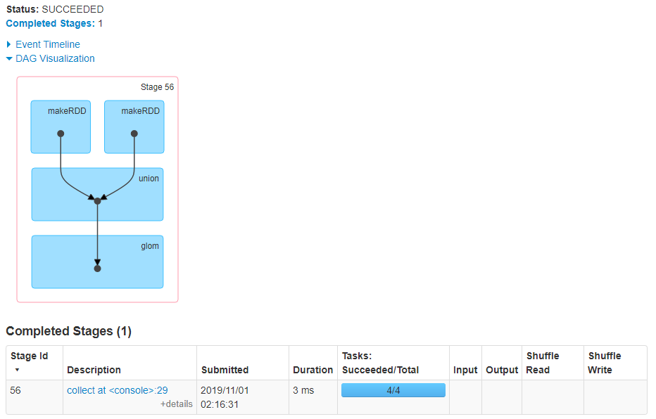


#### subtract

- substract(otherDataset)
- 差集

- 计算差的一种函数，去除两个RDD中相同的元素，不同的RDD将保留下来
- 有shuffle过程

- 需求：创建两个RDD，求第一个RDD与第二个RDD的差集

```scala
// 去除rdd1中与rdd2相同的部分
scala> rdd1.subtract(rdd2).glom.collect
res48: Array[Array[Int]] = Array(Array(2, 4), Array(1, 3))
```

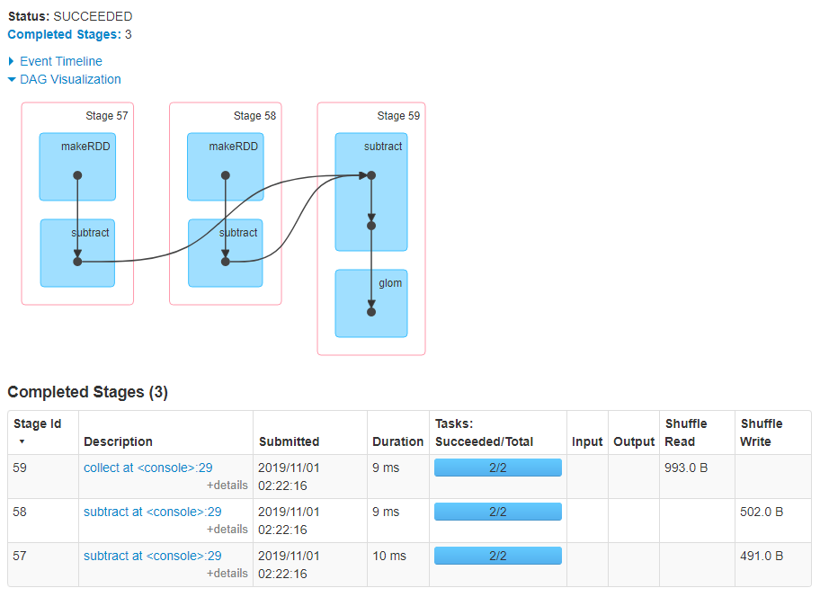


#### intersection

- subtract (otherDataset)

- 交集
- 对源RDD和参数RDD求交集后返回一个新的RDD
- 有shuffle过程
- 需求：创建两个RDD，求两个RDD的交集

```scala
scala> rdd1.intersection(rdd2).glom.collect
res49: Array[Array[Int]] = Array(Array(), Array(5))
```

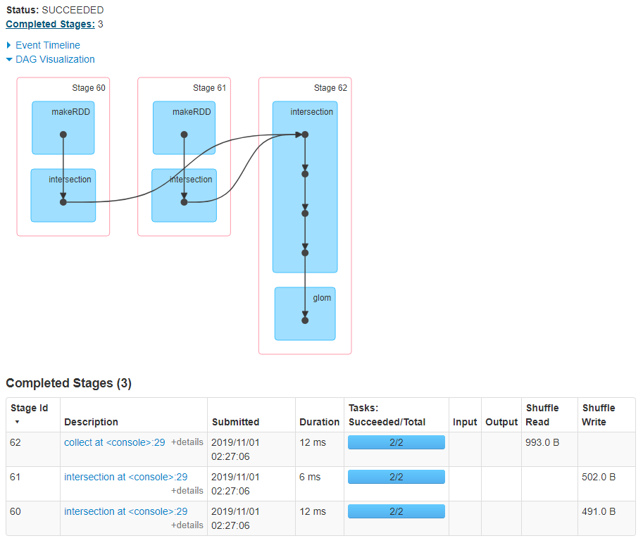


#### cartesian

- cartesian(otherDataset)

- 笛卡尔积
- ==尽量避免使用==
- 需求：创建两个RDD，计算两个RDD的笛卡尔积

```scala
scala> var rdd1 = sc.makeRDD(1 to 2)
rdd1: org.apache.spark.rdd.RDD[Int] = ParallelCollectionRDD[117] at makeRDD at <console>:24

scala> var rdd2 = sc.makeRDD(3 to 5)
rdd2: org.apache.spark.rdd.RDD[Int] = ParallelCollectionRDD[118] at makeRDD at <console>:24

scala> rdd1.cartesian(rdd2).collect
res50: Array[(Int, Int)] = Array((1,3), (1,4), (1,5), (2,3), (2,4), (2,5))
```

- 一般先筛选，再做关联


#### zip

- zip(otherDataset)

- 拉链

- 将两个RDD组合成Key/Value形式的RDD

- ==要求2个RDD的元素个数一致，分区个数一致，否则有异常==

  - java.lang.IllegalArgumentException: Can't zip RDDs with unequal numbers of partitions: List(3, 2)

  - scala中的zip没有元素个数一致的要求

- 需求：创建两个RDD，并将两个RDD组合到一起形成一个(k,v)RDD

```scala
scala> var rdd1 = sc.makeRDD(Array(1,2,3),2)
rdd1: org.apache.spark.rdd.RDD[Int] = ParallelCollectionRDD[120] at makeRDD at <console>:24

scala> var rdd2 = sc.makeRDD(Array("a","b","c"),2)
rdd2: org.apache.spark.rdd.RDD[String] = ParallelCollectionRDD[121] at makeRDD at <console>:24

scala> rdd1.zip(rdd2).collect
res51: Array[(Int, String)] = Array((1,a), (2,b), (3,c))
```


### key-value类型


#### partitionBy

- 对pairRDD进行分区操作
- 如果原有的partionRDD和现有的partionRDD是一致则不进行分区， 否则会生成ShuffleRDD
- 产生shuffle过程

```scala
//PairRDDFunctions.scala
def partitionBy(partitioner: Partitioner): RDD[(K, V)] = self.withScope {
    if (keyClass.isArray && partitioner.isInstanceOf[HashPartitioner]) {
        throw new SparkException("HashPartitioner cannot partition array keys.")
    }
    if (self.partitioner == Some(partitioner)) {
        // 如果分区器是自己的分区器，则返回自己
        self
    } else {
        // 新的分区器，进行shuffle转换
        new ShuffledRDD[K, V, V](self, partitioner)
    }
}
```

- 需求：创建一个4个分区的RDD，对其重新分区

```scala
scala> var rdd = sc.makeRDD(Array((1,"a"),(2,"b"),(3,"c"),(4,"d")),4)
rdd: org.apache.spark.rdd.RDD[(Int, String)] = ParallelCollectionRDD[123] at makeRDD at <console>:24

scala> rdd.glom.collect
res52: Array[Array[(Int, String)]] = Array(Array((1,a)), Array((2,b)), Array((3,c)), Array((4,d)))

scala> var rdd2 = rdd.partitionBy(new org.apache.spark.HashPartitioner(2))
rdd2: org.apache.spark.rdd.RDD[(Int, String)] = ShuffledRDD[126] at partitionBy at <console>:26

scala> rdd2.glom.collect
res54: Array[Array[(Int, String)]] = Array(Array((2,b), (4,d)), Array((1,a), (3,c)))

scala> rdd2.partitioner
res55: Option[org.apache.spark.Partitioner] = Some(org.apache.spark.HashPartitioner@2)

// 使用自身的分区器
scala> var rdd3 = rdd2.partitionBy(rdd2.partitioner.get)
rdd3: org.apache.spark.rdd.RDD[(Int, String)] = ShuffledRDD[126] at partitionBy at <console>:26

scala> rdd3.glom.collect
res56: Array[Array[(Int, String)]] = Array(Array((2,b), (4,d)), Array((1,a), (3,c)))
```


#### groupByKey

- 对每个key进行操作，只生成一个sequence
- 有shuffle过程

- 需求：创建一个pairRDD，将相同key对应值聚合到一个sequence中，并计算相同key对应值的相加结果

```scala
scala> var rdd = sc.makeRDD(Array((1,"a"),(1,"b"),(3,"c"),(4,"d")),4)
rdd: org.apache.spark.rdd.RDD[(Int, String)] = ParallelCollectionRDD[129] at makeRDD at <console>:24

scala> rdd.groupByKey().collect
res57: Array[(Int, Iterable[String])] = Array((4,CompactBuffer(d)), (1,CompactBuffer(a, b)), (3,CompactBuffer(c)))
```

- 统计单词

```scala
scala> var rdd = sc.makeRDD(Array("aa","bb","cc","aa"))
rdd: org.apache.spark.rdd.RDD[String] = ParallelCollectionRDD[131] at makeRDD at <console>:24

scala> rdd.map((_,1)).groupByKey().map(item=>(item._1,item._2.sum)).collect
res59: Array[(String, Int)] = Array((aa,2), (bb,1), (cc,1))
```


#### reduceByKey

- reduceByKey(func, [numTasks])

- 在一个(K,V)的RDD上调用，返回一个(K,V)的RDD，使用指定的reduce函数，将相同key的值聚合到一起
- reduce任务的个数可以通过第二个可选的参数来设置。
- 需求：创建一个pairRDD，计算相同key对应值的相加结果

```scala
scala> val rdd = sc.parallelize(List(("female",1),("male",5),("female",5),("male",2)))
rdd: org.apache.spark.rdd.RDD[(String, Int)] = ParallelCollectionRDD[135] at parallelize at <console>:24

scala> rdd.reduceByKey(_ + _).collect
res60: Array[(String, Int)] = Array((female,6), (male,7))
```


#### groupByKey和reduceByKey的区别

- reduceByKey
  - 按照key进行聚合，在shuffle之前有==combine（预聚合）==操作，返回结果是RDD[k,v]

- groupByKey
  - 按照key进行分组，直接进行shuffle

- 开发指导
  - 建议使用reduceByKey
  - 需要注意是否会影响业务逻辑


#### aggregateByKey

```scala
// 初始值类型是U，相同key聚合的元素类型是V，U和V可以使同样的类型，但是输出必须是U类型
def aggregateByKey[U: ClassTag](zeroValue: U)(seqOp: (U, V) => U, combOp: (U, U) => U): RDD[(K, U)] = self.withScope {
    aggregateByKey(zeroValue, defaultPartitioner(self))(seqOp, combOp)
}
```

- 在kv对的RDD中，按key将value进行分组合并，合并时，将每个value和初始值作为seq函数的参数，进行计算，返回的结果作为一个新的kv对，然后再将结果按照key进行合并，最后将每个分组的value传递给combine函数进行计算（先将前两个value进行计算，将返回结果和下一个value传给combine函数，以此类推），将key与计算结果作为一个新的kv对输出。
- 参数
  - zeroValue
    - 初始值
    - 分区内相同key进行聚合第一次操作使用
  - seqOp
    - 分区内聚合函数
    - 函数用于在每一个分区中用初始值逐步迭代value
  - combOp
    - 分区间聚合函数
    - 函数用于合并每个分区中的结果
- 需求
  - 创建一个pairRDD，取出每个分区相同key对应值的最大值，然后相加

```scala
scala> var rdd = sc.parallelize(List(("a",3),("a",2),("c",4),("b",3),("c",6),("c",8)),2)

scala> rdd.aggregateByKey(0)((v1,v2)=>v1.max(v2),(v1,v2)=>v1+v2).collect
res63: Array[(String, Int)] = Array((b,3), (a,3), (c,12))

// 写法同上
scala> rdd.aggregateByKey(0)(_ max _,_ + _).collect
```

- 分析

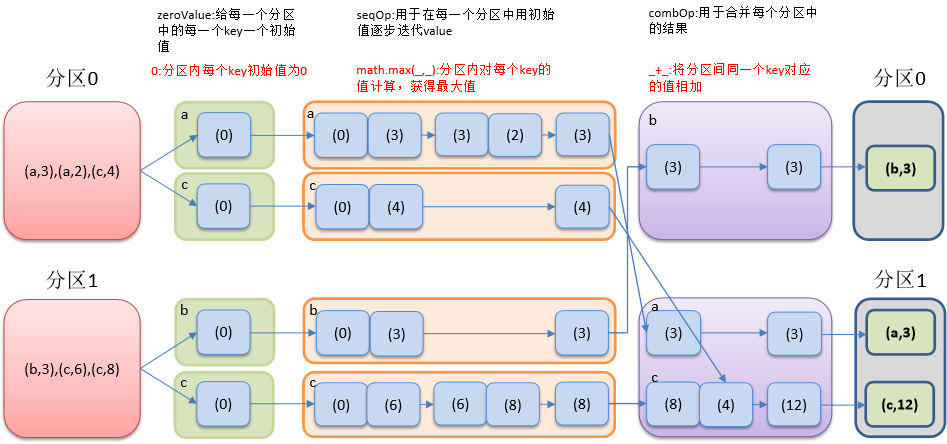


#### foldByKey

```scala
def foldByKey(
    zeroValue: V,
    partitioner: Partitioner)(func: (V, V) => V): RDD[(K, V)] = self.withScope {
	...
    val cleanedFunc = self.context.clean(func)
    combineByKeyWithClassTag[V]((v: V) => cleanedFunc(createZero(), v),cleanedFunc, cleanedFunc, partitioner)
}

def aggregateByKey[U: ClassTag](zeroValue: U, partitioner: Partitioner)(seqOp: (U, V) => U,combOp: (U, U) => U): RDD[(K, U)] = self.withScope {
    ...
    val cleanedSeqOp = self.context.clean(seqOp)
    combineByKeyWithClassTag[U]((v: V) => cleanedSeqOp(createZero(), v),           cleanedSeqOp, combOp, partitioner)
}

// foldByKey和aggregateByKey 都调用了combineByKeyWithClassTag 注意传入的参数，foldByKey传入的都是cleanedFunc ，而aggregateByKey传入了cleanedSeqOp和combOp
// foldByKey是aggregateByKey的简化操作，seqop和combop相同
```

- 需求：创建一个pairRDD，计算相同key对应值的相加结果

```scala
scala> var rdd = sc.parallelize(List((1,3),(1,2),(1,4),(2,3),(3,6),(3,8)),3)
rdd: org.apache.spark.rdd.RDD[(Int, Int)] = ParallelCollectionRDD[140] at parallelize at <console>:24

scala> rdd.foldByKey(0)(_ + _).collect
res65: Array[(Int, Int)] = Array((3,14), (1,9), (2,3))

// 等价于
rdd.combineByKey(x=>x,(x:Int,y:Int)=>x+y,(x:Int,y:Int)=>x+y).collect
```


#### combineByKey

```scala
def combineByKey[C](
    createCombiner: V => C, // 第一次调用，将key的第一个value作为入参，得到结果C
    mergeValue: (C, V) => C, // 转换后C和key的第二个value进行聚合处理
    mergeCombiners: (C, C) => C): RDD[(K, C)] = self.withScope {
    combineByKeyWithClassTag(createCombiner, mergeValue, mergeCombiners)(null)
}
```

- ==combineByKey 是 foldByKey 与 aggregateByKey 操作的全集==

- 对相同K，把V合并成一个集合
- 参数
  - createCombiner
    - ==分区内key的第一个value走该方法==，生成初始值
  - mergeValue
    - 如果这是一个在处理当前分区之前已经遇到的键，它会使用mergeValue()方法将该键的累加器对应的当前值与这个新的值进行合并
    - 类似于分区内聚合函数
  - mergeCombiners
    - 分区间聚合函数
    - 由于每个分区都是独立处理的， 因此对于同一个键可以有多个累加器
    - 如果有两个或者更多的分区都有对应同一个键的累加器， 就需要使用用户提供的 mergeCombiners() 方法将各个分区的结果进行合并
- 需求
  - 创建一个pairRDD，根据key计算每种key的均值
  - 思路：先计算每个key出现的次数以及对应值的总和，再相除得到结果
  - ==注意，需要添加入参的元素类型，此处scala推断不出来==

```scala
scala> var input = sc.parallelize(Array(("a", 88), ("b", 95), ("a", 91), ("b", 93), ("a", 95), ("b", 98)),2)

scala> input.combineByKey(v=>(v,1),(v1:(Int,Int),v2)=>(v1._1+v2,v1._2+1),(v1:(Int,Int),v2:(Int,Int))=>(v1._1+v2._1,v1._2+v2._2)).collect

res75: Array[(String, (Int, Int))] = Array((b,(286,3)), (a,(274,3)))

scala> input.combineByKey(v=>(v,1),(v1:(Int,Int),v2)=>(v1._1+v2,v1._2+1),(v1:(Int,Int),v2:(Int,Int))=>(v1._1+v2._1,v1._2+v2._2)).map{case (k,v)=>(k,v._1/v._2)}.collect

res77: Array[(String, Int)] = Array((b,95), (a,91))

// input.combineByKey(v=>(v,1),(v1:(Int,Int),v2)=>(v1._1+v2,v1._2+1),(v1:(Int,Int),v2:(Int,Int))=>(v1._1+v2._1,v1._2+v2._2)).map(t=>(t._1,t._2._1/t._2._2)).collect
```

- 分析


#### sortByKey

- sortByKey([ascending], [numTasks])

- 在一个(K,V)的RDD上调用，K必须实现Ordered接口，返回一个按照key进行排序的(K,V)的RDD
- 需求：创建一个pairRDD，按照key的正序和倒序进行排序

```scala
val rdd = sc.parallelize(Array((3,"aa"),(6,"cc"),(2,"bb"),(1,"dd")))

scala> rdd.sortByKey(true).collect
res7: Array[(Int, String)] = Array((1,dd), (2,bb), (3,aa), (6,cc))

scala> rdd.sortByKey(false).collect
res8: Array[(Int, String)] = Array((6,cc), (3,aa), (2,bb), (1,dd))
```


#### mapValues

- 针对于(K,V)形式的类型只对V进行操作

- 需求：创建一个pairRDD，并将value添加字符串"|||"

```scala
val rdd = sc.parallelize(Array((1,"a"),(1,"d"),(2,"b"),(3,"c")))

scala> rdd.mapValues(_+"|||").collect
res9: Array[(Int, String)] = Array((1,a|||), (1,d|||), (2,b|||), (3,c|||))
```


#### join

- join(otherDataset, [numTasks])
- ==内连接==
- 在类型为(K,V)和(K,W)的2个RDD上调用，返回一个相同key对应的所有元素对在一起的(K,(V,W))的RDD
- 需求：创建两个pairRDD，并将key相同的数据聚合到一个==元组==

```scala
val rdd1 = sc.parallelize(Array((1,"a"),(2,"b"),(3,"c")))
val rdd2 = sc.parallelize(Array((1,4),(2,5),(3,6)))
val rdd3 = sc.parallelize(Array((1,4),(2,5)))

scala> rdd1.join(rdd2).collect
res13: Array[(Int, (String, Int))] = Array((1,(a,4)), (2,(b,5)), (3,(c,6)))

// 内连接
scala> rdd1.join(rdd3).collect
res14: Array[(Int, (String, Int))] = Array((1,(a,4)), (2,(b,5)))
```


#### cogroup

- cogroup(otherDataset, [numTasks])
- 共同小组，外连接
- 在类型为(K,V)和(K,W)的RDD上调用，返回一个`(K,(Iterable<V>,Iterable<W>))`类型的RDD
- 需求：创建两个pairRDD，并将key相同的数据聚合到一个==迭代器==

```scala
// 使用上一个示例的rdd
// rdd1 left join rdd3
scala> rdd1.cogroup(rdd3).collect

res15: Array[(Int, (Iterable[String], Iterable[Int]))] = Array((1,(CompactBuffer(a),CompactBuffer(4))), (2,(CompactBuffer(b),CompactBuffer(5))), (3,(CompactBuffer(c),CompactBuffer())))

// rdd1 right join rdd3
rdd3.cogroup(rdd1).collect
```


### 案例

-  数据结构
  - 时间戳，省份，城市，用户，广告，中间字段使用空格分割
  - 样本

```txt
1516609143867 6 7 64 16
1516609143869 9 4 75 18
1516609143869 1 7 87 12
```

- 需求：统计出每一个省份广告被点击次数的TOP3

```scala
package com.stt.spark

import org.apache.spark.rdd.RDD
import org.apache.spark.{SparkConf, SparkContext}

object Ch03_Practice {
    def main(args: Array[String]): Unit = {

        val conf: SparkConf = new SparkConf().setMaster("local").setAppName("Practice")
        val sc: SparkContext = new SparkContext(conf)

        val lines: RDD[String] = sc.textFile("data/spark/Ch03/input.txt")

        // 将每一行数据转换为一个元组对象((P,A),1)
        // 1516609143867 6 7 64 16 => ((6,16),1)
        val PAToOne: RDD[((String, String), Int)] = lines.map(line => {
            val words: Array[String] = line.split(" ")
            val province = words(1)
            val advertisement = words(4)
            ((province, advertisement), 1)
        })
        // 计算广告点击总个数((P,A),SUM)
        val PAToSum: RDD[((String, String), Int)] = PAToOne.reduceByKey(_+_)
        // 将((P,A),SUM) 转换为(P,(A,SUM))
        val PToASum: RDD[(String, (String, Int))] = PAToSum.map(item => {
            (item._1._1, (item._1._2, item._2))
        })
        // 对(P,(A,SUM))进行分组 => (P,[(A1,SUM1),(A2,SUM2)])
        val pGroup: RDD[(String, Iterable[(String, Int)])] = PToASum.groupByKey()
        // 对分组信息求top3
        val top3: RDD[(String, List[(String, Int)])] = pGroup.mapValues(item=>{
            item.toList.sortWith((item1,item2)=> item1._2 > item2._2).take(3)
        })
        // 对结果进行输出
        //    top3.collect.foreach(println)
        var result = top3.collect()
        result.foreach(item=>{
            item._2.map{
                case (p,sum) => println(item._1+"-"+p+"-"+sum)
            }
        })
        sc.stop()
    }
}
```


## Action 算子

- 所有的行动算子都执行runJob方法(在DAGScheduler.scala)
- runJob-->submitJob-->new ActiveJob


### reduce

- reduce(func)
- 通过func函数聚集RDD中的所有元素，先聚合分区内数据，再聚合分区间数据
- 需求：创建一个RDD，将所有元素聚合得到结果

```scala
scala> var rdd = sc.makeRDD(1 to 10)

scala> rdd.reduce(_ max _)
res16: Int = 10

scala> val rdd2 = sc.makeRDD(Array(("a",1),("a",3),("c",3),("d",5)))

scala> rdd2.reduce((x,y)=>(x._1+y._1,x._2+y._2))
res17: (String, Int) = (daac,12)
```


### collect

- 在驱动程序中，以数组的形式返回数据集的所有元素
- 需求：创建一个RDD，并将RDD内容收集到Driver端打印

```scala
scala> sc.makeRDD(1 to 10).collect
res18: Array[Int] = Array(1, 2, 3, 4, 5, 6, 7, 8, 9, 10)
```


### foreach

- foreach(func)

- 在数据集的每一个元素上，运行函数func进行更新

```scala
var rdd = sc.makeRDD(1 to 5)
rdd.foreach(println(_))

// map也可以打印,在一些不需要返回数据，只需要一些操作即可
// 如将数据插入HBase或者MySql时，不需要返回数据，可使用foreach
rdd.map(x=>{println(x);x}).collect
```

- foreachPartition
  - 将每个分区循环遍历


### count

- 返回RDD中元素的个数

```scala
scala> sc.makeRDD(1 to 4).count
res19: Long = 4
```


### countByKey

- 针对(K,V)类型的RDD，返回一个(K,Int)的map，表示每一个key对应的元素个数。
- 需求：创建一个PairRDD，统计每种key的个数

```scala
scala> val rdd = sc.parallelize(List((1,3),(1,2),(1,4),(2,3),(3,6),(3,8)),3)

scala> rdd.countByKey()
res1: scala.collection.Map[Int,Long] = Map(3 -> 2, 1 -> 3, 2 -> 1)
```


### first

- 返回RDD中的第一个元素

```scala
scala> sc.makeRDD(1 to 4).first
res23: Int = 1
```


### take

- take(n)
- 返回一个由RDD的前n个元素组成的数组

```scala
scala> sc.makeRDD(1 to 4).take(2)
res24: Array[Int] = Array(1, 2)
```


### takeOrdered

- takeOrdered(n)
- 返回该RDD排序后的前n个元素组成的数组
  - 先排序再取值

```scala
scala> sc.makeRDD(Array(9,3,2,4,5)).takeOrdered(3)
res25: Array[Int] = Array(2, 3, 4)
```


### aggregate

- 参数：(zeroValue: U)(seqOp: (U, T) ⇒ U, combOp: (U, U) ⇒ U)

- aggregate函数将每个分区里面的元素通过seqOp和初始值进行聚合，然后用combine函数将每个分区的结果和初始值(zeroValue)进行combine操作。这个函数最终返回的类型不需要和RDD中元素类型一致。

- 需求：创建一个RDD，将所有元素相加得到结果

```scala
scala> val rdd = sc.makeRDD(Array("aa","bb","aa"))
scala> rdd.map((_,1)).aggregateByKey(0)(_ + _,_ + _).collect
res28: Array[(String, Int)] = Array((aa,2), (bb,1))
----------

scala> val rdd2 = sc.makeRDD(1 to 6,2)

scala> rdd2.glom.collect
res29: Array[Array[Int]] = Array(Array(1, 2, 3), Array(4, 5, 6))

scala> rdd2.aggregate(0)(_+_,_+_)
res30: Int = 21

// 2个分区内初始10计算，2个分区间初始值10计算，合计30+和值
scala> rdd2.aggregate(10)(_+_,_+_)
res31: Int = 51
```

- 注意与aggregateByKey的区别
  - 初始值
    - aggregateByKey在分区内使用
    - ==aggregate在分区内使用，同时在分区间也使用==


### fold

- 折叠操作
- aggregate的简化操作，seqop和combop一样

```scala
var rdd = sc.makeRDD(1 to 6,2)
rdd.fold(10)(_+_)
res0: Int = 51
```


### saveAsTextFile

-  saveAsTextFile(path)
- 将数据集的元素以textfile的形式保存到HDFS文件系统或者其他支持的文件系统，对于每个元素，Spark将会调用toString方法，将它装换为文件中的文本


### saveAsSequenceFile

- saveAsSequenceFile(path)

- 将数据集中的元素以Hadoop sequencefile的格式保存到指定的目录下，可以使HDFS或者其他Hadoop支持的文件系统

  

### saveAsObjectFile

- saveAsObjectFile(path)

- 用于将RDD中的元素序列化成对象，存储到文件中


## RDD 中函数传递

- 在实际开发中我们往往需要自己定义一些对于RDD的操作，那么此时需要主要的是，初始化工作是在Driver端进行的，而实际运行程序是在Executor端进行的，这就涉及到了跨进程通信，需要序列化

  

### 传递方法

- 分析

```scala
package com.stt.spark

import org.apache.spark.{SparkConf, SparkContext}
import org.apache.spark.rdd.RDD

object Ch04_SerializationTest {
    def main(args: Array[String]): Unit = {
        val conf: SparkConf = new SparkConf().setAppName("serial").setMaster("local")
        val sc: SparkContext = new SparkContext(conf)
        val rdd: RDD[String] = sc.makeRDD(Array("aa","bb","cc"))
        var s = new Search("a")
        val rdd2: RDD[String] = s.getMatch1(rdd)
        rdd2.collect.foreach(println)
        sc.stop()
    }
}

class Search(query:String){
    //过滤出包含字符串的数据
    def isMatch(s: String): Boolean = {
        s.contains(query)
    }
    //过滤出包含字符串的RDD 写法1
    def getMatch1 (rdd: RDD[String]): RDD[String] = {
        rdd.filter(isMatch)
    }
    //过滤出包含字符串的RDD 写法2
    def getMatch2(rdd: RDD[String]): RDD[String] = {
        rdd.filter(x => x.contains(query))
    }
}
```

- 执行抛出异常
  - 在各个Executor执行中需要传输java对象，因此需要对自定义类进行序列化
  - 在这个方法中所调用的方法isMatch()是定义在Search这个类中的，实际上调用的是this. isMatch()，this表示Search这个类的对象，程序在运行过程中需要将Search对象序列化以后传递到Executor端

```text
Exception in thread "main" org.apache.spark.SparkException: Task not serializable
...
at com.stt.spark.Ch04_SerializationTest.main(Ch04_SerializationTest.scala)
Caused by: java.io.NotSerializableException: com.stt.spark.Search
Serialization stack:
- object not serializable (class: com.stt.spark.Search, value: com.stt.spark.Search@66d57c1b)
... 
```

- 解决

```scala
class Search(query:String) extends Serializable{
```


### 传递属性

- 分析，修改为getMatch2

```scala
def main(args: Array[String]): Unit = {

    val conf: SparkConf = new SparkConf().setAppName("serial").setMaster("local")
    val sc: SparkContext = new SparkContext(conf)

    val rdd: RDD[String] = sc.makeRDD(Array("aa","bb","cc"))

    var s = new Search("a")
    val rdd2: RDD[String] = s.getMatch2(rdd)

    rdd2.collect.foreach(println)

    sc.stop()
}
```

- 依然有序列化的问题，解决方式同上
- 在这个方法中所调用的方法query是定义在Search这个类中的字段，实际上调用的是this. query，this表示Search这个类的对象，程序在运行过程中需要将Search对象序列化以后传递到Executor端


## RDD 的依赖关系


- Spark 作业会划分为多个阶段（Stage）
- 划分的规则是根据RDD依赖关系中的宽窄依赖进行的
- 在整个的依赖关系中，只要碰见宽依赖就会产生一个新的阶段
  - 有shuffle转换就有stage的划分


### Lineage

- 血统
- RDD只支持粗粒度转换，即在大量记录上执行的单个操作
- 将创建RDD的一系列Lineage（血统）记录下来，以便恢复丢失的分区
- RDD的Lineage会记录RDD的元数据信息和转换行为
  - 当该RDD的部分分区数据丢失时，可根据这些信息来重新运算和恢复丢失的数据分区

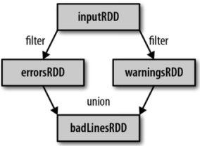

- 示例

```scala
scala> var rdd = sc.textFile("file:/opt/software/1.txt").flatMap(_.split(" ")).map((_,1)).reduceByKey(_+_)
rdd: org.apache.spark.rdd.RDD[(String, Int)] = ShuffledRDD[11] at reduceByKey at <console>:24

// 查看Lineage
scala> rdd.toDebugString
res5: String =
(3) ShuffledRDD[11] at reduceByKey at <console>:24 []
+-(3) MapPartitionsRDD[10] at map at <console>:24 []
|  MapPartitionsRDD[9] at flatMap at <console>:24 []
|  file:/opt/software/1.txt MapPartitionsRDD[8] at textFile at <console>:24 []
|  file:/opt/software/1.txt HadoopRDD[7] at textFile at <console>:24 []

// 查看依赖关系
scala> rdd.dependencies
res6: Seq[org.apache.spark.Dependency[_]] = List(org.apache.spark.ShuffleDependency@4ba7a9e4)
```

- 注意：RDD和它依赖的父RDDs的关系有两种不同的类型
  - 窄依赖（narrow dependency）
  - 宽依赖（wide dependency）


### 窄依赖

- 窄依赖指的是每一个父RDD的Partition最多被子RDD的一个Partition使用
- 窄依赖我们形象的比喻为独生子女


- 如union如何判断是窄依赖

```scala
// SparkContext.scala
def union[T: ClassTag](rdds: Seq[RDD[T]]): RDD[T] = withScope {
    val partitioners = rdds.flatMap(_.partitioner).toSet
    if (rdds.forall(_.partitioner.isDefined) && partitioners.size == 1) {
        new PartitionerAwareUnionRDD(this, rdds)
    } else {
        new UnionRDD(this, rdds)
    }
}

// PartitionerAwareUnionRDD.scala
// 注意：OneToOneDependency
class PartitionerAwareUnionRDD[T: ClassTag](
    sc: SparkContext,
    var rdds: Seq[RDD[T]]
) extends RDD[T](sc, rdds.map(x => new OneToOneDependency(x))) {...}

// Dependency.scala
// 继承自NarrowDependency
class OneToOneDependency[T](rdd: RDD[T]) extends NarrowDependency[T](rdd) {
    override def getParents(partitionId: Int): List[Int] = List(partitionId)
}

// 通过UnionRDD查找
class UnionRDD[T: ClassTag](
    sc: SparkContext,
    var rdds: Seq[RDD[T]])
extends RDD[T](sc, Nil) {
    ...
    override def getDependencies: Seq[Dependency[_]] = {
        val deps = new ArrayBuffer[Dependency[_]]
        var pos = 0
        for (rdd <- rdds) {
            deps += new RangeDependency(rdd, 0, pos, rdd.partitions.length)
            pos += rdd.partitions.length
        }
        deps
    }
    ...
}

abstract class RDD[T: ClassTag](
    @transient private var _sc: SparkContext,
    // 此时传入的是Nil，说明是子类实现deps
    @transient private var deps: Seq[Dependency[_]]
) extends Serializable with Logging {}

// 注意 RangeDependency 是窄依赖
class RangeDependency[T](rdd: RDD[T], inStart: Int, outStart: Int, length: Int)
extends NarrowDependency[T](rdd) {
```

- 判断map是窄依赖

```scala
// RDD.scala
def map[U: ClassTag](f: T => U): RDD[U] = withScope {
    val cleanF = sc.clean(f)
    new MapPartitionsRDD[U, T](this, (context, pid, iter) => iter.map(cleanF))
}
// MapPartitionsRDD.scala
private[spark] class MapPartitionsRDD[U: ClassTag, T: ClassTag](
    var prev: RDD[T],
    f: (TaskContext, Int, Iterator[T]) => Iterator[U],  // (TaskContext, partition index, iterator)
    preservesPartitioning: Boolean = false)
extends RDD[U](prev) {...}

// RDD.scala
// 构造函数中，传入的是OneToOneDependency对象
/** Construct an RDD with just a one-to-one dependency on one parent */
def this(@transient oneParent: RDD[_]) =
this(oneParent.context, List(new OneToOneDependency(oneParent)))
```


### 宽依赖

- 宽依赖指的是多个子RDD的Partition会依赖同一个父RDD的Partition，会引起shuffle
- 宽依赖形象的比喻为超生


### DAG

- Directed Acyclic Graph
- 有向无环图
- 原始的RDD通过一系列的转换就就形成了DAG，根据RDD之间的依赖关系的不同将DAG划分成不同的Stage
  - 对于窄依赖，partition的转换处理在Stage中完成计算
    - 可以并行处理
  - 对于宽依赖，由于有Shuffle的存在，只能在parent RDD处理完成后，才能开始接下来的计算
    - 需要等待窄依赖数据处理完成后再处理
    - **宽依赖是划分Stage的依据**

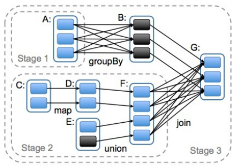


### 任务划分（重点）

- RDD任务切分中间分为
  - Application
    - 初始化一个SparkContext即生成一个Application
  - Job
    - 一个Action算子就会生成一个Job
  - Stage
    - 根据RDD之间的依赖关系的不同将Job划分成不同的Stage
    - 遇到一个宽依赖则划分一个Stage
  - Task
    - Stage是一个TaskSet
    - 将Stage划分的结果发送到不同的Executor执行即为一个Task
- 注意：==Application->Job->Stage-> Task每一层都是1对n的关系==


- Spark 作业会划分为多个阶段（Stage）
- 划分的规则是根据RDD依赖关系中的宽窄依赖进行的
- 在整个的依赖关系中，只要碰见宽依赖就会产生一个新的阶段
  - 执行时，会从ResultStage进行查找上一个Stage，最终找到源头的Stage进行执行
  - 在每个Stage执行时，会进行Task的划分执行

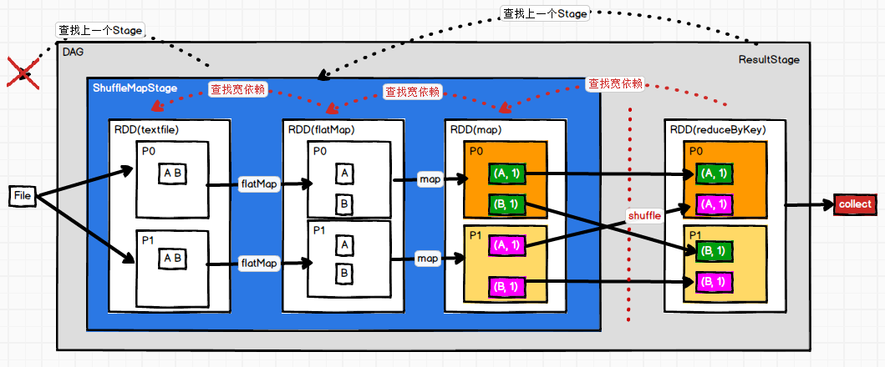

- 调用行动算子的时候，会运行作业（JOB），进行阶段（Stage）的划分以及提交阶段（SubmitStage）后的任务（Task）划分，最后提交任务（submitTask）


## RDD 缓存

- RDD通过persist方法或cache方法可以将前面的计算结果缓存
- 默认情况下 persist() 会把数据以序列化的形式缓存在 JVM 的堆空间中

- 但是并不是这两个方法被调用时立即缓存，而是触发后面的action时，该RDD将会被缓存在计算节点的内存中，并供后面重用
- 一般将重要的数据和计算量大的数据进行缓存

```scala
// RDD.scala
// Persist this RDD with the default storage level (`MEMORY_ONLY`).
def persist(): this.type = persist(StorageLevel.MEMORY_ONLY)
def cache(): this.type = persist()

// 存储级别
// 在存储级别的末尾加上“_2”来把持久化数据存为两份
object StorageLevel {
  val NONE = new StorageLevel(false, false, false, false)
  val DISK_ONLY = new StorageLevel(true, false, false, false)
  val DISK_ONLY_2 = new StorageLevel(true, false, false, false, 2)
  val MEMORY_ONLY = new StorageLevel(false, true, false, true)
  val MEMORY_ONLY_2 = new StorageLevel(false, true, false, true, 2)
    // 序列化的方式
  val MEMORY_ONLY_SER = new StorageLevel(false, true, false, false)
  val MEMORY_ONLY_SER_2 = new StorageLevel(false, true, false, false, 2)
  val MEMORY_AND_DISK = new StorageLevel(true, true, false, true)
  val MEMORY_AND_DISK_2 = new StorageLevel(true, true, false, true, 2)
  val MEMORY_AND_DISK_SER = new StorageLevel(true, true, false, false)
  val MEMORY_AND_DISK_SER_2 = new StorageLevel(true, true, false, false, 2)
  val OFF_HEAP = new StorageLevel(true, true, true, false, 1)
```

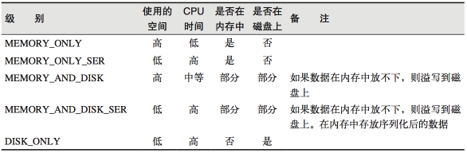

- 缓存有可能丢失，或者存储存储于内存的数据由于内存不足而被删除
- RDD的缓存容错机制保证了即使缓存丢失也能保证计算的正确执行
- 通过基于RDD的一系列转换，丢失的数据会被重算
  - 由于RDD的各个Partition是相对独立的，因此只需要计算丢失的部分即可，并不需要重算全部Partition
- 示例

```scala
scala> var rdd = sc.makeRDD(Array("ss"))
rdd: org.apache.spark.rdd.RDD[String] = ParallelCollectionRDD[13] at makeRDD at <console>:24

scala> var nocache = rdd.map(_.toString+System.currentTimeMillis)
nocache: org.apache.spark.rdd.RDD[String] = MapPartitionsRDD[14] at map at <console>:26
// 没有缓存，每次计算是变化的
scala> nocache.collect
res7: Array[String] = Array(ss1572643507657)

scala> nocache.collect
res8: Array[String] = Array(ss1572643508575)

// 进行缓存操作
scala> var cache = rdd.map(_.toString+System.currentTimeMillis).cache
cache: org.apache.spark.rdd.RDD[String] = MapPartitionsRDD[16] at map at <console>:26

scala> cache.collect
res9: Array[String] = Array(ss1572643563774)
// 每次计算从缓存中获取数据，结果一致
scala> cache.collect
res10: Array[String] = Array(ss1572643563774)

// 查看依赖，可以看到CachedPartitions
scala> cache.toDebugString
res12: String =
(8) MapPartitionsRDD[16] at map at <console>:26 [Memory Deserialized 1x Replicated]
 |       CachedPartitions: 8; MemorySize: 208.0 B; ExternalBlockStoreSize: 0.0 B; DiskSize: 0.0 B
 |  ParallelCollectionRDD[13] at makeRDD at <console>:24 [Memory Deserialized 1x Replicated]
```

- map中绿色的点表示缓存
- cache没有打断血缘关系，还是从makeRDD开始

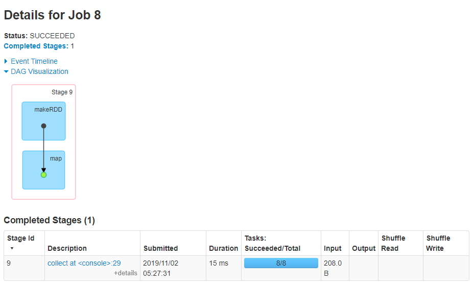


## RDD checkPoint

- Spark中对于数据的保存除了持久化操作之外，还提供了一种检查点的机制
- 检查点本质是通过将RDD写入Disk做检查点
- 通过lineage做容错的辅助，lineage过长会造成容错成本过高，不如在中间阶段做检查点容错，如果之后有节点出现问题而丢失分区，从做检查点的RDD开始重做Lineage，就会减少开销
- 检查点通过将数据写入到HDFS文件系统实现了RDD的检查点功能
- 若为当前RDD设置检查点
  - 该函数将会创建一个二进制的文件，并存储到checkpoint目录中
  - 该目录是用SparkContext.setCheckpointDir()设置的
  - 在checkpoint的过程中，该RDD的所有依赖于父RDD中的信息将全部被移除
  - 对RDD进行checkpoint操作并不会马上被执行，==必须执行Action操作才能触发==

```scala
scala> sc.setCheckpointDir("hdfs://hadoop102:9000/checkpoint")

scala> var rdd = sc.makeRDD(Array("aa"))
rdd: org.apache.spark.rdd.RDD[String] = ParallelCollectionRDD[17] at makeRDD at <console>:24

scala> var ch = rdd.map(_.toString+System.currentTimeMillis)
ch: org.apache.spark.rdd.RDD[String] = MapPartitionsRDD[18] at map at <console>:26

scala> ch.checkpoint
scala> ch.collect

scala> ch.collect
res16: Array[String] = Array(aa1572644680427)
// 此时计算开始一致
scala> ch.collect
res17: Array[String] = Array(aa1572644680468)

scala> ch.collect
res18: Array[String] = Array(aa1572644680468)

scala> ch.collect
res19: Array[String] = Array(aa1572644680468)

// 血缘关系从checkPoint开始
scala> ch.toDebugString
res20: String =
(8) MapPartitionsRDD[18] at map at <console>:26 []
 |  ReliableCheckpointRDD[19] at collect at <console>:29 []
```

- 从checkPoint开始
  - 如果在HDFS上检查点的数据丢失则会报错


# 解析


## 分区方式

- Task与Partition是一一对应的关系
- Partition是变化的，聚合操作之后数据量会变小，分区可能会减少
- 分区的个数决定了任务的个数

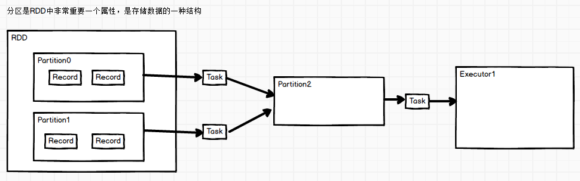


### local下创建内存RDD分区分析

```scala
package com.stt.spark
import org.apache.spark.{SparkConf, SparkContext}
object Ch01_SparkPartition {
    def main(args: Array[String]): Unit = {

        // 分区个数1
        // val sc = new SparkContext(new SparkConf().setMaster("local").setAppName("ch1_spark_partition"))
        // 分区个数4
        // val sc = new SparkContext(new SparkConf().setMaster("local[4]").setAppName("ch1_spark_partition"))
        // 分区个数12 按照当前cpu核数而来
        val sc = new SparkContext(new SparkConf().setMaster("local[*]").setAppName("ch1_spark_partition"))

        print(sc.makeRDD(Array(1,2,3,4,5)).partitions.length)
        sc.stop()
    }
}
```

- 源码分析
  - local模式运行，则查看LocalSchedulerBackend实现


```scala
// SparkContext.scala
def makeRDD[T: ClassTag](
    seq: Seq[T],
    numSlices: Int = defaultParallelism): RDD[T] = withScope {
    parallelize(seq, numSlices)
}

def defaultParallelism: Int = {
    assertNotStopped()
    taskScheduler.defaultParallelism
}
// TaskScheduler.scala
def defaultParallelism(): Int

// 查看TaskScheduler的实现类TaskSchedulerImpl
override def defaultParallelism(): Int = backend.defaultParallelism()

// SchedulerBackend.scala
def defaultParallelism(): Int

// 找到SchedulerBackend的实现类LocalSchedulerBackend
override def defaultParallelism(): Int =
scheduler.conf.getInt("spark.default.parallelism", totalCores)

// 查看totalCores来源
private[spark] class LocalEndpoint(
    override val rpcEnv: RpcEnv,
    userClassPath: Seq[URL],
    scheduler: TaskSchedulerImpl,
    executorBackend: LocalSchedulerBackend,
    private val totalCores: Int)
extends ThreadSafeRpcEndpoint with Logging {}

// 在sparkContext中
private def createTaskScheduler(
    sc: SparkContext,
    master: String,
    deployMode: String): (SchedulerBackend, TaskScheduler) = {
    import SparkMasterRegex._

    // When running locally, don't try to re-execute tasks on failure.
    val MAX_LOCAL_TASK_FAILURES = 1

    master match {
        case "local" =>
        val scheduler = new TaskSchedulerImpl(sc, MAX_LOCAL_TASK_FAILURES, isLocal = true)
        // ***创建LocalSchedulerBackend，传入的是1作为totalCores
        val backend = new LocalSchedulerBackend(sc.getConf, scheduler, 1)
        scheduler.initialize(backend)
        (backend, scheduler)

        case LOCAL_N_REGEX(threads) =>
        def localCpuCount: Int = Runtime.getRuntime.availableProcessors()
        // local[*] estimates the number of cores on the machine; local[N] uses exactly N threads.
        // 如果是local[n],判断n的值，如果n是*，则使用cpu的核数
        val threadCount = if (threads == "*") localCpuCount else threads.toInt
        if (threadCount <= 0) {
            throw new SparkException(s"Asked to run locally with $threadCount threads")
        }
        val scheduler = new TaskSchedulerImpl(sc, MAX_LOCAL_TASK_FAILURES, isLocal = true)
        val backend = new LocalSchedulerBackend(sc.getConf, scheduler, threadCount)
        scheduler.initialize(backend) ...
}  
```

- 如果使用local模式访问spark，默认内存RDD分区为1
- 如果使用local[k]模式访问spark，那么默认的内存RDD分区为k
- 如果使用local[*]模式访问spark，那么默认的内存RDD分区为当前CPU的最大核心数


### local下读取文件创建RDD分区分析

- 创建文件
- 1.txt
  - 大小2个字节

```txt
12
```

- 2.txt
  - 大小4个字节，含有换行\r\n

```txt
3
4
```

- 分析代码

```scala
package com.stt.spark

import org.apache.spark.rdd.RDD
import org.apache.spark.{SparkConf, SparkContext}

object Ch02_SparkPartition {
    def main(args: Array[String]): Unit = {

        val sc = new SparkContext(new SparkConf().setMaster("local[*]").setAppName("ch1_spark_partition"))

        val rdd: RDD[String] = sc.textFile("data/spark/Ch01_partition")
        // 结果是3
        println(rdd.partitions.length)
        // 将结果不做修改的输出到本地
        // 结果3个文件，最后一个文件为空
        rdd.saveAsTextFile("data/spark/Ch01_output")
        sc.stop()
    }
}
```

- 执行日志
  - 分片的规划，最终读取是先按照字节大小然后按行读取
  - 产生了3个任务
  - 在任务结束后发送结果给Driver


- 源码分析

```scala
// SparkContext.scala
def textFile(
    path: String,
    minPartitions: Int = defaultMinPartitions): RDD[String] = withScope {
    assertNotStopped()
    hadoopFile(path, classOf[TextInputFormat], classOf[LongWritable], classOf[Text],
               minPartitions).map(pair => pair._2.toString).setName(path)
}
// 与并行度有关，此处defaultParallelism是12，那么defaultMinPartitions是2
def defaultMinPartitions: Int = math.min(defaultParallelism, 2)
```

```java
// 注意hadoopFile对象的使用，那么使用的是hadoop的分片规则，128M的1.1倍作为一个分片
// 查看TextInputFormat 以及FileInputFormat 得到分片函数
public InputSplit[] getSplits(JobConf job, int numSplits)
    throws IOException {
    ... 
        long totalSize = 0;                           // compute total size
    for (FileStatus file: files) {                // check we have valid files
        if (file.isDirectory()) {
            throw new IOException("Not a file: "+ file.getPath());
        }
        // 统计文件的大小，2+4个字节
        totalSize += file.getLen();
    }
    // numSplits 是 defaultMinPartitions 值为2
    long goalSize = totalSize / (numSplits == 0 ? 1 : numSplits); // goalSize是3个字节
    // 值为1B
    long minSize = Math.max(job.getLong(org.apache.hadoop.mapreduce.lib.input.
                                        FileInputFormat.SPLIT_MINSIZE, 1), minSplitSize);
...
        // 每个文件一个分区
        for (FileStatus file: files) {
            Path path = file.getPath();
            long length = file.getLen();
            if (length != 0) {
                FileSystem fs = path.getFileSystem(job);
                BlockLocation[] blkLocations;
                if (file instanceof LocatedFileStatus) {
                    blkLocations = ((LocatedFileStatus) file).getBlockLocations();
                } else {
                    blkLocations = fs.getFileBlockLocations(file, 0, length);
                }
                if (isSplitable(fs, path)) {
                    // 本地文件的块大小是32M，hdfs上是128M
                    long blockSize = file.getBlockSize();
                    // 该当前文件的分片的大小，1B,3B，32MB，最后计算的值是3B
                    long splitSize = Math.max(minSize, Math.min(goalSize, blockSize));
                    long bytesRemaining = length;
                    // 判断文件的大小是否大于3B的1.1倍，从而判断是否要分片
                    // 第一个文件2B，第二个文件4B超过了3B的1.1，进行分区
                    while (((double) bytesRemaining)/splitSize > SPLIT_SLOP) {
                        String[] splitHosts = getSplitHosts(blkLocations,
                                                            length-bytesRemaining, splitSize, clusterMap);
                        // 需要进行分片，进行分片操作
                        splits.add(makeSplit(path, length-bytesRemaining, splitSize,
                                             splitHosts));
                        bytesRemaining -= splitSize;
                    }
...
```

- 为什么最后一个文件的分片是2个，但是后一个文件是空的
  - 最后一个文件4B，读取3B大小，由于读取的是文本，每次要读取一行，读取到第三个字节时，正好换行，将第二行4读取完，所以最后一个分区的内容是空

- 分区按照字节大小分，读取按照字节大小一行一行的读取，最终有分区大小的区别


## 分区&任务&阶段的关系

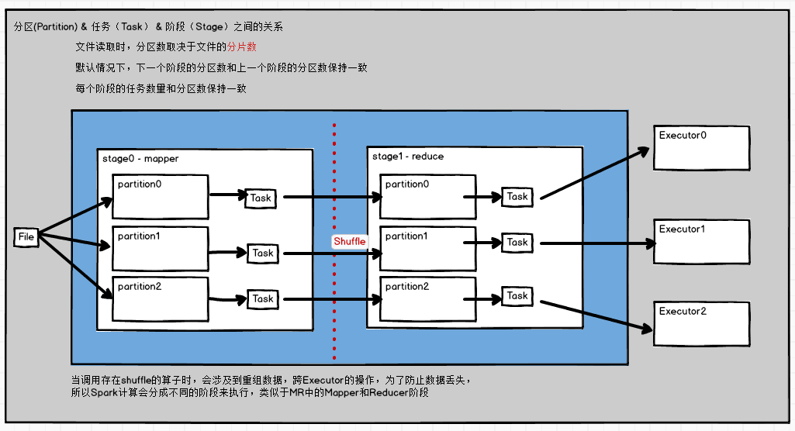

- 一个分区形成一个task
- 分区数依据具体的cpu核数计算，与cpu核保持一致，一般是集群cpu核数(4台16核=64核)的2~3倍


# 注意点


## textFile读取与Hadoop的关系

- textFile需要和hadoopFile进行关联，注意hdfs的开启，即使是local模式

```scala
/**
   * Read a text file from HDFS, a local file system (available on all nodes), or any
   * Hadoop-supported file system URI, and return it as an RDD of Strings.
   */
def textFile(
    path: String,
    minPartitions: Int = defaultMinPartitions): RDD[String] = withScope {
    assertNotStopped()
    // 注意这里hadoopFile关键字
    hadoopFile(path, classOf[TextInputFormat], classOf[LongWritable], classOf[Text],
               minPartitions).map(pair => pair._2.toString).setName(path)
}
```

- 

```scala

```


# 案例


## wordCount的6种实现方式

```scala
var input = sc.textFile("file:/data/input")
var rdd = input.flatMap(_.split(" "))

// 第一种
rdd.map((_,1)).reduceByKey(_+_).collect
```

```scala
// 第二种 groupBy
scala> var rdd = sc.makeRDD(Array("aa","cc","cc","bb"))

scala> rdd.groupBy(x=>x).collect
res80: Array[(String, Iterable[String])] = Array((aa,CompactBuffer(aa)), (bb,CompactBuffer(bb)), (cc,CompactBuffer(cc, cc)))

scala> rdd.groupBy(x=>x).map(t=>(t._1,t._2.size)).collect
res83: Array[(String, Int)] = Array((aa,1), (bb,1), (cc,2))
```

```scala
// 第三种 groupByKey
scala> rdd.map((_,1)).groupByKey().map(t=>(t._1,t._2.size)).collect
```

```scala
// 第四种 aggregateByKey
scala> rdd.map((_,1)).aggregateByKey(0)(_+_,_+_).collect
```

```scala
// 第五种 foldByKey
scala> rdd.map((_,1)).foldByKey(0)(_+_).collect
```

```scala
// 第六种 combineByKey
rdd.map((_,1)).combineByKey(v=>v,(v1:Int,v2:Int)=>v1+v2,(v1:Int,v2:Int)=>v1+v2).collect
```


