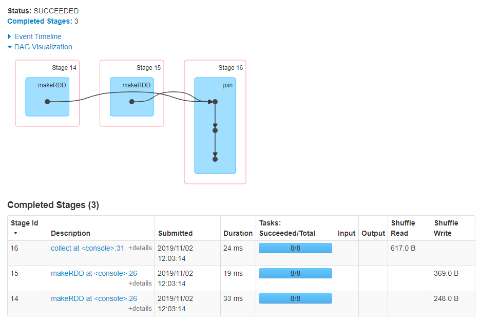
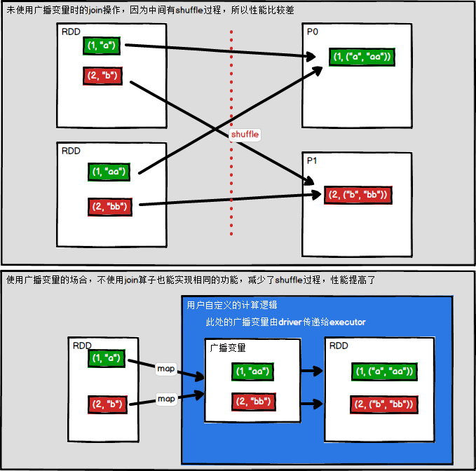
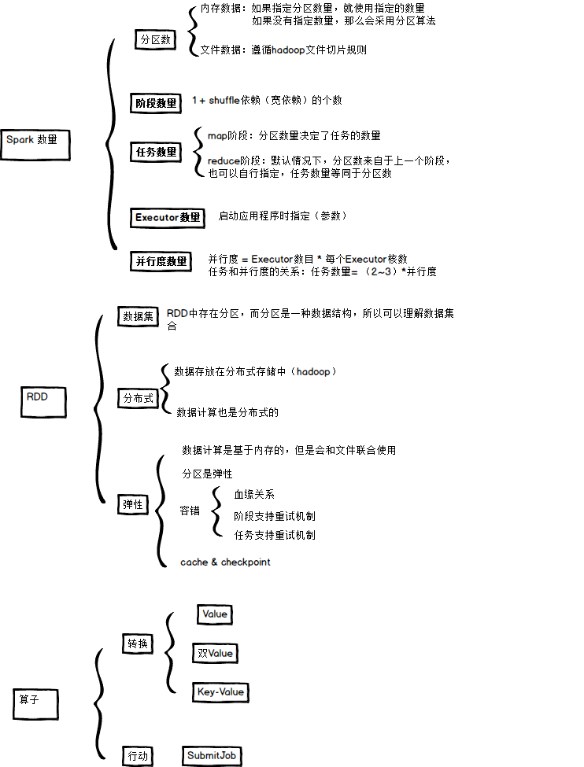

# key-value型 RDD 数据分区器

- Spark目前支持
  - Hash分区
    - 默认
  - Range分区
  - 自定义分区
- 分区器决定
  - RDD中分区的个数
  - RDD中每条数据经过Shuffle过程属于哪个分区
  - Reduce的个数

- ==注意==
  - Key-Value类型的RDD才有分区器的
  - 非Key-Value类型的RDD分区器的值是None
  - 每个RDD的分区ID范围
    - 0~numPartitions-1
    - 决定这个值是属于哪个分区


## 获取分区器

```scala
scala> var rdd = sc.makeRDD(Array(("a",1),("b",2),("c",3),("d",4)))
rdd: org.apache.spark.rdd.RDD[(String, Int)] = ParallelCollectionRDD[22] at makeRDD at <console>:25
// 非key-Value的默认分区器是None
scala> rdd.partitioner
res0: Option[org.apache.spark.Partitioner] = None

// 默认8个分区，cpu是8核
scala> rdd.glom.collect
res1: Array[Array[(String, Int)]] = Array(Array(), Array((a,1)), Array(), Array((b,2)), Array(), Array((c,3)), Array(), Array((d,4)))

// 导入HashPartitioner
scala> import org.apache.spark.HashPartitioner
scala> var rdd2 = rdd.partitionBy(new HashPartitioner(2))

scala> rdd2.partitioner
res2: Option[org.apache.spark.Partitioner] = Some(org.apache.spark.HashPartitioner@2)

scala> rdd2.glom.collect
res3: Array[Array[(String, Int)]] = Array(Array((b,2), (d,4)), Array((a,1), (c,3)))
```


## Hash分区器

- HashPartitioner分区的原理
  - 对于给定的key，计算其hashCode除以分区的个数取余
    - 如果余数小于0，则用余数+分区的个数
      - 否则加0
    - 最后返回该key所属的分区ID

```scala
// Partitioner.scala
class HashPartitioner(partitions: Int) extends Partitioner {
    require(partitions >= 0, s"Number of partitions ($partitions) cannot be negative.")

    def numPartitions: Int = partitions

    def getPartition(key: Any): Int = key match {
        case null => 0
        // hashMap中使用hashCode进行&运算
        // 其他的一般使用%运算
        // 2的n次方分区，使用&，而其他分区，如3,5则使用%
        // redis的slot就是16384，可以使用&进行计算
        case _ => Utils.nonNegativeMod(key.hashCode, numPartitions)
    }

    override def equals(other: Any): Boolean = other match {
        case h: HashPartitioner =>
        h.numPartitions == numPartitions
        case _ =>
        false
    }
    override def hashCode: Int = numPartitions
}

def nonNegativeMod(x: Int, mod: Int): Int = {
    val rawMod = x % mod
    rawMod + (if (rawMod < 0) mod else 0)
}
```


## Ranger分区器

- 预设分区范围，类似HBase中的预设分区
  - key要求可以进行比较
  - 如是一个对象，使用比较少

- HashPartitioner分区弊端
  - 热点数据的可能
  - 可能导致每个分区中数据量的不均匀
  - 极端情况下会导致某些分区拥有RDD的全部数据

- RangePartitioner作用
  - 将一定范围内的数映射到某一个分区内，尽量保证每个分区中数据量的均匀
  - 分区与分区之间是有序的
  - 分区内的数据不一定有序
  - 一个分区中的元素肯定都是比另一个分区内的元素小或者大
  - 将一定范围内的数映射到某一个分区内
- 实现过程
  - 先重整个RDD中抽取出样本数据，将样本数据排序，计算出每个分区的最大key值，形成一个Array[KEY]类型的数组变量rangeBounds
  - 判断key在rangeBounds中所处的范围，给出该key值在下一个RDD中的分区id下标
  - 该分区器要求RDD中的KEY类型必须是可以排序的


## 自定义分区器

- 实现自定义的分区器要继承 org.apache.spark.Partitioner 类并实现
  - numPartitions: Int
    - 返回创建出来的分区数
  - getPartition(key: Any): Int
    - 返回给定键的分区编号(0到numPartitions-1)
  - equals():Java
    - 判断相等性的标准方法
    - 这个方法的实现非常重要，Spark 需要用这个方法来检查你的分区器对象是否和其他分区器实例相同，这样 Spark 才可以判断两个 RDD 的分区方式是否相同

- 需求
  - 将相同后缀的数据写入相同的文件
  - 通过将相同后缀的数据分区到相同的分区并保存输出来实现

```scala
package com.stt.spark

import org.apache.spark.{Partitioner, SparkConf, SparkContext}

object Ch05_SelfPartitioner {
    def main(args: Array[String]): Unit = {
        val conf: SparkConf = new SparkConf().setAppName("serial").setMaster("local[*]")
        val sc: SparkContext = new SparkContext(conf)

        val rdd = sc.makeRDD(Array(("aac",1),("bb",2),("cc",3)))
        //    (7,(bb,2))
        //    (11,(cc,3))
        //    (3,(aac,1))
        rdd.mapPartitionsWithIndex((index,items)=>{items.map(item=>(index,item))}).foreach(println)

        val rdd2 = rdd.partitionBy(new CustomerPartitioner(2))
        //    (1,(aac,1))
        //    (0,(bb,2))
        //    (1,(cc,3))
        rdd2.mapPartitionsWithIndex((index,items)=>{items.map(item=>(index,item))}).foreach(println)

        sc.stop()
    }
}

class CustomerPartitioner(numPartition: Int) extends Partitioner{
    override def numPartitions: Int = numPartition

    override def getPartition(key: Any): Int = {
        // 取得最后一个字符进行分区
        key.toString.last.toInt%numPartitions
    }
}
```

- 使用自定义的Partitioner 是很容易
  - 把它传给 partitionBy() 方法
  - Spark 中有许多依赖于数据混洗的方法
    - 如 join() 和 groupByKey()
      - 可接收一个可选的 Partitioner 对象来控制输出数据的分区方式


# 数据读取与保存

- Spark的数据读取及数据保存可从两个维度来作区分
  - 文件格式
    - ==Text文件==、==Json文件==、Csv文件、Sequence文件以及Object文件
  - 文件系统
    - 本地文件系统、==HDFS==、==HBASE==、数据库


## 文件数据读取与保存


### Text

- 上传文件到HDFS

```bash
[ttshe@hadoop102 software]$ hadoop fs -put input.txt /
```

- 读取数据

```scala
scala> var rdd = sc.textFile("input.txt")
rdd: org.apache.spark.rdd.RDD[String] = input.txt MapPartitionsRDD[5] at textFile at <console>:25
// 未定义读取类型，默认本地读取，默认路径spark所在路径
scala> rdd.collect
org.apache.hadoop.mapred.InvalidInputException: Input path does not exist: file:/opt/module/spark/input.txt

scala> var rdd = sc.textFile("hdfs://hadoop102:9000/input.txt")
rdd: org.apache.spark.rdd.RDD[String] = hdfs://hadoop102:9000/input.txt MapPartitionsRDD[9] at textFile at <console>:25

scala> rdd.collect
res5: Array[String] = Array(hello word)
```

- 保存数据

```scala
scala> rdd.saveAsTextFile("hdfs://hadoop102:9000/myOut")
```


### Json（了解）

- 如果JSON文件中==每一行就是一个JSON记录==，可通过将JSON文件当做文本文件来读取，利用相关的JSON库对每一条数据进行JSON解析
  - 这里不是完全意义上的json

- 注意
  - ==使用RDD读取JSON文件处理很复杂，同时SparkSQL集成了很好的处理JSON文件的方式，所以应用中多是采用SparkSQL处理JSON文件==

- 数据准备

```json
{"name":"stt","age":22}
{"name":"sds","age":21}
```

- 读取数据

```scala
scala> import scala.util.parsing.json.JSON

scala> var json = sc.textFile("file:/opt/software/person.json")
json: org.apache.spark.rdd.RDD[String] = file:/opt/software/person.json MapPartitionsRDD[22] at textFile at <console>:26

scala> json.map(JSON.parseFull).collect
res12: Array[Option[Any]] = Array(Some(Map(name -> stt, age -> 22.0)), Some(Map(name -> sds, age -> 21.0)))
```


### Sequence

-  SequenceFile文件是Hadoop用来存储二进制形式的key-value对而设计的一种平面文件(Flat File)
- Spark 有专门用来读取 SequenceFile 的接口
- 在 SparkContext 中调用` sequenceFile[ keyClass, valueClass](path)`

- 注意
  - ==SequenceFile文件只针对PairRDD==

```scala
scala> var rdd = sc.makeRDD(Array((1,2),(3,4),(5,6)))
seq: org.apache.spark.rdd.RDD[(Int, Int)] = ParallelCollectionRDD[24] at makeRDD at <console>:26
// 保存为序列文件
scala> rdd.saveAsSequenceFile("file:/opt/software/seqFile")

// 查看，注意是8个分区
[ttshe@hadoop102 software]$ cd seqFile/
[ttshe@hadoop102 seqFile]$ ll
总用量 32
-rw-r--r-- 1 ttshe ttshe  92 11月  2 07:46 part-00000
-rw-r--r-- 1 ttshe ttshe  92 11月  2 07:46 part-00001
-rw-r--r-- 1 ttshe ttshe 108 11月  2 07:46 part-00002
-rw-r--r-- 1 ttshe ttshe  92 11月  2 07:46 part-00003
-rw-r--r-- 1 ttshe ttshe  92 11月  2 07:46 part-00004
-rw-r--r-- 1 ttshe ttshe 108 11月  2 07:46 part-00005
-rw-r--r-- 1 ttshe ttshe  92 11月  2 07:46 part-00006
-rw-r--r-- 1 ttshe ttshe 108 11月  2 07:46 part-00007
-rw-r--r-- 1 ttshe ttshe   0 11月  2 07:46 _SUCCESS

// 读取序列文件，注意类型
scala> var seq = sc.sequenceFile[Int,Int]("file:/opt/software/seqFile")
seq: org.apache.spark.rdd.RDD[(Int, Int)] = MapPartitionsRDD[29] at sequenceFile at <console>:26

scala> seq.collect
res14: Array[(Int, Int)] = Array((3,4), (1,2), (5,6))
```


### 对象文件

- 对象文件是将对象序列化后保存的文件，采用Java的序列化机制
- 通过`objectFile[k,v](path)` 函数接收一个路径，读取对象文件，返回对应的 RDD
- 通过`saveAsObjectFile() `实现对对象文件的输出
  - 因是序列化需要指定类型

```scala
scala> var rdd = sc.makeRDD(Array(1,2,3,4))
rdd: org.apache.spark.rdd.RDD[Int] = ParallelCollectionRDD[30] at makeRDD at <console>:26
// 序列化为对象
scala> rdd.saveAsObjectFile("file:/opt/software/objFile")
// 读取对象
scala> var obj = sc.objectFile[Int]("file:/opt/software/objFile")
obj: org.apache.spark.rdd.RDD[Int] = MapPartitionsRDD[34] at objectFile at <console>:26

// 注意读取后顺序是变化的
scala> obj.collect
res16: Array[Int] = Array(3, 1, 2, 4)
```


## 文件系统系统数据读取与保存


### HDFS

- Spark的整个生态系统与Hadoop是完全兼容的
- 对于Hadoop所支持的文件类型或者数据库类型Spark也同样支持
- 由于Hadoop的API有新旧两个版本，Spark为了能够兼容Hadoop所有的版本提供了两套创建操作接口
  - hadoopRDD和newHadoopRDD是最为抽象的两个函数接口，主要包含以下四个参数
    - 输入格式(InputFormat)
      - 数据输入的类型
        - 如TextInputFormat等
      - 新旧两个版本所引用的版本分别是
        - org.apache.hadoop.mapred.InputFormat
        - org.apache.hadoop.mapreduce.InputFormat(NewInputFormat)
    - 键类型:
      - 指定[K,V]键值对中K的类型
    - 值类型:
      - 指定[K,V]键值对中V的类型
    - 分区值
      - 指定由外部存储生成的RDD的partition数量的最小值
      - 如果没有指定，系统使用默认值defaultMinSplits

- 注意
  - 其他创建操作的API接口都是为了方便最终的Spark程序开发者而设置的，是这两个接口的高效实现版
    - 如textFile只有path这个指定文件路径的参数，其他参数在系统内部指定了默认值
  - 在Hadoop中以压缩形式存储的数据，不需要指定解压方式就能够进行读取
    - 因为Hadoop本身有一个解压器会根据压缩文件的后缀推断解压算法进行解压
  - 如果用Spark从Hadoop中读取某种类型的数据不知道怎么读取的时候，上网查找一个使用map-reduce的时候是怎么读取这种这种数据的，然后再将对应的读取方式改写成上面的hadoopRDD和newAPIHadoopRDD两个类就行


### MySQL

- 支持通过Java JDBC访问关系型数据库。需要通过JdbcRDD进行

```xml
<dependency>
    <groupId>mysql</groupId>
    <artifactId>mysql-connector-java</artifactId>
    <version>5.1.27</version>
</dependency>
```
- MySQL读取

```scala
package com.ttshe

import java.sql.DriverManager

import org.apache.spark.rdd.JdbcRDD
import org.apache.spark.{SparkConf, SparkContext}

object MysqlRDD {

    def main(args: Array[String]): Unit = {

        //1.创建spark配置信息
        val conf = new SparkConf().setMaster("local[*]").setAppName("JdbcRDD")
        //2.创建SparkContext
        val sc = new SparkContext(conf)

        //3.定义连接mysql的参数
        val driver = "com.mysql.jdbc.Driver"
        val url = "jdbc:mysql://hadoop102:3306/rdd"
        val userName = "root"
        val passWd = "123456"

        //创建JdbcRDD
        val rdd = new JdbcRDD(
            sc, 
            () => {
                Class.forName(driver)
                DriverManager.getConnection(url, userName, passWd)
            },
            "select * from `rddtable` where `id`>=? and `id<=`?;",
            1, // 下界，表示读取数据的范围每次读取10个
            10,// 上界
            1, // 分区数
            result => (result.getInt(1), result.getString(2)) // 将读取的结果转变成元组
        )

        //打印最后结果
        println(rdd.count())
        rdd.foreach(println)
        sc.stop()
    }
}
```

- MySQL写入

```scala
def main(args: Array[String]) {
    val sparkConf = new SparkConf().setMaster("local[2]").setAppName("HBaseApp")
    val sc = new SparkContext(sparkConf)
    val data = sc.parallelize(List("Female", "Male","Female"))

    data.foreachPartition(insertData)
}

def insertData(iterator: Iterator[String]): Unit = {
    Class.forName ("com.mysql.jdbc.Driver").newInstance()
    val conn = java.sql.DriverManager.getConnection("jdbc:mysql://hadoop102:3306/rdd", "root", "123456")
    iterator.foreach(data => {
        val ps = conn.prepareStatement("insert into rddtable(name) values (?)")
        ps.setString(1, data) 
        ps.executeUpdate()
    })
}
```


### HBase

- 由于 org.apache.hadoop.hbase.mapreduce.TableInputFormat 类的实现，Spark 可以通过Hadoop输入格式访问HBase
- 这个输入格式会返回键值对数据，其中
  - 键的类型为org.apache.hadoop.hbase.io.ImmutableBytesWritable
  - 值的类型为org.apache.hadoop.hbase.client.Result
- pom

```xml
<dependency>
    <groupId>org.apache.hbase</groupId>
    <artifactId>hbase-server</artifactId>
    <version>1.3.1</version>
</dependency>

<dependency>
    <groupId>org.apache.hbase</groupId>
    <artifactId>hbase-client</artifactId>
    <version>1.3.1</version>
</dependency>
```

- 从HBase读取

```scala
package com.ttshe

import org.apache.hadoop.conf.Configuration
import org.apache.hadoop.hbase.HBaseConfiguration
import org.apache.hadoop.hbase.client.Result
import org.apache.hadoop.hbase.io.ImmutableBytesWritable
import org.apache.hadoop.hbase.mapreduce.TableInputFormat
import org.apache.spark.rdd.RDD
import org.apache.spark.{SparkConf, SparkContext}
import org.apache.hadoop.hbase.util.Bytes

object HBaseSpark {

    def main(args: Array[String]): Unit = {

        //创建spark配置信息
        val sparkConf = new SparkConf().setMaster("local[*]").setAppName("JdbcRDD")
        //创建SparkContext
        val sc = new SparkContext(sparkConf)

        //构建HBase配置信息
        val conf: Configuration = HBaseConfiguration.create()
        conf.set("hbase.zookeeper.quorum", "hadoop102,hadoop103,hadoop104")
        conf.set(TableInputFormat.INPUT_TABLE, "rddtable")

        //从HBase读取数据形成RDD
        val hbaseRDD: RDD[(ImmutableBytesWritable, Result)] = 
        sc.newAPIHadoopRDD(
            conf,
            classOf[TableInputFormat],
            classOf[ImmutableBytesWritable],
            classOf[Result]
        )

        val count: Long = hbaseRDD.count()
        println(count)

        //对hbaseRDD进行处理
        hbaseRDD.foreach {
            case (_, result) =>
            val key: String = Bytes.toString(result.getRow)
            val name: String = Bytes.toString(result.getValue(Bytes.toBytes("info"), Bytes.toBytes("name")))
            val color: String = Bytes.toString(result.getValue(Bytes.toBytes("info"), Bytes.toBytes("color")))
            println("RowKey:" + key + ",Name:" + name + ",Color:" + color)
        }
        //关闭连接
        sc.stop()
    }
}
```

- 向HBase写入

```scala
ef main(args: Array[String]) {
    //获取Spark配置信息并创建与spark的连接
    val sparkConf = new SparkConf().setMaster("local[*]").setAppName("HBaseApp")
    val sc = new SparkContext(sparkConf)

    //创建HBaseConf
    val conf = HBaseConfiguration.create()
    val jobConf = new JobConf(conf)
    jobConf.setOutputFormat(classOf[TableOutputFormat])
    jobConf.set(TableOutputFormat.OUTPUT_TABLE, "fruit_spark")

    //构建Hbase表描述器
    val fruitTable = TableName.valueOf("fruit_spark")
    val tableDescr = new HTableDescriptor(fruitTable)
    tableDescr.addFamily(new HColumnDescriptor("info".getBytes))

    //创建Hbase表
    val admin = new HBaseAdmin(conf)
    if (admin.tableExists(fruitTable)) {
        admin.disableTable(fruitTable)
        admin.deleteTable(fruitTable)
    }
    admin.createTable(tableDescr)

    //定义往Hbase插入数据的方法
    def convert(triple: (Int, String, Int)) = {
        val put = new Put(Bytes.toBytes(triple._1))
        put.addImmutable(Bytes.toBytes("info"), Bytes.toBytes("name"), Bytes.toBytes(triple._2))
        put.addImmutable(Bytes.toBytes("info"), Bytes.toBytes("price"), Bytes.toBytes(triple._3))
        // 注意这里要返回一个元组
        (new ImmutableBytesWritable, put)
    }

    //创建一个RDD
    val initialRDD = sc.parallelize(List((1,"apple",11), (2,"banana",12), (3,"pear",13)))

    //将RDD内容写到HBase
    val localData = initialRDD.map(convert)

    localData.saveAsHadoopDataset(jobConf)
}
```


# 进阶


## 累加器

- 对信息进行聚合
- 在向 Spark传递函数时，如使用 map() 函数或者用 filter() 传条件时，使用驱动器程序中定义的变量，但是集群中运行的每个任务都会得到这些变量的一份新的副本，更新这些副本的值也不会影响驱动器中的对应变
- 如要实现所有分片处理时更新共享变量的功能，那么累加器可以实现

- 分析：计算和值

```scala
package com.stt.spark

import org.apache.spark.rdd.RDD
import org.apache.spark.{SparkConf, SparkContext}

object Ch08_Add {
    def main(args: Array[String]): Unit = {

        val sc = new SparkContext(new SparkConf().setMaster("local").setAppName("ch08"))

        val rdd: RDD[Int] = sc.makeRDD(Array(1,2,3,4))

        // 计算和
        var sum = 0
        rdd.map(item =>{
            sum += item
            println(sum)
        }).collect

        println(sum)
        sc.stop()
    }
}
// 结果始终是0
```

- 原因
  - 类似于值传递和引用传递的区别
  - 启动器将task传递给Executor，在Executor中执行sum计算，但是sum不会将计算的值返回给Driver
  - Driver中的sum和Executor的sum不是同一个sum


- 使用累加器实现计算和值

```scala
package com.stt.spark

import org.apache.spark.rdd.RDD
import org.apache.spark.util.LongAccumulator
import org.apache.spark.{SparkConf, SparkContext}

object Ch08_Add {
    def main(args: Array[String]): Unit = {

        val sc = new SparkContext(new SparkConf().setMaster("local").setAppName("ch08"))
        val rdd: RDD[Int] = sc.makeRDD(Array(1,2,3,4))

        // 使用采集器（累加器）
        val sum: LongAccumulator = sc.longAccumulator("sum")

        rdd.map(item =>{
            sum.add(item)
        }).collect

        println(sum.value)
        sc.stop()
    }
}
```

- 源码

```scala
def longAccumulator(name: String): LongAccumulator = {
    val acc = new LongAccumulator
    register(acc, name)
    acc
}
```

- 分析累加器可以成功的原因


### 系统累加器

- 针对一个输入的日志文件，如果我们想计算文件中所有空行的数量，可以编写以下程序

```scala
scala> val notice = sc.textFile("./NOTICE")
notice: org.apache.spark.rdd.RDD[String] = ./NOTICE MapPartitionsRDD[40] at textFile at <console>:32

scala> val blanklines = sc.accumulator(0)
warning: there were two deprecation warnings; re-run with -deprecation for details
blanklines: org.apache.spark.Accumulator[Int] = 0

scala> val tmp = notice.flatMap(line => {
     |    if (line == "") {
     |       blanklines += 1
     |    }
     |    line.split(" ")
     | })
tmp: org.apache.spark.rdd.RDD[String] = MapPartitionsRDD[41] at flatMap at <console>:36

scala> tmp.count()
res31: Long = 3213

scala> blanklines.value
res32: Int = 171
```

- 通过在驱动器中调用SparkContext.accumulator(initialValue)方法，创建出存有初始值的累加器。返回值为 org.apache.spark.Accumulator[T] 对象，其中 T 是初始值 initialValue 的类型。Spark闭包里的执行器代码可以使用累加器的 += 方法(在Java中是 add)增加累加器的值。 驱动器程序可以调用累加器的value属性(在Java中使用value()或setValue())来访问累加器的值。 

- ==注意==
  - 工作节点上的任务不能访问累加器的值
  - 从这些task任务的角度来看，累加器是一个==只写变量==

- 对于要在行动操作中使用的累加器，Spark只会把每个任务对各累加器的修改应用一次。因此，如果想要一个无论在失败还是重复计算时都绝对可靠的累加器，我们必须把它放在 foreach() 这样的行动操作中。转化操作中累加器可能会发生不止一次更新

  

### 自定义累加器

- 自定义累加器类型的功能在1.X版本中就已经提供了，但是使用起来比较麻烦，在2.0版本后，累加器的易用性有了较大的改进，而且官方还提供了一个新的抽象类：AccumulatorV2来提供更加友好的自定义类型累加器的实现方式。实现自定义类型累加器需要继承AccumulatorV2并至少覆写下例中出现的方法
- 示例1
  - ==注意行动算子会触发累加器的执行==

```scala
package com.stt.spark

import org.apache.spark.rdd.RDD
import org.apache.spark.util.{AccumulatorV2, LongAccumulator}
import org.apache.spark.{SparkConf, SparkContext}

object Ch09_CustomerAccumulator {
    def main(args: Array[String]): Unit = {
        val sc = new SparkContext(new SparkConf().setMaster("local").setAppName("ch08"))

        val rdd: RDD[Int] = sc.makeRDD(Array(1,2,3,4))

        // 使用采集器（累加器）
        val sum: MyAccumulator = new MyAccumulator

        // 注册累加器
        sc.register(sum,"sum")

        var srdd = rdd.map(item =>{
            sum.add(item)
        })
        srdd.collect
        println(sum.value)
		// 如果再执行srdd.collect 累加器会再次执行
        // 需要注意累加器的使用次数
        // 需要注意行动算子的使用，如果使用srdd.foreach也是会再次执行累加器
        sc.stop()
    }
}

// 自定义累加器
class MyAccumulator extends AccumulatorV2[Int,Int]{

    var sum = 0

    // 是否初始状态
    override def isZero: Boolean = sum == 0

    // 执行器执行时，需要拷贝累加器对象
    override def copy(): AccumulatorV2[Int, Int] = {
        val _new = new MyAccumulator()
        _new.synchronized{
            self.sum = 0
        }
        _new
    }

    // 重置数据
    override def reset(): Unit = sum = 0

    // 累加数据
    override def add(v: Int): Unit = sum += v

    // 合并计算的结果数据
    override def merge(other: AccumulatorV2[Int, Int]): Unit = {
        sum += other.value
    }
    // 累加器的结果
    override def value: Int = sum
}
```

- 系统调用AccumulatorV2的`copyAndReset()`顺序：copy->reset->isZero，如果isZero为false，则抛出异常：`copyAndReset must return a zero value copy`
- 示例2：在程序运行过程中收集一些文本类信息，最终以Set[String]的形式返回

```scala
package com.ttshe.spark

import org.apache.spark.util.AccumulatorV2
import org.apache.spark.{SparkConf, SparkContext}
import scala.collection.JavaConversions._

class LogAccumulator extends org.apache.spark.util.AccumulatorV2[String, java.util.Set[String]] {
    private val _logArray: java.util.Set[String] = new java.util.HashSet[String]()

    override def isZero: Boolean = {
        _logArray.isEmpty
    }

    override def reset(): Unit = {
        _logArray.clear()
    }

    override def add(v: String): Unit = {
        _logArray.add(v)
    }

    override def merge(other: AccumulatorV2[String, java.util.Set[String]]): Unit = {
        other match {
            case o: LogAccumulator => _logArray.addAll(o.value)
        }

    }

    override def value: java.util.Set[String] = {
        java.util.Collections.unmodifiableSet(_logArray)
    }

    override def copy(): AccumulatorV2[String, java.util.Set[String]] = {
        val newAcc = new LogAccumulator()
        _logArray.synchronized{
            newAcc._logArray.addAll(_logArray)
        }
        newAcc
    }
}

// 过滤掉带字母的
object LogAccumulator {
    def main(args: Array[String]) {
        val conf=new SparkConf().setAppName("LogAccumulator")
        val sc=new SparkContext(conf)

        val accum = new LogAccumulator
        sc.register(accum, "logAccum")
        val sum = sc.parallelize(Array("1", "2a", "3", "4b", "5", "6", "7cd", "8", "9"), 2).filter(line => {
            val pattern = """^-?(\d+)"""
            val flag = line.matches(pattern)
            if (!flag) {
                accum.add(line)
            }
            flag
        }).map(_.toInt).reduce(_ + _)

        println("sum: " + sum)
        for (v <- accum.value) print(v + "")
        println()
        sc.stop()
    }
}
```

- 示例3，收集信息

```scala
package com.stt.spark

import java.util

import org.apache.spark.rdd.RDD
import org.apache.spark.util.{AccumulatorV2, LongAccumulator}
import org.apache.spark.{SparkConf, SparkContext}

object Ch10_CustomerAccumulator {
    def main(args: Array[String]): Unit = {
        val sc = new SparkContext(new SparkConf().setMaster("local").setAppName("ch10"))

        val rdd: RDD[String] = sc.makeRDD(Array("error1","ss","error3","ee"))

        // 使用采集器（累加器）
        val blackList: MyBlackListAccumulator = new MyBlackListAccumulator

        // 注册
        sc.register(blackList)

        rdd.map(item =>{
            blackList.add(item)
            item
        }).collect

        println(blackList.value)

        sc.stop()
    }
}

// 判断运行情况，采集有问题的信息
// 使用HashSet的原因，是错误数据相同的只要记录一个
class MyBlackListAccumulator extends AccumulatorV2[String,util.HashSet[String]]{

    var blackList = new util.HashSet[String]()

    override def isZero: Boolean = blackList.isEmpty

    override def copy(): AccumulatorV2[String, util.HashSet[String]] = new MyBlackListAccumulator()

    override def reset(): Unit = blackList.clear()

    override def add(v: String): Unit = {
        if(v.contains("error")){
            blackList.add(v)
        }
    }

    override def merge(other: AccumulatorV2[String, util.HashSet[String]]): Unit = blackList.addAll(other.value)

    override def value: util.HashSet[String] = blackList
}
```


## 广播变量（调优策略）


### 分析

- 案例分析：join操作

```scala
scala> var rdd1 = sc.makeRDD(Array((1,"a"),(2,"b"),(3,"c")))
rdd1: org.apache.spark.rdd.RDD[(Int, String)] = ParallelCollectionRDD[35] at makeRDD at <console>:26

scala> var rdd2 = sc.makeRDD(Array((1,"aa"),(2,"bb")))
rdd2: org.apache.spark.rdd.RDD[(Int, String)] = ParallelCollectionRDD[36] at makeRDD at <console>:26

scala> rdd1.join(rdd2).collect
res17: Array[(Int, (String, String))] = Array((1,(a,aa)), (2,(b,bb)))
```



- 有shuffle过程，效率不高
- 使用广播变量，将rdd2进行广播到各个Executor内存中，再使用map进行处理

```scala
scala> var rdd3 = sc.broadcast(Array((1,"aa"),(2,"bb")))
rdd3: org.apache.spark.broadcast.Broadcast[Array[(Int, String)]] = Broadcast(33)

scala> rdd1.map(item=>{
    var tmp = (-1,"null")
    for(item2 <- rdd3.value){
        if(item._1 == item2._1){
            tmp = item2
        }
    }
    (tmp._1,(item._2,tmp._2))    
}).filter(_._1 != -1).collect
```

- 使用广播变量后，只有一个stage，同时没有shuffle过程，速度变快




### 说明

- 把变量广播给各个Executor，类似于小表join大表，小表在各个Executor中
- 广播变量用来高效分发较大的对象，但不能太大，因为是存储在内存中的
- 向所有工作节点发送一个较大的只读值，以供一个或多个Spark操作使用
  - 如应用需要向所有节点发送一个较大的只读查询表，甚至是机器学习算法中的一个很大的特征向量，广播变量用起来都很顺手
  - 在多个并行操作中使用同一个变量，但是 Spark会为每个任务分别发送

- 使用广播变量的过程如下
  - 通过对一个类型 T 的对象调用 SparkContext.broadcast 创建出一个 Broadcast[T] 对象
    -  任何可序列化的类型都可以这么实现
  - 通过value属性访问该对象的值
  - 变量只会被发到各个节点一次，应作为只读值处理
    - 修改这个值不会影响到别的节点


# RDD相关概念关系


- 输入可能以多个文件的形式存储在HDFS上，每个File都包含了很多块，称为Block
- 当Spark读取这些文件作为输入时，会根据具体数据格式对应的InputFormat进行解析，一般是将若干个Block合并成一个输入分片，称为InputSplit
  - ==注意InputSplit不能跨越文件==
- 随后将为这些输入分片生成具体的Task
- InputSplit与Task是一一对应的关系，随后这些具体的Task每个都会被分配到集群上的某个节点的某个Executor去执行（放在TaskPool，Executor去取Task）
  - 每个节点可以启一个或多个Executor
  - 每个Executor由若干core组成，每个Executor的每个core一次只能执行一个Task
  - 每个Task执行的结果就是生成了目标RDD的一个partiton
- 注意: ==这里的core是虚拟的core而不是机器的物理CPU核，可理解是Executor的一个工作线程==
  - Task被执行的并发度 = Executor数目 * 每个Executor核数。至于partition的数目
  - 对于数据读入阶段，如sc.textFile，输入文件被划分为多少InputSplit就会需要多少初始Task
  - 在Map阶段partition数目保持不变
    - 窄依赖不更改分区个数
  - 在Reduce阶段，RDD的聚合会触发shuffle操作，聚合后的RDD的partition数目跟具体操作有关
    - 如repartition操作会聚合成指定分区数，还有一些算子是可配置的
    - 如果不指定，会将上一个阶段的分区值移动到下一个阶段

- RDD在计算的时候，每个分区都会起一个task，所以rdd的分区数目决定了总的的task数目
- 申请的计算节点（Executor）数目和每个计算节点核数，决定同一时刻可并行执行的task
  - 如RDD有100个分区
    - 计算时会生成100个task
    - 资源配置为10个计算节点，每个两2个核，同一时刻可并行的task数目为20
    - 计算这个RDD需要5个轮次
    - 如果计算资源不变，有101个task，需要6个轮次，在最后一轮中，只有一个task在执行，其余核都在空转
    - 如果计算资源不变，RDD只有2个分区，那么同一时刻只有2个task运行，其余18个核空转，造成资源浪费
      - ==在spark调优中，增大RDD分区数目，增大任务并行度的做法==


# 总结




# 面试题

待完善


- Spark内置模块包括哪些？请分别简述其功能
  - 与内核有关，参考内核调优

  

- Spark的特点有哪些？简述

  - 快，将弹性，分布式说明一下

  

- Spark中核心的进程有哪些？分别说明其主要功能
  - CoarseGrainedExecutorBackEnd 粗粒度执行后台进程
  - Master  Standalone模式下
  - Worker Standalone模式下
  - SparkSubmit
  - Driver 不是，是线程
  - Client 有，但很快消失
  - 内核调优中详细说明

  

- Spark有几种运行模式，如何指定在不同的模式下运行
  - Local
  - Standalone
    - 在spark-submit时，在master上参数填写spark://ip:port
  - Yarn
  - Mesos

- 如何提交一个Spark任务？主要参数有哪些
  - spark-submit
    - --master
    - --class
    - --executor-memory
    - --executor-core

- 画出在Standalone-Client模式下提交任务的流程图
  - 一般用于测试
  - 

- 画出在Yarn-Cluster模式下提交任务的流程图
  
- 
  
- 简述你所理解的不同运行模式之间的区别

  - 资源调度和任务调度的关系
  - local
    - 资源调度和任务调度在本机
  - 独立模式
    - spark有自己独立的集群
    - master和worker形成资源调度
    - driver和executor形成任务调度
    - master和driver做交互，worker和executor做交互
  - yarn
    - resourceManager与ApplicationMaster交互
    - executor和nodeManager的container交互

  


- 编写WordCount(读取一个本地文件)，并打包到集群运行,说明需要添加的主要参数
  - 

- RDD的属性
  - 分区，依赖，首选位置

- RDD的特点
  - 

- 如何创建一个RDD，有几种方式，举例说明
  - 内存中创建，通过集合创建
  - 通过外部存储创建
  - 通过转换算子得到RDD
  - new 得到，如读取mysql数据

- 创建一个RDD，使其一个分区的数据转变为一个String
  - 例如(Array("a","b","c","d"),2)=>("ab","cd")

```scala
var rdd = sc.makeRDD(Array("a","b","c","d"),2)
rdd.mapPartitions(items=>{
    var tmp = ""
    for(item <- items){
        tmp += item
        println(tmp)
    }
    Iterator(tmp)
}).collect
```

- map与mapPartitions的区别

  - map每个数据操作一遍
  - mapPartitions每个分区执行一遍

  

- coalesce与repartition两个算子的作用以及区别与联系

  - coalesce默认没有shuffle，可以指定
  - repartition有shuffle过程，等价于coalesce指定shuflle的调用

- 使用zip算子时需要注意的是什么（即哪些情况不能使用）

  - 2个RDD的分区数量要一致
  - 分区内数量要一致，否则报错

  

- reduceByKey跟groupByKey之间的区别

  - 与效率有关

  - reduceByKey有预聚合

  - groupByKey没有预聚合

    

- reduceByKey跟aggregateByKey之间的区别与联系

  - reduceByKey是aggregateByKey实现的子集
  - aggregateByKey，粒度更细
  - combineByKey粒度比aggregateByKey更细

  

- combineByKey的参数作用，说明其参数调用时机

  - 第一个参数是分区内第一个数据需要比较
  - 第二个参数是分区内数据操作
  - 第三个参数是分区间数据操作

  

- 使用RDD实现Join的多种方式

  - 广播变量
  - join，内连接
  - cogroup，外连接

  

- aggregateByKey与aggregate之间的区别与联系

  - 分区间要额外操作

  

- 创建一个RDD，自定义一种分区规则并实现？spark中是否可以按照Value分区

  - 自定义实现分区器
  - 不可用安装value进行分区，只给了key，没有给value

  

- 读取文件，实现WordCount功能。（使用不同的算子实现，至少3种方式）


- 说说你对RDD血缘关系的理解

  - 使用了装饰者设计模式
  - DAG，依据血缘生成一个有向无环图
  - 使用DAG基于宽窄依赖划分阶段
  - 如果血缘关系太长使用cache和checkPoint进行缓存

  

- Spark是如何进行任务切分的，请说明其中涉及到的相关概念
  - 宽窄依赖
  - 看源码，有映像

- RDD的cache和checkPoint的区别和联系
  - 

- Spark读取HDFS文件默认的切片机制

  - 取文件总和，1.1倍

  

- 说说你对广播变量的理解
  - 

- 自定义一个累加器，实现计数功能
  - 可以共享变量，数据采集功能