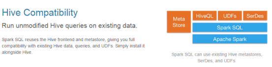
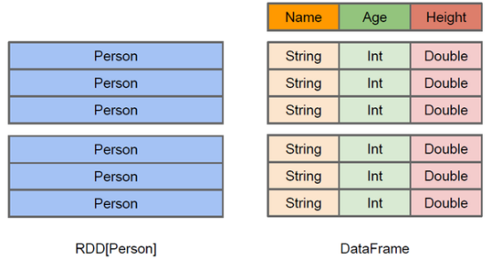
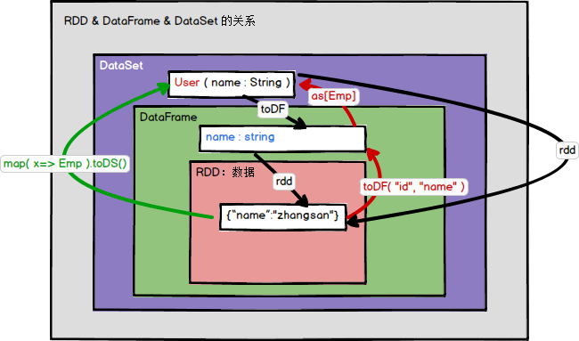

# 概述

- Spark SQL是Spark用来处理结构化数据的一个模块
- 提供了2个编程抽象
  - DataFrame和DataSet
  - 作为分布式SQL查询引擎的作用

- SparkSQL类比Hive
  - 将Hive SQL转换成MapReduce然后提交到集群上执行
  - 简化编写MapReduc的程序的复杂性
    - MapReduce这种计算模型执行效率比较慢
- Spark SQL
  - 一个框架，与Hive无缝对接
  - 可以直接操作RDD
  - 将Spark SQL转换成RDD，然后提交到集群执行
  - 执行效率非常快


## 特点

- 易整合
- 统一的数据访问方式
- 兼容Hive



- 标准数据连接
  - 连接JDBC or ODBC


## 关于DataFrame

- 与RDD类似，DataFrame也是一个分布式数据容器
- DataFrame更像传统数据库的二维表格，除了数据以外，还记录数据的结构信息，即schema
- 与Hive类似，DataFrame也支持嵌套数据类型
  - struct
  - array
  - map
- 从API易用性的角度上看，DataFrame API提供的是一套高层的关系操作，比函数式的RDD API要更加友好



- RDD[Person]虽然以Person为类型参数，但Spark框架本身不了解Person类的内部结构
- DataFrame提供了详细的结构信息，使得Spark SQL可以清楚地知道该数据集中包含哪些列，每列的名称和类型各是什么
- DataFrame是为数据提供了Schema的视图
  - 可把它当做数据库中的一张表来对待
- DataFrame是懒执行的，性能上比RDD要高，主要原因
  - 优化的执行计划：查询计划通过Spark catalyst optimiser进行优化


- 关于如下执行的优化

```scala
users.join(events,users("id")===events("uid")).filter(events("date") > "2015-01-01")
```


- 上图展示的人口数据分析的示例
  - 图中构造了两个DataFrame
    - events
    - users
  - 将它们join之后又做了一次filter操作
  - 如果原封不动地执行这个执行计划，最终的执行效率不高
    - 因为join是一个代价较大的操作，也可能会产生一个较大的数据集
  - 如果将filter下推到 join下方，先对DataFrame进行过滤，再join过滤后的较小的结果集，便可以有效缩短执行时间
  - 如果再将filter放在scan环节，可更好的提高效率
  - Spark SQL的查询优化器正是这样做的
- 逻辑查询计划优化就是一个利用基于关系代数的等价变换，将高成本的操作替换为低成本操作的过程


## 关于DataSet

- 是Dataframe API的一个扩展，是Spark最新的数据抽象

- 用户友好的API风格，既具有类型安全检查也具有Dataframe的查询优化特性。

- Dataset支持编解码器，当需要访问非堆上的数据时可以避免反序列化整个对象，提高了效率

- ==样例类==用来在Dataset中定义数据的结构信息
  - 样例类中每个属性的名称直接映射到DataSet中的字段名称

- Dataframe是Dataset的特列
  - DataFrame=Dataset[Row] 
  - 通过as方法将Dataframe转换为Dataset
  - Row是一个类型，跟Car、Person这些的类型一样
  - 所有的表结构信息都可用Row来表示

- DataSet是强类型的
  - 如Dataset[Car]，Dataset[Person]

- DataFrame==只是知道字段，但是不知道字段的类型==
  - 在执行这些操作的时候是没办法在编译的时候检查是否类型失败
  - 如对一个String进行减法操作，在执行的时候才报错
- DataSet知道字段和字段类型
  - 有更严格的错误检查
- DataSet与DataFrame的关系跟JSON对象和类对象之间的类比


# SparkSQL 编程


## SparkSession

- 在老的版本中SparkSQL提供两种SQL查询起始点
  - SQLContext
    - 用于Spark自己提供的SQL查询
  - HiveContext
    - 用于连接Hive的查询

- SparkSession是Spark最新的SQL查询起始点
  - 实质上是SQLContext和HiveContext的组合
  - 在SQLContext和HiveContext上可用的API在SparkSession上同样是可以使用
  - SparkSession内部封装了sparkContext，操作实际上由sparkContext完成

```scala
bin/spark-shell
...
Spark context Web UI available at http://192.168.1.102:4040
Spark context available as 'sc' (master = local[*], app id = local-1572751375883).
// 使用sparkSession的对象spark进行操作
Spark session available as 'spark'.
...
// 查看sparkSession支持的操作
scala> spark.
baseRelationToDataFrame   createDataFrame   experimental    range  sql   table     
catalog    createDataset     implicits       read    sqlContext   time
close      emptyDataFrame    listenerManager   readStream   stop  udf
conf       emptyDataset      newSession   sparkContext   streams version

// 使用sparkSession调用sparkContext进行RDD操作
scala> spark.sparkContext.makeRDD(Array(1,2,3,4))
res0: org.apache.spark.rdd.RDD[Int] = ParallelCollectionRDD[0] at makeRDD at <console>:24
```


## DataFrame


### 创建

- 创建DataFrame有三种方式
  - 通过Spark的数据源进行创建
  - 从已存在的RDD进行转换
  - 从Hive Table进行查询返回
- 查看Spark数据源支持的格式
  - 注意：此处的json是一行是完整的json
  - orc与hive有关系
  - parquet 是spark特有
  - orc比parquet性能好一些

```scala
scala> spark.read.
csv   format   jdbc   json   load   option   options   orc   parquet   schema   table   text   textFile
```

- 在/opt/software/创建文件

```json
{"name":"stt","age":22}
{"name":"zhangsan","age":11}
{"name":"lisi","age":31}
```

- 读取文件创建DataFrame

```scala
scala> var df = spark.read.json("file:/opt/software/person.json")
df: org.apache.spark.sql.DataFrame = [age: bigint, name: string]

scala> df.show
+---+--------+
|age|    name|
+---+--------+
| 22|     stt|
| 11|zhangsan|
| 31|    lisi|
+---+--------+

// 将读取的dataFrame转为临时视图
// 查看支持的视图创建
scala> df.create
createGlobalTempView   createOrReplaceTempView   createTempView

scala> df.createOrReplaceTempView("user")
// 使用sparkSql查询
scala> spark.sql("select * from user").show
+---+--------+
|age|    name|
+---+--------+
| 22|     stt|
| 11|zhangsan|
| 31|    lisi|
+---+--------+

scala> spark.sql("select name from user").show
+--------+
|    name|
+--------+
|     stt|
|zhangsan|
|    lisi|
+--------+
```


### SQL 语法调用


#### 临时表

```scala
scala> spark.read.json("file:/opt/software/person.json").createOrReplaceTempView("user")

scala> var sqlDF = spark.sql("select * from user")
sqlDF: org.apache.spark.sql.DataFrame = [age: bigint, name: string]

scala> sqlDF.show
+---+--------+
|age|    name|
+---+--------+
| 22|     stt|
| 11|zhangsan|
| 31|    lisi|
+---+--------+

scala> spark.sql("select sum(age) from user").show
+--------+
|sum(age)|
+--------+
|      64|
+--------+
```

- 注意：临时表是Session范围内的，Session退出后，表就失效了

```scala
scala> spark.newSession.sql("select * from user").show
org.apache.spark.sql.AnalysisException: Table or view not found: user; line 1 pos 14
  at org.apache.spark.sql.catalyst.analysis.package$AnalysisErrorAt.failAnalysis(package.scala:42)
...
```


#### 全局表

- 如果想应用范围内有效使用全局表
  - createGlobalTempView
- 注意：使用全局表时需要全路径访问==global_temp==
- 如：global_temp.people

```scala
scala> var df = spark.read.json("file:/opt/software/person.json")
df: org.apache.spark.sql.DataFrame = [age: bigint, name: string]

scala> df.createGlobalTempView("people")

scala> spark.sql("select * from global_temp.people").show
+---+--------+
|age|    name|
+---+--------+
| 22|     stt|
| 11|zhangsan|
| 31|    lisi|
+---+--------+

scala> spark.newSession.sql("select * from global_temp.people").show
+---+--------+
|age|    name|
+---+--------+
| 22|     stt|
| 11|zhangsan|
| 31|    lisi|
+---+--------+
```


### 查看Schema信息

```scala
scala> var df = spark.read.json("file:/opt/software/person.json")
df: org.apache.spark.sql.DataFrame = [age: bigint, name: string]

scala> df.printSchema
root
 |-- age: long (nullable = true)
 |-- name: string (nullable = true)
```


### DSL 语法调用

- DataFrame和DataSet都可以使用

```scala
// 使用select查询
scala> df.select("name").show
+--------+
|    name|
+--------+
|     stt|
|zhangsan|
|    lisi|
+--------+

// 使用 $ 进行数据操作
scala> df.select($"name",$"age"+1).show
+--------+---------+
|    name|(age + 1)|
+--------+---------+
|     stt|       23|
|zhangsan|       12|
|    lisi|       32|
+--------+---------+

// 使用filter进行过滤
scala> df.filter($"age">15).show
+---+----+
|age|name|
+---+----+
| 22| stt|
| 31|lisi|
+---+----+

// 使用groupBy进行分组
scala> df.groupBy("age").
agg   avg   count   max   mean   min   pivot   sum

scala> df.groupBy("name","age").sum("age").show
+--------+---+--------+
|    name|age|sum(age)|
+--------+---+--------+
|zhangsan| 11|      11|
|    lisi| 31|      31|
|     stt| 22|      22|
+--------+---+--------+

scala> df.groupBy("name","age").sum().show
+--------+---+--------+
|    name|age|sum(age)|
+--------+---+--------+
|zhangsan| 11|      11|
|    lisi| 31|      31|
|     stt| 22|      22|
+--------+---+--------+

```


### RDD转DataFrame

- 注意：RDD与DF或者DS之间操作
  - 需要引入 `import spark.implicits._ `
  - ==spark不是包名，而是sparkSession对象的名称==

```scala
scala> import spark.implicits._
import spark.implicits._

scala> var rdd = spark.sparkContext.makeRDD(Array((1,"zhangsan",20),(2,"lisi",34),(3,"wangwu",56)))
rdd: org.apache.spark.rdd.RDD[(Int, String, Int)] = ParallelCollectionRDD[87] at makeRDD at <console>:26

scala> rdd.to
toDF   toDS   toDebugString   toJavaRDD   toLocalIterator   toString   top
```


#### toDF

- 手动对RDD增加数据结构，变成DataFrame

```scala
scala> var df = rdd.toDF("id","name","age")
df: org.apache.spark.sql.DataFrame = [id: int, name: string ... 1 more field]
scala> df.createOrReplaceTempView("user")

scala> spark.sql("select sum(age) from user").show
+--------+
|sum(age)|
+--------+
|     110|
+--------+
```


#### 反射确定 [样例类]

```scala
scala> case class User(id:Int,name:String,age:Int)
defined class User
// 依据样例类将RDD转换为DataFrame
scala> var df = rdd.map(t=>User(t._1,t._2,t._3)).toDF
df: org.apache.spark.sql.DataFrame = [id: int, name: string ... 1 more field]

scala> df.show
```


#### 使用编程方式（了解）

```scala
// 导入所需的类型
scala> import org.apache.spark.sql.types._
import org.apache.spark.sql.types._
// 创建schema
scala> val structType: StructType = StructType(StructField("name", StringType) :: StructField("age", IntegerType) :: Nil)
structType: org.apache.spark.sql.types.StructType = StructType(StructField(name,StringType,true), StructField(age,IntegerType,true))
// 导入所需的类型
scala> import org.apache.spark.sql.Row
import org.apache.spark.sql.Row
// 根据给定的类型创建二元组RDD
scala> val data = peopleRDD.map{ x => val para = x.split(",");Row(para(0),para(1).trim.toInt)}
data: org.apache.spark.rdd.RDD[org.apache.spark.sql.Row] = MapPartitionsRDD[6] at map at <console>:33
// 根据数据及给定的schema创建DataFrame
scala> val dataFrame = spark.createDataFrame(data, structType)
dataFrame: org.apache.spark.sql.DataFrame = [name: string, age: int]
```


### DataFrame转RDD

- 对dataFrame对象直接使用rdd即可

```scala
scala> var df = spark.read.json("file:/opt/software/person.json")
df: org.apache.spark.sql.DataFrame = [age: bigint, name: string]

scala> df.r
randomSplit   randomSplitAsList   rdd   reduce   registerTempTable   repartition   rollup
// 注意返回的是Row对象
scala> var rdd = df.rdd
rdd: org.apache.spark.rdd.RDD[org.apache.spark.sql.Row] = MapPartitionsRDD[105] at rdd at <console>:28
// 注意Row对象的查看数据是从0开始的
scala> rdd.foreach(row=>{println(row.getString(1))})
stt
zhangsan
lisi
```


## DataSet

- Dataset是具有强类型的数据集合，需要提供对应的类型信息

### 创建

- 需要声明样例类，使用toDS进行转换

```scala
scala> case class User(id:Int,name:String,age:Int)
defined class User

scala> val ds = Seq(User(1,"ss",22)).toDS
ds: org.apache.spark.sql.Dataset[User] = [id: int, name: string ... 1 more field]

scala> ds.foreach(user=>{println(user.id+"-"+user.name)})
1-ss
```


### RDD转DataSet

- SparkSQL能够自动将包含有case类的RDD转换成DataFrame
- case类定义了table的结构，case类属性通过反射变成了表的列名

```scala
scala> var rdd = sc.makeRDD(Array((1,"ss",22),(2,"ee",33),(3,"dd",21)))
rdd: org.apache.spark.rdd.RDD[(Int, String, Int)] = ParallelCollectionRDD[110] at makeRDD at <console>:27

scala> var ds = rdd.map(u=>{User(u._1,u._2,u._3)}).toDS
ds: org.apache.spark.sql.Dataset[User] = [id: int, name: string ... 1 more field]

scala> ds.show
+---+----+---+
| id|name|age|
+---+----+---+
|  1|  ss| 22|
|  2|  ee| 33|
|  3|  dd| 21|
+---+----+---+
```


### DataSet转RDD

- 与DF的区别是：RDD里面是sql.row，这里的类型是User，直接是样例类
- 调用rdd方法即可

```scala
scala> var rdd2 = ds.rdd
rdd2: org.apache.spark.rdd.RDD[User] = MapPartitionsRDD[117] at rdd at <console>:33
```


### DataFrame转DataSet [as]

- 注意
  - ==在使用一些特殊的操作时，一定要加上 import spark.implicits._== 
  - 不然toDF、toDS无法使用

```scala
// 导入隐式转换
import spark.implicits._

scala> var df = spark.read.json("file:/opt/software/person.json")
df: org.apache.spark.sql.DataFrame = [age: bigint, name: string]

// 声明一个样例类,注意数值类型声明为Long
scala> case class Person(name:String,age:Long) extends Serializable
defined class Person

// 使用as进行转换
scala> var ds = df.as[Person]
ds: org.apache.spark.sql.Dataset[Person] = [age: bigint, name: string]

scala> ds.show
+---+--------+
|age|    name|
+---+--------+
| 22|     stt|
| 11|zhangsan|
| 31|    lisi|
+---+--------+
```


### DataSet转DataFrame [toDF]

- 只是把case class封装成Row

```scala
// 导入隐式转换
import spark.implicits._

scala> var df2 = ds.toDF
df2: org.apache.spark.sql.DataFrame = [age: bigint, name: string]

scala> df2.show
+---+--------+
|age|    name|
+---+--------+
| 22|     stt|
| 11|zhangsan|
| 31|    lisi|
+---+--------+
```


## RDD-DataFrame-DataSet关系




- 版本
  - RDD (Spark1.0) —> Dataframe(Spark1.3) —> Dataset(Spark1.6)

- 如果同样的数据都给到这三个数据结构，他们分别计算之后，都会给出相同的结果，不同是的他们的执行效率和执行方式
- 在后期的Spark版本中，DataSet会逐步取代RDD和DataFrame成为唯一的API接口


### 共性

- RDD、DataFrame、Dataset全都是spark平台下的分布式弹性数据集，为处理超大型数据提供便利
- 都有惰性机制
  - 在进行创建、转换，如map方法时，不会立即执行
  - 只有在遇到Action如foreach，show时，三者才会开始遍历运算
- 都会根据spark的内存情况自动缓存运算
  - 即使数据量很大，也不用担心会内存溢出
- 都有partition的概念
- 有许多共同的函数
  - 如filter，排序等
- 在对DataFrame和Dataset进行操作许多操作都需要这个包进行支持 
  - import spark.implicits._
- DataFrame和Dataset均可使用模式匹配获取各个字段的值和类型

```scala
// DataFrame
testDF.map{
    case Row(col1:String,col2:Int)=>
    	println(col1)
    	println(col2)
    	col1
    case _=>
    ""
}
// DataSet
case class Coltest(col1:String,col2:Int) extends Serializable //定义字段名和类型
testDS.map{
    case Coltest(col1:String,col2:Int)=> 
    	println(col1)
    	println(col2)
    	col1
    case _=>
    ""
}
```


### 区别

- RDD
  - 一般和spark mlib同时使用
  - 不支持sparksql操作

- DataFrame
  - 与RDD和Dataset不同，DataFrame每一行的类型固定为Row
  - 每一列的值没法直接访问，只有通过解析才能获取各个字段的值

  ```scala
testDF.foreach{
    line =>
    val col1=line.getAs[String]("col1")
    val col2=line.getAs[String]("col2")
}
  ```
  
  - DataFrame与Dataset一般不与spark mlib同时使用
  - DataFrame与Dataset均支持sparksql的操作，比如select，groupby之类，还能注册临时表/视窗，进行sql语句操作
  
  ```scala
  dataDF.createOrReplaceTempView("tmp")
  spark.sql("select ROW,DATE from tmp where DATE is not null order by DATE").show(100,false)
  ```
  
  - DataFrame与Dataset支持一些特别方便的保存方式
    - 如保存成csv，可以带上表头，这样每一列的字段名一目了然
  
  ```scala
  //保存
  val saveoptions = Map("header" -> "true", "delimiter" -> "\t", "path" -> "hdfs://hadoop102:9000/test")
  datawDF.write.format("com.stt.spark.csv").mode(SaveMode.Overwrite).options(saveoptions).save()
  //读取
  val options = Map("header" -> "true", "delimiter" -> "\t", "path" -> "hdfs://hadoop102:9000/test")
  val datarDF= spark.read.options(options).format("com.stt.spark.csv").load()
  ```
  
  - 利用这样的保存方式，可以方便的获得字段名和列的对应，而且分隔符（delimiter）可以自由指定

- Dataset
  - Dataset和DataFrame拥有完全相同的成员函数，区别只是每一行的数据类型不同
  - DataFrame也可以叫Dataset[Row]
    - 每一行的类型是Row，不解析，每一行究竟有哪些字段，各个字段又是什么类型都无从得知，只能用上面提到的getAS方法或者模式匹配拿出特定字段
  - Dataset中，每一行是什么类型是一定的，在自定义了case class之后可以很自由的获得每一行的信息

  ```scala
  case class Coltest(col1:String,col2:Int)extends Serializable //定义字段名和类型
  /**
   rdd
   ("a", 1)
   ("b", 1)
   ("a", 1)
  **/
  val test: Dataset[Coltest]=rdd.map{line=>
      Coltest(line._1,line._2)
  }.toDS
  test.map{
      line=>
      println(line.col1)
      println(line.col2)
  }
  ```

  - Dataset在需要访问列中的某个字段时是非常方便的，然而，如果要写一些适配性很强的函数时，如果使用Dataset，行的类型又不确定，可能是各种case class，无法实现适配，这时候用DataFrame即Dataset[Row]就能比较好的解决问题


## IDEA创建SparkSQL程序


### pom

```xml
<dependency>
    <groupId>org.apache.spark</groupId>
    <artifactId>spark-sql_2.11</artifactId>
    <version>2.1.1</version>
</dependency>
```


### 示例

```scala
package com.stt.sparksql

import org.apache.spark.sql.SparkSession
import org.apache.spark.{SparkConf, SparkContext}
import org.slf4j.LoggerFactory

object HelloWorld {

    def main(args: Array[String]) {
        //创建SparkConf()并设置App名称
        val spark = SparkSession
        .builder()
        .appName("Spark SQL basic example")
        .config("spark.some.config.option", "some-value")
        .getOrCreate()

        import spark.implicits._

        val df = spark.read.json("data/people.json")

        // Displays the content of the DataFrame to stdout
        df.show()

        df.filter($"age" > 21).show()
        df.createOrReplaceTempView("persons")
        spark.sql("SELECT * FROM persons where age > 21").show()
        spark.stop()
    }
}
```

```scala
package com.stt.spark.sql

import org.apache.spark.SparkConf
import org.apache.spark.rdd.RDD
import org.apache.spark.sql.{DataFrame, Dataset, SparkSession}

object Ch01_DataFrame {
  def main(args: Array[String]): Unit = {
    val conf = new SparkConf().setMaster("local").setAppName("ch01")
    // 构建SparkSQL上下文，SparkSession构造方法私有，使用builder构建
    val sparkSession: SparkSession = SparkSession.builder().config(conf).getOrCreate()
    // 添加隐式转换
    import sparkSession.implicits._

    val rdd: RDD[(Int, String, Int)] = sparkSession.sparkContext.makeRDD(Array((1,"zhangsan",22),(2,"lisi",23)))
    // 将rdd转换为DataFrame，执行列结构
    val df: DataFrame = rdd.toDF("id","name","age")

    df.show()

    // 将DataFrame转换为DataSet
    val ds: Dataset[User] = df.as[User]
    ds.show()

    sparkSession.stop()
  }
}

case class User(id:Int,name:String,age:Long)
```
- 数据准备

```json
{"id":1,"name":"zhangsan","age":11}
{"id":2,"name":"lisi","age":13}
{"id":3,"name":"wangwu","age":15}
```

```scala
package com.stt.spark.sql

import org.apache.spark.SparkConf
import org.apache.spark.sql.{DataFrame, Dataset, SparkSession}

object Ch02_DataSet {
  def main(args: Array[String]): Unit = {
    val conf = new SparkConf().setMaster("local").setAppName("ch02")
    // 构建SparkSQL上下文，SparkSession构造方法私有，使用builder构建
    val sparkSession: SparkSession = SparkSession.builder().config(conf).getOrCreate()
    // 添加隐式转换
    import sparkSession.implicits._

    val df: DataFrame = sparkSession.read.json("data/spark/sql/Ch01/person.json")

    // 将DataFrame转换为DataSet
    val ds: Dataset[Person] = df.as[Person]
    ds.show()

    sparkSession.stop()
  }
}
// 注意数据类型需要是BigInt，或者Long
case class Person(id:BigInt,name:String,age:BigInt)
```


## 自定义函数

- 在Shell窗口中可以通过spark.udf功能用户可以自定义函数

### 自定义UDF函数

```scala
scala> var df = spark.read.json("file:/opt/software/person.json")
df: org.apache.spark.sql.DataFrame = [age: bigint, name: string]

scala> spark.udf.register("addName",(x:String)=>"Name:"+x)
res35: org.apache.spark.sql.expressions.UserDefinedFunction = UserDefinedFunction(<function1>,StringType,Some(List(StringType)))

scala> df.createOrReplaceTempView("person")

scala> spark.sql("select addName(name) from person").show
+-----------------+
|UDF:addName(name)|
+-----------------+
|         Name:stt|
|    Name:zhangsan|
|        Name:lisi|
+-----------------+
```


### 自定义聚合函数

- 强类型的Dataset和弱类型的DataFrame都提供了相关的聚合函数
  - 如 count()，countDistinct()，avg()，max()，min()
- 除此之外，用户可以设定自己的自定义聚合函数


#### 弱类型UDAF（推荐）

- 弱类型用户自定义聚合函数
  - 通过继承UserDefinedAggregateFunction来实现用户自定义聚合函数
  - 类似广播变量和累加器
- 自定义求平均示例

```scala
package com.stt.spark.sql

import org.apache.spark.SparkConf
import org.apache.spark.sql.{DataFrame, Dataset, Row, SparkSession}
import org.apache.spark.sql.expressions.{MutableAggregationBuffer, UserDefinedAggregateFunction}
import org.apache.spark.sql.types.{DataType, DoubleType, LongType, StructType}

object Ch03_UDAF {
    def main(args: Array[String]): Unit = {
        val conf = new SparkConf().setMaster("local").setAppName("ch02")
        // 构建SparkSQL上下文，SparkSession构造方法私有，使用builder构建
        val sparkSession: SparkSession = SparkSession.builder().config(conf).getOrCreate()
        // 添加隐式转换
        import sparkSession.implicits._

        val df: DataFrame = sparkSession.read.json("data/spark/sql/Ch01/person.json")

        val avgUDAF = new AgeAvgUDAF()
        sparkSession.udf.register("ageAvg",avgUDAF)

        // 将DataFrame转换为DataSet
        val ds: Dataset[Person2] = df.as[Person2]
        ds.createTempView("user")

        sparkSession.sql("select * from user").show()
        sparkSession.sql("select ageAvg(age) from user").show()

        sparkSession.stop()
    }
}

case class Person2(id:BigInt,name:String,age:BigInt)

// 统计年龄的平均值
// 弱类型，一般用于DataFrame
class AgeAvgUDAF extends UserDefinedAggregateFunction{

    // 输入的数据的结构
    override def inputSchema: StructType = {
        new StructType().add("age",LongType)
    }

    // 中间的逻辑处理的数据的结构
    override def bufferSchema: StructType = {
        new StructType().add("sum",LongType).add("count",LongType)
    }

    // 处理完成的结果的类型
    override def dataType: DataType = {
        DoubleType
    }

    // 表示当前函数是否稳定（一致性）
    override def deterministic: Boolean = true

    // 数据处理时，中间缓存数据初始化
    override def initialize(buffer: MutableAggregationBuffer): Unit = {
        // 对应的 new StructType().add("sum",LongType).add("count",LongType) 结构赋初始值
        buffer(0) = 0L
        buffer(1) = 0L
    }

    // 通过每次的输入数据，更新缓存数据，分区内更新
    override def update(buffer: MutableAggregationBuffer, input: Row): Unit = {
        buffer(0) = buffer.getLong(0) + input.getLong(0)
        buffer(1) = buffer.getLong(1) + 1
    }

    // 将多个节点的缓存数据合并操作，分区间操作
    override def merge(buffer1: MutableAggregationBuffer, buffer2: Row): Unit = {
        buffer1(0) = buffer1.getLong(0) + buffer2.getLong(0)
        buffer1(1) = buffer1.getLong(1) + buffer2.getLong(1)
    }

    // 计算结果
    override def evaluate(buffer: Row): Any = {
        buffer.getLong(0).toDouble / buffer.getLong(1)
    }
}
```


#### 强类型UDAF

- 强类型用户自定义聚合函数
  - 通过继承Aggregator来实现强类型自定义聚合函数

```scala
package com.stt.spark.sql

import org.apache.spark.SparkConf
import org.apache.spark.sql._
import org.apache.spark.sql.expressions.Aggregator

object Ch04_UDAF {
    def main(args: Array[String]): Unit = {
        val conf = new SparkConf().setMaster("local").setAppName("ch04")
        // 构建SparkSQL上下文，SparkSession构造方法私有，使用builder构建
        val sparkSession: SparkSession = SparkSession.builder().config(conf).getOrCreate()
        // 添加隐式转换
        import sparkSession.implicits._

        val df: DataFrame = sparkSession.read.json("data/spark/sql/Ch01/person.json")

        val avgUDAF: TypedColumn[Person3, Double] = new AgeAvgUDAF2().toColumn.name("ageAvg")

        // 将DataFrame转换为DataSet
        val ds: Dataset[Person3] = df.as[Person3]
        ds.createTempView("user")

        ds.select(avgUDAF).show()

        sparkSession.stop()
    }
}

case class Person3(id:Long,name:String,age:Long)
case class BufferAvg(var sum:Long,var count:Long)

// 统计年龄的平均值
// 强类型，适用于DataSet
class AgeAvgUDAF2 extends Aggregator[Person3,BufferAvg,Double]{
    // 中间数据初始值
    override def zero: BufferAvg = BufferAvg(0L,0L)

    // 分区内聚合
    override def reduce(b: BufferAvg, a: Person3): BufferAvg = {
        b.sum += a.age
        b.count += 1
        b
    }

    // 分区间聚合
    override def merge(b1: BufferAvg, b2: BufferAvg): BufferAvg = {
        b1.sum += b2.sum
        b1.count += b2.count
        b1
    }

    // 完成计算
    override def finish(reduction: BufferAvg): Double = {
        reduction.sum.toDouble / reduction.count
    }

    // 节点间传递需要序列化，编码器，对象使用product，常规类型用scalaXXX
    override def bufferEncoder: Encoder[BufferAvg] = Encoders.product
    override def outputEncoder: Encoder[Double] = Encoders.scalaDouble
}
```


# SparkSQL 数据源


## 通用加载/保存方法

- SparkSQL的DataFrame接口支持多种数据源的操作
- 一个DataFrame可以进行RDDs方式的操作，也可以被注册为临时表
  - DataFrame注册为临时表之后，可对该DataFrame执行SQL查询

- SparkSQL数据源
  - ==默认Parquet格式==
  - 修改默认格式
    - 配置项spark.sql.sources.default 修改默认数据源格式
  - 手动指定格式
    - 当文件格式不是parquet格式文件时
      - 全名指定
        - 如org.apache.spark.sql.parquet
      - 简称指定
        - 数据源格式为内置格式
        - 如json, parquet, jdbc, orc, libsvm, csv, text
  - 加载数据
    - SparkSessiond.read.load
  - 使用df.write和df.save保存数据


### 加载


#### read.load

- 通过load方式

```scala
// 直接加载json
scala> spark.read.load("file:/opt/software/person.json")
// 报错,json不是一个parquet文件
...
Caused by: java.lang.RuntimeException: file:/opt/software/person.json is not a Parquet file. expected magic number at tail [80, 65, 82, 49] but found [51, 49, 125, 10]
...
// 加载spark提供的parquet文件
scala> var df = spark.read.load("file:/opt/module/spark/examples/src/main/resources/users.parquet")
df: org.apache.spark.sql.DataFrame = [name: string, favorite_color: string ... 1 more field]

scala> df.show
19/11/05 00:50:54 WARN ParquetRecordReader: Can not initialize counter due to context is not a instance of TaskInputOutputContext, but is org.apache.hadoop.mapreduce.task.TaskAttemptContextImpl
+------+--------------+----------------+
|  name|favorite_color|favorite_numbers|
+------+--------------+----------------+
|Alyssa|          null|  [3, 9, 15, 20]|
|   Ben|           red|              []|
+------+--------------+----------------+

// 手动指定json格式读取文件
scala> spark.read.format("json").load("file:/opt/software/person.json")
res0: org.apache.spark.sql.DataFrame = [age: bigint, name: string]
```

#### spark.sql

- 通过在sql上直接加载的方式读取

```scala
// 直接读取建立视图，指定格式和sql，得到结果df
scala> var df = spark.sql("select name from json.`file:/opt/software/person.json`")
19/11/05 01:11:05 WARN ObjectStore: Failed to get database json, returning NoSuchObjectException
df: org.apache.spark.sql.DataFrame = [name: string]

scala> df.show
+--------+
|    name|
+--------+
|     stt|
|zhangsan|
|    lisi|
+--------+

// 从hdfs上读取
scala> val sqlDF = spark.sql("SELECT * FROM parquet.`hdfs:// hadoop102:9000/namesAndAges.parquet`")
```


### 保存


#### write.save

- 默认保存的是snappy压缩的parquet文件

```scala
scala> var df = spark.read.format("json").load("file:/opt/software/person.json")
df: org.apache.spark.sql.DataFrame = [age: bigint, name: string]

scala> df.write.save("file:/opt/software/data/output")
```

- 保存为其他格式
  - 指定格式

```scala
scala> df.write.format("json").save("file:/opt/software/data/jsonOutput")
```


#### 保存模式 [SaveMode]

- 采用SaveMode执行存储操作，SaveMode定义了对数据的处理模式
  - 注意
    - 保存模式不使用任何锁定，不是原子操作
    - 当使用Overwrite方式执行时，在输出新数据之前原数据就已经被删除

```scala
@InterfaceStability.Stable
public enum SaveMode {
    /**
   * Append mode means that when saving a DataFrame to a data source, if data/table already exists,
   * contents of the DataFrame are expected to be appended to existing data.
   *
   * @since 1.3.0
   */
    Append,
    /**
   * Overwrite mode means that when saving a DataFrame to a data source,
   * if data/table already exists, existing data is expected to be overwritten by the contents of
   * the DataFrame.
   *
   * @since 1.3.0
   */
    Overwrite,
    /**
   * ErrorIfExists mode means that when saving a DataFrame to a data source, if data already exists,
   * an exception is expected to be thrown.
   *
   * @since 1.3.0
   */
    ErrorIfExists,
    /**
   * Ignore mode means that when saving a DataFrame to a data source, if data already exists,
   * the save operation is expected to not save the contents of the DataFrame and to not
   * change the existing data.
   *
   * @since 1.3.0
   */
    Ignore
}
```

| Scala/Java                      | Any Language | Meaning                  |
| ------------------------------- | ------------ | ------------------------ |
| SaveMode.ErrorIfExists(default) | "error"      | 若文件存在，则报错，默认 |
| SaveMode.Append                 | "append"     | 追加                     |
| SaveMode.Overwrite              | "overwrite"  | 覆写                     |
| SaveMode.Ignore                 | "ignore"     | 数据存在，则忽略         |

```scala
scala> df.write.format("json").mode("append").save("file:/opt/software/data/jsonOutput")
```


## Json文件

- Spark SQL 能够自动推测 JSON数据集的结构，并将它加载为一个Dataset[Row]
- 可通过SparkSession.read.json()去加载一个JSON 文件
- ==注意==：JSON文件不是一个传统的JSON文件，每一行都得是一个JSON串

### read.json

```scala
{"name":"Michael"}
{"name":"Andy", "age":30}
{"name":"Justin", "age":19}

// Primitive types (Int, String, etc) and Product types (case classes) encoders are
// supported by importing this when creating a Dataset.
import spark.implicits._

// A JSON dataset is pointed to by path.
// The path can be either a single text file or a directory storing text files
val path = "examples/src/main/resources/people.json"
val peopleDF = spark.read.json(path)

// The inferred schema can be visualized using the printSchema() method
peopleDF.printSchema()
// root
//  |-- age: long (nullable = true)
//  |-- name: string (nullable = true)

// Creates a temporary view using the DataFrame
peopleDF.createOrReplaceTempView("people")

// SQL statements can be run by using the sql methods provided by spark
val teenagerNamesDF = spark.sql("SELECT name FROM people WHERE age BETWEEN 13 AND 19")
teenagerNamesDF.show()
// +------+
// |  name|
// +------+
// |Justin|
// +------+

// Alternatively, a DataFrame can be created for a JSON dataset represented by
// a Dataset[String] storing one JSON object per string
val otherPeopleDataset = spark.createDataset(
    """{"name":"Yin","address":{"city":"Columbus","state":"Ohio"}}""" :: Nil)
val otherPeople = spark.read.json(otherPeopleDataset)
otherPeople.show()
// +---------------+----+
// |        address|name|
// +---------------+----+
// |[Columbus,Ohio]| Yin|
```


## Parquet文件

- Parquet是一种流行的列式存储格式，可以高效地存储具有嵌套字段的记录
- Parquet格式经常在Hadoop生态圈中被使用，它支持Spark SQL的全部数据类型


### read.parquet

```scala
import spark.implicits._

val peopleDF = spark.read.json("examples/src/main/resources/people.json")

peopleDF.write.parquet("hdfs://hadoop102:9000/people.parquet")

val parquetFileDF = spark.read.parquet("hdfs:// hadoop102:9000/people.parquet")

parquetFileDF.createOrReplaceTempView("parquetFile")

val namesDF = spark.sql("SELECT name FROM parquetFile WHERE age BETWEEN 13 AND 19")
namesDF.map(attributes => "Name: " + attributes(0)).show()
// +------------+
// |       value|
// +------------+
// |Name: Justin|
// +------------+
```


## JDBC

- 通过JDBC从关系型数据库中读取数据的方式创建DataFrame
- 通过对DataFrame一系列的计算后，可将数据再写回关系型数据库中

- 注意:**需要将相关的数据库驱动放到spark的类路径下**

```bash
[ttshe@hadoop102 mysql-connector-java-5.1.27]$ cp mysql-connector-java-5.1.27-bin.jar /opt/module/spark/jars/
[ttshe@hadoop102 mysql-connector-java-5.1.27]$ pwd
/opt/software/mysql-libs/mysql-connector-java-5.1.27
```

- 开启spark-shell

```scala
$ bin/spark-shell
```


### 加载

- 方式1
  - dbtable 访问的表名
  - paste 解决spark-shell中的粘贴换行

```scala
:paste
val jdbcDF = spark.read.format("jdbc")
.option("url", "jdbc:mysql://hadoop102:3306/test")
.option("dbtable", "user")
.option("user", "root")
.option("password", "123456").load()
```

- 方式2

```scala
val prop = new java.util.Properties()
prop.put("user", "root")
prop.put("password", "123456")
val jdbcDF2 = spark.read.jdbc("jdbc:mysql://hadoop102:3306/test", "user", prop)

jdbcDF2: org.apache.spark.sql.DataFrame = [id: int, name: string ... 1 more field]

scala> jdbcDF2.show
+---+----+---+
| id|name|age|
+---+----+---+
|  1| stt| 22|
+---+----+---+
```


### 写入

- 方式1

```scala
:paste
jdbcDF.write
.format("jdbc")
.option("url", "jdbc:mysql://hadoop102:3306/test")
.option("dbtable", "user")
.option("user", "root")
.option("password", "123456")
.save()
```

- 方式2

```scala
val prop = new java.util.Properties()
prop.put("user", "root")
prop.put("password", "123456")
jdbcDF2.write.jdbc("jdbc:mysql://hadoop102:3306/test", "user", prop)
// 添加模式
jdbcDF2.write.mode("append").jdbc("jdbc:mysql://hadoop102:3306/test", "user", prop)
```


## Hive

- Apache Hive是Hadoop上的SQL引擎，Spark SQL编译时可以包含Hive支持，也可以不包含
- 包含Hive支持的Spark SQL可以支持Hive表访问、UDF(用户自定义函数)以及 Hive 查询语言(HiveQL/HQL)等
- 需要强调的一点是，如果要在Spark SQL中包含Hive的库，并不需要事先安装Hive。一般来说，最好还是在编译Spark SQL时引入Hive支持，这样就可以使用这些特性了。如果你下载的是二进制版本的 Spark，它应该已经在编译时添加了 Hive 支持
- 若要把Spark SQL连接到一个部署好的Hive上，你必须把hive-site.xml复制到 Spark的配置文件目录中($SPARK_HOME/conf)。即使没有部署好Hive，Spark SQL也可以运行。 需要注意的是，如果你没有部署好Hive，Spark SQL会在当前的工作目录中创建出自己的Hive 元数据仓库，叫作 metastore_db。此外，如果你尝试使用 HiveQL 中的 CREATE TABLE (并非 CREATE EXTERNAL TABLE)语句来创建表，这些表会被放在你默认的文件系统中的 /user/hive/warehouse 目录中(如果你的 classpath 中有配好的 hdfs-site.xml，默认的文件系统就是 HDFS，否则就是本地文件系统)

- spark中有metastore_db文件夹


### 内嵌Hive应用

- sparkSQL可直接使用内嵌Hive
- 可使用hive的命令

```scala
scala> spark.sql("show tables").show()
+--------+---------+-----------+
|database|tableName|isTemporary|
+--------+---------+-----------+
+--------+---------+-----------+

scala> spark.sql("create table mytest(id int,name string)")
// 导入数据
scala> spark.sql("load data local inpath '/opt/software/2.txt' into table mytest").show
++
||
++
++
```

- 查看本地文件夹，看到数据成功导入到spark-warehouse中

```bash
[ttshe@hadoop102 mytest]$ pwd
/opt/module/spark/spark-warehouse/mytest
[ttshe@hadoop102 mytest]$ ll
总用量 4
-rwxrwxr-x 1 ttshe ttshe 13 11月  5 02:37 2.txt
[ttshe@hadoop102 mytest]$ cat 2.txt 
1 stt
2 lisi
```

- 通过添加参数初次指定数据仓库hdfs地址
  - --conf  spark.sql.warehouse.dir=hdfs://hadoop102/spark-wearhouse

- 注意：如果使用的是内部的Hive，在Spark2.0之后，spark.sql.warehouse.dir用于指定数据仓库的地址，如果你需要是用HDFS作为路径，那么需要将core-site.xml和hdfs-site.xml 加入到Spark conf目录，否则只会创建master节点上的warehouse目录，查询时会出现文件找不到的问题，这是需要使用HDFS，则需要将metastore删除，重启集群


### 外部Hive应用

- 连接外部已经部署好的Hive，需要通过以下几个步骤
  - 将Hive中的hive-site.xml拷贝或者软连接到Spark安装目录下的conf目录下
    - 注意hive-site.xml中配置了tez引擎需要拷贝后注释掉，否则报错
  - 打开spark shell
    - 注意带上访问Hive元数据库的JDBC客户端

```bash
[ttshe@hadoop102 spark]$ rm -rf derby.log 
[ttshe@hadoop102 spark]$ rm -rf spark-warehouse/
[ttshe@hadoop102 spark]$ rm -rf metastore_db/
[ttshe@hadoop102 spark]$ cp /opt/module/hive/conf/hive-site.xml /opt/module/spark/conf/
[ttshe@hadoop102 spark]$ bin/spark-shell
```

```scala
scala> spark.sql("show tables").show
+--------+------------------+-----------+
|database|         tableName|isTemporary|
+--------+------------------+-----------+
| default|dwd_base_event_log|      false|
| default|           student|      false|
+--------+------------------+-----------+


scala> spark.sql("select * from student").show
+----+----+
|  id|name|
+----+----+
|1000| stt|
+----+----+
```


### 运行Spark SQL CLI

- Spark SQL CLI可方便的在本地运行Hive元数据服务以及从命令行执行查询任务

```bash
./bin/spark-sql
```


### 代码中使用Hive

- pom

```xml
<!-- https://mvnrepository.com/artifact/org.apache.spark/spark-hive -->
<dependency>
    <groupId>org.apache.spark</groupId>
    <artifactId>spark-hive_2.11</artifactId>
    <version>2.1.1</version>
</dependency>
<!-- https://mvnrepository.com/artifact/org.apache.hive/hive-exec -->
<dependency>
    <groupId>org.apache.hive</groupId>
    <artifactId>hive-exec</artifactId>
    <version>1.2.1</version>
</dependency>
```

- 创建SparkSession时需要添加hive支持

```scala
// 使用内置Hive需要指定一个Hive仓库地址
// 若使用的是外部Hive，则需要将hive-site.xml添加到ClassPath下
val warehouseLocation: String = new File("spark-warehouse").getAbsolutePath

val spark = SparkSession
.builder()
.appName("Spark Hive Example")
.config("spark.sql.warehouse.dir", warehouseLocation)
.enableHiveSupport() // 开启hive支持
.getOrCreate()
```


# 实战


## 数据说明

- 数据集是货品交易数据集
- 每个订单可能包含多个货品
- 每个订单可以产生多次交易，不同的货品有不同的单价


## 加载数据

- tbStock

```scala
scala> case class tbStock(ordernumber:String,locationid:String,dateid:String) extends Serializable
defined class tbStock

scala> val tbStockRdd = spark.sparkContext.textFile("/opt/software/data/tbStock.txt")
tbStockRdd: org.apache.spark.rdd.RDD[String] = tbStock.txt MapPartitionsRDD[1] at textFile at <console>:23

scala> val tbStockDS = tbStockRdd.map(_.split(",")).map(attr=>tbStock(attr(0),attr(1),attr(2))).toDS
tbStockDS: org.apache.spark.sql.Dataset[tbStock] = [ordernumber: string, locationid: string ... 1 more field]

scala> tbStockDS.show()
+------------+----------+---------+
| ordernumber|locationid|   dateid|
+------------+----------+---------+
|BYSL00000893|      ZHAO|2007-8-23|
|BYSL00000897|      ZHAO|2007-8-24|
...
+------------+----------+---------+
only showing top 20 rows
```

- tbStockDetail
  - 一个订单有多个商品

```scala
scala> case class tbStockDetail(ordernumber:String, rownum:Int, itemid:String, number:Int, price:Double, amount:Double) extends Serializable
defined class tbStockDetail

scala> val tbStockDetailRdd = spark.sparkContext.textFile("/opt/software/data/tbStockDetail.txt")
tbStockDetailRdd: org.apache.spark.rdd.RDD[String] = tbStockDetail.txt MapPartitionsRDD[13] at textFile at <console>:23

scala> val tbStockDetailDS = tbStockDetailRdd.map(_.split(",")).map(attr=> tbStockDetail(attr(0),attr(1).trim().toInt,attr(2),attr(3).trim().toInt,attr(4).trim().toDouble, attr(5).trim().toDouble)).toDS
tbStockDetailDS: org.apache.spark.sql.Dataset[tbStockDetail] = [ordernumber: string, rownum: int ... 4 more fields]

scala> tbStockDetailDS.show()
+------------+------+--------------+------+-----+------+
| ordernumber|rownum|        itemid|number|price|amount|
+------------+------+--------------+------+-----+------+
|BYSL00000893|     0|FS527258160501|    -1|268.0|-268.0|
...
|BYSL00000897|    10|FS527258160501|     1|198.0| 198.0|
|BYSL00000897|    11|ST040000010000|    13|  0.0|   0.0|
+------------+------+--------------+------+-----+------+
only showing top 20 rows
```

- tbDate

```scala
scala> case class tbDate(dateid:String, years:Int, theyear:Int, month:Int, day:Int, weekday:Int, week:Int, quarter:Int, period:Int, halfmonth:Int) extends Serializable

scala> val tbDateRdd = spark.sparkContext.textFile("/opt/software/data/tbDate.txt")

scala> val tbDateDS = tbDateRdd.map(_.split(",")).map(attr=> tbDate(attr(0),attr(1).trim().toInt, attr(2).trim().toInt,attr(3).trim().toInt, attr(4).trim().toInt, attr(5).trim().toInt, attr(6).trim().toInt, attr(7).trim().toInt, attr(8).trim().toInt, attr(9).trim().toInt)).toDS

scala> tbDateDS.show()
+---------+------+-------+-----+---+-------+----+-------+------+---------+
|   dateid| years|theyear|month|day|weekday|week|quarter|period|halfmonth|
+---------+------+-------+-----+---+-------+----+-------+------+---------+
| 2003-1-1|200301|   2003|    1|  1|      3|   1|      1|     1|        1|
...
|2003-1-19|200301|   2003|    1| 19|      7|   3|      1|     2|        2|
|2003-1-20|200301|   2003|    1| 20|      1|   4|      1|     2|        2|
+---------+------+-------+-----+---+-------+----+-------+------+---------+
only showing top 20 rows
```

- 创建视图

```scala
tbStockDS.createOrReplaceTempView("tbStock")
tbDateDS.createOrReplaceTempView("tbDate")
tbStockDetailDS.createOrReplaceTempView("tbStockDetail")
```


## 计算所有订单中每年的销售单数、销售总额

统计所有订单中每年的销售单数、销售总额

三个表连接后以count(distinct a.ordernumber)计销售单数，sum(b.amount)计销售总额

- 一个订单有多个商品，需要去重

```scala
select d.theyear,sum(sd.amount),count(distinct s.ordernumber)
from 
	tbStockDetail sd
join tbStock s on sd.ordernumber = s.ordernumber
join tbDate d on s.dateid = d.dateid
group by d.theyear order by d.theyear

spark.sql("select d.theyear,sum(sd.amount),count(distinct s.ordernumber) from tbStockDetail sd join tbStock s on sd.ordernumber = s.ordernumber join tbDate d on s.dateid = d.dateid group by d.theyear order by d.theyear").show
```


## 计算所有订单中每年最大金额订单的销售额

- 统计每年，每个订单一共有多少销售额
- 以上一步查询结果为基础表，和表tbDate使用dateid join，求出每年最大金额订单的销售额

```scala
select d.theyear, max(t.sumOfAmount)
from(
    select s.dateid, sd.ordernumber, sum(sd.amount) as sumOfAmount
    from 
        tbStockDetail sd
    join tbStock s on sd.ordernumber = s.ordernumber
    group by sd.ordernumber,s.dateid
) t 
join tbDate d on t.dateid = d.dateid
group by d.theyear 
order by d.theyear desc


spark.sql("select s.dateid, sd.ordernumber, sum(sd.amount) as sumOfAmount from tbStockDetail sd join tbStock s on sd.ordernumber = s.ordernumber group by sd.ordernumber,s.dateid").show

spark.sql("select d.theyear, max(t.sumOfAmount) from( select s.dateid, sd.ordernumber, sum(sd.amount) as sumOfAmount from tbStockDetail sd join tbStock s on sd.ordernumber = s.ordernumber group by sd.ordernumber,s.dateid) t join tbDate d on t.dateid = d.dateid group by d.theyear order by d.theyear desc").show
```


## 计算所有订单中每年最畅销货品

- 统计每年最畅销货品（哪个货品销售额amount在当年最高，哪个就是最畅销货品）

```scala
select t.theyear,t.itemid, max(t.sumOfAmount)
from(
    select sd.itemid, d.theyear,sum(sd.amount) as sumOfAmount
    from 
        tbStockDetail sd
    join tbStock s on sd.ordernumber = s.ordernumber
    join tbDate d on s.dateid = d.dateid
    group by sd.itemid, d.theyear
) t 
group by d.theyear 
order by t.theyear desc
```