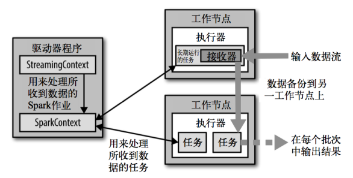
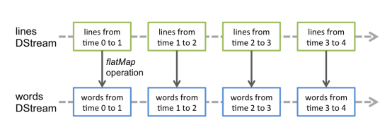

# 概述

- Spark Streaming用于流式数据的处理
- Spark Streaming支持的数据输入源很多
  - 如：Kafka、Flume、Twitter、ZeroMQ和简单的TCP套接字等
  - 数据输入后可用Spark的高度抽象原语如：map、reduce、join、window等进行运算
  - 结果也能保存在很多地方
    - 如HDFS，数据库等


- DStream

  - 和Spark基于RDD的概念很相似，Spark Streaming使用离散化流作为抽象表示

  - discretized stream

  - 随时间推移而收到的数据的序列

  - 在内部每个时间区间收到的数据都作为 RDD 存在，而DStream是由这些RDD所组成的序列

  - 离散化

    

## 特点

- 易用

- 容错

- 易整合到Spark体系

  

## 架构




# Dstream入门


## wordCount

- 安装netcat
- 启动netcat服务，在9999端口进行运行

```bash
[ttshe@hadoop102 data]$ nc -lk 9999
hello
hello
```

- 代码

```scala
package com.stt.spark.streaming

import org.apache.spark.SparkConf
import org.apache.spark.streaming.dstream.{DStream, ReceiverInputDStream}
import org.apache.spark.streaming.{Seconds, StreamingContext}

object Ch01_WordCount {
    def main(args: Array[String]): Unit = {
		// 注意不要使用local和local[1]执行
        var conf = new SparkConf().setMaster("local[*]").setAppName("Ch01_WordCount")
        // 3s读取一次
        val context: StreamingContext = new StreamingContext(conf,Seconds(3))
        // 监听指定的端口，3s读取一次数据
        // 返回接收器
        val dstream: ReceiverInputDStream[String] = context.socketTextStream("hadoop102",9999)
        // 将读取的数据扁平化
        val wordStream: DStream[String] = dstream.flatMap(_.split(" "))

        val tupleDstream: DStream[(String, Int)] = wordStream.map(w=>(w,1))

        val result: DStream[(String, Int)] = tupleDstream.reduceByKey(_ + _)

        result.print

        // 开启接收器
        context.start()

        // main的是driver，需要一直启动，等待接收器执行
        context.awaitTermination()
    }
}
```

- 无记忆性，不进行累计结果
- 注意：如果程序运行时，log日志太多，可以将spark conf目录下的log4j文件里面的日志级别改成WARN


## 分析

Discretized Stream是Spark Streaming的基础抽象，代表持续性的数据流和经过各种Spark原语操作后的结果数据流

在内部实现上，DStream是一系列连续的RDD来表示

每个RDD含有一段时间间隔内的数据


- 对数据的操作也是按照RDD为单位来进行的



- 计算过程由Spark engine来完成


# Dstream创建-数据源

- Spark Streaming原生支持一些不同的数据源
- 一些“核心”数据源已经被打包到Spark Streaming 的 Maven 工件中，其他的一些则通过 spark-streaming-kafka 等附加工件获取
- 每个接收器都以 Spark 执行器程序中一个长期运行任务的形式执行，会占据分配给应用的 CPU 核心
  - 还需要有可用的 CPU 核心来处理数据
  - 如果要运行多个接收器，就必须至少有
    - ==接收器数目相同的核心数+用来完成计算所需要的核心数==
    - 如要在流计算应用中运行 10 个接收器，那么至少需要为应用分配 11 个 CPU 核心
    - 如在本地模式运行，不要使用local[1]


## 文件数据源

- 文件数据流

  - 能够读取所有HDFS API兼容的文件系统文件，通过fileStream方法进行读取
  - Spark Streaming 将会监控 dataDirectory 目录并不断处理移动进来的文件

- 注意

  - 目前不支持嵌套目录

  - 文件需要有相同的数据格式

  - 文件进入 dataDirectory的方式需要通过移动或者重命名来实现

  - 一旦文件移动进目录，则不能再修改，即便修改了也不会读取新数据

    

### 示例

- 从hdfs上读取变化的文件
- 创建目录与文件

```bash
[ttshe@hadoop102 data]$ vim a.txt
[ttshe@hadoop102 data]$ vim b.txt
[ttshe@hadoop102 data]$ cp a.txt c.txt
[ttshe@hadoop102 data]$ hadoop fs -mkdir /fileStream
```

- 执行代码

```scala
package com.stt.spark.streaming

import org.apache.spark.SparkConf
import org.apache.spark.streaming.{Seconds, StreamingContext}
import org.apache.spark.streaming.dstream.{DStream, ReceiverInputDStream}

object Ch02_FileSource {
    def main(args: Array[String]): Unit = {

        var conf = new SparkConf().setMaster("local[*]").setAppName("Ch02_FileSource")
        // 5s读取一次
        val context: StreamingContext = new StreamingContext(conf,Seconds(5))
        // 监听指定的文件夹，5s读取一次数据
        val dstream: DStream[String] = context.textFileStream("hdfs://hadoop102:9000/fileStream")
        // 将读取的数据扁平化
        val wordStream: DStream[String] = dstream.flatMap(_.split(" "))

        val tupleDstream: DStream[(String, Int)] = wordStream.map(w=>(w,1))

        val result: DStream[(String, Int)] = tupleDstream.reduceByKey(_ + _)

        result.print

        // 开启接收器
        context.start()

        // main的是driver，需要一直启动，等待接收器执行
        context.awaitTermination()
    }
}
```

- 移动文件到hdfs上
  - 注意启动完spark之后在移动文件

```bash
[ttshe@hadoop102 data]$ hadoop fs -put ./a.txt /fileStream
[ttshe@hadoop102 data]$ hadoop fs -put ./b.txt /fileStream
[ttshe@hadoop102 data]$ hadoop fs -put ./c.txt /fileStream
```

- 注意
  - 文件夹所在系统的时间和程序运行的时间要一致
  - 文件夹内的文件新增更新使用流，复制和移动有时无效


## RDD队列（了解）

- 测试过程中，可以通过使用ssc.queueStream(queueOfRDDs)来创建DStream
- 每一个推送到这个队列中的RDD，都会作为一个DStream处理

- 示例

```scala
package com.stt.spark.streaming

import org.apache.spark.SparkConf
import org.apache.spark.rdd.RDD
import org.apache.spark.streaming.{Seconds, StreamingContext}
import org.apache.spark.streaming.dstream.{DStream, InputDStream}

import scala.collection.mutable


object Ch03_QueueSource {
    def main(args: Array[String]): Unit = {

        var conf = new SparkConf().setMaster("local[*]").setAppName("Ch03_QueueSource")
        // 5s读取一次
        val context: StreamingContext = new StreamingContext(conf,Seconds(5))

        // 创建RDD队列
        var queueSource = new mutable.Queue[RDD[Int]]()

        // 第二个参数默认true，表示一次从队列里面取一个
        //    val dstream: InputDStream[Int] = context.queueStream(queueSource)
        // 设置false，则从队列中取出全部
        val dstream: InputDStream[Int] = context.queueStream(queueSource,false)
        // 求和
        dstream.reduce(_ + _).print()
        // 开启接收器
        context.start()

        // 循环创建并向RDD队列中放入RDD
        // 向队列中放入5个RDD[Int]
        for(i<- 1 to 5){
            // val value: RDD[Int] = context.sparkContext.makeRDD(1 to 5)
            // 等价于
            val value: RDD[Int] = context.sparkContext.makeRDD(Array(1,2,3,4,5))
            queueSource += value
            //      Thread.sleep(2000)
        }

        // main的是driver，需要一直启动，等待接收器执行
        // block，此处阻塞
        context.awaitTermination()
    	// 在阻塞后面添加代码，在driver结束后才会执行
    }
}
```


## 自定义数据源

- 需要继承Receiver，并实现onStart、onStop方法来自定义数据源采集

### 示例

- 自定义数据源，实现监控某个端口号，获取该端口号内容

```scala
package com.stt.spark.streaming

import java.io.{BufferedReader, IOException, InputStreamReader}
import java.net.Socket
import java.nio.charset.StandardCharsets

import org.apache.spark.SparkConf
import org.apache.spark.storage.StorageLevel
import org.apache.spark.streaming.dstream.ReceiverInputDStream
import org.apache.spark.streaming.receiver.Receiver
import org.apache.spark.streaming.{Seconds, StreamingContext}

import scala.util.control.Breaks

object ReceiverSource {
    def main(args: Array[String]): Unit = {
        var conf = new SparkConf().setMaster("local[*]").setAppName("Ch03_QueueSource")
        // 5s读取一次
        val context: StreamingContext = new StreamingContext(conf,Seconds(5))

        val dStream: ReceiverInputDStream[String] = context.receiverStream(new SocketReceiver("hadoop102",9999))

        dStream.flatMap(_.split(" ")).map(w=>(w,1)).reduceByKey(_ + _).print

        // 开启接收器
        context.start()

        // main的是driver，需要一直启动，等待接收器执行
        context.awaitTermination()
    }
}

class SocketReceiver(host:String,port:Int) extends Receiver[String](StorageLevel.MEMORY_ONLY){

    def receive(): Unit = {
        var runFlag = true
        // 如果服务器没有开启，需要等待
        try{
            val socket = new Socket(host,port)
            val reader = new BufferedReader(new InputStreamReader(socket.getInputStream(),StandardCharsets.UTF_8))
            var line = ""
            // 当receiver没有关闭并且输入数据不为空，则循环发送数据给Spark
            // 网络流当中 socket是没有结尾的，readLine是不会获取null的
            // 一般的处理方式为数据的传递和数据的接收要统一规范
            // 类似自定义协议，可以使用--END表示流结束
            Breaks.breakable{
                while((line=reader.readLine())!=null && !isStopped()){
                    if("--END".equals(line)){
                        Breaks.break()
                    }
                    store(line)
                }
            }
            reader.close()
            // 添加该socket.close可能会出错，等同于装饰者模式，socket已经关了
            // socket.close()

            //        restart("restart")
        }catch {
            case e: IOException => {
                runFlag = false
            }
        }

        if(runFlag == false){
            Thread.sleep(1000)
            return
        }
    }

    override def onStart(): Unit = {
        new Thread(){
            override def run(): Unit = {
                while(true){
                    receive()
                }
            }
        }.start()
    }
    override def onStop(): Unit = {
    }
}
```

- 开启netcat

```scala
[ttshe@hadoop102 data]$ nc -lk 9999
hello
you
--END
```


## Kafka数据源（重点）

- 在工程中需要引入 Maven 工件 spark- streaming-kafka_2.10
  - 包内提供的 KafkaUtils 对象可以在 StreamingContext 和 JavaStreamingContext 中以你的 Kafka 消息创建出 DStream。由于 KafkaUtils 可以订阅多个主题，因此它创建出的 DStream 由成对的主题和消息组成。要创建出一个流数据，需要使用 StreamingContext 实例、一个由逗号隔开的 ZooKeeper 主机列表字符串、消费者组的名字(唯一名字)，以及一个从主题到针对这个主题的接收器线程数的映射表来调用 createStream() 方法

### pom

```xml
<!--参考官方文档获取适合的jar包版本-->
<dependency>
    <groupId>org.apache.spark</groupId>
    <artifactId>spark-streaming-kafka-0-8_2.11</artifactId>
    <version>2.1.1</version>
</dependency>
<dependency>
    <groupId>org.apache.kafka</groupId>
    <artifactId>kafka-clients</artifactId>
    <version>0.11.0.2</version>
</dependency>
```


### 示例

- 通过SparkStreaming从Kafka读取数据，并将读取过来的数据做简单计算(WordCount)，最终打印到控制台
- 写法1，0.10版本

```scala
package com.atguigu

import kafka.serializer.StringDecoder
import org.apache.kafka.clients.consumer.ConsumerConfig
import org.apache.spark.SparkConf
import org.apache.spark.rdd.RDD
import org.apache.spark.storage.StorageLevel
import org.apache.spark.streaming.dstream.ReceiverInputDStream
import org.apache.spark.streaming.kafka.KafkaUtils
import org.apache.spark.streaming.{Seconds, StreamingContext}

object KafkaSparkStreaming {

  def main(args: Array[String]): Unit = {

    //1.创建SparkConf并初始化SSC
    val sparkConf: SparkConf = new SparkConf().setMaster("local[*]").setAppName("KafkaSparkStreaming")
    val ssc = new StreamingContext(sparkConf, Seconds(5))

    //2.定义kafka参数
    val brokers = "hadoop102:9092,hadoop103:9092,hadoop104:9092"
    val topic = "source"
    val consumerGroup = "spark"

    //3.将kafka参数映射为map
    val kafkaParam: Map[String, String] = Map[String, String](
      ConsumerConfig.KEY_DESERIALIZER_CLASS_CONFIG -> "org.apache.kafka.common.serialization.StringDeserializer",
      ConsumerConfig.VALUE_DESERIALIZER_CLASS_CONFIG -> "org.apache.kafka.common.serialization.StringDeserializer",
      ConsumerConfig.GROUP_ID_CONFIG -> consumerGroup,
      ConsumerConfig.BOOTSTRAP_SERVERS_CONFIG -> brokers
    )

    //4.通过KafkaUtil创建kafkaDSteam
    val kafkaDSteam: ReceiverInputDStream[(String, String)] = KafkaUtils.createStream[String, String, StringDecoder, StringDecoder](
      ssc,
      kafkaParam,
      Set(topic),
      StorageLevel.MEMORY_ONLY
    )

    //5.对kafkaDSteam做计算（WordCount）
    kafkaDSteam.foreachRDD {
      rdd => {
        val word: RDD[String] = rdd.flatMap(_._2.split(" "))
        val wordAndOne: RDD[(String, Int)] = word.map((_, 1))
        val wordAndCount: RDD[(String, Int)] = wordAndOne.reduceByKey(_ + _)
        wordAndCount.collect().foreach(println)
      }
    }

    //6.启动SparkStreaming
    ssc.start()
    ssc.awaitTermination()
  }
}
```

- 写法2，0.8版本

```scala
package com.stt.spark.streaming

import kafka.serializer.StringDecoder
import org.apache.kafka.clients.consumer.ConsumerConfig
import org.apache.spark.SparkConf
import org.apache.spark.storage.StorageLevel
import org.apache.spark.streaming.{Seconds, StreamingContext}
import org.apache.spark.streaming.dstream.ReceiverInputDStream
import org.apache.spark.streaming.kafka.KafkaUtils

object Ch05_KafkaSource {

    def main(args: Array[String]): Unit = {

        var conf = new SparkConf().setMaster("local[*]").setAppName("Ch04_ReceiverSource")

        // 5s读取一次
        val context: StreamingContext = new StreamingContext(conf,Seconds(5))

        // kafka数据源
        val dStream: ReceiverInputDStream[(String, String)] = KafkaUtils.createStream[String,String,StringDecoder,StringDecoder](
            context,
            Map(
                //        ConsumerConfig.BOOTSTRAP_SERVERS_CONFIG -> "hadoop102:9092", // 0.8版本必须连接zookeeper
                "zookeeper.connect" -> "hadoop102:2181",
                ConsumerConfig.GROUP_ID_CONFIG -> "spark",
                ConsumerConfig.KEY_DESERIALIZER_CLASS_CONFIG -> "org.apache.kafka.common.serialization.StringDeserializer",
                ConsumerConfig.VALUE_DESERIALIZER_CLASS_CONFIG -> "org.apache.kafka.common.serialization.StringDeserializer"

            ),
            Map(
                "spark-topic" -> 3
            ),
            StorageLevel.MEMORY_ONLY
        )

        dStream.map(t=>(t._2,1)).reduceByKey(_ + _).print()

        // 开启接收器
        context.start()

        // main的是driver，需要一直启动，等待接收器执行
        context.awaitTermination()
    }

}
```

- 创建topic

```bash
[ttshe@hadoop102 bin]$ kf.sh start
[ttshe@hadoop102 bin]$ cd /opt/module/kafka
[ttshe@hadoop102 kafka]$ bin/kafka-topics.sh --zookeeper hadoop102:2181 --create --topic spark-topic --partitions 2 --replication-factor 2
Created topic "spark-topic".
```

- 创建生产者

```bash
[ttshe@hadoop102 kafka]$ bin/kafka-console-producer.sh --broker-list hadoop102:9092 --topic spark-topic
>
```

- 启动消费者


# Dstream 转换

- DStream上的原语与RDD的类似，分为
  - Transformations（转换）
  - Output Operations（输出）
- 此外转换操作中还有一些比较特殊的原语
  - 如：updateStateByKey()、transform()以及各种Window相关的原语


## 无状态转换

无状态转化操作就是把简单的RDD转化操作应用到每个批次上，也就是转化DStream中的每一个RDD。部分无状态转化操作列在了下表中。注意，针对键值对的DStream转化操作(比如 reduceByKey())要添加import StreamingContext._才能在Scala中使用


需要记住的是，尽管这些函数看起来像作用在整个流上一样，但事实上每个DStream在内部是由许多RDD(批次)组成，且无状态转化操作是分别应用到每个RDD上的。例如，reduceByKey()会归约每个时间区间中的数据，但不会归约不同区间之间的数据。 

举个例子，在之前的wordcount程序中，我们只会统计5秒内接收到的数据的单词个数，而不会累加。 

无状态转化操作也能在多个DStream间整合数据，不过也是在各个时间区间内。例如，键 值对DStream拥有和RDD一样的与连接相关的转化操作，也就是cogroup()、join()、leftOuterJoin() 等。我们可以在DStream上使用这些操作，这样就对每个批次分别执行了对应的RDD操作。

我们还可以像在常规的Spark 中一样使用 DStream的union() 操作将它和另一个DStream 的内容合并起来，也可以使用StreamingContext.union()来合并多个流


## 有状态转换（重点）

- 本质上是将各个结果存储在checkPoint上


### updateStateByKey

- SparkStreaming自动将状态保存在checkPoint上
- UpdateStateByKey原语用于记录历史记录
  - 需要在 DStream 中跨批次维护状态
    - 如流计算中累加wordcount
  - 针对这种情况updateStateByKey() 提供了对一个状态变量的访问，用于==键值对形式的 DStream==
  - 给定一个由(键，事件)对构成的 DStream，并传递一个指定如何根据新的事件更新每个键对应状态的函数，构建出一个新的 DStream，其内部数据为(键，状态) 对 
- updateStateByKey() 的结果会是一个新的 DStream
  - 内部的 RDD 序列是由每个时间区间对应的(键，状态)对组成的
- updateStateByKey操作可以在用新信息进行更新时保持任意的状态
- 使用这个功能需要做下面两步
  - 定义状态，状态可以是一个任意的数据类型
  - 定义状态更新函数，用此函数阐明如何使用之前的状态和来自输入流的新值对状态进行更新
- **使用updateStateByKey需要对检查点目录进行配置，会使用检查点来保存状态**。
- 示例：更新版的wordcount

```scala
package com.stt.spark.streaming
import org.apache.spark.SparkConf
import org.apache.spark.streaming.{Seconds, StreamingContext}
import org.apache.spark.streaming.dstream.{DStream, ReceiverInputDStream}

object Ch06_StateRDD_updateStateByKey {
    def main(args: Array[String]): Unit = {

        var conf = new SparkConf().setMaster("local[2]").setAppName("Ch06_StateRDD")
        // 3s读取一次
        val context: StreamingContext = new StreamingContext(conf, Seconds(3))
        // 监听指定的端口，3s读取一次数据
        // 返回接收器
        val dstream: ReceiverInputDStream[String] = context.socketTextStream("hadoop102", 9999)
        // 将读取的数据扁平化
        val wordStream: DStream[String] = dstream.flatMap(_.split(" "))

        val tupleDstream: DStream[(String, Int)] = wordStream.map(w => (w, 1))

        // 无状态
        //val result: DStream[(String, Int)] = tupleDstream.reduceByKey(_ + _)

        // 将RDD转换为有状态，必须设置检查点
        context.sparkContext.setCheckpointDir("data/spark/streaming")

        // buffer 是sparkStreaming自动放入检查点的数据，操作后再放入检查点
        // datas是wordStream中元组的_2的数组
        val re: DStream[(String, Int)] = tupleDstream.updateStateByKey(
            (datas: Seq[Int], buffer: Option[Int]) => {
                // 原先有结果取出
                var result: Int = buffer.getOrElse(0)
                var sum = result + datas.sum
                // 返回新的buffer
                Option(sum)
            }
        )

        re.print
        // 开启接收器
        context.start()

        // main的是driver，需要一直启动，等待接收器执行
        context.awaitTermination()
    }
}
```


### window Operations

- 设置窗口的大小和滑动窗口的间隔来动态的获取当前Steaming的允许状态
- 基于窗口的操作会在一个比 StreamingContext 的批次间隔更长的时间范围内，通过整合多个批次的结果，计算出整个窗口的结果


- 所有基于窗口的操作都需要两个参数
  - 窗口时长
  - 滑动步长
  - ==两者都必须是 StreamContext 的批次间隔的整数倍==

窗口时长控制每次计算最近的多少个批次的数据，其实就是最近的 windowDuration/batchInterval 个批次。如果有一个以 10 秒为批次间隔的源 DStream，要创建一个最近 30 秒的时间窗口(即最近 3 个批次)，就应当把 windowDuration 设为 30 秒。而滑动步长的默认值与批次间隔相等，用来控制对新的 DStream 进行计算的间隔。如果源 DStream 批次间隔为 10 秒，并且我们只希望每两个批次计算一次窗口结果， 就应该把滑动步长设置为 20 秒。 

假设，你想拓展前例从而每隔十秒对持续30秒的数据生成word count。为做到这个，我们需要在持续30秒数据的(word,1)对DStream上应用reduceByKey。使用操作reduceByKeyAndWindow

```scala
# reduce last 30 seconds of data, every 10 second
windowedWordCounts = pairs.reduceByKeyAndWindow(lambda x, y: x + y, lambda x, y: x -y, 30, 20)
```


- 关于Window的操作有如下原语
  - window(windowLength, slideInterval): 基于对源DStream窗化的批次进行计算返回一个新的Dstream
  - countByWindow(windowLength, slideInterval)：返回一个滑动窗口计数流中的元素
  - reduceByWindow(func, windowLength, slideInterval)：通过使用自定义函数整合滑动区间流元素来创建一个新的单元素流
  - reduceByKeyAndWindow(func, windowLength, slideInterval, [numTasks])：当在一个(K,V)对的DStream上调用此函数，会返回一个新(K,V)对的DStream，此处通过对滑动窗口中批次数据使用reduce函数来整合每个key的value值。Note:默认情况下，这个操作使用Spark的默认数量并行任务(本地是2)，在集群模式中依据配置属性(spark.default.parallelism)来做grouping。你可以通过设置可选参数numTasks来设置不同数量的tasks
  - reduceByKeyAndWindow(func, invFunc, windowLength, slideInterval, [numTasks])：这个函数是上述函数的更高效版本，每个窗口的reduce值都是通过用前一个窗的reduce值来递增计算。通过reduce进入到滑动窗口数据并”反向reduce”离开窗口的旧数据来实现这个操作。一个例子是随着窗口滑动对keys的“加”“减”计数。通过前边介绍可以想到，这个函数只适用于”可逆的reduce函数”，也就是这些reduce函数有相应的”反reduce”函数(以参数invFunc形式传入)。如前述函数，reduce任务的数量通过可选参数来配置
    - 注意：为了使用这个操作，检查点必须可用
  - countByValueAndWindow(windowLength,slideInterval, [numTasks])：对(K,V)对的DStream调用，返回(K,Long)对的新DStream，其中每个key的值是其在滑动窗口中频率。如上，可配置reduce任务数量
  - reduceByWindow() 和 reduceByKeyAndWindow() 让我们可以对每个窗口更高效地进行归约操作。它们接收一个归约函数，在整个窗口上执行，比如 +。除此以外，它们还有一种特殊形式，通过只考虑新进入窗口的数据和离开窗口的数据，让 Spark 增量计算归约结果。这种特殊形式需要提供归约函数的一个逆函数，比 如 + 对应的逆函数为 -。对于较大的窗口，提供逆函数可以大大提高执行效率


```scala
val ipDStream = accessLogsDStream.map(logEntry => (logEntry.getIpAddress(), 1))
val ipCountDStream = ipDStream.reduceByKeyAndWindow(
    {(x, y) => x + y},
    {(x, y) => x - y},
    Seconds(30),
    Seconds(10))
// 加上新进入窗口的批次中的元素 // 移除离开窗口的老批次中的元素 // 窗口时长// 滑动步长
```

countByWindow()和countByValueAndWindow()作为对数据进行计数操作的简写。countByWindow()返回一个表示每个窗口中元素个数的DStream，而countByValueAndWindow()返回的DStream则包含窗口中每个值的个数

```scala
val ipDStream = accessLogsDStream.map{entry => entry.getIpAddress()}
val ipAddressRequestCount = ipDStream.countByValueAndWindow(Seconds(30), Seconds(10)) 
val requestCount = accessLogsDStream.countByWindow(Seconds(30), Seconds(10))
```

- WordCount第三版：3秒一个批次，窗口12秒，滑步6秒

```scala
package com.atguigu.streaming

import org.apache.spark.SparkConf
import org.apache.spark.streaming.{Seconds, StreamingContext}

object WorldCount {

    def main(args: Array[String]) {

        // 定义更新状态方法，参数values为当前批次单词频度，state为以往批次单词频度
        val updateFunc = (values: Seq[Int], state: Option[Int]) => {
            val currentCount = values.foldLeft(0)(_ + _)
            val previousCount = state.getOrElse(0)
            Some(currentCount + previousCount)
        }

        val conf = new SparkConf().setMaster("local[2]").setAppName("NetworkWordCount")
        val ssc = new StreamingContext(conf, Seconds(3))
        ssc.checkpoint(".")

        // Create a DStream that will connect to hostname:port, like localhost:9999
        val lines = ssc.socketTextStream("hadoop102", 9999)

        // Split each line into words
        val words = lines.flatMap(_.split(" "))

        //import org.apache.spark.streaming.StreamingContext._ // not necessary since Spark 1.3
        // Count each word in each batch
        val pairs = words.map(word => (word, 1))

        val wordCounts = pairs.reduceByKeyAndWindow((a:Int,b:Int) => (a + b),Seconds(12), Seconds(6))

        // Print the first ten elements of each RDD generated in this DStream to the console
        wordCounts.print()

        ssc.start()             // Start the computation
        ssc.awaitTermination()  // Wait for the computation to terminate
        //ssc.stop()
    }

}
```

#### 示例

- 用法1

```scala
package com.stt.spark.streaming

import org.apache.spark.SparkConf
import org.apache.spark.streaming.{Seconds, StreamingContext}
import org.apache.spark.streaming.dstream.{DStream, ReceiverInputDStream}

object Ch07_Window {
    def main(args: Array[String]): Unit = {

        var conf = new SparkConf().setMaster("local[2]").setAppName("Ch07_Window")
        // 3s读取一次
        val context: StreamingContext = new StreamingContext(conf, Seconds(3))
        // 监听指定的端口，3s读取一次数据
        // 返回接收器
        val dstream: ReceiverInputDStream[String] = context.socketTextStream("hadoop102", 9999)
        // 将读取的数据扁平化
        val wordStream: DStream[String] = dstream.flatMap(_.split(" "))

        val tupleDstream: DStream[(String, Int)] = wordStream.map(w => (w, 1))

        // 窗口操作
        val re: DStream[(String, Int)] = tupleDstream.reduceByKeyAndWindow(
            (v1:Int,v2:Int)=>(v1+v2), // 具体操作
            Seconds(9), // 窗口大小
            Seconds(3) // 窗口每次滑动距离
        )

        re.print
        // 开启接收器
        context.start()

        // main的是driver，需要一直启动，等待接收器执行
        context.awaitTermination()
    }
}
```

- 使用2

```scala
package com.stt.spark.streaming

import org.apache.spark.SparkConf
import org.apache.spark.streaming.{Seconds, StreamingContext}
import org.apache.spark.streaming.dstream.{DStream, ReceiverInputDStream}

object Ch07_Window {
    def main(args: Array[String]): Unit = {

        var conf = new SparkConf().setMaster("local[2]").setAppName("Ch07_Window")
        // 3s读取一次
        val context: StreamingContext = new StreamingContext(conf, Seconds(3))
        // 监听指定的端口，3s读取一次数据
        // 返回接收器
        val dstream: ReceiverInputDStream[String] = context.socketTextStream("hadoop102", 9999)
        // 将读取的数据扁平化
        val wordStream: DStream[String] = dstream.flatMap(_.split(" "))

        val tupleDstream: DStream[(String, Int)] = wordStream.map(w => (w, 1))

        // 进行抽口逆向操作需要检查点
        context.sparkContext.setCheckpointDir("data/spark/streaming")

        val re: DStream[(String, Int)] = tupleDstream.reduceByKeyAndWindow(
            (v1:Int,v2:Int)=>(v1+v2), // 具体操作
            (v1:Int,v2:Int)=>(v1-v2), // 窗口的逆向处理函数，将之前的数据做减法处理，需要checkPoint支持,提供该函数属于用法1的优化，减少重复计算量
            Seconds(9), // 窗口大小
            Seconds(3) // 窗口每次滑动距离
        )
        re.print
        // 开启接收器
        context.start()
        // main的是driver，需要一直启动，等待接收器执行
        context.awaitTermination()
    }
}
```


## 其他


### Transform

- Transform原语允许DStream上执行任意的RDD-to-RDD函数
  - 即使这些函数并没有在DStream的API中暴露出来，通过该函数可以方便的扩展Spark API
  - 该函数每一批次调度一次
  - 其实是对DStream中的RDD应用转换

- 如在进行单词统计的时候，想要过滤掉spam的信息

```scala
val spamInfoRDD = ssc.sparkContext.newAPIHadoopRDD(...) // RDD containing spam information

val cleanedDStream = wordCounts.transform { rdd =>
    rdd.join(spamInfoRDD).filter(...) // join data stream with spam information to do data cleaning
    ...
}
```


### Join

- 连接操作（leftOuterJoin, rightOuterJoin, fullOuterJoin也可以）

- 可连接Stream-Stream，windows-stream to windows-stream、stream-dataset

#### Stream-Stream Joins

```scala
val stream1: DStream[String, String] = ...
val stream2: DStream[String, String] = ...
val joinedStream = stream1.join(stream2)

val windowedStream1 = stream1.window(Seconds(20))
val windowedStream2 = stream2.window(Minutes(1))
val joinedStream = windowedStream1.join(windowedStream2)
```

#### Stream-dataset joins

```scala
val dataset: RDD[String, String] = ...
val windowedStream = stream.window(Seconds(20))...
val joinedStream = windowedStream.transform { rdd => rdd.join(dataset) }
```


# Dstream 输出

- 输出操作指定了对流数据经转化操作得到的数据所要执行的操作(例如把结果推入外部数据库或输出到屏幕上)。与RDD中的惰性求值类似，如果一个DStream及其派生出的DStream都没有被执行输出操作，那么这些DStream就都不会被求值。如果StreamingContext中没有设定输出操作，整个context就都不会启动

- 输出操作如下
  - print()：在运行流程序的驱动结点上打印DStream中每一批次数据的最开始10个元素。这用于开发和调试。在Python API中，同样的操作叫print()
  - saveAsTextFiles(prefix, [suffix])：以text文件形式存储这个DStream的内容。每一批次的存储文件名基于参数中的prefix和suffix。”prefix-Time_IN_MS[.suffix]”.
  - saveAsObjectFiles(prefix, [suffix])：以Java对象序列化的方式将Stream中的数据保存为 SequenceFiles . 每一批次的存储文件名基于参数中的为"prefix-TIME_IN_MS[.suffix]". Python中目前不可用
  - saveAsHadoopFiles(prefix, [suffix])：将Stream中的数据保存为 Hadoop files. 每一批次的存储文件名基于参数中的为"prefix-TIME_IN_MS[.suffix]"。
    Python API Python中目前不可用
  - foreachRDD(func)：这是最通用的输出操作，即将函数 func 用于产生于 stream的每一个RDD。其中参数传入的函数func应该实现将每一个RDD中数据推送到外部系统，如将RDD存入文件或者通过网络将其写入数据库。注意：函数func在运行流应用的驱动中被执行，同时其中一般函数RDD操作从而强制其对于流RDD的运算
  - 通用的输出操作foreachRDD()，它用来对DStream中的RDD运行任意计算。这和transform() 有些类似，都可以让我们访问任意RDD。在foreachRDD()中，可以重用我们在Spark中实现的所有行动操作

- 如把数据写到诸如MySQL的外部数据库中
  - ==注意==
    - 连接不能写在driver层面
      - 由于数据库连接不能进行序列化传递
    - 如果写在foreach则每个RDD都创建，得不偿失
      - 在每个foreach中建立连接，性能下降，浪费资源
    - 增加foreachPartition，在分区创建
      - 在分区内创建数据连接，每个分区使用一个连接资源可接受

