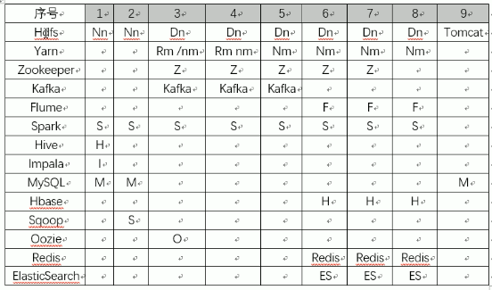
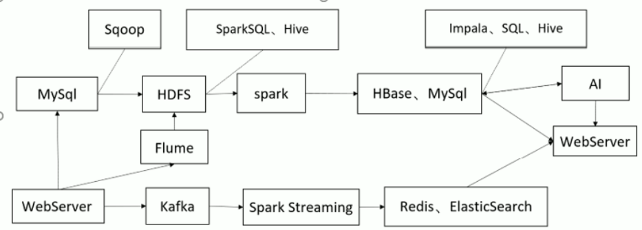

# 集群配置

## 硬件要求

| cpu      | 16核   |
| -------- | ------ |
| 内存     | 64G    |
| 硬盘     | 10T    |
| 机器数量 | 9      |
| 带宽     | 100M/s |
|          |        |

## 服务器系统

CentOS 7.5

## 集群安装

- 安装方式CDH6.2.0
- 官方推荐配置

|                      | core  | Memory(G) | Disk(T) |
| -------------------- | ----- | --------- | ------- |
| Cloudera Manager     | 6     | 8         | 1.5     |
| Flume                | 3     | 1-4       | 1       |
| HDFS                 | 4     | 4         | 10      |
| HBase                | 4     | 16        | 2       |
| Hive                 | 4     | 16        | 1       |
| Hue                  | 1     | 14-10     | 1       |
| Impala               | 16    | 32-128    | 1       |
| Kafka                | 12-24 | 64        | 2       |
| Oozie                |       | 4-8       |         |
| Search               | 4-16  | 16-96     | 2       |
| Spark History Server | 1     | 1         | 1       |
| Yarn                 | 32-64 | 6         |         |
| Hive on Spark        | 16-32 | 4-8       |         |
| Zookeeper            | 4     | 1         |         |

## 服务器角色分配

# 架构流程

