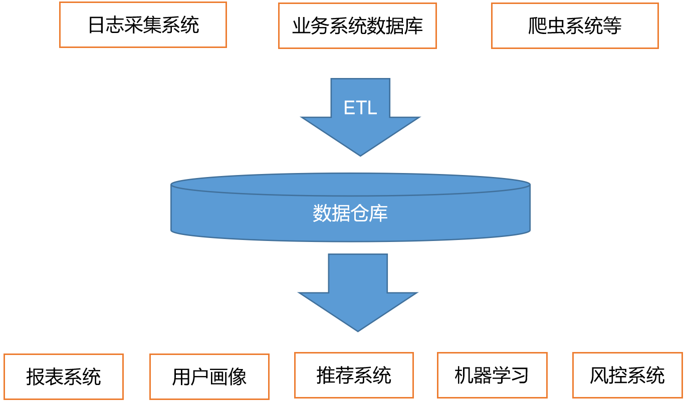
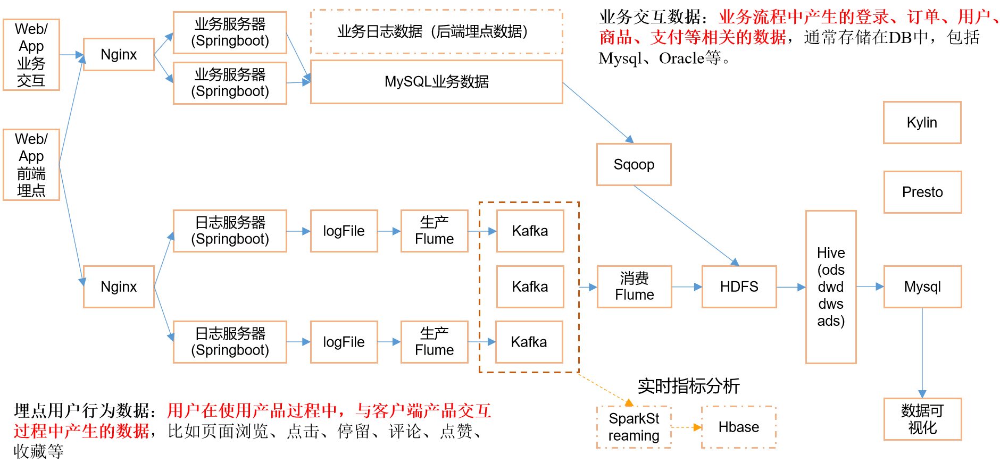

# 数据仓库概念

 

- 数据仓库
  - Data Warehouse
  - ==为企业所有决策制定过程提供所有系统数据支持的战略集合==
  - 通过对数据仓库中的数据分析，帮助企业==改进业务流程，控制成本，提高产品质量==
  - 给数据最终目的做准备，对数据进行
    - 清洗
    - 转义
    - 分类
    - 重组
    - 合并
    - 拆分
    - 统计等

# 项目需求

- 数据==采集平台的搭建==

- 实现==用户行为数据仓库==的==分层==搭建
  - 数据来源，日志
- 实现==业务数据仓库==的==分层==搭建
  - 数据来源业务数据库，mysql
- 对数据仓库的数据进行报表分析
  - 留存：用户在平台的留存率
  - 转化率：用户在订单，支付的转化比例
  - GMV：每日的交易额
  - 复购率：购买多次的用户有多少
  - 活跃：在网站的每日的人数
- 思考
  - 技术如何选型？
  - 框架版本如何选择（Apache，CDH，HDP）
  - 服务器使用**物理机**还是**云主机**
  - 如何确认==集群规模==？
    - 假设每台服务器8T硬盘

# 项目框架

## 技术选型

- 数据采集传输
  - ==Flume，Kafka，Sqoop==，Logstash，DataX
    - DataX和Sqoop功能类似，市场占用率各50%
    - Sqoop负责导入Mysql数据
- 数据存储
  - ==MySql，HDFS==，HBase，Redis，MongoDB
    - MySql数据存储量小，查询快
      - 存储最终的结果，用于显示
    - HDFS数据量大，查询慢
    - HBase和Kylin使用，实时项目查询使用，即席查询
    - MongoDB一般用于存储爬虫的结果数据
- 数据计算
  - ==Hive，Tez，Spark==，Flink，Storm
    - Hive底层使用的MR，速度慢
      - 如果要分析一周以上的数据，采用Hive的MR，可以查询出来
    - Hive可以使用Tez引擎，在内存中计算，速度快
      - 数据量不大的情况下使用Tez，速度快
    - Spark也是基于内存进行计算的
    - Flink在实时处理有优势，未来的主流
- 数据查询
  - ==Presto，Druid==，Impala，Kylin
    - Presto和Impala是同类型的框架
    - Druid和Kylin都是基于预计算类型
      - Druid处理实时比Kylin快
      - Druid也有预计算，是输入一批数据就进行预计算，有偏差
      - Kylin对所有的数据进行预计算

## 系统数据流程

注意：将flume产生的数据放在下级的Kafka

- 用于消峰
- 用于扩展
  - 有些业务线可能不需要flume，直接建立一个kafka节点即可
  - 如从Druid的数据直接给kafka，也可以进入到HDFS

- 思考Sqoop导入数据一半时，宕机，如何保证数据最后上传到HDFS

- Hive数仓分为4层
- Hive的最终分析的结果导入到MySql中

- Kylin和Presto用于即时查询Hive
- 实时查询
  - SparkStreaming从kafka中获取数据进行计算
  - Druid从kafka直接读取数据进行消费
  - clickHouse同Druid一样从kafka直接获取数据

## 框架版本选型

- 如何选择Apache、CDH、HDP版本？
  - Apache
    - 运维麻烦
    - 组件兼容性需要自己调研
    - 一般大厂使用，技术实力雄厚，有专业运维人员
  - CDH
    - 国内使用最多版本
    - CM不开源
    - 在中小型公司使用
    - 建议使用
  - HDP
    - 开源，可二次开发
    - 没有CDH稳定
    - 国内较少使用

- 具体版本型号
- Apache框架版本

| **产品**          | **版本**  |
| ----------------- | --------- |
| **Hadoop**        | ==2.7.2== |
| **Flume**         | ==1.7.0== |
| **Kafka**         | 0.11.0.2  |
| **Kafka Manager** | 1.3.3.22  |
| **Hive**          | ==1.2.1== |
| **Sqoop**         | 1.4.6     |
| **MySQL**         | 5.6.24    |
| **Azkaban**       | 2.5.0     |
| **Java**          | 1.8       |
| **Zookeeper**     | 3.4.10    |
| **Presto**        | 0.189     |

- CDH框架版本：5.12.1

| **产品**      | **版本**                       |
| ------------- | ------------------------------ |
| **Hadoop**    | ==2.6.0==                      |
| **Spark**     | ==1.6.0==，需要自己升级到2.1.0 |
| **Flume**     | ==1.6.0==                      |
| **Hive**      | ==1.1.0==                      |
| **Sqoop**     | 1.4.6                          |
| **Oozie**     | 4.1.0                          |
| **Zookeeper** | 3.4.5                          |
| **Impala**    | 2.9.0                          |

- 注意事项
  - 框架选型尽量不要选择最新的框架，选择最新框架半年前左右的稳定版

## 服务器选型

- 选择云主机还是物理主机？
- 机器成本考虑
  - 物理机
    - 128G内存
    - 20核物理CPU，40线程
    - 8THDD和2TSSD硬盘
    - 戴尔品牌单台4W多
    - 要考虑托管服务器费用
    - 一般物理机的寿命5年左右
  - 云主机
    - 阿里云，相同配置，每年5W
- 运维成本考虑
  - 物理机需要专业运维人员
  - 云主机由阿里完成，运维轻松

## 集群资源规划设计

- 如何确认集群规模
  - 假设每台服务器8T磁盘，128G内存
  - 每日活跃用户100万，每人一天平均100条
    - 100万*100条=10000万条=1亿条
  - 每条日志1k左右，每天1亿条=100000000K/1024/1024=100G
  - 半年不扩容服务器=100G*180天=18T
  - 保存3个副本=18T*3=54T
  - 预留20%~30%Buf=54T/0.7=77T
  - 总计约10台服务器
- 如果考虑数仓分层
  - 服务器将近再扩容1-2倍

# 测试集群服务器规划

- 本次测试进行的服务器集群的规划
  - 在公司中会有测试集群，一般3台

| 服务名称        | 子服务                | 服务器hadoop102 | 服务器hadoop103 | 服务器hadoop104 |
| --------------- | --------------------- | --------------- | --------------- | --------------- |
| HDFS            | NameNode              | √               |                 |                 |
|                 | DataNode              | √               | √               | √               |
|                 | SecondaryNameNode     |                 |                 | √               |
| Yarn            | NodeManager           | √               | √               | √               |
|                 | Resourcemanager       |                 | √               |                 |
| Zookeeper       | Zookeeper Server      | √               | √               | √               |
| Flume=采集日志  | Flume                 | √               | √               |                 |
| Kafka           | Kafka                 | √               | √               | √               |
| Flume=消费Kafka | Flume                 |                 |                 | √               |
| Hive            | Hive                  | √               |                 |                 |
| MySQL           | MySQL                 | √               |                 |                 |
| Sqoop           | Sqoop                 | √               |                 |                 |
| Presto          | Coordinator           | √               |                 |                 |
|                 | Worker                |                 | √               | √               |
| Azkaban         | AzkabanWebServer      | √               |                 |                 |
|                 | AzkabanExecutorServer | √               |                 |                 |
| Druid           | Druid                 | √               | √               | √               |
| 服务数总计      |                       | 13              | 8               | 9               |

- azkaban比较耗费资源
- hadoop102内存8g，hadoop103内存4g，hadoop104内存4g