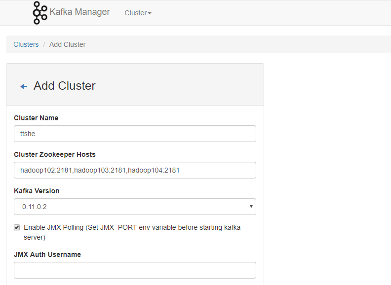

# 规划

|       | 服务器hadoop102 | 服务器hadoop103 | 服务器hadoop104 |
| ----- | --------------- | --------------- | --------------- |
| Kafka | Kafka           | Kafka           | Kafka           |
| ZK    | ZK              | ZK              | ZK              |


# 安装

- 解压，重命名，配置
- 在/opt/module/kafka目录下创建logs文件夹（保存数据、日志）
- 配置环境变量
- 分发kafka

```bash
[ttshe@hadoop102 software]$ tar -zvxf kafka_2.11-0.11.0.2.tgz -C /opt/module/
[ttshe@hadoop102 module]$ mv kafka_2.11-0.11.0.2/ kafka/
[ttshe@hadoop102 module]$ cd kafka/
[ttshe@hadoop102 kafka]$ mkdir logs
[ttshe@hadoop102 kafka]$ cd config/
[ttshe@hadoop102 config]$ vim server.properties
```

```bash
#broker的全局唯一编号，不能重复 *** 后面几个节点需要修改
broker.id=0
#删除topic功能使能 *** 默认false，表示逻辑删除，true表示物理删除
delete.topic.enable=true
#kafka运行日志存放的路径	 ***
log.dirs=/opt/module/kafka/logs
#segment文件保留的最长时间，超时将被删除 ***
log.retention.hours=168
#配置连接Zookeeper集群地址 ***
zookeeper.connect=hadoop102:2181,hadoop103:2181,hadoop104:2181
```

```bash
[ttshe@hadoop102 config]$ sudo vim /etc/profile
# 添加 KAFKA_HOME
export KAFKA_HOME=/opt/module/kafka
export PATH=$PATH:$KAFKA_HOME/bin
[ttshe@hadoop102 module]$ source /etc/profile
[ttshe@hadoop102 ~]$ xsync /opt/module/kafka/
# 修改broker.id
[ttshe@hadoop103 config]$ vim server.properties 
broker.id=1
[ttshe@hadoop104 config]$ vim server.properties 
broker.id=2 
```


# 启动停止脚本

```bash
[ttshe@hadoop102 bin]$ touch kf.sh
[ttshe@hadoop102 bin]$ chmod 777 kf.sh 
[ttshe@hadoop102 bin]$ vim kf.sh
```

```bash
#!/bin/bash

case $1 in
"start"){
	for i in hadoop102 hadoop103 hadoop104
    do
    	echo " --------启动 $i Kafka-------"
        # 用于KafkaManager监控
        ssh $i "export JMX_PORT=9988 && /opt/module/kafka/bin/kafka-server-start.sh -daemon /opt/module/kafka/config/server.properties "
    done
};;
"stop"){
	for i in hadoop102 hadoop103 hadoop104
    do
    	echo " --------停止 $i Kafka-------"
        ssh $i "/opt/module/kafka/bin/kafka-server-stop.sh stop"
    done
};;
esac
```

- 启动Kafka时要先开启JMX端口，是用于后续KafkaManager监控
- -daemon 表示后台执行

- kafka依赖zk的启动，那么zk启动之后才能启动kafka

  - kafka的状态信息保存在zk中

  

# 创建Topic

- 进入到/opt/module/kafka/目录下分别创建：启动日志主题、事件日志主题

```bash
[ttshe@hadoop102 kafka]$ bin/kafka-topics.sh --zookeeper hadoop102:2181 --create -replication-factor 1 --partitions 1 --topic topic_start

[ttshe@hadoop102 kafka]$ bin/kafka-topics.sh --zookeeper hadoop102:2181,hadoop103:2181,hadoop104:2181  --create --replication-factor 1 --partitions 1 --topic topic_event
```


# 查看topic

```bash
[ttshe@hadoop102 kafka]$ bin/kafka-topics.sh --zookeeper hadoop102:2181 --list
topic_event
topic_start
```


# 删除topic

```bash
[ttshe@hadoop102 kafka]$ bin/kafka-topics.sh --delete --zookeeper hadoop102:2181,hadoop103:2181,hadoop104:2181 --topic topic_start
[ttshe@hadoop102 kafka]$ bin/kafka-topics.sh --delete --zookeeper hadoop102:2181,hadoop103:2181,hadoop104:2181 --topic topic_event
```


# 生产消息

```bash
[ttshe@hadoop102 kafka]$ bin/kafka-console-producer.sh --broker-list hadoop102:9092 --topic topic_start
>hello
>world
```


# 消费消息

- --from-beginning：会把主题中以往所有的数据都读取出来。根据业务场景选择是否增加该配置

```bash
[ttshe@hadoop103 kafka]$ bin/kafka-console-consumer.sh --zookeeper hadoop102:2181 --from-beginning --topic topic_start
Using the ConsoleConsumer with old consumer is deprecated and will be removed in a future major release. Consider using the new consumer by passing [bootstrap-server] instead of [zookeeper].
hello
world
```


# 查看topic详情

```bash
[ttshe@hadoop103 kafka]$ bin/kafka-topics.sh --zookeeper hadoop102:2181 --describe --topic topic_start
Topic:topic_start	PartitionCount:1	ReplicationFactor:1	Configs:
	Topic: topic_start	Partition: 0	Leader: 2	Replicas: 2	Isr: 2
```


# Kafka Manager安装

- Kafka Manager是yahoo的一个Kafka监控管理项目
- 下载地址 https://github.com/yahoo/kafka-manager
- 下载之后编译源码，编译完成后
  - 拷贝出：kafka-manager-1.3.3.22.zip

- 拷贝kafka-manager-1.3.3.22.zip到hadoop102的/opt/module目录
- 解压kafka-manager-1.3.3.22.zip到/opt/module目录

- 进入到/opt/module/kafka-manager-1.3.3.22/conf目录，在application.conf文件中修改kafka-manager.zkhosts

```bash
[ttshe@hadoop102 software]$ unzip kafka-manager-1.3.3.22.zip -d /opt/module/
[ttshe@hadoop102 module]$ mv kafka-manager-1.3.3.22/ kafka-manager/
[ttshe@hadoop102 module]$ cd kafka-manager/conf/
[ttshe@hadoop102 conf]$ vim application.conf 
# 修改
kafka-manager.zkhosts="hadoop102:2181,hadoop103:2181,hadoop104:2181"
```

- 启动KafkaManager
  - 默认端口号与集群有冲突，这里进行启动修改
    - 2>&1 将错误日志追加到&1的后面
    - &1 的日志放在  start.log中

```bash
[ttshe@hadoop102 conf]$ nohup /opt/module/kafka-manager/bin/kafka-manager -Dhttp.port=7456 > /opt/module/kafka-manager/start.log 2>&1 &
```

- 打开http://hadoop102:7456页面查看

- 添加集群
  - 注意kafka版本
  - 注意可以勾选JMX，查看应用程序状态



- 至此可查看整个Kafka集群的状态包括
  - Topic的状态
  - Brokers的状态
  - Cosumer的状态

- 在Kafka的/opt/module/kafka-manager-1.3.3.22/application.home_IS_UNDEFINED 目录下面，可看到Kafka-Manager的日志

- KafkaManager使用
  - https://blog.csdn.net/u011089412/article/details/87895652

- 启动停止脚本

```bash
[ttshe@hadoop102 bin]$ touch km.sh
[ttshe@hadoop102 bin]$ chmod 777 km.sh
[ttshe@hadoop102 bin]$ vim km.sh
```

```bash
#!/bin/bash

case $1 in
"start"){
	echo " -------- 启动 KafkaManager -------"
    nohup /opt/module/kafka-manager/bin/kafka-manager -Dhttp.port=7456 > /opt/module/kafka-manager/start.log 2>&1 &
};;
"stop"){
	echo " -------- 停止 KafkaManager -------"
    ps -ef | grep ProdServerStart | grep -v grep |awk '{print $2}' | xargs kill
};;
esac
```

- 注意使用kill命令，优雅的关闭
