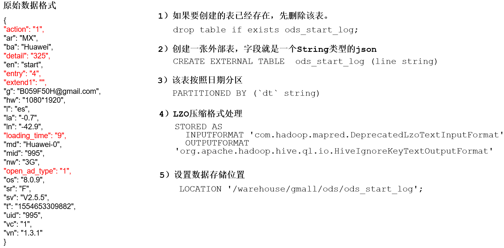
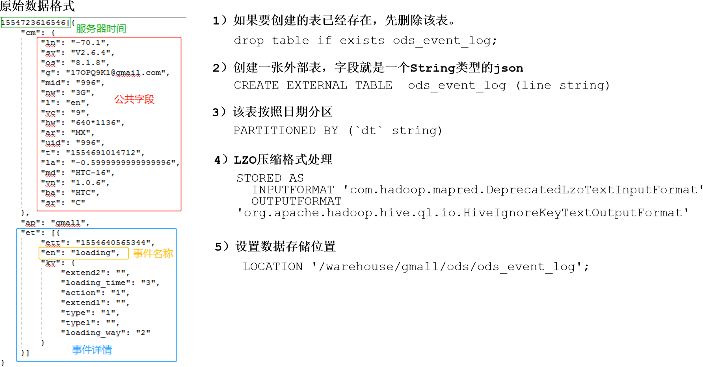

#  创建数据库

- 说明：如果数据库存在且有数据，需要强制删除时执行：drop database gmall cascade;

```sql
hive (default)> create database gmall;
hive (default)> use gmall;
```


# ODS层

原始数据层，存放原始数据，直接加载原始日志、数据，数据保持原貌不做处理


## 创建启动日志表ods_start_log

 

- 说明Hive的LZO压缩：https://cwiki.apache.org/confluence/display/Hive/LanguageManual+LZO

```sql
drop table if exists ods_start_log;
create external table ods_start_log(`line` string)
partitioned by (`dt` string)
stored as 
	inputformat 'com.hadoop.mapred.DeprecatedLzoTextInputFormat' 
	outputformat 'org.apache.hadoop.hive.ql.io.HiveIgnoreKeyTextOutputFormat'
location '/warehouse/gmall/ods/ods_start_log';
```

- 加载数据
  - 注意：时间格式都配置成YYYY-MM-DD格式
  - Hive默认支持的时间格式

```bash
hive (gmall)> 
load data inpath '/origin_data/gmall/log/topic_start/2019-02-10' into table gmall.ods_start_log partition(dt='2019-02-10');
```

- 查看是否成功导入

```bash
hive (gmall)> select * from ods_start_log limit 2;
OK
ods_start_log.e	ods_start_log.dt
{"action":"1","ar":"MX","ba":"Huawei","detail":"","en":"start","entry":"4","extend1":"","g":"0U2WD7RT@gmail.com","hw":"640*1136","l":"en","la":"-21.8","ln":"-89.6","loading_time":"9","md":"Huawei-9","mid":"6","nw":"3G","open_ad_type":"1","os":"8.0.1","sr":"G","sv":"V2.5.1","t":"1549701817272","uid":"6","vc":"0","vn":"1.1.7"}	2019-02-10
{"action":"1","ar":"MX","ba":"HTC","detail":"102","en":"start","entry":"2","extend1":"","g":"9C9PWI36@gmail.com","hw":"750*1134","l":"pt","la":"25.1","ln":"-111.4","loading_time":"3","md":"HTC-0","mid":"7","nw":"3G","open_ad_type":"2","os":"8.0.6","sr":"W","sv":"V2.5.6","t":"1549681482663","uid":"7","vc":"5","vn":"1.2.4"}	2019-02-10
```


## 创建事件日志表ods_event_log

 


- 与ods_start_log表类似
- 创建输入数据是lzo输出是text，支持json解析的分区表
- 加载数据

```sql
drop table if exists ods_event_log;
CREATE EXTERNAL TABLE ods_event_log(`line` string)
PARTITIONED BY (`dt` string)
STORED AS
  INPUTFORMAT 'com.hadoop.mapred.DeprecatedLzoTextInputFormat'
  OUTPUTFORMAT 'org.apache.hadoop.hive.ql.io.HiveIgnoreKeyTextOutputFormat'
LOCATION '/warehouse/gmall/ods/ods_event_log';
```

```sql
load data inpath '/origin_data/gmall/log/topic_event/2019-02-10' into table gmall.ods_event_log partition(dt='2019-02-10');
```

- 查看是否加载成功

```sql
hive (gmall)> select * from ods_event_log limit 2;
```


## ODS层加载数据脚本

- 在hadoop102的/home/ttshe/bin目录下创建脚本

```bash
[ttshe@hadoop102 bin]$ vim ods_log.sh
[ttshe@hadoop102 bin]$ chmod 777 ods_log.sh
```

```bash
#!/bin/bash

# 定义变量方便修改
APP=gmall
hive=/opt/module/hive/bin/hive

# 如果是输入的日期按照取输入日期；如果没输入日期取当前时间的前一天
if [ -n "$1" ] ;then
   do_date=$1
else 
   do_date=`date -d "-1 day" +%F`
fi 

echo "===日志日期为 $do_date==="
sql="
load data inpath '/origin_data/gmall/log/topic_start/$do_date' into table "$APP".ods_start_log partition(dt='$do_date');

load data inpath '/origin_data/gmall/log/topic_event/$do_date' into table "$APP".ods_event_log partition(dt='$do_date');
"

$hive -e "$sql"
```

- 说明
  - [ -n 变量值 ] 判断变量的值，是否为空
    - 变量的值，非空，返回true
    - 变量的值，为空，返回false
  - 查看date命令的使用
    - `[ttshe@hadoop102 ~]$ date --help`

- 脚本使用

```bash
[ttshe@hadoop102 module]$ ods_log.sh 2019-02-11
```

- 查看导入数据

```bash
hive (gmall)> 
select * from ods_start_log where dt='2019-02-11' limit 2;
select * from ods_event_log where dt='2019-02-11' limit 2;
```

- 脚本执行时间
  - 企业开发中一般在每日凌晨30分~1点

