# 业务术语


### 用户

- 用户以设备为判断标准，==在移动统计中，每个独立设备认为是一个独立用户==

- Android系统根据IMEI号
- IOS系统根据OpenUDID来标识一个独立用户
- 每部手机一个用户

 

### 新增用户

- 首次联网使用应用的用户
- 如果一个用户首次打开某APP，那这个用户定义为新增用户
- 卸载再安装的设备，不会被算作一次新增
- 新增用户包括日新增用户、周新增用户、月新增用户


### 活跃用户

- 打开应用的用户即为活跃用户，不考虑用户的使用情况
- 每天一台设备打开多次会被计为一个活跃用户


### 周（月）活跃用户

- 某个自然周（月）内启动过应用的用户
- 该周（月）内的多次启动只记一个活跃用户


### 月活跃率

- 月活跃用户与截止到该月累计的用户总和之间的比例
- 月活跃用户数/用户总数


### 沉默用户

- 用户仅在安装当天（次日）启动一次，后续时间无再启动行为
- 该指标可以反映新增用户质量和用户与APP的匹配程度。


### 版本分布

- 不同版本的周内各天新增用户数，活跃用户数和启动次数
- 利于判断APP各个版本之间的优劣和用户行为习惯


### 本周回流用户

- 上周未启动过应用，本周启动了应用的用户


### 连续n周活跃用户

- 连续n周，每周至少启动一次


### 忠诚用户

- 连续活跃5周以上的用户


### 连续活跃用户

- 连续2周及以上活跃的用户


### 近期流失用户

- 连续n(2<= n <= 4)周没有启动应用的用户
- 第n+1周没有启动过


### 留存用户

- 某段时间内的新增用户，经过一段时间后，仍然使用应用的被认作是留存用户
- 这部分用户占当时新增用户的比例即是留存率

- 如5月份新增用户200，这200人在6月份启动过应用的有100人，7月份启动过应用的有80人，8月份启动过应用的有50人
- 则5月份新增用户一个月后的留存率是50%，二个月后的留存率是40%，三个月后的留存率是25%


### 用户新鲜度

- 每天启动应用的新老用户比例，即新增用户数占活跃用户数的比例


### 单次使用时长

- 每次启动使用的时间长度


### 日使用时长

- 累计一天内的使用时间长度


### 启动次数计算标准

- IOS平台应用退到后台就算一次独立的启动
- Android平台我们规定，两次启动之间的间隔小于30秒，被计算一次启动
  - 用户在使用过程中，若因收发短信或接电话等退出应用30秒又再次返回应用中，那这两次行为应该是延续而非独立的，所以可以被算作一次使用行为，即一次启动
  - 业内大多使用30秒这个标准，但用户还是可以自定义此时间间隔


# 系统函数


## collect_set

- 创建原数据表

```sql
hive (gmall)>
drop table if exists stud;
create table stud (name string, area string, course string, score int);
```

- 向原数据表中插入数据

```sql
hive (gmall)>
insert into table stud values('zhang3','bj','math',88);
insert into table stud values('li4','bj','math',99);
insert into table stud values('wang5','sh','chinese',92);
insert into table stud values('zhao6','sh','chinese',54);
insert into table stud values('tian7','bj','chinese',91);
```

- 查询表中数据

```sql
hive (gmall)> select * from stud;
stud.name       stud.area       stud.course     stud.score
zhang3  bj      math    88
li4     bj      math    99
wang5   sh      chinese 92
zhao6   sh      chinese 54
tian7   bj      chinese 91
```

- 把同一分组的不同行的数据聚合成一个集合

```sql
hive (gmall)> select course, collect_set(area), avg(score) from stud group by course;
chinese ["sh","bj"]     79.0
math    ["bj"]  93.5
```

- 用下标可以取某一个

```sql
hive (gmall)> select course, collect_set(area)[0], avg(score) from stud group by course;
chinese sh      79.0
math    bj      93.5
```


## if

- 可以作为三目运算符使用

```sql

```


# 日期处理函数


## date_format

- date_format函数（根据格式整理日期）

```sql
hive (gmall)> select date_format('2019-02-10','yyyy-MM');
2019-02
```


## date_add

- date_add函数（加减日期）

```sql
hive (gmall)> select date_add('2019-02-10',-1);
2019-02-09
hive (gmall)> select date_add('2019-02-10',1);
2019-02-11
```


## next_day

- 取当前天的下一个周一
- 说明：星期一到星期日的英文（Monday，Tuesday、Wednesday、Thursday、Friday、Saturday、Sunday）
- 大小写忽略

```sql
hive (gmall)> select next_day('2019-02-12','MO');
2019-02-18
```

- 取当前周的周一

```sql
hive (gmall)> select date_add(next_day('2019-02-12','MO'),-7);
2019-02-11
```


## last_day

- last_day函数（求当月最后一天日期）

```sql
hive (gmall)> select last_day('2019-02-10');
2019-02-28
```


# 需求


## 用户活跃主题


### DWS层

- 目标：统计当日、当周、当月活动的每个设备明细
- 注意插入操作都是insert overwrite，每日凌晨执行更新


#### 每日活跃设备明细 [dws_uv_detail_day]

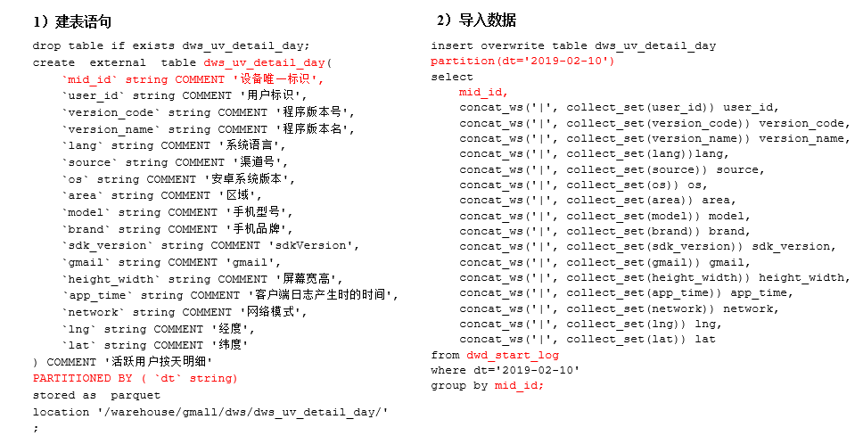

- 建表语句

```sql
drop table if exists dws_uv_detail_day;
create external table dws_uv_detail_day
(
    `mid_id` string comment '设备唯一标识',
    `user_id` string COMMENT '用户标识', 
    `version_code` string COMMENT '程序版本号', 
    `version_name` string COMMENT '程序版本名', 
    `lang` string COMMENT '系统语言', 
    `source` string COMMENT '渠道号', 
    `os` string COMMENT '安卓系统版本', 
    `area` string COMMENT '区域', 
    `model` string COMMENT '手机型号', 
    `brand` string COMMENT '手机品牌', 
    `sdk_version` string COMMENT 'sdkVersion', 
    `gmail` string COMMENT 'gmail', 
    `height_width` string COMMENT '屏幕宽高',
    `app_time` string COMMENT '客户端日志产生时的时间',
    `network` string COMMENT '网络模式',
    `lng` string COMMENT '经度',
    `lat` string COMMENT '纬度'
)
partitioned by (dt string)
stored as parquet
location '/warehouse/gmail/dws/dws_uv_detail_day';
```

- 导入数据
  - 以用户单日访问为key进行聚合，如果某个用户在一天中使用了两种操作系统、两个系统版本、多个地区，登录不同账号，只取其中之一
  - 注意使用group进行分组，求count，避免使用distinct出现异常
  - 使用非严格模式，用于忽略分区不指定时报错
  - 使用concat_ws 将相同mid的字段进行拼接
    - 考虑到重复字段的值，可以使用一个自定义udf进行处理

```sql
set hive.exec.dynamic.partition.mode=nonstrict;

insert overwrite table dws_uv_detail_day
partition(dt='2019-02-10')
select
    mid_id,
    concat_ws('|',collect_set(user_id)) user_id,
    concat_ws('|', collect_set(version_code)) version_code,
    concat_ws('|', collect_set(version_name)) version_name,
    concat_ws('|', collect_set(lang))lang,
    concat_ws('|', collect_set(source)) source,
    concat_ws('|', collect_set(os)) os,
    concat_ws('|', collect_set(area)) area, 
    concat_ws('|', collect_set(model)) model,
    concat_ws('|', collect_set(brand)) brand,
    concat_ws('|', collect_set(sdk_version)) sdk_version,
    concat_ws('|', collect_set(gmail)) gmail,
    concat_ws('|', collect_set(height_width)) height_width,
    concat_ws('|', collect_set(app_time)) app_time,
    concat_ws('|', collect_set(network)) network,
    concat_ws('|', collect_set(lng)) lng,
    concat_ws('|', collect_set(lat)) lat
from dwd_start_log
where dt='2019-02-10'
group by mid_id;
```

- 查询导入结果
  - 执行count会执行MR

```sql
hive (gmall)> select * from dws_uv_detail_day limit 2;
hive (gmall)> select count(*) from dws_uv_detail_day;
```

- 思考：不同渠道来源的每日活跃数统计怎么计算？


#### 每周活跃设备明细 [dws_uv_detail_wk]

- 关于日期的处理，可以自定义一个UDTF函数，使用侧切函数输出多个

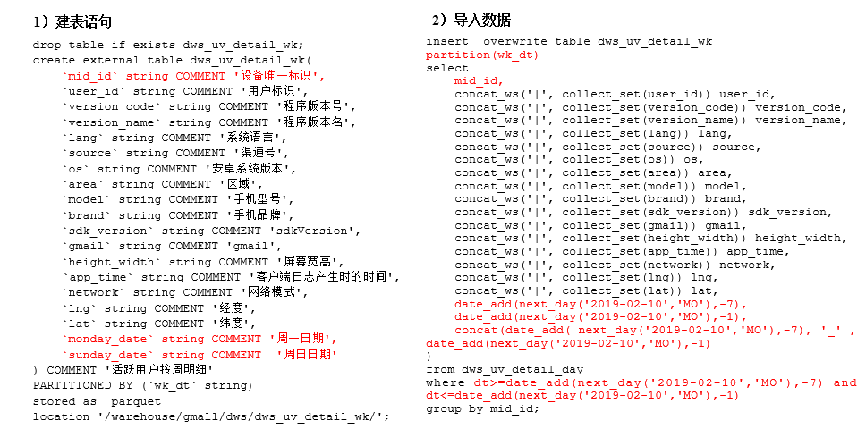 

- 根据日用户访问明细，获得周用户访问明细

- 建表语句
  - 周一日期和周日日期用于最终ads层显示使用

```sql
drop table if exists dws_uv_detail_wk;
create external table dws_uv_detail_wk(
    `mid_id` string comment '设备唯一标识',
    `user_id` string COMMENT '用户标识', 
    `version_code` string COMMENT '程序版本号', 
    `version_name` string COMMENT '程序版本名', 
    `lang` string COMMENT '系统语言', 
    `source` string COMMENT '渠道号', 
    `os` string COMMENT '安卓系统版本', 
    `area` string COMMENT '区域', 
    `model` string COMMENT '手机型号', 
    `brand` string COMMENT '手机品牌', 
    `sdk_version` string COMMENT 'sdkVersion', 
    `gmail` string COMMENT 'gmail', 
    `height_width` string COMMENT '屏幕宽高',
    `app_time` string COMMENT '客户端日志产生时的时间',
    `network` string COMMENT '网络模式',
    `lng` string COMMENT '经度',
    `lat` string COMMENT '纬度',
    `monday_date` string COMMENT '周一日期',
    `sunday_date` string COMMENT  '周日日期'
) comment '活跃用户按周明细'
partitioned by (`wk_dt` string)
stored as parquet
location '/warehouse/gmall/dws/dws_uv_detail_wk';
```

- 数据导入

```sql
set hive.exec.dynamic.partition.mode=nonstrict;

insert overwrite table dws_uv_detail_wk
partition(wk_dt)
select
    mid_id,
    concat_ws('|', collect_set(user_id)) user_id,
    concat_ws('|', collect_set(version_code)) version_code,
    concat_ws('|', collect_set(version_name)) version_name,
    concat_ws('|', collect_set(lang)) lang,
    concat_ws('|', collect_set(source)) source,
    concat_ws('|', collect_set(os)) os,
    concat_ws('|', collect_set(area)) area, 
    concat_ws('|', collect_set(model)) model,
    concat_ws('|', collect_set(brand)) brand,
    concat_ws('|', collect_set(sdk_version)) sdk_version,
    concat_ws('|', collect_set(gmail)) gmail,
    concat_ws('|', collect_set(height_width)) height_width,
    concat_ws('|', collect_set(app_time)) app_time,
    concat_ws('|', collect_set(network)) network,
    concat_ws('|', collect_set(lng)) lng,
    concat_ws('|', collect_set(lat)) lat,
    date_add(next_day('2019-02-10','MO'),-7),
    date_add(next_day('2019-02-10','MO'),-1),
    concat(
        date_add(next_day('2019-02-10','MO'),-7)
        ,'_'
        ,date_add(next_day('2019-02-10','MO'),-1)
    )
from dws_uv_detail_day
where dt >= date_add(next_day('2019-02-10','MO'),-7) 
and dt <= date_add(next_day('2019-02-10','MO'),-1)
group by mid_id;
```

- 查询导入结果

```sql
hive (gmall)> select * from dws_uv_detail_wk limit 2;
```


#### 每月活跃设备明细 [dws_uv_detail_mn]

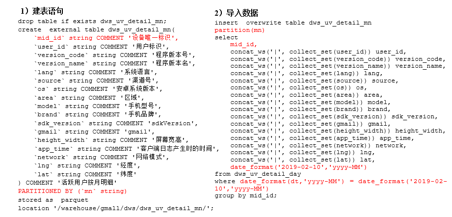 

- 建表语句

```sql
drop table if exists dws_uv_detail_mn;
create external table dws_uv_detail_mn(
    `mid_id` string comment '设备唯一标识',
    `user_id` string COMMENT '用户标识', 
    `version_code` string COMMENT '程序版本号', 
    `version_name` string COMMENT '程序版本名', 
    `lang` string COMMENT '系统语言', 
    `source` string COMMENT '渠道号', 
    `os` string COMMENT '安卓系统版本', 
    `area` string COMMENT '区域', 
    `model` string COMMENT '手机型号', 
    `brand` string COMMENT '手机品牌', 
    `sdk_version` string COMMENT 'sdkVersion', 
    `gmail` string COMMENT 'gmail', 
    `height_width` string COMMENT '屏幕宽高',
    `app_time` string COMMENT '客户端日志产生时的时间',
    `network` string COMMENT '网络模式',
    `lng` string COMMENT '经度',
    `lat` string COMMENT '纬度'
)comment '活跃用户按月明细'
partitioned by (`mn` string)
stored as parquet
location '/warehouse/gmall/dws/dws_uv_detail_mn/';
```

- 数据导入

```sql
set hive.exec.dynamic.partition.mode=nonstrict;

insert overwrite table dws_uv_detail_mn
partition(mn)
select
    mid_id,
    concat_ws('|', collect_set(user_id)) user_id,
    concat_ws('|', collect_set(version_code)) version_code,
    concat_ws('|', collect_set(version_name)) version_name,
    concat_ws('|', collect_set(lang)) lang,
    concat_ws('|', collect_set(source)) source,
    concat_ws('|', collect_set(os)) os,
    concat_ws('|', collect_set(area)) area, 
    concat_ws('|', collect_set(model)) model,
    concat_ws('|', collect_set(brand)) brand,
    concat_ws('|', collect_set(sdk_version)) sdk_version,
    concat_ws('|', collect_set(gmail)) gmail,
    concat_ws('|', collect_set(height_width)) height_width,
    concat_ws('|', collect_set(app_time)) app_time,
    concat_ws('|', collect_set(network)) network,
    concat_ws('|', collect_set(lng)) lng,
    concat_ws('|', collect_set(lat)) lat,
    date_format('2019-02-10','yyyy-MM')
from dws_uv_detail_day
where date_format(dt,'yyyy-MM') = date_format('2019-02-10','yyyy-MM')
group by mid_id;
```

- 查询

```sql
select * from dws_uv_detail_mn limit 2;
select count(1) from dws_uv_detail_mn;
```


#### DWS层加载数据脚本

- 在hadoop102的/home/ttshe/bin目录下创建脚本

```bash
[ttshe@hadoop102 bin]$ vim dws_uv_log.sh
[ttshe@hadoop102 bin]$ chmod 777 dws_uv_log.sh 
```

```bash
#!/bin/bash

# 定义变量方便修改
APP=gmall
hive=/opt/module/hive/bin/hive

# 如果是输入的日期按照取输入日期；如果没输入日期取当前时间的前一天
if [ -n "$1" ] ;then
	do_date=$1
else 
	do_date=`date -d "-1 day" +%F`  
fi 

sql="
  set hive.exec.dynamic.partition.mode=nonstrict;

  insert overwrite table "$APP".dws_uv_detail_day partition(dt='$do_date')
  select  
    mid_id,
    concat_ws('|', collect_set(user_id)) user_id,
    concat_ws('|', collect_set(version_code)) version_code,
    concat_ws('|', collect_set(version_name)) version_name,
    concat_ws('|', collect_set(lang)) lang,
    concat_ws('|', collect_set(source)) source,
    concat_ws('|', collect_set(os)) os,
    concat_ws('|', collect_set(area)) area, 
    concat_ws('|', collect_set(model)) model,
    concat_ws('|', collect_set(brand)) brand,
    concat_ws('|', collect_set(sdk_version)) sdk_version,
    concat_ws('|', collect_set(gmail)) gmail,
    concat_ws('|', collect_set(height_width)) height_width,
    concat_ws('|', collect_set(app_time)) app_time,
    concat_ws('|', collect_set(network)) network,
    concat_ws('|', collect_set(lng)) lng,
    concat_ws('|', collect_set(lat)) lat
  from "$APP".dwd_start_log
  where dt='$do_date'  
  group by mid_id;


  insert overwrite table "$APP".dws_uv_detail_wk partition(wk_dt)
  select  
    mid_id,
    concat_ws('|', collect_set(user_id)) user_id,
    concat_ws('|', collect_set(version_code)) version_code,
    concat_ws('|', collect_set(version_name)) version_name,
    concat_ws('|', collect_set(lang)) lang,
    concat_ws('|', collect_set(source)) source,
    concat_ws('|', collect_set(os)) os,
    concat_ws('|', collect_set(area)) area, 
    concat_ws('|', collect_set(model)) model,
    concat_ws('|', collect_set(brand)) brand,
    concat_ws('|', collect_set(sdk_version)) sdk_version,
    concat_ws('|', collect_set(gmail)) gmail,
    concat_ws('|', collect_set(height_width)) height_width,
    concat_ws('|', collect_set(app_time)) app_time,
    concat_ws('|', collect_set(network)) network,
    concat_ws('|', collect_set(lng)) lng,
    concat_ws('|', collect_set(lat)) lat,
    date_add(next_day('$do_date','MO'),-7),
    date_add(next_day('$do_date','MO'),-1),
    concat(date_add( next_day('$do_date','MO'),-7), '_' , date_add(next_day('$do_date','MO'),-1) 
  )
  from "$APP".dws_uv_detail_day
  where dt>=date_add(next_day('$do_date','MO'),-7) and dt<=date_add(next_day('$do_date','MO'),-1) 
  group by mid_id; 

  insert overwrite table "$APP".dws_uv_detail_mn partition(mn)
  select
    mid_id,
    concat_ws('|', collect_set(user_id)) user_id,
    concat_ws('|', collect_set(version_code)) version_code,
    concat_ws('|', collect_set(version_name)) version_name,
    concat_ws('|', collect_set(lang))lang,
    concat_ws('|', collect_set(source)) source,
    concat_ws('|', collect_set(os)) os,
    concat_ws('|', collect_set(area)) area, 
    concat_ws('|', collect_set(model)) model,
    concat_ws('|', collect_set(brand)) brand,
    concat_ws('|', collect_set(sdk_version)) sdk_version,
    concat_ws('|', collect_set(gmail)) gmail,
    concat_ws('|', collect_set(height_width)) height_width,
    concat_ws('|', collect_set(app_time)) app_time,
    concat_ws('|', collect_set(network)) network,
    concat_ws('|', collect_set(lng)) lng,
    concat_ws('|', collect_set(lat)) lat,
    date_format('$do_date','yyyy-MM')
  from "$APP".dws_uv_detail_day
  where date_format(dt,'yyyy-MM') = date_format('$do_date','yyyy-MM')   
  group by mid_id;
"

$hive -e "$sql"
```

- 测试

```bash
[ttshe@hadoop102 bin]$ dws_uv_log.sh 2019-02-11
hive (gmall)> select count(*) from dws_uv_detail_day where dt='2019-02-11';
hive (gmall)> select count(*) from dws_uv_detail_wk;
hive (gmall)> select count(*) from dws_uv_detail_mn;
```


### ADS层


#### 设备活跃数 [ads_uv_count]

- 目标：当日、当周、当月活跃设备数

- 建表语句

```sql
drop table if exists ads_uv_count;
create external table ads_uv_count(
    `dt` string COMMENT '统计日期',
    `day_count` bigint COMMENT '当日用户数量',
    `wk_count` bigint COMMENT '当周用户数量',
    `mn_count` bigint COMMENT '当月用户数量',
    `is_weekend` string COMMENT 'Y,N是否是周末,用于得到本周最终结果',
    `is_monthend` string COMMENT 'Y,N是否是月末,用于得到本月最终结果'
) COMMENT '活跃设备数'
row format delimited fields terminated by '\t'
location '/warehouse/gmall/ads/ads_uv_count/';
```

- 导入数据
  - if语句，类似于三元运算符，计算周日

```bash
insert into table ads_uv_count
select
    '2019-02-10' dt,
    daycount.ct,
    wkcount.ct,
    mncount.ct,
    if(date_add(next_day('2019-02-10','MO'),-1)='2019-02-10','Y',"N"),
    if(last_day('2019-02-10')='2019-02-10','Y','N')
from(
    select
        '2019-02-10' dt,
        count(1) ct
    from dws_uv_detail_day
    where dt='2019-02-10'
) daycount 
join (
    select
        '2019-02-10' dt,
        count(1) ct
    from dws_uv_detail_wk
    where wk_dt = concat(
        date_add(next_day('2019-02-10','MO'),-7)
        ,'_'
        ,date_add(next_day('2019-02-10','MO'),-1)
    )
) wkcount 
on daycount.dt = wkcount.dt 
join(
    select
        '2019-02-10' dt,
        count(1) ct
    from dws_uv_detail_mn
    where mn=date_format('2019-02-10','yyyy-MM')
)mncount 
on daycount.dt = mncount.dt;
```

- 查询

```sql
select * from ads_uv_count;
```


#### ADS层加载数据脚本

- 在hadoop102的/home/ttshe/bin目录下创建脚本

```bash
[ttshe@hadoop102 bin]$ vim ads_uv_log.sh
[ttshe@hadoop102 bin]$ chmod 777 ads_uv_log.sh
```

```bash
#!/bin/bash

# 定义变量方便修改
APP=gmall
hive=/opt/module/hive/bin/hive

# 如果是输入的日期按照取输入日期；如果没输入日期取当前时间的前一天
if [ -n "$1" ] ;then
	do_date=$1
else 
	do_date=`date -d "-1 day" +%F`  
fi 

sql="
  set hive.exec.dynamic.partition.mode=nonstrict;

insert into table "$APP".ads_uv_count 
select
  '$do_date' dt,
   daycount.ct,
   wkcount.ct,
   mncount.ct,
   if(date_add(next_day('$do_date','MO'),-1)='$do_date','Y','N') ,
   if(last_day('$do_date')='$do_date','Y','N') 
from
(
   select  
      '$do_date' dt,
       count(*) ct
   from "$APP".dws_uv_detail_day
   where dt='$do_date'  
)daycount   join 
( 
   select  
     '$do_date' dt,
     count (*) ct
   from "$APP".dws_uv_detail_wk
   where wk_dt=concat(date_add(next_day('$do_date','MO'),-7),'_' ,date_add(next_day('$do_date','MO'),-1) )
)  wkcount  on daycount.dt=wkcount.dt
join 
( 
   select  
     '$do_date' dt,
     count (*) ct
   from "$APP".dws_uv_detail_mn
   where mn=date_format('$do_date','yyyy-MM')  
)mncount on daycount.dt=mncount.dt;
"

$hive -e "$sql"
```

- 查询

```bash
[ttshe@hadoop102 bin]$ ads_uv_log.sh 2019-02-11

hive (gmall)> select * from ads_uv_count;
```


## 用户新增主题

- 首次联网使用应用的用户
- 如果一个用户首次打开某APP，那这个用户定义为新增用户
- 卸载再安装的设备，不会被算作一次新增
- 新增用户包括日新增用户、周新增用户、月新增用户


### DWS层 - 每日新增设备明细表（用户表）[dws_new_mid_day]

- 通过新注册用户的埋点可以直接处理，而非通过活跃来控制
  - 一种是在现有数据的基础上，使用如下方式
    - 可以先从mysql中导出所有用户数据作为用户表
  - 一种是在全新系统上，直接埋点获取新增

- ==注意这里是insert into 而非 insert over，说明是累加==
- 主要思想是使用 每日活跃 left join 全部新增（开始是空） on 判断全部新增的mid为null的为新增
  - 在全部新增表中添加新增时间，用于筛选每日新增人数

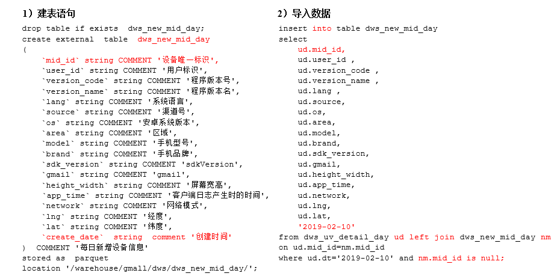

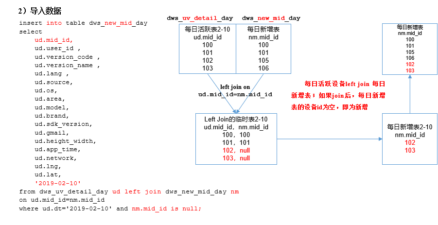

- 建表语句

```sql
drop table if exists dws_new_mid_day;
create external table dws_new_mid_day
(
    `mid_id` string comment '唯一设备标识',
    `user_id` string COMMENT '用户标识', 
    `version_code` string COMMENT '程序版本号', 
    `version_name` string COMMENT '程序版本名', 
    `lang` string COMMENT '系统语言', 
    `source` string COMMENT '渠道号', 
    `os` string COMMENT '安卓系统版本', 
    `area` string COMMENT '区域', 
    `model` string COMMENT '手机型号', 
    `brand` string COMMENT '手机品牌', 
    `sdk_version` string COMMENT 'sdkVersion', 
    `gmail` string COMMENT 'gmail', 
    `height_width` string COMMENT '屏幕宽高',
    `app_time` string COMMENT '客户端日志产生时的时间',
    `network` string COMMENT '网络模式',
    `lng` string COMMENT '经度',
    `lat` string COMMENT '纬度',
    `create_date` string comment '创建时间'
) comment '每日新增设备信息'
stored as parquet
location '/warehouse/gmall/dws/dws_new_mid_day/';
```

- 导入数据
  - 用每日活跃用户表left Join每日新增设备表，关联的条件是mid_id相等
  - 如果是每日新增的设备，则在每日新增设备表中为null

```sql
insert into table dws_new_mid_day
select
    ud.mid_id,
    ud.user_id , 
    ud.version_code , 
    ud.version_name , 
    ud.lang , 
    ud.source, 
    ud.os, 
    ud.area, 
    ud.model, 
    ud.brand, 
    ud.sdk_version, 
    ud.gmail, 
    ud.height_width,
    ud.app_time,
    ud.network,
    ud.lng,
    ud.lat,
    '2019-02-10'
from dws_uv_detail_day ud 
left join dws_new_mid_day nm 
on ud.mid_id = nm.mid_id
where ud.dt='2019-02-10' and nm.mid_id is null;
```

- 查询

```sql
hive (gmall)> select count(1) from dws_new_mid_day;
```


### ADS层 - 每日新增设备表 [ads_new_mid_count]

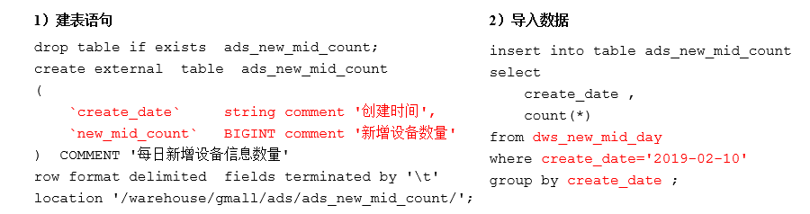 

- 建表语句

```sql
drop table if exists ads_new_mid_count;
create external table ads_new_mid_count(
    `create_date` string comment '创建时间',
    `new_mid_count` bigint comment '新增设备数量'
)comment '每日新增设备信息数量'
row format delimited fields terminated by '\t'
location '/warehouse/gmall/ads/ads_new_mid_count/';
```

- 导入数据

```sql
insert into table ads_new_mid_count
select
    create_date,
    count(*)
from dws_new_mid_day
where create_date='2019-02-10'
group by create_date;
```

- 查询

```sql
hive (gmall)> select * from ads_new_mid_count;
```


## 用户留存主题（难点）

- 留存用户
  - 某段时间内的新增用户（活跃用户），经过一段时间后，又继续使用应用的被认作是留存用户
  - 如2月10日新增用户100，这100人在2月11日启动过应用的有30人，2月12日启动过应用的有25人，2月13日启动过应用的有32人
- 留存率
  - 留存用户占当时新增用户（活跃用户）的比例即是留存率
  - 2月10日新增用户次日的留存率是30/100 = 30%，两日留存率是25/100=25%，三日留存率是32/100=32%。

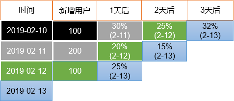


### 需求目标

- 思路：使用 该日新增 ==join== 某日活跃 ，可计算该日的留存人数
- 将该留存人数/该日新增得到该日的留存率

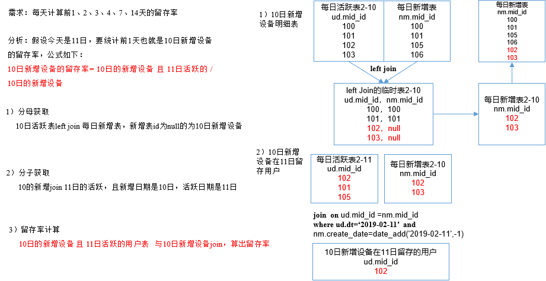

### DWS层


#### 每日留存用户明细表 [dws_user_retention_day]

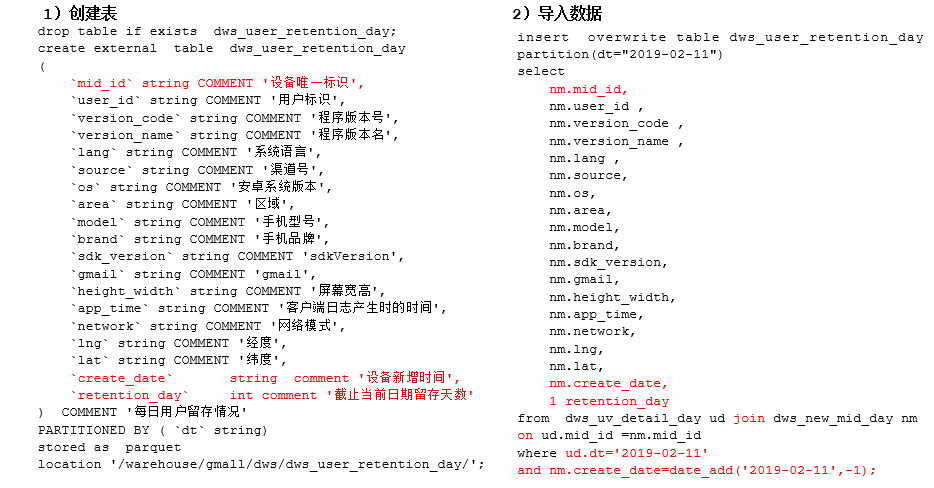 

- 创建表

```sql
drop table if exists dws_user_retention_day;
create external table dws_user_retention_day
(
    `mid_id` string comment '设备唯一标识',
    `user_id` string COMMENT '用户标识', 
    `version_code` string COMMENT '程序版本号', 
    `version_name` string COMMENT '程序版本名', 
    `lang` string COMMENT '系统语言', 
    `source` string COMMENT '渠道号', 
    `os` string COMMENT '安卓系统版本', 
    `area` string COMMENT '区域', 
    `model` string COMMENT '手机型号', 
    `brand` string COMMENT '手机品牌', 
    `sdk_version` string COMMENT 'sdkVersion', 
    `gmail` string COMMENT 'gmail', 
    `height_width` string COMMENT '屏幕宽高',
    `app_time` string COMMENT '客户端日志产生时的时间',
    `network` string COMMENT '网络模式',
    `lng` string COMMENT '经度',
    `lat` string COMMENT '纬度',
    `create_date` string  comment '设备新增时间',
    `retention_day` int comment '截止当前日期留存天数'
) comment '每日用户留存情况'
partitioned by (`dt` string)
stored as parquet
location '/warehouse/gmall/dws/dws_user_retention_day/';
```

- 插入数据
  - 每天计算前1天的新用户访问留存明细

```sql
insert overwrite table dws_user_retention_day
partition(dt='2019-02-11')
select
    nm.mid_id,
    nm.user_id , 
    nm.version_code , 
    nm.version_name , 
    nm.lang , 
    nm.source, 
    nm.os, 
    nm.area, 
    nm.model, 
    nm.brand, 
    nm.sdk_version, 
    nm.gmail, 
    nm.height_width,
    nm.app_time,
    nm.network,
    nm.lng,
    nm.lat,
    nm.create_date,
    1 retention_day
from dws_uv_detail_day ud 
join dws_new_mid_day nm 
on ud.mid_id = nm.mid_id
where ud.dt = '2019-02-11' and nm.create_date = date_add('2019-02-11',-1);
```

- 查询

```sql
hive (gmall)> select count(1) from dws_user_retention_day;
```


#### 1,2,3,n天留存用户明细表 [dws_user_retention_day]

- 创建表，同每日留存
- 导入数据，（每天计算前1,2,3，n天的新用户访问留存明细）
- 注意是join

```sql
insert overwrite table dws_user_retention_day
partition(dt="2019-02-11")

select
    nm.mid_id,
    nm.user_id,
    nm.version_code,
    nm.version_name,
    nm.lang,
    nm.source,
    nm.os,
    nm.area,
    nm.model,
    nm.brand,
    nm.sdk_version,
    nm.gmail,
    nm.height_width,
    nm.app_time,
    nm.network,
    nm.lng,
    nm.lat,
    nm.create_date,
    1 retention_day
from dws_uv_detail_day ud join dws_new_mid_day nm  on ud.mid_id =nm.mid_id 
where ud.dt='2019-02-11' and nm.create_date=date_add('2019-02-11',-1)

union all
select  
    nm.mid_id,
    nm.user_id , 
    nm.version_code , 
    nm.version_name , 
    nm.lang , 
    nm.source, 
    nm.os, 
    nm.area, 
    nm.model, 
    nm.brand, 
    nm.sdk_version, 
    nm.gmail, 
    nm.height_width,
    nm.app_time,
    nm.network,
    nm.lng,
    nm.lat,
    nm.create_date,
    2 retention_day 
from  dws_uv_detail_day ud join dws_new_mid_day nm   on ud.mid_id =nm.mid_id 
where ud.dt='2019-02-11' and nm.create_date=date_add('2019-02-11',-2)

union all
select  
    nm.mid_id,
    nm.user_id , 
    nm.version_code , 
    nm.version_name , 
    nm.lang , 
    nm.source, 
    nm.os, 
    nm.area, 
    nm.model, 
    nm.brand, 
    nm.sdk_version, 
    nm.gmail, 
    nm.height_width,
    nm.app_time,
    nm.network,
    nm.lng,
    nm.lat,
    nm.create_date,
    3 retention_day 
from  dws_uv_detail_day ud join dws_new_mid_day nm   on ud.mid_id =nm.mid_id 
where ud.dt='2019-02-11' and nm.create_date=date_add('2019-02-11',-3);
```

- 查询导入数据
  - 每天计算前1,2,3天的新用户访问留存明细

```sql
hive (gmall)> select retention_day , count(*) from dws_user_retention_day group by retention_day;
```


### ADS层


#### 留存用户数 [ads_user_retention_day_count]

- 建表语句

```sql
drop table if exists ads_user_retention_day_count;
create external table ads_user_retention_day_count
(
    `create_date` string comment '设备新增日期',
    `retention_day` int comment '截止当前日期留存天数',
    `retention_count` bigint comment '留存数量'
)comment '每日用户留存情况'
row format delimited fields terminated by '\t'
location '/warehouse/gmall/ads/ads_user_retention_day_count/';
```

- 导入数据

```sql
insert into table ads_user_retention_day_count
select
    create_date,
    retention_day,
    count(1) retention_count
from dws_user_retention_day
where dt='2019-02-11'
group by create_date,retention_day;
```

- 查询

```sql
hive (gmall)> select * from ads_user_retention_day_count;
```


#### 留存用户比率 [ads_user_retention_day_rate]

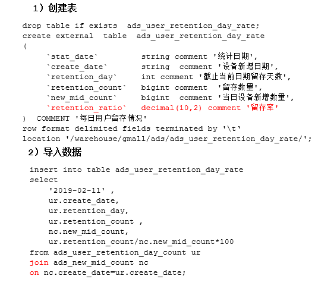 

- 建表

```sql
drop table if exists ads_user_retention_day_rate;
create external table ads_user_retention_day_rate
(
    `stat_date` string comment '统计日期',
    `create_date` string comment '设备新增日期',
    `retention_day` int comment '截止当前日期留存天数',
    `retention_count` bigint comment  '留存数量',
    `new_mid_count` bigint comment '当日设备新增数量',
    `retention_ratio` decimal(10,2) comment '留存率'
) comment '每日用户留存情况'
row format delimited fields terminated by '\t'
location '/warehouse/gmall/ads/ads_user_retention_day_rate/';
```

- 插入数据

```sql
insert into table ads_user_retention_day_rate
select 
    '2019-02-11',
    ur.create_date,
    ur.retention_day,
    ur.retention_count,
    nc.new_mid_count,
    ur.retention_count/nc.new_mid_count*100
from ads_user_retention_day_count ur 
join ads_new_mid_count nc
on nc.create_date=ur.create_date;
```

- 查询

```sql
hive (gmall)> select * from ads_user_retention_day_rate;
```


## 数据准备

- 为了分析沉默用户、本周回流用户数、流失用户、最近连续3周活跃用户、最近七天内连续三天活跃用户数，需要准备2019-02-12、2019-02-20日的数据

- 修改日志时间
- 生成日志数据
- 将HDFS数据导入到ODS层
- 将ODS数据导入到DWD层
- 将DWD数据导入到DWS层

- 验证

```bash
# 注意要先启动集群
[ttshe@hadoop102 ~]$ cluster.sh start
[ttshe@hadoop102 ~]$ dt.sh 2019-02-12
[ttshe@hadoop102 ~]$ lg.sh

[ttshe@hadoop102 ~]$ cluster.sh start
[ttshe@hadoop102 ~]$ dt.sh 2019-02-20
[ttshe@hadoop102 ~]$ lg.sh

[ttshe@hadoop102 ~]$ ods_log.sh 2019-02-12
[ttshe@hadoop102 ~]$ ods_log.sh 2019-02-20

[ttshe@hadoop102 ~]$ dwd_start_log.sh 2019-02-12
[ttshe@hadoop102 ~]$ dwd_base_log.sh 2019-02-12
[ttshe@hadoop102 ~]$ dwd_event_log.sh 2019-02-12
[ttshe@hadoop102 ~]$ dws_uv_log.sh 2019-02-12

[ttshe@hadoop102 ~]$ dwd_start_log.sh 2019-02-20
[ttshe@hadoop102 ~]$ dwd_base_log.sh 2019-02-20
[ttshe@hadoop102 ~]$ dwd_event_log.sh 2019-02-20
[ttshe@hadoop102 ~]$ dws_uv_log.sh 2019-02-20
```

- 验证

```sql
hive (gmall)> select * from dws_uv_detail_day where dt='2019-02-12' limit 2;
hive (gmall)> select * from dws_uv_detail_day where dt='2019-02-20' limit 2;
```


## 沉默用户数

- 指的是只在安装当天启动过，且启动时间是在一周前

### DWS层 [dws_uv_detail_day]

- 使用日活明细表dws_uv_detail_day作为DWS层数据

### ADS层 [ads_silent_count] 

- 通过对每日活跃对mid进行分组，获得每个mid的登录时间的多个记录，筛选记录是一个，且最大或最小分区时间是查询的7天前

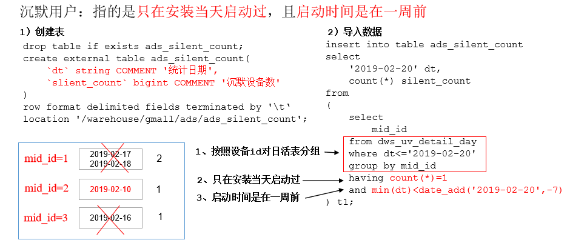 

- 建表

```sql
drop table if exists ads_silent_count;
create external table ads_silent_count(
    `dt` string comment '统计日期',
    `silent_count` bigint comment '沉默设备数'
)
row format delimited fields terminated by '\t'
location '/warehouse/gmall/ads/ads_silent_count';
```

- 导入2019-02-20数据
  - 核心思路是通过分组，找到每个mid_id分组内部的条数，条数大于1的表明有多次登录，需要只有一次登录的且登录时间最小值在7天之前
  - 此处必须使用min或者max，从逻辑的角度可以不添加，但是group by的having中必须是聚合函数

```sql
insert into table ads_silent_count
select
    '2019-02-20' dt,
    count(1) silent_count
from
(
    select mid_id
    from dws_uv_detail_day
    where dt <= '2019-02-20'
    group by mid_id
    having count(1)=1 and min(dt) < date_add('2019-02-20',-7)
) tmp;
```

- 查询

```sql
hive (gmall)> select * from ads_silent_count;
```

- 编写脚本
  - 在hadoop102的/home/ttshe/bin目录下创建脚本

```bash
[ttshe@hadoop102 bin]$ vim ads_silent_log.sh
[ttshe@hadoop102 bin]$ chmod 777 ads_silent_log.sh
```

```bash
#!/bin/bash

hive=/opt/module/hive/bin/hive
APP=gmall

if [ -n "$1" ];then
	do_date=$1
else
	do_date=`date -d "-1 day" +%F`
fi

echo "-----------导入日期$do_date-----------"

sql="
insert into table "$APP".ads_silent_count
select 
    '$do_date' dt,
    count(*) silent_count
from 
(
    select 
        mid_id
    from "$APP".dws_uv_detail_day
    where dt<='$do_date'
    group by mid_id
    having count(*)=1 and min(dt)<=date_add('$do_date',-7)
)t1;"

$hive -e "$sql"
```

- 测试

```bash
[ttshe@hadoop102 bin]$ ads_silent_log.sh 2019-02-20
hive (gmall)> select * from ads_silent_count;
```


## 本周回流用户数

- 本周回流=本周活跃-本周新增-上周活跃

### DWS层 [dws_uv_detail_day]

- 使用日活明细表dws_uv_detail_day作为DWS层数据

### ADS层 [ads_back_count]

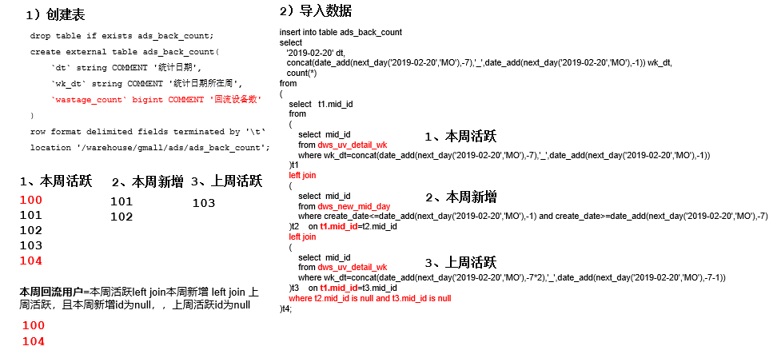 

- 建表语句

```sql
drop table if exists ads_back_count;
create external table ads_back_count(
    `dt` string comment '统计日期',
    `wk_dt` string comment '统计日期所在周',
    `wastage_count` bigint comment '回流设备数'
)
row format delimited fields terminated by '\t'
location '/warehouse/gmall/ads/ads_back_count';
```

- 导入数据

```sql
insert into table ads_back_count
select
    '2019-02-20' dt,
    concat(
        date_add(next_day('2019-02-20','MO'),-7)
        ,'_'
        ,date_add(next_day('2019-02-20','MO'),-1)) wk_dt,
    count(1)
from
(
    select t1.mid_id
    from(
        select mid_id
        from dws_uv_detail_wk
        where wk_dt= concat(
        date_add(next_day('2019-02-20','MO'),-7)
        ,'_'
        ,date_add(next_day('2019-02-20','MO'),-1))
    )t1 left join
    (
        select mid_id
        from dws_new_mid_day
        where create_date <= date_add(next_day('2019-02-20','MO'),-1) and create_date >= date_add(next_day('2019-02-20','MO'),-7)
    )t2 on t1.mid_id = t2.mid_id left join 
    (
        select mid_id
        from dws_uv_detail_wk
        where wk_dt= concat(
        date_add(next_day('2019-02-20','MO'),-7*2)
        ,'_'
        ,date_add(next_day('2019-02-20','MO'),-1-7))
    )t3 on t1.mid_id = t3.mid_id
    where t2.mid_id is null and t3.mid_id is null
)t4;
```

- 查询

```sql
hive (gmall)> select * from ads_back_count;
```

- 编写脚本
  - 在hadoop102的/home/ttshe/bin目录下创建脚本

```bash
#!/bin/bash

if [ -n "$1" ];then
	do_date=$1
else
	do_date=`date -d "-1 day" +%F`
fi

hive=/opt/module/hive/bin/hive
APP=gmall

echo "-----------导入日期$do_date-----------"

sql="
insert into table "$APP".ads_back_count
select 
       '$do_date' dt,
       concat(date_add(next_day('$do_date','MO'),-7),'_',date_add(next_day('$do_date','MO'),-1)) wk_dt,
       count(*)
from 
(
    select t1.mid_id
    from 
    (
        select mid_id
        from "$APP".dws_uv_detail_wk
        where wk_dt=concat(date_add(next_day('$do_date','MO'),-7),'_',date_add(next_day('$do_date','MO'),-1))
    )t1
    left join
    (
        select mid_id
        from "$APP".dws_new_mid_day
        where create_date<=date_add(next_day('$do_date','MO'),-1) and create_date>=date_add(next_day('$do_date','MO'),-7)
    )t2
    on t1.mid_id=t2.mid_id
    left join
    (
        select mid_id
        from "$APP".dws_uv_detail_wk
        where wk_dt=concat(date_add(next_day('$do_date','MO'),-7*2),'_',date_add(next_day('$do_date','MO'),-7-1))
    )t3
    on t1.mid_id=t3.mid_id
    where t2.mid_id is null and t3.mid_id is null
)t4;
"

$hive -e "$sql"
```


## 流失用户数

- 最近7天未登录我们称之为流失用户
- 类似于沉默用户数，不同的是沉默是只有一条注册登录记录，而流失有多条登录，最近登录日期的记录超过7日


### DWS层 [dws_uv_detail_day]

- 使用日活明细表dws_uv_detail_day作为DWS层数据

  

### ADS层 [ads_wastage_count]

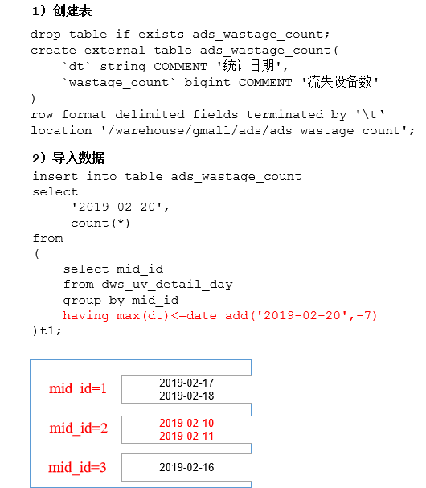 

- 建表

```sql
drop table if exists ads_wastage_count;
create external table ads_wastage_count(
    `dt` string comment '统计日期',
    `wastage_count` bigint comment '流失设备数'
)
row format delimited fields terminated by '\t'
location '/warehouse/gmall/ads/ads_wastage_count';
```

- 导入2019-02-20数据
  - 主要的基于mid_id进行分组，对分组后的登录时间数据取得最大值，最大值如果小于7天前的登录时间，那么就是流失用户

```sql
insert into table ads_wastage_count
select
    '2019-02-20',
    count(1)
from
(
    select mid_id
    from dws_uv_detail_day
    group by mid_id
    having max(dt) <= date_add('2019-02-20',-7)
)tmp;
```

- 编写脚本

```bash
#!/bin/bash

if [ -n "$1" ];then
	do_date=$1
else
	do_date=`date -d "-1 day" +%F`
fi

hive=/opt/module/hive/bin/hive
APP=gmall

echo "-----------导入日期$do_date-----------"

sql="
insert into table "$APP".ads_wastage_count
select
     '$do_date',
     count(*)
from 
(
    select mid_id
    from "$APP".dws_uv_detail_day
    group by mid_id
    having max(dt)<=date_add('$do_date',-7)
)t1;
"

$hive -e "$sql"
```

- 查询

```sql
hive (gmall)> select * from ads_wastage_count;
```


## 最近连续三周活跃用户数

- 通常是周一对前3周的数据做统计，该数据一周计算一次，三周个数是3次


### DWS层 [dws_uv_detail_wk]

- 使用周活明细表dws_uv_detail_wk作为DWS层数据

  

### ADS层 [ads_continuity_wk_count]

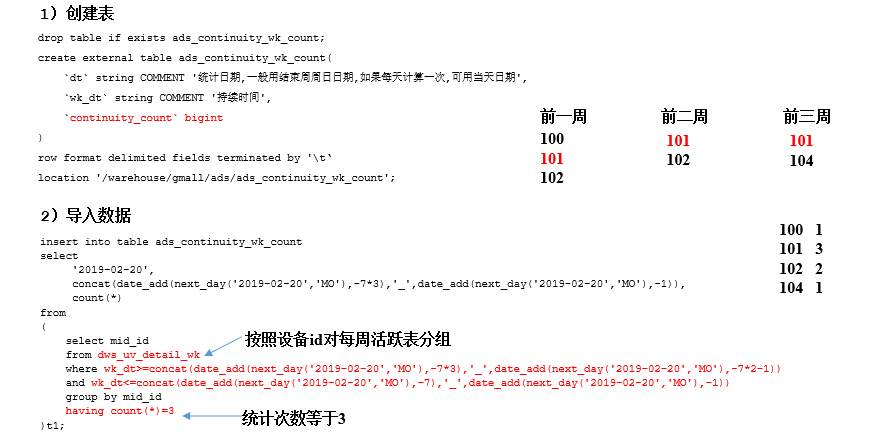

- 建表

```sql
drop table if exists ads_continuity_wk_count;
create external table ads_continuity_wk_count(
    `dt` string comment '统计日期,一般用结束周周日日期,如果每天计算一次,可用当天日期',
    `wk_dt` string comment '持续时间',
    `continuity_count` bigint
)
row format delimited fields terminated by '\t'
location '/warehouse/gmall/ads/ads_continuity_wk_count';
```

- 导入2019-02-20所在周的数据

```sql
insert into table ads_continuity_wk_count
select
    '2019-02-20',
    concat(
        date_add(next_day('2019-02-20','MO'),-7*3)
        ,'_'
        ,date_add(next_day('2019-02-20','MO'),-1)),
    count(1)
from
(
    select mid_id
    from dws_uv_detail_wk
    where wk_dt >= concat(
        date_add(next_day('2019-02-20','MO'),-7*3)
        ,'_'
        ,date_add(next_day('2019-02-20','MO'),-7*2-1)) and
        wk_dt <= concat(
        date_add(next_day('2019-02-20','MO'),-7)
        ,'_'
        ,date_add(next_day('2019-02-20','MO'),-1))
    group by mid_id
    having count(1) = 3
) t1;
```

- 查询

```sql
hive (gmall)> select * from ads_continuity_wk_count;
```

- 编写脚本

```bash
#!/bin/bash

if [ -n "$1" ];then
	do_date=$1
else
	do_date=`date -d "-1 day" +%F`
fi

hive=/opt/module/hive/bin/hive
APP=gmall

echo "-----------导入日期$do_date-----------"

sql="
insert into table "$APP".ads_continuity_wk_count
select 
     '$do_date',
     concat(date_add(next_day('$do_date','MO'),-7*3),'_',date_add(next_day('$do_date','MO'),-1)),
     count(*)
from 
(
    select mid_id
    from "$APP".dws_uv_detail_wk
    where wk_dt>=concat(date_add(next_day('$do_date','MO'),-7*3),'_',date_add(next_day('$do_date','MO'),-7*2-1)) 
    and wk_dt<=concat(date_add(next_day('$do_date','MO'),-7),'_',date_add(next_day('$do_date','MO'),-1))
    group by mid_id
    having count(*)=3
)t1;"

$hive -e "$sql"
```


## 最近7天内连续3天活跃用户数（难点）


### DWS层 [dws_uv_detail_day]

- 使用日活明细表dws_uv_detail_day作为DWS层数据

  

### ADS层

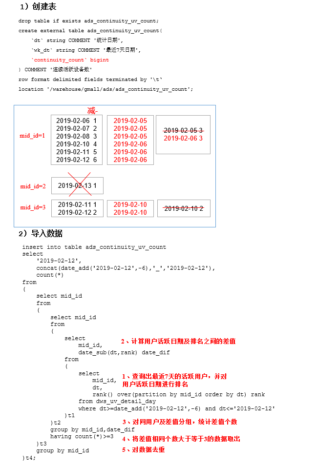 

- 注意上图中导入数据有问题
- 创建表

```sql
drop table if exists ads_continuity_uv_count;
create external table ads_continuity_uv_count(
    `dt` string comment '统计日期',
    `wk_dt` string comment '最近7天日期',
    `continuity_count` bigint
) COMMENT '连续活跃设备数'
row format delimited fields terminated by '\t'
location '/warehouse/gmall/ads/ads_continuity_uv_count';
```

- 导入数据
  - 添加一层group by mid_id---t3，用于处理1,2,3登录，5,6,7登录的场景，计算更加精确

```sql
insert into table ads_continuity_uv_count
select
    '2019-02-12',
    concat(date_add('2019-02-12',-6),'_','2019-02-12'),
    count(1)
from(
    select mid_id
    from(
        select
            mid_id
        from(
            select 
            mid_id,
            date_sub(dt,rank) date_diff
            from(
                select
                mid_id,
                dt,
                rank() over(partition by mid_id order by dt) rank
                from dws_uv_detail_day
                where dt>=date_add('2019-02-12',-6) 
                and dt <= '2019-02-12'
            )t1 
        )t2
        group by mid_id,date_diff
        having count(1) >= 3
    )t3
    group by mid_id
)t4;
```

- 编写脚本

```bash
#!/bin/bash

if [ -n "$1" ];then
	do_date=$1
else
	do_date=`date -d "-1 day" +%F`
fi

hive=/opt/module/hive/bin/hive
APP=gmall

echo "-----------导入日期$do_date-----------"

sql="
insert into table "$APP".ads_continuity_uv_count
select 
     '$do_date',
     concat(date_add('$do_date',-6),'_','$do_date') dt,
     count(*) 
from 
(
    select mid_id
    from
    (
        select mid_id
        from 
        (
            select
                mid_id,
                date_sub(dt,rank) date_diff
            from 
            (
                select 
                    mid_id,
                    dt,
                    rank() over(partition by mid_id order by dt) rank
                from "$APP".dws_uv_detail_day
                where dt>=date_add('$do_date',-6) and dt<='$do_date'
            )t1
        )t2
        group by mid_id,date_diff
        having count(*)>=3
    )t3 
    group by mid_id
)t4;
"

$hive -e "$sql"
```

- 查询

```sql
hive (gmall)> select * from ads_continuity_uv_count;
```

