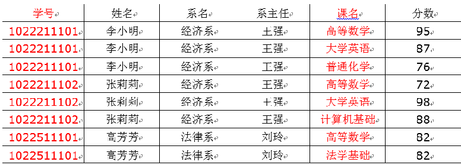
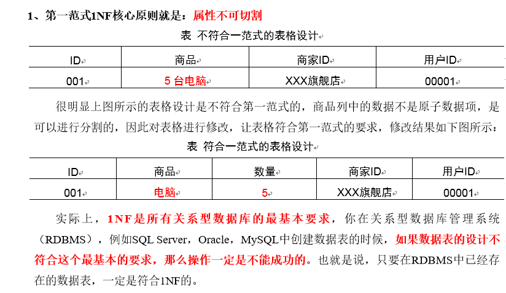
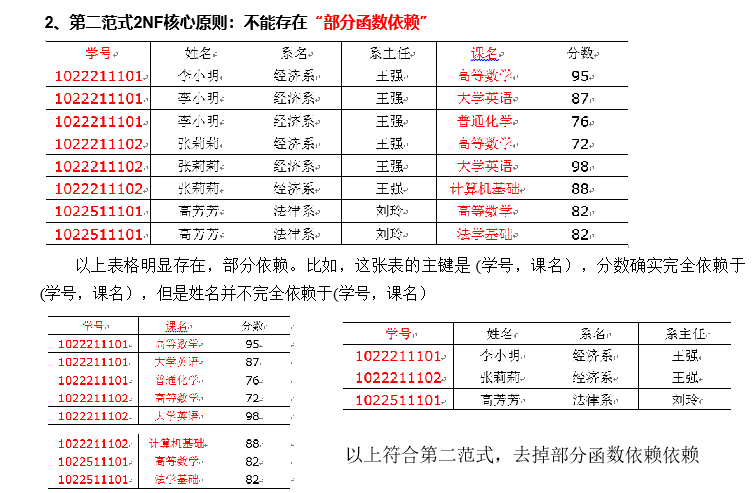
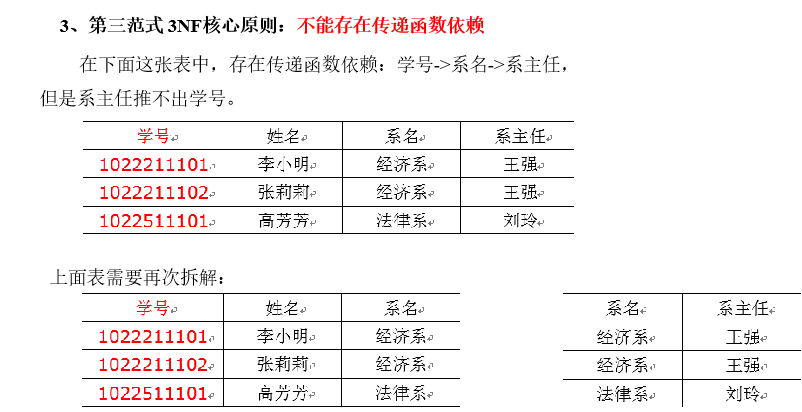
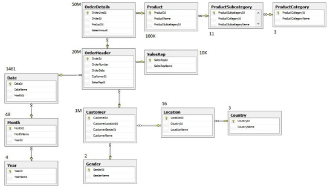
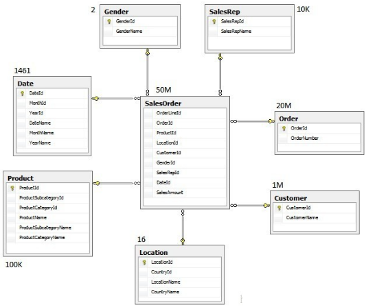
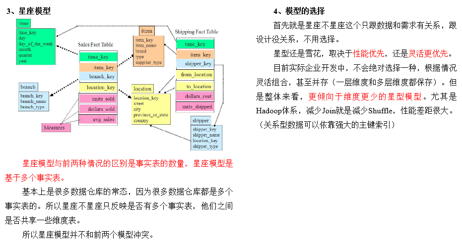

## 表的分类

### 实体表

- 一般是指一个现实存在的业务对象，比如用户，商品，商家，销售员等等

| 用户id | 姓名 | 生日       | 性别 | 邮箱       | 用户等级 | 创建时间   |
| ------ | ---- | ---------- | ---- | ---------- | -------- | ---------- |
| 1      | 张三 | 2011-11-11 | 男   | zs@163.com | 2        | 2018-11-11 |
| 2      | 李四 | 2011-11-11 | 女   | ls@163.com | 3        | 2018-11-11 |
| 3      | 王五 | 2011-11-11 | 中性 | ww@163.com | 1        | 2018-11-11 |
| …      | …    | …          | …    | …          | …        | …          |

### 维度表

- 一般是指对应一些==业务状态==，编号的解释表
- ==码表==
- 如地区表，订单状态，支付方式，审批状态，商品分类等

订单状态表：

| 订单状态编号 | 订单状态名称 |
| ------------ | ------------ |
| 1            | 未支付       |
| 2            | 支付         |
| 3            | 发货中       |
| 4            | 已发货       |
| 5            | 已完成       |

商品分类表：

| 商品分类编号 | 分类名称 |
| ------------ | -------- |
| 1            | 服装     |
| 2            | 保健     |
| 3            | 电器     |
| 4            | 图书     |

### 事务型事实表

- 一般指随着业务发生不断产生的数据
- 特点是==一旦发生不会再变化==
- 如交易流水，操作日志，出库入库记录等

交易流水表：

| 编号   | 对外业务编号 | 订单编号 | 用户编号 | 支付宝交易流水编号 | 支付金额 | 交易内容    | 支付类型  | 支付时间            |
| ------ | ------------ | -------- | -------- | ------------------ | -------- | ----------- | --------- | ------------------- |
| 1      | 7577697945   | 1        | 111      | QEyF-63000323      | 223.00   | 海狗人参丸1 | alipay    | 2019-02-10 00:50:02 |
| 2      | 0170099522   | 2        | 222      | qdwV-25111279      | 589.00   | 海狗人参丸2 | wechatpay | 2019-02-10 00:50:02 |
| 3      | 1840931679   | 3        | 666      | hSUS-65716585      | 485.00   | 海狗人参丸3 | unionpay  | 2019-02-10 00:50:02 |
| 。。。 | 。。。       | 。。。   | 。。。   | 。。。             | 。。。   | 。。。      | 。。。    | 。。。              |

### 周期型事实表

- 一般指==随着业务发生不断产生的数据==
- 与事务型不同的是，数据会随着业务周期性的推进而变化
- 如订单，其中订单状态会周期性变化
- 如请假、贷款申请，随着批复状态在周期性变化

## 同步策略

- 数据同步策略的类型包括
  - 全量表：存储完整的数据
  - 增量表：存储新增加的数据
  - 新增及变化表：存储新增加的数据和变化的数据
  - 拉链表：对新增及变化表做==定期合并==

### 实体表同步策略

- 实体表
  - 如用户，商品，商家，销售员等
- 实体表数据量比较小
- 通常每天存一份完整数据
- ==每日全量==

### 维度表同步策略

- 维度表
  - 如订单状态，审批状态，商品分类
- 维度表数据量比较小
- 通常每天存一份完整数据
- 每日全量
- 说明
  - 针对可能会有变化的状态数据可以存储每日全量
  - 没变化的客观世界的维度可只存一份固定值
    - 如性别，地区，民族，政治成分，鞋子尺码

### 事务型事实表同步策略

- 事务型事实表
  - 如交易流水，操作日志，出库入库记录等
- 因为数据不会变化，而且数据量巨大，所以每天只同步新增数据即可
- 可做成==每日增量表==
- ==每日创建一个分区存储==

### 周期型事实表同步策略

- 周期型事实表
  - 如订单、请假、贷款申请等
- 从数据量的角度，存每日全量的话，数据量太大，冗余也太大
- 如果用每日增量的话无法反应数据变化
- ==每日新增及变化量==，包括了当日的新增和修改
- 一般来说这个表，足够计算大部分当日数据，但是这种依然无法解决能够得到某一个历史时间点（时间切片）的切片数据
- ==所以利用每日新增和变化表，制作一张拉链表==，以方便的取到某个时间切片的快照数据

拉链表：

| name姓名 | start新名字创建时间 | end名字更改时间 |
| -------- | ------------------- | --------------- |
| 张三     | 1990/1/1            | 2018/12/31      |
| 张小三   | 2019/1/1            | 2019/4/30       |
| 张大三   | 2019/5/1            | 9999-99-99      |
| 。。。   | 。。。              | 。。。          |

select * from user where start =<’2019-1-2’ and end>=’2019-1-2’

## 范式理论

### 概念

- 关系型数据库设计时，遵照一定的规范要求，目的在于降低数据的冗余性，目前业界范式有
  - ==第一范式(1NF)==
  - ==第二范式(2NF)==
  - ==第三范式(3NF)==
  - 巴斯-科德范式(BCNF)
  - 第四范式(4NF)
  - 第五范式(5NF)
- 范式可以理解为设计一张数据表的表结构，符合的标准级别
- 使用范式的根本目的是
  - 减少数据冗余，尽量让每个数据只出现一次
  - 保证数据一致性
- 缺点是获取数据时，需要通过Join拼接出最后的数据。

### 数据依赖

- 完全函数依赖
  - 如通过(学号，课程) 推出分数 ，但是单独用学号推断不出来分数
  - 分数完全依赖于(学号，课程) 
  - 通过AB能得出C，但是AB单独得不出C，那么说C完全依赖于AB
- 部分函数依赖
  - 如通过(学号，课程) 推出姓名，因为其实直接可以通过学号推出姓名
  - 姓名部分依赖于 (学号，课程)
  - 通过AB能得出C，通过A也能得出C，或者通过B也能得出C，那么说C部分依赖于AB
- 传递函数依赖
  - 如学号 推出系名，系名推出系主任， 但是系主任推不出学号，系主任主要依赖于系名
  - 系主任传递依赖于学号
  - 通过A得到B，通过B得到C，但是C得不到A，那么说C传递依赖于A

### 第一范式

### 第二范式

### 第三范式

## 关系建模与维度建模

- 关系模型

- 关系模型主要应用与OLTP系统中，为了保证数据的一致性以及避免冗余，所以大部分业务系统的表都是遵循第三范式的

- 维度模型

  

- 维度模型主要应用于OLAP系统中，因为关系模型虽然冗余少，但是在大规模数据，==跨表分析统计查询过程中，会造成多表关联大大降低执行效率==

- 所以把相关各种表整理成两种：事实表和维度表两种

- 所有维度表围绕着事实表进行解释

## 星型模型&雪花模型

在维度建模的基础上又分为三种模型：星型模型、雪花模型、星座模型

## 星座模型

