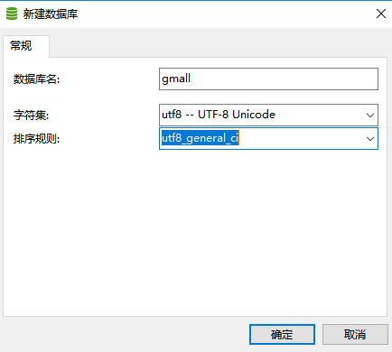
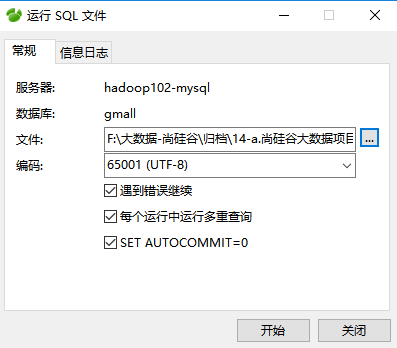
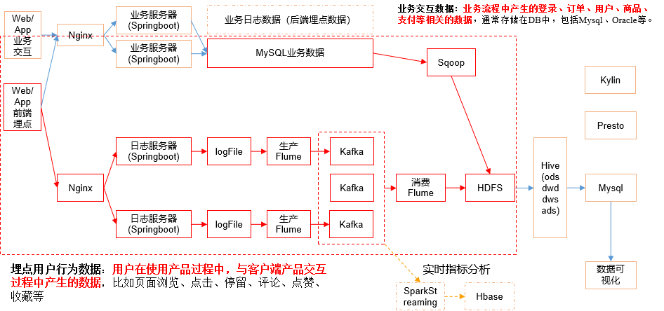
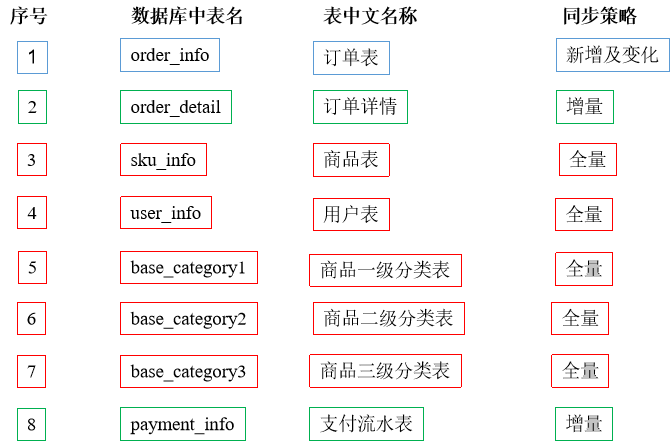
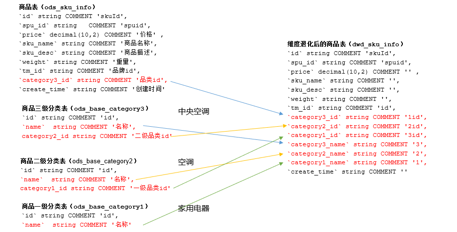
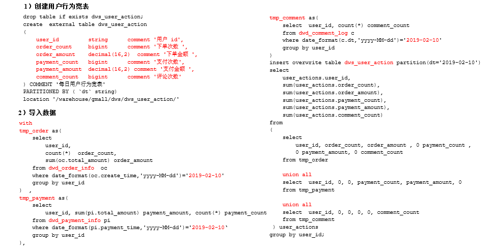

# 数仓搭建


## 配置Hadoop支持Snappy压缩

- 一般snappy和orc一起配合使用
- 将编译后支持Snappy压缩的Hadoop jar包解压缩，并将lib/native目录中所有文件上传到hadoop102的/opt/module/hadoop-2.7.2/lib/native目录，并分发到hadoop103 hadoop104
- 重新启动Hadoop
- 检查支持的压缩方式

```bash
[ttshe@hadoop102 software]$ cp -r native/ /opt/module/hadoop-2.7.2/lib
[ttshe@hadoop102 lib]$ xsync native/
[ttshe@hadoop102 lib]$ hadoop checknative
[ttshe@hadoop102 lib]$ cluster.sh start
```


## 业务数据生成


### 建表

- 创建数据库gmall

 

- 导入建表语句
  - 1建表脚本

 

- 重复步骤3的导入方式，依次导入：2商品分类数据插入脚本、3函数脚本、4存储过程脚本

  

### 生成业务数据

- 生成业务数据函数说明
  - do_date_string生成数据日期
  - order_incr_num订单id个数
  - user_incr_num用户id个数
  - sku_num商品sku个数
  - if_truncate是否删除数据

```sql
init_data (do_date_string VARCHAR(20) , order_incr_num INT, user_incr_num INT , sku_num INT , if_truncate BOOLEAN)
```

- 测试
  - 需求：生成日期2019年2月10日数据、订单1000个、用户200个、商品sku300个、删除原始数据

```sql
CALL init_data('2019-02-10',1000,200,300,TRUE);
```

```sql
SELECT * from base_category1;
SELECT * from base_category2;
SELECT * from base_category3;

SELECT * from order_info;
SELECT * from order_detail;

SELECT * from sku_info;
SELECT * from user_info;

SELECT * from payment_info;
```


## 业务数据导入数仓




### Sqoop安装

- 安装Sqoop的前提是已经具备Java和Hadoop的环境
- 下载地址：http://mirrors.hust.edu.cn/apache/sqoop/1.4.6/
- 上传安装包sqoop-1.4.6.bin__hadoop-2.0.4-alpha.tar.gz到虚拟机中
- 解压sqoop安装包到指定目录

```bash
[ttshe@hadoop102 software]$ tar -zxvf sqoop-1.4.6.bin__hadoop-2.0.4-alpha.tar.gz -C /opt/module/
[ttshe@hadoop102 module]$ mv sqoop-1.4.6.bin__hadoop-2.0.4-alpha/ sqoop/
```

- 重命名配置文件
- 修改配置文件

```bash
[ttshe@hadoop102 conf]$ pwd
/opt/module/sqoop/conf
[ttshe@hadoop102 conf]$ cp sqoop-env-template.sh sqoop-env.sh
[ttshe@hadoop102 conf]$ vim sqoop-env.sh 
# 增加如下配置
export HADOOP_COMMON_HOME=/opt/module/hadoop-2.7.2
export HADOOP_MAPRED_HOME=/opt/module/hadoop-2.7.2
export HIVE_HOME=/opt/module/hive
export ZOOKEEPER_HOME=/opt/module/zookeeper-3.4.10
export ZOOCFGDIR=/opt/module/zookeeper-3.4.10
export HBASE_HOME=/opt/module/hbase
```

- JDBC驱动
- 拷贝jdbc驱动到sqoop的lib目录下

```bash
[ttshe@hadoop102 mysql-connector-java-5.1.27]$ cp mysql-connector-java-5.1.27-bin.jar /opt/module/sqoop/lib/
```

- 验证

```bash
[ttshe@hadoop102 sqoop]$ bin/sqoop help
```

- 连接数据库

```bash
[ttshe@hadoop102 sqoop]$ bin/sqoop list-databases --connect jdbc:mysql://hadoop102:3306/ --username root --password 123456
```


### 导入命令

- $2用于接收参数，如sql等

```bash
/opt/module/sqoop/bin/sqoop import \
--connect \
--username \
--password \
--target-dir \
--delete-target-dir \
--num-mappers \
--fields-terminated-by \
--query "$2" ' and $CONDITIONS;'
```


### 分析表




### Sqoop定时导入脚本

- 在/home/ttshe/bin目录下创建脚本sqoop_import.sh

```bash
[ttshe@hadoop102 bin]$ touch sqoop_import.sh
[ttshe@hadoop102 bin]$ chmod 777 sqoop_import.sh 
[ttshe@hadoop102 bin]$ vim sqoop_import.sh 
```

```bash
#!/bin/bash

db_date=$2
echo $db_date
db_name=gmall

import_data() {
/opt/module/sqoop/bin/sqoop import \
--connect jdbc:mysql://hadoop102:3306/$db_name \
--username root \
--password 123456 \
--target-dir /origin_data/$db_name/db/$1/$db_date \
--delete-target-dir \
--num-mappers 1 \
--fields-terminated-by "\t" \
--query "$2"' and $CONDITIONS;'
}

import_sku_info(){
  import_data "sku_info"  "select 
id, spu_id, price, sku_name, sku_desc, weight, tm_id,
category3_id, create_time
  from sku_info where 1=1"
}

import_user_info(){
  import_data "user_info"  "select 
id, name, birthday, gender, email, user_level, 
create_time 
from user_info where 1=1"
}

import_base_category1(){
  import_data "base_category1"  "select 
id, name from base_category1 where 1=1"
}

import_base_category2(){
  import_data "base_category2" "select 
id, name, category1_id from base_category2 where 1=1"
}

import_base_category3(){
  import_data "base_category3" "select id, name, category2_id from base_category3 where 1=1"
}

import_order_detail(){
  import_data   "order_detail"   "select 
    od.id, 
    order_id, 
    user_id, 
    sku_id, 
    sku_name, 
    order_price, 
    sku_num, 
    o.create_time  
  from order_info o, order_detail od
  where o.id=od.order_id
  and DATE_FORMAT(create_time,'%Y-%m-%d')='$db_date'"
}

import_payment_info(){
  import_data "payment_info"   "select 
    id,  
    out_trade_no, 
    order_id, 
    user_id, 
    alipay_trade_no, 
    total_amount,  
    subject, 
    payment_type, 
    payment_time 
  from payment_info 
  where DATE_FORMAT(payment_time,'%Y-%m-%d')='$db_date'"
}

import_order_info(){
  import_data   "order_info"   "select 
    id, 
    total_amount, 
    order_status, 
    user_id, 
    payment_way, 
    out_trade_no, 
    create_time, 
    operate_time  
  from order_info 
  where (DATE_FORMAT(create_time,'%Y-%m-%d')='$db_date' or DATE_FORMAT(operate_time,'%Y-%m-%d')='$db_date')"
}

case $1 in
  "base_category1")
     import_base_category1
;;
  "base_category2")
     import_base_category2
;;
  "base_category3")
     import_base_category3
;;
  "order_info")
     import_order_info
;;
  "order_detail")
     import_order_detail
;;
  "sku_info")
     import_sku_info
;;
  "user_info")
     import_user_info
;;
  "payment_info")
     import_payment_info
;;
   "all")
   import_base_category1
   import_base_category2
   import_base_category3
   import_order_info
   import_order_detail
   import_sku_info
   import_user_info
   import_payment_info
;;
esac
```

- 注意，每日增量使用日期进行过滤，而新增与变化则需要使用==创建时间和操作时间进行过滤==
- 执行脚本导入数据

```bash
[ttshe@hadoop102 bin]$ sqoop_import.sh all 2019-02-10
```

- 在SQLyog中生成2019年2月11日数据

```sql
CALL init_data('2019-02-11',1000,200,300,TRUE);
```

- 执行脚本导入数据

```bash
[ttshe@hadoop102 bin]$ sqoop_import.sh all 2019-02-11
```


### Sqoop导入数据异常处理

- 问题描述
  - 执行Sqoop导入数据脚本时，发生如下异常

```java
java.sql.SQLException: Streaming result set com.mysql.jdbc.RowDataDynamic@65d6b83b is still active. No statements may be issued when any streaming result sets are open and in use on a given connection. Ensure that you have called .close() on any active streaming result sets before attempting more queries.
	at com.mysql.jdbc.SQLError.createSQLException(SQLError.java:930)
	at com.mysql.jdbc.MysqlIO.checkForOutstandingStreamingData(MysqlIO.java:2646)
	at com.mysql.jdbc.MysqlIO.sendCommand(MysqlIO.java:1861)
	at com.mysql.jdbc.MysqlIO.sqlQueryDirect(MysqlIO.java:2101)
	at com.mysql.jdbc.ConnectionImpl.execSQL(ConnectionImpl.java:2548)
	at com.mysql.jdbc.ConnectionImpl.execSQL(ConnectionImpl.java:2477)
	at com.mysql.jdbc.StatementImpl.executeQuery(StatementImpl.java:1422)
	at com.mysql.jdbc.ConnectionImpl.getMaxBytesPerChar(ConnectionImpl.java:2945)
	at com.mysql.jdbc.Field.getMaxBytesPerCharacter(Field.java:582)
```

- 问题解决方案
  - 增加如下导入参数

```bash
--driver com.mysql.jdbc.Driver \
```


## ODS层

- 仿照业务数据库中的表字段，一模一样的创建ODS层对应表

```sql
use gmall;
```


### 创建订单表

```sql
drop table if exists ods_order_info;
create external table ods_order_info(
    `id` string comment '订单编号',
    `total_amount` decimal(10,2) COMMENT '订单金额',
    `order_status` string COMMENT '订单状态',
    `user_id` string COMMENT '用户id',
    `payment_way` string COMMENT '支付方式',
    `out_trade_no` string COMMENT '支付流水号',
    `create_time` string COMMENT '创建时间',
    `operate_time` string COMMENT '操作时间'
) COMMENT '订单表'
PARTITIONED BY (`dt` string)
row format delimited fields terminated by '\t'
location '/warehouse/gmall/ods/ods_order_info/';
```


### 创建订单详情表

```sql
drop table if exists ods_order_detail;
create external table ods_order_detail( 
    `id` string COMMENT '订单编号',
    `order_id` string  COMMENT '订单号', 
    `user_id` string COMMENT '用户id',
    `sku_id` string COMMENT '商品id',
    `sku_name` string COMMENT '商品名称',
    `order_price` string COMMENT '商品价格',
    `sku_num` string COMMENT '商品数量',
    `create_time` string COMMENT '创建时间'
) COMMENT '订单明细表'
PARTITIONED BY (`dt` string)
row format delimited fields terminated by '\t' 
location '/warehouse/gmall/ods/ods_order_detail/';
```


### 创建商品表

```sql
drop table if exists ods_sku_info;
create external table ods_sku_info( 
    `id` string COMMENT 'skuId',
    `spu_id` string COMMENT 'spuid', 
    `price` decimal(10,2) COMMENT '价格',
    `sku_name` string COMMENT '商品名称',
    `sku_desc` string COMMENT '商品描述',
    `weight` string COMMENT '重量',
    `tm_id` string COMMENT '品牌id',
    `category3_id` string COMMENT '品类id',
    `create_time` string COMMENT '创建时间'
) COMMENT '商品表'
PARTITIONED BY (`dt` string)
row format delimited fields terminated by '\t'
location '/warehouse/gmall/ods/ods_sku_info/';
```


### 创建用户表

```sql
drop table if exists ods_user_info;
create external table ods_user_info( 
    `id` string COMMENT '用户id',
    `name`  string COMMENT '姓名',
    `birthday` string COMMENT '生日',
    `gender` string COMMENT '性别',
    `email` string COMMENT '邮箱',
    `user_level` string COMMENT '用户等级',
    `create_time` string COMMENT '创建时间'
) COMMENT '用户信息'
PARTITIONED BY (`dt` string)
row format delimited fields terminated by '\t'
location '/warehouse/gmall/ods/ods_user_info/';
```


### 创建商品一级分类表

```sql
drop table if exists ods_base_category1;
create external table ods_base_category1( 
    `id` string COMMENT 'id',
    `name`  string COMMENT '名称'
) COMMENT '商品一级分类'
PARTITIONED BY (`dt` string)
row format delimited fields terminated by '\t'
location '/warehouse/gmall/ods/ods_base_category1/';
```


### 创建商品二级分类表

```sql
drop table if exists ods_base_category2;
create external table ods_base_category2( 
    `id` string COMMENT ' id',
    `name` string COMMENT '名称',
    category1_id string COMMENT '一级品类id'
) COMMENT '商品二级分类'
PARTITIONED BY (`dt` string)
row format delimited fields terminated by '\t'
location '/warehouse/gmall/ods/ods_base_category2/';
```


### 创建商品三级分类表

```sql
drop table if exists ods_base_category3;
create external table ods_base_category3(
    `id` string COMMENT ' id',
    `name`  string COMMENT '名称',
    category2_id string COMMENT '二级品类id'
) COMMENT '商品三级分类'
PARTITIONED BY (`dt` string)
row format delimited fields terminated by '\t'
location '/warehouse/gmall/ods/ods_base_category3/';
```


### 创建支付流水表

```sql
drop table if exists ods_payment_info;
create external table ods_payment_info(
    `id` bigint COMMENT '编号',
    `out_trade_no` string COMMENT '对外业务编号',
    `order_id` string COMMENT '订单编号',
    `user_id` string COMMENT '用户编号',
    `alipay_trade_no` string COMMENT '支付宝交易流水编号',
    `total_amount` decimal(16,2) COMMENT '支付金额',
    `subject` string COMMENT '交易内容',
    `payment_type` string COMMENT '支付类型',
    `payment_time` string COMMENT '支付时间'
)  COMMENT '支付流水表'
PARTITIONED BY (`dt` string)
row format delimited fields terminated by '\t'
location '/warehouse/gmall/ods/ods_payment_info/';
```


### ODS层数据导入脚本

- 在/home/ttshe/bin目录下创建脚本ods_db.sh

```bash
[ttshe@hadoop102 bin]$ touch ods_db.sh
[ttshe@hadoop102 bin]$ chmod 777 ods_db.sh
[ttshe@hadoop102 bin]$ vim ods_db.sh
```

```bash
#!/bin/bash

APP=gmall
hive=/opt/module/hive/bin/hive

# 如果是输入的日期按照取输入日期；如果没输入日期取当前时间的前一天
if [ -n "$1" ] ;then
	do_date=$1
else 
	do_date=`date -d "-1 day" +%F`
fi

sql=" 
load data inpath '/origin_data/$APP/db/order_info/$do_date' OVERWRITE into table "$APP".ods_order_info partition(dt='$do_date');

load data inpath '/origin_data/$APP/db/order_detail/$do_date' OVERWRITE into table "$APP".ods_order_detail partition(dt='$do_date');

load data inpath '/origin_data/$APP/db/sku_info/$do_date' OVERWRITE into table "$APP".ods_sku_info partition(dt='$do_date');

load data inpath '/origin_data/$APP/db/user_info/$do_date' OVERWRITE into table "$APP".ods_user_info partition(dt='$do_date');

load data inpath '/origin_data/$APP/db/payment_info/$do_date' OVERWRITE into table "$APP".ods_payment_info partition(dt='$do_date');

load data inpath '/origin_data/$APP/db/base_category1/$do_date' OVERWRITE into table "$APP".ods_base_category1 partition(dt='$do_date');

load data inpath '/origin_data/$APP/db/base_category2/$do_date' OVERWRITE into table "$APP".ods_base_category2 partition(dt='$do_date');

load data inpath '/origin_data/$APP/db/base_category3/$do_date' OVERWRITE into table "$APP".ods_base_category3 partition(dt='$do_date'); 
"
$hive -e "$sql"
```

- 导入数据

```bash
[ttshe@hadoop102 bin]$ ods_db.sh 2019-02-10
[ttshe@hadoop102 bin]$ ods_db.sh 2019-02-11
```

- 查询

```sql
hive (gmall)> select * from ods_order_info where dt='2019-02-10' limit 1;
hive (gmall)> select * from ods_order_info where dt='2019-02-11' limit 1;
```


## DWD层

- 对ODS层数据进行判空过滤。对商品分类表进行维度退化（降维）


### 创建订单表 [dwd_order_info]

```sql
drop table if exists dwd_order_info;
create external table dwd_order_info (
    `id` string COMMENT '',
    `total_amount` decimal(10,2) COMMENT '',
    `order_status` string COMMENT ' 1 2 3 4 5',
    `user_id` string COMMENT 'id',
    `payment_way` string COMMENT '',
    `out_trade_no` string COMMENT '',
    `create_time` string COMMENT '',
    `operate_time` string COMMENT ''
) 
PARTITIONED BY (`dt` string)
stored as parquet
location '/warehouse/gmall/dwd/dwd_order_info/'
tblproperties ("parquet.compression"="snappy");
```


### 创建订单详情表 [dwd_order_detail]

```sql
drop table if exists dwd_order_detail;
create external table dwd_order_detail( 
    `id` string COMMENT '',
    `order_id` decimal(10,2) COMMENT '', 
    `user_id` string COMMENT 'id',
    `sku_id` string COMMENT 'id',
    `sku_name` string COMMENT '',
    `order_price` string COMMENT '',
    `sku_num` string COMMENT '',
    `create_time` string COMMENT ''
)
PARTITIONED BY (`dt` string)
stored as parquet
location '/warehouse/gmall/dwd/dwd_order_detail/'
tblproperties ("parquet.compression"="snappy");
```


### 创建用户表 [dwd_user_info]

```sql
drop table if exists dwd_user_info;
create external table dwd_user_info( 
    `id` string COMMENT 'id',
    `name` string COMMENT '', 
    `birthday` string COMMENT '',
    `gender` string COMMENT '',
    `email` string COMMENT '',
    `user_level` string COMMENT '',
    `create_time` string COMMENT ''
) 
PARTITIONED BY (`dt` string)
stored as parquet
location '/warehouse/gmall/dwd/dwd_user_info/'
tblproperties ("parquet.compression"="snappy");
```


### 创建支付流水表

```sql
drop table if exists dwd_payment_info;
create external table dwd_payment_info(
    `id` bigint COMMENT '',
    `out_trade_no` string COMMENT '',
    `order_id` string COMMENT '',
    `user_id` string COMMENT '',
    `alipay_trade_no` string COMMENT '',
    `total_amount` decimal(16,2) COMMENT '',
    `subject` string COMMENT '',
    `payment_type` string COMMENT '',
    `payment_time` string COMMENT ''
)  
PARTITIONED BY (`dt` string)
stored as parquet
location '/warehouse/gmall/dwd/dwd_payment_info/'
tblproperties ("parquet.compression"="snappy");
```


### 创建商品表（降维，重点）



```sql
drop table if exists dwd_sku_info;
create external table dwd_sku_info(
    `id` string COMMENT 'skuId',
    `spu_id` string COMMENT 'spuid',
    `price` decimal(10,2) COMMENT '',
    `sku_name` string COMMENT '',
    `sku_desc` string COMMENT '',
    `weight` string COMMENT '',
    `tm_id` string COMMENT 'id',
    `category3_id` string COMMENT '1id',
    `category2_id` string COMMENT '2id',
    `category1_id` string COMMENT '3id',
    `category3_name` string COMMENT '3',
    `category2_name` string COMMENT '2',
    `category1_name` string COMMENT '1',
    `create_time` string COMMENT ''
) 
PARTITIONED BY (`dt` string)
stored as parquet
location '/warehouse/gmall/dwd/dwd_sku_info/'
tblproperties ("parquet.compression"="snappy");
```


### DWD层数据导入脚本

- 在/home/ttshe/bin目录下创建脚本dwd_db.sh

```bash
[ttshe@hadoop102 bin]$ touch dwd_db.sh
[ttshe@hadoop102 bin]$ chmod 777 dwd_db.sh
[ttshe@hadoop102 bin]$ vim dwd_db.sh
```

```bash
#!/bin/bash

# 定义变量方便修改
APP=gmall
hive=/opt/module/hive/bin/hive

# 如果是输入的日期按照取输入日期；如果没输入日期取当前时间的前一天
if [ -n "$1" ] ;then
	do_date=$1
else 
	do_date=`date -d "-1 day" +%F`  
fi 

sql="

set hive.exec.dynamic.partition.mode=nonstrict;

insert overwrite table "$APP".dwd_order_info partition(dt)
select * from "$APP".ods_order_info 
where dt='$do_date' and id is not null;
 
insert overwrite table "$APP".dwd_order_detail partition(dt)
select * from "$APP".ods_order_detail 
where dt='$do_date'  and id is not null;

insert overwrite table "$APP".dwd_user_info partition(dt)
select * from "$APP".ods_user_info
where dt='$do_date' and id is not null;
 
insert overwrite table "$APP".dwd_payment_info partition(dt)
select * from "$APP".ods_payment_info
where dt='$do_date' and id is not null;

insert overwrite table "$APP".dwd_sku_info 
partition(dt)
select  
    sku.id,
    sku.spu_id,
    sku.price,
    sku.sku_name,
    sku.sku_desc,
    sku.weight,
    sku.tm_id,
    sku.category3_id,
    c2.id category2_id,
    c1.id category1_id,
    c3.name category3_name,
    c2.name category2_name,
    c1.name category1_name,
    sku.create_time,
    sku.dt
from
    "$APP".ods_sku_info sku
join "$APP".ods_base_category3 c3 on sku.category3_id=c3.id 
    join "$APP".ods_base_category2 c2 on c3.category2_id=c2.id 
    join "$APP".ods_base_category1 c1 on c2.category1_id=c1.id 
where sku.dt='$do_date' and c2.dt='$do_date'
and c3.dt='$do_date' and c1.dt='$do_date'
and sku.id is not null;
"

$hive -e "$sql"
```

- 执行导入

```bash
[ttshe@hadoop102 bin]$ dwd_db.sh 2019-02-10
[ttshe@hadoop102 bin]$ dwd_db.sh 2019-02-11
```

- 查询

```sql
hive (gmall)> select * from dwd_sku_info where dt='2019-02-10' limit 2;
hive (gmall)> select * from dwd_sku_info where dt='2019-02-11' limit 2;
```


### 小结

思考

- 维度退化要付出什么代价？ 
  - 如果被退化的维度，还有其他业务表使用，退化后处理起来就麻烦些
- 想想在实际业务中还有那些维度表可以退化
  - 城市的三级分类（省、市、县）等


## DWS层之用户行为宽表

- 为什么要建宽表
- 需求目标，把每个用户单日的行为聚合起来组成一张多列宽表，以便之后关联用户维度信息后进行，不同角度的统计分析



### 创建表

```sql
drop table if exists dws_user_action;
create external table dws_user_action(
    user_id string comment '用户 id',
    order_count bigint comment '下单次数',
    order_amount decimal(16,2) comment '下单金额',
    payment_count bigint comment '支付次数',
    payment_amount decimal(16,2) comment '支付金额',
    comment_count bigint comment '评论次数'
) comment '每日用户行为宽表'
partitioned by (`dt` string)
stored as parquet
location '/warehouse/gmall/dws/dws_user_action/'
tblproperties ("parquet.compression"="snappy");
```


### 导入数据

- 使用临时表
- 统计指定日期的订单数，订单金额，支付金额，支付数，评论数
- 注意在求和的时候补位0，用于sum计算

```sql
hive (gmall)>
with  
tmp_order as
(
    select 
        user_id, 
        count(*) order_count,
        sum(oi.total_amount) order_amount
    from dwd_order_info oi
    where date_format(oi.create_time,'yyyy-MM-dd')='2019-02-10'
    group by user_id
) ,
tmp_payment as
(
    select
        user_id, 
        sum(pi.total_amount) payment_amount, 
        count(*) payment_count 
    from dwd_payment_info pi 
    where date_format(pi.payment_time,'yyyy-MM-dd')='2019-02-10'
    group by user_id
),
tmp_comment as
(
    select
        user_id,
        count(*) comment_count
    from dwd_comment_log c
    where date_format(c.dt,'yyyy-MM-dd')='2019-02-10'
    group by user_id
)

insert overwrite table dws_user_action 
partition(dt='2019-02-10')
select
    user_actions.user_id,
    sum(user_actions.order_count),
    sum(user_actions.order_amount),
    sum(user_actions.payment_count),
    sum(user_actions.payment_amount),
    sum(user_actions.comment_count)
from 
(
    select
        user_id,
        order_count,
        order_amount,
        0 payment_count,
        0 payment_amount,
        0 comment_count
    from tmp_order

    union all
    select
        user_id,
        0,
        0,
        payment_count,
        payment_amount,
        0
    from tmp_payment

    union all
    select
        user_id,
        0,
        0,
        0,
        0,
        comment_count
    from tmp_comment
 ) user_actions
group by user_id;
```

- 查询

```sql
hive (gmall)> select * from dws_user_action;
```


### 用户行为数据宽表导入脚本

- 在/home/ttshe/bin目录下创建脚本dws_db_wide.sh

```bash
[ttshe@hadoop102 bin]$ touch dws_db_wide.sh
[ttshe@hadoop102 bin]$ chmod 777 dws_db_wide.sh
[ttshe@hadoop102 bin]$ vim dws_db_wide.sh
```

```bash
#!/bin/bash

# 定义变量方便修改
APP=gmall
hive=/opt/module/hive/bin/hive

# 如果是输入的日期按照取输入日期；如果没输入日期取当前时间的前一天
if [ -n "$1" ] ;then
	do_date=$1
else 
	do_date=`date -d "-1 day" +%F`  
fi 

sql="

with  
tmp_order as
(
    select 
        user_id, 
        sum(oi.total_amount) order_amount, 
        count(*)  order_count
    from "$APP".dwd_order_info  oi
    where date_format(oi.create_time,'yyyy-MM-dd')='$do_date'
    group by user_id
)  ,
tmp_payment as
(
    select 
        user_id, 
        sum(pi.total_amount) payment_amount, 
        count(*) payment_count 
    from "$APP".dwd_payment_info pi 
    where date_format(pi.payment_time,'yyyy-MM-dd')='$do_date'
    group by user_id
),
tmp_comment as
(  
    select  
        user_id, 
        count(*) comment_count
    from "$APP".dwd_comment_log c
    where date_format(c.dt,'yyyy-MM-dd')='$do_date'
    group by user_id 
)

Insert overwrite table "$APP".dws_user_action partition(dt='$do_date')
select 
    user_actions.user_id, 
    sum(user_actions.order_count), 
    sum(user_actions.order_amount),
    sum(user_actions.payment_count), 
    sum(user_actions.payment_amount),
    sum(user_actions.comment_count) 
from
(
    select
        user_id,
        order_count,
        order_amount,
        0 payment_count,
        0 payment_amount,
        0 comment_count
    from tmp_order

    union all
    select
        user_id,
        0,
        0,
        payment_count,
        payment_amount,
        0
    from tmp_payment

    union all
    select
        user_id,
        0,
        0,
        0,
        0,
        comment_count 
    from tmp_comment
 ) user_actions
group by user_id;
"

$hive -e "$sql"
```

- 导入数据

```bash
[ttshe@hadoop102 bin]$ dws_db_wide.sh 2019-02-11
```

- 查看导入的数据

```bash
hive (gmall)> 
select * from dws_user_action where dt='2019-02-11' limit 2;
```