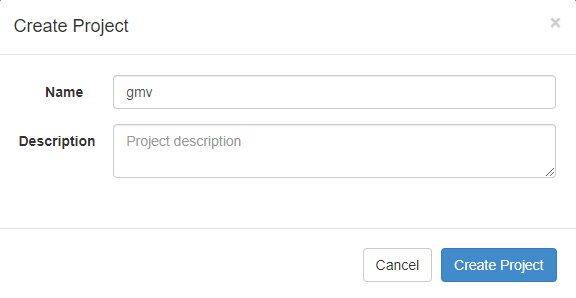
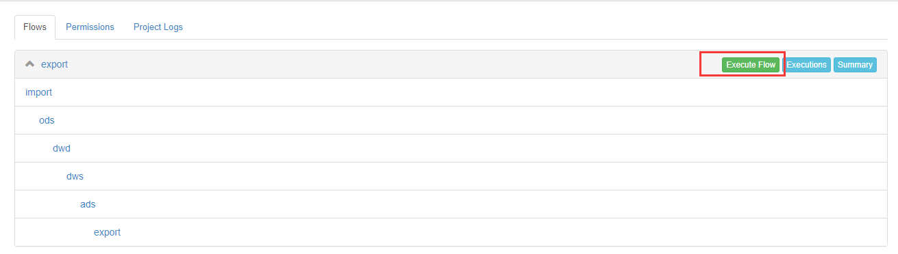
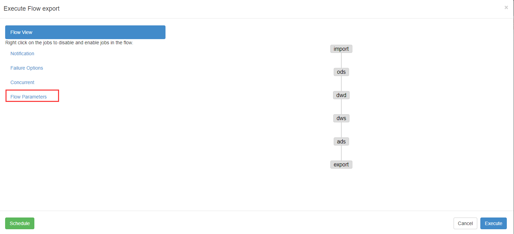
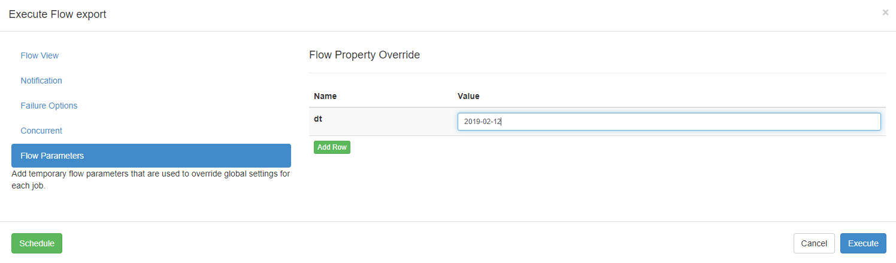

# Azkaban 调度器


## 安装

- 在/opt/module/目录下创建azkaban目录
- 解压azkaban-web-server-2.5.0.tar.gz、azkaban-executor-server-2.5.0.tar.gz、azkaban-sql-script-2.5.0.tar.gz到/opt/module/azkaban目录下
- 对解压后的文件重新命名

```bash
[ttshe@hadoop102 module]$ mkdir azkaban
[ttshe@hadoop102 software]$ tar -zxvf azkaban-web-server-2.5.0.tar.gz -C /opt/module/azkaban/
[ttshe@hadoop102 software]$ tar -zvxf azkaban-executor-server-2.5.0.tar.gz -C /opt/module/azkaban/
[ttshe@hadoop102 software]$ mv /opt/module/azkaban/azkaban-executor-2.5.0/ /opt/module/azkaban/executor
[ttshe@hadoop102 software]$ mv /opt/module/azkaban/azkaban-web-2.5.0/ /opt/module/azkaban/server
```

- azkaban脚本导入
  - 进入mysql，创建azkaban数据库，并将解压的脚本导入到azkaban数据库
  - 注：source后跟.sql文件，用于批量处理.sql文件中的sql语句

```sql
[ttshe@hadoop102 software]$ tar -zvxf azkaban-sql-script-2.5.0.tar.gz -C /opt/module/azkaban/
[ttshe@hadoop102 software]$ mysql -uroot -p123456
mysql> create database azkaban;
mysql> use azkaban;
mysql> source /opt/module/azkaban/azkaban-2.5.0/create-all-sql-2.5.0.sql
```

- 生成秘钥库
  - Keytool：是java数据证书的管理工具，使用户能够管理自己的公/私钥对及相关证书
  - -keystore：指定密钥库的名称及位置（产生的各类信息将不在.keystore文件中）
  - -genkey：在用户主目录中创建一个默认文件".keystore" 
  - -alias：对我们生成的.keystore进行指认别名；如果没有默认是mykey
  - -keyalg：指定密钥的算法 RSA/DSA 默认是DSA
- 生成 keystore的密码及相应信息的密钥库
  - 注意
    - 密钥库的密码至少必须6个字符，可以是纯数字或者字母或者数字和字母的组合等
    - 密钥库的密码最好和<jetty> 的密钥相同，方便记忆	

```bash
[ttshe@hadoop102 azkaban]$ keytool -keystore keystore -alias jetty -genkey -keyalg RSA
输入密钥库口令: 123456
再次输入新口令: 123456
您的名字与姓氏是什么?
  [Unknown]:  
您的组织单位名称是什么?
  [Unknown]:  
您的组织名称是什么?
  [Unknown]:  
您所在的城市或区域名称是什么?
  [Unknown]:  
您所在的省/市/自治区名称是什么?
  [Unknown]:  
该单位的双字母国家/地区代码是什么?
  [Unknown]:  
CN=Unknown, OU=Unknown, O=Unknown, L=Unknown, ST=Unknown, C=Unknown是否正确?
  [否]:  y

输入 <jetty> 的密钥口令
	(如果和密钥库口令相同, 按回车): 
```

- 将keystore 拷贝到 azkaban web服务器根目录中

```bash
[ttshe@hadoop102 azkaban]$ mv keystore /opt/module/azkaban/server/
```

- 先配置好服务器节点上的时区
  - 如果在/usr/share/zoneinfo/这个目录下不存在时区配置文件Asia/Shanghai，就要用 tzselect 生成


## 配置文件

- 进入azkaban web服务器安装目录 conf目录，打开azkaban.properties文件
- 按照如下配置修改azkaban.properties文件

```bash
[ttshe@hadoop102 conf]$ pwd
/opt/module/azkaban/server/conf
[ttshe@hadoop102 conf]$ vim azkaban.properties
```

```properties
#Azkaban Personalization Settings
#服务器UI名称,用于服务器上方显示的名字
azkaban.name=Test
#描述
azkaban.label=My Local Azkaban
#UI颜色
azkaban.color=#FF3601
azkaban.default.servlet.path=/index
#默认web server存放web文件的目录
web.resource.dir=/opt/module/azkaban/server/web/
#默认时区,已改为亚洲/上海 默认为美国
default.timezone.id=Asia/Shanghai

#Azkaban UserManager class
user.manager.class=azkaban.user.XmlUserManager
#用户权限管理默认类（绝对路径）
user.manager.xml.file=/opt/module/azkaban/server/conf/azkaban-users.xml

#Loader for projects
#global配置文件所在位置（绝对路径）
executor.global.properties=/opt/module/azkaban/executor/conf/global.properties
azkaban.project.dir=projects

#数据库类型
database.type=mysql
#端口号
mysql.port=3306
#数据库连接IP
mysql.host=hadoop102
#数据库实例名
mysql.database=azkaban
#数据库用户名
mysql.user=root
#数据库密码
mysql.password=123456
#最大连接数
mysql.numconnections=100

# Velocity dev mode
velocity.dev.mode=false

# Azkaban Jetty server properties.
# Jetty服务器属性.
#最大线程数
jetty.maxThreads=25
#Jetty SSL端口
jetty.ssl.port=8443
#Jetty端口
jetty.port=8081
#SSL文件名（绝对路径）
jetty.keystore=/opt/module/azkaban/server/keystore
#SSL文件密码
jetty.password=123456
#Jetty主密码与keystore文件相同
jetty.keypassword=123456
#SSL文件名（绝对路径）
jetty.truststore=/opt/module/azkaban/server/keystore
#SSL文件密码
jetty.trustpassword=123456

# Azkaban Executor settings
executor.port=12321

# mail settings
mail.sender=
mail.host=
job.failure.email=
job.success.email=

lockdown.create.projects=false

cache.directory=cache
```

- web服务器用户配置
- 在azkaban web服务器安装目录 conf目录，按照如下配置修改azkaban-users.xml 文件，增加管理员用户

```bash
[ttshe@hadoop102 conf]$ vim azkaban-users.xml
```

```xml
<azkaban-users>
	<user username="azkaban" password="azkaban" roles="admin" groups="azkaban" />
	<user username="metrics" password="metrics" roles="metrics"/>
	<user username="admin" password="admin" roles="admin" />
	<role name="admin" permissions="ADMIN" />
	<role name="metrics" permissions="METRICS"/>
</azkaban-users>
```

- 进入执行服务器安装目录conf，打开azkaban.properties

```bash
[ttshe@hadoop102 conf]$ pwd
/opt/module/azkaban/executor/conf
[ttshe@hadoop102 conf]$ vim azkaban.properties
```

```properties
#Azkaban
#时区
default.timezone.id=Asia/Shanghai

# Azkaban JobTypes Plugins
#jobtype 插件所在位置
azkaban.jobtype.plugin.dir=plugins/jobtypes

#Loader for projects
executor.global.properties=/opt/module/azkaban/executor/conf/global.properties
azkaban.project.dir=projects

database.type=mysql
mysql.port=3306
mysql.host=hadoop102
mysql.database=azkaban
mysql.user=root
mysql.password=123456
mysql.numconnections=100

# Azkaban Executor settings
#最大线程数
executor.maxThreads=50
#端口号(如修改,请与web服务中一致)
executor.port=12321
#线程数
executor.flow.threads=30
```


## 启动

- 在executor服务器目录下执行启动命令
- 在azkaban web服务器目录下执行启动命令
  - 注意：先执行executor，再执行web，避免Web Server会因为找不到执行器启动失败

```bash
[ttshe@hadoop102 executor]$ pwd
/opt/module/azkaban/executor
[ttshe@hadoop102 executor]$ bin/azkaban-executor-start.sh
[ttshe@hadoop102 server]$ pwd
/opt/module/azkaban/server
[ttshe@hadoop102 server]$ bin/azkaban-web-start.sh
[ttshe@hadoop102 server]$ jps
3601 AzkabanExecutorServer
5880 Jps
3661 AzkabanWebServer
```

- 启动完成后，在浏览器(建议使用谷歌浏览器)中输入https://hadoop102:8443即可访问azkaban服务，用户名和密码都是admin
  - 注意是https


## GMV指标获取的全调度流程

- 生成数据
  - 在MySQL中生成数据

```sql
CALL init_data('2019-02-12',300,200,300,FALSE);
```


### 编写Azkaban程序运行job


#### import.job

```bash
type=command
do_date=${dt}
command=/home/ttshe/bin/sqoop_import.sh all ${do_date}
```


#### ods.job

```bash
type=command
do_date=${dt}
dependencies=import
command=/home/ttshe/bin/ods_db.sh ${do_date}
```


#### dwd.job

```bash
type=command
do_date=${dt}
dependencies=ods
command=/home/ttshe/bin/dwd_db.sh ${do_date}
```


#### dws.job

```bash
type=command
do_date=${dt}
dependencies=dwd
command=/home/ttshe/bin/dws_db_wide.sh ${do_date}
```


#### ads.job

```bash
type=command
do_date=${dt}
dependencies=dws
command=/home/ttshe/bin/ads_db_gmv.sh ${do_date}
```


#### export.job

```bash
type=command
do_date=${dt}
dependencies=ads
command=/home/ttshe/bin/sqoop_export.sh ads_gmv_sum_day
```

- 将以上6个文件压缩成job.zip文件


### 执行job

- 在浏览器中https://hadoop102:8443并在页面上创建工程执行job.zip任务





- 输入参数





- 等待大约20分钟，在MySQL中查看结果

```sql
select * from ads_gmv_sum_day;
```

