# 电商业务与数据结构简介


## 电商业务流程

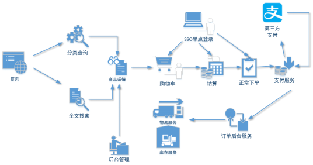

## 电商常识

- SKU=Stock Keeping Unit（库存量基本单位）
  - 现在已经被引申为产品统一编号的简称
  - 每种产品均对应有唯一的SKU号

- SPU(Standard Product Unit)
  - 是商品信息聚合的最小单位，是一组可复用、易检索的标准化信息集合

- 比如购买一台iPhoneX手机，iPhoneX手机就是一个SPU，但是你购买的时候，不可能是以iPhoneX手机为单位买的，商家也不可能以iPhoneX为单位记录库存SKU
- 必须要以什么颜色什么版本的iPhoneX为单位
- 如购买的是一台银色、128G内存的、支持联通网络的iPhoneX，商家也会以这个单位来记录库存数。那这个更细致的单位就叫库存单元（SKU）

- 那SPU又是干什么的呢？


- SPU表示一类商品
  - 好处就是：可以共用商品图片，海报、销售属性等


## 电商表结构


### 业务流程

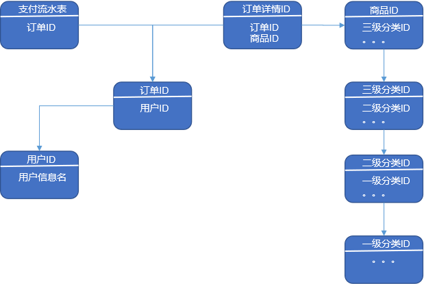

### 订单表 order_info

| 标签         | 含义         |
| ------------ | ------------ |
| id           | 订单编号     |
| total_amount | ==订单金额== |
| order_status | 订单状态     |
| user_id      | 用户id       |
| payment_way  | 支付方式     |
| out_trade_no | 支付流水号   |
| create_time  | ==创建时间== |
| operate_time | ==操作时间== |


### 订单详情表 order_detail

| 标签        | 含义         |
| ----------- | ------------ |
| id          | 订单编号     |
| order_id    | 订单号       |
| user_id     | 用户id       |
| sku_id      | 商品id       |
| sku_name    | 商品名称     |
| order_price | 商品价格     |
| sku_num     | 商品数量     |
| create_time | ==创建时间== |


### 商品表

| 标签         | 含义         |
| ------------ | ------------ |
| id           | skuId        |
| spu_id       | spuid        |
| price        | 价格         |
| sku_name     | 商品名称     |
| sku_desc     | 商品描述     |
| weight       | 重量         |
| tm_id        | 品牌id       |
| category3_id | 品类id       |
| create_time  | ==创建时间== |


### 用户表

| 标签        | 含义     |
| ----------- | -------- |
| id          | 用户id   |
| name        | 姓名     |
| birthday    | 生日     |
| gender      | 性别     |
| email       | 邮箱     |
| user_level  | 用户等级 |
| create_time | 创建时间 |


### 商品一级分类表

| 标签 | 含义 |
| ---- | ---- |
| id   | id   |
| name | 名称 |


### 商品二级分类表

| 标签         | 含义       |
| ------------ | ---------- |
| id           | id         |
| name         | 名称       |
| category1_id | 一级品类id |


### 商品三级分类表

| 标签         | 含义       |
| ------------ | ---------- |
| id           | id         |
| name         | 名称       |
| Category2_id | 二级品类id |


### 支付流水表

| 标签            | 含义               |
| --------------- | ------------------ |
| id              | 编号               |
| out_trade_no    | 对外业务编号       |
| order_id        | 订单编号           |
| user_id         | 用户编号           |
| alipay_trade_no | 支付宝交易流水编号 |
| total_amount    | 支付金额           |
| subject         | 交易内容           |
| payment_type    | 支付类型           |
| payment_time    | ==支付时间==       |


# 数仓理论（重点）


## 表的分类


### 实体表

- 一般是指一个现实存在的业务对象，比如用户，商品，商家，销售员等等

| 用户id | 姓名 | 生日       | 性别 | 邮箱       | 用户等级 | 创建时间   |
| ------ | ---- | ---------- | ---- | ---------- | -------- | ---------- |
| 1      | 张三 | 2011-11-11 | 男   | zs@163.com | 2        | 2018-11-11 |
| 2      | 李四 | 2011-11-11 | 女   | ls@163.com | 3        | 2018-11-11 |
| 3      | 王五 | 2011-11-11 | 中性 | ww@163.com | 1        | 2018-11-11 |
| …      | …    | …          | …    | …          | …        | …          |


### 维度表

- 一般是指对应一些==业务状态==，编号的解释表
- ==码表==
- 如地区表，订单状态，支付方式，审批状态，商品分类等

订单状态表：

| 订单状态编号 | 订单状态名称 |
| ------------ | ------------ |
| 1            | 未支付       |
| 2            | 支付         |
| 3            | 发货中       |
| 4            | 已发货       |
| 5            | 已完成       |

商品分类表：

| 商品分类编号 | 分类名称 |
| ------------ | -------- |
| 1            | 服装     |
| 2            | 保健     |
| 3            | 电器     |
| 4            | 图书     |


### 事务型事实表

- 一般指随着业务发生不断产生的数据
- 特点是==一旦发生不会再变化==

- 如交易流水，操作日志，出库入库记录等

交易流水表：

| 编号   | 对外业务编号 | 订单编号 | 用户编号 | 支付宝交易流水编号 | 支付金额 | 交易内容    | 支付类型  | 支付时间            |
| ------ | ------------ | -------- | -------- | ------------------ | -------- | ----------- | --------- | ------------------- |
| 1      | 7577697945   | 1        | 111      | QEyF-63000323      | 223.00   | 海狗人参丸1 | alipay    | 2019-02-10 00:50:02 |
| 2      | 0170099522   | 2        | 222      | qdwV-25111279      | 589.00   | 海狗人参丸2 | wechatpay | 2019-02-10 00:50:02 |
| 3      | 1840931679   | 3        | 666      | hSUS-65716585      | 485.00   | 海狗人参丸3 | unionpay  | 2019-02-10 00:50:02 |
| 。。。 | 。。。       | 。。。   | 。。。   | 。。。             | 。。。   | 。。。      | 。。。    | 。。。              |


### 周期型事实表

- 一般指==随着业务发生不断产生的数据==

- 与事务型不同的是，数据会随着业务周期性的推进而变化

- 如订单，其中订单状态会周期性变化
- 如请假、贷款申请，随着批复状态在周期性变化


## 同步策略

- 数据同步策略的类型包括
  - 全量表
    - 存储完整的数据
  - 增量表
    - 存储新增加的数据
  - 新增及变化表
    - 存储新增加的数据和变化的数据
  - 拉链表
    - 对新增及变化表做==定期合并==


### 实体表同步策略

- 实体表
  - 如用户，商品，商家，销售员等

- 实体表数据量比较小
- 通常每天存一份完整数据
- ==每日全量==


### 维度表同步策略

- 维度表
  - 如订单状态，审批状态，商品分类

- 维度表数据量比较小
- 通常每天存一份完整数据
- 每日全量

- 说明
  - 针对可能会有变化的状态数据可以存储每日全量
  - 没变化的客观世界的维度可只存一份固定值
    - 如性别，地区，民族，政治成分，鞋子尺码


### 事务型事实表同步策略

- 事务型事实表
  - 如交易流水，操作日志，出库入库记录等

- 因为数据不会变化，而且数据量巨大，所以每天只同步新增数据即可
- 可做成==每日增量表==
- ==每日创建一个分区存储==


### 周期型事实表同步策略

- 周期型事实表
  - 如订单、请假、贷款申请等

- 从数据量的角度，存每日全量的话，数据量太大，冗余也太大
- 如果用每日增量的话无法反应数据变化

-  ==每日新增及变化量==，包括了当日的新增和修改
- 一般来说这个表，足够计算大部分当日数据，但是这种依然无法解决能够得到某一个历史时间点（时间切片）的切片数据
- ==所以利用每日新增和变化表，制作一张拉链表==，以方便的取到某个时间切片的快照数据

拉链表：

| name姓名 | start新名字创建时间 | end名字更改时间 |
| -------- | ------------------- | --------------- |
| 张三     | 1990/1/1            | 2018/12/31      |
| 张小三   | 2019/1/1            | 2019/4/30       |
| 张大三   | 2019/5/1            | 9999-99-99      |
| 。。。   | 。。。              | 。。。          |

select * from user where start =<’2019-1-2’ and end>=’2019-1-2’


## 范式理论


### 概念

- 关系型数据库设计时，遵照一定的规范要求，目的在于降低数据的冗余性，目前业界范式有
  - ==第一范式(1NF)==
  - ==第二范式(2NF)==
  - ==第三范式(3NF)==
  - 巴斯-科德范式(BCNF)
  - 第四范式(4NF)
  - 第五范式(5NF)

- 范式可以理解为设计一张数据表的表结构，符合的标准级别

- 使用范式的根本目的是
  - 减少数据冗余，尽量让每个数据只出现一次
  - 保证数据一致性
- 缺点是获取数据时，需要通过Join拼接出最后的数据。


### 数据依赖


- 完全函数依赖
  - 如通过(学号，课程) 推出分数 ，但是单独用学号推断不出来分数
  - 分数完全依赖于(学号，课程) 
  - 通过AB能得出C，但是AB单独得不出C，那么说C完全依赖于AB
- 部分函数依赖
  - 如通过(学号，课程) 推出姓名，因为其实直接可以通过学号推出姓名
  - 姓名部分依赖于 (学号，课程)
  - 通过AB能得出C，通过A也能得出C，或者通过B也能得出C，那么说C部分依赖于AB
- 传递函数依赖
  - 如学号 推出系名，系名推出系主任， 但是系主任推不出学号，系主任主要依赖于系名
  - 系主任传递依赖于学号
  - 通过A得到B，通过B得到C，但是C得不到A，那么说C传递依赖于A


### 第一范式


### 第二范式


### 第三范式


## 关系建模与维度建模

- 关系模型


- 关系模型主要应用与OLTP系统中，为了保证数据的一致性以及避免冗余，所以大部分业务系统的表都是遵循第三范式的

- 维度模型

  

- 维度模型主要应用于OLAP系统中，因为关系模型虽然冗余少，但是在大规模数据，==跨表分析统计查询过程中，会造成多表关联大大降低执行效率==

- 所以把相关各种表整理成两种：事实表和维度表两种
- 所有维度表围绕着事实表进行解释。


## 星型模型&雪花模型

在维度建模的基础上又分为三种模型：星型模型、雪花模型、星座模型


## 星座模型


# 数仓搭建


## 配置Hadoop支持Snappy压缩

- 一般snappy和orc一起配合使用

- 将编译后支持Snappy压缩的Hadoop jar包解压缩，并将lib/native目录中所有文件上传到hadoop102的/opt/module/hadoop-2.7.2/lib/native目录，并分发到hadoop103 hadoop104

- 重新启动Hadoop

- 检查支持的压缩方式

```bash
[ttshe@hadoop102 software]$ cp -r native/ /opt/module/hadoop-2.7.2/lib
[ttshe@hadoop102 lib]$ xsync native/
[ttshe@hadoop102 lib]$ hadoop checknative
[ttshe@hadoop102 lib]$ cluster.sh start
```


## 业务数据生成


### 建表

- 创建数据库gmall


- 导入建表语句
  - 1建表脚本


- 重复步骤3的导入方式，依次导入：2商品分类数据插入脚本、3函数脚本、4存储过程脚本

  

### 生成业务数据

- 生成业务数据函数说明
  - do_date_string生成数据日期
  - order_incr_num订单id个数
  - user_incr_num用户id个数
  - sku_num商品sku个数
  - if_truncate是否删除数据

```sql
init_data (do_date_string VARCHAR(20) , order_incr_num INT, user_incr_num INT , sku_num INT , if_truncate BOOLEAN)
```

- 测试
  - 需求：生成日期2019年2月10日数据、订单1000个、用户200个、商品sku300个、删除原始数据

```sql
CALL init_data('2019-02-10',1000,200,300,TRUE);
```

```sql
SELECT * from base_category1;
SELECT * from base_category2;
SELECT * from base_category3;

SELECT * from order_info;
SELECT * from order_detail;

SELECT * from sku_info;
SELECT * from user_info;

SELECT * from payment_info;
```


## 业务数据导入数仓


### Sqoop安装

- 安装Sqoop的前提是已经具备Java和Hadoop的环境

- 下载地址：http://mirrors.hust.edu.cn/apache/sqoop/1.4.6/

- 上传安装包sqoop-1.4.6.bin__hadoop-2.0.4-alpha.tar.gz到虚拟机中

- 解压sqoop安装包到指定目录

```bash
[ttshe@hadoop102 software]$ tar -zxvf sqoop-1.4.6.bin__hadoop-2.0.4-alpha.tar.gz -C /opt/module/
[ttshe@hadoop102 module]$ mv sqoop-1.4.6.bin__hadoop-2.0.4-alpha/ sqoop/
```

- 重命名配置文件
- 修改配置文件

```bash
[ttshe@hadoop102 conf]$ pwd
/opt/module/sqoop/conf
[ttshe@hadoop102 conf]$ cp sqoop-env-template.sh sqoop-env.sh
[ttshe@hadoop102 conf]$ vim sqoop-env.sh 
# 增加如下配置
export HADOOP_COMMON_HOME=/opt/module/hadoop-2.7.2
export HADOOP_MAPRED_HOME=/opt/module/hadoop-2.7.2
export HIVE_HOME=/opt/module/hive
export ZOOKEEPER_HOME=/opt/module/zookeeper-3.4.10
export ZOOCFGDIR=/opt/module/zookeeper-3.4.10
export HBASE_HOME=/opt/module/hbase
```

- JDBC驱动
- 拷贝jdbc驱动到sqoop的lib目录下

```bash
[ttshe@hadoop102 mysql-connector-java-5.1.27]$ cp mysql-connector-java-5.1.27-bin.jar /opt/module/sqoop/lib/
```

- 验证

```bash
[ttshe@hadoop102 sqoop]$ bin/sqoop help
```

- 连接数据库

```bash
[ttshe@hadoop102 sqoop]$ bin/sqoop list-databases --connect jdbc:mysql://hadoop102:3306/ --username root --password 123456
```


### 导入命令

```bash
/opt/module/sqoop/bin/sqoop import \
--connect \
--username \
--password \
--target-dir \
--delete-target-dir \
--num-mappers \
--fields-terminated-by \
--query "$2" ' and $CONDITIONS;'
```


### 分析表


### Sqoop定时导入脚本

- 在/home/ttshe/bin目录下创建脚本sqoop_import.sh

```bash
[ttshe@hadoop102 bin]$ touch sqoop_import.sh
[ttshe@hadoop102 bin]$ chmod 777 sqoop_import.sh 
[ttshe@hadoop102 bin]$ vim sqoop_import.sh 
```

```bash
#!/bin/bash

db_date=$2
echo $db_date
db_name=gmall

import_data() {
/opt/module/sqoop/bin/sqoop import \
--connect jdbc:mysql://hadoop102:3306/$db_name \
--username root \
--password 123456 \
--target-dir /origin_data/$db_name/db/$1/$db_date \
--delete-target-dir \
--num-mappers 1 \
--fields-terminated-by "\t" \
--query "$2"' and $CONDITIONS;'
}

import_sku_info(){
  import_data "sku_info"  "select 
id, spu_id, price, sku_name, sku_desc, weight, tm_id,
category3_id, create_time
  from sku_info where 1=1"
}

import_user_info(){
  import_data "user_info"  "select 
id, name, birthday, gender, email, user_level, 
create_time 
from user_info where 1=1"
}

import_base_category1(){
  import_data "base_category1"  "select 
id, name from base_category1 where 1=1"
}

import_base_category2(){
  import_data "base_category2" "select 
id, name, category1_id from base_category2 where 1=1"
}

import_base_category3(){
  import_data "base_category3" "select id, name, category2_id from base_category3 where 1=1"
}

import_order_detail(){
  import_data   "order_detail"   "select 
    od.id, 
    order_id, 
    user_id, 
    sku_id, 
    sku_name, 
    order_price, 
    sku_num, 
    o.create_time  
  from order_info o, order_detail od
  where o.id=od.order_id
  and DATE_FORMAT(create_time,'%Y-%m-%d')='$db_date'"
}

import_payment_info(){
  import_data "payment_info"   "select 
    id,  
    out_trade_no, 
    order_id, 
    user_id, 
    alipay_trade_no, 
    total_amount,  
    subject, 
    payment_type, 
    payment_time 
  from payment_info 
  where DATE_FORMAT(payment_time,'%Y-%m-%d')='$db_date'"
}

import_order_info(){
  import_data   "order_info"   "select 
    id, 
    total_amount, 
    order_status, 
    user_id, 
    payment_way, 
    out_trade_no, 
    create_time, 
    operate_time  
  from order_info 
  where (DATE_FORMAT(create_time,'%Y-%m-%d')='$db_date' or DATE_FORMAT(operate_time,'%Y-%m-%d')='$db_date')"
}

case $1 in
  "base_category1")
     import_base_category1
;;
  "base_category2")
     import_base_category2
;;
  "base_category3")
     import_base_category3
;;
  "order_info")
     import_order_info
;;
  "order_detail")
     import_order_detail
;;
  "sku_info")
     import_sku_info
;;
  "user_info")
     import_user_info
;;
  "payment_info")
     import_payment_info
;;
   "all")
   import_base_category1
   import_base_category2
   import_base_category3
   import_order_info
   import_order_detail
   import_sku_info
   import_user_info
   import_payment_info
;;
esac
```

- 注意，每日增量使用日期进行过滤，而新增与变化则需要使用==创建时间和操作时间进行过滤==

- 执行脚本导入数据

```bash
[ttshe@hadoop102 bin]$ sqoop_import.sh all 2019-02-10
```

- 在SQLyog中生成2019年2月11日数据

```sql
CALL init_data('2019-02-11',1000,200,300,TRUE);
```

- 执行脚本导入数据

```bash
[ttshe@hadoop102 bin]$ sqoop_import.sh all 2019-02-11
```


### Sqoop导入数据异常处理

- 问题描述
  - 执行Sqoop导入数据脚本时，发生如下异常

```java
java.sql.SQLException: Streaming result set com.mysql.jdbc.RowDataDynamic@65d6b83b is still active. No statements may be issued when any streaming result sets are open and in use on a given connection. Ensure that you have called .close() on any active streaming result sets before attempting more queries.
	at com.mysql.jdbc.SQLError.createSQLException(SQLError.java:930)
	at com.mysql.jdbc.MysqlIO.checkForOutstandingStreamingData(MysqlIO.java:2646)
	at com.mysql.jdbc.MysqlIO.sendCommand(MysqlIO.java:1861)
	at com.mysql.jdbc.MysqlIO.sqlQueryDirect(MysqlIO.java:2101)
	at com.mysql.jdbc.ConnectionImpl.execSQL(ConnectionImpl.java:2548)
	at com.mysql.jdbc.ConnectionImpl.execSQL(ConnectionImpl.java:2477)
	at com.mysql.jdbc.StatementImpl.executeQuery(StatementImpl.java:1422)
	at com.mysql.jdbc.ConnectionImpl.getMaxBytesPerChar(ConnectionImpl.java:2945)
	at com.mysql.jdbc.Field.getMaxBytesPerCharacter(Field.java:582)
```

- 问题解决方案
  - 增加如下导入参数

```bash
--driver com.mysql.jdbc.Driver \
```


## ODS层

- 仿照业务数据库中的表字段，一模一样的创建ODS层对应表

```sql
use gmall;
```


### 创建订单表

```sql
drop table if exists ods_order_info;
create external table ods_order_info(
    `id` string comment '订单编号',
    `total_amount` decimal(10,2) COMMENT '订单金额',
    `order_status` string COMMENT '订单状态',
    `user_id` string COMMENT '用户id',
    `payment_way` string COMMENT '支付方式',
    `out_trade_no` string COMMENT '支付流水号',
    `create_time` string COMMENT '创建时间',
    `operate_time` string COMMENT '操作时间'
) COMMENT '订单表'
PARTITIONED BY (`dt` string)
row format delimited fields terminated by '\t'
location '/warehouse/gmall/ods/ods_order_info/';
```


### 创建订单详情表

```sql
drop table if exists ods_order_detail;
create external table ods_order_detail( 
    `id` string COMMENT '订单编号',
    `order_id` string  COMMENT '订单号', 
    `user_id` string COMMENT '用户id',
    `sku_id` string COMMENT '商品id',
    `sku_name` string COMMENT '商品名称',
    `order_price` string COMMENT '商品价格',
    `sku_num` string COMMENT '商品数量',
    `create_time` string COMMENT '创建时间'
) COMMENT '订单明细表'
PARTITIONED BY (`dt` string)
row format delimited fields terminated by '\t' 
location '/warehouse/gmall/ods/ods_order_detail/';
```


### 创建商品表

```sql
drop table if exists ods_sku_info;
create external table ods_sku_info( 
    `id` string COMMENT 'skuId',
    `spu_id` string COMMENT 'spuid', 
    `price` decimal(10,2) COMMENT '价格',
    `sku_name` string COMMENT '商品名称',
    `sku_desc` string COMMENT '商品描述',
    `weight` string COMMENT '重量',
    `tm_id` string COMMENT '品牌id',
    `category3_id` string COMMENT '品类id',
    `create_time` string COMMENT '创建时间'
) COMMENT '商品表'
PARTITIONED BY (`dt` string)
row format delimited fields terminated by '\t'
location '/warehouse/gmall/ods/ods_sku_info/';
```


### 创建用户表

```sql
drop table if exists ods_user_info;
create external table ods_user_info( 
    `id` string COMMENT '用户id',
    `name`  string COMMENT '姓名',
    `birthday` string COMMENT '生日',
    `gender` string COMMENT '性别',
    `email` string COMMENT '邮箱',
    `user_level` string COMMENT '用户等级',
    `create_time` string COMMENT '创建时间'
) COMMENT '用户信息'
PARTITIONED BY (`dt` string)
row format delimited fields terminated by '\t'
location '/warehouse/gmall/ods/ods_user_info/';
```


### 创建商品一级分类表

```sql
drop table if exists ods_base_category1;
create external table ods_base_category1( 
    `id` string COMMENT 'id',
    `name`  string COMMENT '名称'
) COMMENT '商品一级分类'
PARTITIONED BY (`dt` string)
row format delimited fields terminated by '\t'
location '/warehouse/gmall/ods/ods_base_category1/';
```


### 创建商品二级分类表

```sql
drop table if exists ods_base_category2;
create external table ods_base_category2( 
    `id` string COMMENT ' id',
    `name` string COMMENT '名称',
    category1_id string COMMENT '一级品类id'
) COMMENT '商品二级分类'
PARTITIONED BY (`dt` string)
row format delimited fields terminated by '\t'
location '/warehouse/gmall/ods/ods_base_category2/';
```


### 创建商品三级分类表

```sql
drop table if exists ods_base_category3;
create external table ods_base_category3(
    `id` string COMMENT ' id',
    `name`  string COMMENT '名称',
    category2_id string COMMENT '二级品类id'
) COMMENT '商品三级分类'
PARTITIONED BY (`dt` string)
row format delimited fields terminated by '\t'
location '/warehouse/gmall/ods/ods_base_category3/';
```


### 创建支付流水表

```sql
drop table if exists ods_payment_info;
create external table ods_payment_info(
    `id` bigint COMMENT '编号',
    `out_trade_no` string COMMENT '对外业务编号',
    `order_id` string COMMENT '订单编号',
    `user_id` string COMMENT '用户编号',
    `alipay_trade_no` string COMMENT '支付宝交易流水编号',
    `total_amount` decimal(16,2) COMMENT '支付金额',
    `subject` string COMMENT '交易内容',
    `payment_type` string COMMENT '支付类型',
    `payment_time` string COMMENT '支付时间'
)  COMMENT '支付流水表'
PARTITIONED BY (`dt` string)
row format delimited fields terminated by '\t'
location '/warehouse/gmall/ods/ods_payment_info/';
```


### ODS层数据导入脚本

- 在/home/ttshe/bin目录下创建脚本ods_db.sh

```bash
[ttshe@hadoop102 bin]$ touch ods_db.sh
[ttshe@hadoop102 bin]$ chmod 777 ods_db.sh
[ttshe@hadoop102 bin]$ vim ods_db.sh
```

```bash
#!/bin/bash

APP=gmall
hive=/opt/module/hive/bin/hive

# 如果是输入的日期按照取输入日期；如果没输入日期取当前时间的前一天
if [ -n "$1" ] ;then
	do_date=$1
else 
	do_date=`date -d "-1 day" +%F`
fi

sql=" 
load data inpath '/origin_data/$APP/db/order_info/$do_date' OVERWRITE into table "$APP".ods_order_info partition(dt='$do_date');

load data inpath '/origin_data/$APP/db/order_detail/$do_date' OVERWRITE into table "$APP".ods_order_detail partition(dt='$do_date');

load data inpath '/origin_data/$APP/db/sku_info/$do_date' OVERWRITE into table "$APP".ods_sku_info partition(dt='$do_date');

load data inpath '/origin_data/$APP/db/user_info/$do_date' OVERWRITE into table "$APP".ods_user_info partition(dt='$do_date');

load data inpath '/origin_data/$APP/db/payment_info/$do_date' OVERWRITE into table "$APP".ods_payment_info partition(dt='$do_date');

load data inpath '/origin_data/$APP/db/base_category1/$do_date' OVERWRITE into table "$APP".ods_base_category1 partition(dt='$do_date');

load data inpath '/origin_data/$APP/db/base_category2/$do_date' OVERWRITE into table "$APP".ods_base_category2 partition(dt='$do_date');

load data inpath '/origin_data/$APP/db/base_category3/$do_date' OVERWRITE into table "$APP".ods_base_category3 partition(dt='$do_date'); 
"
$hive -e "$sql"
```

- 导入数据

```bash
[ttshe@hadoop102 bin]$ ods_db.sh 2019-02-10
[ttshe@hadoop102 bin]$ ods_db.sh 2019-02-11
```

- 查询

```sql
hive (gmall)> select * from ods_order_info where dt='2019-02-10' limit 1;
hive (gmall)> select * from ods_order_info where dt='2019-02-11' limit 1;
```


## DWD层

- 对ODS层数据进行判空过滤。对商品分类表进行维度退化（降维）


### 创建订单表

```sql
drop table if exists dwd_order_info;
create external table dwd_order_info (
    `id` string COMMENT '',
    `total_amount` decimal(10,2) COMMENT '',
    `order_status` string COMMENT ' 1 2 3 4 5',
    `user_id` string COMMENT 'id',
    `payment_way` string COMMENT '',
    `out_trade_no` string COMMENT '',
    `create_time` string COMMENT '',
    `operate_time` string COMMENT ''
) 
PARTITIONED BY (`dt` string)
stored as parquet
location '/warehouse/gmall/dwd/dwd_order_info/'
tblproperties ("parquet.compression"="snappy");
```


### 创建订单详情表

```sql
drop table if exists dwd_order_detail;
create external table dwd_order_detail( 
    `id` string COMMENT '',
    `order_id` decimal(10,2) COMMENT '', 
    `user_id` string COMMENT 'id',
    `sku_id` string COMMENT 'id',
    `sku_name` string COMMENT '',
    `order_price` string COMMENT '',
    `sku_num` string COMMENT '',
    `create_time` string COMMENT ''
)
PARTITIONED BY (`dt` string)
stored as parquet
location '/warehouse/gmall/dwd/dwd_order_detail/'
tblproperties ("parquet.compression"="snappy");
```


### 创建用户表

```sql
drop table if exists dwd_user_info;
create external table dwd_user_info( 
    `id` string COMMENT 'id',
    `name` string COMMENT '', 
    `birthday` string COMMENT '',
    `gender` string COMMENT '',
    `email` string COMMENT '',
    `user_level` string COMMENT '',
    `create_time` string COMMENT ''
) 
PARTITIONED BY (`dt` string)
stored as parquet
location '/warehouse/gmall/dwd/dwd_user_info/'
tblproperties ("parquet.compression"="snappy");
```


### 创建支付流水表

```sql
drop table if exists dwd_payment_info;
create external table dwd_payment_info(
    `id` bigint COMMENT '',
    `out_trade_no` string COMMENT '',
    `order_id` string COMMENT '',
    `user_id` string COMMENT '',
    `alipay_trade_no` string COMMENT '',
    `total_amount` decimal(16,2) COMMENT '',
    `subject` string COMMENT '',
    `payment_type` string COMMENT '',
    `payment_time` string COMMENT ''
)  
PARTITIONED BY (`dt` string)
stored as parquet
location '/warehouse/gmall/dwd/dwd_payment_info/'
tblproperties ("parquet.compression"="snappy");
```


### 创建商品表（降维，重点）


```sql
drop table if exists dwd_sku_info;
create external table dwd_sku_info(
    `id` string COMMENT 'skuId',
    `spu_id` string COMMENT 'spuid',
    `price` decimal(10,2) COMMENT '',
    `sku_name` string COMMENT '',
    `sku_desc` string COMMENT '',
    `weight` string COMMENT '',
    `tm_id` string COMMENT 'id',
    `category3_id` string COMMENT '1id',
    `category2_id` string COMMENT '2id',
    `category1_id` string COMMENT '3id',
    `category3_name` string COMMENT '3',
    `category2_name` string COMMENT '2',
    `category1_name` string COMMENT '1',
    `create_time` string COMMENT ''
) 
PARTITIONED BY (`dt` string)
stored as parquet
location '/warehouse/gmall/dwd/dwd_sku_info/'
tblproperties ("parquet.compression"="snappy");
```


### DWD层数据导入脚本

- 在/home/ttshe/bin目录下创建脚本dwd_db.sh

```bash
[ttshe@hadoop102 bin]$ touch dwd_db.sh
[ttshe@hadoop102 bin]$ chmod 777 dwd_db.sh
[ttshe@hadoop102 bin]$ vim dwd_db.sh
```

```bash
#!/bin/bash

# 定义变量方便修改
APP=gmall
hive=/opt/module/hive/bin/hive

# 如果是输入的日期按照取输入日期；如果没输入日期取当前时间的前一天
if [ -n "$1" ] ;then
	do_date=$1
else 
	do_date=`date -d "-1 day" +%F`  
fi 

sql="

set hive.exec.dynamic.partition.mode=nonstrict;

insert overwrite table "$APP".dwd_order_info partition(dt)
select * from "$APP".ods_order_info 
where dt='$do_date' and id is not null;
 
insert overwrite table "$APP".dwd_order_detail partition(dt)
select * from "$APP".ods_order_detail 
where dt='$do_date'  and id is not null;

insert overwrite table "$APP".dwd_user_info partition(dt)
select * from "$APP".ods_user_info
where dt='$do_date' and id is not null;
 
insert overwrite table "$APP".dwd_payment_info partition(dt)
select * from "$APP".ods_payment_info
where dt='$do_date' and id is not null;

insert overwrite table "$APP".dwd_sku_info 
partition(dt)
select  
    sku.id,
    sku.spu_id,
    sku.price,
    sku.sku_name,
    sku.sku_desc,
    sku.weight,
    sku.tm_id,
    sku.category3_id,
    c2.id category2_id,
    c1.id category1_id,
    c3.name category3_name,
    c2.name category2_name,
    c1.name category1_name,
    sku.create_time,
    sku.dt
from
    "$APP".ods_sku_info sku
join "$APP".ods_base_category3 c3 on sku.category3_id=c3.id 
    join "$APP".ods_base_category2 c2 on c3.category2_id=c2.id 
    join "$APP".ods_base_category1 c1 on c2.category1_id=c1.id 
where sku.dt='$do_date' and c2.dt='$do_date'
and c3.dt='$do_date' and c1.dt='$do_date'
and sku.id is not null;
"

$hive -e "$sql"
```

- 执行导入

```bash
[ttshe@hadoop102 bin]$ dwd_db.sh 2019-02-10
[ttshe@hadoop102 bin]$ dwd_db.sh 2019-02-11
```

- 查询

```sql
hive (gmall)> select * from dwd_sku_info where dt='2019-02-10' limit 2;
hive (gmall)> select * from dwd_sku_info where dt='2019-02-11' limit 2;
```


### 小结

思考

- 维度退化要付出什么代价？ 
  - 如果被退化的维度，还有其他业务表使用，退化后处理起来就麻烦些

- 想想在实际业务中还有那些维度表可以退化
  - 城市的三级分类（省、市、县）等


## DWS层之用户行为宽表

- 为什么要建宽表
- 需求目标，把每个用户单日的行为聚合起来组成一张多列宽表，以便之后关联用户维度信息后进行，不同角度的统计分析


### 创建表

```sql
drop table if exists dws_user_action;
create external table dws_user_action(
    user_id string comment '用户 id',
    order_count bigint comment '下单次数',
    order_amount decimal(16,2) comment '下单金额',
    payment_count bigint comment '支付次数',
    payment_amount decimal(16,2) comment '支付金额',
    comment_count bigint comment '评论次数'
) comment '每日用户行为宽表'
partitioned by (`dt` string)
stored as parquet
location '/warehouse/gmall/dws/dws_user_action/'
tblproperties ("parquet.compression"="snappy");
```


### 导入数据

- 使用临时表
- 统计指定日期的订单数，订单金额，支付金额，支付数，评论数
- 注意在求和的时候补位0，用于sum计算

```sql
hive (gmall)>
with  
tmp_order as
(
    select 
        user_id, 
        count(*) order_count,
        sum(oi.total_amount) order_amount
    from dwd_order_info oi
    where date_format(oi.create_time,'yyyy-MM-dd')='2019-02-10'
    group by user_id
) ,
tmp_payment as
(
    select
        user_id, 
        sum(pi.total_amount) payment_amount, 
        count(*) payment_count 
    from dwd_payment_info pi 
    where date_format(pi.payment_time,'yyyy-MM-dd')='2019-02-10'
    group by user_id
),
tmp_comment as
(
    select
        user_id,
        count(*) comment_count
    from dwd_comment_log c
    where date_format(c.dt,'yyyy-MM-dd')='2019-02-10'
    group by user_id
)

insert overwrite table dws_user_action 
partition(dt='2019-02-10')
select
    user_actions.user_id,
    sum(user_actions.order_count),
    sum(user_actions.order_amount),
    sum(user_actions.payment_count),
    sum(user_actions.payment_amount),
    sum(user_actions.comment_count)
from 
(
    select
        user_id,
        order_count,
        order_amount,
        0 payment_count,
        0 payment_amount,
        0 comment_count
    from tmp_order

    union all
    select
        user_id,
        0,
        0,
        payment_count,
        payment_amount,
        0
    from tmp_payment

    union all
    select
        user_id,
        0,
        0,
        0,
        0,
        comment_count
    from tmp_comment
 ) user_actions
group by user_id;
```

- 查询

```sql
hive (gmall)> select * from dws_user_action;
```


### 用户行为数据宽表导入脚本

- 在/home/ttshe/bin目录下创建脚本dws_db_wide.sh

```bash
[ttshe@hadoop102 bin]$ touch dws_db_wide.sh
[ttshe@hadoop102 bin]$ chmod 777 dws_db_wide.sh
[ttshe@hadoop102 bin]$ vim dws_db_wide.sh
```

```bash
#!/bin/bash

# 定义变量方便修改
APP=gmall
hive=/opt/module/hive/bin/hive

# 如果是输入的日期按照取输入日期；如果没输入日期取当前时间的前一天
if [ -n "$1" ] ;then
	do_date=$1
else 
	do_date=`date -d "-1 day" +%F`  
fi 

sql="

with  
tmp_order as
(
    select 
        user_id, 
        sum(oi.total_amount) order_amount, 
        count(*)  order_count
    from "$APP".dwd_order_info  oi
    where date_format(oi.create_time,'yyyy-MM-dd')='$do_date'
    group by user_id
)  ,
tmp_payment as
(
    select 
        user_id, 
        sum(pi.total_amount) payment_amount, 
        count(*) payment_count 
    from "$APP".dwd_payment_info pi 
    where date_format(pi.payment_time,'yyyy-MM-dd')='$do_date'
    group by user_id
),
tmp_comment as
(  
    select  
        user_id, 
        count(*) comment_count
    from "$APP".dwd_comment_log c
    where date_format(c.dt,'yyyy-MM-dd')='$do_date'
    group by user_id 
)

Insert overwrite table "$APP".dws_user_action partition(dt='$do_date')
select 
    user_actions.user_id, 
    sum(user_actions.order_count), 
    sum(user_actions.order_amount),
    sum(user_actions.payment_count), 
    sum(user_actions.payment_amount),
    sum(user_actions.comment_count) 
from
(
    select
        user_id,
        order_count,
        order_amount,
        0 payment_count,
        0 payment_amount,
        0 comment_count
    from tmp_order

    union all
    select
        user_id,
        0,
        0,
        payment_count,
        payment_amount,
        0
    from tmp_payment

    union all
    select
        user_id,
        0,
        0,
        0,
        0,
        comment_count 
    from tmp_comment
 ) user_actions
group by user_id;
"

$hive -e "$sql"
```

- 导入数据

```bash
[ttshe@hadoop102 bin]$ dws_db_wide.sh 2019-02-11
```

- 查看导入的数据

```bash
hive (gmall)> 
select * from dws_user_action where dt='2019-02-11' limit 2;
```


# 需求


## GMV成交总额

- GMV
  - Gross  Merchandise Volume
  - 是一定时间段内的成交总额（比如一天、一个月、一年）
- 在电商网站定义里面是网站成交金额。这个实际指的是拍下订单金额，包含付款和未付款的部分
  - GMV是电商平台非常重视的统计指标，甚至写在招股书里

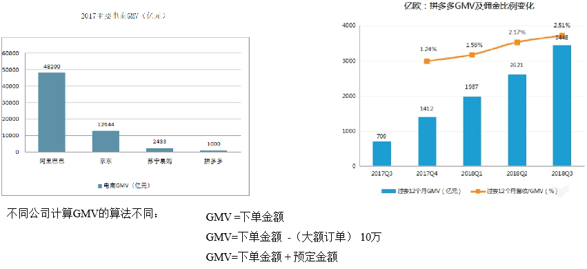


### ADS层

- 建表语句

```sql
drop table if exists ads_gmv_sum_day;
create external table ads_gmv_sum_day(
    `dt` string comment '统计日期',
    `gmv_count` bigint comment '当日gmv订单个数',
    `gmv_amount` decimal(16,2) comment '当日gmv订单总金额',
    `gmv_payment` decimal(16,2) comment '当日支付金额'
) comment 'GMV'
row format delimited fields terminated by '\t'
location '/warehouse/gmall/ads/ads_gmv_sum_day/';
```

- 数据导入
  - 使用group by dt进行去重

```sql
insert overwrite table ads_gmv_sum_day
select
    '2019-02-10' dt,
    sum(order_count) gmv_count,
    sum(order_amount) gmv_amount,
    sum(payment_amount) gmv_payment
from dws_user_action
where dt='2019-02-10'
group by dt;
```

- 数据导入脚本
  - 在/home/ttshe/bin 目录下创建脚本ads_db_gmv.sh

```bash
[ttshe@hadoop102 bin]$ touch ads_db_gmv.sh
[ttshe@hadoop102 bin]$ chmod 777 ads_db_gmv.sh
[ttshe@hadoop102 bin]$ vim ads_db_gmv.sh
```

```bash
#!/bin/bash

# 定义变量方便修改
APP=gmall
hive=/opt/module/hive/bin/hive

# 如果是输入的日期按照取输入日期；如果没输入日期取当前时间的前一天
if [ -n "$1" ] ;then
	do_date=$1
else 
	do_date=`date -d "-1 day" +%F`
fi 

sql="
insert into table "$APP".ads_gmv_sum_day 
select 
    '$do_date' dt,
    sum(order_count)  gmv_count,
    sum(order_amount) gmv_amount,
    sum(payment_amount) payment_amount 
from "$APP".dws_user_action 
where dt ='$do_date'
group by dt;
"

$hive -e "$sql"
```

- 导入数据

```bash
[ttshe@hadoop102 bin]$ ads_db_gmv.sh 2019-02-11
```

- 查询

```sql
hive (gmall)> select * from dws_user_action where dt='2019-02-11' limit 2;
```


## 用户新鲜度转化率

- 转化率
  - 如实际下单的用户占单日总活跃用户中的比例
  - 等于单日消费用户数/日活数

- 新访问用户转化率
  - 单日新访问设备数/日活数
- 新注册用户转化率
  - 单日新注册用户数/日活数
- 新付费用户转化率
  - 单日新付费用户数/日活数

- 用户新鲜度
  - 新增用户占日活跃用户比率

### ADS层

- 建表语句

```sql
drop table if exists ads_user_convert_day;
create external table ads_user_convert_day(
    `dt` string comment '统计日期',
    `uv_m_count` bigint comment '当日活跃设备',
    `new_m_count` bigint comment '当日新增设备',
    `new_m_ratio` decimal(10,2) comment '当日新增占日活的比率'
) comment '转化率'
row format delimited fields terminated by '\t'
location '/warehouse/gmall/ads/ads_user_convert_day/';
```

- 导入数据
  - 重点是union all的掌握，以及sum，cast的理解

```sql
insert overwrite table ads_user_convert_day
select 
    '2019-02-10' dt,
    sum(tmp.dc) sum_dc,
    sum(tmp.nmc) sum_nmc,
    cast(sum(tmp.nmc)/sum(tmp.dc)*100 as decimal(10,2)) ratio
from (
    select
        day_count dc,
        0 nmc
    from ads_uv_count
    where dt='2019-02-10'
    union all
    select
        0 dc,
        new_mid_count nmc
    from ads_new_mid_count
    where create_date='2019-02-10'
) tmp;
```

- 查看数据

```sql
hive (gmall)> select * from ads_user_convert_day
```


## 用户行为漏斗分析

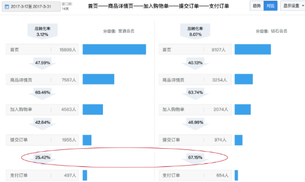


### ADS层

- 建表语句

```sql
drop table if exists ads_user_action_convert_day;
create external table ads_user_action_convert_day(
    `dt` string comment '统计日期',
    `total_visitor_m_count` bigint comment '总访问人数',
    `order_u_count` bigint comment '下单人数',
    `visitor2order_convert_ratio` decimal(10,2) comment '访问到下单转化率',
    `payment_u_count` bigint comment '支付人数',
    `order2payment_convert_ratio` decimal(10,2) comment '下单到支付的转化率'
)comment '用户行为漏斗分析'
row format delimited  fields terminated by '\t'
location '/warehouse/gmall/ads/ads_user_action_convert_day/';
```

- 数据导入

```sql
insert into table ads_user_action_convert_day
select
    '2019-02-10' dt,
    uv.day_count,
    ua.order_count,
    cast(ua.order_count/uv.day_count*100 as decimal(10,2)) visitor2order_convert_ratio,
    ua.payment_count,
    cast(ua.payment_count/ua.order_count*100 as decimal(10,2)) order2payment_convert_ratio
from(
    select
        dt,
        sum(if(order_count>0,1,0)) order_count,
        sum(if(payment_count>0,1,0)) payment_count
    from dws_user_action
    where dt='2019-02-10'
    group by dt
)ua join ads_uv_count uv on ua.dt=uv.dt;
```

- 查询

```sql
hive (gmall)> select * from ads_user_action_convert_day;
```


## 品牌复购率

- 需求：以月为单位统计，购买2次以上商品的用户

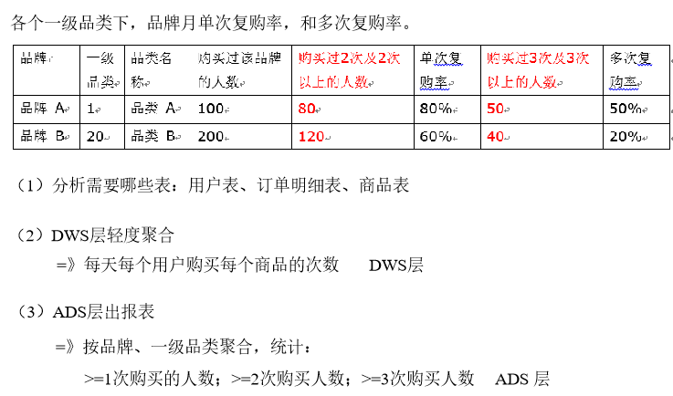

### DWS层之用户购买明细宽表

- 创建表

```sql
drop table if exists dws_sale_detail_daycount;
create external table dws_sale_detail_daycount(
    user_id string comment '用户id',
    sku_id string comment '商品id',
    user_gender string comment '用户性别',
    user_age string comment '用户年龄',
    user_level string comment '用户等级',
    order_price decimal(10,2) comment '商品价格',
    sku_name string comment '商品名称',
    sku_tm_id string comment '品牌id',
    sku_category3_id string comment '商品三级品类id',
    sku_category2_id string comment '商品二级品类id',
    sku_category1_id string comment '商品一级品类id',
    sku_category3_name string comment '商品三级品类名称',
    sku_category2_name string comment '商品二级品类名称',
    sku_category1_name string comment '商品一级品类名称',
    spu_id  string comment '商品 spu',
    sku_num  int comment '购买个数',
    order_count string comment '当日下单单数',
    order_amount string comment '当日下单金额'
) comment '用户购买商品明细表'
partitioned by (`dt` string)
stored as parquet
location '/warehouse/gmall/dws/dws_user_sale_detail_daycount/'
tblproperties ("parquet.compression"="snappy");
```

- 导入数据

```sql
with tmp_detail as (
    select
        user_id,
        sku_id,
        sum(sku_num) sku_sum,
        count(1) order_count,
        sum(order_price*sku_num) order_amount
    from dwd_order_detail
    where dt = '2019-02-10'
    group by user_id,sku_id
)
insert overwrite table dws_sale_detail_daycount
partition(dt='2019-02-10')
select
    tmp_detail.user_id,
    tmp_detail.sku_id,
    u.gender,
    months_between('2019-02-10',u.birthday)/12 age,
    u.user_level,
    sku.price,
    sku.sku_name,
    sku.tm_id,
    sku.category3_id,
    sku.category2_id,
    sku.category1_id,
    sku.category3_name,
    sku.category2_name,
    sku.category1_name,
    sku.spu_id,
    tmp_detail.sku_sum,
    tmp_detail.order_count,
    tmp_detail.order_amount
from tmp_detail 
left join dwd_user_info u on u.id = tmp_detail.user_id and u.dt='2019-02-10'
left join dwd_sku_info sku on sku.id = tmp_detail.sku_id and sku.dt='2019-02-10';
```

- 导入脚本
  - 在/home/ttshe/bin目录下创建脚本dws_sale.sh

```bash
[ttshe@hadoop102 bin]$ touch dws_sale.sh
[ttshe@hadoop102 bin]$ chmod 777 dws_sale.sh 
[ttshe@hadoop102 bin]$ vim dws_sale.sh 
```

```bash
#!/bin/bash

# 定义变量方便修改
APP=gmall
hive=/opt/module/hive/bin/hive

# 如果是输入的日期按照取输入日期；如果没输入日期取当前时间的前一天
if [ -n "$1" ] ;then
	do_date=$1
else 
	do_date=`date -d "-1 day" +%F`  
fi 

sql="

set hive.exec.dynamic.partition.mode=nonstrict;

with
tmp_detail as
(
    select 
        user_id,
        sku_id, 
        sum(sku_num) sku_num,   
        count(*) order_count, 
        sum(od.order_price*sku_num)  order_amount
    from "$APP".dwd_order_detail od
    where od.dt='$do_date'
    group by user_id, sku_id
)  
insert overwrite table "$APP".dws_sale_detail_daycount partition(dt='$do_date')
select 
    tmp_detail.user_id,
    tmp_detail.sku_id,
    u.gender,
    months_between('$do_date', u.birthday)/12  age, 
    u.user_level,
    price,
    sku_name,
    tm_id,
    category3_id,
    category2_id,
    category1_id,
    category3_name,
    category2_name,
    category1_name,
    spu_id,
    tmp_detail.sku_num,
    tmp_detail.order_count,
    tmp_detail.order_amount 
from tmp_detail 
left join "$APP".dwd_user_info u 
on tmp_detail.user_id=u.id and u.dt='$do_date'
left join "$APP".dwd_sku_info s on tmp_detail.sku_id =s.id  and s.dt='$do_date';

"
$hive -e "$sql"
```

- 执行脚本

```bash
[ttshe@hadoop102 bin]$ dws_sale.sh 2019-02-11
```

- 查看导入数据

```bash
hive (gmall)> select * from dws_sale_detail_daycount limit 2;
```


### ADS层品牌复购率

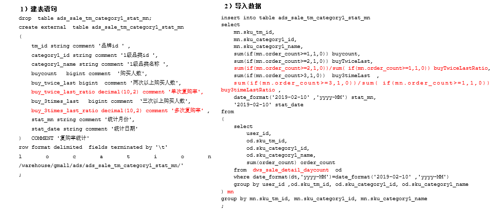

- 建表语句

```sql
drop table ads_sale_tm_category1_stat_mn;
create external table ads_sale_tm_category1_stat_mn
(   
    tm_id string comment '品牌id',
    category1_id string comment '1级品类id ',
    category1_name string comment '1级品类名称 ',
    buycount   bigint comment  '购买人数',
    buy_twice_last bigint  comment '两次以上购买人数',
    buy_twice_last_ratio decimal(10,2)  comment  '单次复购率',
    buy_3times_last   bigint comment   '三次以上购买人数',
    buy_3times_last_ratio decimal(10,2)  comment  '多次复购率',
    stat_mn string comment '统计月份',
    stat_date string comment '统计日期' 
) COMMENT '复购率统计'
row format delimited fields terminated by '\t'
location '/warehouse/gmall/ads/ads_sale_tm_category1_stat_mn/';
```

- 导入数据

```sql
insert into table ads_sale_tm_category1_stat_mn
select
    tmp.sku_tm_id,
    tmp.sku_category1_id,
    tmp.sku_category1_name,
    sum(if(order_count >= 1,1,0)) buycount,
    sum(if(order_count >= 2,1,0)) buy_twice_last,
    cast(sum(if(order_count >= 2,1,0))/sum(if(order_count >=1,1,0))*100 as decimal(10,2)),
    sum(if(order_count >=3,1,0)) buy_3times_last,
    cast(sum(if(order_count >=3,1,0))/sum(if(order_count >=1,1,0))*100 as decimal(10,2)),
    date_format('2019-02-10','yyyy-MM') stat_mn,
    '2019-02-10' stat_date
from(
    select
        user_id,
        sku_tm_id,
        sku_category1_id,
        sku_category1_name,
        sum(order_count) order_count
    from dws_sale_detail_daycount sd
    where date_format(dt,'yyyy-MM')=date_format('2019-02-10','yyyy-MM')
    group by user_id,sku_tm_id,sku_category1_id,sku_category1_name
)tmp
group by tmp.sku_tm_id,tmp.sku_category1_id,tmp.sku_category1_name;
```

- 查询

```sql
select * from ads_sale_tm_category1_stat_mn;
```

- 编写脚本
  - 在/home/ttshe/bin目录下创建脚本ads_sale.sh

```bash
[ttshe@hadoop102 bin]$ touch ads_sale.sh
[ttshe@hadoop102 bin]$ chmod 777 ads_sale.sh
[ttshe@hadoop102 bin]$ vim ads_sale.sh
```

```bash
#!/bin/bash

# 定义变量方便修改
APP=gmall
hive=/opt/module/hive/bin/hive

# 如果是输入的日期按照取输入日期；如果没输入日期取当前时间的前一天
if [ -n "$1" ] ;then
	do_date=$1
else 
	do_date=`date -d "-1 day" +%F`  
fi 

sql="

set hive.exec.dynamic.partition.mode=nonstrict;

insert into table "$APP".ads_sale_tm_category1_stat_mn
select   
    mn.sku_tm_id,
    mn.sku_category1_id,
    mn.sku_category1_name,
    sum(if(mn.order_count>=1,1,0)) buycount,
    sum(if(mn.order_count>=2,1,0)) buyTwiceLast,
    sum(if(mn.order_count>=2,1,0))/sum( if(mn.order_count>=1,1,0)) buyTwiceLastRatio,
    sum(if(mn.order_count>=3,1,0)) buy3timeLast,
    sum(if(mn.order_count>=3,1,0))/sum( if(mn.order_count>=1,1,0)) buy3timeLastRatio ,
    date_format('$do_date' ,'yyyy-MM') stat_mn,
    '$do_date' stat_date
from 
(     
select 
        user_id, 
        od.sku_tm_id, 
        od.sku_category1_id,
        od.sku_category1_name,  
        sum(order_count) order_count
    from "$APP".dws_sale_detail_daycount  od 
    where date_format(dt,'yyyy-MM')=date_format('$do_date' ,'yyyy-MM')
    group by user_id, od.sku_tm_id, od.sku_category1_id, od.sku_category1_name
) mn
group by mn.sku_tm_id, mn.sku_category1_id, mn.sku_category1_name;

"
$hive -e "$sql"
```

- 导入数据

```bash
[ttshe@hadoop102 bin]$ ads_sale.sh 2019-02-11
```


## 每个等级的用户对应的复购率前十的商品排行

- 每个等级，每种商品，买一次的用户数，买两次的用户数-->得出复购率

- 利用开窗函数，取每个等级的前十

```sql
select
    user_level,
    sku_id,
    sku_name,
    ratio,
    r,
    '2019-02-10' stat_date
from(
    select
        t1.user_level,
        t1.sku_id,
        t1.sku_name,
        t1.ratio,
        row_number() over(partition by t1.user_level order by t1.ratio desc) r
    from(
        select
            tmp.user_level,
            tmp.sku_id,
            tmp.sku_name,
            cast(sum(if(order_count >= 2,1,0))/sum(if(order_count >=1,1,0))*100 as decimal(10,2)) ratio
        from(
            select 
                user_id,
                user_level,
                sku_id,
                sku_name,
                sum(order_count) order_count
            from dws_sale_detail_daycount sd
            where dt<='2019-02-10'
            group by user_id,user_level,sku_id,sku_name
        )tmp
        group by tmp.user_level,tmp.sku_id,tmp.sku_name
    )t1
)t2
where t2.r <=10;
```


# 数据可视化


## MySQL中创建表

- 在mysql中的表一般与hive中的ads的表字段相同

### 每日活跃统计

- 在MySQL中创建ads_uv_count表

```sql
DROP TABLE IF EXISTS `ads_uv_count`;
CREATE TABLE `ads_uv_count`  (
  `dt` varchar(255) DEFAULT NULL COMMENT '统计日期',
  `day_count` bigint(200) DEFAULT NULL COMMENT '当日用户数量',
  `wk_count` bigint(200) DEFAULT NULL COMMENT '当周用户数量',
  `mn_count` bigint(200) DEFAULT NULL COMMENT '当月用户数量',
  `is_weekend` varchar(200) CHARACTER SET utf8 COLLATE utf8_general_ci DEFAULT NULL COMMENT 'Y,N是否是周末,用于得到本周最终结果',
  `is_monthend` varchar(200) CHARACTER SET utf8 COLLATE utf8_general_ci DEFAULT NULL COMMENT 'Y,N是否是月末,用于得到本月最终结果'
) ENGINE = InnoDB CHARACTER SET = utf8 COLLATE = utf8_general_ci COMMENT = '每日活跃用户数量' ROW_FORMAT = Dynamic;
```

- 向MySQL中插入如下数据

```sql
INSERT INTO `ads_uv_count` VALUES ('2019-03-01 14:10:04', 20, 30, 100, 'N', 'N');
INSERT INTO `ads_uv_count` VALUES ('2019-03-02 14:12:48', 35, 50, 100, 'N', 'N');
INSERT INTO `ads_uv_count` VALUES ('2019-03-03 14:14:07', 25, 640, 3300, 'Y', 'Y');
INSERT INTO `ads_uv_count` VALUES ('2019-03-04 14:14:14', 10, 23, 123, 'N', 'N');
INSERT INTO `ads_uv_count` VALUES ('2019-03-05 14:14:21', 80, 121, 131, 'N', 'N');
INSERT INTO `ads_uv_count` VALUES ('2019-03-06 14:14:38', 30, 53, 453, 'N', 'N');
INSERT INTO `ads_uv_count` VALUES ('2019-03-07 14:33:27', 20, 31, 453, 'N', 'N');
INSERT INTO `ads_uv_count` VALUES ('2019-03-08 14:33:39', 10, 53, 453, 'N', 'N');
INSERT INTO `ads_uv_count` VALUES ('2019-03-09 14:33:47', 10, 34, 453, 'N', 'N');
INSERT INTO `ads_uv_count` VALUES ('2019-03-10 14:33:54', 10, 653, 8453, 'Y', 'Y');
INSERT INTO `ads_uv_count` VALUES ('2019-03-11 14:34:04', 100, 453, 1453, 'N', 'N');
INSERT INTO `ads_uv_count` VALUES ('2019-03-12 14:34:10', 101, 153, 134, 'N', 'N');
INSERT INTO `ads_uv_count` VALUES ('2019-03-13 14:34:16', 100, 286, 313, 'N', 'N');
INSERT INTO `ads_uv_count` VALUES ('2019-03-14 14:34:22', 100, 45, 453, 'N', 'N');
INSERT INTO `ads_uv_count` VALUES ('2019-03-15 14:34:29', 100, 345, 3453, 'N', 'N');
INSERT INTO `ads_uv_count` VALUES ('2019-03-16 14:34:35', 101, 453, 453, 'N', 'N');
INSERT INTO `ads_uv_count` VALUES ('2019-03-17 14:34:41', 100, 678, 9812, 'Y', 'Y');
INSERT INTO `ads_uv_count` VALUES ('2019-03-18 14:34:46', 100, 186, 193, 'N', 'N');
INSERT INTO `ads_uv_count` VALUES ('2019-03-19 14:34:53', 453, 686, 712, 'N', 'N');
INSERT INTO `ads_uv_count` VALUES ('2019-03-20 14:34:57', 452, 786, 823, 'N', 'N');
INSERT INTO `ads_uv_count` VALUES ('2019-03-21 14:35:02', 214, 58, 213, 'N', 'N');
INSERT INTO `ads_uv_count` VALUES ('2019-03-22 14:35:08', 76, 78, 95, 'N', 'N');
INSERT INTO `ads_uv_count` VALUES ('2019-03-23 14:35:13', 76, 658, 745, 'N', 'N');
INSERT INTO `ads_uv_count` VALUES ('2019-03-24 14:35:19', 76, 687, 9300, 'Y', 'Y');
INSERT INTO `ads_uv_count` VALUES ('2019-03-25 14:35:25', 76, 876, 923, 'N', 'N');
INSERT INTO `ads_uv_count` VALUES ('2019-03-26 14:35:30', 76, 456, 511, 'N', 'N');
INSERT INTO `ads_uv_count` VALUES ('2019-03-27 14:35:35', 76, 456, 623, 'N', 'N');
INSERT INTO `ads_uv_count` VALUES ('2019-03-28 14:35:41', 43, 753, 4000, 'N', 'N');
INSERT INTO `ads_uv_count` VALUES ('2019-03-29 14:35:47', 76, 876, 4545, 'N', 'N');
INSERT INTO `ads_uv_count` VALUES ('2019-03-30 14:35:57', 76, 354, 523, 'N', 'N');
INSERT INTO `ads_uv_count` VALUES ('2019-03-31 14:36:02', 43, 634, 6213, 'Y', 'Y');
```


### 留存率统计

- 在MySQL中创建ads_user_retention_day_rate表

```sql
DROP TABLE IF EXISTS `ads_user_retention_day_rate`;
CREATE TABLE `ads_user_retention_day_rate`  (
  `stat_date` varchar(255)  DEFAULT NULL COMMENT '统计日期',
  `create_date` varchar(255) DEFAULT NULL COMMENT '设备新增日期',
  `retention_day` bigint(200) DEFAULT NULL COMMENT '截止当前日期留存天数',
  `retention_count` bigint(200) DEFAULT NULL COMMENT '留存数量',
  `new_mid_count` bigint(200) DEFAULT NULL COMMENT '当日设备新增数量',
  `retention_ratio` decimal(10, 2) DEFAULT NULL COMMENT '留存率'
) ENGINE = InnoDB CHARACTER SET = utf8 COLLATE = utf8_general_ci COMMENT = '每日用户留存情况' ROW_FORMAT = Dynamic;
```

- 向MySQL中插入数据

```sql
INSERT INTO `ads_user_retention_day_rate` VALUES ('2019-03-09','2019-03-08', 1,88,  99,  0.78);
INSERT INTO `ads_user_retention_day_rate` VALUES ('2019-03-10','2019-03-08', 2,77,  88,  0.68);
INSERT INTO `ads_user_retention_day_rate` VALUES ('2019-03-11','2019-03-08', 3,66,  77,  0.58);
INSERT INTO `ads_user_retention_day_rate` VALUES ('2019-03-12','2019-03-08', 4,55,  66,  0.48);
INSERT INTO `ads_user_retention_day_rate` VALUES ('2019-03-13','2019-03-08', 5,44,  55,  0.38);
INSERT INTO `ads_user_retention_day_rate` VALUES ('2019-03-14','2019-03-08', 6,33,  44,  0.28);
INSERT INTO `ads_user_retention_day_rate` VALUES ('2019-03-10','2019-03-09', 1,77,  88,  0.56);
INSERT INTO `ads_user_retention_day_rate` VALUES ('2019-03-11','2019-03-09', 2,66,  77,  0.46);
INSERT INTO `ads_user_retention_day_rate` VALUES ('2019-03-12','2019-03-09', 3,55,  66,  0.36);
INSERT INTO `ads_user_retention_day_rate` VALUES ('2019-03-13','2019-03-09', 4,44,  55,  0.26);
INSERT INTO `ads_user_retention_day_rate` VALUES ('2019-03-14','2019-03-09', 5,33,  44,  0.16);
INSERT INTO `ads_user_retention_day_rate` VALUES ('2019-03-11','2019-03-10', 1,66,  77,  0.55);
INSERT INTO `ads_user_retention_day_rate` VALUES ('2019-03-12','2019-03-10', 2,55,  66,  0.45);
INSERT INTO `ads_user_retention_day_rate` VALUES ('2019-03-13','2019-03-10', 3,44,  55,  0.35);
INSERT INTO `ads_user_retention_day_rate` VALUES ('2019-03-14','2019-03-10', 4,33,  44,  0.25);
```


### 漏斗分析

- 在MySQL中创建ads_user_action_convert_day表

```sql
DROP TABLE IF EXISTS `ads_user_action_convert_day`;
CREATE TABLE `ads_user_action_convert_day`  (
  `dt` varchar(200) DEFAULT NULL COMMENT '统计日期',
  `total_visitor_m_count` bigint(20) DEFAULT NULL COMMENT '总访问人数',
  `order_u_count` bigint(20) DEFAULT NULL COMMENT '下单人数',
  `visitor2order_convert_ratio` decimal(10, 2) DEFAULT NULL COMMENT '购物车到下单转化率',
  `payment_u_count` bigint(20) DEFAULT NULL COMMENT '支付人数',
  `order2payment_convert_ratio` decimal(10, 2) DEFAULT NULL COMMENT '下单到支付的转化率'
) ENGINE = InnoDB CHARACTER SET = utf8 COLLATE = utf8_general_ci COMMENT = '每日用户行为转化率统计' ROW_FORMAT = Dynamic;
```

- 向MySQL中插入数据

```sql
INSERT INTO `ads_user_action_convert_day` VALUES ('2019-04-28 19:36:18', 10000, 3000, 0.25, 2000, 0.15);
```


### GMV统计

- 在MySQL中创建ads_gmv_sum_day表

```sql
DROP TABLE IF EXISTS ads_gmv_sum_day;
CREATE TABLE ads_gmv_sum_day(
  `dt` varchar(200) DEFAULT NULL COMMENT '统计日期',
  `gmv_count` bigint(20) DEFAULT NULL COMMENT '当日gmv订单个数',
  `gmv_amount` decimal(16, 2) DEFAULT NULL COMMENT '当日gmv订单总金额',
  `gmv_payment` decimal(16, 2) DEFAULT NULL COMMENT '当日支付金额'
) ENGINE = InnoDB CHARACTER SET = utf8 COLLATE = utf8_general_ci COMMENT = '每日活跃用户数量' ROW_FORMAT = Dynamic;
```

- 向MySQL中插入数据

```sql
INSERT INTO `ads_gmv_sum_day` VALUES ('2019-03-01 22:51:37', 1000, 210000.00, 2000.00);
INSERT INTO `ads_gmv_sum_day` VALUES ('2019-05-08 22:52:32', 3434, 12413.00, 1.00);
INSERT INTO `ads_gmv_sum_day` VALUES ('2019-07-13 22:52:51', 1222, 324345.00, 1.00);
INSERT INTO `ads_gmv_sum_day` VALUES ('2019-09-13 22:53:08', 2344, 12312.00, 1.00);
```


### 全国商品销售

- 在MySQL中创建ads_gmv_sum_province表

```sql
DROP TABLE IF EXISTS `ads_gmv_sum_province`;
CREATE TABLE `ads_gmv_sum_province`  (
  `province` varchar(255) CHARACTER SET utf8 COLLATE utf8_general_ci DEFAULT NULL,
  `gmv` bigint(255) DEFAULT NULL,
  `remark` varchar(255) CHARACTER SET utf8 COLLATE utf8_general_ci DEFAULT NULL
) ENGINE = InnoDB CHARACTER SET = utf8 COLLATE = utf8_general_ci ROW_FORMAT = Dynamic;
```

- 向MySQL中插入数据

```sql
INSERT INTO `ads_gmv_sum_province` VALUES ('北京', 2000, '');
INSERT INTO `ads_gmv_sum_province` VALUES ('辽宁', 30000, '沈阳：21.1%，大连：20%，鞍山：35%');
INSERT INTO `ads_gmv_sum_province` VALUES ('浙江', 8002, '杭州：20%，舟山：50%');
```


## Sqoop导出脚本

- 编写Sqoop导出脚本
  - 在/home/ttshe/bin目录下创建脚本sqoop_export.sh

```bash
[ttshe@hadoop102 bin]$ touch sqoop_export.sh
[ttshe@hadoop102 bin]$ chmod 777 sqoop_export.sh 
[ttshe@hadoop102 bin]$ vim sqoop_export.sh 
```

```bash
#!/bin/bash

db_name=gmall

export_data() {
/opt/module/sqoop/bin/sqoop export \
--connect "jdbc:mysql://hadoop102:3306/${db_name}?useUnicode=true&characterEncoding=utf-8"  \
--username root \
--password 123456 \
--table $1 \
--num-mappers 1 \
--export-dir /warehouse/$db_name/ads/$1 \
--input-fields-terminated-by "\t" \
--update-mode allowinsert \
--update-key "tm_id,category1_id,stat_mn,stat_date" \
--input-null-string '\\N'    \
--input-null-non-string '\\N'
}

case $1 in
  "ads_uv_count")
     export_data "ads_uv_count"
;;
  "ads_user_action_convert_day")
     export_data "ads_user_action_convert_day"
;;
  "ads_gmv_sum_day")
     export_data "ads_gmv_sum_day"
;;
   "all")
	 export_data "ads_uv_count"
	 export_data "ads_user_action_convert_day"
     export_data "ads_gmv_sum_day"
;;
esac
```

-  ==关于导出update还是insert的问题== (面试的考点)

  -  --update-mode

    - updateonly
      - 只更新，无法插入新数据
    - allowinsert
      - 允许新增 

  - --update-key

    - 允许更新的情况下，指定哪些字段匹配视为同一条数据，进行更新而不增加
    - 多个字段用逗号分隔

  - --input-null-string

  - --input-null-non-string

    - 表示，将字符串列和非字符串列的空串和“null”转义
    - 官网地址：http://sqoop.apache.org/docs/1.4.6/SqoopUserGuide.html

    ```text
    Sqoop will by default import NULL values as string null. Hive is however using string \N to denote NULL values and therefore predicates dealing with NULL(like IS NULL) will not work correctly. You should append parameters --null-string and --null-non-string in case of import job or --input-null-string and --input-null-non-string in case of an export job if you wish to properly preserve NULL values. Because sqoop is using those parameters in generated code, you need to properly escape value \N to \\N:
    ```

    - Hive中的Null在底层是以“\N”来存储
    - MySQL中的Null在底层就是Null
    - 为了保证数据两端的一致性
      - 导出数据时采用--input-null-string和--input-null-non-string两个参数
      - 导入数据时采用--null-string和--null-non-string。

- 执行导出

```bash
[ttshe@hadoop102 bin]$ sqoop_export.sh all
```

- 在mysql中查看结果

```sql
SELECT * FROM ads_uv_count;
SELECT * FROM ads_user_retention_day_rate;
SELECT * FROM ads_user_action_convert_day;
SELECT * FROM ads_gmv_sum_day;
SELECT * FROM ads_gmv_sum_province;
```


# Azkaban 调度器


## 安装

- 在/opt/module/目录下创建azkaban目录
- 解压azkaban-web-server-2.5.0.tar.gz、azkaban-executor-server-2.5.0.tar.gz、azkaban-sql-script-2.5.0.tar.gz到/opt/module/azkaban目录下

- 对解压后的文件重新命名

```bash
[ttshe@hadoop102 module]$ mkdir azkaban
[ttshe@hadoop102 software]$ tar -zxvf azkaban-web-server-2.5.0.tar.gz -C /opt/module/azkaban/
[ttshe@hadoop102 software]$ tar -zvxf azkaban-executor-server-2.5.0.tar.gz -C /opt/module/azkaban/
[ttshe@hadoop102 software]$ mv /opt/module/azkaban/azkaban-executor-2.5.0/ /opt/module/azkaban/executor
[ttshe@hadoop102 software]$ mv /opt/module/azkaban/azkaban-web-2.5.0/ /opt/module/azkaban/server
```

- azkaban脚本导入
  - 进入mysql，创建azkaban数据库，并将解压的脚本导入到azkaban数据库
  - 注：source后跟.sql文件，用于批量处理.sql文件中的sql语句

```sql
[ttshe@hadoop102 software]$ tar -zvxf azkaban-sql-script-2.5.0.tar.gz -C /opt/module/azkaban/
[ttshe@hadoop102 software]$ mysql -uroot -p123456
mysql> create database azkaban;
mysql> use azkaban;
mysql> source /opt/module/azkaban/azkaban-2.5.0/create-all-sql-2.5.0.sql
```

- 生成秘钥库
  - Keytool：是java数据证书的管理工具，使用户能够管理自己的公/私钥对及相关证书
  - -keystore：指定密钥库的名称及位置（产生的各类信息将不在.keystore文件中）
  - -genkey：在用户主目录中创建一个默认文件".keystore" 
  - -alias：对我们生成的.keystore进行指认别名；如果没有默认是mykey
  - -keyalg：指定密钥的算法 RSA/DSA 默认是DSA

- 生成 keystore的密码及相应信息的密钥库
  - 注意
    - 密钥库的密码至少必须6个字符，可以是纯数字或者字母或者数字和字母的组合等
    - 密钥库的密码最好和<jetty> 的密钥相同，方便记忆	

```bash
[ttshe@hadoop102 azkaban]$ keytool -keystore keystore -alias jetty -genkey -keyalg RSA
输入密钥库口令: 123456
再次输入新口令: 123456
您的名字与姓氏是什么?
  [Unknown]:  
您的组织单位名称是什么?
  [Unknown]:  
您的组织名称是什么?
  [Unknown]:  
您所在的城市或区域名称是什么?
  [Unknown]:  
您所在的省/市/自治区名称是什么?
  [Unknown]:  
该单位的双字母国家/地区代码是什么?
  [Unknown]:  
CN=Unknown, OU=Unknown, O=Unknown, L=Unknown, ST=Unknown, C=Unknown是否正确?
  [否]:  y

输入 <jetty> 的密钥口令
	(如果和密钥库口令相同, 按回车): 
```

- 将keystore 拷贝到 azkaban web服务器根目录中

```bash
[ttshe@hadoop102 azkaban]$ mv keystore /opt/module/azkaban/server/
```

- 先配置好服务器节点上的时区
  - 如果在/usr/share/zoneinfo/这个目录下不存在时区配置文件Asia/Shanghai，就要用 tzselect 生成


## 配置文件

- 进入azkaban web服务器安装目录 conf目录，打开azkaban.properties文件
- 按照如下配置修改azkaban.properties文件

```bash
[ttshe@hadoop102 conf]$ pwd
/opt/module/azkaban/server/conf
[ttshe@hadoop102 conf]$ vim azkaban.properties
```

```properties
#Azkaban Personalization Settings
#服务器UI名称,用于服务器上方显示的名字
azkaban.name=Test
#描述
azkaban.label=My Local Azkaban
#UI颜色
azkaban.color=#FF3601
azkaban.default.servlet.path=/index
#默认web server存放web文件的目录
web.resource.dir=/opt/module/azkaban/server/web/
#默认时区,已改为亚洲/上海 默认为美国
default.timezone.id=Asia/Shanghai

#Azkaban UserManager class
user.manager.class=azkaban.user.XmlUserManager
#用户权限管理默认类（绝对路径）
user.manager.xml.file=/opt/module/azkaban/server/conf/azkaban-users.xml

#Loader for projects
#global配置文件所在位置（绝对路径）
executor.global.properties=/opt/module/azkaban/executor/conf/global.properties
azkaban.project.dir=projects

#数据库类型
database.type=mysql
#端口号
mysql.port=3306
#数据库连接IP
mysql.host=hadoop102
#数据库实例名
mysql.database=azkaban
#数据库用户名
mysql.user=root
#数据库密码
mysql.password=123456
#最大连接数
mysql.numconnections=100

# Velocity dev mode
velocity.dev.mode=false

# Azkaban Jetty server properties.
# Jetty服务器属性.
#最大线程数
jetty.maxThreads=25
#Jetty SSL端口
jetty.ssl.port=8443
#Jetty端口
jetty.port=8081
#SSL文件名（绝对路径）
jetty.keystore=/opt/module/azkaban/server/keystore
#SSL文件密码
jetty.password=123456
#Jetty主密码与keystore文件相同
jetty.keypassword=123456
#SSL文件名（绝对路径）
jetty.truststore=/opt/module/azkaban/server/keystore
#SSL文件密码
jetty.trustpassword=123456

# Azkaban Executor settings
executor.port=12321

# mail settings
mail.sender=
mail.host=
job.failure.email=
job.success.email=

lockdown.create.projects=false

cache.directory=cache
```

- web服务器用户配置
- 在azkaban web服务器安装目录 conf目录，按照如下配置修改azkaban-users.xml 文件，增加管理员用户

```bash
[ttshe@hadoop102 conf]$ vim azkaban-users.xml
```

```xml
<azkaban-users>
	<user username="azkaban" password="azkaban" roles="admin" groups="azkaban" />
	<user username="metrics" password="metrics" roles="metrics"/>
	<user username="admin" password="admin" roles="admin" />
	<role name="admin" permissions="ADMIN" />
	<role name="metrics" permissions="METRICS"/>
</azkaban-users>
```

- 进入执行服务器安装目录conf，打开azkaban.properties

```bash
[ttshe@hadoop102 conf]$ pwd
/opt/module/azkaban/executor/conf
[ttshe@hadoop102 conf]$ vim azkaban.properties
```

```properties
#Azkaban
#时区
default.timezone.id=Asia/Shanghai

# Azkaban JobTypes Plugins
#jobtype 插件所在位置
azkaban.jobtype.plugin.dir=plugins/jobtypes

#Loader for projects
executor.global.properties=/opt/module/azkaban/executor/conf/global.properties
azkaban.project.dir=projects

database.type=mysql
mysql.port=3306
mysql.host=hadoop102
mysql.database=azkaban
mysql.user=root
mysql.password=123456
mysql.numconnections=100

# Azkaban Executor settings
#最大线程数
executor.maxThreads=50
#端口号(如修改,请与web服务中一致)
executor.port=12321
#线程数
executor.flow.threads=30
```


## 启动

- 在executor服务器目录下执行启动命令
- 在azkaban web服务器目录下执行启动命令
  - 注意：先执行executor，再执行web，避免Web Server会因为找不到执行器启动失败

```bash
[ttshe@hadoop102 executor]$ pwd
/opt/module/azkaban/executor
[ttshe@hadoop102 executor]$ bin/azkaban-executor-start.sh
[ttshe@hadoop102 server]$ pwd
/opt/module/azkaban/server
[ttshe@hadoop102 server]$ bin/azkaban-web-start.sh
[ttshe@hadoop102 server]$ jps
3601 AzkabanExecutorServer
5880 Jps
3661 AzkabanWebServer
```

- 启动完成后，在浏览器(建议使用谷歌浏览器)中输入https://hadoop102:8443即可访问azkaban服务，用户名和密码都是admin
  - 注意是https


## GMV指标获取的全调度流程

- 生成数据
  - 在MySQL中生成数据

```sql
CALL init_data('2019-02-12',300,200,300,FALSE);
```


### 编写Azkaban程序运行job


#### import.job

```bash
type=command
do_date=${dt}
command=/home/ttshe/bin/sqoop_import.sh all ${do_date}
```


#### ods.job

```bash
type=command
do_date=${dt}
dependencies=import
command=/home/ttshe/bin/ods_db.sh ${do_date}
```


#### dwd.job

```bash
type=command
do_date=${dt}
dependencies=ods
command=/home/ttshe/bin/dwd_db.sh ${do_date}
```


#### dws.job

```bash
type=command
do_date=${dt}
dependencies=dwd
command=/home/ttshe/bin/dws_db_wide.sh ${do_date}
```


#### ads.job

```bash
type=command
do_date=${dt}
dependencies=dws
command=/home/ttshe/bin/ads_db_gmv.sh ${do_date}
```


#### export.job

```bash
type=command
do_date=${dt}
dependencies=ads
command=/home/ttshe/bin/sqoop_export.sh ads_gmv_sum_day
```

- 将以上6个文件压缩成job.zip文件


### 执行job

- 在浏览器中https://hadoop102:8443并在页面上创建工程执行job.zip任务


- 输入参数


- 等待大约20分钟，在MySQL中查看结果

```sql
select * from ads_gmv_sum_day;
```


# 订单拉链表

- 什么是拉链表
  - 拉链表，记录每条信息的生命周期，一旦一条记录的生命周期结束，就重新开始一条新的记录，并把当前日期放入生效开始日期
  - 如当前信息至今有效，在生效结束日期中填入一个极大值
    - 如9999-99-99 

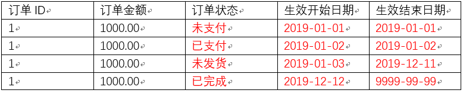

- 为什么要有拉链表
  - 拉链表适合于
    - 数据会发生变化，但是大部分是不变的
      - ==即缓慢变化维==
    - 如订单信息从未支付、已支付、未发货、已完成等状态经历了一周，大部分时间是不变化的
    - 如果数据量有一定规模，按照每日全量的方式保存效率很低
    - 如1亿用户*365天，每天一份用户信息
      - ==做每日全量效率低==

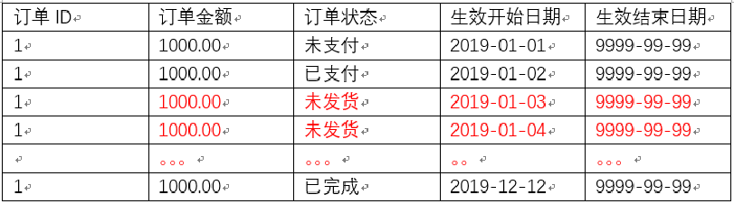

- 拉链表

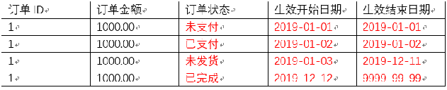


## 如何使用

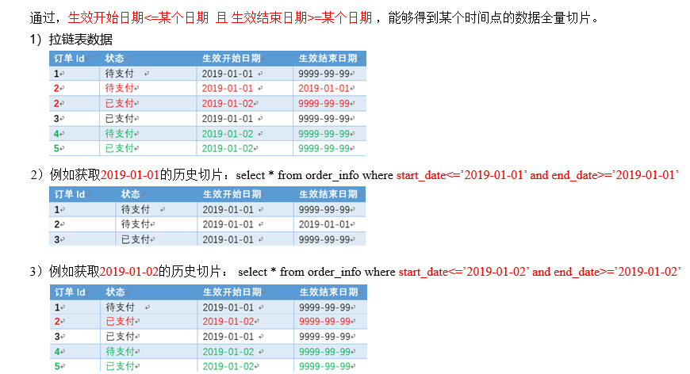


## 拉链表形成过程

- 依赖于订单的创建时间和更新时间
  - 如果没有这2个字段，可使用canal框架，监听mysql中数据的变化，增加更新时间字段

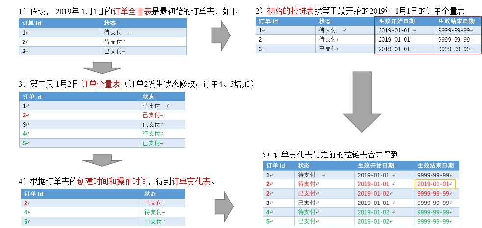


## 拉链表制作过程

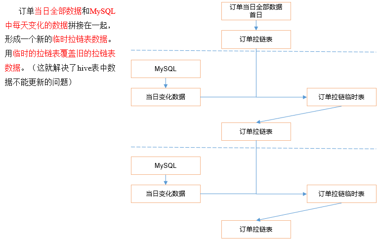

### 初始化拉链表

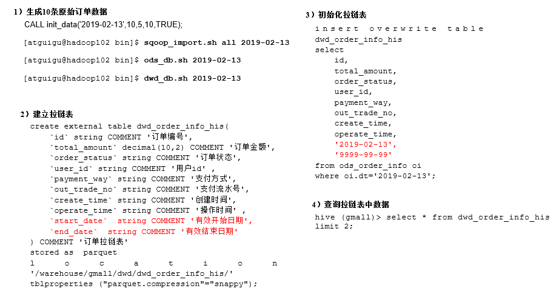

- 生成10条原始订单数据

```sql
CALL init_data('2019-02-13',10,5,10,TRUE);
```

```bash
[ttshe@hadoop102 bin]$ sqoop_import.sh all 2019-02-13
[ttshe@hadoop102 bin]$ ods_db.sh 2019-02-13
[ttshe@hadoop102 bin]$ dwd_db.sh 2019-02-13
```

- 建立拉链表
  - 比之前的order_info增加start_date和end_date

```sql
drop table if exists dwd_order_info_his;
create external table dwd_order_info_his(
    `id` string COMMENT '订单编号',
    `total_amount` decimal(10,2) COMMENT '订单金额',
    `order_status` string COMMENT '订单状态',
    `user_id` string COMMENT '用户id' ,
    `payment_way` string COMMENT '支付方式',
    `out_trade_no` string COMMENT '支付流水号',
    `create_time` string COMMENT '创建时间',
    `operate_time` string COMMENT '操作时间',
    `start_date` string COMMENT '有效开始日期',
    `end_date` string COMMENT '有效结束日期'
) COMMENT '订单拉链表'
stored as parquet
location '/warehouse/gmall/dwd/dwd_order_info_his/'
tblproperties ("parquet.compression"="snappy");
```

- 初始化拉链表

```sql
hive (gmall)>
insert overwrite table dwd_order_info_his
select
    id,
    total_amount,
    order_status,
    user_id,
    payment_way,
    out_trade_no,
    create_time,
    operate_time,
    '2019-02-13',
    '9999-99-99'
from ods_order_info oi
where oi.dt='2019-02-13';
```

- 查询

```sql
hive (gmall)> select * from dwd_order_info_his limit 2;
```


### 制作当日变动数据每日执行

- 如何获得每日变动表
  - 最好表内有创建时间和变动时间
  - 如果没有，可以利用第三方工具监控比如canal，监控MySQL的实时变化进行记录(麻烦)
  - 逐行对比前后两天的数据, 检查md5(concat(全部有可能变化的字段))是否相同(low)
  - 要求业务数据库提供变动流水

- 因为dwd_order_info本身导入过来就是新增变动明细的表，所以不用处理
  - 2019-02-14日新增2条订单数据
  - 通过Sqoop把2019-02-14日所有数据导入
  - ODS层数据导入
  - DWD层数据导入

```sql
CALL init_data('2019-02-14',2,5,10,TRUE);
```

```bash
sqoop_import.sh all 2019-02-14
ods_db.sh 2019-02-14
dwd_db.sh 2019-02-14
```


### 合并变动信息，追加新增信息，插入到临时表中

- 建立临时表

```sql
drop table if exists dwd_order_info_his_tmp;
create external table dwd_order_info_his_tmp(
    `id` string COMMENT '订单编号',
    `total_amount` decimal(10,2) COMMENT '订单金额',
    `order_status` string COMMENT '订单状态',
    `user_id` string COMMENT '用户id' ,
    `payment_way` string COMMENT '支付方式',
    `out_trade_no` string COMMENT '支付流水号',
    `create_time` string COMMENT '创建时间',
    `operate_time` string COMMENT '操作时间',
    `start_date` string COMMENT '有效开始日期',
    `end_date` string COMMENT '有效结束日期'
) COMMENT '订单拉链临时表'
stored as parquet
location '/warehouse/gmall/dwd/dwd_order_info_his_tmp/'
tblproperties ("parquet.compression"="snappy");
```

- 导入脚本

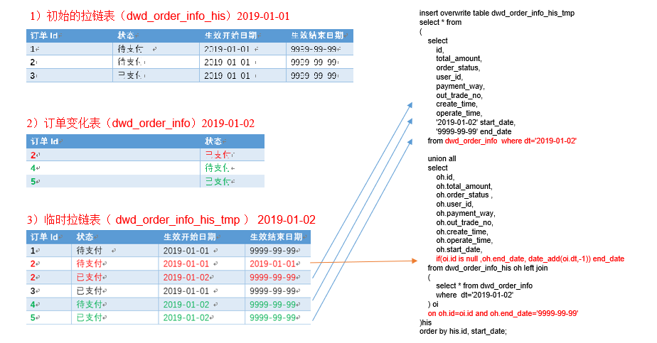

```sql
insert overwrite table dwd_order_info_his_tmp
select * from (
    select 
        id,
        total_amount,
        order_status,
        user_id,
        payment_way,
        out_trade_no,
        create_time,
        operate_time,
        '2019-02-14' start_date,
        '9999-99-99' end_date
    from dwd_order_info where dt='2019-02-14'
    union all 
    select
        oh.id,
        oh.total_amount,
        oh.order_status,
        oh.user_id,
        oh.payment_way,
        oh.out_trade_no,
        oh.create_time,
        oh.operate_time,
        oh.start_date,
        if(oi.id is null, oh.end_date, date_add(oi.dt,-1)) end_date
    from dwd_order_info_his oh 
    left join 
    ( 
        select * 
        from dwd_order_info 
        where dt='2019-02-14'
    ) oi on oh.id=oi.id and oh.end_date='9999-99-99'
) his 
order by his.id, start_date;
```


### 临时表覆盖给拉链表

- 导入数据

```sql
hive (gmall)>
insert overwrite table dwd_order_info_his 
select * from dwd_order_info_his_tmp;
```

- 查询

```sql
hive (gmall)> select * from dwd_order_info_his;
```


### 整理为每日脚本


# 项目总结

- 熟悉8张表的业务字段，每张表记住3-5个字段


## 数仓理论

- 表的分类：实体表、维度表、事务型事实表、周期型事实表

- 表的同步策略
  - 实体表（全量）
  - 维度表（全量）
  - 事务型事实表（增量）
  - 周期型事实表（新增和变化、拉链表）

- 范式理论
  - 一范式原则：属性不可切割
  - 二范式原则：不能存在部分函数依赖
  - 三范式原则：不能存在传递函数依赖；

- 数仓维度建模模型
  - 星型模型，维度一层
  - 雪花模型，维度多层
  - 星座模型，多个事实表
  - 性能优先选择星型模型，灵活优先选择雪花模型
  - 企业中星型模型多一些


## 需求指标分析

- GMV：一段时间内的网站成交金额（包括付款和未付款）
  
- 计算：基于用户行为宽表，对订单总金额进行sum
  
- 转化率：（先分别计算分子和分母，再相除）

  - 新增用户占活跃用户的比率

  ```sql
  cast(sum( uc.nmc)/sum( uc.dc)*100 as decimal(10,2))  new_m_ratio
  ```

  - 下单人数占活跃用户的比率

  ```sql
  sum(if(order_count>0,1,0)) order_count
  cast(ua.order_count/uv.day_count*100 as  decimal(10,2)) visitor2order_convert_ratio
  ```

  - 支付人数占下单人数的比率

  ```sql
  sum(if(payment_count>0,1,0)) payment_count
  cast(ua.payment_count/ua.order_count*100 as  decimal(10,2)) order2payment_convert_ratio
  ```

  - 复购率：（先分别计算分子和分母，再相除）

  ```sql
  sum(if(mn.order_count>=1,1,0)) buycount,
  sum(if(mn.order_count>=2,1,0)) buyTwiceLast,
  sum(if(mn.order_count>=2,1,0))/sum( if(mn.order_count>=1,1,0)) buyTwiceLastRatio,
  sum(if(mn.order_count>=3,1,0)) buy3timeLast,
  sum(if(mn.order_count>=3,1,0))/sum( if(mn.order_count>=1,1,0)) buy3timeLastRatio ,
  ```


## 拉链表

- 通过关系型数据库的create time和operation time获取数据的新增和变化。

- 用临时拉链表解决Hive了中数据不能更新的问题


## Azkaban

- 每天集群运行多少job?

- 多个指标（200）*6=1200（1000-2000个job）

- 每天集群运行多少个task? 1000*（5-8）=5000多个

- 任务挂了怎么办？运行成功或者失败都会发邮件


## 项目中的表关系

