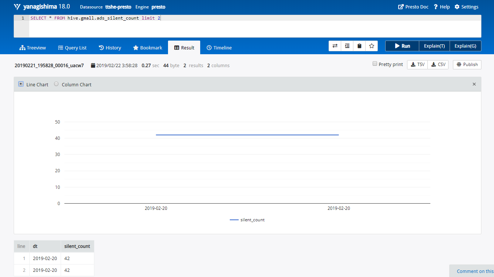

# 概念

- Presto是一个开源的分布式SQL查询引擎，数据量支持GB到PB字节
- 主要用来处理==秒级查询的场景==
- 注意
  - 虽然Presto可以解析SQL，但它不是一个标准的数据库
  - 不是MySQL、Oracle的代替品，也不能用来处理在线事务（OLTP）
- Presto的组成
  - 一个Coordinator
  - 多个Worker


## 优缺点


- 优点
  - 基于内存运算，减少了硬盘IO，计算更快
  - 能够连接多个数据源，跨数据源连表查，如从Hive查询大量网站访问记录，然后从Mysql中匹配出设备信息
- 缺点
  - 能够处理PB级别的海量数据分析，但Presto并不是把PB级数据都放在内存中计算的，而是根据场景
  - 如Count，AVG等聚合运算，是==边读数据边计算，再清内存==，再读数据再计算，这种耗的内存并不高
  - 但是连表查，就可能产生大量的临时数据，因此速度会变慢，反而Hive此时会更擅长


## 与Impala性能比较

https://blog.csdn.net/u012551524/article/details/79124532

- 测试结论
  - Impala性能稍领先于Presto
  - Presto在数据源支持上非常丰富，包括Hive、图数据库、传统关系型数据库、Redis等


# 安装


## Presto Server

- 官网地址 https://prestodb.github.io/

- 下载地址 https://repo1.maven.org/maven2/com/facebook/presto/presto-server/0.196/presto-server-0.196.tar.gz 

- 将presto-server-0.196.tar.gz导入hadoop102的/opt/software目录下，并解压到/opt/module目录
- 修改名称为presto
- 进入到/opt/module/presto目录，并创建存储数据文件夹data
- 进入到/opt/module/presto目录，并创建存储配置文件文件夹etc

```bash
[ttshe@hadoop102 software]$ tar -zvxf presto-server-0.196.tar.gz -C /opt/module/
[ttshe@hadoop102 module]$ mv presto-server-0.196/ presto/
[ttshe@hadoop102 presto]$ mkdir data etc
```

- 配置在/opt/module/presto/etc目录下添加jvm.config配置文件

```bash
[ttshe@hadoop102 etc]$ vim jvm.config
```

```config
-server
-Xmx16G
-XX:+UseG1GC
-XX:G1HeapRegionSize=32M
-XX:+UseGCOverheadLimit
-XX:+ExplicitGCInvokesConcurrent
-XX:+HeapDumpOnOutOfMemoryError
-XX:+ExitOnOutOfMemoryError
```

- Presto可以支持多个数据源，在Presto里面叫catalog，这里我们配置支持Hive的数据源，配置一个Hive的catalog

```bash
[ttshe@hadoop102 etc]$ mkdir catalog
[ttshe@hadoop102 etc]$ cd catalog/
[ttshe@hadoop102 catalog]$ vim hive.properties
```

```text
connector.name=hive-hadoop2
hive.metastore.uri=thrift://hadoop102:9083
```

- 将hadoop102上的presto分发到hadoop103、hadoop104

```bash
[ttshe@hadoop102 module]$ xsync presto/
```

- 分发之后，分别进入hadoop102、hadoop103、hadoop104三台主机的/opt/module/presto/etc的路径。配置node属性，node id每个节点都不一样

```bash
[ttshe@hadoop102 etc]$vim node.properties
node.environment=production
node.id=ffffffff-ffff-ffff-ffff-ffffffffffff
node.data-dir=/opt/module/presto/data

[ttshe@hadoop103 etc]$vim node.properties
node.environment=production
node.id=ffffffff-ffff-ffff-ffff-fffffffffffe
node.data-dir=/opt/module/presto/data

[ttshe@hadoop104 etc]$vim node.properties
node.environment=production
node.id=ffffffff-ffff-ffff-ffff-fffffffffffd
node.data-dir=/opt/module/presto/data
```

- Presto是由一个coordinator节点和多个worker节点组成。在hadoop102上配置成coordinator，在hadoop103、hadoop104上配置为worker
- hadoop102上配置coordinator节点

```bash
[ttshe@hadoop102 etc]$ vim config.properties

coordinator=true
node-scheduler.include-coordinator=false
http-server.http.port=8881
query.max-memory=50GB
discovery-server.enabled=true
discovery.uri=http://hadoop102:8881
```

- hadoop103、hadoop104上配置worker节点

```bash
[ttshe@hadoop102 etc]$ vim config.properties

coordinator=false
http-server.http.port=8881
query.max-memory=50GB
discovery.uri=http://hadoop102:8881
```

- 在hadoop102的/opt/module/hive目录下，启动Hive Metastore，用ttshe角色

```bash
[ttshe@hadoop102 hive]$ nohup bin/hive --service metastore >/dev/null 2>&1 &
```

- 分别在hadoop102、hadoop103、hadoop104上启动Presto Server

  - 前台启动Presto，控制台显示日志

  ```bash
  [ttshe@hadoop102 presto]$ bin/launcher run
  [ttshe@hadoop103 presto]$ bin/launcher run
  [ttshe@hadoop104 presto]$ bin/launcher run
  ```

  - 后台启动Presto

  ```bash
  [ttshe@hadoop102 presto]$ bin/launcher start
  [ttshe@hadoop103 presto]$ bin/launcher start
  [ttshe@hadoop104 presto]$ bin/launcher start
  ```

- 日志查看路径/opt/module/presto/data/var/log


## Presto命令行Client安装

- 不推荐
- 下载Presto的客户端
  - https://repo1.maven.org/maven2/com/facebook/presto/presto-cli/0.196/presto-cli-0.196-executable.jar

- 将presto-cli-0.196-executable.jar上传到hadoop102的/opt/module/presto文件夹下

- 修改文件名称
- 增加执行权限
- 启动prestocli

```bash
[ttshe@hadoop102 presto]$ mv presto-cli-0.196-executable.jar  prestocli
[ttshe@hadoop102 presto]$ chmod +x prestocli
[ttshe@hadoop102 presto]$ ./prestocli --server hadoop102:8881 --catalog hive --schema default
```

- Presto命令行操作

  - Presto的命令行操作，相当于Hive命令行操作
  - 每个表必须要加上schema

  ```sql
  select * from schema.table limit 100
  ```


## Presto可视化Client安装

- 将yanagishima-18.0.zip上传到hadoop102的/opt/module目录
- 解压缩yanagishima

```bash
[ttshe@hadoop102 software]$ unzip yanagishima-18.0.zip -d /opt/module/
[ttshe@hadoop102 module]$ mv yanagishima-18.0/ yanagishima/
[ttshe@hadoop102 module]$ cd yanagishima/conf/
[ttshe@hadoop102 conf]$ vim yanagishima.properties 
# 在底部添加如下内容
jetty.port=7080
presto.datasources=ttshe-presto
presto.coordinator.server.ttshe-presto=http://hadoop102:8881
catalog.ttshe-presto=hive
schema.ttshe-presto=default
sql.query.engines=presto
```

- 在/opt/module/yanagishima-18.0路径下启动yanagishima

```bash
[ttshe@hadoop102 yanagishima]$ nohup bin/yanagishima-start.sh >y.log 2>&1 &
```

- 启动web页面http://hadoop102:7080 

- 查看表结构，执行查询




# 优化


## 数据存储


### 合理设置分区

- 与Hive类似，Presto会根据元数据信息读取分区数据，合理的分区能减少Presto数据读取量，提升查询性能


### 使用列式存储

- Presto对ORC文件读取做了特定优化，因此在Hive中创建Presto使用的表时，建议采用ORC格式存储
- 相对于Parquet，Presto对ORC支持更好


### 使用压缩

- 数据压缩可以减少节点间数据传输对IO带宽压力，对于即席查询需要快速解压
- 建议采用Snappy压缩


## 查询SQL


### 只选择使用的字段

- 由于采用列式存储，选择需要的字段可加快字段的读取、减少数据量
- 避免采用*读取所有字段

```sql
[GOOD]: SELECT time, user, host FROM tbl

[BAD]:  SELECT * FROM tbl
```


### 过滤条件必须加上分区字段

- 对于有分区的表，where语句中优先使用分区字段进行过滤

- acct_day是分区字段，visit_time是具体访问时间

```sql
[GOOD]: SELECT time, user, host FROM tbl where acct_day=20171101

[BAD]:  SELECT * FROM tbl where visit_time=20171101
```


### Group By语句优化

- 合理安排Group by语句中字段顺序对性能有一定提升
- 将Group By语句中字段按照每个字段distinct数据多少进行降序排列

```sql
[GOOD]: SELECT GROUP BY uid, gender

[BAD]:  SELECT GROUP BY gender, uid
```


### Order by时使用Limit

- Order by需要扫描数据到单个worker节点进行排序，导致单个worker需要大量内存
- 如果是查询Top N或者Bottom N，使用limit可减少排序计算和内存压力

```sql
[GOOD]: SELECT * FROM tbl ORDER BY time LIMIT 100

[BAD]:  SELECT * FROM tbl ORDER BY time
```


### 使用Join语句时将大表放在左边

- Presto中join的默认算法是broadcast join，即将join左边的表分割到多个worker，然后将join右边的表数据整个复制一份发送到每个worker进行计算
- 如右边的表数据量太大，则可能会报内存溢出错误

```SQL
[GOOD] SELECT ... FROM large_table l join small_table s on l.id = s.id
[BAD] SELECT ... FROM small_table s join large_table l on l.id = s.id
```


# 注意事项


## 字段名引用

- 避免和关键字冲突
  - ==MySQL对字段加反引号`==
  - Presto对字段加双引号分割
  - 如字段名称不是关键字，可不加双引号


## 时间函数

- 对于Timestamp，需要进行比较的时候，需要添加Timestamp关键字
- MySQL中对Timestamp可以直接进行比较

```sql
/*MySQL的写法*/
SELECT t FROM a WHERE t > '2017-01-01 00:00:00'; 

/*Presto中的写法*/
SELECT t FROM a WHERE t > timestamp '2017-01-01 00:00:00';
```


## 不支持INSERT OVERWRITE语法

- Presto中不支持insert overwrite语法，只能先delete，然后insert into


## PARQUET格式

- Presto目前支持Parquet格式，支持查询，但不支持insert