# 概念

- Druid是一个==快速==的==列式分布式==的支持==实时==分析的数据存储系统
- 在处理PB级数据、毫秒级查询、数据实时处理方面，比传统的OLAP系统有了显著的性能改进
- 官方网站http://druid.io
- 注意：阿里巴巴也曾创建过一个开源项目叫作Druid（简称阿里Druid），它是一个数据库连接池的项目。阿里Druid和本文讨论的Druid没有任何关系，它们解决完全不同的问题


## 特点

- 列式存储格式
  - Druid使用面向列的存储，它只需要加载特定查询所需要的列
  - 查询速度快

- 可扩展的分布式系统
  - Druid通常部署在数十到数百台服务器的集群中，并且提供数百万条/秒的摄取率，保留数百万条记录，以及亚秒级到几秒钟的查询延迟

- 大规模的并行处理
  - Druid可以在整个集群中进行大规模的并行查询

- 实时或批量摄取
  - Druid可以实时摄取数据（实时获取的数据可立即用于查询）或批量处理数据。

- 自愈，自平衡，易操作。集群扩展和缩小，只需添加或删除服务器，集群将在后台自动重新平衡，无需任何停机时间

- 数据进行了有效的预聚合或预计算，查询速度快

- 数据的结果应用了Bitmap压缩算法


## 应用场景

- 适用于清洗好的记录实时录入，但不需要更新操作
- 适用于支持宽表，不用Join的方式
  - ==就是一张单表==
- 适用于可以总结出基础的统计指标，用一个字段表示
- 适用于实时性要求高的场景
- 适用于对数据质量的==敏感度不高==的场景
  - 由于有提前预处理


# 对比Impala/Presto/Spark SQL/Kylin/ES

| 对比项目    | Druid       | Kylin                   | Presto | Impala | Spark SQL | ES   |
| ----------- | ----------- | ----------------------- | ------ | ------ | --------- | ---- |
| 亚秒级响应  | Y           | Y                       | N      | N      | N         | N    |
| 百亿数据集  | Y           | Y                       | Y      | Y      | Y         | Y    |
| SQL支持     | N（开发中） | Y                       | Y      | Y      | Y         | N    |
| 离线        | Y           | Y                       | Y      | Y      | Y         | Y    |
| 实时        | Y           | N（开发中，新版本支持） | N      | N      | N         | Y    |
| 精确去重    | N           | Y                       | Y      | Y      | Y         | N    |
| 多表Join    | N           | Y                       | Y      | Y      | Y         | N    |
| JDBC for BI | N           | Y                       | Y      | Y      | Y         | N    |

- Druid
  - 一个实时处理时序数据的OLAP数据库
  - 因为它的索引首先按照时间分片，查询的时候也是==按照时间线去路由索引==
- Kylin
  - 核心是Cube，Cube是一种预计算技术
  - 基本思路是预先对数据作多维索引，查询时只扫描索引而不访问原始数据从而提速
- Presto
  - 没有使用MapReduce，大部分场景下比Hive快一个数量级
  - 其中的关键是==所有的处理都在内存中完成==
- Impala
  - ==基于内存运算，速度快，支持的数据源没有Presto多==
- Spark SQL
  - 基于Spark平台上的一个OLAP框架
  - 基本思路是==增加机器来并行计算==，从而提高查询速度

- ES
  - 最大的特点是使用了倒排索引解决索引问题
  - 根据研究，ES在数据获取和聚集用的资源比在Druid高

- 框架选型：
  - 从超大数据的查询效率来看
    - Druid > Kylin > Presto > Spark SQL
  - 从支持的数据源种类来讲
    - Presto > Spark SQL > Kylin > Druid


# 原理

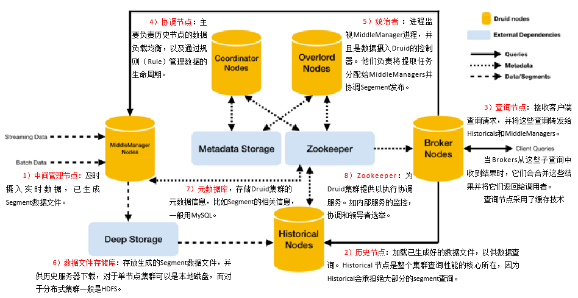


# 数据结构

- 与Druid架构相辅相成的是其基于DataSource与Segment的数据结构
- 它们共同成就了Druid的高性能优势

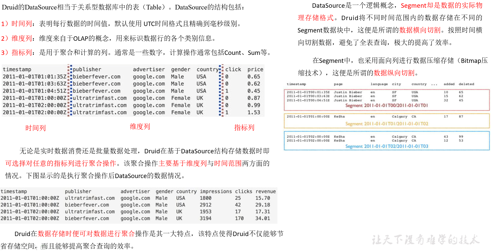


# 安装（单机版）

- 安装包下载
  - 从https://imply.io/get-started 下载最新版本安装包

- 安装部署
  - imply集成了Druid，提供了Druid从部署到配置到各种可视化工具的完整的解决方案
  - imply有点类似于Cloudera Manager

- 将imply-2.7.10.tar.gz上传到hadoop102的/opt/software目录下，并解压
- 修改/opt/module/imply-2.7.10名称为/opt/module/imply
- 修改配置文件

```bash
[ttshe@hadoop102 software]$ tar -zxvf imply-2.7.10.tar.gz -C /opt/module
[ttshe@hadoop102 module]$ mv imply-2.7.10/ imply
[ttshe@hadoop102 ~]$ vi /opt/module/imply/conf/druid/_common/common.runtime.properties

#修改如下内容
druid.zk.service.host=hadoop102:2181,hadoop103:2181,hadoop104:2181
```

- 修改启动命令参数，使其不校验不启动内置ZK

```bash
[atguigu@hadoop102 supervise]$ vim /opt/module/imply/conf/supervise/quickstart.conf

#修改如下内容
:verify bin/verify-java
#:verify bin/verify-default-ports
#:verify bin/verify-version-check
:kill-timeout 10
#!p10 zk bin/run-zk conf-quickstart
```


# 启动

- 启动Zookeeper
- 启动imply
  - 说明：每启动一个服务均会打印出一条日志。可以通过/opt/module/imply/var/sv/查看服务启动时的日志信息

```bash
[ttshe@hadoop102 imply]$ zk.sh start
[ttshe@hadoop102 imply]$ bin/supervise  -c conf/supervise/quickstart.conf
```

- 启动采集Flume和Kafka
  - 主要是为了节省内存开销，同时hadoop102内存调整为8G

```bash
[ttshe@hadoop102 imply]$ f1.sh start
[ttshe@hadoop102 imply]$ kf.sh start
```


# 使用


## 启动

- 启动Zookeeper
- 启动imply
  - 说明：每启动一个服务均会打印出一条日志。可以通过/opt/module/imply/var/sv/查看服务启动时的日志信息

```bash
 [ttshe@hadoop102 imply]$ zk.sh start 
 [ttshe@hadoop102 imply]$ bin/supervise  -c conf/supervise/quickstart.conf
```

- 启动采集Flume和Kafka
  - 主要是为了节省内存开销，同时hadoop102内存调整为8G

```bash
 [ttshe@hadoop102 imply]$ f1.sh start
 [ttshe@hadoop102 imply]$ kf.sh start
```


## 页面

- 启动日志生成程序（延时1秒发送一条日志）

```bash
[ttshe@hadoop102 server]$ lg.sh 1000 5000
```

- 登录hadoop102:9095查看

 

- 点击Load data->点击Apache Kafka

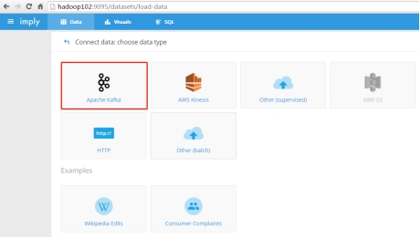 

- 添加Kafka Broker和要消费的topic

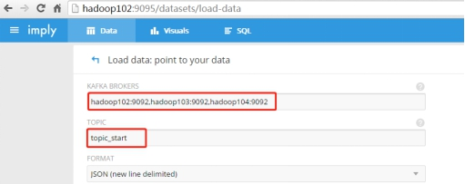 

- 确认数据样本格式

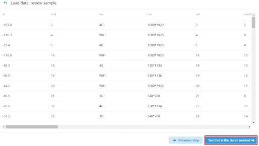 

- 加载数据，必须要有时间字段

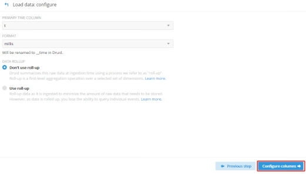 

- 配置要加载哪些列

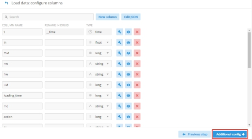 

- 创建数据库表名

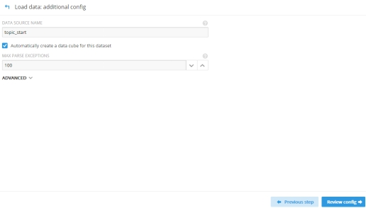 

- 重新观察一下配置

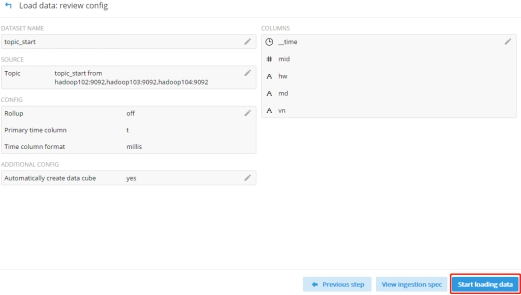 

- 连接Kafka的topic_start

 

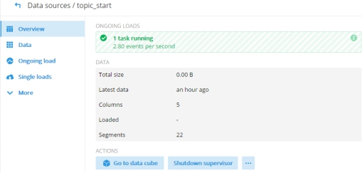 

- 点击SQL

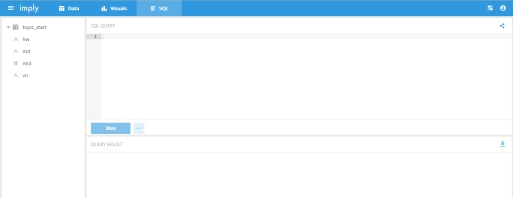 

- 查询指标

select sum(mid) from "topic_start"

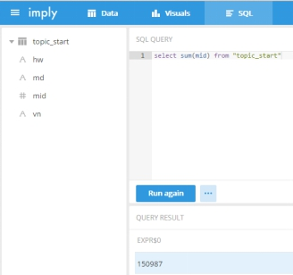 


## 停止

- 按Ctrl + c中断监督进程
- 如想中断服务后进行干净的启动，请删除/opt/module/imply/var/目录