# 环境准备

> 注意在root用户下进行操作

- 虚拟机准备

  - 克隆三台虚拟机（hadoop102、hadoop103、hadoop104），配置好对应主机的网络IP、主机名称、关闭防火墙
  - 设置hadoop102、hadoop103、hadoop104的主机对应内存分别是：16G、4G、4G
- SSH免密登录
  - 重复操作，配置hadoop103对hadoop102、hadoop103、hadoop104三台服务器免密登录

```bash
[root@hadoop102 .ssh]$ ssh-keygen -t rsa
[root@hadoop102 .ssh]$ ssh-copy-id hadoop102
[root@hadoop102 .ssh]$ ssh-copy-id hadoop103
[root@hadoop102 .ssh]$ ssh-copy-id hadoop104
```

- 集群同步脚本

  - 需要创建bin目录

  ```bash
  [root@hadoop102 ~]# mkdir bin
  [root@hadoop102 ~]# cd bin/
  [root@hadoop102 bin]# vim xsync
  [root@hadoop102 bin]# chmod 777 xsync 
  ```

  ```bash
  #!/bin/bash
  #1 获取输入参数个数，如果没有参数，直接退出
  pcount=$#
  if((pcount==0)); then
  echo no args;
  exit;
  fi
  
  #2 获取文件名称
  p1=$1
  fname=`basename $p1`
  echo fname=$fname
  
  #3 获取上级目录到绝对路径
  pdir=`cd -P $(dirname $p1); pwd`
  echo pdir=$pdir
  
  #4 获取当前用户名称
  user=`whoami`
  
  #5 循环
  for((host=103; host<105; host++)); do
          echo ------------------- hadoop$host --------------
          rsync -av $pdir/$fname $user@hadoop$host:$pdir
  done
  ```

- 安装JDK（三台）

- 集群整体操作脚本

```bash
[root@hadoop102 bin]# touch xcall
[root@hadoop102 bin]# chmod 777 xcall
[root@hadoop102 bin]# vim xcall
```

```bash
#!/bin/bash

for i in hadoop102 hadoop103 hadoop104
do
        echo --------- $i ----------
        ssh $i "$*"
done
```

```bash
[root@hadoop102 module]# cat /etc/profile >> ~/.bashrc
[root@hadoop103 module]# cat /etc/profile >> ~/.bashrc
[root@hadoop104 module]# cat /etc/profile >> ~/.bashrc
```

- 安装MySQL
- 创建CM用的数据库

  - 在MySQL中依次创建监控数据库、Hive数据库、Oozie数据库、Hue数据库
  - 启动数据库
  - 集群监控数据库
  - Hive数据库
  - Oozie数据库
  - Hue数据库
  - 关闭数据库

```sql
[ttshe@hadoop102 ~]$ mysql -u root -p123456

mysql> create database amon DEFAULT CHARSET utf8 COLLATE utf8_general_ci;
mysql> create database hive DEFAULT CHARSET utf8 COLLATE utf8_general_ci;
mysql> create database oozie DEFAULT CHARSET utf8 COLLATE utf8_general_ci;
mysql> create database hue DEFAULT CHARSET utf8 COLLATE utf8_general_ci;
mysql> quit;
```

- 下载第三方依赖
  - 依次在三台节点（所有Agent的节点）上执行下载第三方依赖（注意：需要联网）

```bash
[root@hadoop102 ~]# yum -y install chkconfig python bind-utils psmisc libxslt zlib sqlite cyrus-sasl-plain cyrus-sasl-gssapi fuse fuse-libs redhat-lsb
[root@hadoop103 ~]# yum -y install chkconfig python bind-utils psmisc libxslt zlib sqlite cyrus-sasl-plain cyrus-sasl-gssapi fuse fuse-libs redhat-lsb
[root@hadoop104 ~]# yum -y install chkconfig python bind-utils psmisc libxslt zlib sqlite cyrus-sasl-plain cyrus-sasl-gssapi fuse fuse-libs redhat-lsb
```

- 关闭SELINUX
- 安全增强型Linux（Security-Enhanced Linux）简称SELinux，它是一个 Linux 内核模块，也是Linux的一个安全子系统。为了避免安装过程出现各种错误
- 


## 配置NTP时钟同步

- NTP服务器配置

```bash
[root@hadoop102 ~]# vi /etc/ntp.conf
注释掉所有的restrict开头的配置
修改#restrict 192.168.1.0 mask 255.255.255.0 nomodify notrap
为restrict 192.168.1.102 mask 255.255.255.0 nomodify notrap
将所有server配置进行注释
添加下面两行内容
server 127.127.1.0
fudge 127.127.1.0 stratum 10
```

- 启动NTP服务 service ntpd start

```bash
[root@hadoop102 ~]# service ntpd start
```

- NTP客户端配置（在agent主机上进行配置hadoop103,hadoop104）

```bash
[root@hadoop103 ~]# vi /etc/ntp.conf

#注释所有restrict和server配置添加
server 192.168.1.102

# 手动测试
[root@hadoop103~]# ntpdate 192.168.1.102
28 Sep 17:13:18 ntpdate[71157]: step time server 192.168.1.102 offset -172.309107 sec
```

- 启动ntpd并设置为开机自启（每个节点hadoop102，hadoop103，hadoop104）

```bash
[root@hadoop103 ~]#  chkconfig ntpd on
[root@hadoop103 ~]#  service ntpd start
```

- 查看日期

```bash
[root@hadoop102 bin]# xcall date
```


# CM安装

- CM下载地址：http://archive.cloudera.com/cm5/cm/5/cloudera-manager-el6-cm5.12.1_x86_64.tar.gz
- 离线库下载地址：http://archive.cloudera.com/cdh5/parcels/latest/


- ==注意：以下操作都需要在root用户下进行==
- 需要的文件

```bash
[root@hadoop102 software]# ll
总用量 2564316
-rw-r--r-- 1 root  root  1620405492 9月  26 2018 CDH-5.12.1-1.cdh5.12.1.p0.3-el6.parcel
-rw-r--r-- 1 root  root          41 9月  26 2018 CDH-5.12.1-1.cdh5.12.1.p0.3-el6.parcel.sha1
-rw-r--r-- 1 root  root   742029734 9月   6 2018 cloudera-manager-el6-cm5.12.1_x86_64.tar.gz
-rw-r--r-- 1 ttshe ttshe  185515842 8月  19 2017 jdk-8u144-linux-x64.tar.gz
-rw-r--r-- 1 root  root       72312 9月  26 2018 manifest.json
drwxr-xr-x 2 root  root        4096 6月  26 2015 mysql-libs
-rw-r--r-- 1 root  root    77807942 3月   3 2017 mysql-libs.zip
```

- 解压cloudera-manager-el6-cm5.12.1_x86_64.tar.gz

```bash
[root@hadoop102 module]# mkdir /opt/module/cloudera-manager
[root@hadoop102 module]# tar -zxvf /opt/software/cloudera-manager-el6-cm5.12.1_x86_64.tar.gz -C /opt/module/cloudera-manager/
```

- 解压之后
  - cloudera
    - 离线库文件夹，这里暂时用不到，使用自己的离线库
  - cm-5.12.1
    - CM的安装目录

```bash
[root@hadoop102 cloudera-manager]# ll
总用量 8
drwxr-xr-x 4 1106 4001 4096 8月  19 2017 cloudera
drwxr-xr-x 9 1106 4001 4096 8月  19 2017 cm-5.12.1
```


## 创建用户cloudera-scm

- 注意：==所有节点==

- Cloudera Manager默认用户为cloudera-scm，创建具有此名称的用户是最简单的方法
- 安装完成后，将自动使用此用户

```bash
[root@hadoop102 module]# 
useradd \
--system \
--home=/opt/module/cloudera-manager/cm-5.12.1/run/cloudera-scm-server\
--no-create-home \
--shell=/bin/false \
--comment "Cloudera SCM User" cloudera-scm
[root@hadoop102 software]# id cloudera-scm
uid=495(cloudera-scm) gid=492(cloudera-scm) 组=492(cloudera-scm)
```

- 参数说明
  - --system
    - 创建一个系统账户
  - --home
    - 指定用户登入时的主目录
    - 替换系统默认值/home/<用户名>
  - --no-create-home
    - 不要创建用户的主目录
  - --shell
    - 用户的登录 shell 名
  - --comment
    - 用户的描述信息
- 可以使用`man useradd`帮助
  - 也可以使用`useradd --help`	


## 配置CM Agent

- 指定server的host

```bash
[root@hadoop102 software]# vim /opt/module/cloudera-manager/cm-5.12.1/etc/cloudera-scm-agent/config.ini

server_host=hadoop102
```

- 在该配置文件最后可看到数据库/usr/share/java是默认配置的


## 配置CM的数据库

- 拷贝`mysql-connector-java.jar`文件到目录` /usr/share/java/`
  - 注意jar包名称要修改为mysql-connector-java.jar

```bash
[root@hadoop102]# mkdir /usr/share/java/
[root@hadoop102 /]# cp /opt/software/mysql-libs/mysql-connector-java-5.1.27/mysql-connector-java-5.1.27-bin.jar /usr/share/java/
[root@hadoop102 /]# mv /usr/share/java/mysql-connector-java-5.1.27-bin.jar /usr/share/java/mysql-connector-java.jar 
```

- 在mysql中创建cm库

```sql
[root@hadoop102 /]# /opt/module/cloudera-manager/cm-5.12.1/share/cmf/schema/scm_prepare_database.sh mysql cm -hhadoop102 -uroot -p123456 --scm-host hadoop102 scm scm scm
```

- 参数说明
  - cm表示创建的库名称
  - -h 表示Database host
  - -u 表示Database username
  - -p 表示Database Password
  - --scm-host 表示server所在的节点ip
  - scm固定形式

```bash
[root@hadoop102 schema]# cat scm_prepare_database.sh 
...
OPTIONS
   -h|--host       Database host. Default is to connect locally.
   -P|--port       Database port. If not specified, the database specific
                   default will be used: namely, 3306 for MySQL,
                   5432 for PostgreSQL, and 1521 for Oracle.
   -u|--user       Database username that has privileges for creating
                   users and grants.  The default is '$USER'.
                   Typical values are 'root' for MySQL and
                   'postgres' for PostgreSQL. Not applicable for Oracle.
   -p|--password   Database Password. Default is no password.
   --scm-host      SCM server's hostname. Omit if SCM is colocated with MySQL.
   --config-path   Path to SCM configuration files.
                   Default is /etc/cloudera-scm-server.
   --scm-password-script Instead of obtaining the SCM username's password
                   directly, execute a script whose stdout is used as the
                   password.
   -f|--force      Don't stop when an error is encountered.
   -v|--verbose    Print more informational messages.
   -?|--help       Show this message.
...
```


## 分发cloudera-manager

```bash
[root@hadoop102 module]# scp -r /opt/module/cloudera-manager/ hadoop103:/opt/module/
[root@hadoop102 module]# scp -r /opt/module/cloudera-manager/ hadoop104:/opt/module/
```


## 创建Parcel-repo 目录

- 在Server节点创建目录/opt/cloudera/parcel-repo
  - 配置中指定该路径作为离线库
- 修改该目录的权限

```bash
[root@hadoop102 module]# mkdir -p /opt/cloudera/parcel-repo
[root@hadoop102 module]# chown cloudera-scm:cloudera-scm /opt/cloudera/parcel-repo
```

- 拷贝下载文件到/opt/cloudera/parcel-repo
  - 注意CDH-5.12.1-1.cdh5.12.1.p0.3-el6.parcel.sha1需要重命名

```bash
[root@hadoop102 software]# mv CDH-5.12.1-1.cdh5.12.1.p0.3-el6.parcel.sha1 CDH-5.12.1-1.cdh5.12.1.p0.3-el6.parcel.sha
[root@hadoop102 software]# cp CDH-5.12.1-1.cdh5.12.1.p0.3-el6.parcel.sha /opt/cloudera/parcel-repo/
[root@hadoop102 software]# cp CDH-5.12.1-1.cdh5.12.1.p0.3-el6.parcel /opt/cloudera/parcel-repo/
[root@hadoop102 software]# cp manifest.json /opt/cloudera/parcel-repo/
```

- 在Agent 节点创建目录/opt/cloudera/parcels
  - hadoop102，hadoop103，hadoop104
  - 在安装parcel格式的文件，需要对该文件进行解压，解压后的文件所在的文件夹就是/opt/cloudera/parcels
  - 存放各个服务的目录

```bash
[root@hadoop102 /]# mkdir -p /opt/cloudera/parcels
[root@hadoop102 /]# chown cloudera-scm:cloudera-scm /opt/cloudera/parcels
[root@hadoop103 /]# mkdir -p /opt/cloudera/parcels
[root@hadoop103 /]# chown cloudera-scm:cloudera-scm /opt/cloudera/parcels
[root@hadoop104 /]# mkdir -p /opt/cloudera/parcels
[root@hadoop104 /]# chown cloudera-scm:cloudera-scm /opt/cloudera/parcels
```


## 分发Parcel-repo

```bash
[root@hadoop102 opt]# scp -r /opt/cloudera/ hadoop103:/opt/
[root@hadoop102 opt]# scp -r /opt/cloudera/ hadoop104:/opt/  
```


## 启动

- 启动过程非常慢，Manager 启动成功需要等待一段时间，过程中会在数据库中创建对应的表需要耗费一些时间

### 服务节点

- hadoop102
- 通过7180端口号查看是否启动成功
  - server和agent是使用python编写的，使用jps查看不到

```bash
[root@hadoop102 /]# /opt/module/cloudera-manager/cm-5.12.1/etc/init.d/cloudera-scm-server start
Starting cloudera-scm-server:                              [确定]
[root@hadoop102 /]# netstat -anp | grep 7180
tcp        0      0 0.0.0.0:7180                0.0.0.0:*                   LISTEN      3327/java   
```


### 工作节点

- hadoop102，hadoop103，hadoop104

```bash
[root@hadoop102 /]# /opt/module/cloudera-manager/cm-5.12.1/etc/init.d/cloudera-scm-agent start
[root@hadoop103 /]# /opt/module/cloudera-manager/cm-5.12.1/etc/init.d/cloudera-scm-agent start
[root@hadoop104 /]# /opt/module/cloudera-manager/cm-5.12.1/etc/init.d/cloudera-scm-agent start
```


## 访问

- 访问http://hadoop102:7180
  - 用户名、密码：admin


## 关闭

### 服务节点

```bash
[root@hadoop102 init.d]# /opt/module/cloudera-manager/cm-5.12.1/etc/init.d/cloudera-scm-server stop
```


### 工作节点

```bash
[root@hadoop102 init.d]# /opt/module/cloudera-manager/cm-5.12.1/etc/init.d/cloudera-scm-agent stop
[root@hadoop103 init.d]# /opt/module/cloudera-manager/cm-5.12.1/etc/init.d/cloudera-scm-agent stop
[root@hadoop104 init.d]# /opt/module/cloudera-manager/cm-5.12.1/etc/init.d/cloudera-scm-agent stop
```


# 数据采集模块


## HDFS，YARN，ZK安装


### 选择自定义安装

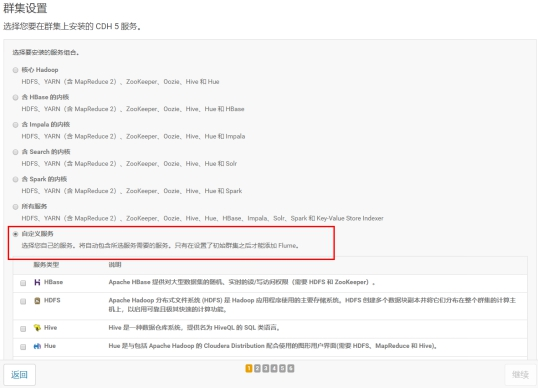 

### 选择安装服务

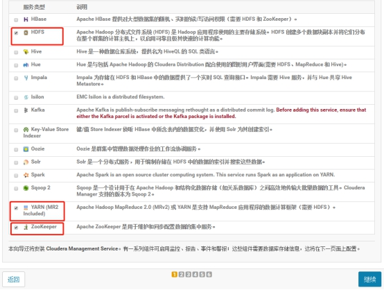 


### 分配节点

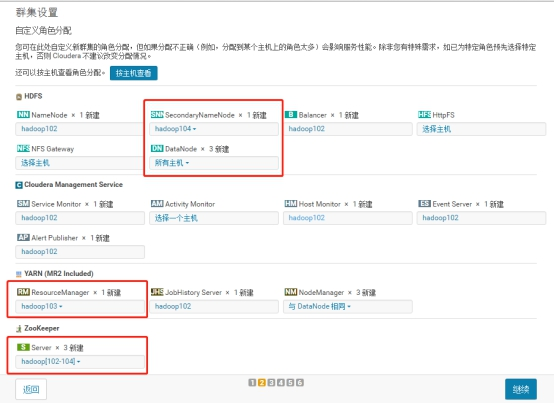 


### 集群设置全部选默认即可

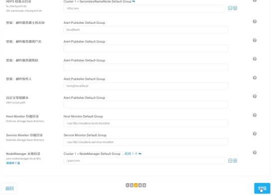 


### 自动启动进程

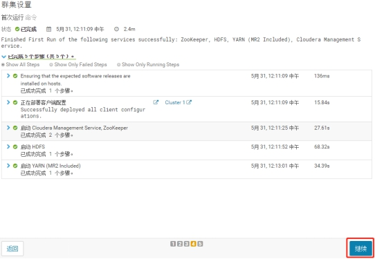 


### 修改HDFS的权限检查配置

- 关闭HDFS中的权限检查：dfs.permissions

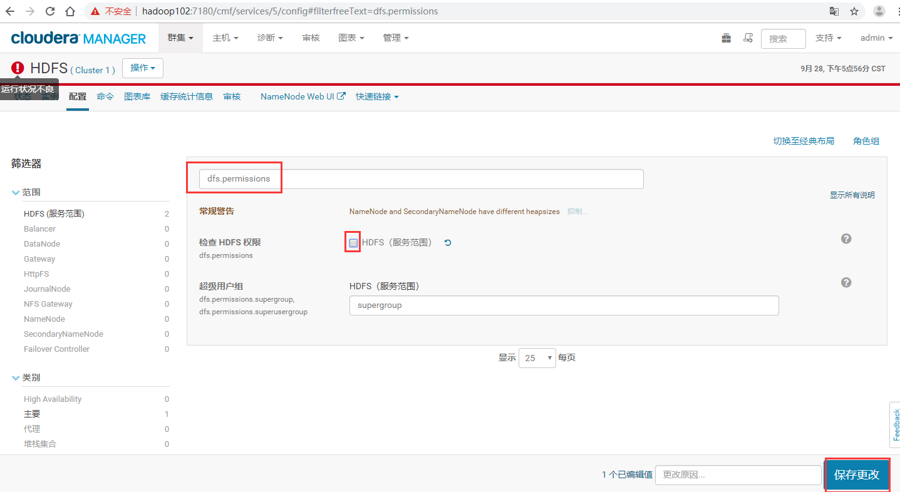 


### 配置Hadoop支持LZO

- 点击主机，在下拉菜单中点击Parcel，查看仓库
  - 默认是没有LZO，再点击配置

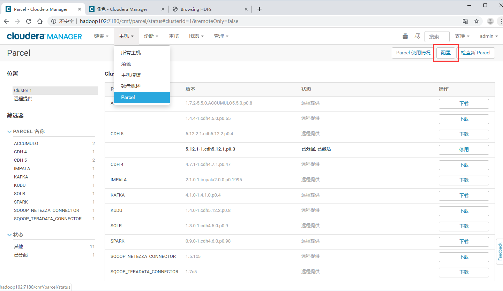

- 找到远程Parcel存储库URL
- 增加一栏输入http://archive.cloudera.com/gplextras/parcels/latest/
- 点击保存更改

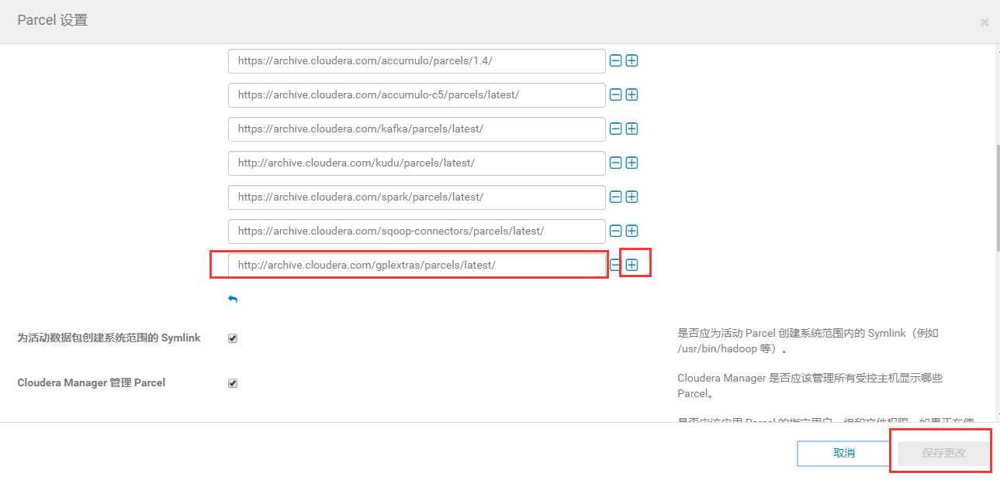

- 返回Parcel列表，多刷新几次可看到LZO
- 选择下载
- 下载完成后选择分配
- 分配完成后选择激活

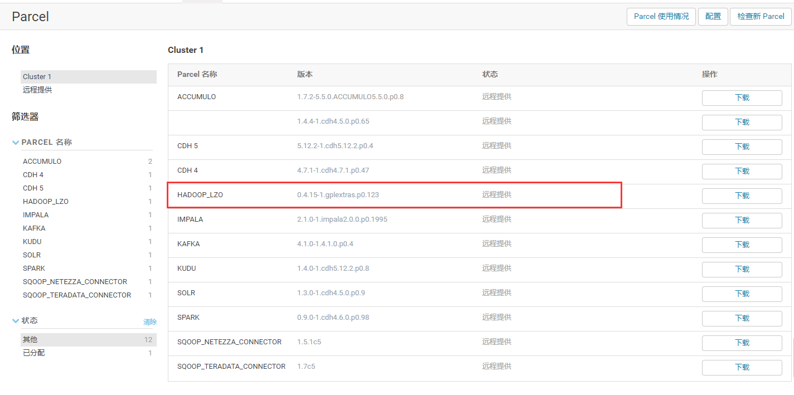

- 打开HDFS配置
- 找到压缩编码解码器
- 添加com.hadoop.compression.lzo.LzopCodec

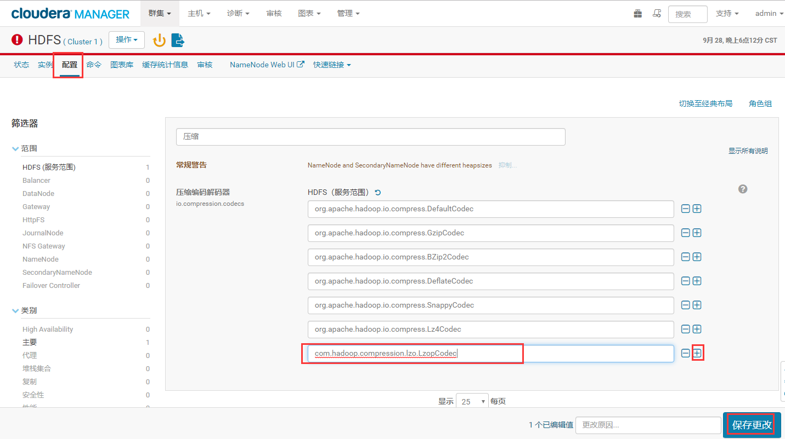

- 打开YARN配置
- 找到MR 应用程序 Classpath
- 添加/opt/cloudera/parcels/HADOOP_LZO/lib/hadoop/lib/hadoop-lzo-cdh4-0.4.15-gplextras.jar

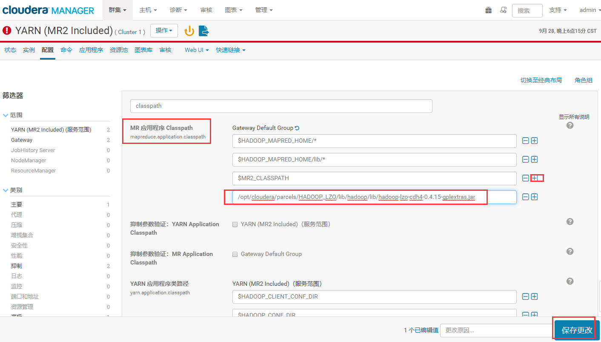

- 点击更新过期配置，在过期配置中，可以看到更新的配置信息，下面有一个重启按键，点击重启


## Flume安装

- 点击添加服务

- 选择Flume，点击继续

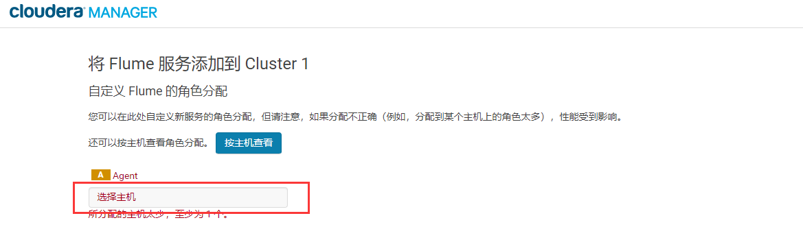

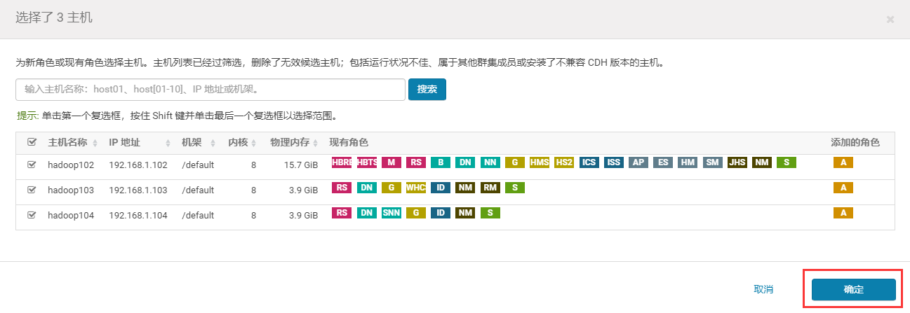

### 配置

- 选择实例
- 选中hadoop102
- 点击agent
- 注意，如果在Flume的tab下点击了配置，是对所有的flume节点进行统一配置

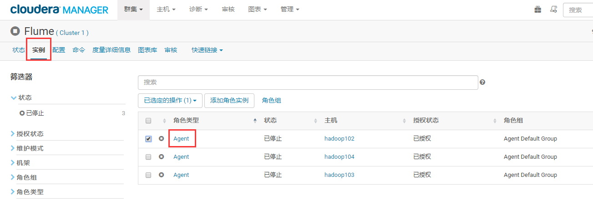

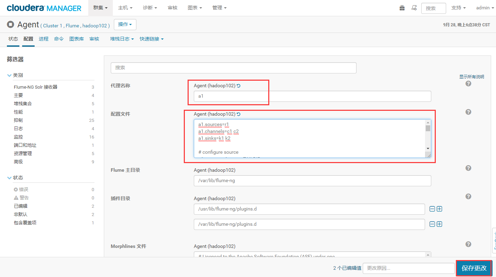

- 具体的flume-kafka的配置

```properties
a1.sources=r1
a1.channels=c1 c2

# configure source
# 支持断点续传
a1.sources.r1.type = TAILDIR
# 记录读取文件的位置
a1.sources.r1.positionFile = /opt/module/flume/log_position.json
# 支持读取多个文件
a1.sources.r1.filegroups = f1
# 读取文件的名称规则，正则表达式
a1.sources.r1.filegroups.f1 = /tmp/logs/app.+
a1.sources.r1.fileHeader = true
a1.sources.r1.channels = c1 c2

#interceptor
a1.sources.r1.interceptors = i1 i2
# ETL拦截器，注意这里需要在拦截器中实现内部类Builder，进行初始化工作
a1.sources.r1.interceptors.i1.type = com.stt.flume.LogETLInterceptor$Builder
# 日志类型选择拦截器
a1.sources.r1.interceptors.i2.type = com.stt.flume.LogTypeInterceptor$Builder

# 使用多路复用类型，依据选择进行匹配发送给channel
a1.sources.r1.selector.type = multiplexing
# 读取header中的topic字段，header是map结构，如header.put("topic","topic_start")
a1.sources.r1.selector.header = topic
# topic字段的值是topic_start,event发送到c1
a1.sources.r1.selector.mapping.topic_start = c1
a1.sources.r1.selector.mapping.topic_event = c2

# configure channel
a1.channels.c1.type = org.apache.flume.channel.kafka.KafkaChannel
a1.channels.c1.kafka.bootstrap.servers = hadoop102:9092,hadoop103:9092,hadoop104:9092
# 发送到kafka的主题
a1.channels.c1.kafka.topic = topic_start
a1.channels.c1.parseAsFlumeEvent = false 
# 表示返回的event信息中不包含来源的flume信息前缀，默认true，这里不需要，否则在hive节点需要二次过滤
a1.channels.c1.kafka.consumer.group.id = flume-consumer

a1.channels.c2.type = org.apache.flume.channel.kafka.KafkaChannel
a1.channels.c2.kafka.bootstrap.servers = hadoop102:9092,hadoop103:9092,hadoop104:9092
a1.channels.c2.kafka.topic = topic_event
a1.channels.c2.parseAsFlumeEvent = false
a1.channels.c2.kafka.consumer.group.id = flume-consumer
```

- 修改/opt/module/flume/log_position.json的读写权限

```bash
[root@hadoop102 module]# mkdir -p /opt/module/flume
[root@hadoop102 flume]# touch log_position.json
[root@hadoop102 flume]# chmod 777 log_position.json
[root@hadoop102 module]# xsync flume/
```


### 拦截器

- 上传拦截器
- 采用root用户将flume-interceptor-1.0-SNAPSHOT.jar包放入到hadoop102的/opt/cloudera/parcels/CDH-5.12.1-1.cdh5.12.1.p0.3/lib/flume-ng/lib/文件夹下面
- 分发Flume到hadoop103

```bash
[root@hadoop102 lib]# ls | grep interceptor
flume-interceptor-1.0-SNAPSHOT.jar
[root@hadoop102 lib]# xsync flume-interceptor-1.0-SNAPSHOT.jar
```


### 启动

- 直接在页面中启动
  - 虽然hadoop104节点也会启动，后期配置后重启


### 查看日志

- 选择诊断，在搜索框中进行组件日志的搜索

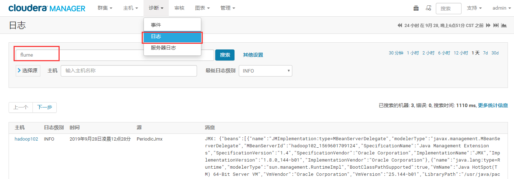


## Kafka安装

- 选择在线安装和离线包安装，在线安装下载时间较长
- 离线包安装时间较短
- 这里为了节省时间，选择离线安装


### 导入离线包

- 在hadoop102上创建/opt/cloudera/csd目录
- 上传KAFKA-1.2.0.jar到/opt/cloudera/csd目录，并修改所有者和所有者的组

```bash
[root@hadoop102 opt]# mkdir -p /opt/cloudera/csd
[root@hadoop102 csd]# ll
总用量 8
-rw-r--r-- 1 root root 5670 5月  29 08:54 KAFKA-1.2.0.jar
[root@hadoop102 cloudera]# chown cloudera-scm:cloudera-scm /opt/cloudera/csd/ -R
```

- 上传KAFKA-4.0.0-1.4.0.0.p0.1-el6.parcel、KAFKA-4.0.0-1.4.0.0.p0.1-el6.parcel.sha1到/opt/cloudera/parcel-repo目录
- 修改KAFKA-4.0.0-1.4.0.0.p0.1-el6.parcel.sha1名称为KAFKA-4.0.0-1.4.0.0.p0.1-el6.parcel.sha

```bash
[root@hadoop102 csd]# cd /opt/cloudera/parcel-repo/
[root@hadoop102 parcel-repo]# ls | grep KAFKA
KAFKA-4.0.0-1.4.0.0.p0.1-el6.parcel
KAFKA-4.0.0-1.4.0.0.p0.1-el6.parcel.sha1
[root@hadoop102 parcel-repo]# mv KAFKA-4.0.0-1.4.0.0.p0.1-el6.parcel.sha1 KAFKA-4.0.0-1.4.0.0.p0.1-el6.parcel.sha
```

- ClouderManager中选择Parcel->检查Parcel->Kafka点击分配->激活

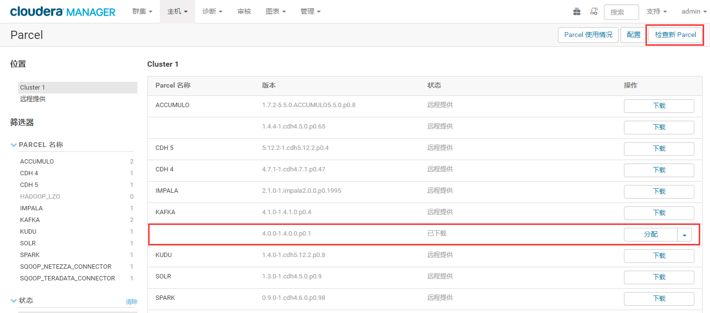


### 在线下载安装包

- 在Parcel中点击kafka下载


### 安装

- 在首页，点击添加服务，选择kafka，点击继续

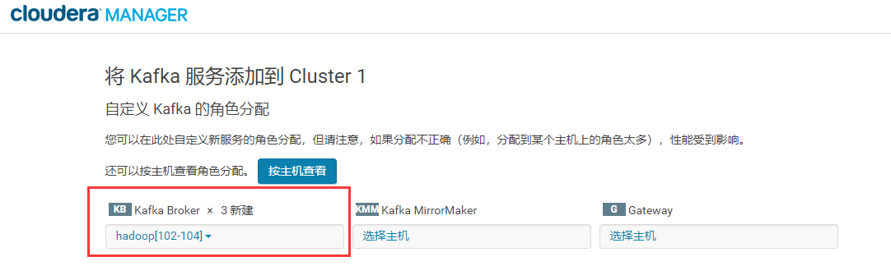 

- 点击logo退出当前，进行其他配置

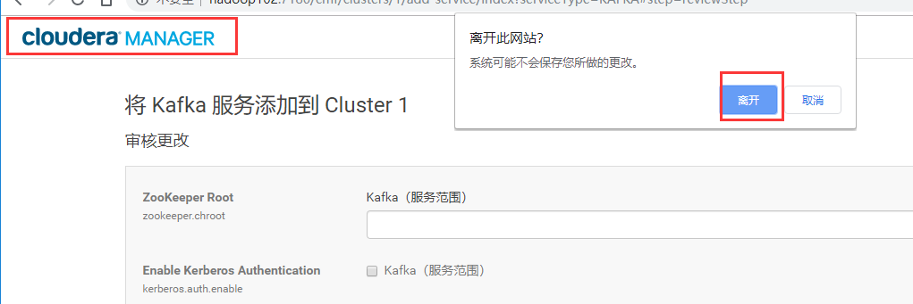 

- 点击kafka进行配置
  - 修改Kafka的堆大小为256M
    - 默认50M

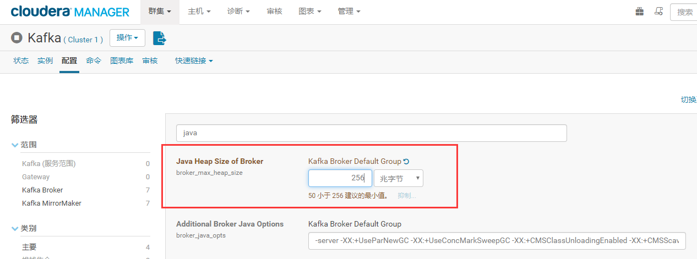 

- 启动kafka


### 测试

- 查看Topic

```bash
[root@hadoop102 ~]# /opt/cloudera/parcels/KAFKA-4.0.0-1.4.0.0.p0.1/bin/kafka-topics --zookeeper hadoop102:2181 --list
```

- 创建Topic

```bash
[root@hadoop102 ~]# cd /opt/cloudera/parcels/KAFKA-4.0.0-1.4.0.0.p0.1
[root@hadoop102 KAFKA-4.0.0-1.4.0.0.p0.1]# bin/kafka-topics --zookeeper hadoop102:2181,hadoop103:2181,hadoop104:2181  --create --replication-factor 1 --partitions 1 --topic topic_start
[root@hadoop102 KAFKA-4.0.0-1.4.0.0.p0.1]# bin/kafka-topics --zookeeper hadoop102:2181,hadoop103:2181,hadoop104:2181  --create --replication-factor 1 --partitions 1 --topic topic_event
```

- 消费消息

```bash
[root@hadoop102 KAFKA-4.0.0-1.4.0.0.p0.1]# bin/kafka-console-consumer --bootstrap-server hadoop102:9092 --from-beginning --topic topic_start
```

- 生产消息

```bash
[root@hadoop102 KAFKA-4.0.0-1.4.0.0.p0.1]# bin/kafka-console-producer --broker-list hadoop102:9092 --topic topic_start
```

- 查看topic详细

```bash
[root@hadoop102 KAFKA-4.0.0-1.4.0.0.p0.1]$ bin/kafka-topics --zookeeper hadoop102:2181  --describe --topic topic_start
```

- 删除Topic

```bash
[root@hadoop102 KAFKA-4.0.0-1.4.0.0.p0.1]$ bin/kafka-topics --delete --zookeeper hadoop102:2181,hadoop103:2181,hadoop104:2181 --topic topic_event
[root@hadoop102 KAFKA-4.0.0-1.4.0.0.p0.1]$ bin/kafka-topics --delete --zookeeper hadoop102:2181,hadoop103:2181,hadoop104:2181 --topic topic_start
```


## Flume消费Kafka数据写到HDFS

- 在hadoop104上配置flume读取kafka数据写到hdfs

```properties
## 组件
a1.sources=r1 r2
a1.channels=c1 c2
a1.sinks=k1 k2

## source1
a1.sources.r1.type = org.apache.flume.source.kafka.KafkaSource
a1.sources.r1.batchSize = 5000
a1.sources.r1.batchDurationMillis = 2000
a1.sources.r1.kafka.bootstrap.servers = hadoop102:9092,hadoop103:9092,hadoop104:9092
a1.sources.r1.kafka.topics=topic_start

## source2
a1.sources.r2.type = org.apache.flume.source.kafka.KafkaSource
a1.sources.r2.batchSize = 5000
a1.sources.r2.batchDurationMillis = 2000
a1.sources.r2.kafka.bootstrap.servers = hadoop102:9092,hadoop103:9092,hadoop104:9092
a1.sources.r2.kafka.topics=topic_event

## channel1
a1.channels.c1.type=memory
a1.channels.c1.capacity=100000
a1.channels.c1.transactionCapacity=10000

## channel2
a1.channels.c2.type=memory
a1.channels.c2.capacity=100000
a1.channels.c2.transactionCapacity=10000

## sink1
a1.sinks.k1.type = hdfs
a1.sinks.k1.hdfs.path = /origin_data/gmall/log/topic_start/%Y-%m-%d
a1.sinks.k1.hdfs.filePrefix = logstart-
a1.sinks.k1.hdfs.round = true
a1.sinks.k1.hdfs.roundValue = 10
a1.sinks.k1.hdfs.roundUnit = second

##sink2
a1.sinks.k2.type = hdfs
a1.sinks.k2.hdfs.path = /origin_data/gmall/log/topic_event/%Y-%m-%d
a1.sinks.k2.hdfs.filePrefix = logevent-
a1.sinks.k2.hdfs.round = true
a1.sinks.k2.hdfs.roundValue = 10
a1.sinks.k2.hdfs.roundUnit = second

## 不要产生大量小文件
a1.sinks.k1.hdfs.rollInterval = 10
a1.sinks.k1.hdfs.rollSize = 134217728
a1.sinks.k1.hdfs.rollCount = 0

a1.sinks.k2.hdfs.rollInterval = 10
a1.sinks.k2.hdfs.rollSize = 134217728
a1.sinks.k2.hdfs.rollCount = 0

## 控制输出文件是原生文件。
a1.sinks.k1.hdfs.fileType = CompressedStream 
a1.sinks.k2.hdfs.fileType = CompressedStream 

a1.sinks.k1.hdfs.codeC = lzop
a1.sinks.k2.hdfs.codeC = lzop

## 拼装
a1.sources.r1.channels = c1
a1.sinks.k1.channel= c1

a1.sources.r2.channels = c2
a1.sinks.k2.channel= c2
```

- 重启flume服务


## 日志生成数据传输到HDFS

- 将log-collector-1.0-SNAPSHOT-jar-with-dependencies.jar上传都hadoop102的/opt/module目录
- 分发log-collector-1.0-SNAPSHOT-jar-with-dependencies.jar到hadoop103
- 在/root/bin目录下创建脚本lg.sh
- 修改脚本执行权限

```bash
[root@hadoop102 module]# xsync log-collector-1.0-SNAPSHOT-jar-with-dependencies.jar
[root@hadoop102 bin]$ vim lg.sh
[root@hadoop102 bin]$ chmod 777 lg.sh
```

```bash
#!/bin/bash

for i in hadoop102 hadoop103 
do
ssh $i "java -classpath /opt/module/log-collector-1.0-SNAPSHOT-jar-with-dependencies.jar com.atguigu.appclient.AppMain $1 $2 >/opt/module/test.log &"
done
```

- 启动脚本

```bash
[root@hadoop102 module]$ lg.sh 
```


# 数仓搭建环境准备


## Hive安装

- 添加服务，添加hive

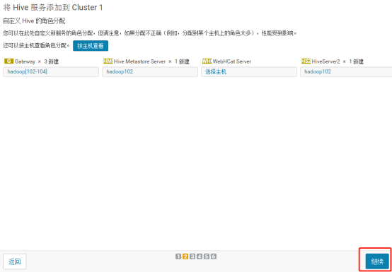 

- 配置元数据

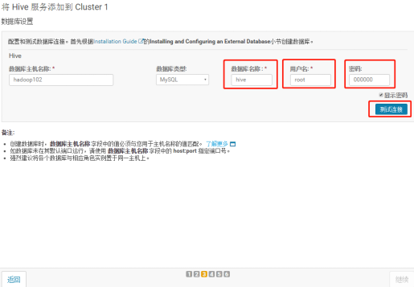 

- 测试通过后继续

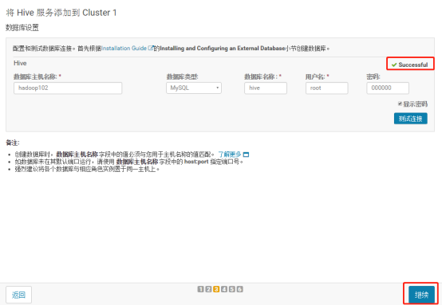 

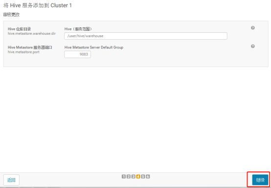 

### 修改配置

- 由于采集的数据是lzo压缩，hive需要指出lzo压缩

- /opt/cloudera/parcels/HADOOP_LZO/lib/hadoop/lib/


## Oozie安装

- 添加Oozie服务

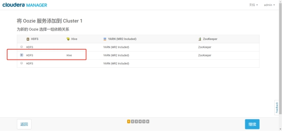  

- 选择有MySQL的节点安装

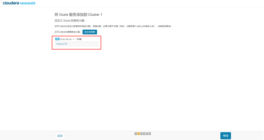 

- 连接数据库，然后继续，启动即可

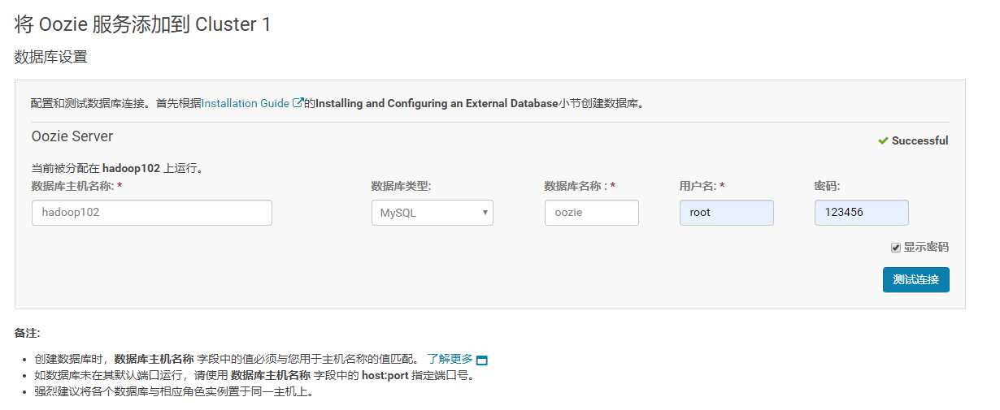 


## HUE安装

- 准备工作
  - 在LoadBalancer节点安装mod_ssl
  - 查看/usr/lib64/mysql下有没有libmysqlclient_r.so.16，如果没有，上传libmysqlclient_r.so.16到/usr/lib64/mysql，并软链接到/usr/lib64/
  - 从hadoop103上拷贝过来，默认安装mysql自带

```bash
[root@hadoop102 logs]# yum -y install mod_ssl
[root@hadoop102 logs]# ls /usr/lib64/mysql/
[root@hadoop102 logs]# cd /usr/lib64/mysql/
[root@hadoop103 mysql]# 
scp /usr/lib64/mysql/libmysqlclient_r.so.16 root@hadoop102:/usr/lib64/mysql/
[root@hadoop102 ~]ln -s /usr/lib64/mysql/libmysqlclient_r.so.16 /usr/lib64/libmysqlclient_r.so.16
```


# Spark2.1安装

- 在CDH5.12.1集群中，默认安装的Spark是1.6版本，这里需要将其升级为Spark2.1版本。经查阅官方文档，发现Spark1.6和2.x是可以并行安装的，也就是说可以不用删除默认的1.6版本，可以直接安装2.x版本，它们各自用的端口也是不一样的。

- Cloudera发布Apache Spark 2概述(可以在这里面找到安装方法和parcel包的仓库)

- cloudera的官网可以下载相关的parcel 的离线安装包：https://www.cloudera.com/documentation/spark2/latest/topics/spark2_installing.html

- Cloudera Manager及5.12.0版本的介绍：https://www.cloudera.com/documentation/enterprise/latest/topics/cm_ig_parcels.html#cmug_topic_7_11_5__section


## 离线包下载

- 所需软件：http://archive.cloudera.com/spark2/csd/

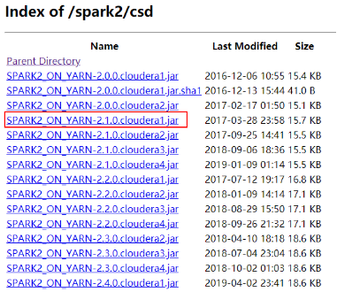 

- Parcels 包的下载地址：http://archive.cloudera.com/spark2/parcels/2.2.0.cloudera1/

 

## 离线包上传

- 上传文件SPARK2_ON_YARN-2.1.0.cloudera1.jar到/opt/cloudera/csd/下面

- 上传文件SPARK2-2.1.0.cloudera1-1.cdh5.7.0.p0.120904-el6.parcel和SPARK2-2.1.0.cloudera1-1.cdh5.7.0.p0.120904-el6.parcel.sha1 到/opt/cloudera/parcel-repo/ 

- 将SPARK2-2.1.0.cloudera1-1.cdh5.7.0.p0.120904-el6.parcel.sha1重命名为SPARK2-2.1.0.cloudera1-1.cdh5.7.0.p0.120904-el6.parcel.sha

```bash
[root@hadoop102 csd]# ll
总用量 24
-rw-r--r-- 1 cloudera-scm cloudera-scm  5670 5月  29 08:54 KAFKA-1.2.0.jar
-rw-r--r-- 1 root         root         16109 4月  14 14:30 SPARK2_ON_YARN-2.1.0.cloudera1.jar
[root@hadoop102 csd]# cd /opt/cloudera/parcel-repo/
[root@hadoop102 parcel-repo]# rz
[root@hadoop102 parcel-repo]# ls | grep SPARK
SPARK2-2.1.0.cloudera1-1.cdh5.7.0.p0.120904-el6.parcel
SPARK2-2.1.0.cloudera1-1.cdh5.7.0.p0.120904-el6.parcel.sha1
[root@hadoop102 parcel-repo]# mv SPARK2-2.1.0.cloudera1-1.cdh5.7.0.p0.120904-el6.parcel.sha1 SPARK2-2.1.0.cloudera1-1.cdh5.7.0.p0.120904-el6.parcel.sha
```


## 页面操作


- 在cm首页点击Parcel，点击检查新Parcel
- 点击分配，激活

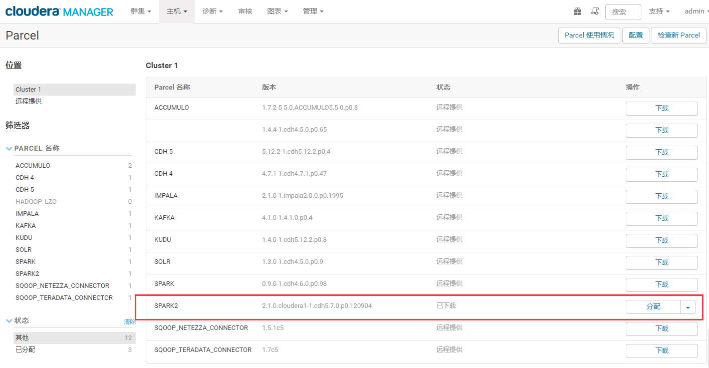 

- 添加服务，选择spark2，点击继续

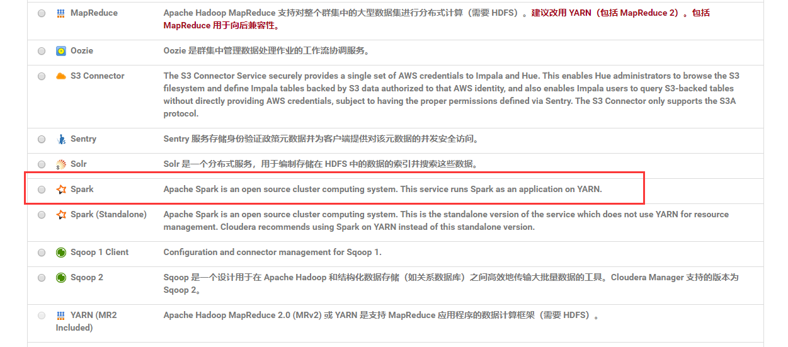 

