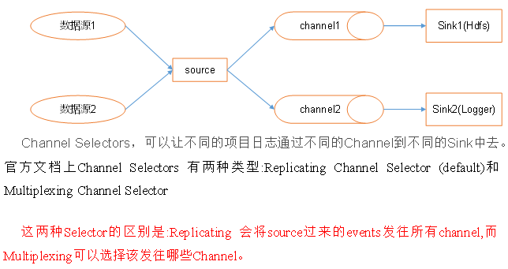
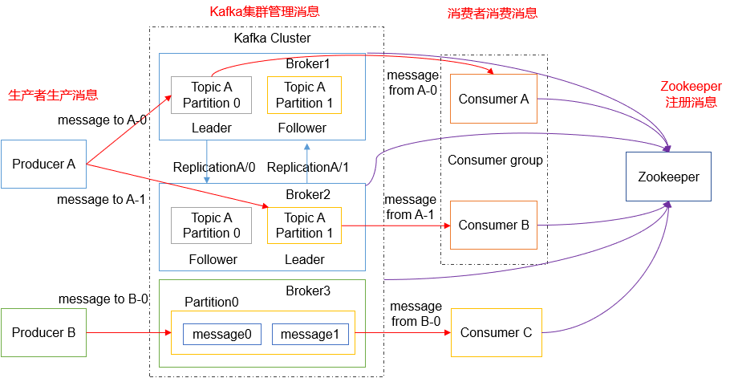
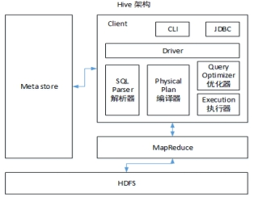

# Linux&Shell相关总结

- Linux常用命令

| 序号 | 命令                          | 命令解释                               |
| ---- | ----------------------------- | -------------------------------------- |
| 1    | top                           | 查看内存                               |
| 2    | df -h                         | 查看磁盘存储情况                       |
| 3    | iotop                         | 查看磁盘IO读写(yum install iotop安装） |
| 4    | iotop -o                      | 直接查看比较高的磁盘读写程序           |
| 5    | netstat -tunlp \| grep 端口号 | 查看端口占用情况                       |
| 6    | uptime                        | 查看报告系统运行时长及平均负载         |
| 7    | ps  aux                       | 查看进程                               |

- Shell常用工具
  - awk、sed、cut、sort


# Hadoop相关总结

- Hadoop默认不支持LZO压缩，如果需要支持LZO压缩，需要添加jar包，并在hadoop的cores-site.xml文件中添加相关压缩配置

- Hadoop常用端口号
  - 50070
  - 19888
  - 8088
  - 9000
  - 8032
  - 8020
  - 50090
  - 50010

- Hadoop配置文件以及简单的Hadoop集群搭建

- HDFS读流程和写流程

- MapReduce的Shuffle过程及Hadoop优化（包括：压缩、小文件、集群优化）

  - map方法之后，reduce方法之前

  - 先到分区；环形缓冲区（100M）；进行分区和排序（80%进行溢写）；排序，快排算法；排序规则，key的索引按照字典顺序排序；对溢写的结果进行归并排序，放入相应的分区；reduce进行数据拉取，先放入内存中，不足后放入磁盘...

  - 在整个shuffle过程中有哪些优化

    - 数据在环形缓冲区，可以从100M调整到200M
    - 溢写比例从80%调整到90%
    - 目的，减少溢写的次数
    - 大量的溢写文件需要归并
      - 默认个数是10个
      - 增大merge的个数，15个到20个，前提是机器的性能可以
    - 归并的过程中可以对数据进行combiner
      - 注意求和汇总不影响
      - 求平均会影响
    - 归并之后，在磁盘上等待传输
      - 为了减少磁盘存储，进行压缩
    - 在MR中那些可以进行压缩
      - Map输入
        - 需要支持切片
      - Map输出
        - 速度尽可能的快
        - snappy，lzo
      - Reduce输出
        - 如果要永久的保存，需要压缩率高，gzip
        - 如果输出作为下一个MR的输入，考虑压缩支持切片

  - Reduce端

    - 一次默认拉取5个
    - 调整增加拉取的个数，前提是机器性能满足
    - 增大拉取的内存

  - MapTask默认的资源

    - ==mapreduce.map.memory.mb==
      - 资源上限 1G
      - 开发过程中可以扩大到4-6G
    - mapreduce.map.cpu.vcores
      - cpu  的核数，默认1
    - 失败重试的次数，默认4

  - ReduceTask默认的资源

    - ==maperduce.reduce.memory.mb==
      - 资源上限 1G
      - 开发过程中可以扩大到4-6G
    - mapreduce.reduce.cpu.vcores
      - cpu  的核数，默认1

    - 失败重试的次数，默认4

  - HDFS 小文件

    - Har归档
      - 对外一个整体，对内是小文件
      - 减少namenode的压力
    - 自定义MR，SequenceFile
    - JVM重用
    - ...

- Yarn的Job提交流程
  - 提交xml，jar，切片配置
  - 运行AppMaster
  - 排队，放入任务队列中
  - NManger定期领取任务
    - 将任务放入容器container
      - 获取相应的内存和资源
    - 启动AppMaster
    - 读取切片配置，发现需要执行2个MapTask
    - 给另外2个NM发送MapTask进行执行(也需要Container容器，分配内存和资源)
      - 计算结果，放入分区结果
    - Reduce从分区获取结果，进行处理，计算完成放入HDFS

- Yarn的默认调度器、调度器分类、以及他们之间的区别
  - FIFO调度
  - 容量调度
    - 默认调度
  - ==公平调度==
  - 区别
    - FIFO属于单队列，同一时间只有一个执行
    - 容量，多队列，每个队列同一时间只有一个执行，并发数是队列的个数
    - 公平，多队列，每个队列同一时间有多个执行，并发度大于等于队列个数
      - 谁缺额越多执行谁
  - 场景
    - 对并发要求高，cpu容量比较大，服务器性能好，选择公平调度
    - 中小型服务器一般，选择容量调度

- HDFS存储多目录
  - 在开发中需要变成多目录，预留多个插槽，防止磁盘满了需要重新配置重启

- Hadoop参数调优
  - NameNode和DataNode的心跳值需要调整
  - 镜像文件和编辑日志要分开

- 项目经验之基准测试
  - hdfs测试
    - 读性能，写性能
  - mr的计算能力，排序
  - kafka测试
  - flume监控


# Zookeeper相关总结

- 选举机制
  - 半数机制

- 常用命令
  - ls、get、create


# Flume相关总结

- Flume组成，Put事务，Take事务
  - Taildir Source
    - 支持断点续传、多目录
    - Flume1.6以前需要自己自定义Source记录每次读取文件位置，实现断点续传

- File Channel
  - 数据存储在磁盘，宕机数据可以保存。但是传输速率慢
  - 适合对数据传输可靠性要求高的场景
  - 比如，金融行业

- Memory Channel
  - 数据存储在内存中，宕机数据丢失
  - 传输速率快。适合对数据传输可靠性要求不高的场景
  - 比如，普通的日志数据
- Kafka Channel
  - 减少了Flume的Sink阶段，提高了传输效率
- Source到Channel是Put事务
- Sink
  - 解决小文件
  - 需要配置3个值，达到1小时生成一个文件，或者达到128M生成一个小文件，event个数一般不用，设置为0
- Channel到Sink是Take事务

- Flume拦截器
  - 拦截器注意事项
- 项目中自定义了
  - ETL拦截器和区分类型拦截器

- 采用两个拦截器的优缺点
  - 优点，模块化开发和可移植性
  - 缺点，性能会低一些
- 自定义拦截器步骤
  - 实现 Interceptor
  - 重写四个方法
    - initialize 初始化
    - public Event intercept(Event event) 处理单个Event
    - public List<Event> intercept(List<Event> events) 处理多个Event，在这个方法中调用Event intercept(Event event)
    - close 方法
  - 静态内部类
    - 实现Interceptor.Builder



- Flume 监控器
  - Ganglia
  - 尝试的次数大于成功的次数，需要增大flume的内存

- Flume采集数据会丢失吗?
  - 不会
  - Channel存储可以存储在File中，数据传输自身有事务，选择tailDir，可以断点续传

- Flume内存
  - 开发中在flume-env.sh中设置JVM heap为4G或更高，部署在单独的服务器上（4核8线程16G内存）
  - -Xmx与-Xms最好设置一致，减少内存抖动带来的性能影响，如果设置不一致容易导致频繁fullgc

- FileChannel优化
  - 通过配置dataDirs指向多个路径，每个路径对应不同的硬盘，增大Flume吞吐量
  - 官方说明如下
    - Comma separated list of directories for storing log files. Using multiple directories on separate disks can improve file channel peformance
  - checkpointDir和backupCheckpointDir也尽量配置在不同硬盘对应的目录中，保证checkpoint坏掉后，可以快速使用backupCheckpointDir恢复数据

- Sink：HDFS Sink小文件处理
  - HDFS存入大量小文件，有什么影响？
    - 元数据层面
      - 每个小文件都有一份元数据，其中包括文件路径，文件名，所有者，所属组，权限，创建时间等，这些信息都保存在Namenode内存中。所以小文件过多，会占用Namenode服务器大量内存，影响Namenode性能和使用寿命
    - 计算层面
      - 默认情况下MR会对每个小文件启用一个Map任务计算，非常影响计算性能。同时也影响磁盘寻址时间
    - HDFS小文件处理
      - 官方默认的这三个参数配置写入HDFS后会产生小文件，hdfs.rollInterval、hdfs.rollSize、hdfs.rollCount
      - 基于以上hdfs.rollInterval=3600，hdfs.rollSize=134217728，hdfs.rollCount =0，hdfs.roundValue=10，hdfs.roundUnit= second几个参数综合作用，效果如下：
        - tmp文件在达到128M时会滚动生成正式文件
        - tmp文件创建超10秒时会滚动生成正式文件
        - 举例：在2018-01-01 05:23的时侯sink接收到数据，那会产生如下tmp文件
          - /atguigu/20180101/atguigu.201801010520.tm
          - 即使文件内容没有达到128M，也会在05:33时滚动生成正式文件


# Kafka相关总结



- Zookeeper 没有生产者信息，只有消费者信息
- Kafka压测
  - Kafka官方自带压力测试脚本（kafka-consumer-perf-test.sh、kafka-producer-perf-test.sh）
  - Kafka压测时，可以查看到哪个地方出现了瓶颈（CPU，内存，网络IO）
  - 一般都是网络IO达到瓶颈
  - 一般的生产速度
    - 10M，20M
  - 消费能力
    - ...

- Kafka的机器数量
  
- Kafka机器数量=`2*（峰值生产速度*副本数/100）+1`
  
- Kafka的日志保存时间
  
- 7天
  
- Kafka的硬盘大小
  
- 每天的数据量*7天
  
- Kafka监控
  - 公司自己开发的监控器
  - 开源的监控器：KafkaManager、KafkaMonitor

- Kakfa分区数
  - 影响消费的并发度
  - ==分区数并不是越多越好，一般分区数不要超过集群机器数量==
  - 分区数越多占用内存越大（ISR等），一个节点集中的分区也就越多，当它宕机的时候，对系统的影响也就越大。
  - 分区数一般设置为：==3-10个==

- 副本数设定
  - 一般我们设置成2个或3个，很多企业设置为2个
  - 影响磁盘IO

- 多少个Topic
  - 通常情况
    - 多少个日志类型就多少个Topic
    - 也有对日志类型进行合并的

- ==Kafka丢不丢数据==
  - 应答机制
  - Ack=0，相当于异步发送，消息发送完毕即offset增加，继续生产
  - Ack=1，leader收到leader replica 对一个消息的接受ack才增加offset，然后继续生产
  - Ack=-1，leader收到所有replica 对一个消息的接受ack才增加offset，然后继续生产。

- Kafka的ISR副本同步队列
  - ISR（In-Sync Replicas），副本同步队列
  - ISR中包括Leader和Follower
  - 如果Leader进程挂掉，会在ISR队列中选择一个服务作为新的Leader
  - 有replica.lag.max.messages（延迟条数）和replica.lag.time.max.ms（延迟时间）两个参数决定一台服务是否可以加入ISR副本队列
  - 在0.10版本移除了replica.lag.max.messages参数，防止服务频繁的进去队列
  - 任意一个维度超过阈值都会把Follower剔除出ISR，存入OSR（Outof-Sync Replicas）列表，新加入的Follower也会先存放在OSR中。

- ==Kafka分区分配策略==

  - 两种默认的分区分配策略

    - Range

      - 默认策略

      - Range是对每个Topic而言的（即一个Topic一个Topic分），首先对同一个Topic里面的分区按照序号进行排序，并对消费者按照字母顺序进行排序。然后用Partitions分区的个数除以消费者线程的总数来决定每个消费者线程消费几个分区。如果除不尽，那么前面几个消费者线程将会多消费一个分区

      - 如有10个分区，两个消费者（C1，C2），3个消费者线程，10 / 3 = 3而且除不尽。

        C1-0 将消费 0, 1, 2, 3 分区

        C2-0 将消费 4, 5, 6 分区

        C2-1 将消费 7, 8, 9 分区

    - RoundRobin

      - 前提
        - 同一个Consumer Group里面的所有消费者的num.streams（消费者消费线程数）必须相等
        - 每个消费者订阅的主题必须相同
      - 将所有主题分区组成TopicAndPartition列表，然后对TopicAndPartition列表按照hashCode进行排序，最后按照轮询的方式发给每一个消费线程

- ==Kafka中数据量计算==
  - 每天总数据量100g，每天产生1亿条日志， 10000万/24/60/60=1150条/每秒钟
  - 平均每秒钟：1150条
  - 低谷每秒钟：400条
  - 高峰每秒钟：1150条*（2-20倍）=2300条-23000条
  - 每条日志大小：0.5k-2k
  - 每秒多少数据量：2.3M-20MB

- Kafka挂掉
  - Flume记录
  - 日志有记录
  - 短期没事

- Kafka消息数据积压，Kafka消费能力不足怎么处理？ 
  - 如果是Kafka消费能力不足，则可以考虑增加Topic的分区数，并且同时提升消费组的消费者数量，消费者数=分区数。（两者缺一不可）
  - 如果是下游的数据处理不及时，提高每批次拉取的数量
  - 批次拉取数据过少（拉取数据/处理时间<生产速度），使处理的数据小于生产的数据，也会造成数据积压

 

# Hive总结

 


## Hive和数据库比较

Hive 和数据库除了拥有类似的查询语言，再无类似之处

- 数据存储位置
  - Hive 存储在 HDFS 
  - 数据库将数据保存在块设备或者本地文件系统中

- 数据更新
  - Hive中不建议对数据的改写
  - 数据库中的数据通常是需要经常进行修改的，

- 执行延迟
  - Hive 执行延迟较高
  - 数据库的执行延迟较低
    - 当然，这个是有条件的，即数据规模较小，当数据规模大到超过数据库的处理能力的时候，Hive的并行计算显然能体现出优势

- 数据规模
  - Hive支持很大规模的数据计算
  - 数据库可以支持的数据规模较小


## 内部表和外部表

- 管理表
  - 当我们删除一个管理表时，Hive也会删除这个表中数据
  - ==管理表不适合和其他工具共享数据==

- 外部表
  - ==删除该表并不会删除掉原始数据==，删除的是表的元数据
- 什么时候用到内部表
  - 在创建临时表的时候


## By区别

- Sort By
  - 分区内有序

- Order By
  - 全局排序，只有一个Reducer

- Distrbute By
  - 类似MR中Partition，进行分区，结合sort by使用

- Cluster By
  - 当Distribute by和Sorts by字段相同时，可以使用Cluster by方式
  - Cluster by除了具有Distribute by的功能外还兼具Sort by的功能
    - 排序只能是升序排序
    - 不能指定排序规则为ASC或者DESC


## 窗口函数

- 窗口函数
  - OVER()
    - 指定分析函数工作的数据窗口大小，这个数据窗口大小可能会随着行的变而变化
    - 常用partition by 分区order by排序
  - CURRENT ROW：当前行
  - n PRECEDING：往前n行数据
  - n FOLLOWING：往后n行数据
  - UNBOUNDED：起点，UNBOUNDED PRECEDING 表示从前面的起点， UNBOUNDED FOLLOWING表示到后面的终点
  - LAG(col,n)：往前第n行数据
  - LEAD(col,n)：往后第n行数据
  -  NTILE(n)：把有序分区中的行分发到指定数据的组中，各个组有编号，编号从1开始，对于每一行，NTILE返回此行所属的组的编号。注意：n必须为int类型

- 排序函数
  - RANK() 排序相同时会重复，总数不会变
  - DENSE_RANK() 排序相同时会重复，总数会减少

  - ROW_NUMBER() 会根据顺序计算


## 在项目中是否自定义过UDF、UDTF函数，以及用他们处理了什么问题？

- 自定义过。

- 用UDF函数解析公共字段；用UDTF函数解析事件字段

- 自定义UDF步骤
  - 定义一个类继承UDF，重写evaluate方法

- 自定义UDTF步骤
  - 定义一个类继承GenericUDTF，重写初始化方法、关闭方法和process方法


## Hive优化

- MapJoin
  - 如果不指定MapJoin或者不符合MapJoin的条件，那么Hive解析器会将Join操作转换成Common Join，即：在Reduce阶段完成join。容易发生数据倾斜。可以用MapJoin把小表全部加载到内存在map端进行join，避免reducer处理

- 行列过滤
  - 列处理：在SELECT中，只拿需要的列，如果有，尽量使用分区过滤，少用SELECT *。
  - 行处理：在分区剪裁中，当使用外关联时，如果将副表的过滤条件写在Where后面，那么就会先全表关联，之后再过滤。 

- 采用分桶技术

- 采用分区技术

- 合理设置Map数
  - 通常情况下，作业会通过input的目录产生一个或者多个map任务
    - 主要的决定因素有
      - input的文件总个数，input的文件大小，集群设置的文件块大小
  - 是不是map数越多越好
    - 答案是否定的
    - 如果一个任务有很多小文件（远远小于块大小128m），则每个小文件也会被当做一个块，用一个map任务来完成，而一个map任务启动和初始化的时间远远大于逻辑处理的时间，就会造成很大的资源浪费。而且，同时可执行的map数是受限的。
  - 是不是保证每个map处理接近128m的文件块，就高枕无忧了
    - 答案也是不一定。比如有一个127m的文件，正常会用一个map去完成，但这个文件只有一个或者两个小字段，却有几千万的记录，如果map处理的逻辑比较复杂，用一个map任务去做，肯定也比较耗时
    - 针对上面的问题2和3，我们需要采取两种方式来解决：即减少map数和增加map数；

- 小文件进行合并
  - 在Map执行前合并小文件，减少Map数：CombineHiveInputFormat具有对小文件进行合并的功能（系统默认的格式）。HiveInputFormat没有对小文件合并功能

- 合理设置Reduce数
  - Reduce个数并不是越多越好
    - 过多的启动和初始化Reduce也会消耗时间和资源；
    - 另外，有多少个Reduce，就会有多少个输出文件，如果生成了很多个小文件，那么如果这些小文件作为下一个任务的输入，则也会出现小文件过多的问题；
  - 在设置Reduce个数的时候也需要考虑这两个原则
    - ==处理大数据量利用合适的Reduce数==
    - ==使单个Reduce任务处理数据量大小要合适==

- ==常用参数==
  - 输出合并小文件

```properties
SET hive.merge.mapfiles = true; -- 默认true，在map-only任务结束时合并小文件
SET hive.merge.mapredfiles = true; -- 默认false，在map-reduce任务结束时合并小文件
SET hive.merge.size.per.task = 268435456; -- 默认256M
SET hive.merge.smallfiles.avgsize = 16777216; -- 当输出文件的平均大小小于该值时，启动一个独立的map-reduce任务进行文件merge
```


