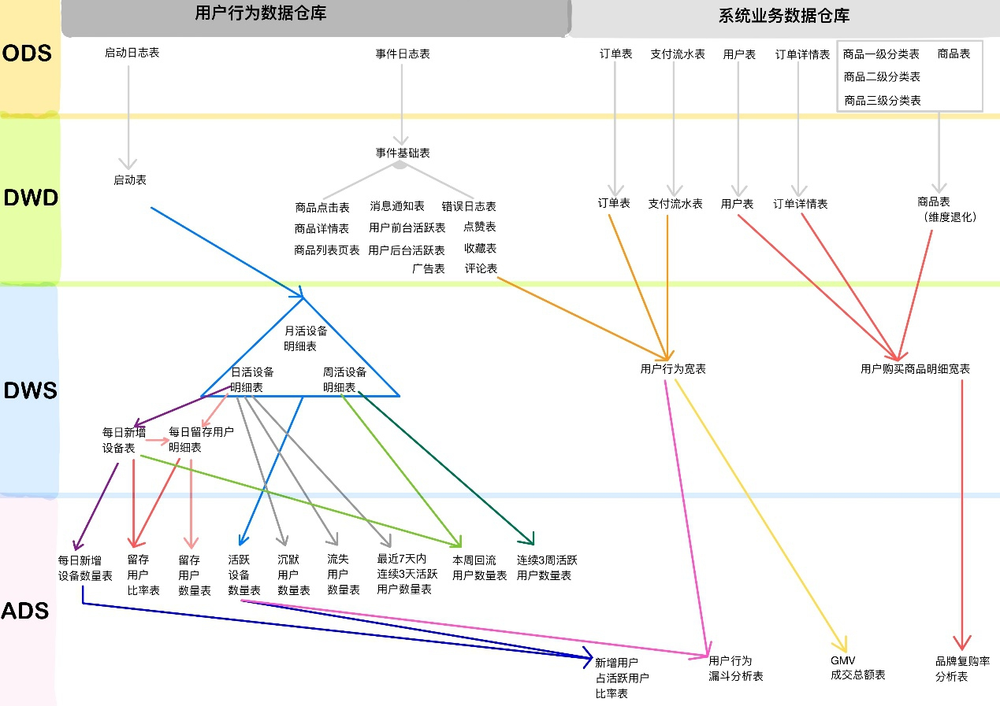

# 项目总结

- 熟悉8张表的业务字段，每张表记住3-5个字段


## 数仓理论

- 表的分类：实体表、维度表、事务型事实表、周期型事实表
- 表的同步策略
  - 实体表（全量）
  - 维度表（全量）
  - 事务型事实表（增量）
  - 周期型事实表（新增和变化、拉链表）
- 范式理论
  - 一范式原则：属性不可切割
  - 二范式原则：不能存在部分函数依赖
  - 三范式原则：不能存在传递函数依赖；
- 数仓维度建模模型
  - 星型模型，维度一层
  - 雪花模型，维度多层
  - 星座模型，多个事实表
  - 性能优先选择星型模型，灵活优先选择雪花模型
  - 企业中星型模型多一些


## 需求指标分析

- GMV：一段时间内的网站成交金额（包括付款和未付款）

- 计算：基于用户行为宽表，对订单总金额进行sum

- 转化率：（先分别计算分子和分母，再相除）

  - 新增用户占活跃用户的比率

  ```sql
  cast(sum( uc.nmc)/sum( uc.dc)*100 as decimal(10,2))  new_m_ratio
  ```

  - 下单人数占活跃用户的比率

  ```sql
  sum(if(order_count>0,1,0)) order_count
  cast(ua.order_count/uv.day_count*100 as  decimal(10,2)) visitor2order_convert_ratio
  ```

  - 支付人数占下单人数的比率

  ```sql
  sum(if(payment_count>0,1,0)) payment_count
  cast(ua.payment_count/ua.order_count*100 as  decimal(10,2)) order2payment_convert_ratio
  ```

  - 复购率：（先分别计算分子和分母，再相除）

  ```sql
  sum(if(mn.order_count>=1,1,0)) buycount,
  sum(if(mn.order_count>=2,1,0)) buyTwiceLast,
  sum(if(mn.order_count>=2,1,0))/sum( if(mn.order_count>=1,1,0)) buyTwiceLastRatio,
  sum(if(mn.order_count>=3,1,0)) buy3timeLast,
  sum(if(mn.order_count>=3,1,0))/sum( if(mn.order_count>=1,1,0)) buy3timeLastRatio ,
  ```


## 拉链表

- 通过关系型数据库的create time和operation time获取数据的新增和变化。
- 用临时拉链表解决Hive了中数据不能更新的问题


## Azkaban

- 每天集群运行多少job?
- 多个指标（200）*6=1200（1000-2000个job）
- 每天集群运行多少个task? 1000*（5-8）=5000多个
- 任务挂了怎么办？运行成功或者失败都会发邮件


## 项目中的表关系

