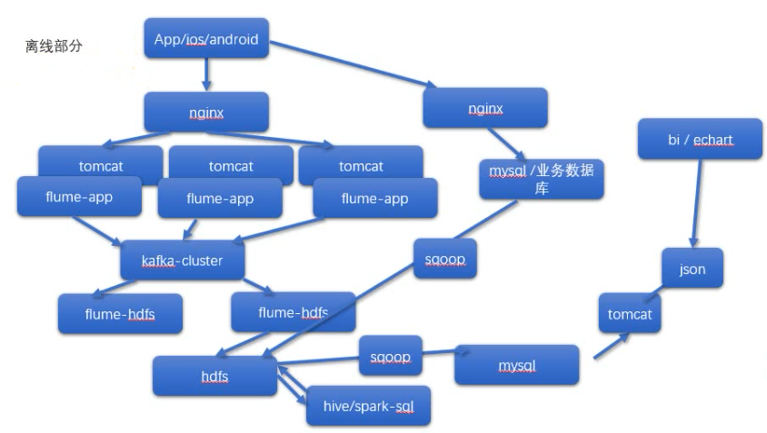
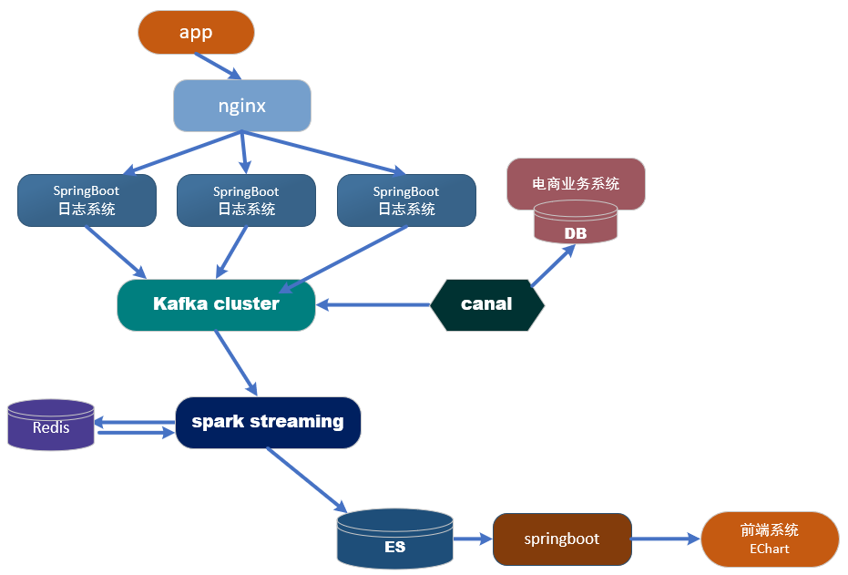
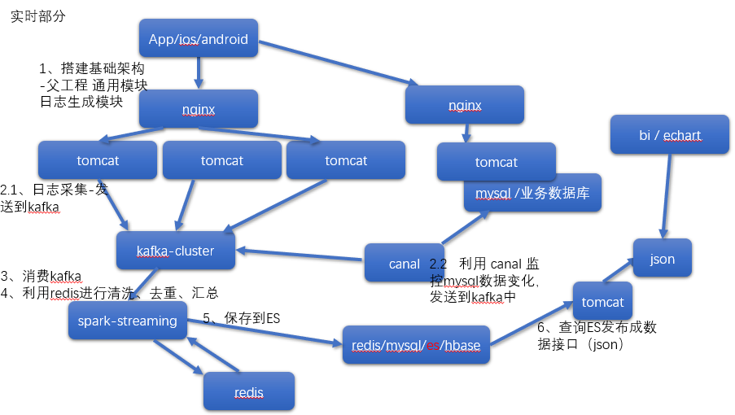
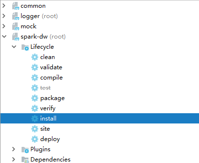

# 概述


## 特点

- 离线需求
  - 一般是根据前一日的数据生成报表等数据，虽然统计指标、报表繁多，但是对时效性不敏感
- 实时需求
  - 主要侧重于对当日数据的实时监控，通常业务逻辑相对离线需求简单一下，统计指标也少一些，但是更注重数据的时效性，以及用户的交互性


## 需求

- 当日活跃用户及分时趋势图，昨日对比图
  - 当日数据对比
  - 来源于日志
- 当日新增用户及分时趋势图，昨日对比图
  - 全局数据对比
  - 来源于数据库
- 当日交易额及分时趋势图，昨日对比图
  - 来源于数据库
- 当日订单数及分时趋势图，昨日对比图
  - 来源于数据库


## 架构


### 离线框架




### 实时框架



- 数据的操作在spark streaming中处理完成后放入redis，后端从redis中获取结果
- 数据简单的操作在spark streaming中形成一个明细表，放入ES中，后端从ES中查询展示（通用）




# 搭建工程


## 父工程


### pom

```xml
<?xml version="1.0" encoding="UTF-8"?>
<project xmlns="http://maven.apache.org/POM/4.0.0"
         xmlns:xsi="http://www.w3.org/2001/XMLSchema-instance"
         xsi:schemaLocation="http://maven.apache.org/POM/4.0.0 http://maven.apache.org/xsd/maven-4.0.0.xsd">
    <modelVersion>4.0.0</modelVersion>

    <groupId>com.stt.spark.dw</groupId>
    <artifactId>spark-dw</artifactId>
    <packaging>pom</packaging>
    <version>1.0-SNAPSHOT</version>
    <modules>
        <module>mock</module>
        <module>common</module>
    </modules>

    <parent>
        <groupId>org.springframework.boot</groupId>
        <artifactId>spring-boot-starter-parent</artifactId>
        <version>1.5.10.RELEASE</version>
        <relativePath/> 
    </parent>

    <properties>
        <spark.version>2.1.1</spark.version>
        <scala.version>2.11.8</scala.version>
        <log4j.version>1.2.17</log4j.version>
        <slf4j.version>1.7.22</slf4j.version>

        <fastjson.version>1.2.47</fastjson.version>
        <httpclient.version>4.5.5</httpclient.version>
        <httpmime.version>4.3.6</httpmime.version>

        <project.build.sourceEncoding>UTF-8</project.build.sourceEncoding>
        <project.reporting.outputEncoding>UTF-8</project.reporting.outputEncoding>
        <java.version>1.8</java.version>
    </properties>

    <dependencies>
        <!--此处放日志包，所有项目都要引用 所有子项目的日志框架 -->
        <dependency>
            <groupId>org.slf4j</groupId>
            <artifactId>jcl-over-slf4j</artifactId>
            <version>${slf4j.version}</version>
        </dependency>
        <dependency>
            <groupId>org.slf4j</groupId>
            <artifactId>slf4j-api</artifactId>
            <version>${slf4j.version}</version>
        </dependency>
        <dependency>
            <groupId>org.slf4j</groupId>
            <artifactId>slf4j-log4j12</artifactId>
            <version>${slf4j.version}</version>
        </dependency>
        <!-- 具体的日志实现 -->
        <dependency>
            <groupId>log4j</groupId>
            <artifactId>log4j</artifactId>
            <version>${log4j.version}</version>
        </dependency>
    </dependencies>

    <dependencyManagement>
        <dependencies>
            <dependency>
                <groupId>org.apache.httpcomponents</groupId>
                <artifactId>httpclient</artifactId>
                <version>${httpclient.version}</version>
            </dependency>
            <dependency>
                <groupId>org.apache.httpcomponents</groupId>
                <artifactId>httpmime</artifactId>
                <version>${httpmime.version}</version>
            </dependency>

            <dependency>
                <groupId>com.alibaba</groupId>
                <artifactId>fastjson</artifactId>
                <version>${fastjson.version}</version>
            </dependency>

            <dependency>
                <groupId>org.apache.spark</groupId>
                <artifactId>spark-core_2.11</artifactId>
                <version>${spark.version}</version>
            </dependency>

            <dependency>
                <groupId>org.apache.spark</groupId>
                <artifactId>spark-hive_2.11</artifactId>
                <version>${spark.version}</version>
            </dependency>

            <dependency>
                <groupId>org.apache.spark</groupId>
                <artifactId>spark-sql_2.11</artifactId>
                <version>${spark.version}</version>
            </dependency>

            <dependency>
                <groupId>org.apache.spark</groupId>
                <artifactId>spark-streaming_2.11</artifactId>
                <version>${spark.version}</version>
            </dependency>

            <dependency>
                <groupId>org.apache.spark</groupId>
                <artifactId>spark-streaming-kafka-0-10_2.11</artifactId>
                <version>${spark.version}</version>
            </dependency>
        </dependencies>
    </dependencyManagement>
</project>
```


## 通用模块 common


### pom

```xml
<?xml version="1.0" encoding="UTF-8"?>
<project xmlns="http://maven.apache.org/POM/4.0.0"
         xmlns:xsi="http://www.w3.org/2001/XMLSchema-instance"
         xsi:schemaLocation="http://maven.apache.org/POM/4.0.0 http://maven.apache.org/xsd/maven-4.0.0.xsd">
    <modelVersion>4.0.0</modelVersion>

    <parent>
        <groupId>com.stt.spark.dw</groupId>
        <artifactId>spark-dw</artifactId>
        <version>1.0-SNAPSHOT</version>
    </parent>

    <artifactId>common</artifactId>

    <dependencies>
        <dependency>
            <groupId>com.alibaba</groupId>
            <artifactId>fastjson</artifactId>
        </dependency>

        <dependency>
            <groupId>org.apache.httpcomponents</groupId>
            <artifactId>httpclient</artifactId>
        </dependency>
        <dependency>
            <groupId>org.apache.httpcomponents</groupId>
            <artifactId>httpmime</artifactId>
        </dependency>
    </dependencies>
</project>
```


### 公用字段

```java
package com.stt.spark.dw;

public class GmallConstant {

    // kafka主题
    // 日志主题
    public static final String TOPIC_STARTUP="GMALL_STARTUP";
    // 事件主题
    public static final String TOPIC_EVENT="GMALL_EVENT";

    public static final String TOPIC_ORDER="GMALL_ORDER";

    public static final String ES_INDEX_DAU="gmall_dau";

    public static final String ES_INDEX_ORDER="gmall_new_order";

    public static final String ES_INDEX_SALE="gmall_sale_detail";

    public static final String ES_DEFAULT_TYPE="_doc";
}
```


## 模拟数据 mock


### pom

```xml
<?xml version="1.0" encoding="UTF-8"?>
<project xmlns="http://maven.apache.org/POM/4.0.0"
         xmlns:xsi="http://www.w3.org/2001/XMLSchema-instance"
         xsi:schemaLocation="http://maven.apache.org/POM/4.0.0 http://maven.apache.org/xsd/maven-4.0.0.xsd">
    <parent>
        <groupId>com.stt.spark.dw</groupId>
        <artifactId>spark-dw</artifactId>
        <version>1.0-SNAPSHOT</version>
    </parent>
    <artifactId>mock</artifactId>
    <modelVersion>4.0.0</modelVersion>
    
    <dependencies>
        <dependency>
            <groupId>com.stt.spark.dw</groupId>
            <artifactId>common</artifactId>
            <version>1.0-SNAPSHOT</version>
        </dependency>
    </dependencies>
</project>
```


### 工具类


#### RandomDate

- 随机日期

```java
package com.stt.spark.util;

import java.util.Date;
import java.util.Random;

public class RandomDate {
    Long logDateTime =0L;//
    int maxTimeStep=0 ;

    public RandomDate (Date startDate , Date endDate, int num) {
        Long avgStepTime = (endDate.getTime()- startDate.getTime())/num;
        this.maxTimeStep=avgStepTime.intValue()*2;
        this.logDateTime=startDate.getTime();
    }

    public Date getRandomDate() {
        int  timeStep = new Random().nextInt(maxTimeStep);
        logDateTime = logDateTime+timeStep;
        return new Date( logDateTime);
    }
}
```


#### RandomNum

- 随机数

```java
package com.stt.spark.util;

import java.util.Random;

public class RandomNum {
    public static final  int getRandInt(int fromNum,int toNum){
        return  fromNum+ new Random().nextInt(toNum-fromNum+1);
    }
}
```


#### RandomOptionGroup

- 按照比例随机生成相应的内容

```java
package com.stt.spark.util;

import java.util.ArrayList;
import java.util.List;
import java.util.Random;

public class RandomOptionGroup<T> {

    int totalWeight=0;

    List<RandomOpt> optList=new ArrayList();

    public   RandomOptionGroup(RandomOpt<T>... opts) {
        for (RandomOpt opt : opts) {
            totalWeight+=opt.getWeight();
            for (int i = 0; i <opt.getWeight() ; i++) {
                optList.add(opt);
            }

        }
    }

    public RandomOpt<T> getRandomOpt() {
        int i = new Random().nextInt(totalWeight);
        return optList.get(i);
    }

    public static void main(String[] args) {
        RandomOpt[] opts= {new RandomOpt("zhang3",20),new RandomOpt("li4",30),new RandomOpt("wang5",50)};
        RandomOptionGroup randomOptionGroup = new RandomOptionGroup(opts);
        for (int i = 0; i <10 ; i++) {
            System.out.println(randomOptionGroup.getRandomOpt().getValue());
        }

    }

  public  static class RandomOpt<T>{
        T value ;
        int weight;

        public RandomOpt(T value, int weight ){
            this.value=value ;
            this.weight=weight;
        }

        public T getValue() {
            return value;
        }

        public int getWeight() {
            return weight;
        }
    }
}
```


### 日志发送

- 发送到采集系统的web端口

```java
package com.stt.spark.dw;


import com.alibaba.fastjson.JSON;
import com.alibaba.fastjson.JSONObject;
import com.stt.spark.util.RandomDate;
import com.stt.spark.util.RandomNum;
import com.stt.spark.util.RandomOptionGroup;
import com.stt.spark.util.RandomOptionGroup.RandomOpt;

import java.io.OutputStream;
import java.net.HttpURLConnection;
import java.net.URL;
import java.text.ParseException;
import java.text.SimpleDateFormat;
import java.util.Date;
import java.util.Random;

public class JsonMocker {

    int startupNum = 100000;
    int eventNum = 200000;
    Date startTime = null;
    Date endTime = null;
    RandomDate logDateUtil = null;
    String appId = "gmall";

    RandomOptionGroup<String> osOptionGroup =
            new RandomOptionGroup(
            new RandomOpt[]{new RandomOpt("ios", 3), new RandomOpt("andriod", 7)});

    RandomOptionGroup<String> areaOptionGroup =
            new RandomOptionGroup(new RandomOpt[]{new RandomOpt("beijing", 10),
            new RandomOpt("shanghai", 10), new RandomOpt("guangdong", 20), new RandomOpt("hebei", 5),
            new RandomOpt("heilongjiang", 5), new RandomOpt("shandong", 5), new RandomOpt("tianjin", 5),
            new RandomOpt("shan3xi", 5), new RandomOpt("shan1xi", 5), new RandomOpt("sichuan", 5)
    });

    RandomOptionGroup<String> vsOptionGroup =
            new RandomOptionGroup(new RandomOpt[]{new RandomOpt("1.2.0", 50), new RandomOpt("1.1.2", 15),
            new RandomOpt("1.1.3", 30),
            new RandomOpt("1.1.1", 5)
    });

    RandomOptionGroup<String> eventOptionGroup =
            new RandomOptionGroup(new RandomOpt[]{new RandomOpt("addFavor", 10), new RandomOpt("addComment", 30),
            new RandomOpt("addCart", 20), new RandomOpt("clickItem", 40)
    });

    RandomOptionGroup<String> channelOptionGroup =
            new RandomOptionGroup(new RandomOpt[] {new RandomOpt("xiaomi", 10), new RandomOpt("huawei", 20),
            new RandomOpt("wandoujia", 30), new RandomOpt("360", 20), new RandomOpt("tencent", 20)
            , new RandomOpt("baidu", 10), new RandomOpt("website", 10)
    });

    RandomOptionGroup<Boolean> isQuitGroup =
            new RandomOptionGroup(new RandomOpt[] {new RandomOpt(true, 20), new RandomOpt(false, 80)});

    public JsonMocker() {}

    public JsonMocker(String startTimeString, String endTimeString, int startupNum, int eventNum) {
        try {
            startTime = new SimpleDateFormat("yyyy-MM-dd").parse(startTimeString);
            endTime = new SimpleDateFormat("yyyy-MM-dd").parse(endTimeString);
        } catch (ParseException e) {
            e.printStackTrace();
        }
        logDateUtil = new RandomDate(startTime, endTime, startupNum + eventNum);
    }

    String initEventLog(String startLogJson) {
            /*`type` string   COMMENT '日志类型',
             `mid` string COMMENT '设备唯一 表示',
            `uid` string COMMENT '用户标识',
            `os` string COMMENT '操作系统',
            `appid` string COMMENT '应用id',
            `area` string COMMENT '地区' ,
            `evid` string COMMENT '事件id',
            `pgid` string COMMENT '当前页',
            `npgid` string COMMENT '跳转页',
            `itemid` string COMMENT '商品编号',
            `ts` bigint COMMENT '时间',*/

        JSONObject startLog = JSON.parseObject(startLogJson);
        String mid = startLog.getString("mid");
        String uid = startLog.getString("uid");
        String os = startLog.getString("os");
        String appid = this.appId;
        String area = startLog.getString("area");
        String evid = eventOptionGroup.getRandomOpt().getValue();
        int pgid = new Random().nextInt(50) + 1;
        int npgid = new Random().nextInt(50) + 1;
        int itemid = new Random().nextInt(50);
        //  long ts= logDateUtil.getRandomDate().getTime();

        JSONObject jsonObject = new JSONObject();
        jsonObject.put("type", "event");
        jsonObject.put("mid", mid);
        jsonObject.put("uid", uid);
        jsonObject.put("os", os);
        jsonObject.put("appid", appid);
        jsonObject.put("area", area);
        jsonObject.put("evid", evid);
        jsonObject.put("pgid", pgid);
        jsonObject.put("npgid", npgid);
        jsonObject.put("itemid", itemid);
        return jsonObject.toJSONString();
    }


    String initStartupLog() {
            /*`type` string   COMMENT '日志类型',
             `mid` string COMMENT '设备唯一标识',
      `uid` string COMMENT '用户标识',
      `os` string COMMENT '操作系统',
      `appId` string COMMENT '应用id', ,
     `vs` string COMMENT '版本号',
     `ts` bigint COMMENT '启动时间', ,
     `area` string COMMENT '城市' */
        String mid = "mid_" + RandomNum.getRandInt(5000, 5000);
        String uid = "" + RandomNum.getRandInt(1, 500);
        String os = osOptionGroup.getRandomOpt().getValue();
        String appid = this.appId;
        String area = areaOptionGroup.getRandomOpt().getValue();
        String vs = vsOptionGroup.getRandomOpt().getValue();
        //long ts= logDateUtil.getRandomDate().getTime();
        String ch = os.equals("ios") ? "appstore" : channelOptionGroup.getRandomOpt().getValue();


        JSONObject jsonObject = new JSONObject();
        jsonObject.put("type", "startup");
        jsonObject.put("mid", mid);
        jsonObject.put("uid", uid);
        jsonObject.put("os", os);
        jsonObject.put("appid", appid);
        jsonObject.put("area", area);
        jsonObject.put("ch", ch);
        jsonObject.put("vs", vs);
        return jsonObject.toJSONString();
    }

    public void sendLog(String log) {
        sendLogStream(log);
    }

    public static void sendLogStream(String log) {
        try {
            //不同的日志类型对应不同的URL
            URL url = new URL("http://logserver/log");

            HttpURLConnection conn = (HttpURLConnection) url.openConnection();
            //设置请求方式为post
            conn.setRequestMethod("POST");

            //时间头用来供server进行时钟校对的
            conn.setRequestProperty("clientTime", System.currentTimeMillis() + "");
            //允许上传数据
            conn.setDoOutput(true);
            //设置请求的头信息,设置内容类型为JSON
            conn.setRequestProperty("Content-Type", "application/x-www-form-urlencoded");

            System.out.println("upload" + log);

            //输出流
            OutputStream out = conn.getOutputStream();
            out.write(("log=" + log).getBytes());
            out.flush();
            out.close();
            int code = conn.getResponseCode();
            System.out.println(code);
        } catch (Exception e) {
            e.printStackTrace();
        }
    }

    public static void main(String[] args) {
        JsonMocker jsonMocker = new JsonMocker();
        jsonMocker.startupNum = 1000000;
        for (int i = 0; i < jsonMocker.startupNum; i++) {
            String startupLog = jsonMocker.initStartupLog();
            jsonMocker.sendLog(startupLog);
            while (!jsonMocker.isQuitGroup.getRandomOpt().getValue()) {
                String eventLog = jsonMocker.initEventLog(startupLog);
                jsonMocker.sendLog(eventLog);
                try {
                    Thread.sleep(50);
                } catch (InterruptedException e) {
                    e.printStackTrace();
                }
            }
        }
    }
}
```


## 关于日志埋点


### 周期性埋点

- 把一段时间的日志，积累起来，周期性发送到后台
- 对日志后台收集系统压力小
- 非实时


### 直接发送

- 实时效果好
- 后台收集压力大


## 日志采集服务

- 用于采集app，ios发送的日志数据信息（mock模块模拟数据信息）
- 收取数据后发送到kafka


### pom

```xml
<?xml version="1.0" encoding="UTF-8"?>
<project xmlns="http://maven.apache.org/POM/4.0.0" xmlns:xsi="http://www.w3.org/2001/XMLSchema-instance"
	xsi:schemaLocation="http://maven.apache.org/POM/4.0.0 https://maven.apache.org/xsd/maven-4.0.0.xsd">
	<modelVersion>4.0.0</modelVersion>
	<parent>
		<groupId>org.springframework.boot</groupId>
		<artifactId>spring-boot-starter-parent</artifactId>
		<version>2.2.1.RELEASE</version>
		<relativePath/> <!-- lookup parent from repository -->
	</parent>
	<groupId>com.stt.spark.dw</groupId>
	<artifactId>logger</artifactId>
	<version>0.0.1-SNAPSHOT</version>
	<name>logger</name>
	<description>Demo project for Spring Boot</description>

	<properties>
		<java.version>1.8</java.version>
	</properties>

	<dependencies>

		<dependency>
			<groupId>com.stt.spark.dw</groupId>
			<artifactId>common</artifactId>
			<version>1.0-SNAPSHOT</version>
		</dependency>

		<dependency>
			<groupId>org.springframework.boot</groupId>
			<artifactId>spring-boot-starter-web</artifactId>
		</dependency>

		<dependency>
			<groupId>org.springframework.boot</groupId>
			<artifactId>spring-boot-starter-test</artifactId>
			<scope>test</scope>
			<exclusions>
				<exclusion>
					<groupId>org.junit.vintage</groupId>
					<artifactId>junit-vintage-engine</artifactId>
				</exclusion>
			</exclusions>
		</dependency>

		<dependency>
			<groupId>commons-io</groupId>
			<artifactId>commons-io</artifactId>
			<version>2.4</version>
		</dependency>

		<!--不使用自带的 log 框架-->
		<dependency>
			<groupId>org.springframework.boot</groupId>
			<artifactId>spring-boot-starter</artifactId>
			<exclusions>
				<exclusion>
					<groupId>org.springframework.boot</groupId>
					<artifactId>spring-boot-starter-logging</artifactId>
				</exclusion>
			</exclusions>
		</dependency>

		<dependency>
			<groupId>org.springframework.boot</groupId>
			<artifactId>spring-boot-starter-log4j</artifactId>
			<version>1.3.8.RELEASE</version>
		</dependency>

		<dependency>
			<groupId>org.springframework.kafka</groupId>
			<artifactId>spring-kafka</artifactId>
		</dependency>

	</dependencies>

	<build>
		<plugins>
			<plugin>
				<groupId>org.springframework.boot</groupId>
				<artifactId>spring-boot-maven-plugin</artifactId>
			</plugin>
		</plugins>
	</build>

</project>
```


### application.properties

```properties
server.port=80

#============== kafka ===================
# 指定kafka 代理地址，可以多个
spring.kafka.bootstrap-servers=hadoop102:9092,hadoop103:9092,hadoop104:9092


# 指定消息key和消息体的编解码方式
spring.kafka.producer.key-serializer=org.apache.kafka.common.serialization.StringSerializer
spring.kafka.producer.value-serializer=org.apache.kafka.common.serialization.StringSerializer
```


### log4j.properties

```properties
log4j.rootLogger=info,stt.MyConsole

log4j.appender.stt.MyConsole=org.apache.log4j.ConsoleAppender
# 打印显示字体颜色 err红色， out黑色
log4j.appender.stt.MyConsole.target=System.err
log4j.appender.stt.MyConsole.layout=org.apache.log4j.PatternLayout
# c 表示class M 表示方法名 p 表示日志级别
log4j.appender.stt.MyConsole.layout.ConversionPattern=%d{yyyy-MM-dd HH:mm:ss} %10p (%c:%M) - %m%n

log4j.appender.stt.File=org.apache.log4j.DailyRollingFileAppender
log4j.appender.stt.File.file=log/app.log
log4j.appender.stt.File.DatePattern='.'yyyy-MM-dd
# 日志打印的布局
log4j.appender.stt.File.layout=org.apache.log4j.PatternLayout
# m 表示内容 n 表示换行
log4j.appender.stt.File.layout.ConversionPattern=%m%n

# 第一个参数，日志级别
# 后面的参数是输出的appender
log4j.logger.com.stt.spark.dw.logger.controller.LogJsonController=info,stt.File,stt.MyConsole
# 级别 从低到高
# trace debug  info  warn error fatal
```


### controller

```java
package com.stt.spark.dw.logger.controller;

import com.alibaba.fastjson.JSON;
import com.alibaba.fastjson.JSONObject;
import com.stt.spark.dw.GmallConstant;
import org.slf4j.Logger;
import org.slf4j.LoggerFactory;
import org.springframework.beans.factory.annotation.Autowired;
import org.springframework.kafka.core.KafkaTemplate;
import org.springframework.web.bind.annotation.PostMapping;
import org.springframework.web.bind.annotation.RequestParam;
import org.springframework.web.bind.annotation.RestController;

import java.util.Random;

@RestController
public class LogJsonController {
    private static final Logger logger = LoggerFactory.getLogger(LogJsonController.class) ;
    @Autowired
    private KafkaTemplate<String, String> kafkaTemplate;

    @PostMapping("/log")
    public void shipLog(@RequestParam("log") String log){

        JSONObject logJsonObj = JSON.parseObject(log);

        int randomInt = new Random().nextInt(3600 * 1000 * 5);
        logJsonObj.put("ts",System.currentTimeMillis()+randomInt);

        if("startup".equals(logJsonObj.getString("type"))){
            kafkaTemplate.send(GmallConstant.TOPIC_STARTUP,logJsonObj.toJSONString());
        }else {
            kafkaTemplate.send(GmallConstant.TOPIC_EVENT,logJsonObj.toJSONString());
        }
        String logNew = logJsonObj.toJSONString();
        logger.info(logNew);
    }
}
```


### 测试

- 启动kafka
- 启动消费者

```bash
/opt/module/kafka/bin/kafka-console-consumer.sh --bootstrap-server hadoop102:9092,hadoop103:9092,hadoop104:9092 --topic GMALL_STARTUP --from-beginning 
```

- 本地测试
  - 直接启动日志采集服务
  - 启动mock生成数据

- linux测试

  - 上传jar包
  - 启动日志采集服务

  ```bash
  java -jar logger.jar --server.port=9099 >/dev/null  2>&1  &
  ```

  - 注意：使用非root用户，不能使用1024以下端口启动服务，需要授权【查看搭建nginx 中的赋予权限】

  - 启动mock生成数据
  
  

### 关于打包

- 需要达成jar包上传到linux系统中
- 注意：打包失败缺少common的jar包时，需要从root项目进行install才可

 


## 搭建nginx

- 安装linux的依赖包

```bash
sudo yum -y install  openssl openssl-devel pcre pcre-devel  zlib zlib-devel gcc gcc-c++
```

- 解压

```bash
[ttshe@hadoop102 software]$ tar -zxvf nginx-1.12.2.tar.gz -C /opt/module/
```

- 指定安装路径
  - 如果不指定，则安装到/usr/local/nginx下

```bash
[ttshe@hadoop102 nginx-1.12.2]$ ./configure --prefix=/opt/module/nginx
```

- 编译同时安装

```bash
[ttshe@hadoop102 nginx-1.12.2]$ make & make install
[ttshe@hadoop102 nginx]$ ll
总用量 16
drwxrwxr-x 2 ttshe ttshe 4096 11月 16 06:49 conf
drwxr-xr-x 2 ttshe ttshe 4096 11月 16 06:49 html
drwxrwxr-x 2 ttshe ttshe 4096 11月 16 06:49 logs
drwxrwxr-x 2 ttshe ttshe 4096 11月 16 06:49 sbin
[ttshe@hadoop102 nginx]$ pwd
/opt/module/nginx
```

- 启动

```bash
[ttshe@hadoop102 sbin]$ ./nginx 
nginx: [emerg] bind() to 0.0.0.0:80 failed (13: Permission denied)xxxxxxxxxx3 1/usr/local/ngi[ttshe@hadoop102 sbin]$ ./nginx 2nginx: [emerg] bind() to 0.0.0.0:80 failed (13: Permission denied)3nx/sbin目录下执行  ./nginxbash
```

- 启动报错，由于在非root下，没有使用1024以下端口的权利，需要给定权限

- 关闭

```bash
./nginx  -s  stop 
```

- 重新加载

```bash
./nginx -s reload
```

- 检查进程

```bash
# 查看端口80是否监听
[ttshe@hadoop102 sbin]$ netstat -anp | more
# 查看进程
[ttshe@hadoop102 sbin]$ ps -ef | grep nginx
ttshe     55140      1  0 06:54 ?        00:00:00 nginx: master process ./nginx
ttshe     55141  55140  0 06:54 ?        00:00:00 nginx: worker process # 有一个worker进程，可配置多个
ttshe     55215  48524  0 06:57 pts/2    00:00:00 grep nginx
          PID     PPID
```

- 访问页面http://hadoop102/


### 赋予权限

```bash
sudo setcap cap_net_bind_service=+eip /opt/module/nginx/sbin/nginx
```

nginx一般不用root账户启动

​	root账户可以使用1024以下的端口

命令: 允许非管理员可以使用1024以下端口


### 负载均衡策略

```bash
# 1、轮询（默认）
# 每个请求按时间顺序逐一分配到不同的后端服务器，如果后端服务器down掉，能自动剔除。

# 2、指定权重
# 指定轮询几率，weight和访问比率成正比，用于后端服务器性能不均的情况。

#3、IP绑定 ip_hash
# 每个请求按访问ip的hash结果分配，这样每个访客固定访问一个后端服务器，可以解决session的问题。

#4、备机方式 backup
# 正常情况不访问设定为backup的备机，只有当所有非备机全都宕机的情况下，服务才会进备机。

#5、fair（第三方）
#按后端服务器的响应时间来分配请求，响应时间短的优先分配。   

#6、url_hash（第三方）
#按访问url的hash结果来分配请求，使每个url定向到同一个后端服务器，后端服务器为缓存时比较有效。
```


### 修改配置

```bash
[ttshe@hadoop102 conf]$ vim /opt/module/nginx/conf/nginx.conf
```

- 增加如下配置

```config
http{
   ..........
    upstream mylogserver{
      server    hadoop102:9099 weight=1;  
      server    hadoop103:9099 weight=1;
      server    hadoop104:9099 weight=1;
    }
    server {
        listen       80;
        server_name  hadoop102;
 
        location / {
            root   html;
            index  index.html index.htm;
            proxy_pass http://mylogserver;
            proxy_connect_timeout 10;
 
         }
   ..........
}
```


### 测试

- 在hadoop102，hadoop103，hadoop104上分别启动日志收集服务
- 在nginx上配置路由，轮询转发到这3台服务
- 注意nginx的reload重启
- 在window端，使用mock程序发送模拟数据给nginx服务
- 查看kafka消费端是否有信息接收
- 查看各个节点的log/app.log是否有日志生成


## 群起脚本

- 使用脚本控制日志收集服务的开启和关闭

```bash
[ttshe@hadoop102 bin]$ pwd
/home/ttshe/bin
[ttshe@hadoop102 bin]$ vim lg-spark-dw.sh
[ttshe@hadoop102 bin]$ chmod 777 lg-spark-dw.sh 
```


```bash
#!/bin/bash
JAVA_BIN=$JAVA_HOME/bin/java
PROJECT=/opt/software
APPNAME=logger.jar
SERVER_PORT=9099
 
case $1 in
 "start")
   {
    for i in hadoop102 hadoop103 hadoop104
    do
     echo "========启动日志服务: $i==============="
    ssh $i  "$JAVA_BIN -Xms32m -Xmx64m  -jar $PROJECT/$APPNAME --server.port=$SERVER_PORT >/dev/null 2>&1  &"
    done
     echo "========启动NGINX==============="
    /opt/module/nginx/sbin/nginx
  };;
  "stop")
  { 
     echo "========关闭 NGINX==============="
    /opt/module/nginx/sbin/nginx  -s stop
    for i in  hadoop102 hadoop103 hadoop104
    do
     echo "========关闭日志服务: $i==============="
     ssh $i "ps -ef|grep $PROJECT/$APPNAME |grep -v grep|awk '{print \$2}'|xargs kill" >/dev/null 2>&1
    done
  };;
   esac
```

- grep -v grep 表示去除grep命令的进程


