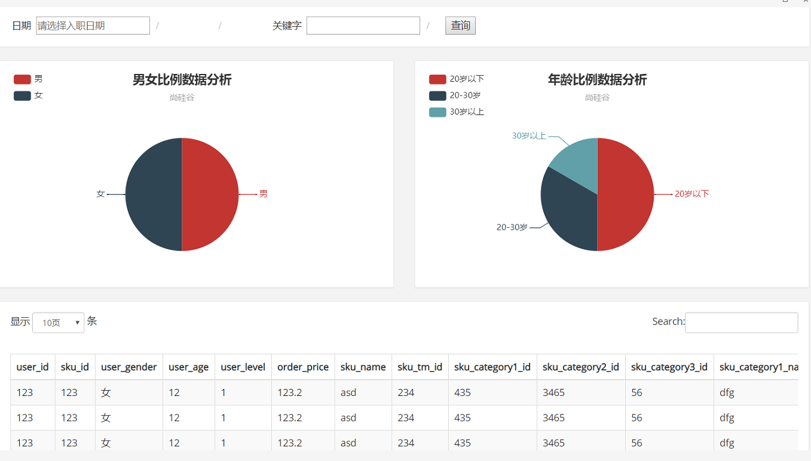

# 日活DAU

- 日活跃用户数量
- DAU(Daily Active User)日活跃用户数量
- 常用于反映网站、互联网应用或网络游戏的运营情况
- DAU通常统计一日（统计日）之内，登录或使用了某个产品的用户数（去除重复登录的用户）
- 这与流量统计工具里的访客（UV）概念相似


## 实时处理模块

- spark-streaming读取kafka数据进行处理
- 需要kafka，redis，es
- 注意安装redis 和 es集群 


### 思路

- 消费Kafka
- 过滤当日已经进入的日活设备
  - 利用redis
- 把每批新增的当日日活信息保存到ES中
- 从ES中查出数据，发布成数据接口


### pom

```xml
<?xml version="1.0" encoding="UTF-8"?>
<project xmlns="http://maven.apache.org/POM/4.0.0"
         xmlns:xsi="http://www.w3.org/2001/XMLSchema-instance"
         xsi:schemaLocation="http://maven.apache.org/POM/4.0.0 http://maven.apache.org/xsd/maven-4.0.0.xsd">
    <parent>
        <artifactId>spark-dw</artifactId>
        <groupId>com.stt.spark.dw</groupId>
        <version>1.0-SNAPSHOT</version>
    </parent>
    <modelVersion>4.0.0</modelVersion>

    <artifactId>realtime</artifactId>

    <dependencies>
        <dependency>
            <groupId>com.stt.spark.dw</groupId>
            <artifactId>common</artifactId>
            <version>1.0-SNAPSHOT</version>
        </dependency>

        <dependency>
            <groupId>org.apache.spark</groupId>
            <artifactId>spark-core_2.11</artifactId>
        </dependency>
        <dependency>
            <groupId>org.apache.spark</groupId>
            <artifactId>spark-streaming_2.11</artifactId>
        </dependency>
        <dependency>
            <groupId>org.apache.kafka</groupId>
            <artifactId>kafka-clients</artifactId>
            <version>0.10.2.1</version>
        </dependency>
        <dependency>
            <groupId>org.apache.spark</groupId>
            <artifactId>spark-streaming-kafka-0-10_2.11</artifactId>
        </dependency>

        <dependency>
            <groupId>redis.clients</groupId>
            <artifactId>jedis</artifactId>
            <version>2.9.0</version>
        </dependency>

        <dependency>
            <groupId>io.searchbox</groupId>
            <artifactId>jest</artifactId>
            <version>5.3.3</version>
        </dependency>

        <dependency>
            <groupId>net.java.dev.jna</groupId>
            <artifactId>jna</artifactId>
            <version>4.5.2</version>
        </dependency>

        <dependency>
            <groupId>org.codehaus.janino</groupId>
            <artifactId>commons-compiler</artifactId>
            <version>2.7.8</version>
        </dependency>

    </dependencies>
    <build>
        <plugins>
            <!-- 该插件用于将Scala代码编译成class文件 -->
            <plugin>
                <groupId>net.alchim31.maven</groupId>
                <artifactId>scala-maven-plugin</artifactId>
                <version>3.2.2</version>
                <executions>
                    <execution>
                        <!-- 声明绑定到maven的compile阶段 -->
                        <goals>
                            <goal>compile</goal>
                            <goal>testCompile</goal>
                        </goals>
                    </execution>
                </executions>
            </plugin>
            <!-- 用于项目的打包插件 -->
            <plugin>
                <groupId>org.apache.maven.plugins</groupId>
                <artifactId>maven-assembly-plugin</artifactId>
                <version>3.0.0</version>
                <executions>
                    <execution>
                        <id>make-assembly</id>
                        <phase>package</phase>
                        <goals>
                            <goal>single</goal>
                        </goals>
                    </execution>
                </executions>
            </plugin>
        </plugins>
    </build>
</project>
```


### 配置

- config.properties

```properties
# Kafka配置
kafka.broker.list=hadoop102:9092,hadoop103:9092,hadoop104:9092

# Redis配置
redis.host=hadoop102
redis.port=6379
```


### 工具类

- MyKafkaUtil

```scala
package com.stt.spark.dw.realtime

import org.apache.kafka.common.serialization.StringDeserializer
import java.util.Properties

import org.apache.kafka.clients.consumer.ConsumerRecord
import org.apache.spark.streaming.StreamingContext
import org.apache.spark.streaming.dstream.InputDStream
import org.apache.spark.streaming.kafka010.{ConsumerStrategies, KafkaUtils, LocationStrategies}

object MyKafkaUtil {

  private val properties: Properties = PropertiesUtil.load("config.properties")
  val broker_list = properties.getProperty("kafka.broker.list")

  // kafka消费者配置
  val kafkaParam = Map(
    "bootstrap.servers" -> broker_list,//用于初始化链接到集群的地址
    "key.deserializer" -> classOf[StringDeserializer],
    "value.deserializer" -> classOf[StringDeserializer],
    //用于标识这个消费者属于哪个消费团体
    "group.id" -> "gmall_consumer_group",
    //如果没有初始化偏移量或者当前的偏移量不存在任何服务器上，可以使用这个配置属性
    //可以使用这个配置，latest自动重置偏移量为最新的偏移量
    "auto.offset.reset" -> "latest",
    //如果是true，则这个消费者的偏移量会在后台自动提交,但是kafka宕机容易丢失数据
    //如果是false，会需要手动维护kafka偏移量
    "enable.auto.commit" -> (true: java.lang.Boolean)
  )

  // 创建DStream，返回接收到的输入数据
  // LocationStrategies：根据给定的主题和集群地址创建consumer
  // LocationStrategies.PreferConsistent：持续的在所有Executor之间分配分区
  // ConsumerStrategies：选择如何在Driver和Executor上创建和配置Kafka Consumer
  // ConsumerStrategies.Subscribe：订阅一系列主题

  def getKafkaStream(topic: String,ssc:StreamingContext): InputDStream[ConsumerRecord[String,String]]={
    KafkaUtils.createDirectStream[String,String](
      ssc,
      LocationStrategies.PreferConsistent,
      ConsumerStrategies.Subscribe[String,String](Array(topic),
        kafkaParam))
  }
}
```

- PropertiesUtil

```scala
package com.stt.spark.dw.realtime

import java.io.InputStreamReader
import java.util.Properties

object PropertiesUtil {

    def main(args: Array[String]): Unit = {
        val properties: Properties = PropertiesUtil.load("config.properties")

        println(properties.getProperty("kafka.broker.list"))
    }

    def load(propertieName:String): Properties ={
        val prop=new Properties();
        prop.load(new InputStreamReader(Thread.currentThread().getContextClassLoader.getResourceAsStream(propertieName) , "UTF-8"))
        prop
    }
}
```


### 测试代码

- 测试连接是否成功，是否能从kafka读取数据

```scala
 package com.stt.spark.dw.realtime

import com.stt.spark.dw.GmallConstant
import com.stt.spark.dw.realtime.util.MyKafkaUtil
import org.apache.kafka.clients.consumer.ConsumerRecord
import org.apache.spark.SparkConf
import org.apache.spark.streaming.dstream.{DStream, InputDStream}
import org.apache.spark.streaming.{Seconds, StreamingContext}

object StartUpLogAppTest {

  def main(args: Array[String]): Unit = {
    val conf = new SparkConf().setAppName("StartUpLogApp").setMaster("local[*]")
    val ssc = new StreamingContext(conf,Seconds(5))
    val kafkaDStream: InputDStream[ConsumerRecord[String, String]] =
      MyKafkaUtil.getKafkaStream(GmallConstant.TOPIC_STARTUP,ssc)

    val valueDStream: DStream[String] = kafkaDStream.map(record =>{
      // 没有指定发送key，那么record.key()是空
        record.value()
    })
    // 执行collect行动算子开始获取数据
    valueDStream.foreachRDD(rdd=>{
      println(rdd.collect().mkString("\n"))
    })

    ssc.start()
    ssc.awaitTermination()
  }
}
```


### 添加用Redis进行DAU去重代码

- 对日志中的登录信息进行去重

```scala
package com.stt.spark.dw.realtime

import java.time.format.DateTimeFormatter
import java.time.{Instant, LocalDateTime, ZoneId}

import com.alibaba.fastjson.JSON
import com.stt.spark.dw.GmallConstant
import com.stt.spark.dw.realtime.bean.StartUpLog
import com.stt.spark.dw.realtime.util.{MyKafkaUtil, RedisUtil}
import org.apache.kafka.clients.consumer.ConsumerRecord
import org.apache.spark.SparkConf
import org.apache.spark.streaming.dstream.{DStream, InputDStream}
import org.apache.spark.streaming.{Seconds, StreamingContext}
import redis.clients.jedis.Jedis

object StartUpLogApp {

    def main(args: Array[String]): Unit = {
        val conf = new SparkConf().setAppName("StartUpLogApp").setMaster("local[*]")
        val ssc = new StreamingContext(conf,Seconds(5))
        val kafkaDStream: InputDStream[ConsumerRecord[String, String]] =
        MyKafkaUtil.getKafkaStream(GmallConstant.TOPIC_STARTUP,ssc)

        // 对kafka中的json数据进行转换为对象
        val startUpLogDStream: DStream[StartUpLog] = kafkaDStream.map(record => {
            val log: StartUpLog = JSON.parseObject(record.value(), classOf[StartUpLog])
            // 将ts时间转换为日常时间存储到ES中，由于ES中不能对字段进行函数操作，因此需要存储冗余转换数据
            val time =
            LocalDateTime.ofInstant(Instant.ofEpochMilli(log.ts), ZoneId.systemDefault())
            log.logHour = time.getHour.toString
            log.logHourMinute = time.getHour + ":" + time.getMinute
            log.logDate = time.format(DateTimeFormatter.ofPattern("yyyy-MM-dd"))
            log
        })


        // 方式1
        // 依据 redis中已有的当日访问用户进行过滤
        val startUpLogFilterDStream: DStream[StartUpLog] = startUpLogDStream.filter(log => {
            val client = RedisUtil.getJedisClient
            val flag = !client.sismember("dau:" + log.logDate, log.mid)
            client.close()
            flag
        })

        // 方式2
        // 进行优化，减少连接redis次数
        // 分析，需要查看应用场景，如果mid过多，set内元素过多，那么会造成每次redis查询结果传输负担重，造成redis阻塞
        // 此时还是使用第一种方式
        // transform由Driver固定周期执行一次
        //    val startUpLogFilterDStream: DStream[StartUpLog] = startUpLogDStream.transform(rdd => {
        //      println(s"filter before ${rdd.count()}")
        //      val client = RedisUtil.getJedisClient
        //      val time = LocalDateTime.now().format(DateTimeFormatter.ofPattern("yyyy-MM-dd"))
        //      val midSet = client.smembers("dau:" + time).toArray
        //      client.close()
        //      // 如果使用广播变量,每个Executor中一份，使用kryo序列化
        //      // 不使用广播变量，需要对set进行转换为array，使用java序列化，每个Executor读取到midSet之后从Driver中获取
        //      val filterRDD: RDD[StartUpLog] = rdd.filter(log => {
        //        !midSet.contains(log.mid)
        //      })
        //      println(s"filter after ${filterRDD.count()}")
        //      filterRDD
        //    })

        // 将当日访问数据写入到redis
        startUpLogFilterDStream.foreachRDD(rdd=>{
            rdd.foreachPartition(datas =>{
                val client: Jedis = RedisUtil.getJedisClient
                datas.foreach(log => {
                    val key = "dau:"+ log.logDate
                    client.sadd(key,log.mid)
                })
                client.close()
            })
        })

        // 将DAU数据保存到ES中

        ssc.start()
        ssc.awaitTermination()
    }
}
```


### 存储DAU到ES

- 搭建ES集群


#### ES索引结构设计

- 关于类型
  - text 支持分词
  - keyword 只能全部内容匹配

- 保存数据前定义mapping


#### 字段分类

- 所有字段分三类
  - 需要索引，也需要分词的
    - 如标题，商品名称，分类名称
    - "type":"text"
  - 需要索引，但不需要分词
    - 如类型id，日期，数目，年龄，各种id
    - "type":"keyword"
  - 都不需要的
    - 不会用于条件过滤的，经过脱敏的字段，如手机号
    - "index":false

- 第一类（需要索引，也需要分词的） 无
- 第二类  （需要索引，但不需要分词）
  - mid, uid,area,os ,ch ,vs,logDate,logHourMinute,ts
- 第三类  (都不需要建索引的)

```scala
case class Startup(mid:String,
                   uid:String,
                   appid:String,
                   area:String,
                   os:String,
                   ch:String,
                   logType:String,
                   vs:String,
                   var logDate:String,
                   var logHour:String,
                   var logHourMinute:String,
                   var ts:Long)
```


#### 建立索引语句

```bash
PUT /gmall_dau
{
	"mappings":{
		"_doc":{
			"properties":{
				"mid":{"type":"keyword"},
				"uid":{"type":"keyword"},
				"appid":{"type":"keyword"},
				"area":{"type":"keyword"},
				"os":{"type":"keyword"},
				"ch":{"type":"keyword"},
				"vs":{"type":"keyword"},
				"logDate":{"type":"keyword"},
				"logHour":{"type":"keyword"},
				"logHourMinute":{"type":"keyword"},
				"ts":{"type":"long"}
			}
		}
	}
}
```

- 测试数据

```bash
POST gmall_dau/_doc
{
	"uid":"uid_001",
	"mid":"mid_002"
}

GET gmall_dau/_search
```


#### 添加到pom

```xml
<dependency>
    <groupId>io.searchbox</groupId>
    <artifactId>jest</artifactId>
    <version>6.3.1</version>
</dependency>
<!-- https://mvnrepository.com/artifact/net.java.dev.jna/jna -->
<dependency>
    <groupId>net.java.dev.jna</groupId>
    <artifactId>jna</artifactId>
    <version>4.5.2</version>
</dependency>
<dependency>
    <groupId>org.codehaus.janino</groupId>
    <artifactId>commons-compiler</artifactId>
    <version>2.7.8</version>
</dependency>
```


#### ES工具类

```scala
package com.stt.spark.dw.realtime.util

import java.util.Objects

import com.alibaba.fastjson.JSON
import com.stt.spark.dw.realtime.bean.StartUpLog
import io.searchbox.client.config.HttpClientConfig
import io.searchbox.client.{JestClient, JestClientFactory}
import io.searchbox.core.{Bulk, BulkResult, Index}
import org.apache.commons.beanutils.BeanUtils

object MyEsUtil {
    private val ES_HOST = "http://hadoop102"
    private val ES_HTTP_PORT = 9200
    private var factory:JestClientFactory = null

    /**
    * 获取客户端
    *
    * @return jestclient
    */
    def getClient: JestClient = {
        if (factory == null) build()
        factory.getObject
    }

    /**
    * 关闭客户端
    */
    def close(client: JestClient): Unit = {
        if (!Objects.isNull(client)) {
            try{
                client.shutdownClient()
            } catch {
                case e: Exception => e.printStackTrace()
            }
        }
    }

    /**
    * 建立连接
    */
    private def build(): Unit = {
        factory = new JestClientFactory
        factory
        .setHttpClientConfig(
           	 	new HttpClientConfig.Builder(ES_HOST + ":" + ES_HTTP_PORT)
                    .multiThreaded(true)
                    .maxTotalConnection(20) //连接总数
                    .connTimeout(10000)
                    .readTimeout(10000)
                .build
        )
    }

    /**
      * 批量操作
      * @param indexName
      * @param list 由于Index.Builder接收的Any类型，可以传递对象,在bulk操作中，必须使用对象，如果是string需要转换为json对象
      * @param idColumn
      */
    def executeIndexBulk(indexName:String ,list:List[Any], idColumn:String): Unit ={
        val bulkBuilder: Bulk.Builder =
            new Bulk.Builder()
              .defaultIndex(indexName)
              .defaultType("_doc")

        for ( doc <- list ) {
            val indexBuilder = new Index.Builder(doc)
            if(idColumn!=null){
                val id: String = BeanUtils.getProperty(doc,idColumn)
                indexBuilder.id(id)
            }
            bulkBuilder.addAction(indexBuilder.build())
        }
        val jestclient: JestClient =  getClient

        val result: BulkResult = jestclient.execute(bulkBuilder.build())
        if(result.isSucceeded){
            println("保存成功:"+result.getItems.size())
        }else{
            println("保存失败:"+result.getErrorMessage)
        }
        close(jestclient)
    }

    def main(args: Array[String]): Unit = {
        var dsl = "{\n\t\"uid\":\"uid_003\",\n\t\"mid\":\"mid_004\"\n}"
//       var log = StartUpLog("mid003","uid004","apid1","area","os","ch","logType","vs","22","22","33",222L)
        executeIndexBulk("gmall_dau",List(JSON.parseObject(dsl)),null)
//        var jestClient = getClient
//        jestClient.execute(new Index.Builder(dsl).index("gmall_dau").`type`("_doc").build())
//        jestClient.close()
    }
}
```


### 添加存储到ES代码

```scala
package com.stt.spark.dw.realtime

import java.time.format.DateTimeFormatter
import java.time.{Instant, LocalDateTime, ZoneId}

import com.alibaba.fastjson.JSON
import com.stt.spark.dw.GmallConstant
import com.stt.spark.dw.realtime.bean.StartUpLog
import com.stt.spark.dw.realtime.util.{MyEsUtil, MyKafkaUtil, RedisUtil}
import org.apache.kafka.clients.consumer.ConsumerRecord
import org.apache.spark.SparkConf
import org.apache.spark.streaming.dstream.{DStream, InputDStream}
import org.apache.spark.streaming.{Seconds, StreamingContext}
import redis.clients.jedis.Jedis

import scala.collection.mutable.ListBuffer


object StartUpLogApp {

    def main(args: Array[String]): Unit = {
        val conf = new SparkConf().setAppName("StartUpLogApp").setMaster("local[*]")
        val ssc = new StreamingContext(conf,Seconds(5))
        val kafkaDStream: InputDStream[ConsumerRecord[String, String]] =
        MyKafkaUtil.getKafkaStream(GmallConstant.TOPIC_STARTUP,ssc)

        // 对kafka中的json数据进行转换为对象
        val startUpLogDStream: DStream[StartUpLog] = kafkaDStream.map(record => {
            val log: StartUpLog = JSON.parseObject(record.value(), classOf[StartUpLog])
            // 将ts时间转换为日常时间存储到ES中，由于ES中不能对字段进行函数操作，因此需要存储冗余转换数据
            val time =
            LocalDateTime.ofInstant(Instant.ofEpochMilli(log.ts), ZoneId.systemDefault())
            log.logHour = time.getHour.toString
            log.logHourMinute = time.getHour + ":" + time.getMinute
            log.logDate = time.format(DateTimeFormatter.ofPattern("yyyy-MM-dd"))
            log
        })

        // 方式1
        // 依据 redis中已有的当日访问用户进行过滤
        val startUpLogFilterDStream: DStream[StartUpLog] = startUpLogDStream.filter(log => {
            val client = RedisUtil.getJedisClient
            val flag = !client.sismember("dau:" + log.logDate, log.mid)
            client.close()
            flag
        })
        // 将当日访问数据写入到redis
        startUpLogFilterDStream.foreachRDD(rdd=>{
            rdd.foreachPartition(datas =>{
                val client: Jedis = RedisUtil.getJedisClient

                // 需要使用listBuffer缓存保存数据
                val listBuffer = new ListBuffer[StartUpLog]
                datas.foreach(log => {
                    val key = "dau:"+ log.logDate
                    client.sadd(key,log.mid)
                    listBuffer += log
                })
                println(s"filter after ${listBuffer.size}")
                client.close()
                if(listBuffer.size != 0){
                    // 将DAU数据保存到ES
                   MyEsUtil.executeIndexBulk(GmallConstant.ES_INDEX_DAU,listBuffer.toList,null)
                }
            })
        })

        ssc.start()
        ssc.awaitTermination()
    }
}
```


## 数据发布接口模块

- 创建web模块，publisher，发布数据

### pom

```xml
<?xml version="1.0" encoding="UTF-8"?>
<project xmlns="http://maven.apache.org/POM/4.0.0" xmlns:xsi="http://www.w3.org/2001/XMLSchema-instance"
         xsi:schemaLocation="http://maven.apache.org/POM/4.0.0 https://maven.apache.org/xsd/maven-4.0.0.xsd">
    <modelVersion>4.0.0</modelVersion>
    <parent>
        <groupId>org.springframework.boot</groupId>
        <artifactId>spring-boot-starter-parent</artifactId>
        <version>2.2.1.RELEASE</version>
        <relativePath/> <!-- lookup parent from repository -->
    </parent>
    <groupId>com.stt.spark.dw</groupId>
    <artifactId>es-publisher</artifactId>
    <version>0.0.1-SNAPSHOT</version>
    <name>es-publisher</name>
    <description>Demo project for Spring Boot</description>

    <properties>
        <java.version>1.8</java.version>
    </properties>

    <dependencies>
        <!--<dependency>-->
        <!--<groupId>org.springframework.boot</groupId>-->
        <!--<artifactId>spring-boot-starter-data-elasticsearch</artifactId>-->
        <!--</dependency>-->
        <dependency>
            <groupId>com.stt.spark.dw</groupId>
            <artifactId>common</artifactId>
            <version>1.0-SNAPSHOT</version>
        </dependency>

        <dependency>
            <groupId>org.springframework.boot</groupId>
            <artifactId>spring-boot-starter-web</artifactId>
        </dependency>

        <dependency>
            <groupId>org.springframework.boot</groupId>
            <artifactId>spring-boot-starter-test</artifactId>
            <scope>test</scope>
            <exclusions>
                <exclusion>
                    <groupId>org.junit.vintage</groupId>
                    <artifactId>junit-vintage-engine</artifactId>
                </exclusion>
            </exclusions>
        </dependency>
    </dependencies>

    <build>
        <plugins>
            <plugin>
                <groupId>org.springframework.boot</groupId>
                <artifactId>spring-boot-maven-plugin</artifactId>
            </plugin>
        </plugins>
    </build>
</project>
```


### application.properties

```properties
spring.elasticsearch.jest.uris=http://hadoop102:9200,http://hadoop103:9200
```


### 当日活跃用户及分时趋势图，昨日对比图


#### DSL语句

- 求总数，先按日期进行过滤
  - 结果中hit->total中有
- 求分时，按照logHour进行分组，size指定为24，获取24个数组的分组信息（size默认10）
  - 结果中aggregations的buckets->doc_count 有各个logHour的个数

- 查询分时明细

```bash
GET gmall_dau/_search
{
  "size":0, # 不显示详细信息
  "query": {
    "bool": {
      "filter": [{"term":{"logDate":"2019-11-24"}}]
    }
  },
  "aggs": {
    "groupby_logHour": {
      "terms": { // terms用于分组，求个数
        "field": "logHour",
        "size": 24 # 默认10
      }
    }
  }
}
```

- 查询总数

```bash
GET gmall_dau/_search
 {
 "size":0,
  "query" : {
    "bool" : {
      "filter" : {
        "match" : {"logDate" : {"query" : "2019-02-01"}}
      }
    }
  }
}
```


#### 格式

- 总数格式类似如下

```json
[{"id":"dau","name":"新增日活","value":1200},{"id":"new_mid","name":"新增用户","value":233}]
```

- 分时统计

```json
//{"yesterday":{"钟点":数量},"today":{"钟点":数量}}
{"yesterday":{"11":383,"12":123,"17":88,"19":200 },"today":{"12":38,"13":1233,"17":123,"19":688 }}
```


#### serivce

- 将DSL转换为代码解释

```scala
package com.stt.spark.dw.espublisher;

import com.alibaba.fastjson.JSONObject;
import io.searchbox.client.JestClient;
import io.searchbox.core.Search;
import io.searchbox.core.SearchResult;
import io.searchbox.core.search.aggregation.TermsAggregation;
import org.elasticsearch.index.query.QueryBuilders;
import org.elasticsearch.search.aggregations.AggregationBuilders;
import org.elasticsearch.search.builder.SearchSourceBuilder;
import org.springframework.beans.factory.annotation.Autowired;
import org.springframework.stereotype.Service;

import java.io.IOException;
import java.time.LocalDate;
import java.time.format.DateTimeFormatter;
import java.util.List;

import static com.stt.spark.dw.GmallConstant.ES_INDEX_DAU;

@Service
public class PublishService {

    @Autowired
    JestClient jestClient;

    //		GET gmall_dau/_search
    //		{
    //			"query" : {
    //			"bool" : {
    //				"filter" : {
    //					"match" : {"logDate" : {"query" : "2019-02-01"}}
    //				}
    //			}
    //		}
    //		}
    public long getDAUTotal(String date) throws IOException {
        SearchSourceBuilder queryBuilder =
        new SearchSourceBuilder()
        .query(
            QueryBuilders.boolQuery()
            .filter(
                QueryBuilders.matchQuery("logDate",date)
            )
        ).size(0);
        Search search = new Search
        .Builder(queryBuilder.toString())
        .addIndex(ES_INDEX_DAU)
        .addType("_doc")
        .build();

        return jestClient.execute(search).getTotal();
    }

    public long getDAUTotal2(String date) throws IOException {
        String dsl = " {\n" +
        "  \"query\" : {\n" +
        "    \"bool\" : {\n" +
        "      \"filter\" : {\n" +
        "        \"match\" : {\"logDate\" : {\"query\" : \""+date+"\"}}\n" +
        "      }\n" +
        "    }\n" +
        "  }\n" +
        "}";

        Search search = new Search
        .Builder(dsl)
        .addIndex(ES_INDEX_DAU)
        .addType("_doc")
        .build();

        SearchResult result = jestClient.execute(search);
        return result.getTotal();
    }

    public JSONObject getDAUHourCount(String date) throws IOException {
        SearchSourceBuilder queryBuilder = 
        	new SearchSourceBuilder().size(0)
.query(QueryBuilders.boolQuery().filter(QueryBuilders.termQuery("logDate",date)))
 .aggregation(AggregationBuilders.terms("groupby_logHour").field("logHour").size(24));
        Search search = new Search
        .Builder(queryBuilder.toString())
        .addIndex(ES_INDEX_DAU)
        .addType("_doc")
        .build();

        List<TermsAggregation.Entry> groupby_logHour = jestClient.execute(search)
        .getAggregations()
        .getTermsAggregation("groupby_logHour").getBuckets();

        JSONObject re = new JSONObject();

        groupby_logHour.forEach(item->re.put(item.getKey(),item.getCount()));

        return re;
    }

    public JSONObject getDAUHourCountYesterday(String date) throws IOException {
        String yesterday = 
        	LocalDate.parse(date, DateTimeFormatter.ofPattern("yyyy-MM-dd"))
        .plusDays(-1).toString();
        return getDAUHourCount(yesterday);

    }
}

```


#### controller

- 访问路径

```bash
http://publisher:8070/realtime-total?date=2019-02-01 # 总数
http://publisher:8070/realtime-hour?id=dau&&date=2019-02-01 # 分时统计
```

- 代码

```java
package com.stt.spark.dw.espublisher;

import com.alibaba.fastjson.JSONObject;
import com.google.common.collect.Lists;
import com.google.common.collect.Maps;
import org.springframework.beans.factory.annotation.Autowired;
import org.springframework.web.bind.annotation.GetMapping;
import org.springframework.web.bind.annotation.RestController;

import java.io.IOException;
import java.util.List;
import java.util.Map;

@RestController
public class PublishController {

    @Autowired
    PublishService publishService;

    @GetMapping("/realtime-total")
    public List getTotal(String date) throws IOException {
        long dauTotal = publishService.getDAUTotal(date);
        JSONObject json = new JSONObject()
            .fluentPut("id","dau")
            .fluentPut("name","新增日活")
            .fluentPut("value",dauTotal);
        return Lists.newArrayList(json);
    }

    @GetMapping("/realtime-hour")
    public JSONObject getLogHour(String id,String date) throws IOException {
        return new JSONObject()
            .fluentPut("today",publishService.getDAUHourCount(date))
            .fluentPut("yesterday",publishService.getDAUHourCountYesterday(date));
    }
}
```


# 单日订单量及收入

- 数据库脚本导入gmall_canal
- 执行生成数据存储过程

```sql
CALL init_data('2019-04-03',50,2,TRUE)
```


## canal 模块接收mysql数据


### pom

```xml
<?xml version="1.0" encoding="UTF-8"?>
<project xmlns="http://maven.apache.org/POM/4.0.0"
         xmlns:xsi="http://www.w3.org/2001/XMLSchema-instance"
         xsi:schemaLocation="http://maven.apache.org/POM/4.0.0 http://maven.apache.org/xsd/maven-4.0.0.xsd">
    <parent>
        <artifactId>spark-dw</artifactId>
        <groupId>com.stt.spark.dw</groupId>
        <version>1.0-SNAPSHOT</version>
    </parent>
    <modelVersion>4.0.0</modelVersion>

    <artifactId>canal</artifactId>

    <dependencies>
        <dependency>
            <groupId>com.stt.spark.dw</groupId>
            <artifactId>common</artifactId>
            <version>1.0-SNAPSHOT</version>
        </dependency>

        <!-- https://mvnrepository.com/artifact/com.alibaba.otter/canal.client -->
        <dependency>
            <groupId>com.alibaba.otter</groupId>
            <artifactId>canal.client</artifactId>
            <version>1.1.2</version>
        </dependency>
        <!-- https://mvnrepository.com/artifact/org.apache.kafka/kafka-clients -->
        <dependency>
            <groupId>org.apache.kafka</groupId>
            <artifactId>kafka-clients</artifactId>
            <version>0.11.0.0</version>
        </dependency>
    </dependencies>

</project>
```


### 测试代码

```java
package com.stt.spark.dw;

import com.alibaba.otter.canal.client.CanalConnector;
import com.alibaba.otter.canal.client.CanalConnectors;
import com.alibaba.otter.canal.protocol.CanalEntry;
import com.alibaba.otter.canal.protocol.Message;
import com.google.protobuf.InvalidProtocolBufferException;
import org.springframework.util.CollectionUtils;

import java.net.InetSocketAddress;
import java.util.List;

public class CanalClient {

	public static void main(String[] args) {

		// 创建于cannal服务器的连接
		CanalConnector canalConnector = CanalConnectors
				.newSingleConnector(
						new InetSocketAddress("hadoop102",11111),
						"example","",""
				);
		// 不断拉取数据
		while (true){
			canalConnector.connect();
			// 订阅表
			canalConnector.subscribe("gmall_canal.order_info");
			// 连接，抓取100条操作记录
			Message msg = canalConnector.get(100);
			if(msg.getEntries().size() == 0){
				try{
					System.out.println("sleep...");
					Thread.sleep(5000);
				}catch (Exception e){
					e.printStackTrace();
				}
				continue;
			}

			for (CanalEntry.Entry entry : msg.getEntries()) {
				// 需要entry的storeValue（序列化的内容）
				try {
					// 只要行变化内容
					if(entry.getEntryType() != CanalEntry.EntryType.ROWDATA){
						continue;
					}
					CanalEntry.RowChange rowChange = CanalEntry.RowChange.parseFrom(entry.getStoreValue());

					// 表名
					String tableName = entry.getHeader().getTableName();
					// 操作类型
					CanalEntry.EventType eventType = rowChange.getEventType();
					// 行集
					List<CanalEntry.RowData> rowDatasList = rowChange.getRowDatasList();

					if("order_info".equals(tableName)
							&& CanalEntry.EventType.INSERT.equals(eventType)
							&& !CollectionUtils.isEmpty(rowDatasList)
							){
						for (CanalEntry.RowData rowData : rowDatasList) {
							// 修改后的列集合
							List<CanalEntry.Column> afterColumnsList = rowData.getAfterColumnsList();
							for (CanalEntry.Column column : afterColumnsList) {
						System.out.println(column.getName()+"="+column.getValue());
							}
						}
					}
				} catch (InvalidProtocolBufferException e) {
					e.printStackTrace();
				}
			}
		}
	}
}
```

- 再执行脚本查看结果

```sql
CALL init_data('2019-04-03',10,2,FALSE)
```


### 发送Kafka

```java
package com.stt.spark.dw;

import org.apache.kafka.clients.producer.KafkaProducer;
import org.apache.kafka.clients.producer.ProducerRecord;
import java.util.Properties;

public class MyKafkaSender {

    public static KafkaProducer<String, String> kafkaProducer = null;

    public static KafkaProducer<String, String> createKafkaProducer() {
        Properties properties = new Properties();
        properties.put("bootstrap.servers", "hadoop102:9092,hadoop103:9092,hadoop104:9092");
        properties.put("key.serializer", "org.apache.kafka.common.serialization.StringSerializer");
        properties.put("value.serializer", "org.apache.kafka.common.serialization.StringSerializer");
        KafkaProducer<String, String> producer = null;
        try {
            producer = new KafkaProducer<String, String>(properties);

        } catch (Exception e) {
            e.printStackTrace();
        }
        return producer;
    }
    public static void send(String topic, String msg) {
        if (kafkaProducer == null) {
            kafkaProducer = createKafkaProducer();
        }
        kafkaProducer.send(new ProducerRecord<String, String>(topic, msg));
    }
}
```


### client代码

```java
package com.stt.spark.dw;

import com.alibaba.otter.canal.client.CanalConnector;
import com.alibaba.otter.canal.client.CanalConnectors;
import com.alibaba.otter.canal.protocol.CanalEntry;
import com.alibaba.otter.canal.protocol.Message;
import com.google.protobuf.InvalidProtocolBufferException;

import java.net.InetSocketAddress;

public class CanalClient {

	public static void main(String[] args) {
		startConnect();
	}
	
	public static void startConnect() {
		//destinationcanal serverinstanceexample
		CanalConnector canalConnector = CanalConnectors.newSingleConnector(
				new InetSocketAddress("hadoop102", 11111),
				"example", "", "");
		while (true) {
			canalConnector.connect();
			canalConnector.subscribe("gmall_canal.order_info");   // 访问指定数据信息，如果是全部表使用 * 表示

			// 100 条语句，可能包含1w条数据的变化
			// 一个message表示一次数据的抓取
			Message message = canalConnector.get(100);
			if (message.getEntries().size() == 0) {
				try {
					System.out.println("5s");
					Thread.sleep(5000);
				} catch (InterruptedException e) {
					e.printStackTrace();
				}
				continue;
			}

			for (CanalEntry.Entry entry : message.getEntries()) {
				// 忽略事务处理消息
				if (entry.getEntryType().equals(CanalEntry.EntryType.TRANSACTIONBEGIN) ||
						entry.getEntryType().equals(CanalEntry.EntryType.TRANSACTIONEND)) {
					continue;
				}
				CanalEntry.RowChange rowChange = null;
				try {
					// 将存储的二进制值解析为内存对象
					rowChange = CanalEntry.RowChange.parseFrom(entry.getStoreValue());
					EventHandler.handleEvent(
							entry.getHeader().getTableName(),
							rowChange.getEventType(),
							rowChange.getRowDatasList());
				} catch (InvalidProtocolBufferException e) {
					e.printStackTrace();
				}

			}
		}
	}
}
```

- EventHandler

```java
package com.stt.spark.dw;

import com.alibaba.fastjson.JSONObject;
import com.alibaba.google.common.base.CaseFormat;
import com.alibaba.otter.canal.protocol.CanalEntry;

import java.util.List;

public class EventHandler {

	/**
	 * 根据表名和事件类型，来发送kafka
	 * @param tableName
	 * @param eventType
	 * @param rowDatasList
	 */
	public static void handleEvent(String tableName, CanalEntry.EventType eventType, List<CanalEntry.RowData> rowDatasList) {

		if ("order_info".equals(tableName) && 
            CanalEntry.EventType.INSERT == eventType) {
			for (CanalEntry.RowData rowData : rowDatasList) {
				// 得到行变化以后的值
				List<CanalEntry.Column> columnsList = rowData.getAfterColumnsList();

				JSONObject jsonObject = new JSONObject();
				for (CanalEntry.Column column : columnsList) {
					String columnName = column.getName();
					String columnValue = column.getValue();
					String propertiesName = 
                        // 将下划线格式转成驼峰格式
                        CaseFormat.LOWER_UNDERSCORE.to(
                        	CaseFormat.LOWER_CAMEL, columnName);
					jsonObject.put(propertiesName, columnValue);
				}
                MyKafkaSender.send(GmallConstant.TOPIC_ORDER,jsonObject.toString());
			}
		}
	}
}
```


### 测试

- 启动client的main方法
- 启动kafka进行消费

```bash
/opt/module/kafka/bin/kafka-console-consumer.sh --bootstrap-server hadoop102:9092,hadoop103:9092,hadoop104:9092 --topic GMALL_ORDER --from-beginning 
```

- 数据变化

```sql
CALL init_data('2019-04-03',10,2,FALSE)
```


## realtime 模块处理

- 消费kafka消息保存到ES中

### bean

```scala
case class OrderInfo( area: String,
                      consignee: String,
                      orderComment: String,
                      consigneeTel: String,
                      operateTime: String,
                      orderStatus: String,
                      paymentWay: String,
                      userId: String,
                      imgUrl: String,
                      totalAmount: Double,
                      expireTime: String,
                      deliveryAddress: String,
                      createTime: String,
                      trackingNo: String,
                      parentOrderId: String,
                      outTradeNo: String,
                      id: String,
                      tradeBody: String,
                      var createDate: String,
                      var createHour: String,
                      var createHourMinute: String )
```


### 定义ES中OrderInfo数据结构

```bash
 PUT gmall_order 
  {
    "mappings" : {
      "_doc" : {
        "properties" : {
          "provinceId" : {
            "type" : "keyword"
          },
          "consignee" : {
            "type" : "keyword",
            "index":false
          },
          "consigneeTel" : {
            "type" : "keyword",
            "index":false
          },
          "createDate" : {
            "type" : "keyword"
          },
          "createHour" : {
            "type" : "keyword"
          },
          "createHourMinute" : {
            "type" : "keyword"
          },
          "createTime" : {
            "type" : "keyword"
          },
          "deliveryAddress" : {
            "type" : "keyword"
          },
          "expireTime" : {
            "type" : "keyword"
          },
          "id" : {
            "type" : "keyword"
          },
          "imgUrl" : {
            "type" : "keyword",
            "index":false
          },
          "operateTime" : {
            "type" : "keyword"
          },
          "orderComment" : {
            "type" : "keyword",
            "index":false
          },
          "orderStatus" : {
            "type" : "keyword"
          },
          "outTradeNo" : {
            "type" : "keyword",
            "index":false 
          },
          "parentOrderId" : {
            "type" : "keyword" 
          },
          "paymentWay" : {
            "type" : "keyword"
          },
          "totalAmount" : {
            "type" : "double"
          },
          "trackingNo" : {
            "type" : "keyword"
          },
          "tradeBody" : {
            "type" : "keyword",
            "index":false
          },
          "userId" : {
            "type" : "keyword"
          }
        }
      }
    }
  }
```


### main

```scala
package com.stt.spark.dw.realtime

import java.time.LocalDateTime
import java.time.format.DateTimeFormatter

import com.alibaba.fastjson.JSON
import com.stt.spark.dw.GmallConstant
import com.stt.spark.dw.realtime.bean.OrderInfo
import com.stt.spark.dw.realtime.util.{MyEsUtil, MyKafkaUtil}
import org.apache.kafka.clients.consumer.ConsumerRecord
import org.apache.spark.SparkConf
import org.apache.spark.streaming.dstream.{DStream, InputDStream}
import org.apache.spark.streaming.{Seconds, StreamingContext}

object OrderApp {
  def main(args: Array[String]): Unit = {

    val sparkConf = new SparkConf().setMaster("local[*]").setAppName("OrderApp")
    val ssc = new StreamingContext(sparkConf, Seconds(5))

    val kafkaDStream: InputDStream[ConsumerRecord[String, String]] =
      MyKafkaUtil.getKafkaStream(GmallConstant.TOPIC_ORDER, ssc)

    // 对kafkaDStream中的json转换为bean对象
    val orderInfoDStream: DStream[OrderInfo] = kafkaDStream.map(record => {
      val orderInfo = JSON.parseObject(record.value(), classOf[OrderInfo])
      val time: LocalDateTime =
        LocalDateTime.parse(orderInfo.createTime,
          DateTimeFormatter.ofPattern("yyyy-MM-dd HH:mm:ss"))
      orderInfo.createDate = time.toLocalDate.toString
      orderInfo.createHour = time.getHour.toString
      orderInfo.createHourMinute = time.getMinute.toString

      // 在业务上需要对特殊字段进行脱敏处理，如收件人，手机号等
      // splitAt 表示在某个位置切分为元组
      orderInfo.consignee = orderInfo.consignee.splitAt(1)._1+"**"
      orderInfo.consigneeTel = orderInfo.consigneeTel.splitAt(3)._1+"********"
      orderInfo
    })

    // 保存到ES中
    orderInfoDStream.foreachRDD(rdd=>{
      rdd.foreachPartition(datas =>{
//        println(datas.toList.mkString("\n"))
        // 注意 datas.size后，datas重置为空 datas是一个迭代器类型
        val list = datas.toList
        if(list.size!=0){
          MyEsUtil.executeIndexBulk(GmallConstant.ES_INDEX_ORDER,list,null)
        }
      })
    })

    ssc.start()
    ssc.awaitTermination()
  }
}
```

- 注意在ES索引建立完成，定义完成数据结构后在进行测试


## 数据发布接口模块


### 当日交易额及分时趋势图，昨日对比图


#### 查询DSL语句

- 求当日交易额

```bash
GET gmall_order/_search
{
  "size": 0, 
  "query": {
    "bool": {
      "filter": {
        "term": {
          "createDate": "2019-04-03"
        }
      } 
    }
  },
  "aggs": {
    "totalAmountByDay": {
      "sum": {
        "field": "totalAmount"
      }
    }
  }
}
```

- 分时趋势图

```bash
GET gmall_order/_search
{
  "size":0,
  "query": {
    "bool": {
      "filter": {
        "term": {
          "createDate": "2019-04-03"
        }
      } 
    }
  },
  "aggs": {
    "groupby_createHour":{
      "terms": {
        "field": "createHour",
        "size": 24
      },
      "aggs": {
        "totalAmountByHour": {
          "sum": {
            "field": "totalAmount"
          }
        }
      }
    }
  }
}
```

#### service

```java
package com.stt.spark.dw.espublisher;

@Service
public class PublishService {

	@Autowired
	JestClient jestClient;
...

	/**
	 * 获取日期的交易额
	 *
	 * @param date
	 * @return
	 */
	public Double getOrderAmountByDate(String date) throws IOException {

		SearchSourceBuilder queryBuilder = new SearchSourceBuilder()
				.size(0)
				.query(
						QueryBuilders.boolQuery().filter(
								QueryBuilders.termQuery("createDate", date)
						)
				).aggregation(
					AggregationBuilders.sum("totalAmountByDay").field("totalAmount")
				);
		Search search = new Search.Builder(queryBuilder.toString())
				.addIndex(ES_INDEX_ORDER)
				.addType("_doc")
				.build();

		return jestClient.execute(search)
				.getAggregations()
				.getSumAggregation("totalAmountByDay")
				.getSum();

	}

	/**
	 * 分时交易额
	 * @param date
	 * @return
	 * @throws IOException
	 */
	public JSONObject getOrderAmountByHour(String date) throws IOException {

		SearchSourceBuilder queryBuilder = new SearchSourceBuilder().size(0)
				.query(
						QueryBuilders.boolQuery().filter(
								QueryBuilders.termQuery("createDate",date)
						)
				)
				.aggregation(
						AggregationBuilders
								.terms("groupby_createHour")
									.field("createHour")
									.size(24)
								.subAggregation(
										AggregationBuilders
												.sum("totalAmountByHour")
												.field("totalAmount"))
				);

		Search search = new Search.Builder(queryBuilder.toString())
						.addIndex(ES_INDEX_ORDER)
						.addType("_doc")
						.build();

		List<TermsAggregation.Entry> groupby_createHour = jestClient.execute(search)
				.getAggregations()
				.getTermsAggregation("groupby_createHour").getBuckets();

		JSONObject re = new JSONObject();

		groupby_createHour.forEach(item ->
				re.put(
						item.getKey(),
						item.getSumAggregation("totalAmountByHour").getSum()
				)
		);
		return re;
	}

	public Object getOrderAmountByHourYesterday(String date) throws IOException {
		String yesterday =
				LocalDate.parse(date, DateTimeFormatter.ofPattern("yyyy-MM-dd"))
						.plusDays(-1).toString();
		return getOrderAmountByHour(yesterday);
	}
}
```


#### controller

```java
package com.stt.spark.dw.espublisher;

@RestController
public class PublishController {

	@Autowired
	PublishService publishService;
...
	@GetMapping("/realtime-amount")
	public Double getTotalAmount(String date) throws IOException {
		return publishService.getOrderAmountByDate(date);
	}

	@GetMapping("/realtime-amount-hour")
	public JSONObject getTotalAmountHour(String date) throws IOException {
		return new JSONObject()
				.fluentPut("today",publishService.getOrderAmountByHour(date))
.fluentPut("yesterday",publishService.getOrderAmountByHourYesterday(date));
	}

}
```


# 用户购买明细灵活分析

- 基于数据仓库项目在hive中的dws_sale_detail_daycount表，分析用户的购买行为

- 根据条件分析将用户的购买行为
  - 数仓中存储了大量的明细数据，但是hadoop存储的数仓计算必须经过mr ，所以即时交互性非常糟糕
  - 为了方便数据分析人员查看信息，数据平台需要提供一个能够根据文字及选项等条件，进行灵活分析判断的数据功能
    - 存储在ES中



- 将dws层的数据从hive中导入到es


## 思路

- 用户购买信息的原始信息来自于mysql
- 导入到hadoop经过数仓整合成为宽表
- 利用spark将宽表信息导入到ES中
- ES准备：由于需要中文分词，需要准备中文分词器和自定义词库
- 制作ES数据查询接口


## 数据仓库准备

- 存储过程生成数据
- sqoop导入数据
- 加载ods
- 加载dwd
- 加载dws形成宽表


## 导入模块

- 在resources中添加hive-site.xml文件

### pom

```xml
<?xml version="1.0" encoding="UTF-8"?>
<project xmlns="http://maven.apache.org/POM/4.0.0"
         xmlns:xsi="http://www.w3.org/2001/XMLSchema-instance"
         xsi:schemaLocation="http://maven.apache.org/POM/4.0.0 http://maven.apache.org/xsd/maven-4.0.0.xsd">
    <parent>
        <artifactId>spark-dw</artifactId>
        <groupId>com.stt.spark.dw</groupId>
        <version>1.0-SNAPSHOT</version>
    </parent>
    <modelVersion>4.0.0</modelVersion>

    <artifactId>dw2es</artifactId>

    <dependencies>
        <dependency>
            <groupId>com.stt.spark.dw</groupId>
            <artifactId>common</artifactId>
            <version>1.0-SNAPSHOT</version>
        </dependency>

        <dependency>
            <groupId>org.apache.spark</groupId>
            <artifactId>spark-core_2.11</artifactId>
        </dependency>

        <dependency>
            <groupId>org.apache.spark</groupId>
            <artifactId>spark-hive_2.11</artifactId>
            <!--<scope>provided</scope>-->
        </dependency>

        <dependency>
            <groupId>org.apache.spark</groupId>
            <artifactId>spark-sql_2.11</artifactId>
        </dependency>
        <dependency>
            <groupId>mysql</groupId>
            <artifactId>mysql-connector-java</artifactId>
            <version>5.1.44</version>
        </dependency>
    </dependencies>
</project>
```


### bean

```scala
package com.stt.spark.dw

case class SaleDetailDaycount(
    user_id: String,
    sku_id: String,
    user_gender: String,
    user_age: Int,
    user_level: String,
    order_price: Double,
    sku_name: String,
    sku_tm_id: String,
    sku_category1_id: String,
    sku_category2_id: String,
    sku_category3_id: String,
    sku_category1_name: String,
    sku_category2_name: String,
    sku_category3_name: String,
    spu_id: String,
    sku_num: Long,
    order_count: Long,
    order_amount: Double,
    var dt:String
)
```


### main

```scala
package com.stt.spark.dw

import org.apache.spark.SparkConf
import org.apache.spark.rdd.RDD
import org.apache.spark.sql.SparkSession

import scala.collection.mutable.ListBuffer

object Dw2esSaleDetailApp {

  def main(args: Array[String]): Unit = {

    var date = if (args != null && args.length != 0) {
      args(0)
    } else {
      "2019-02-11"
    }

    val sparkConf: SparkConf = new SparkConf().setAppName("saleDetail").setMaster("local[*]")
    val sparkSession: SparkSession = SparkSession.builder().config(sparkConf).enableHiveSupport().getOrCreate()

    sparkSession.sql("use gmall")

    import sparkSession.implicits._

    // 需要将存储的都是string类型的转换为bean对应字段的类型
    val saleDetailRDD: RDD[SaleDetailDaycount] =
      sparkSession.sql("select user_id,sku_id,user_gender,cast(user_age as int) user_age,user_level,cast(order_price as double) order_price,sku_name,sku_tm_id, sku_category3_id,sku_category2_id,sku_category1_id,sku_category3_name,sku_category2_name,sku_category1_name,spu_id,sku_num,cast(order_count as bigint) order_count,cast(order_amount as double) order_amount,dt from dws_sale_detail_daycount where dt='" + date + "'")
        .as[SaleDetailDaycount].rdd

    saleDetailRDD.foreachPartition { saleDetailItr =>

      val listBuffer = new ListBuffer[SaleDetailDaycount]
      for (saleDetail <- saleDetailItr) {
        listBuffer += saleDetail
        if (listBuffer.size == 100) { //每达到100条进行一次批量保存，防止一次性大批量的操作
          MyEsUtil.executeIndexBulk(GmallConstant.ES_INDEX_SALE, listBuffer.toList, null)
          listBuffer.clear()
        }
      }
      if(listBuffer.size!=0){
        //保存剩余条数
        MyEsUtil.executeIndexBulk(GmallConstant.ES_INDEX_SALE, listBuffer.toList, null)
      }
    }
  }
}
```


### ES索引结构

```bash
PUT gmall_sale_detail
{
  "mappings": {
    "_doc":{
      "properties":{
         "user_id":{
           "type":"keyword"
         },
         "sku_id":{
           "type":"keyword"
         },
         "user_gender":{
           "type":"keyword"
         },
         "user_age":{
           "type":"short"
         },
         "user_level":{
           "type":"keyword"
         },
         "order_price":{
           "type":"double" 
         },
         "sku_name":{
           "type":"text",
           "analyzer": "ik_max_word"
         },
         "sku_tm_id ":{
           "type":"keyword"
         },
         "sku_category3_id":{
           "type":"keyword"
         },
         "sku_category2_id":{
           "type":"keyword"
         },
         "sku_category1_id":{
           "type":"keyword"
         },
         "sku_category3_name":{
           "type":"text",
           "analyzer": "ik_max_word"
         },
         "sku_category2_name":{
           "type":"text",
           "analyzer": "ik_max_word"
         },
         "sku_category1_name":{
           "type":"text",
           "analyzer": "ik_max_word"
         },
         "spu_id":{
           "type":"keyword"
         },
         "sku_num":{
           "type":"long"
         },
         "order_count":{
           "type":"long"
         },
         "order_amount":{
           "type":"long"
         },
         "dt":{
           "type":"keyword"
         } 
      }
    }
  }
 }
```


## 数据发布接口模块

- 传入路径与参数

```http
http://localhost:8070/sale_detail?date=2019-04-01&&startpage=1&&size=5&&keyword=手机小米
```

- 返回格式

```json
{"total":62,"stat":[{"options":[{"name":"20岁以下","value":0.0},{"name":"20岁到30岁","value":25.8},{"name":"30岁及30岁以上","value":74.2}],"title":"用户年龄占比"},{"options":[{"name":"男","value":38.7},{"name":"女","value":61.3}],"title":"用户性别占比"}],"detail":[{"user_id":"9","sku_id":"8","user_gender":"M","user_age":49.0,"user_level":"1","sku_price":8900.0,"sku_name":"Apple iPhone XS Max (A2104) 256GB 深空灰色 移动联通电信4G手机 双卡双待","sku_tm_id":"86","sku_category1_id":"2","sku_category2_id":"13","sku_category3_id":"61","sku_category1_name":"手机","sku_category2_name":"手机通讯","sku_category3_name":"手机","spu_id":"1","sku_num":6.0,"order_count":2.0,"order_amount":53400.0,"dt":"2019-02-14","es_metadata_id":"wPdM7GgBQMmfy2BJr4YT"},{"user_id":"5","sku_id":"8","user_gender":"F","user_age":36.0,"user_level":"4","sku_price":8900.0,"sku_name":"Apple iPhone XS Max (A2104) 256GB 深空灰色 移动联通电信4G手机 双卡双待","sku_tm_id":"86","sku_category1_id":"2","sku_category2_id":"13","sku_category3_id":"61","sku_category1_name":"手机","sku_category2_name":"手机通讯","sku_category3_name":"手机","spu_id":"1","sku_num":5.0,"order_count":1.0,"order_amount":44500.0,"dt":"2019-02-14","es_metadata_id":"wvdM7GgBQMmfy2BJr4YT"},{"user_id":"19","sku_id":"8","user_gender":"F","user_age":43.0,"user_level":"5","sku_price":8900.0,"sku_name":"Apple iPhone XS Max (A2104) 256GB 深空灰色 移动联通电信4G手机 双卡双待","sku_tm_id":"86","sku_category1_id":"2","sku_category2_id":"13","sku_category3_id":"61","sku_category1_name":"手机","sku_category2_name":"手机通讯","sku_category3_name":"手机","spu_id":"1","sku_num":7.0,"order_count":2.0,"order_amount":62300.0,"dt":"2019-02-14","es_metadata_id":"xvdM7GgBQMmfy2BJr4YU"},{"user_id":"15","sku_id":"8","user_gender":"M","user_age":66.0,"user_level":"4","sku_price":8900.0,"sku_name":"Apple iPhone XS Max (A2104) 256GB 深空灰色 移动联通电信4G手机 双卡双待","sku_tm_id":"86","sku_category1_id":"2","sku_category2_id":"13","sku_category3_id":"61","sku_category1_name":"手机","sku_category2_name":"手机通讯","sku_category3_name":"手机","spu_id":"1","sku_num":3.0,"order_count":1.0,"order_amount":26700.0,"dt":"2019-02-14","es_metadata_id":"xvdM7GgBQMmfy2BJr4YU"}]
}
```


### DSL查询

```bash
GET gmall_sale_detail/_search
{
  "query": {
    "bool":{
      "filter": {
        "term": {
          "dt": "2019-02-11"
        }
      },
      "must":{
        "match":{
          "sku_name":{
            "query":"小米手机", # 小米手机分词后：小米，手机；默认使用or进行查询
            "operator": "and" # 指定sku_name包含小米和手机2个词
          }
        }
      }
    }
  },
  "from":0,
  "size": 20,
  "aggs": { # 2个聚合指标，一个是性别比例 一个是年龄比例 在java代码中进行计算
    "groupby_user_gender": { 
      "terms": {
        "field": "user_gender",
        "size": 2
      }
    },
    "groupby_user_age": {
      "terms": {
        "field": "user_age",
        "size": 100
      }
    }
  }
}
```


### bean

```java
package com.stt.spark.dw.espublisher;

import java.util.List;

public class Stat {

    String title;

    List<Option> options;

    public Stat(String title,List<Option> options){
        this.title=title;
        this.options=options;
    }

    public String getTitle() {
        return title;
    }

    public void setTitle(String title) {
        this.title = title;
    }

    public List<Option> getOptions() {
        return options;
    }

    public void setOptions(List<Option> options) {
        this.options = options;
    }


    public static class Option {
        String name;

        Double value;

        public Option(String name,Double value){
            this.name=name;
            this.value=value;
        }

        public String getName() {
            return name;
        }

        public void setName(String name) {
            this.name = name;
        }

        public Double getValue() {
            return value;
        }

        public void setValue(Double value) {
            this.value = value;
        }
    }
}
```


### service

```java
package com.stt.spark.dw.espublisher;

@Service
public class PublishService {

	@Autowired
	JestClient jestClient;
...

	public JSONObject getSaleDetail(String date,String keyword ,int startPage,int size) throws IOException {

		BoolQueryBuilder boolQuery = QueryBuilders.boolQuery()
				.filter(QueryBuilders.termQuery("dt", date));

		if(!StringUtils.isEmpty(keyword)){
boolQuery.must(QueryBuilders.matchQuery("sku_name",keyword).operator(Operator.AND));
		}

		SearchSourceBuilder queryBuilder = new SearchSourceBuilder()
				.query(boolQuery)
				.size(size)
				.from((startPage-1)*size)
				.aggregation(
AggregationBuilders.terms("groupby_user_gender").field("user_gender").size(2)
				).aggregation(			AggregationBuilders.terms("groupby_user_age").field("user_age").size(100)
				);
		Search search = new Search
				.Builder(queryBuilder.toString())
				.addIndex(GmallConstant.ES_INDEX_SALE)
				.addType("_doc")
				.build();

		SearchResult execute = jestClient.execute(search);

		return new JSONObject()
					.fluentPut("total",
							execute.getTotal())
					.fluentPut("detail",
							execute.getHits(Map.class)
									.stream()
									.map(hit -> hit.source)
									.collect(Collectors.toList()))
					.fluentPut("groupby_user_gender",
							execute.getAggregations()
									.getTermsAggregation("groupby_user_gender")
									.getBuckets()
									.stream()						.collect(Collectors.toMap(TermsAggregation.Entry::getKey,TermsAggregation.Entry::getCount))).fluentPut("groupby_user_age",
							execute.getAggregations()
									.getTermsAggregation("groupby_user_age")
									.getBuckets()
									.stream()
.collect(Collectors.toMap(TermsAggregation.Entry::getKey,TermsAggregation.Entry::getCount)));
	}
}
```


### controller

```java
package com.stt.spark.dw.espublisher;

@RestController
public class PublishController {

	@Autowired
	PublishService publishService;
...
	@GetMapping("sale_detail")
	public JSONObject getSaleDetail(@RequestParam("date")  String date, @RequestParam("keyword") String keyword, @RequestParam("startpage") int startpage, @RequestParam("size")int size) throws IOException {
		
		JSONObject re = publishService.getSaleDetail(date, keyword, startpage, size);

		long total = re.getLong("total");
		long ageLt20=0;
		long age20_30=0;
		long ageGte30=0;
		for (Map.Entry<String, Object> item : re.getJSONObject("groupby_user_age").entrySet()) {
			Integer age = Integer.parseInt(item.getKey());
			if (age < 20) {
				ageLt20 += Integer.parseInt(item.getValue().toString());
			} else if (age >= 20 && age < 30) {
				age20_30 += Integer.parseInt(item.getValue().toString());
			} else {
				ageGte30 += Integer.parseInt(item.getValue().toString());
			}
		}

		long maleCount=0;
		long femaleCount=0;
		for (Map.Entry<String, Object> item : re.getJSONObject("groupby_user_gender").entrySet()) {
			String gender =  item.getKey() ;
			if ( gender.equals("M")){
				maleCount+=Integer.parseInt(item.getValue().toString());
			}else  {
				femaleCount+=Integer.parseInt(item.getValue().toString());
			}
		}
		Stat ageStat=new Stat("用户年龄占比",Lists.newArrayList(
				new Stat.Option("20岁以下",Math.round(1000D* ageLt20/ total )/10.0D),
				new Stat.Option("20岁到30岁",Math.round(1000D* age20_30/ total )/10.0D),
				new Stat.Option("30岁及30岁以上",Math.round(1000D* ageGte30/ total )/10.0D)
		));

		Stat genderStat = new Stat("用户性别占比",Lists.newArrayList(
				new Stat.Option("男",Math.round(1000D* maleCount/ total )/10.0D),
				new Stat.Option("女",Math.round(1000D* femaleCount/ total )/10.0D)
		));
		return re.fluentRemove("groupby_user_age")
				.fluentRemove("groupby_user_gender")
				.fluentPut("stat",Lists.newArrayList(ageStat,genderStat));
	}
}
```

