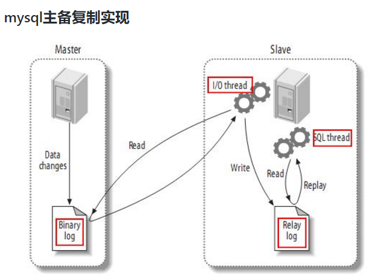
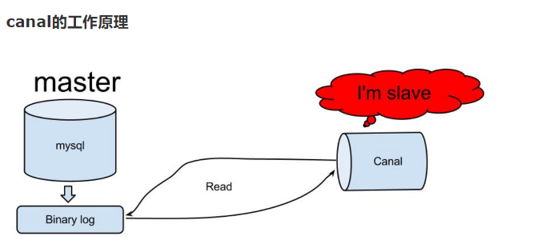

# 介绍

- 用于同步mysql使用
- 使用场景
  - 做拉链表
  - 更新redis，同步mysql和redis的数据
  - 在某些情况下无法从日志中获取新，无法使用sqoop等ETL工具对数据实时监控


# 原理


## 关于MySQL



- 主机每次写操作都会在一个二进制操作日志中记录，类似于redis中的AOF文件
- 从机每次读取主机的写操作日志，重复主机的操作，达到主备的数据一致


### 查看配置

- 查看启动脚本，查看读取mysql.cnf配置路径逻辑

```bash
[ttshe@hadoop102 init.d]$ cat /etc/init.d/mysql 
```

- 关于mysql.cnf
  - 读取默认配置文件/etc/mysql.cnf
  - 如果不在则读取默认配置/usr/mysql.cnf

```bash

```


默认从etc/mysql.cnf


### binlog

- MySQL的二进制日志可以说是MySQL最重要的日志
- 记录了所有的DDL和DML(除了数据查询语句)语句，以事件形式记录，还包含语句所执行的消耗的时间
- MySQL的二进制日志是事务安全型的
- 一般来说开启二进制日志大概会有1%的性能损耗 
- 二进制有两个最重要的使用场景
  - MySQL Replication在Master端开启binlog
    - Master把它的二进制日志传递给slaves来达到master-slave数据一致的目的
  - 通过使用mysqlbinlog工具来使恢复数据

- 二进制日志包括两类文件
  - 二进制日志索引文件（文件名后缀为.index）用于记录所有的二进制文件
  - 二进制日志文件（文件名后缀为.00000*）记录数据库所有的DDL和DML(除了数据查询语句)语句事件
  - 在`/var/lib/mysql`下查看

```bash
[ttshe@hadoop102 init.d]$ cd /var/lib/mysql/
```


#### 开启

- 在mysql的配置文件(Linux: /etc/my.cnf ,  Windows: \my.ini)下,修改配置

- 在[mysqld] 区块设置/添加
  - `log-bin=mysql-bin`
  - 表示binlog日志的前缀是mysql-bin
  - 以后生成的日志文件就是 mysql-bin.123456 的文件后面的数字按顺序生成
- ==每次mysql重启或者到达单个文件大小的阈值时==，新生一个文件，按顺序编号


#### 分类

##### STATEMENT

- 语句级
- binlog会记录每次一执行写操作的语句
- 相对row模式节省空间，但是可能产生不一致性
  - 如update  tt set create_date=now() 
  - 用binlog日志进行恢复，由于执行时间不同可能产生的数据就不同
- 优点： 节省空间
- 缺点： 有可能造成数据不一致


##### ROW (保证数据一致性)

- 行级
- binlog会记录每次操作后每行记录的变化
- 优点：保持数据的绝对一致性。不管sql是什么，引用了什么函数，只记录执行后的效果
  - 可以保证主从一致
- 缺点：占用较大空间
  - 如 update 操作可能会影响到10w条记录
    - ROW 那么会有10w条操作结果记录
    - STATEMENT就只有一条语句

- 在canal数据监控的情况下需要使用row
  - 在配置文件中选择配置`binlog_format=row`


##### MIXED

- statement的升级版
- 一定程度上解决了某些情况造成的statement模式不一致问题
  - 如下情况会按照 ROW的方式进行处理
    - 函数中包含 UUID() 时
    - 包含 AUTO_INCREMENT 字段的表被更新时
    - 执行 INSERT DELAYED 语句时
    - 用 UDF 时
- 优点：节省空间，同时兼顾了一定的一致性
- 缺点：还有些极个别情况依旧会造成不一致，另外statement和mixed对于需要对binlog的监控的情况都不方便


## Canal原理

- canal的工作原理是自己伪装成slave，假装从master复制数据




# 安装


## mysql配置

- 复制配置文件

```bash
[ttshe@hadoop102 usr]$ sudo cp my.cnf /etc/
```

- 修改/etc/my.cnf文件

```bash
server-id= 1 # 启动canal时，server-id要不同
log-bin=mysql-bin # logbin的文件名前缀
binlog_format=row
binlog-do-db=gmall_canal # 需要binlog的数据库
```

- 重启mysql

```bash
[ttshe@hadoop102 usr]$ sudo service mysql restart
```

- 给canal用户添加权限

```bash
[ttshe@hadoop102 usr]$ mysql -u root -p123456

mysql> GRANT ALL PRIVILEGES ON *.* TO canal@'%' IDENTIFIED BY 'canal';
```


## canal的安装

- canal的下载路径
  - https://github.com/alibaba/canal/releases

- 把canal.deployer-1.1.2.tar.gz拷贝到linux

- 解压

```bash
[ttshe@hadoop102 module]$ mkdir canal
[ttshe@hadoop102 software]$ tar -zvxf canal.deployer-1.1.2.tar.gz -C /opt/module/canal
```


### 配置

- 配置信息

```bash
[ttshe@hadoop102 canal]$ cd conf/
[ttshe@hadoop102 conf]$ ll
总用量 24
-rwxrwxr-x 1 ttshe ttshe 4262 11月 26 2018 canal.properties # canal的基本配置
drwxrwxr-x 2 ttshe ttshe 4096 11月 24 21:27 example # canal基本配置中的实例文件夹
-rwxrwxr-x 1 ttshe ttshe 3109 11月 26 2018 logback.xml
drwxrwxr-x 2 ttshe ttshe 4096 11月 24 21:27 metrics
drwxrwxr-x 3 ttshe ttshe 4096 11月 24 21:27 spring
```

- 一般通用配置不用修改
  - 端口号默认11111

- 修改example中的instance.properties文件

```bash
[ttshe@hadoop102 example]$ vim instance.properties

# 修改如下配置
canal.instance.master.address=hadoop102:3306
canal.instance.dbUsername=canal # 依据创建的canal用户，密码也是canal
canal.instance.dbPassword=canal
```


### 启动

```bash
[ttshe@hadoop102 bin]$ /opt/module/canal/bin/startup.sh 
# 此时查看bin文件夹，可发现pid文件，表示启动生成，如果再次startup.sh，会判断pid是否存在，控制重复启动
[ttshe@hadoop102 bin]$ ll
总用量 20
-rw-rw-r-- 1 ttshe ttshe    6 11月 24 21:40 canal.pid
-rwxr-xr-x 1 ttshe ttshe   39 11月 26 2018 restart.sh
-rwxr-xr-x 1 ttshe ttshe 1145 11月 26 2018 startup.bat
-rwxr-xr-x 1 ttshe ttshe 2956 11月 26 2018 startup.sh
-rwxr-xr-x 1 ttshe ttshe 1356 11月 26 2018 stop.sh
```

- 检查日志

```bash
[ttshe@hadoop102 example]$ pwd
/opt/module/canal/logs/example
[ttshe@hadoop102 example]$ tail -f example.log
```


# java API调用


## pom

```xml
<dependency>
    <groupId>com.alibaba.otter</groupId>
    <artifactId>canal.client</artifactId>
    <version>1.1.2</version>
</dependency>
```


## 说明

- message
  - 一次canal从日志中抓取的信息
  - 一个message包含多个sql
- entry
  - 相当于一个sql命令
  - 一个sql可以对多行记录造成影响
    - type
      - 用于区分数据变化，还是事务变化
    - header.tableName
      - 表名
    - storeValue
      - 得到rowChange对象
- rowChange
  - entry经过反序列化得到的对象，包含多行记录的变化值
  - entryType
    - 数据变化类型
    - insert，update，delete，create，alter，drop
  - rowdatalist
- RowDatas
  - 一个rowChange包含的数据变化集，每一个rowdata里面包含了一行的多个字段
  - afterColumnList
  - beforeColumnList
- column
  - 一个RowData里包含了多个column
  - 每个column包含了name和value


## 示例

```java
package com.stt.spark.dw;

import com.alibaba.otter.canal.client.CanalConnector;
import com.alibaba.otter.canal.client.CanalConnectors;
import com.alibaba.otter.canal.protocol.CanalEntry;
import com.alibaba.otter.canal.protocol.Message;
import com.google.protobuf.InvalidProtocolBufferException;

import java.net.InetSocketAddress;

public class CanalClient {

    public static void startConnect() {
        //destinationcanal serverinstanceexample
        CanalConnector canalConnector = CanalConnectors.newSingleConnector(
            new InetSocketAddress("hadoop102", 11111),
            "example", "", "");
        while (true) {
            canalConnector.connect();
            canalConnector.subscribe("gmall_canal.order_info");   // 访问指定数据信息，如果是全部表使用 * 表示

            // 100 条语句，可能包含1w条数据的变化
            // 一个message表示一次数据的抓取
            Message message = canalConnector.get(100);
            if (message.getEntries().size() == 0) {
                try {
                    System.out.println("5s");
                    Thread.sleep(5000);
                } catch (InterruptedException e) {
                    e.printStackTrace();
                }
                continue;
            }

            for (CanalEntry.Entry entry : message.getEntries()) {
                // 忽略事务处理消息
                if(entry.getEntryType().equals(CanalEntry.EntryType.TRANSACTIONBEGIN) ||entry.getEntryType().equals(CanalEntry.EntryType.TRANSACTIONEND)) {
                    continue;
                }
                CanalEntry.RowChange rowChange = null;
                try {
                    // 将存储的二进制值解析为内存对象
                    rowChange = CanalEntry.RowChange.parseFrom(entry.getStoreValue());
                    System.out.println(
                        String.format("tableName: %s type: %s size: %d",entry.getHeader().getTableName(),rowChange.getEventType(),rowChange.getRowDatasList().size())); // EventType 操作类型 INSERT UPDATE ...

                } catch (InvalidProtocolBufferException e) {
                    e.printStackTrace();
                }

            }
        }
    }
}
```

