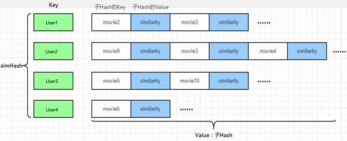
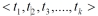
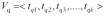
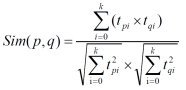
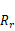
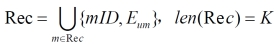
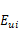

# 父项目


## pom

```xml
<?xml version="1.0" encoding="UTF-8"?>
<project xmlns="http://maven.apache.org/POM/4.0.0"
         xmlns:xsi="http://www.w3.org/2001/XMLSchema-instance"
         xsi:schemaLocation="http://maven.apache.org/POM/4.0.0 http://maven.apache.org/xsd/maven-4.0.0.xsd">
    <modelVersion>4.0.0</modelVersion>

    <groupId>com.stt.recommend</groupId>
    <artifactId>movie-recommend</artifactId>
    <packaging>pom</packaging>
    <version>1.0-SNAPSHOT</version>
    <modules>
        <module>DataLoader</module>
    </modules>

    <properties>
        <log4j.version>1.2.17</log4j.version>
        <slf4j.version>1.7.22</slf4j.version>
        <mongodb-spark.version>2.0.0</mongodb-spark.version>
        <!--mongo 在scala上的driver -->
        <casbah.version>3.1.1</casbah.version>
        <elasticsearch-spark.version>6.3.1</elasticsearch-spark.version>
        <elasticsearch.version>6.3.1</elasticsearch.version>
        <redis.version>2.9.0</redis.version>
        <kafka.version>0.10.2.1</kafka.version>
        <spark.version>2.1.1</spark.version>
        <scala.version>2.11.8</scala.version>
        <!--线性代数使用-->
        <jblas.version>1.2.1</jblas.version>
    </properties>

    <dependencies>
        <!--引入共同的日志管理工具 -->
        <dependency>
            <groupId>org.slf4j</groupId>
            <artifactId>jcl-over-slf4j</artifactId>
            <version>${slf4j.version}</version>
        </dependency>
        <dependency>
            <groupId>org.slf4j</groupId>
            <artifactId>slf4j-api</artifactId>
            <version>${slf4j.version}</version>
        </dependency>
        <dependency>
            <groupId>org.slf4j</groupId>
            <artifactId>slf4j-log4j12</artifactId>
            <version>${slf4j.version}</version>
        </dependency>
        <dependency>
            <groupId>log4j</groupId>
            <artifactId>log4j</artifactId>
            <version>${log4j.version}</version>
        </dependency>


    </dependencies>

    <dependencyManagement>
        <dependencies>
            <!-- 引入Spark相关的Jar包 -->
            <dependency>
                <groupId>org.apache.spark</groupId>
                <artifactId>spark-core_2.11</artifactId>
                <version>${spark.version}</version>
            </dependency>
            <dependency>
                <groupId>org.apache.spark</groupId>
                <artifactId>spark-sql_2.11</artifactId>
                <version>${spark.version}</version>
            </dependency>
            <dependency>
                <groupId>org.apache.spark</groupId>
                <artifactId>spark-streaming_2.11</artifactId>
                <version>${spark.version}</version>
            </dependency>
            <dependency>
                <groupId>org.apache.spark</groupId>
                <artifactId>spark-mllib_2.11</artifactId>
                <version>${spark.version}</version>
            </dependency>
            <dependency>
                <groupId>org.apache.spark</groupId>
                <artifactId>spark-graphx_2.11</artifactId>
                <version>${spark.version}</version>
            </dependency>
            <dependency>
                <groupId>org.scala-lang</groupId>
                <artifactId>scala-library</artifactId>
                <version>${scala.version}</version>
            </dependency>
        </dependencies>
    </dependencyManagement>


    <build>
        <!--声明并引入子项目共有的插件-->
        <plugins>
            <plugin>
                <groupId>org.apache.maven.plugins</groupId>
                <artifactId>maven-compiler-plugin</artifactId>
                <version>3.6.1</version>
                <!--所有的编译用JDK1.8-->
                <configuration>
                    <source>1.8</source>
                    <target>1.8</target>
                </configuration>
            </plugin>
        </plugins>
        <pluginManagement>
            <plugins>
                <!--maven的打包插件-->
                <plugin>
                    <groupId>org.apache.maven.plugins</groupId>
                    <artifactId>maven-assembly-plugin</artifactId>
                    <version>3.0.0</version>
                    <executions>
                        <execution>
                            <id>make-assembly</id>
                            <phase>package</phase>
                            <goals>
                                <goal>single</goal>
                            </goals>
                        </execution>
                    </executions>
                </plugin>
                <!--该插件用于将scala代码编译成class文件-->
                <plugin>
                    <groupId>net.alchim31.maven</groupId>
                    <artifactId>scala-maven-plugin</artifactId>
                    <version>3.2.2</version>
                    <executions>
                        <!--绑定到maven的编译阶段-->
                        <execution>
                            <goals>
                                <goal>compile</goal>
                                <goal>testCompile</goal>
                            </goals>
                        </execution>
                    </executions>
                </plugin>
            </plugins>
        </pluginManagement>
    </build>

</project>
```


## common 模块


### pom

```xml
<?xml version="1.0" encoding="UTF-8"?>
<project xmlns="http://maven.apache.org/POM/4.0.0"
         xmlns:xsi="http://www.w3.org/2001/XMLSchema-instance"
         xsi:schemaLocation="http://maven.apache.org/POM/4.0.0 http://maven.apache.org/xsd/maven-4.0.0.xsd">
    <parent>
        <artifactId>movie-recommend</artifactId>
        <groupId>com.stt.recommend</groupId>
        <version>1.0-SNAPSHOT</version>
    </parent>
    <modelVersion>4.0.0</modelVersion>

    <artifactId>common</artifactId>

    <dependencies>
        <!-- Spark的依赖引入 -->
        <dependency>
            <groupId>org.apache.spark</groupId>
            <artifactId>spark-core_2.11</artifactId>
        </dependency>
        <dependency>
            <groupId>org.apache.spark</groupId>
            <artifactId>spark-sql_2.11</artifactId>
        </dependency>
        <!-- 引入Scala -->
        <dependency>
            <groupId>org.scala-lang</groupId>
            <artifactId>scala-library</artifactId>
        </dependency>
    </dependencies>

</project>
```


# 导入数据模块

- 导入数据到ES和mongo中

- 在resources中放入Movies.csv Ratings.csv Tags.csv文件

## pom

```xml
<?xml version="1.0" encoding="UTF-8"?>
<project xmlns="http://maven.apache.org/POM/4.0.0"
         xmlns:xsi="http://www.w3.org/2001/XMLSchema-instance"
         xsi:schemaLocation="http://maven.apache.org/POM/4.0.0 http://maven.apache.org/xsd/maven-4.0.0.xsd">
    <parent>
        <artifactId>movie-recommend</artifactId>
        <groupId>com.stt.recommend</groupId>
        <version>1.0-SNAPSHOT</version>
    </parent>
    <modelVersion>4.0.0</modelVersion>

    <artifactId>DataLoader</artifactId>

    <dependencies>
        <!-- Spark的依赖引入 -->
        <dependency>
            <groupId>org.apache.spark</groupId>
            <artifactId>spark-core_2.11</artifactId>
        </dependency>
        <dependency>
            <groupId>org.apache.spark</groupId>
            <artifactId>spark-sql_2.11</artifactId>
        </dependency>
        <!-- 引入Scala -->
        <dependency>
            <groupId>org.scala-lang</groupId>
            <artifactId>scala-library</artifactId>
        </dependency>

        <!-- 加入MongoDB的驱动 -->
        <dependency>
            <groupId>org.mongodb</groupId>
            <artifactId>casbah-core_2.11</artifactId>
            <version>${casbah.version}</version>
        </dependency>
        <dependency>
            <groupId>org.mongodb.spark</groupId>
            <artifactId>mongo-spark-connector_2.11</artifactId>
            <version>${mongodb-spark.version}</version>
        </dependency>
        <!-- 加入ElasticSearch的驱动 -->
        <dependency>
            <groupId>org.elasticsearch.client</groupId>
            <artifactId>transport</artifactId>
            <version>${elasticsearch.version}</version>
        </dependency>
        <dependency>
            <groupId>org.elasticsearch</groupId>
            <artifactId>elasticsearch-spark-20_2.11</artifactId>
            <version>${elasticsearch-spark.version}</version>
            <!-- 将不需要依赖的包从依赖路径中除去 -->
            <exclusions>
                <exclusion>
                    <groupId>org.apache.hive</groupId>
                    <artifactId>hive-service</artifactId>
                </exclusion>
            </exclusions>
        </dependency>
    </dependencies>

</project>
```


## log4j

```properties
log4j.rootLogger=info, stdout
log4j.appender.stdout=org.apache.log4j.ConsoleAppender
log4j.appender.stdout.layout=org.apache.log4j.PatternLayout
log4j.appender.stdout.layout.ConversionPattern=%d{yyyy-MM-dd HH:mm:ss,SSS}  %5p --- [%50t]  %-80c(line:%5L)  :  %m%n
```


## scala

- 数据结构
- Movie

```scala
package com.stt.recommend


/**
  * movie数据集
  * 格式：mid,name,descri,timelong,issue,shoot,language,genres,actors,directors
  * 260                                                     电影id，mid
  * Star Wars: Episode IV - A New Hope (1977)               电影名称，name
  * Princess Leia is captured and held hostage by the ev    详情描述，descri
  * 121 minutes                                             时长，timelong
  * September 21, 2004                                      发行时间，issue
  * 1977                                                    拍摄时间，shoot
  * English                                                 语言类型，language 每一项用“|”分割
  * Action|Adventure|Sci-Fi                                 类型，genres 每一项用“|”分割
  * Mark Hamill|Harrison Ford|Carrie Fisher|Peter Cushing   演员表，actors 每一项用“|”分割
  * George Lucas                                            导演，directors 每一项用“|”分割
  */

case class Movie(
                  mid: Int,
                  name: String,
                  descri: String,
                  timelong: String,
                  issue: String,
                  shoot: String,
                  language: String,
                  genres: String,
                  actors: String,
                  directors: String
                )
```

- Rating

```scala
package com.stt.recommend

/**
  * ratings 数据集 uid,mid,score,timestamp
  * 1                 uid
  * 1029              mid
  * 3.0               score
  * 1260759179        timestamp
  */
case class Rating(
                   uid: Int,
                   mid: Int,
                   score: Double,
                   timestamp: Long
                 )
```

- Tag

```scala
package com.stt.recommend

/**
  * tags 数据集
  * 15          uid
  * 1955        mid
  * dentist     tag
  * 1193435061  timestamp
  */
case class Tag(
                uid: Int,
                mid: Int,
                tag: String,
                timestamp: Long
              )
```

- 导入数据
  - 注意导入ES中的数据是通过movie和tag数据集合join而来
  - 注意ES的版本是6.3.1，对应的jar包版本需要一致

```scala
package com.stt.recommend

import java.net.InetAddress

import com.mongodb.casbah.commons.MongoDBObject
import com.mongodb.casbah.{MongoClient, MongoClientURI}
import org.apache.spark.SparkConf
import org.apache.spark.sql.{DataFrame, SaveMode, SparkSession}
import org.elasticsearch.action.admin.indices.create.CreateIndexRequest
import org.elasticsearch.action.admin.indices.delete.DeleteIndexRequest
import org.elasticsearch.action.admin.indices.exists.indices.IndicesExistsRequest
import org.elasticsearch.common.settings.Settings
import org.elasticsearch.common.transport.TransportAddress
import org.elasticsearch.transport.client.PreBuiltTransportClient


// 将ES 和 MongoDB的配置封装成样例类
/**
  * @param httpHosts      http主机列表，逗号分隔 9200
  * @param transportHosts transport 主机列表 9300 集群之间用于数据传递
  * @param index          需要操作的索引
  * @param clustername    集群名，默认为elasticsearch
  */
case class ESConfig(
                     httpHosts: String,
                     transportHosts: String,
                     index: String,
                     clustername: String
                   )

/**
  * @param uri mongodb 连接
  * @param db  mongodb 数据库
  */
case class MongoConfig(
                        uri: String,
                        db: String
                      )

object DataLoader {

  val MONGODB_MOVIE_COLLECTION = "Movie"
  val MONGODB_RATING_COLLECTION = "Rating"
  val MONGODB_TAG_COLLECTION = "Tag"

  val ES_MOVIE_INDEX = "Movie"

  def main(args: Array[String]): Unit = {

    val config = Map(
      "spark.cores" -> "local[*]",
      "mongo.uri" -> "mongodb://localhost:27017/recommender",
      "mongo.db" -> "recommender",
      "es.httpHosts" -> "hadoop102:9200",
      "es.transportHosts" -> "hadoop102:9300",
      "es.index" -> "recommender",
      "es.cluster.name" -> "my-es"
    )

    // 创建一个sparkConf
    val sparkConf: SparkConf = new SparkConf()
      .setMaster(config("spark.cores"))
      .setAppName("DataLoader")

    // 创建一个sparkSession
    val spark: SparkSession = SparkSession.builder().config(sparkConf).getOrCreate()

    import spark.implicits._

    // 加载数据
    val movieRDD = spark.sparkContext.textFile(
      Thread.currentThread().getContextClassLoader.getResource("movies.csv").getPath)

    val movieDF = movieRDD.map(item =>{
      val fields = item.split("\\^")
      Movie(
        fields(0).toInt,
        fields(1).trim,
        fields(2).trim,
        fields(3).trim,
        fields(4).trim,
        fields(5).trim,
        fields(6).trim,
        fields(7).trim,
        fields(8).trim,
        fields(9).trim
      )
    }).toDF()

    val ratingRDD = spark.sparkContext.textFile(
      Thread.currentThread().getContextClassLoader.getResource("ratings.csv").getPath)

    val ratingDF = ratingRDD.map(item=>{
        val fields = item.split(",")
        Rating( fields(0).toInt, fields(1).toInt, fields(2).toDouble, fields(3).toLong)
      }).toDF()

    val tagRDD = spark.sparkContext.textFile(
      Thread.currentThread().getContextClassLoader.getResource("tags.csv").getPath)

    val tagDF = tagRDD.map(item=>{
      val fields = item.split(",")
      Tag( fields(0).toInt, fields(1).toInt, fields(2).trim, fields(3).toLong)
    }).toDF()

    // 将数据保存到mongoDB
    // 隐式类
    implicit val mongoConfig = MongoConfig(config("mongo.uri"),config("mongo.db"))

    storeDataInMongo(movieDF, ratingDF, tagDF)

    // 数据预处理
    // 把movie对应的tag信息加入到movie的一列 方便ES做查询
    // mid tag1|tag2|tag3...

    import org.apache.spark.sql.functions.{concat_ws,collect_set}
    // 使用DSL语句操作，将tag组合成tags
    val newTag = tagDF.groupBy($"mid")
      .agg(
        concat_ws("|",collect_set($"tag"))
          .as("tags")
      ).select("mid","tags")

    // 将movie和 newTag进行join 左外连接 ,数据合并在一起
    val movieWithTagDF = movieDF.join(newTag,Seq("mid"),"left")

    // 隐式类
    implicit val esConfig = ESConfig(
      config("es.httpHosts"),
      config("es.transportHosts"),
      config("es.index"),
      config("es.cluster.name")
    )

    // 将数据保存到ES
    storeDataInES(movieWithTagDF)

    // 关闭
    spark.stop()
  }

  def storeDataInMongo(movieDF: DataFrame, ratingDF: DataFrame, tagDF: DataFrame)(implicit mongoConfig: MongoConfig): Unit = {

    // 新建一个mongodb的连接
    val mongoClient = MongoClient(MongoClientURI(mongoConfig.uri))

    // 如果mongo中已经有了相应的数据库，先删除
    mongoClient(mongoConfig.db)(MONGODB_MOVIE_COLLECTION).dropCollection
    mongoClient(mongoConfig.db)(MONGODB_RATING_COLLECTION).dropCollection
    mongoClient(mongoConfig.db)(MONGODB_TAG_COLLECTION).dropCollection

    // 将DF数据写入到相应的mongodb中
    movieDF.write
      .option("uri",mongoConfig.uri)
      .option("collection",MONGODB_MOVIE_COLLECTION)
      .mode(SaveMode.Overwrite)
      .format("com.mongodb.spark.sql")
      .save()

    ratingDF.write
      .option("uri",mongoConfig.uri)
      .option("collection",MONGODB_RATING_COLLECTION)
      .mode(SaveMode.Overwrite)
      .format("com.mongodb.spark.sql")
      .save()

    tagDF.write
      .option("uri",mongoConfig.uri)
      .option("collection",MONGODB_TAG_COLLECTION)
      .mode(SaveMode.Overwrite)
      .format("com.mongodb.spark.sql")
      .save()

    // 建立索引
    mongoClient(mongoConfig.db)(MONGODB_MOVIE_COLLECTION).createIndex(MongoDBObject("mid"->1))
      
    mongoClient(mongoConfig.db)(MONGODB_RATING_COLLECTION).createIndex(MongoDBObject("uid"->1))
      
    mongoClient(mongoConfig.db)(MONGODB_RATING_COLLECTION).createIndex(MongoDBObject("mid"->1))
      
    mongoClient(mongoConfig.db)(MONGODB_TAG_COLLECTION).createIndex(MongoDBObject("mid"->1))
      
    mongoClient(mongoConfig.db)(MONGODB_TAG_COLLECTION).createIndex(MongoDBObject("uid"->1))

    mongoClient.close()
  }

  def storeDataInES(movieWithTagDF: DataFrame)(implicit eSConfig: ESConfig) = {
    // 新建es配置
    val settings: Settings = Settings.builder()
      .put("cluster.name",eSConfig.clustername).build()

    // 新建es客户端
    val esClient = new PreBuiltTransportClient(settings)

    val REGEX_HOST_PORT = "(.+):(\\d+)".r
    eSConfig.transportHosts.split(",").foreach{
      case REGEX_HOST_PORT(host:String, port:String) =>{
        // 配置addTransportAddress
        esClient.addTransportAddress(
          new TransportAddress(InetAddress.getByName(host),port.toInt)
        )
      }
    }
    // 清理遗留数据
    if(
        esClient.admin().indices().exists(new IndicesExistsRequest(eSConfig.index))
          .actionGet() // 发送get请求
          .isExists
      ){
        esClient.admin().indices().delete(new DeleteIndexRequest(eSConfig.index))
    }

    // 创建索引
    esClient.admin().indices().create(new CreateIndexRequest(eSConfig.index))

    // 将数据写入到索引
    movieWithTagDF.write
      .option("es.nodes",eSConfig.httpHosts)
      .option("es.http.timeout","100m")
      .option("es.mapping.id","mid")
      .option("es.nodes.wan.only","true")
      .mode(SaveMode.Overwrite)
      .format("org.elasticsearch.spark.sql")
      .save(eSConfig.index + "/" + ES_MOVIE_INDEX)
  }
}
```


# 离线统计推荐模块

离线推荐服务是综合用户所有的历史数据，利用设定的离线统计算法和离线推荐算法周期性的进行结果统计与保存，计算的结果在一定时间周期内是固定不变的，变更的频率取决于算法调度的频率。

离线推荐服务主要计算一些可以预先进行统计和计算的指标，为实时计算和前端业务相应提供数据支撑。

离线推荐服务主要分为统计性算法、基于ALS的协同过滤推荐算法以及基于ElasticSearch的内容推荐算法。

在recommender下新建子项目StatisticsRecommender，pom.xml文件中只需引入spark、scala和mongodb的相关依赖


## 历史热门电影统计

根据所有历史评分数据，计算历史评分次数最多的电影。

实现思路：

通过Spark SQL读取评分数据集，统计所有评分中评分数最多的电影，然后按照从大到小排序，将最终结果写入MongoDB的RateMoreMovies数据集中


## 最近热门电影统计

根据评分，按月为单位计算最近时间的月份里面评分数最多的电影集合。

实现思路：

通过Spark SQL读取评分数据集，通过UDF函数将评分的数据时间修改为月，然后统计每月电影的评分数。统计完成之后将数据写入到MongoDB的RateMoreRecentlyMovies数据集中。


## 电影平均得分统计

根据历史数据中所有用户对电影的评分，周期性的计算每个电影的平均得分。

实现思路：

通过Spark SQL读取保存在MongDB中的Rating数据集，通过执行以下SQL语句实现对于电影的平均分统计：


## 每个类别优质电影统计

根据提供的所有电影类别，分别计算每种类型的电影集合中评分最高的10个电影。

实现思路：

在计算完整个电影的平均得分之后，将影片集合与电影类型做笛卡尔积，然后过滤掉电影类型不符合的条目，将DataFrame输出到MongoDB的GenresTopMovies集合中


```scala
package com.stt.recommend

import java.time.format.DateTimeFormatter
import java.time.{Instant, LocalDateTime, ZoneId}

import com.mongodb.casbah.{MongoClient, MongoClientURI}
import org.apache.spark.SparkConf
import org.apache.spark.rdd.RDD
import org.apache.spark.sql.{DataFrame, SaveMode, SparkSession}

/**
  * 电影得分
  * @param mid
  * @param score
  */
case class Recommendation(mid:Int, score:Double)

/**
  * 依据类别的电影得分
  * @param genres
  * @param recs
  */
case class GenresRecommendation(genres:String, recs:Seq[Recommendation])

object StatisticRecommender {

  val MONGODB_RATING_COLLECTION = "Rating"
  val MONGODB_MOVIE_COLLECTION = "Movie"

  //统计的表的名称
  val RATE_MORE_MOVIES = "RateMoreMovies"
  val RATE_MORE_RECENTLY_MOVIES = "RateMoreRecentlyMovies"
  val AVERAGE_MOVIES = "AverageMovies"
  val GENRES_TOP_MOVIES = "GenresTopMovies"

  def main(args: Array[String]): Unit = {

    val config = Map(
      "spark.cores" -> "local[*]",
      "mongo.uri" -> "mongodb://localhost:27017/recommender",
      "mongo.db" -> "recommender"
    )

    //创建SparkConf配置
    val sparkConf = new SparkConf()
      .setAppName("StatisticsRecommender")
      .setMaster(config("spark.cores"))

    //创建SparkSession
    val spark = SparkSession.builder().config(sparkConf).getOrCreate()

    //加入隐式转换
    import spark.implicits._

    implicit val mongoConfig = MongoConfig(config("mongo.uri"),config("mongo.db"))

    // 从mongoDB中获取数据
    val ratingDF = spark.read
      .option("uri",mongoConfig.uri)
      .option("collection",MONGODB_RATING_COLLECTION)
      .format("com.mongodb.spark.sql")
      .load()
      .as[Rating]
      .toDF()

    val movieDF = spark.read
      .option("uri",mongoConfig.uri)
      .option("collection",MONGODB_MOVIE_COLLECTION)
      .format("com.mongodb.spark.sql")
      .load()
      .as[Movie]
      .toDF()

    // 创建ratings的视图
    ratingDF.createOrReplaceTempView("ratings_view")

    // todo 不同的推荐统计结果
    // 1.历史热门统计，历史评分数据最多, 与评分无关，最近热门可能评分不高
    val rateMoreMoviesDF = spark.sql("select mid, count(mid) as count from ratings_view group by mid")
    // 把结果写入对应的mongodb表中
    storeDataInMongo(rateMoreMoviesDF,RATE_MORE_MOVIES)

    // 2.近期热门统计，按照"yyyyMM"格式选取最近的评分数据，统计评分个数
    // 注册udf函数
    spark.udf.register("changeDate",(x: Int)=>{
      LocalDateTime
        .ofInstant(Instant.ofEpochMilli(x*1000L), ZoneId.systemDefault())
        .format(DateTimeFormatter.ofPattern("yyyyMM")).toInt
    })
    // 对数据进行预处理，去除uid
    val ratingOfYearMonth =
      spark.sql("select mid, score, changeDate(timestamp) as yearmonth from ratings_view")

    ratingOfYearMonth.createOrReplaceTempView("ratingOfMonth_view")
    // 从ratingOfMonth中查找电影在各个月份的评分，mid, count, yearmonth
    val rateMoreRecentlyMoviesDF =
      spark.sql("select mid, count(mid) as count, yearmonth from ratingOfMonth_view " +
        "group by yearmonth, mid order by yearmonth desc , count desc")

    storeDataInMongo(rateMoreRecentlyMoviesDF,RATE_MORE_RECENTLY_MOVIES)

    // 3.优质电影推荐，统计电影的平均得分
    val avgMovieDF = spark.sql("select mid, avg(score) as avg from ratings_view group by mid")
    storeDataInMongo(avgMovieDF,AVERAGE_MOVIES)

    // 4.各类别的top10统计
    // 定义所有类别，一般是从数据库中获取，如redis

    val genres = List("Action","Adventure","Animation","Comedy","Crime","Documentary","Drama","Family","Fantasy","Foreign","History","Horror","Music","Mystery"
      ,"Romance","Science","Tv","Thriller","War","Western")

    // 将平均分加入到movie表中，添加一列，inner join
    val movieWithScore: DataFrame = movieDF.join(avgMovieDF,"mid")

    // 转成RDD
    val genresRDD: RDD[String] = spark.sparkContext.makeRDD(genres)

    //方式1： 计算类别top10, 首先对类别和电影做笛卡尔积
    //找出 movie 的字段 genres 值包含genre
    //方式2： 使用爆炸函数
    val genresTopMovieDF: DataFrame = genresRDD.cartesian(movieWithScore.rdd)
      .filter {
        case (genre, row) => row.getAs[String]("genres").toLowerCase.contains(genre.toLowerCase)
      }.map {
        // 将整个数据集的数据量减小，生成RDD[String,Iter[mid,avg]]
        case (genre, row) => {
          (genre, (row.getAs[Int]("mid"), row.getAs[Double]("avg")))
        }
      }.groupByKey()
      .map {
        case (genre, items) =>
          GenresRecommendation(
            genre,
            items.toList.sortWith(_._2 > _._2).take(10).map(item => Recommendation(item._1, item._2))
          )
      }.toDF()

    storeDataInMongo(genresTopMovieDF,GENRES_TOP_MOVIES)

    spark.stop()
  }

  def storeDataInMongo(df: DataFrame, collectName: String)(implicit mongoConfig: MongoConfig): Unit= {

    val mongoClient = MongoClient(MongoClientURI(mongoConfig.uri))
    mongoClient(mongoConfig.db)(collectName).dropCollection

    df.write
      .option("uri",mongoConfig.uri)
      .option("collection",collectName)
      .mode(SaveMode.Overwrite)
      .format("com.mongodb.spark.sql")
      .save()
  }

}
```


# 离线推荐模块


## 基于隐语义模型的协同过滤推荐

项目采用ALS作为协同过滤算法，分别根据MongoDB中的用户评分表和电影数据集计算用户电影推荐矩阵以及电影相似度矩阵


### 用户电影推荐矩阵

通过ALS训练出来的Model来计算所有当前用户电影的推荐矩阵，主要思路如下

- UserId和MovieID做笛卡尔积，产生（uid，mid）的元组
- 通过模型预测（uid，mid）的元组
- 将预测结果通过预测分值进行排序
- 返回分值最大的K个电影，作为当前用户的推荐

最后生成的数据结构如下：将数据保存到MongoDB的UserRecs表中



新建recommender的子项目OfflineRecommender，引入spark、scala、mongo和jblas的依赖


#### pom

```xml
<?xml version="1.0" encoding="UTF-8"?>
<project xmlns="http://maven.apache.org/POM/4.0.0"
         xmlns:xsi="http://www.w3.org/2001/XMLSchema-instance"
         xsi:schemaLocation="http://maven.apache.org/POM/4.0.0 http://maven.apache.org/xsd/maven-4.0.0.xsd">
    <parent>
        <artifactId>movie-recommend</artifactId>
        <groupId>com.stt.recommend</groupId>
        <version>1.0-SNAPSHOT</version>
    </parent>
    <modelVersion>4.0.0</modelVersion>

    <artifactId>OfflineRecommender</artifactId>


    <dependencies>

        <dependency>
            <groupId>com.stt.recommend</groupId>
            <artifactId>common</artifactId>
            <version>1.0-SNAPSHOT</version>
        </dependency>

        <dependency>
            <groupId>org.apache.spark</groupId>
            <artifactId>spark-mllib_2.11</artifactId>
        </dependency>

        <dependency>
            <groupId>org.scalanlp</groupId>
            <artifactId>jblas</artifactId>
        </dependency>

        <!-- 加入MongoDB的驱动 -->
        <dependency>
            <groupId>org.mongodb</groupId>
            <artifactId>casbah-core_2.11</artifactId>
        </dependency>
        <dependency>
            <groupId>org.mongodb.spark</groupId>
            <artifactId>mongo-spark-connector_2.11</artifactId>
        </dependency>

    </dependencies>

</project>
```


### 电影相似度矩阵

通过ALS计算电影见相似度矩阵，该矩阵用于查询当前电影的相似电影并为实时推荐系统服务。

离线计算的ALS 算法，算法最终会为用户、电影分别生成最终的特征矩阵，分别是表示用户特征矩阵的U(m x k)矩阵，每个用户由 k个特征描述；表示物品特征矩阵的V(n x k)矩阵，每个物品也由 k 个特征描述。

V(n x k)表示物品特征矩阵，每一行是一个 k 维向量，虽然我们并不知道每一个维度的特征意义是什么，但是k 个维度的数学向量表示了该行对应电影的特征。

所以，每个电影用V(n x k)每一行的向量表示其特征，于是任意两个电影 p：特征向量为，电影q：特征向量为之间的相似度sim(p,q)可以使用和的余弦值来表示：



数据集中任意两个电影间相似度都可以由公式计算得到，电影与电影之间的相似度在一段时间内基本是固定值。最后生成的数据保存到MongoDB的MovieRecs表中


#### 代码

```scala
package com.stt.recommender

import com.stt.recommend.MongoConfig
import org.apache.spark.SparkConf
import org.apache.spark.mllib.recommendation.{ALS, Rating}
import org.apache.spark.rdd.RDD
import org.apache.spark.sql.{DataFrame, SaveMode, SparkSession}
import org.jblas.DoubleMatrix

/**
  * 为了与mllib中的Rating冲突区别开来，重新命名MovieRating
  */
case class MovieRating(uid: Int, mid: Int, score: Double, timestamp: Long)

/**
  * 定义一个基准推荐对象
  *
  * @param mid
  * @param score
  */
case class Recommendation(mid: Int, score: Double)

/**
  * 定义基于预测评分的用户推荐列表
  *
  * @param uid
  * @param recs
  */
case class UserRecs(uid: Int, recs: Seq[Recommendation])

/**
  * 定义基于LFM电影特征向量的电影相似度
  *
  * @param mid
  * @param recs
  */
case class MovieRecs(mid: Int, recs: Seq[Recommendation])

object OfflineRecommender {

  val MONGODB_RATING_COLLECTION = "Rating"
  val MONGODB_MOVIE_COLLECTION = "Movie"

  // 推荐表的名称
  val USER_RECS = "UserRecs"
  val MOVIE_RECS = "MovieRecs"

  val USER_MAX_RECOMMENDATION = 20


  def main(args: Array[String]): Unit = {

    val config = Map(
      "spark.cores" -> "local[*]",
      "mongo.uri" -> "mongodb://localhost:27017/recommender",
      "mongo.db" -> "recommender"
    )

    //创建SparkConf配置
    val sparkConf = new SparkConf()
      .setAppName("OfflineRecommender")
      .setMaster(config("spark.cores"))

    //创建SparkSession
    val spark = SparkSession.builder().config(sparkConf).getOrCreate()

    import spark.implicits._
    implicit val mongoConfig = MongoConfig(config("mongo.uri"), config("mongo.db"))

    // 从mongoDB中获取数据
    val ratingRDD = spark.read
      .option("uri", mongoConfig.uri)
      .option("collection", MONGODB_RATING_COLLECTION)
      .format("com.mongodb.spark.sql")
      .load()
      .as[MovieRating]
      .rdd // als 算法中需要传入的参数是rdd
      .map(rating => (rating.uid, rating.mid, rating.score)) // 转化成RDD，去除时间戳
      .cache() // 后面需要笛卡尔积计算，需要持久化在内存中，性能提升

    // 所有的user和movie的笛卡尔积
    // 在评分中有uid，LFM依赖于历史数据，一个新用户没有评分，则会有冷启动问题
    // 用户量大的时候需要缓存
    val userRDD = ratingRDD.map(_._1).distinct().cache()

    // 有些 movie 本身没有评分，不做预测，做预测性价比不高
    val movieRDD = ratingRDD.map(_._2).distinct().cache()

    // 训练隐语义模型，R值
    val trainData = ratingRDD.map { case (uid, mid, score) => Rating(uid, mid, score) }

    // rank 是特征个数
    // 交替最小二乘法，需要传入迭代次数
    // 传入正则化系数
    // 可以传入seed 生成初始化矩阵
    val (rank, iterations, lambda) = (50, 5, 0.03)
    val model = ALS.train(trainData, rank, iterations, lambda)

    // 基于用户和电影的隐特质，计算预测评分，得到用户推荐列表
    // 计算user 和 movie的笛卡尔积，得到一个空矩阵
    val userMovies: RDD[(Int, Int)] = userRDD.cartesian(movieRDD)

    // 调用model的predict方法，做预测评分
    // 可以单独计算一个user和movie，也可以传入一个空矩阵
    val preRatings: RDD[Rating] = model.predict(userMovies)

    val userRecsDF = preRatings
      .filter {
        case Rating(uid, mid, score) => score > 0 // 过滤出评分大于0的项
      }
      .map {
        case Rating(uid, mid, score) => (uid, (mid, score))
      }
      .groupByKey()
      .map {
        case (uid, items) =>
          UserRecs(
            uid,
            items
              .toList
              .sortWith(_._2 > _._2)
              .take(USER_MAX_RECOMMENDATION)
              .map { case (mid, score) => Recommendation(mid, score) }
          )
      }
      .toDF()

    userRecsDF
      .write
      .option("uri", mongoConfig.uri)
      .option("collection", USER_RECS)
      .mode(SaveMode.Overwrite)
      .format("com.mongodb.spark.sql")
      .save()

    // 基于电影隐特质，计算相似度矩阵，得到每2个电影相似度列表
    val movieFeatures = model.productFeatures.map {
      case (mid, features) => (mid, new DoubleMatrix(features)) // 得到每个电影的特征的一维矩阵
    }

    // 给2个电影做笛卡尔积
    val movieDoubleMatrix: RDD[((Int, DoubleMatrix), (Int, DoubleMatrix))] =
      movieFeatures.cartesian(movieFeatures)
        .filter {
          case (a, b) => a._1 != b._1
        }

    val movieRecsDF: DataFrame = movieDoubleMatrix.map {
      case (m1, m2) => {
        val simScore = consinSim(m1._2, m2._2) // 计算余弦相似度
        (m1._1, (m2._1, simScore))
      }
    }.filter {
      case (mid1, (mid2, simScore)) => simScore > 0.6 // 过滤出相似度>0.6的
    }.groupByKey()
      .map {
        case (mid1, items) =>
          MovieRecs(
            mid1,
            items.toList.sortWith {
              case (a, b) => a._2 > b._2
            }.map {
              case (mid, simScore) => Recommendation(mid, simScore)
            }
          )
      }.toDF()

    movieRecsDF
      .write
      .option("uri", mongoConfig.uri)
      .option("collection", MOVIE_RECS)
      .mode(SaveMode.Overwrite)
      .format("com.mongodb.spark.sql")
      .save()

    spark.stop()

  }

  /**
    * 求向量余弦相似度 cos = m1.m2 / |m1|*|m2|
    * @param m1
    * @param m2
    * @return
    */
  def consinSim(m1: DoubleMatrix, m2: DoubleMatrix) = {

    // norm1 表示L1范数
    // norm2 表示L2范数 模长
    m1.dot(m2) / (m1.norm2() * m2.norm2())
  }
}
```


### 模型评估和参数选取

在上述模型训练的过程中，我们直接给定了隐语义模型的rank,iterations,lambda三个参数。对于我们的模型，这并不一定是最优的参数选取，所以我们需要对模型进行评估。通常的做法是计算均方根误差（RMSE），考察预测评分与实际评分之间的误差。


有了RMSE，我们可以就可以通过多次调整参数值，来选取RMSE最小的一组作为我们模型的优化选择。

- 新建单例对象ALSTrainer

```scala
package com.stt.recommender

import breeze.numerics.sqrt
import com.stt.recommend.MongoConfig
import com.stt.recommender.OfflineRecommender.MONGODB_RATING_COLLECTION
import org.apache.spark.SparkConf
import org.apache.spark.mllib.recommendation.{ALS, MatrixFactorizationModel, Rating}
import org.apache.spark.rdd.RDD
import org.apache.spark.sql.SparkSession

/**
  * 使用测试集合，选出最小的RMSE，得到最优的模型
  */
object ALSTrainer {

  def main(args: Array[String]): Unit = {

    val config = Map(
      "spark.cores" -> "local[*]",
      "mongo.uri" -> "mongodb://localhost:27017/recommender",
      "mongo.db" -> "recommender"
    )

    //创建SparkConf配置
    val sparkConf = new SparkConf()
      .setAppName("OfflineRecommender")
      .setMaster(config("spark.cores"))

    //创建SparkSession
    val spark = SparkSession.builder().config(sparkConf).getOrCreate()

    import spark.implicits._
    implicit val mongoConfig = MongoConfig(config("mongo.uri"), config("mongo.db"))

    val ratingRDD = spark.read
      .option("uri", mongoConfig.uri)
      .option("collection", MONGODB_RATING_COLLECTION)
      .format("com.mongodb.spark.sql")
      .load()
      .as[MovieRating]
      .rdd
      .map {
        case MovieRating(uid, mid, score, timestamp) => Rating(uid, mid, score)
      }.cache()

    // 随机切分测试集和训练集
    val splits = ratingRDD.randomSplit(Array(0.8, 0.2))
    val trainingRDD = splits(0)
    val testRDD = splits(1)

    // 模型参数选择，输出最优参数
    adjustALSParam(trainingRDD, testRDD)

    spark.stop()
  }

  def adjustALSParam(trainingRDD: RDD[Rating], testRDD: RDD[Rating]) = {
    // 特征维度列表
    val K = Array(20, 50, 100)
    // 正则化取值
    // 这里只是测试，给的参数比较少
    val LAMBDA = Array(0.001, 0.01, 0.1)

    val result: Array[(Int, Double, Double)] =
      for (rank <- K; lambda <- LAMBDA) yield { // 在循环过程中的中间结果会进行缓存
        val model = ALS.train(trainingRDD, rank, 10, lambda) // 注意迭代次数不能太多，会有异常
        val rmse = calculateRMSE(model, testRDD)
        (rank, lambda, rmse)
      }

    //    println(result.sortBy(_._3).head)
    println(result.minBy(_._3))
  }

  /**
    * 计算当前的remse的返回数据 返回double
    *
    * @param model 模型
    * @param data  测试数据
    */
  def calculateRMSE(model: MatrixFactorizationModel, data: RDD[Rating]) : Double = {

    val userProducts = data.map {
      case Rating(user, product, score) => (user, product)
    }

    val predictRating: RDD[Rating] = model.predict(userProducts)

    // uid 和 mid作为外键，进行内连接
    val observed = data.map {
      case Rating(user, product, score) => ((user, product), score)
    }
    val predict = predictRating.map{
      case Rating(user, product, score) => ((user, product), score)
    }
    // 内连接得到(uid,mid),(actual,predict)
    val value: RDD[((Int, Int), (Double, Double))] = observed.join(predict)
    // 求平均数
    val mean: Double = value.map {
      case ((uid, mid), (actual, pre)) => {
        val err = actual - pre // 误差
        err * err
      }
    }.mean()
    // 开根号
    sqrt(mean)
  }

}
```

- 结果

```text
(100,0.1,0.9134925904310284)
```


# 实时推荐服务模块

实时计算与离线计算应用于推荐系统上最大的不同在

- 实时计算推荐结果应该反映最近一段时间用户近期的偏好
- 离线计算推荐结果则是根据用户从第一次评分起的所有评分记录来计算用户总体的偏好

用户对物品的偏好随着时间的推移总是会改变的

- 如一个用户u 在某时刻对电影p 给予了极高的评分，那么在近期一段时候，u 极有可能很喜欢与电影p 类似的其他电影
- 如果用户u 在某时刻对电影q 给予了极低的评分，那么在近期一段时候，u 极有可能不喜欢与电影q 类似的其他电影
- 对于实时推荐，当用户对一个电影进行了评价后，用户会希望推荐结果基于最近这几次评分进行一定的更新，使得推荐结果匹配用户近期的偏好，满足用户近期的口味


如果实时推荐继续采用离线推荐中的ALS 算法，由于算法运行时间巨大，不具有实时得到新的推荐结果的能力

- 由于算法本身的使用的是评分表，用户本次评分后只更新了总评分表中的一项，使得算法运行后的推荐结果与用户本次评分之前的推荐结果基本没有多少差别，从而给用户一种推荐结果一直没变化的感觉，很影响用户体验
- 在实时推荐中由于时间性能上要满足实时或者准实时的要求，所以算法的计算量不能太大，避免复杂、过多的计算造成用户体验的下降
- 鉴于此，推荐精度往往不会很高
- 实时推荐系统更关心推荐结果的动态变化能力，只要更新推荐结果的理由合理即可，至于推荐的精度要求则可以适当放宽

- 对于实时推荐算法主要有两点需求
  - 用户本次评分后、或最近几个评分后系统可以明显的更新推荐结果
  - 计算量不大，满足响应时间上的实时或者准实时要求


## 算法设计

- 读取离线产生的电影之间的相似度矩阵数据

- 通过uid1对mid1的评分得到mid1相似的电影集合M（该电影集合需要去除uid已经看过的电影，从mongo中读取所有历史数据过滤）

- 对M内的电影进行等级计算排序，输出

  - 读取uid1最近评分的K部电影集合K，得到每部电影的评分R
  - 遍历M内的电影的mid，求该mid与集合K内的mid电影的相似度S，该S需要>设置值（如0.7 表示70%相似）
  - 相似度S*评分R / 集合K的长度 = 预算未看电影mid的评分
  - 考虑到评分的差异性，计算偏移量，该偏移量是S>设置值情况下，R>设置值（如3分）的个数=NumR1，以及R<设置值的个数=NumR2
    - 偏移量 = log(NumR1 or 1) - log(NumR2 or 1)
    - 使用log避免NumR1和NumR2增幅过大，影响预测评分

  - 最终输出=预算未看电影mid的评分+偏移量


当用户u 对电影p 进行了评分，将触发一次对u 的推荐结果的更新

由于用户u 对电影p 评分，对于用户u 来说，他与p 最相似的电影们之间的推荐强度将发生变化，所以选取与电影p 最相似的K 个电影作为候选电影

每个候选电影按照“**推荐优先级**”这一权重作为衡量这个电影被推荐给用户u 的优先级

这些电影将根据用户u 最近的若干评分计算出各自对用户u 的推荐优先级，然后与上次对用户u 的实时推荐结果的进行基于推荐优先级的合并、替换得到更新后的推荐结果

具体来说：

- 获取用户u 按时间顺序最近的K 个评分，记为RK
- 获取电影p 的最相似的K 个电影集合，记为S
- 对于每个电影qS ，计算其推荐优先级计算公式如下

 

- 表示用户u 对电影r 的评分

- sim(q,r)表示电影q 与电影r 的相似度，设定最小相似度为0.6，当电影q和电影r 相似度低于0.6 的阈值，则视为两者不相关并忽略

- sim_sum 表示q 与RK 中电影相似度大于最小阈值的个数

- incount 表示RK 中与电影q 相似的、且本身评分较高（>=3）的电影个数

- recount 表示RK 中与电影q 相似的、且本身评分较低（<3）的电影个数

- 使用lg固定了偏移量的幅度


公式的意义如下

首先对于每个候选电影q，从u 最近的K 个评分中，找出与q 相似度较高（>=0.6）的u 已评分电影们，对于这些电影们中的每个电影r，将r 与q 的相似度乘以用户u 对r 的评分，将这些乘积计算平均数，作为用户u 对电影q 的评分预测即

 

然后，将u 最近的K 个评分中与电影q 相似的、且本身评分较高（>=3）的电影个数记为 incount，计算lgmax{incount,1}作为电影 q 的“增强因子”，意义在于电影q 与u 的最近K 个评分中的n 个高评分(>=3)电影相似，则电影q 的优先级被增加lgmax{incount,1}。如果电影 q 与 u 的最近 K 个评分中相似的高评分电影越多，也就是说n 越大，则电影q 更应该被推荐，所以推荐优先级被增强的幅度较大；如果电影q 与u 的最近K 个评分中相似的高评分电影越少，也就是n 越小，则推荐优先级被增强的幅度较小；

而后，将u 最近的K 个评分中与电影q 相似的、且本身评分较低（<3）的电影个数记为 recount，计算lgmax{recount,1}作为电影 q 的“削弱因子”，意义在于电影q 与u 的最近K 个评分中的n 个低评分(<3)电影相似，则电影q 的优先级被削减lgmax{incount,1}。如果电影 q 与 u 的最近 K 个评分中相似的低评分电影越多，也就是说n 越大，则电影q 更不应该被推荐，所以推荐优先级被减弱的幅度较大；如果电影q 与u 的最近K 个评分中相似的低评分电影越少，也就是n 越小，则推荐优先级被减弱的幅度较小；

最后，将增强因子增加到上述的预测评分中，并减去削弱因子，得到最终的q 电影对于u 的推荐优先级。在计算完每个候选电影q 的后，将生成一组<电影q 的ID, q 的推荐优先级>的列表updatedList：

 

而在本次为用户u 实时推荐之前的上一次实时推荐结果Rec 也是一组<电影m,m 的推荐优先级>的列表，其大小也为K：

 

接下来，将updated_S 与本次为u 实时推荐之前的上一次实时推荐结果Rec进行基于合并、替换形成新的推荐结果NewRec：

 

其中，i表示updated_S 与Rec 的电影集合中的每个电影，topK 是一个函数，表示从 Recupdated _ S中选择出最大的 K 个电影，cmp =  表示topK 函数将推荐优先级值最大的K 个电影选出来。最终，NewRec 即为经过用户u 对电影p 评分后触发的实时推荐得到的最新推荐结果。

总之，实时推荐算法流程流程基本如下：

（1）用户u 对电影p 进行了评分，触发了实时推荐的一次计算；

（2）选出电影p 最相似的K 个电影作为集合S；

（3）获取用户u 最近时间内的K 条评分，包含本次评分，作为集合RK；

（4）计算电影的推荐优先级，产生<qID,>集合updated_S；

将updated_S 与上次对用户u 的推荐结果Rec 利用公式(4-4)进行合并，产生新的推荐结果NewRec

作为最终输出


## 实现

实时推荐算法的前提

- 在Redis集群中存储了每一个用户最近对电影的K次评分
  - 实时算法可以快速获取
- 离线推荐算法已经将电影相似度矩阵提前计算到了MongoDB中
- Kafka已经获取到了用户实时的评分数据。

算法过程如下：

实时推荐算法输入为一个评分<userId, movieId, rate, timestamp>，而执行的核心内容包括：获取userId 最近K 次评分、获取movieId 最相似K 个电影、计算候选电影的推荐优先级、更新对userId 的实时推荐结果。

### pom

```xml
<?xml version="1.0" encoding="UTF-8"?>
<project xmlns="http://maven.apache.org/POM/4.0.0"
         xmlns:xsi="http://www.w3.org/2001/XMLSchema-instance"
         xsi:schemaLocation="http://maven.apache.org/POM/4.0.0 http://maven.apache.org/xsd/maven-4.0.0.xsd">
    <parent>
        <artifactId>movie-recommend</artifactId>
        <groupId>com.stt.recommend</groupId>
        <version>1.0-SNAPSHOT</version>
    </parent>
    <modelVersion>4.0.0</modelVersion>

    <artifactId>StreamingRecommender</artifactId>

    <dependencies>
        <dependency>
            <groupId>com.stt.recommend</groupId>
            <artifactId>common</artifactId>
            <version>1.0-SNAPSHOT</version>
        </dependency>

        <dependency>
            <groupId>org.apache.spark</groupId>
            <artifactId>spark-streaming_2.11</artifactId>
        </dependency>

        <!-- 加入MongoDB的驱动 -->
        <dependency>
            <groupId>org.mongodb</groupId>
            <artifactId>casbah-core_2.11</artifactId>
            <version>${casbah.version}</version>
        </dependency>
        <dependency>
            <groupId>org.mongodb.spark</groupId>
            <artifactId>mongo-spark-connector_2.11</artifactId>
            <version>${mongodb-spark.version}</version>
        </dependency>

        <!-- redis -->
        <dependency>
            <groupId>redis.clients</groupId>
            <artifactId>jedis</artifactId>
        </dependency>

        <!-- kafka -->
        <dependency>
            <groupId>org.apache.kafka</groupId>
            <artifactId>kafka-clients</artifactId>
        </dependency>
        <dependency>
            <groupId>org.apache.spark</groupId>
            <artifactId>spark-streaming-kafka-0-10_2.11</artifactId>
        </dependency>

    </dependencies>
</project>
```


### 获取用户的K次最近评分

业务服务器在接收用户评分的时候，默认会将该评分情况以userId, movieId, rate, timestamp的格式插入到Redis中该用户对应的队列当中，在实时算法中，只需要通过Redis客户端获取相对应的队列内容即可


### 获取当前电影最相似N个电影

在离线算法中，已经预先将电影的相似度矩阵进行了计算，所以每个电影movieId 的最相似的N个电影很容易获取：从MongoDB中读取MovieRecs数据，从movieId 在simHash 对应的子哈希表中获取相似度前K 大的那些电影。输出是数据类型为Array[Int]的数组，表示与movieId 最相似的电影集合，并命名为candidateMovies 以作为候选电影集合


### 电影推荐优先级计算

对于候选电影集合simiHash和userId 的最近K 个评分recentRatings


### 更新实时推荐结果

当计算出候选电影的推荐优先级的数组updatedRecommends<movieId, E>后，这个数组将被发送到Web 后台服务器，与后台服务器上userId 的上次实时推荐结果recentRecommends<movieId, E>进行合并、替换并选出优先级E 前K大的电影作为本次新的实时推荐。具体而言：

a.合并：将updatedRecommends 与recentRecommends 并集合成为一个新的<movieId, E>数组；

b.替换（去重）：当updatedRecommends 与recentRecommends 有重复的电影movieId 时，recentRecommends 中movieId 的推荐优先级由于是上次实时推荐的结果，于是将作废，被替换成代表了更新后的updatedRecommends的movieId 的推荐优先级；

c.选取TopK：在合并、替换后的<movieId, E>数组上，根据每个movie 的推荐优先级，选择出前K 大的电影，作为本次实时推荐的最终结果


### 代码

```scala
package com.stt.recommender

import java.util

import com.mongodb.casbah.commons.MongoDBObject
import com.stt.recommend.MongoConfig
import org.apache.kafka.clients.consumer.ConsumerRecord
import org.apache.kafka.common.serialization.StringDeserializer
import org.apache.spark.SparkConf
import org.apache.spark.broadcast.Broadcast
import org.apache.spark.sql.SparkSession
import org.apache.spark.streaming.dstream.{DStream, InputDStream}
import org.apache.spark.streaming.kafka010.{ConsumerStrategies, KafkaUtils, LocationStrategies}
import org.apache.spark.streaming.{Seconds, StreamingContext}

import scala.collection.mutable
import scala.collection.mutable.ArrayBuffer

object StreamingRecommender {

  val MAX_USER_RATINGS_NUM = 20 // 选择k次评分
  val MAX_SIM_MOVIES_NUM = 20 // 选择相似列表中的电影个数

  val MONGODB_STREAM_RECS_COLLECTION = "StreamRecs"

  val MONGODB_RATING_COLLECTION = "Rating" // 用户评分表，历史评分信息，需要过滤用户已经看过的电影
  val MONGODB_MOVIE_RECS_COLLECTION = "MovieRecs" // 电影相似度列表

  def main(args: Array[String]): Unit = {

    val config = Map(
      "spark.cores" -> "local[*]",
      "mongo.uri" -> "mongodb://localhost:27017/recommender",
      "mongo.db" -> "recommender",
      "kafka.topic" -> "recommender"
    )

    //创建SparkConf配置
    val sparkConf = new SparkConf()
      .setAppName("StreamingRecommender")
      .setMaster(config("spark.cores"))

    //创建SparkSession
    val spark = SparkSession.builder().config(sparkConf).getOrCreate()

    val ssc = new StreamingContext(spark.sparkContext, Seconds(5)) // 批处理时间 5s

    import spark.implicits._
    implicit val mongoConfig = MongoConfig(config("mongo.uri"), config("mongo.db"))

    // 加载电影相似度矩阵数据，通过广播变量，在每个executor中有个副本
    val simMovieMatrix: collection.Map[Int, Map[Int, Double]] = spark.read
      .option("uri", mongoConfig.uri)
      .option("collection", MONGODB_MOVIE_RECS_COLLECTION)
      .format("com.mongodb.spark.sql")
      .load()
      .as[MovieRecs]
      .rdd
      .map {
        case MovieRecs(mid, items) =>
          (
            mid,
            items.map(m => (m.mid, m.score)).toMap // 将items转换成map，便于查询
          )
      }.collectAsMap()

    // 进行广播操作
    val simMovieMatrixBroadcast: Broadcast[collection.Map[Int, Map[Int, Double]]] =
      spark.sparkContext.broadcast(simMovieMatrix)

    val kafkaParam = Map(
      "bootstrap.servers" -> "hadoop102:9092",
      "key.deserializer" -> classOf[StringDeserializer],
      "value.deserializer" -> classOf[StringDeserializer],
      "group.id" -> "recommender",
      "auto.offset.reset" -> "latest"
    )

    // 创建一个kafkaDStream
    val kafkaDStream: InputDStream[ConsumerRecord[String, String]] =
      KafkaUtils.createDirectStream[String, String](
        ssc,
        LocationStrategies.PreferConsistent, // 策略，偏向连续的策略
        ConsumerStrategies.Subscribe[String, String](Array(config("kafka.topic")), kafkaParam)
      )

    // 把原始数据 UID|MID|SCORE|TIMESTAMP 转换成评分流
    val ratingDStream: DStream[(Int, Int, Double, Long)] = kafkaDStream.map {
      msg =>
        val attr = msg.value().split("\\|")
        (attr(0).toInt, attr(1).toInt, attr(2).toDouble, attr(3).toLong)
    }

    // 核心实时算法部分
    // 每次接收一段来自kafka的评分信息，进行处理
    ratingDStream.foreachRDD(rdds => {
      rdds.foreachPartition(items => {
        items.foreach {
          case (uid, mid, score, timestamp) => {
            println("rating data start ....")

            // 1.从redis中获取当前用户最近的K次评分，保存成Array[(mid,score)]
            val userRecentlyRatings = getUserRecentlyRating(uid)

            // 2.从相似矩阵中取出当前电影最相似的N个电影，作为备选列表 Array[mid]
            val candidateMovies = getTopSimMovies(mid, uid, simMovieMatrixBroadcast)

            // 3.对每个备选电影，计算推荐优先级，得到当前用户的实时推荐列表 Array[(mid,score)]
            val streamRecs = computeMovieScores(candidateMovies, userRecentlyRatings, simMovieMatrixBroadcast)

            // 4.把推荐数据保存到mongodb中
            saveDataToMongoDB(uid, streamRecs)

          }
        }
      })
    })

    ssc.start()

    println("streaming start....")
    ssc.awaitTermination()
  }

  /**
    * 从redis获取uid的最近k次评分
    *
    * @param uid
    * @return 格式 Array[(mid,score)]
    */
  def getUserRecentlyRating(uid: Int): Array[(Int, Double)] = {

    // 从redis中读取数据，使用List集合存储
    // 数据格式 key=uid:UID value=MID:SCORE ===> uid:11223   222:3.9
    val jedis = ConnHelper.jedis

    val values: util.List[String] = jedis.lrange("uid:" + uid, 0, MAX_USER_RATINGS_NUM - 1)

    // 由于返回的是java对象，需要进行隐式转换,才能进行map操作
    import scala.collection.JavaConversions._

    values.map(item => {
      val fields = item.split("\\:")
      (fields(0).trim.toInt, fields(1).trim.toDouble)
    }).toArray
  }

  /**
    * 获取备选电影，和当前电影最相似的num个电影
    *
    * @param mid       当前电影的mid
    * @param uid       当前用户uid
    * @param simMovies 电影的相似度矩阵
    * @return
    */
  def getTopSimMovies(mid: Int, uid: Int,
                      simMovies: Broadcast[collection.Map[Int, Map[Int, Double]]])
                     (implicit mongoConfig: MongoConfig): Array[Int] = {

    // 从相似度矩阵中获取所有相似电影
    val allSimMovies: Array[(Int, Double)] = (simMovies.value) (mid).toArray

    // 从mongo中获取已经看过的电影的mid
    val ratingExist: Array[Int] = ConnHelper.mongoClient(mongoConfig.db)(MONGODB_RATING_COLLECTION)
      .find(MongoDBObject("uid" -> uid))
      .toArray
      .map(item => item.get("mid").toString.toInt)

    // 过滤已经看过的电影，得到输出列表
    allSimMovies
      .filter { case (mid, simScore) => !ratingExist.contains(mid) }
      .sortWith(_._2 > _._2)
      .take(MAX_SIM_MOVIES_NUM)
      .map(x => x._1)
  }

  /**
    * 计算电影的优先级
    *
    * @param candidateMovies         候选电影mid
    * @param userRecentlyRatings     用户最近k次评分 mid,score
    * @param simMovieMatrixBroadcast 电影相似度矩阵
    * @return
    */
  def computeMovieScores(candidateMovies: Array[Int],
                         userRecentlyRatings: Array[(Int, Double)],
                         simMovieMatrixBroadcast: Broadcast[collection.Map[Int, Map[Int, Double]]])
  : Array[(Int, Double)] = {

    // 定义一个ArrayBuffer 用于保存每一个备选电影的基础得分 mid,score
    var scores = ArrayBuffer[(Int, Double)]()

    // 保存每一个备选电影的增强减弱因子
    var increMap = mutable.HashMap[Int, Int]()
    var decreMap = mutable.HashMap[Int, Int]()

    //
    val simMovieMatrix: collection.Map[Int, Map[Int, Double]] = simMovieMatrixBroadcast.value

    for (mid <- candidateMovies; userRecentlyRating <- userRecentlyRatings) {

      // 获取2个电影的相似度
      val simScore = getMovieSimScore(mid, userRecentlyRating._1)
      if (simScore > 0.7) {
        val Rr = userRecentlyRating._2
        // 计算基础得分
        scores.append((mid, simScore * Rr))
        // 对增强和减弱因子进行操作
        if (Rr > 3) {
          increMap(mid) = increMap.getOrElse(mid, 0) + 1
        } else {
          decreMap(mid) = decreMap.getOrElse(mid, 0) + 1
        }
      }
    }

    /**
      * 计算相似度，2个电影的相似度
      * @param mid1
      * @param mid2
      */
    def getMovieSimScore(mid1: Int, mid2: Int): Double = {
      simMovieMatrix.get(mid1) match {
        case Some(sims) => sims.get(mid2) match{
          case Some(score) => score
          case None => 0.0
        }
        case None => 0.0
      }
    }

    /**
      * 求m的对数，底数是10
      * @param m
      * @return
      */
    def log(m: Int): Double = {
//      math.log10(m)
      val N = 10
      math.log(m) / math.log(N)
    }

    // 对计算的score对mid做groupBy,依据公式计算最后的推荐得分
    scores
      .groupBy(_._1)
      .map {
        case (mid, scoreList) => (mid, scoreList.map(x => x._2).sum / scoreList.length + log(increMap.getOrElse(mid, 1)) - log(decreMap.getOrElse(mid, 1)))
      }
      .toArray
      .sortWith(_._2 > _._2)
  }

  def saveDataToMongoDB(uid: Int, streamRecs: Array[(Int, Double)])(implicit mongoConfig: MongoConfig) = {
    // 定义到StreamRecs
    val collection = ConnHelper.mongoClient(mongoConfig.db)(MONGODB_STREAM_RECS_COLLECTION)
    // 如果表中已有uid对应的数据，删除
    collection.findAndRemove(MongoDBObject("uid"->uid))
    collection.insert(
      MongoDBObject(
        "uid"->uid,
        "recs"-> streamRecs.map{
          case (mid, finalScore) => MongoDBObject("mid"->mid,"score"->finalScore)
        }
      )
    )
  }

}
```

- ConnHelper

```scala
package com.stt.recommender

import com.mongodb.casbah.{MongoClient, MongoClientURI}
import redis.clients.jedis.Jedis

// 连接助手对象 序列化操作
object ConnHelper extends Serializable{
  lazy val jedis = new Jedis("hadoop102")
  lazy val mongoClient = MongoClient(MongoClientURI("mongodb://localhost:27017/recommender"))
}
```

- caseClass

```scala
package com.stt.recommender

/**
  * 为了与mllib中的Rating冲突区别开来，重新命名MovieRating
  */
case class MovieRating(uid: Int, mid: Int, score: Double, timestamp: Long)

/**
  * 定义一个基准推荐对象
  *
  * @param mid
  * @param score
  */
case class Recommendation(mid: Int, score: Double)

/**
  * 定义基于预测评分的用户推荐列表
  *
  * @param uid
  * @param recs
  */
case class UserRecs(uid: Int, recs: Seq[Recommendation])

/**
  * 定义基于LFM电影特征向量的电影相似度
  *
  * @param mid
  * @param recs
  */
case class MovieRecs(mid: Int, recs: Seq[Recommendation])
```


## 测试

- 开启kafka生产者

```bash
bin/kafka-console-producer.sh --broker-list hadoop102:9092 --topic recommender
2|1271|4.5|1260759179
```

- 查看mongo数据库


# 冷启动问题处理

整个推荐系统更多的是依赖于用于的偏好信息进行电影的推荐，那么就会存在一个问题，对于新注册的用户是没有任何偏好信息记录的，那这个时候推荐就会出现问题，导致没有任何推荐的项目出现。

处理这个问题一般是通过当用户首次登陆时，为用户提供交互式的窗口来获取用户对于物品的偏好。

在本项目中，当用户第一次登陆的时候，系统会询问用户对于影片类别的偏好。如下：


​    当获取用户的偏好之后，对应于需要通过用户偏好信息获取的推荐结果，则更改为通过对影片的类型的偏好的推荐


# 基于内容推荐模块

- 内容的特征很多，这里做最简单的类别特征提取
  - 类别不是很多，可以做哑变量处理，0表示没有，1表示有，进行行转列处理
  - 类别中有些类别具有代表性，有些类别具有共同性，类别的权重是不一样的
    - 可以使用类似TF-IDF对热门共用量大的标签进行惩罚，降低权重
- 如果是描述转换特征，可能会涉及到自然语言的处理
- 在基于用户的推荐，需要大量的用户数据进行分析，实现用户画像
  - 使用调查问卷（用户体验差）
  - 基于用户行为，抽取出特征，打上相应的标签


- 实现类似于离线推荐，计算LFM，不过评分转换为了标签，最后得到基于内容（标签）的商品的特征矩阵
  - 可基于标签生成一个特征矩阵
    - 对每部电影的标签进行TF-IDF计算热度值，对两两电影的该值进行余旋转相似度计算，得到相似矩阵
  - 可基于描述生成一个特征矩阵
    - 对描述进行分词，对每个分词进行TF-IDF计算热度值，其他同上


## pom

```xml
<?xml version="1.0" encoding="UTF-8"?>
<project xmlns="http://maven.apache.org/POM/4.0.0"
         xmlns:xsi="http://www.w3.org/2001/XMLSchema-instance"
         xsi:schemaLocation="http://maven.apache.org/POM/4.0.0 http://maven.apache.org/xsd/maven-4.0.0.xsd">
    <parent>
        <artifactId>movie-recommend</artifactId>
        <groupId>com.stt.recommend</groupId>
        <version>1.0-SNAPSHOT</version>
    </parent>
    <modelVersion>4.0.0</modelVersion>

    <artifactId>ContentRecommender</artifactId>

    <dependencies>

        <dependency>
            <groupId>com.stt.recommend</groupId>
            <artifactId>common</artifactId>
            <version>1.0-SNAPSHOT</version>
        </dependency>

        <dependency>
            <groupId>org.apache.spark</groupId>
            <artifactId>spark-mllib_2.11</artifactId>
        </dependency>

        <dependency>
            <groupId>org.scalanlp</groupId>
            <artifactId>jblas</artifactId>
        </dependency>

        <!-- 加入MongoDB的驱动 -->
        <dependency>
            <groupId>org.mongodb</groupId>
            <artifactId>casbah-core_2.11</artifactId>
        </dependency>
        <dependency>
            <groupId>org.mongodb.spark</groupId>
            <artifactId>mongo-spark-connector_2.11</artifactId>
        </dependency>

    </dependencies>

</project>
```


## 代码

```scala
package com.stt.recommender

import com.stt.recommend.{MongoConfig, Movie}
import org.apache.spark.SparkConf
import org.apache.spark.ml.feature._
import org.apache.spark.ml.linalg.SparseVector
import org.apache.spark.rdd.RDD
import org.apache.spark.sql.{DataFrame, SaveMode, SparkSession}
import org.jblas.DoubleMatrix

/**
  * 定义一个基准推荐对象
  *
  * @param mid
  * @param score
  */
case class Recommendation(mid: Int, score: Double)

/**
  * 定义电影内容信息提取出的特征向量的电影相似度列表
  *
  * @param mid
  * @param recs
  */
case class MovieRecs(mid: Int, recs: Seq[Recommendation])

object ContentRecommender {

  val MONGODB_MOVIE_COLLECTION = "Movie"

  val CONTENT_MOVIE_RECS = "ContentMovieRecs"

  def main(args: Array[String]): Unit = {
    val config = Map(
      "spark.cores" -> "local[*]",
      "mongo.uri" -> "mongodb://localhost:27017/recommender",
      "mongo.db" -> "recommender"
    )

    //创建SparkConf配置
    val sparkConf = new SparkConf()
      .setAppName("ContentRecommender")
      .setMaster(config("spark.cores"))

    //创建SparkSession
    val spark = SparkSession.builder().config(sparkConf).getOrCreate()

    import spark.implicits._
    implicit val mongoConfig = MongoConfig(config("mongo.uri"), config("mongo.db"))

    // 加载数据
    val movieTagsDF: DataFrame = spark.read
      .option("uri", mongoConfig.uri)
      .option("collection", MONGODB_MOVIE_COLLECTION)
      .format("com.mongodb.spark.sql")
      .load()
      .as[Movie]
      .map(
        // genres 是按照 | 分隔 ,分词器默认按照空格进行分隔
        // 提取mid name genres 作为原始的内容特征
        m => (m.mid, m.name, m.genres)
      )
      .toDF("mid","name","genres")
      .cache()

    // todo 从内容信息中提取电影特征向量
    // 核心部分，使用TF-IDF 从内容信息中提取电影特征向量
    // 创建一个分词器，默认按照空格分隔
    // 对DF进行操作，需要指定操作的列名
    val tokenizer: RegexTokenizer = new RegexTokenizer()
      .setPattern("\\|")
      .setInputCol("genres")
      .setOutputCol("words")

    // 对原始数据做数据转换，生成新的一列words,words中的大写单词转换为了小写
    val wordsData = tokenizer.transform(movieTagsDF)

    // 引入 HashingTF工具，将一个词语序列化成对应的词频
    // numFeatures hash计算时，给定的分桶个数，减少hash碰撞
    // 给一个预设的值，默认是2的18次方
    val hashingTF = new HashingTF()
      .setInputCol("words")
      .setOutputCol("rawFeatures")
      .setNumFeatures(50)

    val featurizedData: DataFrame = hashingTF.transform(wordsData)

    // 中间显示 truncate 表示不要压缩
    // |2 |Jumanji (1995) |Adventure|Children|Fantasy  |[adventure, children, fantasy]  |(50,[11,13,19],[1.0,1.0,1.0])
    featurizedData.show(truncate = false)
    // (50,[11,13,19],[1.0,1.0,1.0] ===>
    // 表示稀疏向量矩阵，50表示分桶的个数，[11,13,19] 表示在桶的索引，[1.0,1.0,1.0] 表示在桶内的个数
    // 如果分桶个数过少，那么可能不同的单词分到同一个桶中，桶内的个数>1, 尽可能使用全集的个数作为桶的大小，减少误差

    // 引入IDF工具，可以得到idf模型
    val idf = new IDF().setInputCol("rawFeatures").setOutputCol("features")
    val idfModel: IDFModel = idf.fit(featurizedData)
    // 使用模型对原数据进行处理，得到文档中每个词的tf-idf, 作为新的特征向量
    val rescaledData: DataFrame = idfModel.transform(featurizedData)

    rescaledData.show(truncate = false)
    // features 可以看到权重的变化
    //    |rawFeatures      |features
    //    |(50,[27],[1.0])  |(50,[27],[0.7605551441254693])
    // 扩展：可通过详情进行分词，提取特征

    // ml的库主要的操作对象是DF
    // mllib库主要的操作对象是 RDD

    // features 内的元素是 SparseVector 稀疏向量类型
    // 将计算得到的50个特征值形成矩阵，没有特征值的补0
    val movieFeaturesRDD: RDD[(Int, DoubleMatrix)] = rescaledData.map(
      row => (row.getAs[Int]("mid"), row.getAs[SparseVector]("features").toArray)
    ).rdd.map(x => (x._1, new DoubleMatrix(x._2)))

//    movieFeaturesRDD.collect.foreach(println)

    // 获取movie的特征矩阵，做笛卡尔积
    val movieFeaturesCartesianRDD: RDD[((Int, DoubleMatrix), (Int, DoubleMatrix))] = movieFeaturesRDD.cartesian(movieFeaturesRDD)

    movieFeaturesCartesianRDD
      .filter{
        case(a, b) => a._1 != b._1 // 把自己与自己的进行过滤
      }
      .map{
        // 计算余弦相似度
        case((mid1, matrix1), (mid2, matrix2)) =>
          (
            mid1,
            ( mid2, matrix1.dot(matrix2) / (matrix1.norm2()*matrix2.norm2()) )
          )
      }
      .filter{
        case(mid1,(mid2,simScore)) => simScore > 0.6
      }
      .groupByKey()
      .map{
        case(mid:Int,items:Iterable[(Int,Double)]) => MovieRecs(
            mid,
            items.toList.sortWith(_._2>_._2).map{case (mid, simScore) => Recommendation(mid,simScore)}
          )
      }
      .toDF()
      .write
      .option("uri",mongoConfig.uri)
      .option("collection",CONTENT_MOVIE_RECS)
      .mode(SaveMode.Overwrite)
      .format("com.mongodb.spark.sql")
      .save()

    spark.stop()
  }
}
```


# 扩展：基于物品的协同过滤相似推荐

- 可以推荐出完全不相似的物品，但内部基于用户有关联，是基于物品在不同用户行为的协同过滤。

基于物品的协同过滤（Item-CF），只需收集用户的常规行为数据（比如点击、收藏、购买）就可以得到商品间的相似度，在实际项目中应用很广。

我们的整体思想是，如果两个商品有同样的受众（感兴趣的人群），那么它们就是有内在相关性的。所以可以利用已有的行为数据，分析商品受众的相似程度，进而得出商品间的相似度

这种方法定义为物品的“==同现相似度==”，公式如下：


其中，Ni 是购买商品 i （或对商品 i 评分）的用户列表的个数，Nj 是购买商品 j 的用户列表个数，取其交集个数

不同的用户，都购买了i和j这2个商品，说明这2个商品西相似度高

- Ni 商品i被购买的次数，而非购买商品的个数
- Ni与Nj的交集，表示同时i和j被购买的次数

```scala
val ratingDF = spark.read
      .option("uri", mongoConfig.uri)
      .option("collection", MONGODB_RATING_COLLECTION)
      .format("com.mongodb.spark.sql")
      .load()
      .as[Rating]
      .map(x=> (x.userId, x.productId, x.score) )
      .toDF("userId", "productId", "rating")

    // 统计每个商品的评分个数，并通过内连接添加到 ratingDF 中
	// 2 列，productId和count
	// count 表示productId被购买的总次数
    val numRatersPerProduct = ratingDF.groupBy("productId").count()
	
	// 注意：每一行的count都是该productId的购买总次数
    val ratingWithCountDF = ratingDF.join(numRatersPerProduct, "productId")

    // 将商品评分按 userId 两两配对，可以统计两个商品被同一用户做出评分的次数
    val joinedDF = ratingWithCountDF.join(ratingWithCountDF, "userId")
      .toDF("userId", "product1", "rating1", "count1", "product2", "rating2", "count2")
      .select("userId", "product1", "count1", "product2", "count2")

    joinedDF.createOrReplaceTempView("joined")
    val cooccurrenceDF = spark.sql(
      """
        |select product1, product2
        |, count(userId) as coocount
        |, first(count1) as count1  # 返回第一个值，count1每一行的值都相同
        |, first(count2) as count2
        |from joined
        |group by product1, product2
      """.stripMargin
    ).cache()

    val simDF = cooccurrenceDF.map{ 
        row =>
      // 用同现的次数和各自的次数，计算同现相似度
      val coocSim = cooccurrenceSim( row.getAs[Long]("coocount"), row.getAs[Long]("count1"), row.getAs[Long]("count2") )
      ( row.getAs[Int]("product1"), ( row.getAs[Int]("product2"), coocSim ) )
    }
      .rdd
      .groupByKey()
      .map{
        case (productId, recs) =>
          ProductRecs( productId,
            recs.toList
              .filter(x=>x._1 != productId)
              .sortWith(_._2>_._2)
              .map(x=>Recommendation(x._1,x._2))
              .take(MAX_RECOMMENDATION)
          )
      }
      .toDF()

def cooccurrenceSim(cooCount: Long, count1: Long, count2: Long): Double ={
      cooCount / math.sqrt( count1 * count2 )
    }
```


# 项目的部署与运行


## 实时系统联调

系统实时推荐的数据流向是：业务系统 -> 日志 -> flume 日志采集 -> kafka streaming数据清洗和预处理 -> spark streaming 流式计算

完成实时推荐服务的代码后，应该与其它工具进行联调测试，确保系统正常运行

启动实时推荐系统StreamingRecommender以及mongodb、redis


### 启动ZK

bin/zkServer.sh start


### 启动kafka

bin/kafka-server-start.sh -daemon ./config/server.properties


### 构建KafkaStreaming程序

在recommender下新建module，KafkaStreaming，主要用来做日志数据的预处理，过滤出需要的内容


#### pom

```xml
<?xml version="1.0" encoding="UTF-8"?>
<project xmlns="http://maven.apache.org/POM/4.0.0"
         xmlns:xsi="http://www.w3.org/2001/XMLSchema-instance"
         xsi:schemaLocation="http://maven.apache.org/POM/4.0.0 http://maven.apache.org/xsd/maven-4.0.0.xsd">
    <parent>
        <artifactId>movie-recommend</artifactId>
        <groupId>com.stt.recommend</groupId>
        <version>1.0-SNAPSHOT</version>
    </parent>
    <modelVersion>4.0.0</modelVersion>

    <artifactId>KafkaStreaming</artifactId>


    <dependencies>
        <dependency>
            <groupId>org.apache.kafka</groupId>
            <artifactId>kafka-streams</artifactId>
            <version>0.10.2.1</version>
        </dependency>
        <dependency>
            <groupId>org.apache.kafka</groupId>
            <artifactId>kafka-clients</artifactId>
            <version>0.10.2.1</version>
        </dependency>
    </dependencies>

    <build>
        <finalName>kafkastream</finalName>
        <plugins>
            <plugin>
                <groupId>org.apache.maven.plugins</groupId>
                <artifactId>maven-assembly-plugin</artifactId>
                <configuration>
                    <archive>
                        <manifest>
                            <!--注意定义入口类-->
                            <mainClass>com.stt.recommender.App</mainClass>
                        </manifest>
                    </archive>
                    <descriptorRefs>
                        <descriptorRef>jar-with-dependencies</descriptorRef>
                    </descriptorRefs>
                </configuration>
                <executions>
                    <execution>
                        <id>make-assembly</id>
                        <phase>package</phase>
                        <goals>
                            <goal>single</goal>
                        </goals>
                    </execution>
                </executions>
            </plugin>
        </plugins>
    </build>
</project>
```


#### 代码

```jav

```


### 启动flume


#### agent

```properties
agent.sources = exectail
agent.channels = memoryChannel
agent.sinks = kafkasink

# For each one of the sources, the type is defined
agent.sources.exectail.type = exec
# 下面这个路径是需要收集日志的绝对路径，改为自己的日志目录
agent.sources.exectail.command = tail –f /opt/software/businessServer/src/main/log/agent.log
agent.sources.exectail.interceptors=i1
agent.sources.exectail.interceptors.i1.type=regex_filter
# 定义日志过滤前缀的正则
agent.sources.exectail.interceptors.i1.regex=.+MOVIE_RATING_PREFIX.+
# The channel can be defined as follows.
agent.sources.exectail.channels = memoryChannel

# Each sink's type must be defined
agent.sinks.kafkasink.type = org.apache.flume.sink.kafka.KafkaSink
agent.sinks.kafkasink.kafka.topic = log
agent.sinks.kafkasink.kafka.bootstrap.servers = hadoop102:9092
agent.sinks.kafkasink.kafka.producer.acks = 1
agent.sinks.kafkasink.kafka.flumeBatchSize = 20

#Specify the channel the sink should use
agent.sinks.kafkasink.channel = memoryChannel

# Each channel's type is defined.
agent.channels.memoryChannel.type = memory

# Other config values specific to each type of channel(sink or source)
# can be defined as well
# In this case, it specifies the capacity of the memory channel
agent.channels.memoryChannel.capacity = 10000
```

- 启动

```bash
[ttshe@hadoop102 flume]$ bin/flume-ng agent -C conf/ -f job/recommender.conf -n agent -Dflume.root.logger=INFO,console
```


### 启动业务后台

将业务代码加入系统中。注意在src/main/resources/ 下的 log4j.properties中，log4j.appender.file.File的值应该替换为自己的日志目录，与flume中的配置应该相同。

启动业务系统后台，访问localhost:8088/index.html；点击某个电影进行评分，查看实时推荐列表是否会发生变化