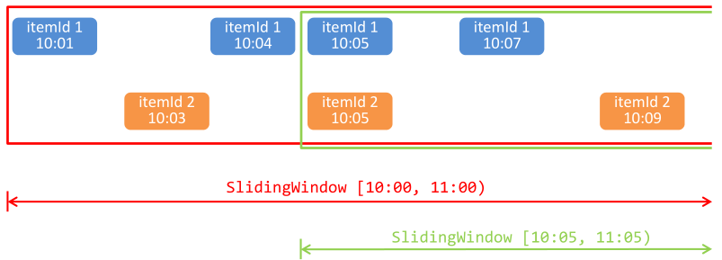
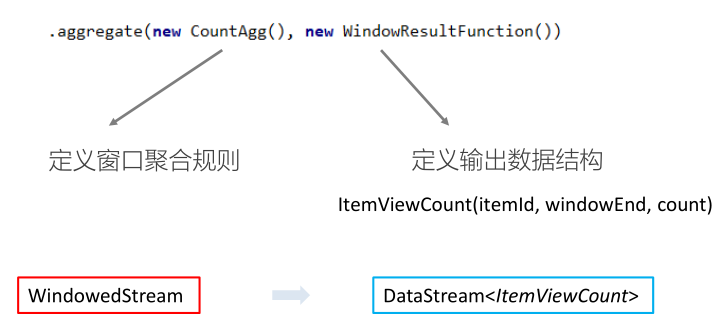
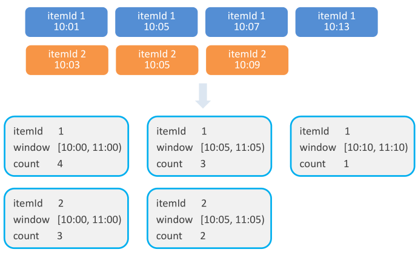
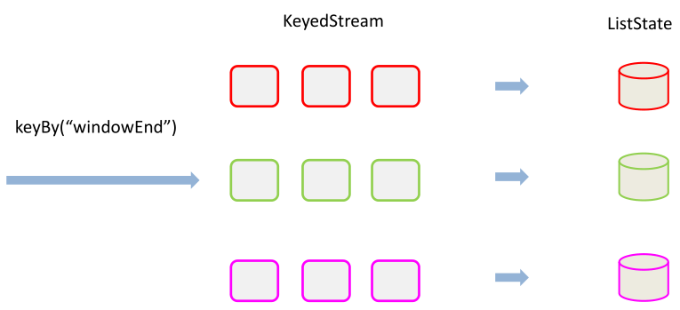
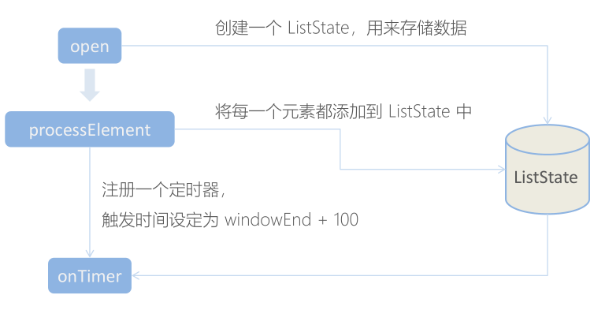

# 项目搭建

- 创建父项目UserBehaviorAnalysis

## 父pom

```xml
<?xml version="1.0" encoding="UTF-8"?>
<project xmlns="http://maven.apache.org/POM/4.0.0"
         xmlns:xsi="http://www.w3.org/2001/XMLSchema-instance"
         xsi:schemaLocation="http://maven.apache.org/POM/4.0.0 http://maven.apache.org/xsd/maven-4.0.0.xsd">
    <parent>
        <artifactId>big-data</artifactId>
        <groupId>com.stt.demo</groupId>
        <version>0.0.1</version>
        <relativePath>../../../pom.xml</relativePath>
    </parent>
    <modelVersion>4.0.0</modelVersion>

    <artifactId>UserBehaviorAnalysis</artifactId>
    <packaging>pom</packaging>

    <modules>
        <module>HotItemsAnalysis</module>
    </modules>

    <properties>
        <flink.version>1.7.2</flink.version>
        <scala.binary.version>2.11</scala.binary.version>
        <kafka.version>2.2.0</kafka.version>
    </properties>

    <dependencies>
        <dependency>
            <groupId>org.apache.flink</groupId>
            <artifactId>flink-scala_${scala.binary.version}</artifactId>
            <version>${flink.version}</version>
        </dependency>
        <dependency>
            <groupId>org.apache.flink</groupId>
            <artifactId>flink-streaming-scala_${scala.binary.version}</artifactId>
            <version>${flink.version}</version>
        </dependency>
        <dependency>
            <groupId>org.apache.kafka</groupId>
            <artifactId>kafka_${scala.binary.version}</artifactId>
            <version>${kafka.version}</version>
        </dependency>
        <dependency>
            <groupId>org.apache.flink</groupId>
            <!-- 使用kafka通用连接器 -->
            <artifactId>flink-connector-kafka_${scala.binary.version}</artifactId>
            <version>${flink.version}</version>
        </dependency>
        
    </dependencies>

    <build>
        <plugins>
            <!--  该插件用于将 Scala 代码编译成 class 文件  -->
            <plugin>
                <groupId>net.alchim31.maven</groupId>
                <artifactId>scala-maven-plugin</artifactId>
                <version>3.4.6</version>
                <executions>
                    <execution>
                        <!--  声明绑定到 maven 的 compile 阶段  -->
                        <goals>
                            <goal>testCompile</goal>
                        </goals>
                    </execution>
                </executions>
            </plugin>
            <plugin>
                <groupId>org.apache.maven.plugins</groupId>
                <artifactId>maven-assembly-plugin</artifactId>
                <version>3.0.0</version>
                <configuration>
                    <descriptorRefs>
                        <descriptorRef>
                            jar-with-dependencies
                        </descriptorRef>
                    </descriptorRefs>
                </configuration>
                <executions>
                    <execution>
                        <id>make-assembly</id>
                        <phase>package</phase>
                        <goals>
                            <goal>single</goal>
                        </goals>
                    </execution>
                </executions>
            </plugin>
        </plugins>
    </build>

</project>
```


## 创建UserBehavior项目


### 数据准备

- 将数据UserBehavior.csv放入到resources


# 热门实时商品统计

- 基本需求
  – 统计近1小时内的热门商品，每5分钟更新一次
  – 热门度用浏览次数（“pv”）来衡量

-  解决思路
  – 在所有用户行为数据中，过滤出浏览（“pv”）行为进行统计
  – 构建滑动窗口，窗口长度为1小时，滑动距离为5分钟


## 步骤

- 步骤1
  - 按照商品Id进行分区
  - keyBy("itemId")


- 步骤2

  - 设置时间窗口
  - timeWindow(Time.minutes(60),Time.minutes(5))

  
  - 时间窗口左闭右开
  - 同一份数据会分发到不同的窗口中

  

- 步骤3

  - 窗口聚合
  - aggregate(new CountAgg(),new WindowResultFunction())
    - CountAgg 定义窗口聚合规则
      - 每出现一条记录加一累计，在该记录对应的key的累加器上进行+1
    - WindowResultFunction 定义输出数据结构

  
  - 窗口聚合示例

  

- 步骤4

  - 统计整理
  - keyBy("windowEnd")

  

- 步骤5

  - 进行状态编程，排序输出

  
  - 最终排序输出 —— keyedProcessFunction
    - 针对有状态流的底层API
    - KeyedProcessFunction 会对分区后的**每一条子流**进行处理
    - 以 windowEnd 作为 key，保证分流以后每一条流的数据都在一个时间窗口内
    - 从 ListState 中读取当前流的状态，存储数据进行排序输出
  - 用 ProcessFunction 来定义 KeyedStream 的处理逻辑
  - 分流之后，每个 KeyedStream 都有其自己的生命周期
    - open：初始化，在这里可以获取当前流的状态
    - processElement：处理流中每一个元素时调用
    - onTimer：定时调用，注册定时器 Timer 并触发之后的回调操作

- 步骤6

  - 定时器排序
    - 定时器触发时，相当于收到了大于 windowEnd + 100 的 watermark
    - 可认为这时窗口已经收集到了所有数据，从 ListState 中读取进行处理

  


## 代码

```scala
package com.stt.flink

import java.sql.Timestamp

import org.apache.flink.api.common.functions.AggregateFunction
import org.apache.flink.api.common.state.{ListState, ListStateDescriptor}
import org.apache.flink.configuration.Configuration
import org.apache.flink.streaming.api.TimeCharacteristic
import org.apache.flink.streaming.api.functions.KeyedProcessFunction
import org.apache.flink.streaming.api.scala._
import org.apache.flink.streaming.api.scala.function.WindowFunction
import org.apache.flink.streaming.api.windowing.time.Time
import org.apache.flink.streaming.api.windowing.windows.TimeWindow
import org.apache.flink.util.Collector

import scala.collection.mutable.ListBuffer

// 输入数据样例类
case class UserBehavior(
                         userId: Long,
                         ItemId: Long,
                         categoryId: Int,
                         behavior: String,
                         timestamp: Long
                       )

// 窗口聚合输出样例类
case class ItemViewCount(
                          itemId: Long,
                          windowEnd: Long,
                          count: Long
                        )
/**
  * • 基本需求
    – 统计近1小时内的热门商品，每5分钟更新一次
    – 热门度用浏览次数（“pv”）来衡量
    • 解决思路
    – 在所有用户行为数据中，过滤出浏览（“pv”）行为进行统计
    – 构建滑动窗口，窗口长度为1小时，滑动距离为5分钟
  */
object HotItems {
  def main(args: Array[String]): Unit = {
    // 创建执行环境
    val env: StreamExecutionEnvironment = StreamExecutionEnvironment.getExecutionEnvironment
    env.setParallelism(1)

    env.setStreamTimeCharacteristic(TimeCharacteristic.EventTime)

    // 读取数据
    val dataStream: DataStream[String] =
      env.readTextFile(this.getClass.getClassLoader.getResource("UserBehavior.csv").getPath)

    //
    val userBehaviorDataStream = dataStream
      .map(data => {
        val fields = data.split(",")
        UserBehavior(
          fields(0).trim.toLong,
          fields(1).trim.toLong,
          fields(2).trim.toInt,
          fields(3).trim,
          fields(4).toLong
        )
      })
      .assignAscendingTimestamps(_.timestamp * 1000) // 由于是递增时间戳，使用递增timestamp即可

    // 对pv进行过滤
    val windowedStream: WindowedStream[UserBehavior, Long, TimeWindow] = userBehaviorDataStream
      .filter(_.behavior == "pv")
      .keyBy(_.ItemId)
      .timeWindow(Time.hours(1), Time.minutes(5)) // 进行开窗操作，1小时，5分钟滑动

    val itemViewCountDataStream: DataStream[ItemViewCount] = windowedStream
      .aggregate(new CountAgg(), new WindowResult())// 窗口聚合

    // itemViewCountDataStream 表示在该滑动窗口下所有的计数值
    val itemViewCountKeyedStream: KeyedStream[ItemViewCount, Long] = itemViewCountDataStream
      .keyBy(_.windowEnd) // 按照窗口分组，分成多条子流

    val result: DataStream[String] =itemViewCountKeyedStream
      .process(new TopNHotItems(3))// 进行排序

    result.print()

    env.execute("HotItems")
  }

  // 预聚合，每次来一个数据，进行累加，IN 输入类型 ACC 中间累加变量 OUT 输出类型
  // 按照相同的key，进行调用聚合
  class CountAgg() extends AggregateFunction[UserBehavior, Long, Long]{

    override def add(value: UserBehavior, accumulator: Long): Long = {
      accumulator + 1
    }

    override def createAccumulator(): Long = {
      0L
    }

    override def getResult(accumulator: Long): Long = {
      accumulator
    }

    // 2 个累加器处理
    override def merge(a: Long, b: Long): Long = {
      a + b
    }
  }

  // 自定义结果函数[IN, OUT, KEY, W <: Window]，输出结果
  // 注意KEY的类型由keyBy决定，如果是string类型，key使用tuple，使用的是Long类型，key使用Long
  class WindowResult() extends WindowFunction[Long, ItemViewCount, Long, TimeWindow]{
    override def apply(key: Long, 
                       window: TimeWindow, 
                       input: Iterable[Long], 
                       out: Collector[ItemViewCount]): Unit = {
//      out.collect(ItemViewCount(key,window.getEnd,input.iterator.next()))
      out.collect(ItemViewCount(key,window.getEnd,input.sum))
    }
  }

  // 自定义处理函数 K,I,O
  class TopNHotItems(n: Int) 
    extends KeyedProcessFunction[Long,ItemViewCount,String]{

    var itemState: ListState[ItemViewCount] = _

    override def open(parameters: Configuration): Unit = {
      itemState = getRuntimeContext.getListState(
        new ListStateDescriptor[ItemViewCount]("item-state",classOf[ItemViewCount])
      )
    }
    override def processElement(value: ItemViewCount,
                    ctx: KeyedProcessFunction[Long, ItemViewCount, String]#Context,
                                out: Collector[String]): Unit = {
      // 将每条数据存入状态列表
      itemState.add(value)
      // 注册一个定时器
      // 注意：在该窗口结束后+1ms开始计算统计排序的值，每个值有该窗口结束的时间
      // 相同的定时器，不会触发多次，内部是一个优先级队列，使用timestamp作为比较参数
      // 定时器的触发基于下一个watermark的到来
      ctx.timerService().registerEventTimeTimer(value.windowEnd+1)

    }

    // 定时器触发时，对所有数据排序，并输出结果
    override def onTimer(timestamp: Long,
                         ctx: KeyedProcessFunction[Long, ItemViewCount, String]#OnTimerContext,
                         out: Collector[String]): Unit = {

      println("#######"+timestamp)

      // 将所有state中的数据取出，放到list buffer中
      val allItems : ListBuffer[ItemViewCount] = new ListBuffer()
      // 支持集合的遍历操作
      import scala.collection.JavaConversions._
      for(item <- itemState.get()){
        allItems += item
      }

      // 按照count大小排序
      val TopN: ListBuffer[ItemViewCount] = allItems.sortBy(_.count)(Ordering.Long.reverse).take(n)

      // 清空状态
      itemState.clear()

      // 结果输出
      val result = new StringBuilder()
      result.append("时间：").append(new Timestamp(timestamp-1)).append("\n")
      // 输出每一个商品的信息
      for(i <- TopN.indices){
        val currentItem = TopN(i)
        result.append("No").append(i+1).append(":")
          .append("商品id=").append(currentItem.itemId)
          .append("浏览量=").append(currentItem.count)
          .append("\n")
      }
      result.append("======================")
      // 控制输出频率，测试显示使用
      Thread.sleep(1000)
      out.collect(result.toString())
    }
  }
}
```

- 使用kafka作为数据源

```scala
// 读取数据 从kafka中读取数据
val dataStream: DataStream[String] = env.addSource(
    new FlinkKafkaConsumer[String](
        "hotitems",
        new SimpleStringSchema(),
        new Properties() {
            {
                put("bootstrap.servers", "hadoop102:9092")
                put("group.id", "consumer-group")
                put("key.deserializer", classOf[StringDeserializer])
                put("value.deserializer", classOf[StringDeserializer])
                put("auto.offset.reset", "latest")
            }
        }
    )
)
```

- 创建topic

```bash
[ttshe@hadoop102 kafka]$ bin/kafka-topics.sh --zookeeper hadoop102:2181 --create --topic hotitems --partitions 1 --replication-factor 1
Created topic "hotitems".
```

- 发送消息

```bash
[ttshe@hadoop102 kafka]$ bin/kafka-console-producer.sh --broker-list hadoop102:9092 --topic hotItems
>543462,1715,1464116,pv,1511658000
>935955,1955883,703852,pv,1511658060
>1011132,239212,982926,pv,1511658120
>803055,425789,2465336,pv,1511658180
>685512,2427331,1568197,pv,1511658240
>596682,2655937,4962280,pv,1511658300
>932489,3413316,1789614,pv,1511658330
>698998,3656623,2920476,pv,1511658540
```

- 结果

```scala
kafka> 543462,1715,1464116,pv,1511658000
kafka> 935955,1955883,703852,pv,1511658060
kafka> 1011132,239212,982926,pv,1511658120
kafka> 803055,425789,2465336,pv,1511658180
kafka> 685512,2427331,1568197,pv,1511658240
kafka> 596682,2655937,4962280,pv,1511658300
kafka> 932489,3413316,1789614,pv,1511658330
#######1511658300001
时间：2017-11-26 09:05:00.0
No1:商品id=1715浏览量=1
No2:商品id=239212浏览量=1
No3:商品id=1955883浏览量=1
======================
kafka> 698998,3656623,2920476,pv,1511658540
```

- 使用自定义kafka发送者读取csv文件发送消息
  - 一般做测试使用

```scala
package com.stt.flink

import java.io.File
import java.util

import org.apache.commons.io.FileUtils
import org.apache.kafka.clients.producer.{KafkaProducer, ProducerRecord}
import org.apache.kafka.common.serialization.StringSerializer


object KafkaProducerForTestHotItems {

  def main(args: Array[String]): Unit = {

   var producer = new KafkaProducer[String,String](new util.HashMap[String,Object](){{
     put("bootstrap.servers", "hadoop102:9092")
     put("acks","all")
     put("retries","1")
     put("batch.size","16384")
     put("linger.ms","1")
     put("buffer.memory","33554432")
     put("key.serializer", classOf[StringSerializer])
     put("value.serializer", classOf[StringSerializer])
   }})

      // 写法1
//    val datas: util.List[String] = FileUtils.readLines(new File(this.getClass.getClassLoader.getResource("UserBehavior.csv").getPath))
//
//    import scala.collection.JavaConversions._
//
//    for(data <- datas){
//      producer.send(new ProducerRecord[String,String]("hotItems",data))
//    }

   // 写法2
   scala.io.Source.fromFile(this.getClass.getClassLoader.getResource("UserBehavior.csv").toURI).getLines().foreach(
      data => {
        producer.send(new ProducerRecord[String,String]("hotItems",data))
      }
    )
    
    producer.close()
  }

}
```


# 实时流量统计


## 热门页面


- 基本需求
  - 从web服务器的日志中，统计实时的热门访问页面
  - 统计每分钟的ip访问量，取出访问量最大的5个地址，每5秒更新一次
- 解决思路
  - 将 apache 服务器日志中的时间，转换为时间戳，作为 Event Time
  - 构建滑动窗口，窗口长度为1分钟，滑动距离为5秒


```scala
package com.stt.flink.T02

import java.time.format.DateTimeFormatter
import java.time.{LocalDateTime, ZoneOffset}

import org.apache.flink.api.common.functions.AggregateFunction
import org.apache.flink.api.common.state.{ListState, ListStateDescriptor}
import org.apache.flink.streaming.api.TimeCharacteristic
import org.apache.flink.streaming.api.functions.KeyedProcessFunction
import org.apache.flink.streaming.api.functions.timestamps.BoundedOutOfOrdernessTimestampExtractor
import org.apache.flink.streaming.api.scala.function.WindowFunction
import org.apache.flink.streaming.api.scala.{DataStream, KeyedStream, StreamExecutionEnvironment, WindowedStream,_}
import org.apache.flink.streaming.api.windowing.time.Time
import org.apache.flink.streaming.api.windowing.windows.TimeWindow
import org.apache.flink.util.Collector

import scala.collection.mutable.ListBuffer


case class ApacheLogEvent(
                         ip:String,
                         userId:String,
                         eventTime:Long,
                         method: String,
                         url: String
                         )

// 窗口聚合样例类
case class UrlViewCount(
                       url:String,
                       windowEnd: Long,
                       count: Long
                       )

/**
  * - 基本需求
    - 从web服务器的日志中，统计实时的热门访问页面
    - 统计每分钟的ip访问量，取出访问量最大的5个地址，每5秒更新一次
  - 解决思路
    - 将 apache 服务器日志中的时间，转换为时间戳，作为 Event Time
    - 构建滑动窗口，窗口长度为1分钟，滑动距离为5秒
  */

object NetworkFlow {

  def main(args: Array[String]): Unit = {
    val env = StreamExecutionEnvironment.getExecutionEnvironment
    env.setParallelism(1)
    env.setStreamTimeCharacteristic(TimeCharacteristic.EventTime)

    val dataStream: DataStream[String] = env
      .readTextFile(this.getClass.getClassLoader.getResource("apache.log").getPath)

    // 提取数据，转换数据
    val eventLogDataStream: DataStream[ApacheLogEvent] = dataStream.map(
      data => {
        val fields: Array[String] = data.split("\\s+")

        val timestamp = LocalDateTime
          .parse(fields(3), DateTimeFormatter.ofPattern("dd/MM/yyyy:HH:mm:ss"))
          .toInstant(ZoneOffset.ofHours(-8))
          .toEpochMilli

        ApacheLogEvent(fields(0).trim, fields(1).trim, timestamp, fields(5).trim, fields(6).trim)
      }
    ).assignTimestampsAndWatermarks( // 由于日志的时间是乱序的，需要使用watermark，需要按照经验设置延时大小
      new BoundedOutOfOrdernessTimestampExtractor[ApacheLogEvent](Time.seconds(1)) {
        override def extractTimestamp(element: ApacheLogEvent): Long = {
          element.eventTime
        }
      }
    )

    // 开辟窗口
    val eventWindowStream: WindowedStream[ApacheLogEvent, String, TimeWindow] = eventLogDataStream
      .keyBy(_.url)
      .timeWindow(Time.seconds(10), Time.seconds(5))
      .allowedLateness(Time.seconds(60))     // 允许获取迟到60s的数据

    // 进行聚合操作
    val aggDataStream: DataStream[UrlViewCount] = eventWindowStream
      .aggregate(new CountAggForEventLog(),new WindowResult())

    // 进行分组操作排序
    val value: KeyedStream[UrlViewCount, Long] = aggDataStream
      .keyBy(_.windowEnd)

    value.process(new TopNProcess(3)).print("result")

    env.execute("NetworkFlow")
  }

  class CountAggForEventLog() extends AggregateFunction[ApacheLogEvent,Long,Long]{
    override def add(value: ApacheLogEvent, accumulator: Long): Long = accumulator + 1
    override def createAccumulator(): Long = 0L
    override def getResult(accumulator: Long): Long = accumulator
    override def merge(a: Long, b: Long): Long = a + b
  }

// IN, OUT, KEY, W <: Window
  class WindowResult() extends WindowFunction[Long,UrlViewCount,String,TimeWindow]{
    override def apply(key: String, window: TimeWindow, input: Iterable[Long],
                       out: Collector[UrlViewCount]): Unit = {
      out.collect(UrlViewCount(key,window.getEnd,input.sum))
    }
  }

  // K I O key是windowEnd 是Long类型
  class TopNProcess(n: Int) extends KeyedProcessFunction[Long,UrlViewCount,String]{

    lazy val listState : ListState[UrlViewCount] =  getRuntimeContext.getListState(
      new ListStateDescriptor[UrlViewCount]("list-state",classOf[UrlViewCount])
    )

    override def processElement(value: UrlViewCount,
                                ctx: KeyedProcessFunction[Long, UrlViewCount, String]#Context,
                                out: Collector[String]): Unit = {

      listState.add(value)
      ctx.timerService().registerEventTimeTimer(value.windowEnd + 1)
    }

    override def onTimer(timestamp: Long,
                         ctx: KeyedProcessFunction[Long, UrlViewCount, String]#OnTimerContext,
                         out: Collector[String]): Unit = {

      var buffer:ListBuffer[UrlViewCount] = new ListBuffer()
      var result = new StringBuilder("时间：").append(timestamp - 1).append("\n")

      val iter = listState.get().iterator()
      while(iter.hasNext){
        buffer+=iter.next()
      }

      listState.clear()

      buffer.sortWith(_.count > _.count).take(n).foreach(item => {
        result.append("url:").append(item.url)
          .append(" count:").append(item.count).append("\n")
      })

      Thread.sleep(1000)

      out.collect(result.toString())
    }
  }
}
```


## PV 统计

- pv
  - 网站的页面浏览量（Page View，PV）
  - 用户浏览页面时，会从浏览器向网络服务器发出一个请求（Request），网络服务器接到这个请求后，会将该请求对应的一个网页（Page）发送给浏览器，从而产生了一个 PV

- 基本需求
  – 从埋点日志中，统计实时的 PV 和 UV
  – 统计每小时的访问量（PV），并且对用户进行去重（UV）
  - PV 滚动窗口1小时
  - 需要对用户进行去重，在1个小时内
- 解决思路
  – 统计埋点日志中的 pv 行为，利用 Set 数据结构进行去重
  – 对于超大规模的数据，可考虑用**布隆过滤器**进行去重

```scala
package com.stt.flink.T02

import com.stt.flink.T01.UserBehavior
import org.apache.flink.streaming.api.TimeCharacteristic
import org.apache.flink.streaming.api.scala.{DataStream, StreamExecutionEnvironment,_}
import org.apache.flink.streaming.api.windowing.time.Time

object PageView {

  def main(args: Array[String]): Unit = {
    val env = StreamExecutionEnvironment.getExecutionEnvironment
    env.setParallelism(1)
    env.setStreamTimeCharacteristic(TimeCharacteristic.EventTime)

    val dataStream: DataStream[String] = env
      .readTextFile(this.getClass.getClassLoader.getResource("UserBehavior.csv").getPath)

    val pvDStream = dataStream
      .map(data => {
        val fields = data.split(",")
        UserBehavior(
          fields(0).trim.toLong,
          fields(1).trim.toLong,
          fields(2).trim.toInt,
          fields(3).trim,
          fields(4).toLong
        )
      }).assignAscendingTimestamps(_.timestamp * 1000)
      .filter(_.behavior == "pv") // 只统计pv操作
      .map(data => ("pv", 1))
      .keyBy(_._1) // 此处key的操作是为了开窗使用，哑key
      .timeWindow(Time.hours(1))
      .sum(1)

    pvDStream.print("pv")

    env.execute("PageView")
  }
}
```


## UV 统计

- pv同一用户的浏览行为会被重复统计

- 在实际应用中，我们往往还会关注，在一段时间内到底有多少不同的用户访问了网站。另外一个统计流量的重要指标是网站的独立访客数（Unique Visitor，UV）
- UV指的是一段时间（比如一小时）内访问网站的总人数，1 天内同一访客的多次访问只记录为一个访客
- 通过 IP 和 cookie 一般是判断 UV 值的两种方式。当客户端第一次访问某个网站服务器的时候，网站服务器会给这个客户端的电脑发出一个 Cookie，通常放在这个客户端电脑的 C盘当中。在这个 Cookie 中会分配一个独一无二的编号，这其中会记录一些访问服务器的信息，如访问时间，访问了哪些页面等等。当你下次再访问这服务器的时候，服务器就可以直接从你的电脑中找到上一次放进去的Cookie 文件，并且对其进行一些更新，但那个独一无二的编号是不会变的
- 对于 UserBehavior 数据源来说，我们直接可以根据 userId 来区分不同的用户
- 基于pv，对重复操作去重，得到uv

```scala
package com.stt.flink.T02

import com.stt.flink.T01.UserBehavior
import org.apache.flink.streaming.api.TimeCharacteristic
import org.apache.flink.streaming.api.scala.function.AllWindowFunction
import org.apache.flink.streaming.api.scala.{DataStream, StreamExecutionEnvironment, _}
import org.apache.flink.streaming.api.windowing.time.Time
import org.apache.flink.streaming.api.windowing.windows.TimeWindow
import org.apache.flink.util.Collector

import scala.collection.mutable

case class UVCount(
                    windowEnd: Long,
                    uvCount: Long
                  )
/**
  * 使用set的方式进行过滤
  */
object UniqueVisitor {

  def main(args: Array[String]): Unit = {
    val env = StreamExecutionEnvironment.getExecutionEnvironment
    env.setParallelism(1)
    env.setStreamTimeCharacteristic(TimeCharacteristic.EventTime)

    val dataStream: DataStream[String] = env
      .readTextFile(this.getClass.getClassLoader.getResource("UserBehavior.csv").getPath)

    val uvDStream = dataStream
      .map(data => {
        val fields = data.split(",")
        UserBehavior(
          fields(0).trim.toLong,
          fields(1).trim.toLong,
          fields(2).trim.toInt,
          fields(3).trim,
          fields(4).toLong
        )
      }).assignAscendingTimestamps(_.timestamp * 1000)
      .filter(_.behavior == "pv") // 只统计pv操作
      .timeWindowAll(Time.hours(1))
      .apply(new UVCountProcess())

    uvDStream.print("uv")

    env.execute("UniqueVisitor")
  }

  // 没有进行key操作，同时对所有窗口内元素进行操作
  class UVCountProcess() extends AllWindowFunction[UserBehavior,UVCount,TimeWindow]{
    override def apply(window: TimeWindow,
                       input: Iterable[UserBehavior],
                       out: Collector[UVCount]): Unit = {
      // 定义一个set ,进行去重，保存所有的userId，最后输出set的大小
      val set = mutable.Set[Long]()
      val iter = input.iterator
      while (iter.hasNext){
        set += iter.next().userId
      }
      out.collect(UVCount(window.getEnd,set.size))
    }
  }
}
```


## 布隆过滤器实现UV统计

- 当user数量很大，那么set就不合适了
  - 如果使用redis? 在某些情况下可以，但是极端情况，几亿的user数据量也不行
- 需要使用布隆过滤器进行过滤
  - 将数据进行压缩，==位图存储==，一位表示某个字段是否存在
  - 如何定位到这个位，使用hash
    - 存在一个问题，hash碰撞
    - 如何设计hash函数式关键
- 引入redis，将位图存储在redis中
  - 因为考虑到数据量很大，每个窗口存不下，同时每来一条在redis进行过滤处理

```xml
<dependencies>
    <dependency>
        <groupId>redis.clients</groupId>
        <artifactId>jedis</artifactId>
        <version>2.8.1</version>
    </dependency>
</dependencies>
```

- 代码

```scala
package com.stt.flink.T02

import java.lang

import com.stt.flink.T01.UserBehavior
import org.apache.flink.streaming.api.TimeCharacteristic
import org.apache.flink.streaming.api.scala.function.ProcessWindowFunction
import org.apache.flink.streaming.api.scala.{DataStream, StreamExecutionEnvironment, _}
import org.apache.flink.streaming.api.windowing.time.Time
import org.apache.flink.streaming.api.windowing.triggers.{Trigger, TriggerResult}
import org.apache.flink.streaming.api.windowing.windows.TimeWindow
import org.apache.flink.util.Collector
import redis.clients.jedis.Jedis

/**
  * 使用布隆过滤器的方式进行过滤
  * 将位图存储在redis中
  */
object UVWithBloom {

  def main(args: Array[String]): Unit = {
    val env = StreamExecutionEnvironment.getExecutionEnvironment
    env.setParallelism(1)
    env.setStreamTimeCharacteristic(TimeCharacteristic.EventTime)

    val dataStream: DataStream[String] = env
      .readTextFile(this.getClass.getClassLoader.getResource("UserBehavior.csv").getPath)

    val uvDStream = dataStream
      .map(data => {
        val fields = data.split(",")
        UserBehavior(
          fields(0).trim.toLong,
          fields(1).trim.toLong,
          fields(2).trim.toInt,
          fields(3).trim,
          fields(4).toLong
        )
      }).assignAscendingTimestamps(_.timestamp * 1000)
      .filter(_.behavior == "pv") // 只统计pv操作
      .map(data => ("dummyKey",data.userId))
      .keyBy(_._1)
      .timeWindow(Time.hours(1))
      .trigger(new MyTrigger()) // 触发窗口操作
      .process(new UVCountWithBloom())

    uvDStream.print("uv")

    env.execute("UVWithBloom")
  }

  class MyTrigger() extends Trigger[(String,Long),TimeWindow]{
    // 窗口的EventTime定时器触发时调用onEventTime
    override def onEventTime(time: Long,
                             window: TimeWindow,
                             ctx: Trigger.TriggerContext): TriggerResult = {
        TriggerResult.CONTINUE
    }

    override def onProcessingTime(time: Long,
                                  window: TimeWindow,
                                  ctx: Trigger.TriggerContext): TriggerResult = {
        TriggerResult.CONTINUE
    }

    override def clear(window: TimeWindow,
                       ctx: Trigger.TriggerContext): Unit = {}

    // 每个数据到达窗口后触发该方法
    override def onElement(element: (String, Long),
                           timestamp: Long,
                           window: TimeWindow,
                           ctx: Trigger.TriggerContext): TriggerResult = {
       // 直接触发窗口进行计算，并清空所有窗口状态
      // 窗口中的状态无法存储
      TriggerResult.FIRE_AND_PURGE
    }
  }

  // 定义一个bloom过滤器
  class Bloom(size: Long) extends Serializable{
    // 位图的总大小 2^27 = 134217728 一亿三千万
    // 2^4*2^3*2^10*2^10 = 16MB
    private val cap = if ( size > 0 ) size else 1 << 27  // 默认16M

    // 定义hash函数,seed一般是质数
    def hash(value:String, seed:Int):Long = {
      var result : Long = 0L
      // 使用字符的累加值得到hash
      for(i<- 0 until value.length){
        result = result * seed + value.charAt(i)
      }
      // 获取 rresult 后 27 位值
      result & (cap -1)
    }
  }

  //[IN, OUT, KEY, W <: Window]
  class UVCountWithBloom() extends ProcessWindowFunction[(String,Long),UVCount,String,TimeWindow]{

    lazy val jedis = new Jedis("hadoop102",6379)
    lazy val bloom = new Bloom(1 << 29) // 64M 5亿的数据

    override def process(key: String,
                         context: Context,
                         elements: Iterable[(String, Long)],
                         out: Collector[UVCount]): Unit = {
      // 位图的存储方式
      // 每个窗口一个位图，key是windowEnd,value是bitmap
      val storeKey = context.window.getEnd.toString

      // 用布隆过滤器判断是否存在
      val userId = elements.head._2.toString
      val offset = bloom.hash(userId,67)

      // 从位图中查找是否存在
      val isExist: lang.Boolean = jedis.getbit(storeKey,offset)

      if(!isExist){

        // 位图的位置设置为1
        jedis.setbit(storeKey,offset,true)

        // 将每个窗口的结果存储到redis中,要先从redis中hash读取
        // count + 1
        val count: lang.Long = jedis.hincrBy("count",storeKey,1)

        out.collect(UVCount(storeKey.toLong,count))
      }else{
        out.collect(UVCount(storeKey.toLong,jedis.hget("count",storeKey).toLong))
      }
    }
  }
}
```


# 市场营销分析

继续在 UserBehaviorAnalysis 下新建一个 maven module 作为子项目，命名为MarketAnalysis。
这个模块中我们没有现成的数据，所以会用自定义的测试源来产生测试数据流，或者直接用生成测试数据文件


##  APP市场推广统计

- 基本需求
  – 从埋点日志中，统计 APP 市场推广的数据指标
  – 按照不同的推广渠道，分别统计数据
- 解决思路
  – 通过过滤日志中的用户行为，按照不同的渠道进行统计
  – 可以用 process function 处理，得到自定义的输出数据信息
- 自定义测试数据源


### 分渠道统计

- 细分行为和渠道
  - 使用全量的方式，简单

```scala
package com.stt.flink.T03_MarketAnalysis

import java.util.UUID
import java.util.concurrent.TimeUnit

import org.apache.flink.streaming.api.TimeCharacteristic
import org.apache.flink.streaming.api.functions.source.{RichSourceFunction, SourceFunction}
import org.apache.flink.streaming.api.scala.function.ProcessWindowFunction
import org.apache.flink.streaming.api.scala.{DataStream, StreamExecutionEnvironment,_}
import org.apache.flink.streaming.api.windowing.time.Time
import org.apache.flink.streaming.api.windowing.windows.TimeWindow
import org.apache.flink.util.Collector

import scala.util.Random

// 输入数据
case class MarketingUserBehavior(
                                  userId: String,
                                  behavior: String,
                                  channel: String,
                                  timestamp: Long
                                )

// 自定义数据源
class SimulatedEventSource() extends RichSourceFunction[MarketingUserBehavior]{

  var flag = true

  val behaviorTypes = Seq("CLICK","DOWNLOAD","INSTALL","UNINSTALL")
  val channelTypes = Seq("wechat","weibo","appstore","huaweistore")
  val rand = new Random()

  override def cancel() = flag = false

  override def run(ctx: SourceFunction.SourceContext[MarketingUserBehavior]) = {
    // 定义一个生成数据的上限
    val maxElement = Long.MaxValue
    var count = 0L

    // 随机生成有效数据
    while(flag && count < maxElement){
      val uuid = UUID.randomUUID().toString
      val behavior = behaviorTypes(rand.nextInt(behaviorTypes.size))
      val channel = channelTypes(rand.nextInt(channelTypes.size))
      val ts = System.currentTimeMillis()

      ctx.collect(MarketingUserBehavior(uuid,behavior,channel,ts))
      count += 1
      TimeUnit.MILLISECONDS.sleep(10)
    }
  }
}

// 输出数据
case class MarketingViewCount(
                               windowStart: String,
                               windowEnd: String,
                               channel: String,
                               behavior: String,
                               count: Long
                             )

//- 基本需求
//– 从埋点日志中，统计 APP 市场推广的数据指标
//– 按照不同的推广渠道，分别统计数据
//- 解决思路
//– 通过过滤日志中的用户行为，按照不同的渠道进行统计
//– 可以用 process function 处理，得到自定义的输出数据信息
object AppMarketingByChannel {

  def main(args: Array[String]): Unit = {
    val env = StreamExecutionEnvironment.getExecutionEnvironment
    env.setParallelism(1)
    env.setStreamTimeCharacteristic(TimeCharacteristic.EventTime)

    val dataStream: DataStream[MarketingUserBehavior] = env.addSource(new SimulatedEventSource())
      .assignAscendingTimestamps(_.timestamp)

    dataStream
      .filter(_.behavior != "UNINSTALL")
      .map(data => ((data.behavior,data.channel),1L))
      .keyBy(_._1)
      .timeWindow(Time.hours(1),Time.seconds(5))
      .process(new MarketingProcess()) // 全量统计
      .print("re")

    env.execute("AppMarketingByChannel")

  }

  // [IN, OUT, KEY, W <: Window]
  class MarketingProcess() extends ProcessWindowFunction[((String,String),Long),MarketingViewCount,(String,String),TimeWindow]{

    override def process(key: (String, String),
                         context: Context,
                         elements: Iterable[((String, String), Long)],
                         out: Collector[MarketingViewCount]): Unit = {
        out.collect(
          MarketingViewCount(
            context.window.getStart.toString,
            context.window.getEnd.toString,
            key._2,
            key._1,
            elements.size
          )
        )
    }
  }
}
```


### 总量统计

- 整体统计
  - 使用增量的方式，减少内存

```scala
package com.stt.flink.T03_MarketAnalysis

import org.apache.flink.api.common.functions.AggregateFunction
import org.apache.flink.streaming.api.TimeCharacteristic
import org.apache.flink.streaming.api.scala.function.WindowFunction
import org.apache.flink.streaming.api.scala.{DataStream, StreamExecutionEnvironment, _}
import org.apache.flink.streaming.api.windowing.time.Time
import org.apache.flink.streaming.api.windowing.windows.TimeWindow
import org.apache.flink.util.Collector


//- 基本需求
//– 从埋点日志中，统计 APP 市场推广的数据指标
//– 按照不同的推广渠道，分别统计数据
//- 解决思路
//– 通过过滤日志中的用户行为，按照不同的渠道进行统计
//– 可以用 process function 处理，得到自定义的输出数据信息
object AppMarketing {

  def main(args: Array[String]): Unit = {
    val env = StreamExecutionEnvironment.getExecutionEnvironment
    env.setParallelism(1)
    env.setStreamTimeCharacteristic(TimeCharacteristic.EventTime)

    val dataStream: DataStream[MarketingUserBehavior] = env.addSource(new SimulatedEventSource())
      .assignAscendingTimestamps(_.timestamp)

    dataStream
      .filter(_.behavior != "UNINSTALL")
      .map(data => ("dummyKey", 1L))
      .keyBy(_._1)
      .timeWindow(Time.hours(1), Time.seconds(5))
      .aggregate(new CountProcess(), new MarketingProcess()) // 预聚合，增量聚合
      .print("re")

    env.execute("AppMarketing")

  }

  class CountProcess() extends AggregateFunction[(String, Long), Long, Long] {
    override def add(value: (String, Long), accumulator: Long): Long = accumulator + 1

    override def createAccumulator(): Long = 0L

    override def getResult(accumulator: Long): Long = accumulator

    override def merge(a: Long, b: Long): Long = a + b
  }

  //<IN, OUT, KEY, W extends Window>
  class MarketingProcess() extends WindowFunction[Long, MarketingViewCount, String, TimeWindow] {
    override def apply(key: String,
                       window: TimeWindow,
                       input: Iterable[Long],
                       out: Collector[MarketingViewCount]): Unit = {
      out.collect(
        MarketingViewCount(
          window.getStart.toString,
          window.getEnd.toString,
          "app",
          "total",
          input.sum
        )
      )

    }
  }
}
```


## 页面广告统计

电商网站的市场营销商业指标中，除了自身的 APP 推广，还会考虑到页面上的
广告投放（包括自己经营的产品和其它网站的广告）。所以广告相关的统计分析，
也是市场营销的重要指标。
对于广告的统计，最简单也最重要的就是页面广告的点击量，网站往往需要根
据广告点击量来制定定价策略和调整推广方式，而且也可以借此收集用户的偏好信
息。更加具体的应用是，我们可以根据用户的地理位置进行划分，从而总结出不同
省份用户对不同广告的偏好，这样更有助于广告的精准投放。


- 基本需求
  – 从埋点日志中，统计每小时页面广告的点击量，5秒刷新一次，并按照不同省
  份进行划分
  – 对于“刷单”式的频繁点击行为进行过滤，并将该用户加入黑名单
- 解决思路
  – 根据省份进行分组，创建长度为1小时、滑动距离为5秒的时间窗口进行统计
  – 可以用 process function 进行黑名单过滤，检测用户对同一广告的点击量，
  如果超过上限则将用户信息以侧输出流输出到黑名单中


### 广告点击量统计

接下来我们就进行页面广告按照省份划分的点击量的统计。在 src/main/scala 下
创建 AdStatisticsByGeo.scala 文件。同样由于没有现成的数据，我们定义一些测试数
据，放在 AdClickLog.csv 中，用来生成用户点击广告行为的事件流。
在代码中我们首先定义源数据的样例类 AdClickLog，以及输出统计数据的样例
类 CountByProvince。主函数中先以 province 进行 keyBy，然后开一小时的时间窗口，
滑动距离为 5 秒，统计窗口内的点击事件数量。具体代码实现如下

```scala
package com.stt.flink.T03_MarketAnalysis

import org.apache.flink.api.common.functions.AggregateFunction
import org.apache.flink.streaming.api.TimeCharacteristic
import org.apache.flink.streaming.api.scala._
import org.apache.flink.streaming.api.scala.StreamExecutionEnvironment
import org.apache.flink.streaming.api.scala.function.{ProcessWindowFunction, WindowFunction}
import org.apache.flink.streaming.api.windowing.time.Time
import org.apache.flink.streaming.api.windowing.windows.TimeWindow
import org.apache.flink.util.Collector


// 输入样例类
case class AdClientEvent(
                          userId: Long,
                          adId: Long,
                          province: String,
                          city: String,
                          timestamp: Long
                        )
// 输出样例类
case class AdCountByProvince(
                              province: String,
                              count: Long,
                              windowEnd: Long
                            )
object AdStatisticsByGeo {
  def main(args: Array[String]): Unit = {

    val env = StreamExecutionEnvironment.getExecutionEnvironment
    env.setParallelism(2)
    env.setStreamTimeCharacteristic(TimeCharacteristic.EventTime)

    var resource = this.getClass.getClassLoader.getResource("AdClickLog.csv")

    val windowedStream: WindowedStream[AdClientEvent, String, TimeWindow] = env.readTextFile(resource.getPath)
      .map(data => {
        val fields = data.split(",")
        AdClientEvent(
          fields(0).trim.toLong,
          fields(1).trim.toLong,
          fields(2).trim,
          fields(3).trim,
          fields(4).trim.toLong
        )
      }).assignAscendingTimestamps(_.timestamp)
      .keyBy(_.province)
      .timeWindow(Time.hours(1), Time.seconds(5))

    windowedStream.process(new AdClickProcess())
      .print("re1")// 全量统计
    windowedStream.aggregate(new AdCountAgg(),new AdWindowResult())
      .print("re2")// 增量统计

    env.execute("AdStatisticsByGeo")
  }

  class AdClickProcess() extends ProcessWindowFunction[AdClientEvent,AdCountByProvince,String,TimeWindow]{
    override def process(key: String,
                         context: Context,
                         elements: Iterable[AdClientEvent],
                         out: Collector[AdCountByProvince]): Unit = {
      out.collect(AdCountByProvince(
        key,
        elements.size,
        context.window.getEnd
      ))
    }
  }


  class AdCountAgg() extends AggregateFunction[AdClientEvent,Long,Long]{
    override def add(value: AdClientEvent, accumulator: Long): Long = accumulator + 1
    override def createAccumulator(): Long = 0L
    override def getResult(accumulator: Long): Long = accumulator
    override def merge(a: Long, b: Long): Long = a + b
  }

  class AdWindowResult() extends WindowFunction[Long,AdCountByProvince,String,TimeWindow]{
    override def apply(key: String,
                       window: TimeWindow,
                       input: Iterable[Long],
                       out: Collector[AdCountByProvince]): Unit = {
//     if(input.size != 1){
//       println("==========")
//       println(key)
//       input.foreach(println)
//       println("==========")
//     }

      out.collect(AdCountByProvince(
        key,
        input.sum,
        window.getEnd
      ))
    }
  }
}
```


### 黑名单过滤

上节我们进行的点击量统计，同一用户的重复点击是会叠加计算的。在实际场
景中，同一用户确实可能反复点开同一个广告，这也说明了用户对广告更大的兴趣；
但是如果用户在一段时间非常频繁地点击广告，这显然不是一个正常行为，有刷点
击量的嫌疑。所以我们可以对一段时间内（比如一天内）的用户点击行为进行约束，
如果对同一个广告点击超过一定限额（比如 100 次），应该把该用户加入黑名单并
报警，此后其点击行为不应该再统计

```scala
package com.stt.flink.T03_MarketAnalysis

import java.time._

import com.stt.flink.T03_MarketAnalysis.AdStatisticsByGeo.{AdCountAgg, AdWindowResult}
import org.apache.flink.api.common.state.{ValueState, ValueStateDescriptor}
import org.apache.flink.streaming.api.TimeCharacteristic
import org.apache.flink.streaming.api.functions.KeyedProcessFunction
import org.apache.flink.streaming.api.scala.{StreamExecutionEnvironment, _}
import org.apache.flink.streaming.api.windowing.time.Time
import org.apache.flink.util.Collector


// 黑名单的报警信息
case class BlackListWaring(
                            userId: Long,
                            adId: Long,
                            msg: String
                          )
/**
  * 针对大量刷单，需要过滤
  */
object AdStatisticsByGeoBlacklist {

  // 侧输出流tag，得到当前的黑名单
  val blackListOutputTag = new OutputTag[BlackListWaring]("blackList")

  def main(args: Array[String]): Unit = {

    val env = StreamExecutionEnvironment.getExecutionEnvironment
    env.setParallelism(1)
    env.setStreamTimeCharacteristic(TimeCharacteristic.EventTime)

    var resource = this.getClass.getClassLoader.getResource("AdClickLog.csv")

    val dataStream: DataStream[AdClientEvent] = env.readTextFile(resource.getPath)
      .map(data => {
        val fields = data.split(",")
        AdClientEvent(
          fields(0).trim.toLong,
          fields(1).trim.toLong,
          fields(2).trim,
          fields(3).trim,
          fields(4).trim.toLong
        )
      }).assignAscendingTimestamps(_.timestamp * 1000)

    val filterDataStream: DataStream[AdClientEvent] = dataStream
      .keyBy(data => (data.userId, data.adId))
      .process(new FilterBlackListUser(100))// 进行过滤

    filterDataStream
      .keyBy(_.province)
      .timeWindow(Time.hours(1),Time.seconds(5))
      .aggregate(new AdCountAgg(),new AdWindowResult())
      .print("re")

    filterDataStream.getSideOutput(blackListOutputTag).print("black")

    env.execute("AdStatisticsByGeoBlacklist")
  }

  /**
    * 记录状态，每天0点清空黑名单
    * @param n 每个用户一天点击该广告超过n说明刷单，每个userid-adId含有一个FilterBlackListUser用于判断
    */
  class FilterBlackListUser(n: Int) extends KeyedProcessFunction[(Long,Long),AdClientEvent,AdClientEvent]{

    // 该userId点击adId的次数
    lazy val countState: ValueState[Long] = getRuntimeContext.getState(
      new ValueStateDescriptor[Long]("count-state",classOf[Long])
    )

    lazy val resetTime: ValueState[Long] = getRuntimeContext.getState(
      new ValueStateDescriptor[Long]("reset-time-state",classOf[Long])
    )
    // 表示是否登记过黑名单
    lazy val hasOver: ValueState[Boolean] = getRuntimeContext.getState(
      new ValueStateDescriptor[Boolean]("has-over-state",classOf[Boolean])
    )

    override def processElement(value: AdClientEvent,
                                ctx: KeyedProcessFunction[(Long, Long), AdClientEvent, AdClientEvent]#Context,
                                out: Collector[AdClientEvent]): Unit = {

      if(countState.value() == 0){
        // 除以天数求整数，然后+1天
        val ts: Long = LocalDate
          .ofEpochDay(ctx.timerService().currentProcessingTime()/(24*3600*1000)+1)
          .atStartOfDay(ZoneId.systemDefault()).toEpochSecond*1000
        resetTime.update(ts)
        // 获取下一个0点,刷新countState
        ctx.timerService().registerProcessingTimeTimer(ts)
      }

      if(countState.value() > n){
        if(!hasOver.value()){
          // 超过上限加入到黑名单
          ctx.output(
            blackListOutputTag,
            BlackListWaring(
              value.userId,
              value.adId,
              "click over"+n+" times"
            )
          )
          hasOver.update(true)
        }
        return
      }
      // 点击数+1
      countState.update(countState.value() + 1)
      out.collect(value)
    }

    override def onTimer(timestamp: Long,
                         ctx: KeyedProcessFunction[(Long, Long), AdClientEvent, AdClientEvent]#OnTimerContext,
                         out: Collector[AdClientEvent]): Unit ={
      if(resetTime.value().equals(timestamp)){
        hasOver.clear()
        countState.clear()
      }
    }
  }
}
```


# 恶意登录监控

继续在 UserBehaviorAnalysis 下新建一个 maven module 作为子项目，命名为
LoginFailDetect。在这个子模块中，我们将会用到 flink 的 CEP 库来实现事件流的模
式匹配，所以需要在 pom 文件中引入 CEP 的相关依赖


- 基本需求
  – 用户在短时间内频繁登录失败，有程序恶意攻击的可能
  – 同一用户（可以是不同IP）在2秒内连续两次登录失败，需要报警
- 解决思路
  – 将用户的登录失败行为存入 ListState，设定定时器2秒后触发，查看ListState 中有几次失败登录
  – 更加精确的检测，可以使用 CEP 库实现事件流的模式匹配


## 状态编程实现

由于同样引入了时间，我们可以想到，最简单的方法其实与之前的热门统计类似，只需要按照用户 ID 分流，然后遇到登录失败的事件时将其保存在 ListState 中，然后设置一个定时器，2 秒后触发。定时器触发时检查状态中的登录失败事件个数，如果大于等于 2，那么就输出报警信息。在 src/main/scala 下创建 LoginFail.scala 文件，新建一个单例对象。定义样例类LoginEvent，这是输入的登录事件流。登录数据本应该从 UserBehavior 日志里提取，由于 UserBehavior.csv 中没有做相关埋点，我们从另一个文件 LoginLog.csv 中读取登录数据。


```scala
package com.stt.flink.T04_LoginMonitor

import java.util

import org.apache.flink.api.common.state.{ListState, ListStateDescriptor, ValueState, ValueStateDescriptor}
import org.apache.flink.streaming.api.TimeCharacteristic
import org.apache.flink.streaming.api.functions.KeyedProcessFunction
import org.apache.flink.streaming.api.functions.timestamps.BoundedOutOfOrdernessTimestampExtractor
import org.apache.flink.streaming.api.scala.{DataStream, KeyedStream, StreamExecutionEnvironment,_}
import org.apache.flink.streaming.api.windowing.time.Time
import org.apache.flink.util.Collector

import scala.collection.mutable.ListBuffer

// 输入样例类
case class LoginEvent(
                     userId: Long,
                     ip: String,
                     eventType: String,
                     timestamp: Long
                   )

// 输出数据格式
case class Warning(
                    userId: Long,
                    firstFailTime: Long,
                    lastFailTime: Long,
                    warningMsg: String
                  )

object LoginFail {

  def main(args: Array[String]): Unit = {

    val env = StreamExecutionEnvironment.getExecutionEnvironment
    env.setParallelism(1)
    env.setStreamTimeCharacteristic(TimeCharacteristic.EventTime)

    val dataStream: DataStream[LoginEvent] = env
      .readTextFile(this.getClass.getClassLoader.getResource("LoginLog.csv").getPath)
      .map(data => {
        val fields = data.split(",")
        LoginEvent(fields(0).trim.toLong, fields(1).trim, fields(2).trim, fields(3).trim.toLong)
      })
      .assignTimestampsAndWatermarks(
        new BoundedOutOfOrdernessTimestampExtractor[LoginEvent](Time.seconds(5)) {
          override def extractTimestamp(element: LoginEvent): Long = {
            element.timestamp * 1000L
          }
        }
      )

    val keyedStream: KeyedStream[LoginEvent, Long] = dataStream.keyBy(_.userId)

    val failDataStream: DataStream[Warning] =
      keyedStream.process(new UserLoginFailProcess(2))

    failDataStream.print("re")

    env.execute("LoginFail")
  }

  // 超过times登录失败，算作攻击
  class UserLoginFailProcess(times: Int) extends KeyedProcessFunction[Long,LoginEvent,Warning]{

    lazy val loginList : ListState[LoginEvent] = getRuntimeContext.getListState(
      new ListStateDescriptor[LoginEvent]("log-event",classOf[LoginEvent])
    )

    lazy val hasFail: ValueState[Boolean] = getRuntimeContext.getState(
      new ValueStateDescriptor[Boolean]("fail-state",classOf[Boolean])
    )

    override def processElement(login: LoginEvent,
                                ctx: KeyedProcessFunction[Long, LoginEvent, Warning]#Context,
                                out: Collector[Warning]): Unit = {
      if(login.eventType == "fail"){
        loginList.add(login)
        // 登录失败 且第一次失败
        if(hasFail.value() == false){
          hasFail.update(true)
          ctx.timerService().registerEventTimeTimer(login.timestamp*1000+2*1000)
        }
      }else{
        // 有一次成功，就取消失败状态
      // 有一次成功，就取消失败状态，如果2s内有大量的失败，然后有一次成功则定时器获取不到正确的报警
        hasFail.update(false)
        loginList.clear()
      }
    }

    override def onTimer(timestamp: Long,
               ctx: KeyedProcessFunction[Long, LoginEvent, Warning]#OnTimerContext,
                         out: Collector[Warning]): Unit = {

      val listBuffer = new ListBuffer[LoginEvent]

      val iter: util.Iterator[LoginEvent] = loginList.get().iterator()
      while(iter.hasNext){
        listBuffer += iter.next()
      }

      if (listBuffer.size >= times){
        out.collect(Warning(
          listBuffer.head.userId,
          listBuffer.head.timestamp,
          listBuffer.last.timestamp,
          "登录失败次数超过"+times
        ))

        loginList.clear()
        hasFail.update(false)
      }
    }
  }
}
```


## 改进实现

上一节的代码实现中我们可以看到，直接把每次登录失败的数据存起来、设置定时器一段时间后再读取，这种做法尽管简单，但和我们开始的需求还是略有差异的。这种做法只能隔 2 秒之后去判断一下这期间是否有多次失败登录，而不是在一次登录失败之后、再一次登录失败时就立刻报警。这个需求如果严格实现起来，相当于要判断任意紧邻的事件，是否符合某种模式。于是我们可以想到，这个需求其实可以不用定时器触发，直接在状态中存取上
一次登录失败的事件，每次都做判断和比对，就可以实现最初的需求

```scala
package com.stt.flink.T04_LoginMonitor

import java.util

import org.apache.flink.api.common.state.{ListState, ListStateDescriptor, ValueState, ValueStateDescriptor}
import org.apache.flink.streaming.api.TimeCharacteristic
import org.apache.flink.streaming.api.functions.KeyedProcessFunction
import org.apache.flink.streaming.api.functions.timestamps.BoundedOutOfOrdernessTimestampExtractor
import org.apache.flink.streaming.api.scala.{DataStream, KeyedStream, StreamExecutionEnvironment, _}
import org.apache.flink.streaming.api.windowing.time.Time
import org.apache.flink.util.Collector

import scala.collection.mutable.ListBuffer
import scala.util.control.Breaks


/**
  * 做法1只能隔 2 秒之后去判断一下这期间是否有多次失败登录，而不是在一
  * 次登录失败之后、再一次登录失败时就立刻报警
  * 这个需求如果严格实现起来，相当于要判断任意紧邻的事件，是否符合某种模式
  */
object LoginFail2 {

  def main(args: Array[String]): Unit = {

    val env = StreamExecutionEnvironment.getExecutionEnvironment
    env.setParallelism(1)
    env.setStreamTimeCharacteristic(TimeCharacteristic.EventTime)

    val dataStream: DataStream[LoginEvent] = env
      .readTextFile(this.getClass.getClassLoader.getResource("LoginLog.csv").getPath)
      .map(data => {
        val fields = data.split(",")
        LoginEvent(fields(0).trim.toLong, fields(1).trim, fields(2).trim, fields(3).trim.toLong)
      })
      .assignTimestampsAndWatermarks(
        new BoundedOutOfOrdernessTimestampExtractor[LoginEvent](Time.seconds(5)) {
          override def extractTimestamp(element: LoginEvent): Long = {
            element.timestamp * 1000L
          }
        }
      )

    val keyedStream: KeyedStream[LoginEvent, Long] = dataStream.keyBy(_.userId)

    val failDataStream: DataStream[Warning] =
      keyedStream.process(new UserLoginFailProcess(2))

    failDataStream.print("re")

    env.execute("LoginFail2")

  }

  // 2秒内 超过times登录失败，给出报警信息
  class UserLoginFailProcess(times: Int) extends KeyedProcessFunction[Long, LoginEvent, Warning] {

    lazy val loginList: ListState[LoginEvent] = getRuntimeContext.getListState(
      new ListStateDescriptor[LoginEvent]("log-event", classOf[LoginEvent])
    )

    override def processElement(login: LoginEvent,
                                ctx: KeyedProcessFunction[Long, LoginEvent, Warning]#Context,
                                out: Collector[Warning]): Unit = {
      if (login.eventType == "fail") {
        loginList.add(login)
      } else {
        loginList.clear()
        return
      }

      // 判断是否有失败状态
      var listBuffer = new ListBuffer[LoginEvent]
      val iter: util.Iterator[LoginEvent] = loginList.get().iterator()
      while (iter.hasNext) {
        listBuffer += iter.next()
      }
      // 对时间进行排序
      listBuffer = listBuffer.sortWith(_.timestamp < _.timestamp)

      if (listBuffer.size >= times) {

        var index = 0;
        Breaks.breakable {
          for (i <- 0 until listBuffer.size) {
            // 需要判断时间是2s内
            if (listBuffer.last.timestamp - listBuffer(i).timestamp <= 2) {
              index = i
              Breaks.break()
            }
          }
        }
        // 在2s内超过失败次数times
        if (listBuffer.size - index >= times) {
          out.collect(Warning(listBuffer.head.userId, listBuffer.head.timestamp, listBuffer.last.timestamp,
            "登录失败次数超过" + times))
          loginList.clear()
          return
        }

        if (index == 0) {
          return
        }

        loginList.clear()
        for (i <- index until listBuffer.size) {
          loginList.add(listBuffer(i))
        }
      }
    }
  }

}
```


## 使用CEP实现

- 上一节我们通过对状态编程的改进，去掉了定时器，在 process function 中做了
  更多的逻辑处理，实现了最初的需求。不过这种方法里有很多的条件判断，而我们
  目前仅仅实现的是检测“连续 2 次登录失败”，这是最简单的情形。如果需要检测更多次，内部逻辑显然会变得非常复杂。那有什么方式可以方便地实现呢？

- flink 为我们提供了 CEP（Complex Event Processing，复杂事件处理）
  库，用于在流中筛选符合某种复杂模式的事件。接下来我们就基于 CEP 来完成这个
  模块的实现。
  在 src/main/scala 下继续创建 LoginFailWithCep.scala 文件，新建一个单例对象。
  样例类 LoginEvent 由于在 LoginFail.scala 已经定义，我们在同一个模块中就不需要
  再定义了。

- pom

```xml
<dependency>
    <groupId>org.apache.flink</groupId>
    <artifactId>flink-cep-scala_${scala.binary.version}</artifactId>
    <version>${flink.version}</version>
</dependency>
```

- 代码

```scala
package com.stt.flink.T04_LoginMonitor

import java.util

import org.apache.flink.cep.PatternSelectFunction
import org.apache.flink.cep.scala.CEP
import org.apache.flink.cep.scala.pattern.Pattern
import org.apache.flink.streaming.api.TimeCharacteristic
import org.apache.flink.streaming.api.functions.timestamps.BoundedOutOfOrdernessTimestampExtractor
import org.apache.flink.streaming.api.scala.{DataStream, KeyedStream, StreamExecutionEnvironment, _}
import org.apache.flink.streaming.api.windowing.time.Time

import scala.collection.mutable


object LoginFailByCEP {

  val n : Int = 2

  def main(args: Array[String]): Unit = {

    val env = StreamExecutionEnvironment.getExecutionEnvironment
    env.setParallelism(1)
    env.setStreamTimeCharacteristic(TimeCharacteristic.EventTime)

    val dataStream: DataStream[LoginEvent] = env
      .readTextFile(this.getClass.getClassLoader.getResource("LoginLog.csv").getPath)
      .map(data => {
        val fields = data.split(",")
        LoginEvent(fields(0).trim.toLong, fields(1).trim, fields(2).trim, fields(3).trim.toLong)
      })
      .assignTimestampsAndWatermarks(
        new BoundedOutOfOrdernessTimestampExtractor[LoginEvent](Time.seconds(5)) {
          override def extractTimestamp(element: LoginEvent): Long = {
            element.timestamp * 1000L
          }
        }
      )

    val pattern: Pattern[LoginEvent, LoginEvent] =
      Pattern.begin[LoginEvent]("start-stage").where(_.eventType == "fail")
        .times(n).consecutive().within(Time.seconds(2))

    val keyedStream: KeyedStream[LoginEvent, Long] = dataStream.keyBy(_.userId)

    val warningDataStream: DataStream[Warning] = CEP.pattern(keyedStream,pattern).select(new FailedLoginProcess())

    warningDataStream.print("re")

    env.execute("LoginFail2")

  }

  class FailedLoginProcess() extends PatternSelectFunction[LoginEvent,Warning]{
    override def select(map: util.Map[String, util.List[LoginEvent]]): Warning = {
      import scala.collection.JavaConverters._
      val events: mutable.Buffer[LoginEvent] =
        map.get("start-stage").asScala.sortWith(_.timestamp < _.timestamp)
      Warning(
        events.head.userId,
        events.head.timestamp,
        events.last.timestamp,
        "login failed over" + n + " times"
      )
    }
  }
}
```


# 订单支付

在电商网站中，订单的支付作为直接与营销收入挂钩的一环，在业务流程中非常重要。对于订单而言，为了正确控制业务流程，也为了增加用户的支付意愿，网站一般会设置一个支付失效时间，超过一段时间不支付的订单就会被取消。另外，对于订单的支付，我们还应保证用户支付的正确性，这可以通过第三方支付平台的交易数据来做一个实时对账。在接下来的内容中，我们将实现这两个需求。


在电商平台中，最终创造收入和利润的是用户下单购买的环节；更具体一点，是用户真正完成支付动作的时候。用户下单的行为可以表明用户对商品的需求，在现实中，并不是每次下单都会被用户立刻支付。当拖延一段时间后，用户支付的意愿会降低。所以为了让用户更有紧迫感从而提高支付转化率，同时也为了防范订单支付环节的安全风险，电商网站往往会对订单状态进行监控，设置一个失效时间（比如 15 分钟），如果下单后一段时间仍未支付，订单就会被取消


## 实时监控

- 基本需求
  – 用户下单之后，应设置订单失效时间，以提高用户支付的意愿，并降低系统风险
  – 用户下单后15分钟未支付，则输出监控信息
- 解决思路
  – 利用 CEP 库进行事件流的模式匹配，并设定匹配的时间间隔
  – 也可以利用状态编程，用 process function 实现处理逻辑


### 使用CEP实现

- 传统方式，存入redis给一个超时时间
  - 但是有问题在于大数据量的情况下不能承载

```scala
package com.stt.flink.T05_OrderMonitor

import org.apache.flink.cep.scala.CEP
import org.apache.flink.cep.scala.pattern.Pattern
import org.apache.flink.streaming.api.TimeCharacteristic
import org.apache.flink.streaming.api.scala._
import org.apache.flink.streaming.api.windowing.time.Time

import scala.collection.Map


// 输入数据
case class OrderEvent(
                       orderId: Long,
                       orderType: String,
                       timestamp: Long
                     )
// 输出数据
case class OrderResult(
                        orderId: Long,
                        eventType: String
                      )

/**
  * 订单超过15分钟没有下单则输出信息
  */
object OrderTimeoutByCEP {

  def main(args: Array[String]): Unit = {
    val env: StreamExecutionEnvironment = StreamExecutionEnvironment.getExecutionEnvironment
    env.setParallelism(1)
    env.setStreamTimeCharacteristic(TimeCharacteristic.EventTime)

    val dataStream: DataStream[OrderEvent] = env
      .readTextFile(this.getClass.getClassLoader.getResource("OrderLog.csv").getPath)
      .map(data => {
        val fields: Array[String] = data.split(",")
        OrderEvent(fields(0).trim.toLong, fields(1).trim, fields(3).trim.toLong)
      })
      .assignAscendingTimestamps(_.timestamp * 1000)

    // 通过订单号进行分流
    val keyedStream: KeyedStream[OrderEvent, Long] = dataStream.keyBy(_.orderId)

    val pattern: Pattern[OrderEvent, OrderEvent] = Pattern.begin[OrderEvent]("start-stage").where(_.orderType.equals("create"))
      .followedBy("followed-stage").where(_.orderType.equals("pay"))
      .within(Time.minutes(15))


    // 定义一个侧输出流标签，输出超时的定点信息
    val orderOutputTag = new OutputTag[OrderResult]("order-waring")

    val result: DataStream[OrderResult] = CEP.pattern(keyedStream, pattern)
      .select(orderOutputTag){
        //  对于已超时的部分模式匹配的事件序列，会调用这个函数
        (pattern: Map[String,Iterable[OrderEvent]],timestamp: Long) => {
          val orderId = pattern.get("start-stage").get.iterator.next().orderId
          OrderResult(orderId,"timeout")
        }
      }{
        //  检测到定义好的模式序列时，就会调用这个函数，按时的订单
        pattern: Map[String,Iterable[OrderEvent]] =>{
          val orderId = pattern.get("followed-stage").get.iterator.next().orderId
          OrderResult(orderId,"success")
        }
      }

    result.getSideOutput(orderOutputTag).print("timeout")
//    result.print("success")
//
    env.execute("OrderTimeoutByCEP")
  }
}
```


### 使用状态编程实现

我们同样可以利用 Process Function，自定义实现检测订单超时的功能。为了简化问题，我们只考虑超时报警的情形，在 pay 事件超时未发生的情况下，输出超时报警信息。
一个简单的思路是，可以在订单的 create 事件到来后注册定时器，15 分钟后触发；然后再用一个布尔类型的Value 状态来作为标识位，表明 pay 事件是否发生过，如果 pay 事件已经发生，状态被置为 true，那么就不再需要做什么操作；而如果 pay事件一直没来，状态一直为 false，到定时器触发时，就应该输出超时报警信息

```scala
package com.stt.flink.T05_OrderMonitor

import org.apache.flink.api.common.state.{ValueState, ValueStateDescriptor}
import org.apache.flink.streaming.api.TimeCharacteristic
import org.apache.flink.streaming.api.functions.KeyedProcessFunction
import org.apache.flink.streaming.api.functions.timestamps.BoundedOutOfOrdernessTimestampExtractor
import org.apache.flink.streaming.api.scala._
import org.apache.flink.streaming.api.windowing.time.Time
import org.apache.flink.util.Collector

/**
  * 订单超过15分钟没有下单则输出信息
  */
object OrderTimeoutByProcessFunc2 {

  val outputTag = new OutputTag[OrderResult]("timeout")

  def main(args: Array[String]): Unit = {
    val env: StreamExecutionEnvironment = StreamExecutionEnvironment.getExecutionEnvironment
    env.setParallelism(1)
    env.setStreamTimeCharacteristic(TimeCharacteristic.EventTime)

    val dataStream: DataStream[OrderEvent] = env
      .readTextFile(this.getClass.getClassLoader.getResource("OrderLog.csv").getPath)
      .map(data => {
        val fields: Array[String] = data.split(",")
        OrderEvent(fields(0).trim.toLong, fields(1).trim, fields(3).trim.toLong)
      })
      .assignAscendingTimestamps(_.timestamp * 1000)


    // 通过订单号进行分流
    val keyedStream: KeyedStream[OrderEvent, Long] =
      dataStream.keyBy(_.orderId)

    val result: DataStream[OrderResult] = keyedStream.process(new OrderProcess())

    result.getSideOutput(outputTag).print("timout:")
    result.print("re:")

    env.execute("OrderTimeoutByProcessFunc2")
  }

  /**
    * 使用一个定时器，如果15分钟没有pay，那么放入到侧输出流中
    */
  class OrderProcess() extends KeyedProcessFunction[Long,OrderEvent,OrderResult]{

    // 判断是否支付过
    lazy val payed : ValueState[Boolean] = getRuntimeContext.getState(
      new ValueStateDescriptor[Boolean]("payed",classOf[Boolean])
    )

    lazy val timer: ValueState[Long] = getRuntimeContext.getState(
      new ValueStateDescriptor[Long]("timer",classOf[Long])
    )

    override def processElement(value: OrderEvent,
               ctx: KeyedProcessFunction[Long, OrderEvent, OrderResult]#Context,
                                out: Collector[OrderResult]): Unit = {

      if(value.orderType.equals("create")){
        if(payed.value() == true){
          payed.clear()
          timer.clear()
          return
        }
        var ts = value.timestamp * 1000 + 15*60*1000
        payed.update(false)
        timer.update(ts)
      }
      
      if(value.orderType.equals("pay")){
       if(timer.value() == null || value.timestamp*1000 < timer.value()){
         out.collect(OrderResult(value.orderId,"success"))
         payed.update(true)
       }else{
         ctx.output(outputTag,OrderResult(ctx.getCurrentKey,"timeout"))
         payed.clear()
       }
       timer.clear()
      }
    }
  }
}
```


## 实时对账

- 对于订单支付事件，用户支付完成后要确认平台账户上是否到账
- 而往往这会来自不同的日志信息，要同时读入两条流的数据来做合并处理 
- 基本需求
  – 用户下单并支付后，应查询到账信息，进行实时对账
  – 如果有不匹配的支付信息或者到账信息，输出提示信息
- 解决思路
  – 从两条流中分别读取订单支付信息和到账信息，合并处理
  – 用 connect 连接合并两条流，用 coProcessFunction 做匹配处理


### connect实现

```scala
package com.stt.flink.T05_OrderMonitor

import org.apache.flink.api.common.state.{ValueState, ValueStateDescriptor}
import org.apache.flink.streaming.api.TimeCharacteristic
import org.apache.flink.streaming.api.functions.co.CoProcessFunction
import org.apache.flink.streaming.api.scala._
import org.apache.flink.util.Collector

// 输入数据
case class OrderTxEvent(
                         orderId: Long,
                         orderType: String,
                         txId: String, // 交易数据
                         timestamp: Long
                       )

case class ReceiptEvent(
                         txId: String,
                         payChannel: String,
                         timestamp: Long
                       )
// 实时对账
object OrderTxMatch {

  // 定义侧输出流
  // 在订单order中没有匹配到pay信息
  val unmatchedPays = new OutputTag[OrderTxEvent]("unmatched pays")
  // 在receipt中没有匹配到order信息
  val unmatchedReceipts = new OutputTag[ReceiptEvent]("unmatched receipt")

  def main(args: Array[String]): Unit = {

    val env: StreamExecutionEnvironment = StreamExecutionEnvironment.getExecutionEnvironment
    env.setParallelism(1)
    env.setStreamTimeCharacteristic(TimeCharacteristic.EventTime)

    // 读取Order流
    val orderKeyedStream: KeyedStream[OrderTxEvent, String] =
      env.readTextFile(this.getClass.getClassLoader.getResource("OrderLog.csv").getPath).map(
      data => {
        val fields: Array[String] = data.split(",")
        OrderTxEvent(fields(0).trim.toLong, fields(1).trim, fields(2).trim, fields(3).trim.toLong)
      }
    ).assignAscendingTimestamps(_.timestamp * 100)
      .filter(_.txId != "")
      .keyBy(_.txId)

    // 读取receipt流
    val receiptKeyedStream: KeyedStream[ReceiptEvent, String] =
      env.readTextFile(this.getClass.getClassLoader.getResource("ReceiptLog.csv").getPath).map(
      data => {
        val fields = data.split(",")
        ReceiptEvent(fields(0).trim, fields(1).trim, fields(2).trim.toLong)
      }
    ).assignAscendingTimestamps(_.timestamp * 1000)
      .keyBy(_.txId)

    // 将2条流连接
    val connectedStream: ConnectedStreams[OrderTxEvent, ReceiptEvent] =
      orderKeyedStream.connect(receiptKeyedStream)

    val result: DataStream[(OrderTxEvent, ReceiptEvent)] = connectedStream.process(new TxCoProcess(5))

    result.print()
    result.getSideOutput(unmatchedPays).print("unmatchedPays")
    result.getSideOutput(unmatchedReceipts).print("unmatchedReceipts")

    env.execute("OrderTxMatch")
  }

  // seconds 是定时器等待的时间
  class TxCoProcess(seconds:Int) extends CoProcessFunction[OrderTxEvent,ReceiptEvent,(OrderTxEvent,ReceiptEvent)]{

    lazy val orderState : ValueState[OrderTxEvent] = getRuntimeContext.getState(
      new ValueStateDescriptor[OrderTxEvent] ("order-state",classOf[OrderTxEvent])
    )
    lazy val payState : ValueState[ReceiptEvent] = getRuntimeContext.getState(
      new ValueStateDescriptor[ReceiptEvent] ("pay-state",classOf[ReceiptEvent])
    )
    // 记录定时器，用于去除
    lazy val timer : ValueState[Long] = getRuntimeContext.getState(
      new ValueStateDescriptor[Long]("timer",classOf[Long])
    )

    override def processElement1(pay: OrderTxEvent,
 ctx: CoProcessFunction[OrderTxEvent, ReceiptEvent, (OrderTxEvent, ReceiptEvent)]#Context,
    out: Collector[(OrderTxEvent, ReceiptEvent)]): Unit = {
      // 说明都到了
      if(payState.value() != null){
        out.collect((pay,payState.value()))
        payState.clear()
        if(timer.value() != null){
          ctx.timerService().deleteEventTimeTimer(timer.value())
        }
        return
      }

      // 如果没有到,开启定时器
      orderState.update(pay)
      timer.update(ts(pay.timestamp))
      ctx.timerService().registerEventTimeTimer(ts(pay.timestamp))
    }

    override def processElement2(receipt: ReceiptEvent,
                                 ctx: CoProcessFunction[OrderTxEvent, ReceiptEvent, (OrderTxEvent, ReceiptEvent)]#Context,
                                 out: Collector[(OrderTxEvent, ReceiptEvent)]): Unit = {
      if(orderState.value() != null){
        out.collect((orderState.value(),receipt))
        orderState.clear()
        if(timer.value() != null){
          ctx.timerService().deleteEventTimeTimer(timer.value())
        }
        return
      }
      payState.update(receipt)
      timer.update(ts(receipt.timestamp))
      ctx.timerService().registerEventTimeTimer(ts(receipt.timestamp))
    }

    // 超时则进行侧输出流输出没有到的元素
    override def onTimer(timestamp: Long,
                         ctx: CoProcessFunction[OrderTxEvent, ReceiptEvent, (OrderTxEvent, ReceiptEvent)]#OnTimerContext,
                         out: Collector[(OrderTxEvent, ReceiptEvent)]): Unit = {
      if(payState.value() == null && orderState.value() != null){
        ctx.output(unmatchedPays,orderState.value())
      }
      if(payState.value() != null && orderState.value() == null){
        ctx.output(unmatchedReceipts,payState.value())
      }
      payState.clear()
      orderState.clear()
      timer.clear()
    }

    def ts(timestamp: Long)={
      timestamp*1000+seconds*1000
    }
  }
}
```


### Interval join实现

- 具体使用查看官网

- 这里不是很完善的实现
- interval join适用于2个event同时满足的情况
  - 如传感器，温度和湿度在某个时间范围内的数值同时满足则触发一定的动作
  - 注意，使用join匹配是按照笛卡尔积进行的

```scala
package com.stt.flink.T05_OrderMonitor

import org.apache.flink.streaming.api.TimeCharacteristic
import org.apache.flink.streaming.api.functions.co.ProcessJoinFunction
import org.apache.flink.streaming.api.scala.StreamExecutionEnvironment
import org.apache.flink.streaming.api.windowing.time.Time
import org.apache.flink.util.Collector

// 定义输入订单事件的样例类
case class TOrderEvent(orderId: Long, eventType: String, txId: String, eventTime: Long)
// 定义接收流事件的样例类
case class TReceiptEvent(txId: String, payChannel: String, eventTime: Long)

object TxMatchByJoin {
  def main(args: Array[String]): Unit = {
    val env = StreamExecutionEnvironment.getExecutionEnvironment
    env.setParallelism(1)
    env.setStreamTimeCharacteristic(TimeCharacteristic.EventTime)

    // 读取订单事件流
    val resource = getClass.getResource("/OrderLog.csv")
    //    val orderEventStream = env.readTextFile(resource.getPath)
    val orderEventStream = env.socketTextStream("localhost", 7777)
      .map(data => {
        val dataArray = data.split(",")
        TOrderEvent(dataArray(0).trim.toLong, dataArray(1).trim, dataArray(2).trim, dataArray(3).trim.toLong)
      })
      .filter(_.txId != "")
      .assignAscendingTimestamps(_.eventTime * 1000L)
      .keyBy(_.txId)

    // 读取支付到账事件流
    val receiptResource = getClass.getResource("/ReceiptLog.csv")
    //    val receiptEventStream = env.readTextFile(receiptResource.getPath)
    val receiptEventStream = env.socketTextStream("localhost", 8888)
      .map( data => {
        val dataArray = data.split(",")
        TReceiptEvent( dataArray(0).trim, dataArray(1).trim, dataArray(2).toLong )
      } )
      .assignAscendingTimestamps(_.eventTime * 1000L)
      .keyBy(_.txId)

    // join处理
    val processedStream = orderEventStream.intervalJoin( receiptEventStream )
      .between(Time.seconds(-5), Time.seconds(5))
      .process( new TxPayMatchByJoin() )

    processedStream.print()

    env.execute("tx pay match by join job")
  }
}

class TxPayMatchByJoin() extends ProcessJoinFunction[TOrderEvent, TReceiptEvent, (TOrderEvent, TReceiptEvent)]{
  override def processElement(left: TOrderEvent, right: TReceiptEvent, 
                              ctx: ProcessJoinFunction[TOrderEvent, TReceiptEvent, (TOrderEvent, TReceiptEvent)]#Context, 
                              out: Collector[(TOrderEvent, TReceiptEvent)]): Unit = {
    out.collect((left, right))
  }
}
```


### 注意

- 进行2个流connect操作时，含有水位
  - 联合流水位的大小是2条流各自当前水位的最小值

```scala
.assignAscendingTimestamps(_.timestamp * 100)
.filter(_.txId != "")
```

- 如果assignAscendingTimestamps的顺序如果在filter前，那么任一个event会影响水位
- 如果assignAscendingTimestamps在filter之后，则是filter之后的event会影响水位