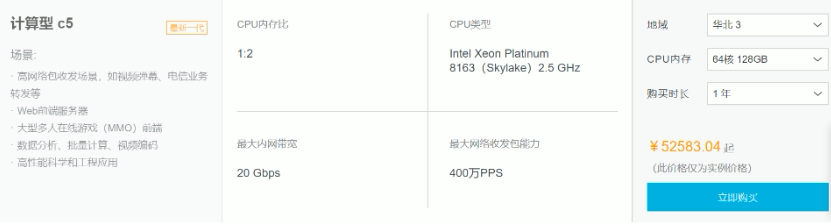
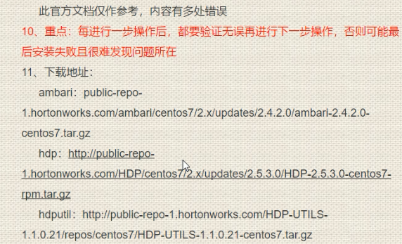
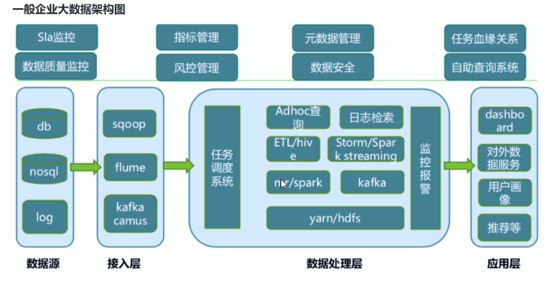
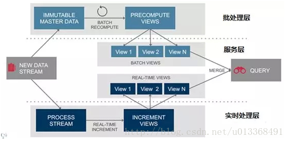
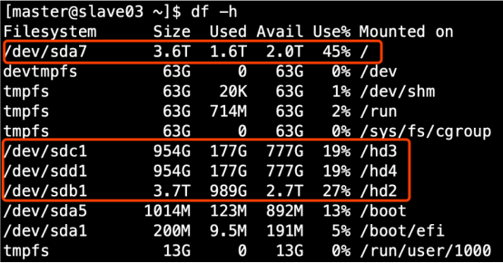

# 大数据平台介绍

- 架构图以及服务组件介绍
- LAMBDA 架构介绍
  - https://blog.csdn.net/u013368491/article/details/71271864
- 合理技术选型
  - 找最合适的
  - 选择可以解决业务需求且出现问题可以解决
  - 选择稳定的，以15年spark为例
- 数据平台人员结构
  - CTO
  - 数据平台负责人，技术经理
  - 数据平台架构师
  - 大数据并发
    - ETL开发
      - 提取，转换，加载
    - 数仓开发
  - 深入学习、AI工程师
  - BI

# 从零开始组建公司的大数据集群

如何确认集群规模？假设每台服务器8T硬盘
使用Apache/CDH/HDP版本？
服务器使用物理机还是云主机
大数据服务组件规划（出表）

## 平台搭建准备工作

- 如何确定集群规模
  - 主要依据数据量
  - 按每条日志1k，每天1亿条，半年内不扩容计算
    - 每天：100000000 / 1024 / 1024 = 100G
    - 半年：18T
    - 保存3副本：54T
    - 预留20%Buf，每台8T硬盘评估，需要9台服务器
    - 如果数据量小，虽然3台可以搭建，但是建议至少5台
- 如何选择Apache、CDH、HDP版本
  - Apache
    - 运维麻烦，组件兼容性需要自己调研，一般大厂使用
  - CDH
    - 国内使用最多的版本，但CM不开源，对中小型公司没有影响，建议使用
  - HDP
    - 开源，可进行二次开发，没有CDH稳定
- 服务器使用物理机还是云主机
  - 成本
    - 物理机：128G内存，20核物理CPU，40线程，8THDD和2TSSD硬盘，单价4W多，考虑托管服务器费用，一般物理机5年左右寿命
    - 云主机：以阿里云为例，相同的配置，每年5W
  - 运维成本
    - 物理机：需要专业运维人员
    - 云主机：很多运维工作交给阿里云完成，运维相对轻松

## 测试环境搭建示例

 

| 服务名称       | 子服务               | master | slave01 | slave02 | slave03 | slave04 | slave05 |
| -------------- | -------------------- | ------ | ------- | ------- | ------- | ------- | ------- |
| zookeeper      | zookeeper Server     | 1      | 1       | 1       | 1       | 1       | 1       |
|                | zookeeper Client     | 1      | 1       | 1       | 1       | 1       | 1       |
| HDFS           | NameNode             | 1      |         | 1       |         |         |         |
|                | ZKFailoverController | 1      |         | 1       |         |         |         |
|                | DataNodes            | 1      | 1       | 1       | 1       | 1       | 1       |
|                | JournalNodes         | 1      | 1       |         |         |         |         |
|                | Httpfs               | 1      |         |         |         |         |         |
|                | NFSGateways          | 1      | 1       | 1       | 1       | 1       | 1       |
| YARN           | ResourceManager      |        | 1       |         |         |         |         |
|                | NodManagers          | 1      | 1       | 1       | 1       | 1       | 1       |
|                | YARN Clients         | 1      | 1       | 1       | 1       | 1       | 1       |
|                | App Timeline Server  |        | 1       |         |         |         |         |
| MapReduce2     | History Server       |        | 1       |         |         |         |         |
|                | MapReduce2 Clients   | 1      | 1       | 1       | 1       | 1       | 1       |
| TEZ            | TezClient            | 1      | 1       | 1       | 1       | 1       | 1       |
|                | Hive Metastore       | 1      |         |         |         |         |         |
|                | HiveServer2          | 1      |         |         |         |         |         |
|                | WebHCat Server       | 1      |         |         |         |         |         |
|                | HCat Clients         | 1      | 1       | 1       | 1       | 1       | 1       |
|                | Hive Clients         | 1      | 1       | 1       | 1       | 1       | 1       |
| Pig            | Pig Clients          | 1      | 1       | 1       | 1       | 1       | 1       |
| Ambari Metrics | Metrics Collector    | 1      |         |         |         |         |         |
|                | Grafana              | 1      |         |         |         |         |         |
|                | Metrics Monitors     | 1      | 1       | 1       | 1       | 1       | 1       |
| Spark          | Spark Histroy Server | 1      |         |         |         |         |         |
|                | Livy Server          | 1      |         |         |         |         |         |
|                | Spark Thrift Server  | 1      |         |         |         |         |         |
|                | Spark Clients        | 1      | 1       | 1       | 1       | 1       | 1       |
| Slider         | Slider Clients       | 1      | 1       | 1       | 1       | 1       | 1       |
| HUE            | HUE                  | 1      |         |         |         |         |         |
| mysql          | mysql                |        |         |         |         | 1       | 1       |

## 一般企业大数据架构

 

## LAMBDA架构

大概思路：将大数据系统构建为多个层次，三层架构：批处理层、实时处理层、服务层

https://blog.csdn.net/u013368491/article/details/71271864

 

## 注意事项

安装过程中注意事项

- 尽量使用离线方式安装

- 使用非root用户，配置免密码的sudo权限
- 确认HDFS的存储目录，保证存储在空间最大硬盘上

 

- 元数据备份（重点，如数据损坏，可能整个集群无法运行，至少要保证每日零点之后备份到其它服务器两个复本）
  - 冷备份，使用冷备份如果主机出现问题，手动处理
  - 使用热备份需要注意双方数据的同步，如果其他原因导致数据没有同步成功，则日后切换到备份数据库会导致集群产生脏数据

- 配置机架感知
  - 本地化计算
  - 不配置任何参数的情况下，hadoop默认认为是在一个机架上
  - 需要将物理机和机架的关系告诉hadoop

 

- 基准测试
  - 验证服务器的处理能力
  - 使用基准测试包，测试集群读写性能，排序性能

- 参数调优

# 项目实战

- 用户行为分析
- 数据大屏：实时统计新增VIP用户数
- 实时应用：异常订单用户及时运营
- 用户画像