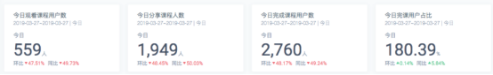
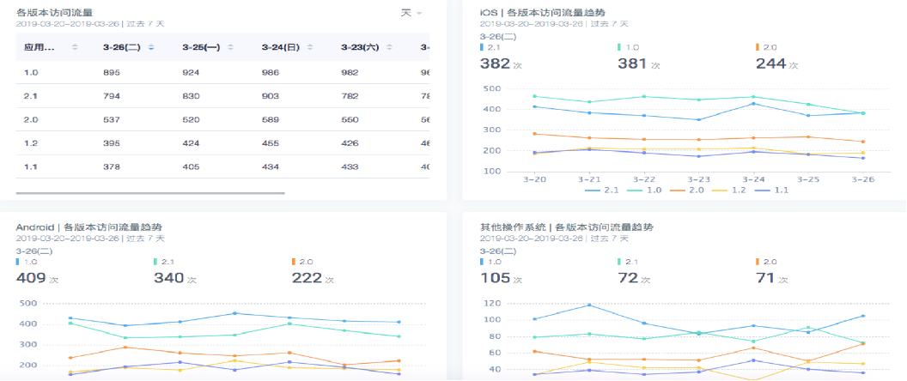
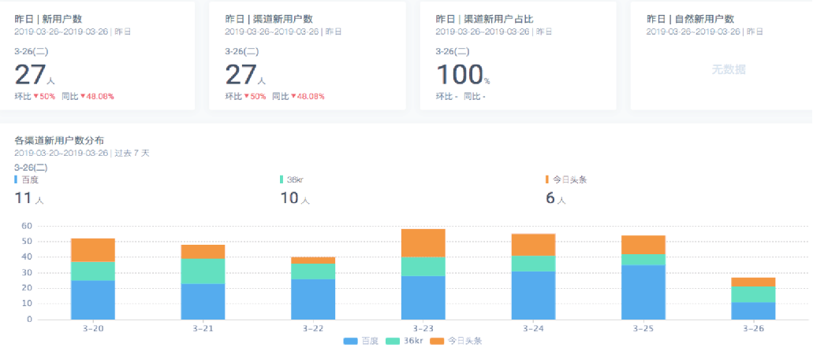
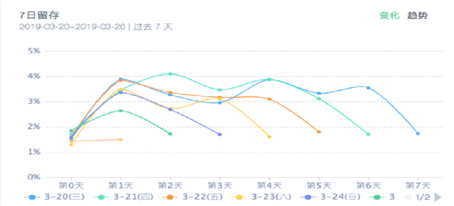

# dwd表描述


## user_behavior

```sql
create database dwd;
use dwd;
```

- 创建orc目标表

```sql
create external table if not exists dwd.user_behavior(
uid STRING comment "用户唯一标识",
username STRING comment "用户昵称",
gender STRING comment "性别",
level TINYINT comment "1代表小学，2代表初中，3代表高中",
is_vip TINYINT comment "0代表不是会员，1代表是会员",
os STRING comment "操作系统:os,android等",
channel STRING comment  "下载渠道:auto,toutiao,huawei",
net_config STRING comment "当前网络类型",
ip STRING comment "IP地址",
phone STRING comment "手机号码",
video_id INT comment "视频id",
video_length INT comment "视频时长，单位秒",
start_video_time BIGINT comment "开始看视频的时间缀，秒级",
end_video_time BIGINT comment "退出视频时的时间缀，秒级",
version STRING comment "版本",
event_key STRING comment  "事件类型",
event_time BIGINT comment  "事件发生时的时间缀，秒级"
) 
partitioned by(dt INT)  
row format delimited fields terminated by "\t" stored as ORC;
```


### event_key值

- startApp 打开App
- closeApp 关闭App
- registerAccount 注册用户
- startVideo 开始看视频
- endVideo 结束看视频
- startHomework 开始作业
- completeHomework 完成作业
- shareVideo 分享视频
- enterOrderPage 进入订单详情页
- completeOrder 支付完成订单，成为vip

说明：每个event_key代表一种行为


# 业务指标实现


注意：可用使用dws层完成统计参数，但是从dws层统计的参数要到ads层进行汇总导出到mysql，因为在sqoop中导出到mysql分区字段不能导出，因此使用一个临时表统计结果进行导出


- 标号表示难度


## 今日观看|完成视频用户数 (1)

- 第一个参数和第三个参数

 


### 在mysql中创建表

```sql
CREATE TABLE app_cource_study_report (
  `id` int(11) NOT NULL AUTO_INCREMENT,
  `watch_video_cnt` int(11) DEFAULT NULL,
  `complete_video_cnt` int(11) DEFAULT NULL,
  `dt` int(11) DEFAULT NULL,
  `created_at` timestamp NOT NULL DEFAULT CURRENT_TIMESTAMP,
  `updated_at` timestamp NOT NULL DEFAULT CURRENT_TIMESTAMP ON UPDATE CURRENT_TIMESTAMP,
  PRIMARY KEY (`id`),
  UNIQUE KEY `app_cource_study_report_dt` (`dt`)
) ENGINE=InnoDB DEFAULT CHARSET=utf8
```

- 建表时一定要指定created_at和updated_at字段
  - 便于脚本重跑后定位问题，重跑后可以判断是否是最新的
  - 建议要添加上created_at 和 update_at


### 在hive中创建表

- 中间结果放入tmp临时数据
  - 也可放在dws或者ads，按照dt进行分区
  - 不同的公司有不同的规定

```sql
create table if not exists tmp.app_cource_study_analysis_${day}(
    watch_video_count INT,
    complete_video_count INT,
    dt INT
) row format delimited fields terminated by "\t";

# 示例
create table if not exists tmp.app_cource_study_analysis_20190402(
    watch_video_count INT,
    complete_video_count INT,
    dt INT
) row format delimited fields terminated by "\t";
```

- 创建dws层表，对dt进行分区操作
  - 好像不用是外部表

```sql
create database dws;
use dws;

create external table if not exists dws.app_cource_study_analysis(
watch_video_count INT,
complete_video_count INT
)
partitioned by(dt int)
row format delimited fields terminated by '\t';

desc formatted app_cource_study_analysis;
```


### sql编写

- 查询看视频和结束视频的人数


#### 方案1：临时表

- 如果使用临时表就需要对dt进行提取
  - 实现1

```sql
insert overwrite table tmp.app_cource_study_analysis_${day} 
select sum(watch_video_count),sum(complete_video_count),dt from (
select count(distinct uid) as watch_video_count,0 as complete_video_count,dt from dwd.user_behavior where dt = ${day} and event_key = "startVideo" group by dt 
union all
select 0 as watch_video_count,count(distinct uid) as complete_video_count,dt from dwd.user_behavior where dt = ${day} and event_key = "endVideo" 
and (end_video_time - start_video_time) >= video_length group by dt) tmp group by dt
```

- 示例
  - 实现2

```sql
insert overwrite table tmp.app_cource_study_analysis_20190402
select
  sum(watch_video_count),
  sum(complete_video_count),
  20190402 dt
from(
    select count(uid) as watch_video_count,0 as complete_video_count
    from (
        select uid 
        from dwd.user_behavior 
        where dt=20190402 and event_key='startVideo' 
        group by uid) t1
    union all
    select 0 as watch_video_count,count(uid) as complete_video_count
    from (
        select uid
        from dwd.user_behavior
        where dt=20190402 
        and event_key='endVideo' 
        and (end_video_time-start_video_time) >= video_length
        group by uid) t2
) t3;
```

- union 会对结果去重
- union all 不会对结果去重
  - 此处使用union all ，是因为从业务角度而言，2张表不会有重复数据，使用union all 提升性能
- 插入时为什么要用overwrite而不是into
  - 不保证程序只运行一次，可能会出现重复执行


#### 方案2：分区表

```sql
select
  count(distinct uid) as watch_video_count,
  0 as complete_video_count,
  dt
from user_behavior 
where dt=20190402 and event_key='startVideo' group by dt
union all
select
  0 as watch_video_count, 
  count(distinct uid) as complete_video_count
from user_behavior
where dt=20190402 and event_key='endVideo' and (end_video_time-start_video_time) >= video_length group by dt

# 结果
_u1.watch_video_count	_u1.complete_video_count
37000	0
0	27000
Time taken: 46.748 seconds, Fetched: 2 row(s)


# 优化操作，使用count group by 代替count(distinct xx) ，后者只有一个reduceTask
select count(uid) as watch_video_count,0 as complete_video_count
from (
    select uid 
    from user_behavior 
    where dt=20190402 and event_key='startVideo' 
    group by uid) t1
union all
select 0 as watch_video_count,count(uid) as complete_video_count
from (
    select uid
    from user_behavior
    where dt=20190402 
    and event_key='endVideo' 
    and (end_video_time-start_video_time) >= video_length
    group by uid) t2;
```

- 对union all 进行求和插入

```sql
insert overwrite table dws.app_cource_study_analysis partition(dt=20190402)
select
  sum(watch_video_count),
  sum(complete_video_count)
from(
    select count(uid) as watch_video_count,0 as complete_video_count
from (
    select uid 
    from user_behavior 
    where dt=20190402 and event_key='startVideo' 
    group by uid) t1
union all
select 0 as watch_video_count,count(uid) as complete_video_count
from (
    select uid
    from user_behavior
    where dt=20190402 
    and event_key='endVideo' 
    and (end_video_time-start_video_time) >= video_length
    group by uid) t2
) t3;
```


### 方式1：脚本实现

- app_course_study_analysis.sh

```bash
#!/bin/bash

day=$1
# 验证输入参数的合法性
if [ ${#day} -ne 8 ];then
	echo "please input date,eg:20190402"
	exit 1
fi

#创建dws表
/opt/module/hive/bin/hive -e "
create table if not exists tmp.app_cource_study_analysis_${day}(
    watch_video_count INT,
    complete_video_count INT,
    dt INT
) row format delimited fields terminated by '\t';
"
# 向表插入数据
/opt/module/hive/bin/hive -e "
insert overwrite table tmp.app_cource_study_analysis_${day}
select
  sum(watch_video_count),
  sum(complete_video_count),
  ${day} dt
from(
    select count(uid) as watch_video_count,0 as complete_video_count
    from (
        select uid 
        from dwd.user_behavior 
        where dt=${day} and event_key='startVideo' 
        group by uid) t1
    union all
    select 0 as watch_video_count,count(uid) as complete_video_count
    from (
        select uid
        from dwd.user_behavior
        where dt=${day} and event_key='endVideo' 
        and (end_video_time-start_video_time) >= video_length
        group by uid) t2
) t3;
"
```


### 方式2：使用sparkSQL实现

- 在resources文件夹中配置文件

- core-site.xml

```xml
<?xml version="1.0" encoding="UTF-8"?>
<?xml-stylesheet type="text/xsl" href="configuration.xsl"?>

<configuration>
 	<!--指定hdfs的访问地址-->
	<property>
		<name>fs.defaultFS</name>
                <value>hdfs://hadoop102:9000</value>
        </property>
        <!--指定hdfs数据存放的位置，包括元数据和存储的数据-->
        <property>
                <name>hadoop.tmp.dir</name>
                <value>/opt/modules/hadoop/data/tmp</value>
        </property>  
        <!--指定数据删除后，存放在垃圾箱的时间，用于数据误删进的恢复操作，分钟为单位-->         
        <property>                
                <name>fs.trash.interval</name>                
                <value>1440</value>        
        </property>
</configuration>
```

- hdfs-site.xml

```xml
<?xml version="1.0" encoding="UTF-8"?>
<?xml-stylesheet type="text/xsl" href="configuration.xsl"?>

<configuration>
 	<!--因为是伪分布，所以指定副本数为1即可-->
        <property>
                <name>dfs.replication</name>
                <value>1</value>
        </property>
        <!--指定namenode的进程在哪台服务器开启，并指定使用的端口号-->
        <property>
                <name>dfs.namenode.http-address</name>
                <value>hadoop102:50070</value>
        </property>
        <!--指定Secondary Namenode的进程在哪台服务器和哪个端口开启-->
        <property>
                <name>dfs.namenode.secondary.http-address</name>
                <value>hadoop104:50090</value>
        </property>
	<property>
		<name>dfs.permissions.enabled</name>
		<value>false</value>
	</property>
</configuration>
```

- hive-site.xml

```xml
<?xml version="1.0"?>
<?xml-stylesheet type="text/xsl" href="configuration.xsl"?>
<configuration>
    <property>
        <name>javax.jdo.option.ConnectionURL</name>
        <value>jdbc:mysql://hadoop102:3306/metastore?createDatabaseIfNotExist=true</value>
        <description>JDBC connect string for a JDBC metastore</description>
    </property>

    <property>
        <name>javax.jdo.option.ConnectionDriverName</name>
        <value>com.mysql.jdbc.Driver</value>
        <description>Driver class name for a JDBC metastore</description>
    </property>

    <property>
        <name>javax.jdo.option.ConnectionUserName</name>
        <value>root</value>
        <description>username to use against metastore database</description>
    </property>

    <property>
        <name>javax.jdo.option.ConnectionPassword</name>
        <value>123456</value>
        <description>password to use against metastore database</description>
    </property>
    <property>
        <name>hive.cli.print.header</name>
        <value>true</value>
    </property>

    <property>
        <name>hive.cli.print.current.db</name>
        <value>true</value>
    </property>
</configuration>
```

- scala

```scala
package com.stt.project

import org.apache.spark.sql.SparkSession

object AppCourseStudyAnalysis {

  def main(args: Array[String]): Unit = {

    // 获取日期参数
    val day = args(0)
    if("".equals(day) || day.length == 0){
      println("usage:please input date,eg:20190402")
      System.exit(1)
    }

    val session: SparkSession = SparkSession.builder()
        .appName(getClass.getSimpleName)
        .config("spark.sql.warehouse.dir","/user/hive/warehouse")
        .enableHiveSupport()
        .getOrCreate()

    import session.sql

    // 创建dws表，注意在spark sql中不能有;
    sql(s"""
           |create table if not exists tmp.app_cource_study_analysis_${day}(
           |    watch_video_count INT,
           |    complete_video_count INT,
           |    dt INT
           |) row format delimited fields terminated by '\t'
       """.stripMargin)

    // 将分析的结果插入dws表
    sql(s"""
           |insert overwrite table tmp.app_cource_study_analysis_${day}
           |select
           |  sum(watch_video_count),
           |  sum(complete_video_count),
           |  ${day} dt
           |from(
           |    select count(uid) as watch_video_count,0 as complete_video_count
           |    from (
           |        select uid
           |        from dwd.user_behavior
           |        where dt=${day} and event_key='startVideo'
           |        group by uid) t1
           |    union all
           |    select 0 as watch_video_count,count(uid) as complete_video_count
           |    from (
           |        select uid
           |        from dwd.user_behavior
           |        where dt=${day} and event_key='endVideo'
           |        and (end_video_time-start_video_time) >= video_length
           |        group by uid) t2
           |) t3
       """.stripMargin)

    session.stop()
  }
}
```

- 测试

- 在idea的vm options中配置启动参数

```bash
-DHADOOP_USER_NAME=ttshe
-Dspark.master=local[2]
-Dspark.sql.shuffle.partitions=1 # dataframe默认200个分区，这里指定一个分区
```


### sqoop导出


#### 临时表

- 使用sqoop进行导出操作

```bash
bin/sqoop export \
--connect jdbc:mysql://192.168.1.102:3306/test \
--username root \
--password 123456 \
--table app_cource_study_report \
--columns watch_video_cnt,complete_video_cnt,dt \
--fields-terminated-by "\t" \
--export-dir "/user/hive/warehouse/tmp.db/app_cource_study_analysis_${day}" \
--input-null-string '\\N'
```

- 测试

```bash
bin/sqoop export \
--connect jdbc:mysql://192.168.1.102:3306/test \
--username root \
--password 123456 \
--table app_cource_study_report \
--columns watch_video_cnt,complete_video_cnt,dt \
--fields-terminated-by "\t" \
--export-dir "/user/hive/warehouse/tmp.db/app_cource_study_analysis_20190402" \
--input-null-string '\\N'
```


#### 必须从ads层导出到mysql要含分区字段

- 如果是dws的分区表导出，注意dt所在的目录
  - 注意：从dws导出到mysql中缺失分区字段，不可用


### azkaban调度所有环节任务


## 版本数据统计 (1)




### 指标

各版本访问流量

ios访问流量

android访问流量

其它操作系统访问流量


### 在mysql中创建表

```sql
CREATE TABLE app_cource_version_report (
  `id` int(11) NOT NULL AUTO_INCREMENT primary key,
  `version` varchar(20) DEFAULT NULL,
  `os` varchar(20) DEFAULT NULL,
  `access_count` int(11) DEFAULT NULL,
  `dt` int(11) DEFAULT NULL ,
  `created_at` timestamp NOT NULL DEFAULT CURRENT_TIMESTAMP,
  `updated_at` timestamp NOT NULL DEFAULT CURRENT_TIMESTAMP ON UPDATE CURRENT_TIMESTAMP
) ENGINE=InnoDB DEFAULT CHARSET=utf8
```

 

### 在hive中创建表

```sql
create table if not exists tmp.app_cource_version_analysis_${day}(
    version string,
    os string,
    access_count int,
    dt int
) row format delimited fields terminated by "\t";

create table if not exists tmp.app_cource_version_analysis_20190401(
    version string,
    os string,
    access_count int,
    dt int
) row format delimited fields terminated by "\t";
```


### sql编写

```sql
insert overwrite table tmp.app_cource_version_analysis_${day}
select version,os,count(1) access_count,dt
from dwd.user_behavior
where dt=${day}
group by version,os,dt;
```

- 测试

```sql
select version,os,count(1) access_count,dt
from dwd.user_behavior
where dt=20190402
group by version,os,dt;

# 结果
version	os	access_count	dt
1.0	Symbian	20000	20190402
1.0	ios	103000	20190402
1.1	ios	28000	20190402
2.0	ios	16000	20190402
```

- 注意sql中不要有select * 或count(*)等内容出现


### 脚本编写

```bash
#!/bin/bash

day=$1
# 验证输入参数的合法性
if [ ${#day} -ne 8 ];then
    echo "please input date,eg:20190402"
    exit 1
fi

#创建tmp表
/opt/module/hive/bin/hive -e "
create table if not exists tmp.app_cource_version_analysis_${day}(
    version string,
    os string,
    access_count int,
    dt int
) row format delimited fields terminated by '\t'
"
# 向表插入数据
/opt/module/hive/bin/hive -e "
insert overwrite table tmp.app_cource_version_analysis_${day}
select version,os,count(1) access_count,dt
from dwd.user_behavior
where dt=${day}
group by version,os,dt
"
```


## 渠道访问统计 (1)



### 指标

昨日新增用户数

昨日渠道新增用户数

昨日自然新增用户数


### hive表

```sql
create table if not exists tmp.app_channel_analysis_${day}(
    channel STRING,
    new_user_cnt INT,
    dt INT
)  row format delimited fields terminated by "\t"
```


### sql编写

- event_type 有 registerAccount 表示注册成用户

```sql
# 思路1
select 
    count(1) all_add,
    sum(case channel when 'auto' then 1 else 0 end) auto_add,
    sum(case channel when 'toutiao' then 1 else 0 end) toutiao_add,
    sum(case channel when 'huawei' then 1 else 0 end) huawei_add
from dwd.user_behavior
where dt=20190402 and event_key='registerAccount';

# 结果
all_add	auto_add	toutiao_add	huawei_add
27000	8000	6000	13000
```

- 使用group by 实现
  - 好处不用关注channel的key的值，解耦处理
  - 总增长使用计算结果之和即可

```sql
select 
    channel,
    count(distinct uid) new_user_cnt,
    dt
from dwd.user_behavior 
where dt = ${day} and event_key = "registerAccount" 
group by channel,dt

# 测试
select 
    channel,
    count(distinct uid),
    20190402 dt
from dwd.user_behavior 
where dt =20190402 and event_key = "registerAccount" 
group by channel; # 省去dt，可以提高mr效率

# 结果
channel	c1	dt
auto	8000	20190402
huawei	13000	20190402
toutiao	6000	20190402
```


## 访问次数分布统计 (3)


### 指标

访问 1 - 2 次（包含2次）

访问 3 - 4 次（包含4次）

访问大于4次


### hive表

```sql
create table if not exists tmp.app_access_cnt_ranger_analysis_${day}(
    le_two INT,
    le_four INT,
    gt_four INT,
    dt INT
) row format delimited fields terminated by "\t";
```


### sql编写

- 实现1：分析

```sql
t1
# 每个用户当前操作app次数
select uid,count(1) times
from dwd.user_behavior
where dt=20190402
group by uid

select sum(case when times <=2 then 1 else 0 end) le_two,
sum(case when times <=4 and times >2 then 1 else 0 end) le_four,
sum(case when times >4 then 1 else 0 end) gt_four,
20190402 dt,
from t1
where times > 0;

# 测试
select sum(case when times <=2 then 1 else 0 end) le_two,
sum(case when times <=4 and times >2 then 1 else 0 end) le_four,
sum(case when times >4 then 1 else 0 end) gt_four,
20190402 dt
from (
    select uid,count(1) times
    from dwd.user_behavior
    where dt=20190402
    group by uid
) t1
where times > 0;

# 结果
le_two	le_four	gt_four	dt
10000	8000	19000	20190402
Time taken: 31.031 seconds, Fetched: 1 row(s)
```

- 实现2：参考

```sql
第一步：计算每个用户的访问次数并分组
drop table if exists tmp.user_access_cnt_${day};
create table if not exists tmp.user_access_cnt_${day} as select uid,count(1) as access_cnt,dt from dwd.user_behavior where dt = ${day} group by uid,dt;

第二步：根据访问次数来计算用户分步并插入最终表
insert overwrite table tmp.app_access_cnt_ranger_analysis_${day} 
select sum(le_two) as le_two,sum(le_four) as le_four,sum(gt_four) as gt_four,dt from 
(select count(1) as le_two,0 as le_four,0 as gt_four,dt from tmp.user_access_cnt_${day} where  access_cnt <= 2 group by dt 
union all 
select 0 as le_two,count(1) as le_four,0 as gt_four,dt from tmp.user_access_cnt_${day} where  access_cnt <= 4 group by dt 
union all 
select 0 as le_two,0 as le_four,count(1) as gt_four,dt from tmp.user_access_cnt_${day} where  access_cnt > 4 group by dt) tmp 
group by dt;

# 测试
drop table if exists tmp.user_access_cnt_20190402;
create table if not exists tmp.user_access_cnt_20190402 as select uid,count(1) as access_cnt,dt from dwd.user_behavior where dt = 20190402 group by uid,dt;

#insert overwrite table tmp.app_access_cnt_ranger_analysis_20190402 
select sum(le_two) as le_two,sum(le_four) as le_four,sum(gt_four) as gt_four,dt from 
(select count(1) as le_two,0 as le_four,0 as gt_four,dt from tmp.user_access_cnt_20190402 where  access_cnt <= 2 group by dt 
union all 
select 0 as le_two,count(1) as le_four,0 as gt_four,dt from tmp.user_access_cnt_20190402 where  access_cnt <= 4 group by dt 
union all
select 0 as le_two,0 as le_four,count(1) as gt_four,dt from tmp.user_access_cnt_20190402 where  access_cnt > 4 group by dt) tmp 
group by dt;

# 结果
le_two	le_four	gt_four	dt
10000	18000	19000	20190402
Time taken: 70.205 seconds, Fetched: 1 row(s)

# 在临时表上使用实现1
select sum(case when access_cnt <=2 and access_cnt>0 then 1 else 0 end) le_two,
sum(case when access_cnt <=4 and access_cnt >2 then 1 else 0 end) le_four,
sum(case when access_cnt >4 then 1 else 0 end) gt_four,
20190402 dt
from tmp.user_access_cnt_20190402;

le_two	le_four	gt_four	dt
10000	8000	19000	20190402
Time taken: 13.561 seconds, Fetched: 1 row(s)
```

- 最终方案
  - 初始计算使用一个临时表缓存，防止计算中断，重新开始

```sql
第一步：计算每个用户的访问次数并分组
drop table if exists tmp.user_access_cnt_${day};
create table if not exists tmp.user_access_cnt_${day} as select uid,count(1) as access_cnt from dwd.user_behavior where dt = ${day} group by uid;

insert overwrite table tmp.app_access_cnt_ranger_analysis_${day}
select
    sum(case when access_cnt <=2 and access_cnt>0 then 1 else 0 end) le_two,
    sum(case when access_cnt <=4 and access_cnt >2 then 1 else 0 end) le_four,
    sum(case when access_cnt >4 then 1 else 0 end) gt_four,
	${day} dt
from tmp.user_access_cnt_${day};
```


## 漏斗分析（4）


### 指标

- 打开app -> 开始看视频 - > 完成视频 -> 开始作业 -> 完成作业

- 只有看了视频，才有可能完成视频，才能开始写作业，也可以不写，但是写作业不一定完成，所以每一步都会有数据流失

  

event_key

- startApp 打开App
- closeApp 关闭App
- registerAccount 注册用户
- startVideo 开始看视频
- endVideo 结束看视频
- startHomework 开始作业
- completeHomework 完成作业
- shareVideo 分享视频
- enterOrderPage 进入订单详情页
- completeOrder 支付完成订单，成为vip

说明：每个event_key代表一种行为


### hive表

```sql
create table if not exists tmp.app_study_funnel_analysis_${day}(
    start_app_cnt INT,
    start_video_cnt INT,
    complete_video_cnt INT,
    start_homework_cnt INT,
    complete_homework INT,
    dt INT
) row format delimited fields terminated by "\t";
```


### sql

- 分析
  - 查询所有startApp的uid，以此为基础表，其他条件做left join
- 方式1

```sql
insert overwrite table tmp.app_study_funnel_analysis_${day}
select 
    count(t1.uid) start_app_cnt,
    count(t2.uid) start_video_cnt,
    count(t3.uid) complete_video_cnt,
    count(t4.uid) start_homework,
    count(t5.uid) complete_homework,
    ${day} dt
from (
    select uid 
    from dwd.user_behavior 
    where dt=${day} and event_key="startApp"
    group by uid
) t1
left join (
    select uid
    from dwd.user_behavior
    where dt=${day} and event_key="startVideo"
) t2 on t1.uid = t2.uid
left join (
    select uid
    from dwd.user_behavior
    where dt=${day} and event_key="endVideo" 
    and (end_video_time - start_video_time) >= video_length
) t3 on t2.uid = t3.uid
left join (
    select uid
    from dwd.user_behavior
    where dt=${day} and event_key="startHomework"
) t4 on t3.uid = t4.uid
left join (
    select uid
    from dwd.user_behavior
    where dt=${day} and event_key="completeHomework"
) t5 on t4.uid = t5.uid
```

- 注意count(null) 不计入统计
- 方式2

```sql
insert overwrite table tmp.app_study_funnel_analysis_${day}  
select count(distinct t1.uid) as start_app_cnt,count(distinct t2.uid) as start_video_cnt,count(distinct t3.uid) as complete_video_cnt,count(distinct t4.uid) as start_homework,count(distinct t5.uid) as complete_homework,t1.dt from 
(select uid,dt from dwd.user_behavior where dt = ${day} and event_key = "startApp") t1
left join 
(select uid from dwd.user_behavior where dt = ${day} and event_key = "startVideo") t2 
on t1.uid = t2.uid 
left join 
(select uid from dwd.user_behavior where dt = ${day} and event_key = "endVideo" and (end_video_time - start_video_time) >= video_length) t3 
on t2.uid = t3.uid 
left join 
(select uid from dwd.user_behavior where dt = ${day} and event_key = "startHomework") t4
on t3.uid = t4.uid 
left join 
(select uid from dwd.user_behavior where dt = ${day} and event_key = "completeHomework") t5
on t4.uid = t5.uid  group by t1.dt
```


### 扩展：时序漏斗

- 时序漏斗，每层减去上一层的eventTime的时间差范围进行过滤
- 全局时序漏斗，最后一层减去第一层的eventTime的时间差范围
  - 要求2个小时
- 每步时序15分钟

```sql
insert overwrite table tmp.app_study_funnel_analysis_${day}
select 
    count(t1.uid) start_app_cnt,
    count(t2.uid) start_video_cnt,
    count(t3.uid) complete_video_cnt,
    count(t4.uid) start_homework,
    count(t5.uid) complete_homework,
    ${day} dt
from (
    select uid 
    from dwd.user_behavior 
    where dt=${day} and event_key="startApp"
    group by uid
) t1
left join (
    select uid
    from dwd.user_behavior
    where dt=${day} and event_key="startVideo"
) t2 on t1.uid = t2.uid and t2.event_time-t1.event_time <= 900
left join (
    select uid
    from dwd.user_behavior
    where dt=${day} and event_key="endVideo" 
    and (end_video_time - start_video_time) >= video_length
) t3 on t2.uid = t3.uid
left join (
    select uid
    from dwd.user_behavior
    where dt=${day} and event_key="startHomework"
) t4 on t3.uid = t4.uid
left join (
    select uid
    from dwd.user_behavior
    where dt=${day} and event_key="completeHomework"
) t5 on t4.uid = t5.uid
```

- 注意：hive在某些版本不支持非等值连接，因此该sql在spark中执行比较好，属于计算密集型


## 7日留存分析（5）

 


### hive表

```sql
create table tmp.seven_days_retained_analysis_${day}(
    register_day INT,
    zero_interval_retained_rate DOUBLE,
    one_interval_retained_rate DOUBLE,
    two_interval_retained_rate DOUBLE,
    three_interval_retained_rate DOUBLE,
    four_interval_retained_rate DOUBLE,
    five_interval_retained_rate DOUBLE,
    six_interval_retained_rate DOUBLE,
    dt INT
) row format delimited fields terminated by "\t";
```


### sql参考

```sql
// 获取近7日内全部用户的注册日期
select uid,dt as register_day,event_time from dwd.user_behavior where dt between ${startDay} and ${endDay} and event_key = "registerAccount"

// 获取近7日每天活跃的用户列表
select uid,dt as active_day,max(eventTime) as event_time from dwd.user_behavior where dt between ${startDay} and ${endDay} group by uid,dt

// 两者整合，生成uid,register_day,active_day,interval(活跃时距离注册日期几天)
select t1.uid,t1.register_day,t2.active_day,datediff(from_unixtime(t2.event_time,"yyyy-MM-dd"),from_unixtime(t1.event_time,"yyyy-MM-dd")) as day_interval from 
(select uid,dt as register_day,event_time from dwd.user_behavior where dt between ${startDay} and ${endDay} and event_key = "registerAccount") t1 
left join 
(select uid,dt as active_day,max(event_time) as event_time from dwd.user_behavior where dt between ${startDay} and ${endDay} group by uid,dt) t2  
on t1.uid = t2.uid  

结果格式：
001	20190301	20190301 	0
001 20190301	20190303	2
002	20190302	20190303	1

// 根据上面的表再生成留存用户数临时表 
drop table if exists tmp.user_retained_${startDay}_${endDay};create table if not exists  tmp.user_retained_${startDay}_${endDay} as 
select register_day,day_interval,count(1) as retained from (
select t1.uid,t1.register_day,t2.active_day,datediff(from_unixtime(t2.event_time,"yyyy-MM-dd"),from_unixtime(t1.event_time,"yyyy-MM-dd")) as day_interval from 
(select uid,dt as register_day,event_time from dwd.user_behavior where dt between ${startDay} and ${endDay} and event_key = "registerAccount") t1 
left join 
(select uid,dt as active_day,max(event_time) as event_time from dwd.user_behavior where dt between ${startDay} and ${endDay} group by uid,dt) t2  
on t1.uid = t2.uid) tmp group by register_day,day_interval  

数据结果：
20190402        0       27000
20190402        1       19393
20190402        2       14681
20190402        3       9712
20190402        4       5089
20190402        5       1767
20190402        6       1775

// 计算近7日留存率
drop table if exists tmp.user_retained_rate_${startDay}_${endDay};create table if not exists tmp.user_retained_rate_${startDay}_${endDay} as 
select register_day,day_interval,round(retained / register_cnt,4) as retained_rate,current_dt from (
select t1.register_day,t1.day_interval,t1.retained,t2.register_cnt,${endDay} as current_dt from 
(select register_day,day_interval,retained from tmp.user_retained_${startDay}_${endDay}) t1 
left join 
(select dt,count(1) as register_cnt from dwd.user_behavior where dt between ${startDay} and ${endDay} and event_key = "registerAccount" group by dt) t2 
on t1.register_day = t2.dt 
group by t1.register_day,t1.day_interval ,t1.retained,t2.register_cnt) tmp

数据结果
20190402        0       1.0     20190402
20190402        1       0.7183  20190402
20190402        2       0.5437  20190402
20190402        3       0.3597  20190402
20190402        4       0.1885  20190402
20190402        5       0.0654  20190402
20190402        6       0.0657  20190402
20190403        0       1.0     20190402
20190403        1       0.7183  20190402
20190403        2       0.5437  20190402
20190403        3       0.3597  20190402
20190403        4       0.1885  20190402
20190403        5       0.0654  20190402

// 到这里还没有结束，咱们再来个列转行
insert overwrite table tmp.seven_days_retained_analysis_${day} 
select 
register_day,
max(case when day_interval = 0 then retained_rate else 0 end) as zero_interval_retained_rate,
max(case when day_interval = 1 then retained_rate else 0  end) as one_interval_retained_rate,
max(case when day_interval = 2 then retained_rate else 0 end) as two_interval_retained_rate,
max(case when day_interval = 3 then retained_rate else 0 end) as three_interval_retained_rate,
max(case when day_interval = 4 then retained_rate else 0 end) as four_interval_retained_rate,
max(case when day_interval = 5 then retained_rate else 0 end) as five_interval_retained_rate,
max(case when day_interval = 6 then retained_rate else 0 end) as six_interval_retained_rate,
current_dt 
from tmp.user_retained_rate_${startDay}_${endDay} group by register_day,current_dt;

思考题：上面的SQL完全可以写在一个大SQL中完成，为什么要分解成这么多步完成？
```


### sql分析


#### 步骤1：统计起始日注册用户uid的后7日每日活动最大时间信息

- 获取近7日内全部用户的注册日期

```sql
select 
    uid,
    dt as register_day,
    event_time
from dwd.user_behavior
where dt between ${startDay} and ${endDay} 
and event_key="registerAccount"
```

- 近7日每天活跃用户列表
  - 每日用户在app上产生事件，获取该用户==每日==的最大事件时间

```sql
select
   uid,
   dt as active_day,
   max(eventTime) as event_time
from dwd.user_behavior
where dt between ${startDay} and ${endDay} 
group by uid,dt
```


#### 步骤2：统计起始日注册用户uid的后7日活动日期，及分别与起始日的时间间隔

- 两者join，生成uid,register_day,active_day,interval(活跃时距离注册日期几天)

```sql
select
    t1.uid,
    t1.register_day,
    t2.active_day,
    datediff( # 最近活跃的天数和注册的天数的差，求得最近几日的留存率
        from_unixtime(t2.event_time,'yyyy-MM-dd'),
        from_unixtime(t1.event_time,'yyyy-MM-dd')
    )
from(
    select 
        uid,
        dt as register_day,
        event_time
    from dwd.user_behavior
    where dt between ${startDay} and ${endDay} 
    and event_key="registerAccount" # 每个uid注册只有一次，但是每日操作会有多次，left join后会扩展多行，如果在20190402注册，如果每日都在线则7日left join后会扩展成7条记录
) t1 left join (
    select
        uid,
        dt as active_day,
        max(event_time) as event_time
    from dwd.user_behavior
    where dt between ${startDay} and ${endDay} 
    group by uid,dt   # 计算每日的最大活动时间
) t2 on t1.uid = t2.uid
where t2.event_time >= t1.event_time # 去除脏数据

结果格式：
001	20190301	20190301 	0 # 表示用户001用户在 20190301注册 在20190301的活动
001 20190301	20190303	2 # 表示用户001用户在 20190301注册 在20190303的活动，说明在20190302 这一天没有活动
002	20190302	20190303	1
```


#### 步骤3：统计起始日，活动时间间隔分组后用户uid的个数

- 根据上面的表再生成留存用户数临时表，统计间隔日期的用户留存数目

```sql
drop table if exists tmp.user_retained_${startDay}_${endDay};
create table if not exists tmp.user_retained_${startDay}_${endDay} as
select 
    register_day,
    day_interval,
    count(1) as retained
from (
    select
        t1.uid,
        t1.register_day,
        t2.active_day,
        datediff(
            from_unixtime(t2.event_time,'yyyy-MM-dd'),
            from_unixtime(t1.event_time,'yyyy-MM-dd')
        ) as day_interval
    from(
        select 
            uid,
            dt as register_day,
            event_time
        from dwd.user_behavior
        where dt between ${startDay} and ${endDay} 
        and event_key="registerAccount"
    ) t1 left join (
        select
            uid,
            dt as active_day,
            max(event_time) as event_time
        from dwd.user_behavior
        where dt between ${startDay} and ${endDay} 
        group by uid,dt
     ) t2 on t1.uid = t2.uid
    where t2.event_time >= t1.event_time
) t3
group by register_day, day_interval

数据结果：
20190402        0       27000 
20190402        1       19393
20190402        2       14681
20190402        3       9712
20190402        4       5089
20190402        5       1767
20190402        6       1775 # 表示从20190402注册开始，第6天的留存个数
```


#### 步骤4：查询起始日的注册人数，与步骤3查询的信息做统计留存率

- 计算近7日留存率分析

```sql
# 得到register_day,day_interval,retained(注册当天留存人数，分子),register_cnt(注册当天所有注册人数，分母)
select 
    register_day,
    day_interval,
    retained
from tmp.user_retained_${startDay}_${endDay} t1
left join (
    select 
        dt,
        count(1) register_cnt
    from dwd.user_behavior
    where dt between ${startDay} and ${endDay} 
    and event_key="registerAccount"
    group by dt # 计算当日的注册人数 register_cnt作为分母
) t2
on t1.register_day = t2.dt
```

- 计算留存率

```sql
drop table if exists tmp.user_retained_rate_${startDay}_${endDay};
create table if not exists tmp.user_retained_rate_${startDay}_${endDay} as
select 
    register_day,
    day_interval,
    round(retained / register_cnt,4) as retained_rate,
    ${endDay} as current_dt
from (
    select 
        register_day,
        day_interval,
        retained,
        register_cnt
    from tmp.user_retained_${startDay}_${endDay} t1
    left join (
        select 
            dt,
            count(1) register_cnt
        from dwd.user_behavior
        where dt between ${startDay} and ${endDay} 
        and event_key="registerAccount"
        group by dt
    ) t2
    on t1.register_day = t2.dt
)t3
# group by register_day,day_interval

数据结果
20190402        0       1.0     20190402
20190402        1       0.7183  20190402
20190402        2       0.5437  20190402
20190402        3       0.3597  20190402
20190402        4       0.1885  20190402
20190402        5       0.0654  20190402
20190402        6       0.0657  20190402
20190403        0       1.0     20190402
20190403        1       0.7183  20190402
20190403        2       0.5437  20190402
20190403        3       0.3597  20190402
20190403        4       0.1885  20190402
20190403        5       0.0654  20190402
```


#### 步骤5：将统计的结果做列转行展示

- 最终需要列转行将每天的留存率进行输出
  - 进列转行需要用到分组计算

```sql
insert overwrite table tmp.seven_days_retained_analysis_${day}
select
    register_day,
    max(case when day_interval = 0 then retained_rate else 0 end ) as zero_interval_retained_rate,
    max(case when day_interval = 1 then retained_rate else 0 end ) as one_interval_retained_rate,
    max(case when day_interval = 2 then retained_rate else 0 end ) as two_interval_retained_rate,
    max(case when day_interval = 3 then retained_rate else 0 end ) as three_interval_retained_rate,
    max(case when day_interval = 4 then retained_rate else 0 end ) as four_interval_retained_rate,    
    max(case when day_interval = 5 then retained_rate else 0 end ) as five_interval_retained_rate,
    max(case when day_interval = 6 then retained_rate else 0 end ) as six_interval_retained_rate,
    ${day} current_dt
from tmp.user_retained_rate_${startDay}_${day} # startDay是day的前7天
group by register_day
```


### 测试

- 查询每日的留存数

```sql
drop table if exists tmp.user_retained_20190402_20190408;
create table if not exists tmp.user_retained_20190402_20190408 as
select 
    register_day,
    day_interval,
    count(1) as retained
from (
    select
        t1.uid,
        t1.register_day,
        t2.active_day,
        datediff(
            from_unixtime(t2.event_time,'yyyy-MM-dd'),
            from_unixtime(t1.event_time,'yyyy-MM-dd')
        ) as day_interval
    from(
        select 
            uid,
            dt as register_day,
            event_time
        from dwd.user_behavior
        where dt between 20190402 and 20190408
        and event_key="registerAccount"
    ) t1 left join (
        select
            uid,
            dt as active_day,
            max(event_time) as event_time
        from dwd.user_behavior
        where dt between 20190402 and 20190408
        group by uid,dt
     ) t2 on t1.uid = t2.uid
    where t2.event_time >= t1.event_time
) t3
group by register_day, day_interval
```

- 统计留存率

```sql
drop table if exists tmp.user_retained_rate_20190402_20190408;
create table if not exists tmp.user_retained_rate_20190402_20190408 as
select 
    register_day,
    day_interval,
    round(retained / register_cnt,4) as retained_rate,
    20190408 as current_dt
from (
    select 
        register_day,
        day_interval,
        retained,
        register_cnt
    from tmp.user_retained_20190402_20190408 t1
    left join (
        select 
            dt,
            count(1) as register_cnt
        from dwd.user_behavior
        where dt between 20190402 and 20190408 
        and event_key="registerAccount"
        group by dt
    ) t2
    on t1.register_day = t2.dt
)t3
```

- 列转行

```sql
create table tmp.seven_days_retained_analysis_20190408(
    register_day INT,
    zero_interval_retained_rate DOUBLE,
    one_interval_retained_rate DOUBLE,
    two_interval_retained_rate DOUBLE,
    three_interval_retained_rate DOUBLE,
    four_interval_retained_rate DOUBLE,
    five_interval_retained_rate DOUBLE,
    six_interval_retained_rate DOUBLE,
    dt INT
) row format delimited fields terminated by "\t";

insert overwrite table tmp.seven_days_retained_analysis_20190408
select
    register_day,
    max(case when day_interval = 0 then retained_rate else 0 end ) as zero_interval_retained_rate,
    max(case when day_interval = 1 then retained_rate else 0 end ) as one_interval_retained_rate,
    max(case when day_interval = 2 then retained_rate else 0 end ) as two_interval_retained_rate,
    max(case when day_interval = 3 then retained_rate else 0 end ) as three_interval_retained_rate,
    max(case when day_interval = 4 then retained_rate else 0 end ) as four_interval_retained_rate,    
    max(case when day_interval = 5 then retained_rate else 0 end ) as five_interval_retained_rate,
    max(case when day_interval = 6 then retained_rate else 0 end ) as six_interval_retained_rate,
   20190408 current_dt
from tmp.user_retained_rate_20190402_20190408
group by register_day
```


### 思考

- 如计算0408的7天留存，会计算0402-0408这段时间的数据，如果计算0409的7日留存，按照上面的方式会计算从0403到0409之间的数据，然而0403到0408这段时间已经计算过了，造成了计算资源的浪费，是否可以实现增量计算只计算0403这一天和0409这一天的留存，然后拼接之前的计算数据


# 关注点


## union 和 union all 的区别

- union 会对结果去重
- union all 不会对结果去重
  - 使用union all ，从业务角度而言，2张表不会有重复数据，可使用union all 提升性能


## left semi join

- 在某些情况下可以使用半左连接代替左连接
- 半左连接是匹配到右表后的第一个满足条件的行连接之后，其余跳过
- 注意：使用半左连接之后，查询条件中不能有右表字段

```sql
# 看了视频又完成作业的学生数量
select count(distinct t1.uid) from 
select uid from student where event_key = "startVideo" t1
left semi join
select uid from student where event_key = "finishHomework" t2
on t1.uid = t2.uid
```


## 永久udf

- 将自定义udf代码生成的jar包注册成永久udf函数


