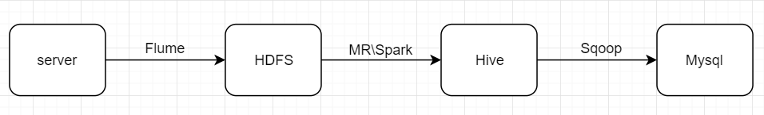

- 用户行为分析，离线

# 项目介绍

```
用户行为分析，是指在获得网站或APP等平台访问量基本数据的情况下，
对有关数据进行统计、分析，从中发现用户访问网站或APP等平台的规律，
并将这些规律与网络营销策略等相结合，从而发现目前网络营销活动中可能存在的问题，
并为进一步修正或重新制定网络营销策略提供依据。
```


# 数据流图




# 需求指示

- 课程学习反馈

- 版本数据统计

- 渠道访问

- 访问次数分布：我们的指标是1-2次(包含)，3-4次(包含)，大于4次

- 漏斗分析：打开app -> 开始看视频 - > 完成视频 -> 开始作业 -> 完成作业

- 留存分析

  

## 日志数据格式，以\t分隔

```
45660	45660	M	1	0	ios	huawei	wifi	59.48.116.0	18701445660	1	0	0	0	1.0	startHomework	1554134400
```


# 需求一：数据采集

有20台业务服务器，设计从业务服务器的log中使用Flume==实时==采集数据到HDFS架构，过程中要保证数据不能丢失。请设计架构，同时编写Flume agent配置

- 将数据输出到/user/hive/warehouse/ods.db/origin_user_behavior/${day}

- 使用双层flume，好处是对输入和输出的数据的速率进行控制
  - 每个服务器安装一个flume，收集数据在另一个flume进行汇总


# 需求二：数据模拟生成


# 需求三：数据清洗，加载


# 需求四：业务指标实现


# 需求五：导出数据


