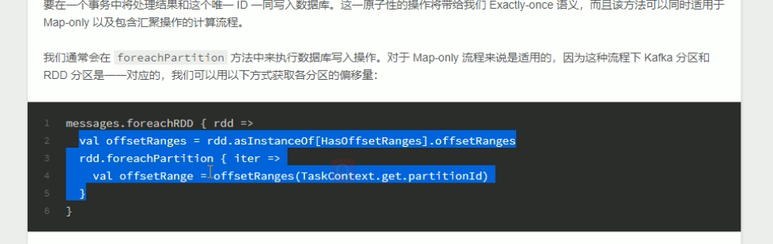

# 实时统计新增VIP数量

- 保证数据精确消费一次
- 按天、省份分组，最后统计结果类似于：2018-04-08北京新增VIP188人
- 通过SparkStreaming技术，每10秒计算新增VIP用户量，计算结果保存到Mysql，并通过前端大屏不停刷新展示
- 当eventKey为completeOrder时，代表成为VIP，只需统计事件中eventKey为completeOrder的数量即可


# 准备工作


## 创建topic

```bash
bin/kafka-topics.sh --create --zookeeper hadoop102:2181 --replication-factor 3 --partitions 3 --topic user-behavior
```


## 模拟数据

```bash
61027	61027	M	1	0	ios	toutiao	wifi	42.86.6.0	18701461027	0	0	0	0	2.0	completeOrder	1554652800
```


## 结果表

- 统计结果存储在Mysql中，表结构如下

```sql
CREATE TABLE `vip_increment_analysis` (
    `province` varchar(128) DEFAULT NULL,
    `cnt` int(11) DEFAULT NULL,
    `dt` varchar(128) DEFAULT NULL  
) ENGINE=InnoDB DEFAULT CHARSET=utf8
```

- province和dt组成唯一索引
  - 好处可以使用sql语法：replace into
  - 否则要使用sql逻辑：查询是否存在，存在则更新，不存在则插入

```sql
create unique index vip_increment_analysis_unique on vip_increment_analysis (province,dt);
```


## 存储offset的表

```sql
CREATE TABLE topic_offset (
topic varchar(128) DEFAULT NULL,
part_id int(11) DEFAULT NULL,
offset bigint(20) DEFAULT NULL
) ENGINE=InnoDB DEFAULT CHARSET=utf8
```

- 初始化
  - 三个分区，offset的起始都是0

```sql
insert into topic_offset(topic, part_id, offset) values('user-behavior',0,0);
insert into topic_offset(topic, part_id, offset) values('user-behavior',1,0);
insert into topic_offset(topic, part_id, offset) values('user-behavior',2,0);
```


## 关于解析IP地址

- 使用ipip.net解析ip地址：https://github.com/ipipdotnet/ipdb-java
- 拷贝ipipfree.ipdb文件到项目的resource目录下

```xml
<dependency>
    <groupId>net.ipip</groupId>
    <artifactId>ipdb</artifactId>
    <version>1.1.1</version>
</dependency>
```


## 关于jdbc操作

```xml
<dependency>
    <groupId>org.scalikejdbc</groupId>
    <artifactId>scalikejdbc_2.11</artifactId>
    <version>2.2.1</version>
</dependency>
```


# pom

```xml
<?xml version="1.0" encoding="UTF-8"?>
<project xmlns="http://maven.apache.org/POM/4.0.0"
         xmlns:xsi="http://www.w3.org/2001/XMLSchema-instance"
         xsi:schemaLocation="http://maven.apache.org/POM/4.0.0 http://maven.apache.org/xsd/maven-4.0.0.xsd">
    <modelVersion>4.0.0</modelVersion>

    <groupId>com.stt.project</groupId>
    <artifactId>UserBehavior</artifactId>
    <version>1.0-SNAPSHOT</version>

    <properties>
        <project.build.sourceEncoding>UTF-8</project.build.sourceEncoding>
        <maven.compiler.source>1.8</maven.compiler.source>
        <maven.compiler.target>1.8</maven.compiler.target>
    </properties>

    <dependencies>
        <dependency>
            <groupId>junit</groupId>
            <artifactId>junit</artifactId>
            <version>4.11</version>
            <scope>test</scope>
        </dependency>

        <dependency>
            <groupId>org.apache.spark</groupId>
            <artifactId>spark-core_2.11</artifactId>
            <version>2.3.0</version>
        </dependency>
        <!-- https://mvnrepository.com/artifact/org.apache.spark/spark-sql -->
        <dependency>
            <groupId>org.apache.spark</groupId>
            <artifactId>spark-sql_2.11</artifactId>
            <version>2.3.0</version>
        </dependency>
        <!-- https://mvnrepository.com/artifact/org.apache.spark/spark-streaming -->
        <dependency>
            <groupId>org.apache.spark</groupId>
            <artifactId>spark-streaming_2.11</artifactId>
            <version>2.3.0</version>
        </dependency>
        <!-- https://mvnrepository.com/artifact/org.apache.spark/spark-hive -->
        <dependency>
            <groupId>org.apache.spark</groupId>
            <artifactId>spark-hive_2.11</artifactId>
            <version>2.3.0</version>
        </dependency>
        <dependency>
            <groupId>org.apache.hive</groupId>
            <artifactId>hive-exec</artifactId>
            <version>1.2.1</version>
        </dependency>
        <!-- https://mvnrepository.com/artifact/mysql/mysql-connector-java -->
        <dependency>
            <groupId>mysql</groupId>
            <artifactId>mysql-connector-java</artifactId>
            <version>5.1.41</version>
        </dependency>
        <dependency>
            <groupId>junit</groupId>
            <artifactId>junit</artifactId>
            <version>4.11</version>
            <scope>test</scope>
        </dependency>
        <dependency>
            <groupId>org.scalikejdbc</groupId>
            <artifactId>scalikejdbc_2.11</artifactId>
            <version>2.2.1</version>
        </dependency>
        <dependency>
            <groupId>org.apache.spark</groupId>
            <artifactId>spark-streaming-kafka-0-8_2.11</artifactId>
            <version>2.3.0</version>
        </dependency>
        <dependency>
            <groupId>net.ipip</groupId>
            <artifactId>ipdb</artifactId>
            <version>1.1.1</version>
        </dependency>

    </dependencies>

    <build>
        <sourceDirectory>src/main/</sourceDirectory>
        <testSourceDirectory>src/test/</testSourceDirectory>
        <plugins>
            <plugin>
                <!-- see http://davidb.github.com/scala-maven-plugin -->
                <groupId>net.alchim31.maven</groupId>
                <artifactId>scala-maven-plugin</artifactId>
                <version>3.1.3</version>
                <executions>
                    <execution>
                        <goals>
                            <goal>compile</goal>
                            <goal>testCompile</goal>
                        </goals>
                        <configuration>
                            <args>
                                <arg>-dependencyfile</arg>
                                <arg>${project.build.directory}/.scala_dependencies</arg>
                            </args>
                        </configuration>
                    </execution>
                </executions>
            </plugin>
            <plugin>
                <groupId>org.apache.maven.plugins</groupId>
                <artifactId>maven-shade-plugin</artifactId>
                <version>1.5</version>
                <executions>
                    <execution>
                        <phase>package</phase>
                        <goals>
                            <goal>shade</goal>
                        </goals>
                        <configuration>
                            <shadedArtifactAttached>true</shadedArtifactAttached>
                            <shadedClassifierName>allinone</shadedClassifierName>
                            <artifactSet>
                                <includes>
                                    <include>*:*</include>
                                </includes>
                            </artifactSet>
                            <transformers>
                                <transformer implementation="org.apache.maven.plugins.shade.resource.AppendingTransformer">
                                    <resource>reference.conf</resource>
                                </transformer>
                                <transformer implementation="org.apache.maven.plugins.shade.resource.ManifestResourceTransformer">
                                    <manifestEntries>
                                        <Main-Class></Main-Class>
                                    </manifestEntries>
                                </transformer>
                            </transformers>
                            <filters>
                                <filter>
                                    <artifact>*:*</artifact>
                                    <excludes>
                                        <exclude>META-INF/*.SF</exclude>
                                        <exclude>META-INF/*.DSA</exclude>
                                        <exclude>META-INF/*.RSA</exclude>
                                    </excludes>
                                </filter>
                            </filters>
                        </configuration>
                    </execution>
                </executions>
            </plugin>
            <plugin>
                <groupId>org.apache.maven.plugins</groupId>
                <artifactId>maven-surefire-plugin</artifactId>
                <version>2.13</version>
                <configuration>
                    <useFile>false</useFile>
                    <disableXmlReport>true</disableXmlReport>
                    <!-- If you have classpath issue like NoDefClassError,... -->
                    <!-- useManifestOnlyJar>false</useManifestOnlyJar -->
                    <includes>
                        <include>**/*Test.*</include>
                        <include>**/*Suite.*</include>
                    </includes>
                </configuration>
            </plugin>
        </plugins>
        <pluginManagement>
            <plugins>
                <!--This plugin's configuration is used to store Eclipse m2e settings
                    only. It has no influence on the Maven build itself. -->
                <plugin>
                    <groupId>org.eclipse.m2e</groupId>
                    <artifactId>lifecycle-mapping</artifactId>
                    <version>1.0.0</version>
                    <configuration>
                        <lifecycleMappingMetadata>
                            <pluginExecutions>
                                <pluginExecution>
                                    <pluginExecutionFilter>
                                        <groupId>
                                            net.alchim31.maven
                                        </groupId>
                                        <artifactId>
                                            scala-maven-plugin
                                        </artifactId>
                                        <versionRange>
                                            [3.1.3,)
                                        </versionRange>
                                        <goals>
                                            <goal>testCompile</goal>
                                            <goal>compile</goal>
                                        </goals>
                                    </pluginExecutionFilter>
                                    <action>
                                        <ignore></ignore>
                                    </action>
                                </pluginExecution>
                            </pluginExecutions>
                        </lifecycleMappingMetadata>
                    </configuration>
                </plugin>
            </plugins>
        </pluginManagement>
    </build>
</project>
```


# 配置

- 在resources下添加config.properties文件

```properties
jdbcDriver=com.mysql.jdbc.Driver
jdbcUrl=jdbc:mysql://192.168.1.102:3306/test?characterEncoding=UTF-8
jdbcUser=root
jdbcPassword=123456
processingInterval=15
brokers=192.168.1.102:9092
topic=test
```

- 配置检查点路径 /user-behavior/checkpoint


# 方案1

```scala
package com.stt.project.ch03

import java.text.SimpleDateFormat
import java.util.{Date, Properties}

import kafka.common.TopicAndPartition
import kafka.message.MessageAndMetadata
import kafka.serializer.StringDecoder
import net.ipip.ipdb.City
import org.apache.spark.SparkConf
import org.apache.spark.streaming.dstream.InputDStream
import org.apache.spark.streaming.kafka.{HasOffsetRanges, KafkaUtils, OffsetRange}
import org.apache.spark.streaming.{Seconds, StreamingContext}
import scalikejdbc.{ConnectionPool, DB, _} // 注意 _ 表示引入所有

/**
  * 按地区分组统计每日新增VIP数量
  */
object VipIncrementAnalysis {

  // 从properties文件中获取各种参数
  val prop = new Properties()
  prop.load(getClass.getClassLoader.getResourceAsStream("config.properties"))

  // 解析ip地址
  val ipdb = new City(getClass.getClassLoader.getResource("ipipfree.ipdb").getPath)

  def main(args: Array[String]): Unit = {

    if (args.length != 1) {
      // 不同的应用，使用的checkpoint的路径可能不同，需要从外部传入
      println("Usage:Please input checkpoint Path")
      System.exit(1)
    }

    initJDBC()
    val checkpointPath = args(0)
    // 使用getOrCreate方式可以实现从Driver端失败后恢复
    val ssc = StreamingContext.getOrCreate(checkpointPath, () => createStreamContext(checkpointPath))

    // 启动流式计算
    ssc.start()
    ssc.awaitTermination()
  }

  // 统计地区vip的新增数量
  def createStreamContext(checkpointPath: String): StreamingContext = {
    val conf = new SparkConf()
      .set("spark.streaming.stopGracefullyOnShutdown", "true") // 优雅关闭配置
      .set("spark.streaming.backpressure.enabled", "true") // 背压配置
      .setAppName(getClass.getSimpleName)

    val ssc = new StreamingContext(conf, Seconds(getProcessInterval))

    // 开启检查点
    ssc.checkpoint(checkpointPath)
    val msgDStream: InputDStream[(String, String)] = getDStreamFromKafka(ssc)
    // 业务处理
    vipIncrementByCountry(msgDStream)
    ssc
  }

  def vipIncrementByCountry(msgDStream: InputDStream[(String, String)]) = {

    // 定义偏移量
    var offsetRanges: Array[OffsetRange] = Array.empty[OffsetRange]
    // 使用transform 算子的原因是，不会对分区进行修改，此时rdd的分区和kafka的分区保持一致
    msgDStream
      .transform {
        rdd => {
          offsetRanges = rdd.asInstanceOf[HasOffsetRanges].offsetRanges
          rdd
        }
      }
      .filter(completeOrderData)
      .map(conversionToDateCountryOne) // 数据转换，返回((2019-04-03,北京),1)格式的数据
      .updateStateByKey(updateFunc) // 从checkpoint中取出数据，计算后放入
      .filter(eventTimeLessThan2Days) // 只保留最近2天的状态，而不只保存1天的状态是考虑跨天的情况
      .foreachRDD(rdd => {
      rdd.foreachPartition(partition => {
        // 开启事务
        DB.localTx {
          implicit session => {
            // 对分区数据进行更新
            partition.foreach {
              case ((eventTime: String, province: String), sum: Int) => {
                println((eventTime, province, sum))
                sql"replace into vip_increment_analysis(province,cnt,dt) values (${province},${sum.toLong},${eventTime})"
                  .executeUpdate().apply()
              }
            }

            // 保存offset
            for (offset <- offsetRanges) {
              // println(offset.topic, offset.partition, offset.fromOffset, offset.untilOffset)
              sql"update topic_offset set offset=${offset.untilOffset} where topic=${offset.topic} and part_id=${offset.partition}"
                .update().apply()
            }
          }
        }
      })
    })

    /**
      * 对msg进行过滤处理
      *
      * @param msg (key,value)
      * @return
      */
    def completeOrderData(msg: (String, String)): Boolean = {
      val fields = msg._2.split("\t")
      // 切分后长度要是17
      if (fields.length == 17) {
        // 业务字段eventType要求是completeOrder
        return "completeOrder".equals(fields(15))
      }
      return false
    }

    /**
      * 数据转换，返回((2019-04-03,北京),1)格式的数据
      *
      * @param msg
      * @return
      */
    def conversionToDateCountryOne(msg: (String, String)): ((String, String), Int) = {
      val fields = msg._2.split("\t")
      val ip = fields(8)
      val info = ipdb.findInfo(ip, "CN")
      val regionName = if (info != null) info.getRegionName else "未知"

      val eventTime = fields(16).toLong
      val eventDay: String = new SimpleDateFormat("yyyy-MM-dd").format(new Date(eventTime * 1000))

      ((eventDay, regionName), 1)
    }

    /**
      * 只保留最近2天的状态，而不只保存1天的状态是考虑跨天的情况
      *
      * @param msg
      * @return
      */
    def eventTimeLessThan2Days(msg: ((String, String), Int)): Boolean = {
      val eventTime: Long = new SimpleDateFormat("yyyy-MM-dd").parse(msg._1._1).getTime
      val now: Long = System.currentTimeMillis()
      if (now - eventTime >= 24 * 2 * 3600) {
        //        return false
      }
      return true
    }

    /**
      * 从检查点获取数据返还给检查点
      * @param datas
      * @param buffer
      * @return
      */
    def updateFunc(datas: Seq[Int], buffer: Option[Int]) = {
      val lastResult = buffer.getOrElse(0)
      val currentResult = datas.sum // 对获取的数据元组的value进行求和
      Some(lastResult + currentResult)
    }
  }

  def initJDBC() = {
    // jdbc相关参数
    val driver = prop.getProperty("jdbcDriver")
    val jdbcUrl = prop.getProperty("jdbcUrl")
    val jdbcUser = prop.getProperty("jdbcUser")
    val jdbcPassword = prop.getProperty("jdbcPassword")

    // 设置jdbc
    Class.forName(driver)
    // 设置连接池
    ConnectionPool.singleton(jdbcUrl, jdbcUser, jdbcPassword)
  }

  def getDStreamFromKafka(ssc: StreamingContext): InputDStream[(String, String)] = {

    // kafka相关参数
    val brokers = prop.getProperty("brokers")
    // 由于从数据库中读取，从配置读取的信息暂时没有用
    val topics = prop.getProperty("topic").split(",").toSet

    val kafkaParams = Map(
      "metadata.broker.list" -> brokers,
      "auto.offset.reset" -> "largest" // largest从最新的开始读取 smallest从最早的读取
    )
    // 从数据库获取 topic partition offset 信息
    val fromOffsets: Map[TopicAndPartition, Long] = DB.readOnly {
      implicit session =>
        sql"select topic,part_id,offset from topic_offset".map {
          r => (TopicAndPartition(r.string(1), r.int(2)), r.long(3))
        }.list.apply().toMap
    }

    // 消息处理匿名函数
    val messageHandler = (mmd: MessageAndMetadata[String, String]) => (mmd.topic, mmd.message())

    // 使用kafka的Direct模式，拉取的方式
    // 注意需要声明类型
    val msgDStream: InputDStream[(String, String)] = KafkaUtils
      .createDirectStream[String, String, StringDecoder, StringDecoder, (String, String)](ssc, kafkaParams, fromOffsets, messageHandler)
    // 设置checkpoint的周期推荐是scc周期的5到10倍
    msgDStream.checkpoint(Seconds(getProcessInterval * 10))
    msgDStream
  }

  // 单位间隔时间
  def getProcessInterval(): Long = {
    prop.getProperty("processingInterval").toLong
  }
}
```

- 启动时参数配置
  - VM option
    - -Dspark.master=local[2] -Dspark.testing.memory=1023741824 -DHADOOP_USER_NAME=ttshe
  - args
    - hdfs://hadoop102:9000/user-behavior/checkpoint


## 问题

- 在最后的事务处理时，没隔一个处理间隔时间就会触发一次事务处理
  - offsetRanges信息是在最开始获取得到的
    - 为什么不在最后更新的时候获取
      - kafka客户端在创建kafkaDStream的时候，rdd的分区与kafka中的分区保持一致
      - 不能在最后的action算子时获取，由于会有shuffle过程，分区数会有变化，得到的offsetRanges是不准确的
  - 在最后执行事务会有什么问题？
    - 性能消耗，分区越多，每次更新mysql中的所有的分区offset
    - 如果第一个分区执行成功，那么所有分区的offset的都更新成功，那么如果第二个分区失败，即使回滚，也不能保证精确一次消费，很可能会丢数据，因此事务的更新不能在foreachPartition中进行

```scala
// 保存offset
for (offset <- offsetRanges) {
    // println(offset.topic, offset.partition, offset.fromOffset, offset.untilOffset)
    sql"update topic_offset set offset=${offset.untilOffset} where topic=${offset.topic} and part_id=${offset.partition}"
    .update().apply()
}
```


# 方案2 [优化]

- 使用累加器，得到最后的结果，然后将结果更新到数据库，由于是地区等信息，全集不会太大
- 使用kafka0.10
- 官网示例

```scala
// The details depend on your data store, but the general idea looks like this

// begin from the the offsets committed to the database
val fromOffsets = selectOffsetsFromYourDatabase.map { resultSet =>
  new TopicPartition(resultSet.string("topic"), resultSet.int("partition")) -> resultSet.long("offset")
}.toMap

val stream = KafkaUtils.createDirectStream[String, String](
  streamingContext,
  PreferConsistent,
  Assign[String, String](fromOffsets.keys.toList, kafkaParams, fromOffsets)
)

stream.foreachRDD { rdd =>
  val offsetRanges = rdd.asInstanceOf[HasOffsetRanges].offsetRanges

  val results = yourCalculation(rdd)

  // begin your transaction

  // update results
  // update offsets where the end of existing offsets matches the beginning of this batch of offsets
  // assert that offsets were updated correctly

  // end your transaction
}
```

- pom

```xml
<dependency>
    <groupId>org.apache.spark</groupId>
    <artifactId>spark-streaming-kafka-0-10_2.11</artifactId>
    <version>2.3.0</version>
</dependency>
```

- 代码实现

```scala
package com.stt.project.ch03

import java.text.SimpleDateFormat
import java.util.{Date, Properties}

import kafka.message.MessageAndMetadata
import net.ipip.ipdb.City
import org.apache.kafka.clients.consumer.ConsumerRecord
import org.apache.kafka.common.TopicPartition
import org.apache.spark.SparkConf
import org.apache.spark.streaming.dstream.InputDStream
import org.apache.spark.streaming.kafka010.KafkaUtils
import org.apache.spark.util.AccumulatorV2

import scala.collection.mutable.ListBuffer
import org.apache.kafka.common.serialization.StringDeserializer
import org.apache.spark.streaming.kafka010.LocationStrategies.PreferConsistent
import org.apache.spark.streaming.kafka010.{CanCommitOffsets, ConsumerStrategies, HasOffsetRanges, OffsetRange}
import org.apache.spark.streaming.{Seconds, StreamingContext}
import scalikejdbc.{ConnectionPool, DB, _}

/**
  * 按地区分组统计每日新增VIP数量
  */
object VipIncrementAnalysis2 {

  // 从properties文件中获取各种参数
  val prop = new Properties()
  prop.load(getClass.getClassLoader.getResourceAsStream("config.properties"))

  // 解析ip地址
  val ipdb = new City(getClass.getClassLoader.getResource("ipipfree.ipdb").getPath)

  val buff: BufferAccumulator = new BufferAccumulator

  def main(args: Array[String]): Unit = {

    if (args.length != 1) {
      // 不同的应用，使用的checkpoint的路径可能不同，需要从外部传入
      println("Usage:Please input checkpoint Path")
      System.exit(1)
    }

    initJDBC()

    val checkpointPath = args(0)

    // 使用getOrCreate方式可以实现从Driver端失败后恢复
    val ssc = StreamingContext.getOrCreate(checkpointPath, () => createStreamContext(checkpointPath))

    // 启动流式计算
    ssc.start()
    ssc.awaitTermination()
  }

  // 统计地区vip的新增数量
  def createStreamContext(checkpointPath: String): StreamingContext = {
    val conf = new SparkConf()
      .set("spark.streaming.stopGracefullyOnShutdown", "true") // 优雅关闭配置
      .set("spark.streaming.backpressure.enabled", "true") // 背压配置
      .setAppName(getClass.getSimpleName)

    val ssc = new StreamingContext(conf, Seconds(getProcessInterval))

    // 开启检查点
    ssc.checkpoint(checkpointPath)
    val msgDStream: InputDStream[ConsumerRecord[String, String]] = getDStreamFromKafka(ssc)
    // 业务处理
    vipIncrementByCountry(msgDStream)

    // 注册累加器
    ssc.sparkContext.register(buff, "buff")
    ssc
  }

  def getDStreamFromKafka(ssc: StreamingContext): InputDStream[ConsumerRecord[String, String]] = {

    // kafka相关参数
    val brokers = prop.getProperty("brokers")
    // 由于从数据库中读取，从配置读取的信息暂时没有用
    val topics = prop.getProperty("topic").split(",").toSet


    val kafkaParams = Map[String, Object](
      "bootstrap.servers" -> brokers,
      "key.deserializer" -> classOf[StringDeserializer],
      "value.deserializer" -> classOf[StringDeserializer],
      "group.id" -> getClass.getSimpleName,
      "auto.offset.reset" -> "latest", // latest从最新的开始读取 smallest从最早的读取
      "enable.auto.commit" -> (false: java.lang.Boolean)
    )

    val fromOffsets: Map[TopicPartition, Long] =
      readOffsetFromDB().map(r => (new TopicPartition(r._1, r._2), r._3)).toMap

    // 消息处理匿名函数
    val messageHandler = (mmd: MessageAndMetadata[String, String]) => (mmd.topic, mmd.message())

    // 使用kafka的Direct模式，拉取的方式
    // 注意需要声明类型
    KafkaUtils.createDirectStream[String, String](
      ssc,
      PreferConsistent,
      ConsumerStrategies.Assign[String, String](fromOffsets.keys, kafkaParams, fromOffsets)
    )
  }

  /**
    * 从数据库获取 topic partition offset 信息
    *
    * @return
    */
  def readOffsetFromDB(): List[(String, Int, Long)] = {
    DB.readOnly {
      implicit session =>
        sql"select topic,part_id,offset from topic_offset".map {
          r => (r.string(1), r.int(2), r.long(3))
        }.list.apply()
    }
  }

  def vipIncrementByCountry(msgDStream: InputDStream[ConsumerRecord[String, String]]) = {

    // 定义偏移量
    var offsetRanges: Array[OffsetRange] = Array.empty[OffsetRange]
    // 使用transform 算子的原因是，不会对分区进行修改，此时rdd的分区和kafka的分区保持一致
    msgDStream.transform(rdd => {
      offsetRanges = rdd.asInstanceOf[HasOffsetRanges].offsetRanges
      rdd
    })
      .map(m => m.value()) // 将value取出
      .checkpoint(Seconds(getProcessInterval * 10)) // 设置checkpoint的周期推荐是scc周期的5到10倍
      .filter(completeOrderData)
      .map(conversionToDateCountryOne) // 数据转换，返回((2019-04-03,北京),1)格式的数据
      .updateStateByKey(updateFunc) // 从checkpoint中取出数据，计算后放入
      .filter(eventTimeLessThan2Days) // 只保留最近2天的状态，而不只保存1天的状态是考虑跨天的情况
      .foreachRDD(rdd => {

      // 汇总结果使用
      rdd.foreachPartition(partition => {
        partition.foreach {
          case ((eventTime: String, province: String), sum: Int) => {
            buff.add((eventTime, province, sum.toLong))
          }
        }
      })
      def offsetSortWith = (left: (String, Int, Long), right: (String, Int, Long)) => {
        if (left._1 == right._1) left._2 > right._2 else left._1 > right._1
      }

      // 判断offset是有变化，没有变化就不执行
      val offsetStr1: String = readOffsetFromDB().sortWith(offsetSortWith).toString
      val offsetStr2: String = offsetRanges.map(r => (r.topic, r.partition, r.untilOffset))
        .toList.sortWith(offsetSortWith).toString

      if (!offsetStr1.equals(offsetStr2)) {
        // 开始事务
        DB.localTx {
          implicit session => {
            for (o <- buff.value) {
              // 对分区数据进行更新
              sql"replace into vip_increment_analysis(province,cnt,dt) values (${o._2},${o._3},${o._1})"
                .executeUpdate().apply()
              println(o)
            }

            // 保存offset
            for (offset <- offsetRanges) {
              //println(offset.topic, offset.partition, offset.fromOffset, offset.untilOffset)
              sql"update topic_offset set offset=${offset.untilOffset} where topic=${offset.topic} and part_id=${offset.partition}"
                .update().apply()
            }
            // 更新offset 如果更新失败了，消息重新计算，那么需要做幂等去重
            msgDStream.asInstanceOf[CanCommitOffsets].commitAsync(offsetRanges)
          }
        }
      }
      // 清空buf
      buff.reset()
    })

    /**
      * 对msg进行过滤处理
      *
      * @param msg (key,value)
      * @return
      */
    def completeOrderData(msg: String): Boolean = {
      val fields = msg.split("\t")
      // 切分后长度要是17
      if (fields.length == 17) {
        // 业务字段eventType要求是completeOrder
        return "completeOrder".equals(fields(15))
      }
      return false
    }

    /**
      * 数据转换，返回((2019-04-03,北京),1)格式的数据
      *
      * @param msg
      * @return
      */
    def conversionToDateCountryOne(msg: String): ((String, String), Int) = {
      val fields = msg.split("\t")
      val ip = fields(8)
      val info = ipdb.findInfo(ip, "CN")
      val regionName = if (info != null) info.getRegionName else "未知"

      val eventTime = fields(16).toLong
      val eventDay: String = new SimpleDateFormat("yyyy-MM-dd").format(new Date(eventTime * 1000))

      ((eventDay, regionName), 1)
    }

    /**
      * 只保留最近2天的状态，而不只保存1天的状态是考虑跨天的情况
      *
      * @param msg
      * @return
      */
    def eventTimeLessThan2Days(msg: ((String, String), Int)): Boolean = {
      val eventTime: Long = new SimpleDateFormat("yyyy-MM-dd").parse(msg._1._1).getTime
      val now: Long = System.currentTimeMillis()
      if (now - eventTime >= 24 * 2 * 3600) {
        //  return false
      }
      return true
    }

    /**
      * 从检查点获取数据返还给检查点
      *
      * @param datas
      * @param buffer
      * @return
      */
    def updateFunc(datas: Seq[Int], buffer: Option[Int]) = {
      val lastResult = buffer.getOrElse(0)
      val currentResult = datas.sum // 对获取的数据元组的value进行求和
      Some(lastResult + currentResult)
    }
  }

  def initJDBC() = {
    // jdbc相关参数
    val driver = prop.getProperty("jdbcDriver")
    val jdbcUrl = prop.getProperty("jdbcUrl")
    val jdbcUser = prop.getProperty("jdbcUser")
    val jdbcPassword = prop.getProperty("jdbcPassword")

    // 设置jdbc
    Class.forName(driver)
    // 设置连接池
    ConnectionPool.singleton(jdbcUrl, jdbcUser, jdbcPassword)
  }

  // 单位间隔时间
  def getProcessInterval(): Long = {
    prop.getProperty("processingInterval").toLong
  }
}

class BufferAccumulator extends AccumulatorV2[(String, String, Long), ListBuffer[(String, String, Long)]] {
  private val buffer = new ListBuffer[(String, String, Long)]

  override def isZero: Boolean = buffer.isEmpty

  override def copy(): AccumulatorV2[(String, String, Long), ListBuffer[(String, String, Long)]] = new BufferAccumulator

  override def reset(): Unit = buffer.clear()

  override def add(v: (String, String, Long)): Unit = buffer.append(v)

  override def merge(other: AccumulatorV2[(String, String, Long), ListBuffer[(String, String, Long)]]): Unit = {
    other match {
      case b: BufferAccumulator => buffer.appendAll(b.value)
    }
  }

  override def value: ListBuffer[(String, String, Long)] = buffer
}
```

- sparkStreaming实现会有很多问题，因此推出了structure streaming


## 问题

- 可能会有重复消费出现如更新数据库offset成功，但是更新kafka的offset失败
  - 需要做去重处理
- 关于updateStateByKey的问题，每次rdd操作，即使没有新的消息，也会从检查点获取数据执行，增加了mysql的不必要的写入操作
  - updateStateByKey底层使用的是cogroup，会对所有的数据进行扫描，随着时间数据的规模会越来越大，性会越来越低


## 其他实现

- 不使用累加器，直接将executor中的数据在driver端汇聚，前提是数据量不能太大
  - 使用rdd.collect()

```scala
def vipIncrementByCountry(msgDStream: InputDStream[ConsumerRecord[String, String]]) = {
    // 定义偏移量
    var offsetRanges: Array[OffsetRange] = Array.empty[OffsetRange]
    // 使用transform 算子的原因是，不会对分区进行修改，此时rdd的分区和kafka的分区保持一致
    msgDStream
    .transform(rdd => {
        offsetRanges = rdd.asInstanceOf[HasOffsetRanges].offsetRanges
        rdd
    })
    .map(m => m.value()) // 将value取出
    .checkpoint(Seconds(getProcessInterval * 10)) // 设置checkpoint的周期推荐是scc周期的5到10倍
    .filter(completeOrderData)
    .map(conversionToDateCountryOne) // 数据转换，返回((2019-04-03,北京),1)格式的数据
    .updateStateByKey(updateFunc) // 从checkpoint中取出数据，计算后放入
    .filter(eventTimeLessThan2Days) // 只保留最近2天的状态，而不只保存1天的状态是考虑跨天的情况
    .foreachRDD(rdd => {

        def offsetSortWith = (left: (String, Int, Long), right: (String, Int, Long)) => {
            if (left._1 == right._1) left._2 > right._2 else left._1 > right._1
        }

        // 判断offset是有变化，没有变化就不执行
        val offsetStr1: String = readOffsetFromDB().sortWith(offsetSortWith).toString
        val offsetStr2: String = offsetRanges.map(r => (r.topic, r.partition, r.untilOffset))
        .toList.sortWith(offsetSortWith).toString

        if (!offsetStr1.equals(offsetStr2)) {

            val buff = rdd.collect().map {
                case ((dt: String, province: String), sum: Int) => (dt, province, sum)
            }

            // 开始事务
            DB.localTx {
                implicit session => {
                    for (o <- buff) {
                        // 对分区数据进行更新
                        sql"replace into vip_increment_analysis(province,cnt,dt) values (${o._2},${o._3},${o._1})"
                        .executeUpdate().apply()
                        println(o)
                    }

                    // 保存offset
                    for (offset <- offsetRanges) {
                        //println(offset.topic, offset.partition, offset.fromOffset, offset.untilOffset)
                        sql"update topic_offset set offset=${offset.untilOffset} where topic=${offset.topic} and part_id=${offset.partition}"
                        .update().apply()
                    }
                    // 更新offset 如果更新失败了，消息重新计算，那么需要做幂等去重
                    msgDStream.asInstanceOf[CanCommitOffsets].commitAsync(offsetRanges)
                }
            }
        }

    })
```


# 方案3 [尝试]

- 使用mapWithState 比updateStateByKey 性能要高很多倍

```scala
package com.stt.project.ch03

import java.text.SimpleDateFormat
import java.util.{Date, Properties}

import kafka.message.MessageAndMetadata
import net.ipip.ipdb.City
import org.apache.kafka.clients.consumer.ConsumerRecord
import org.apache.kafka.common.TopicPartition
import org.apache.kafka.common.serialization.StringDeserializer
import org.apache.spark.SparkConf
import org.apache.spark.streaming.dstream.InputDStream
import org.apache.spark.streaming.kafka010.LocationStrategies.PreferConsistent
import org.apache.spark.streaming.kafka010._
import org.apache.spark.streaming._
import scalikejdbc.{ConnectionPool, DB, _}

/**
  * 按地区分组统计每日新增VIP数量 使用mapWithState算子
  */
object VipIncrementAnalysis3 {

  // 从properties文件中获取各种参数
  val prop = new Properties()
  prop.load(getClass.getClassLoader.getResourceAsStream("config.properties"))

  // 解析ip地址
  val ipdb = new City(getClass.getClassLoader.getResource("ipipfree.ipdb").getPath)

  val buff: BufferAccumulator = new BufferAccumulator

  def main(args: Array[String]): Unit = {

    if (args.length != 1) {
      // 不同的应用，使用的checkpoint的路径可能不同，需要从外部传入
      println("Usage:Please input checkpoint Path")
      System.exit(1)
    }

    initJDBC()

    val checkpointPath = args(0)

    // 使用getOrCreate方式可以实现从Driver端失败后恢复
    val ssc = StreamingContext.getOrCreate(checkpointPath, () => createStreamContext(checkpointPath))

    // 启动流式计算
    ssc.start()
    ssc.awaitTermination()
  }

  // 统计地区vip的新增数量
  def createStreamContext(checkpointPath: String): StreamingContext = {
    val conf = new SparkConf()
      .set("spark.streaming.stopGracefullyOnShutdown", "true") // 优雅关闭配置
      .set("spark.streaming.backpressure.enabled", "true") // 背压配置
      .setAppName(getClass.getSimpleName)

    val ssc = new StreamingContext(conf, Seconds(getProcessInterval))

    // 开启检查点
    ssc.checkpoint(checkpointPath)
    val msgDStream: InputDStream[ConsumerRecord[String, String]] = getDStreamFromKafka(ssc)
    // 业务处理
    vipIncrementByCountry(msgDStream)

    // 注册累加器
    ssc.sparkContext.register(buff, "buff")
    ssc
  }

  def getDStreamFromKafka(ssc: StreamingContext): InputDStream[ConsumerRecord[String, String]] = {

    // kafka相关参数
    val brokers = prop.getProperty("brokers")
    // 由于从数据库中读取，从配置读取的信息暂时没有用
    val topics = prop.getProperty("topic").split(",").toSet

    val kafkaParams = Map[String, Object](
      "bootstrap.servers" -> brokers,
      "key.deserializer" -> classOf[StringDeserializer],
      "value.deserializer" -> classOf[StringDeserializer],
      "group.id" -> getClass.getSimpleName,
      "auto.offset.reset" -> "latest", // latest从最新的开始读取 smallest从最早的读取
      "enable.auto.commit" -> (false: java.lang.Boolean)
    )

    val fromOffsets: Map[TopicPartition, Long] =
      readOffsetFromDB().map(r => (new TopicPartition(r._1, r._2), r._3)).toMap

    // 消息处理匿名函数
    val messageHandler = (mmd: MessageAndMetadata[String, String]) => (mmd.topic, mmd.message())

    // 使用kafka的Direct模式，拉取的方式
    // 注意需要声明类型
    KafkaUtils.createDirectStream[String, String](
      ssc,
      PreferConsistent,
      ConsumerStrategies.Assign[String, String](fromOffsets.keys, kafkaParams, fromOffsets)
    )
  }

  /**
    * 从数据库获取 topic partition offset 信息
    *
    * @return
    */
  def readOffsetFromDB(): List[(String, Int, Long)] = {
    DB.readOnly {
      implicit session =>
        sql"select topic,part_id,offset from topic_offset".map {
          r => (r.string(1), r.int(2), r.long(3))
        }.list.apply()
    }
  }

  def vipIncrementByCountry(msgDStream: InputDStream[ConsumerRecord[String, String]]) = {

    val mappingFunc = (rangerAndDay: (String, String), count: Option[Int], state: State[Int]) => {
      val sum = count.getOrElse(0) + state.getOption().getOrElse(0)
      val output = (rangerAndDay, sum)
      // 更新状态
      state.update(sum)
      output
    }

    // 定义偏移量
    var offsetRanges: Array[OffsetRange] = Array.empty[OffsetRange]
    // 使用transform 算子的原因是，不会对分区进行修改，此时rdd的分区和kafka的分区保持一致
    msgDStream.transform(rdd => {
      offsetRanges = rdd.asInstanceOf[HasOffsetRanges].offsetRanges
      rdd
    })
      .map(m => m.value()) // 将value取出
      .checkpoint(Seconds(getProcessInterval * 10)) // 设置checkpoint的周期推荐是scc周期的5到10倍
      .filter(completeOrderData)
      .map(conversionToDateCountryOne) // 数据转换，返回((2019-04-03,北京),1)格式的数据
      .mapWithState(StateSpec.function(mappingFunc).timeout(Durations.seconds(3))) // 超时表示上次更新到现在的时间（这里测试使用3s，此处的需求是1天）
      //      .filter(eventTimeLessThan2Days) // 只保留最近2天的状态，而不只保存1天的状态是考虑跨天的情况
      .stateSnapshots() // 去除保留2天的功能，增加快照算子
      .foreachRDD(rdd => {

      // 汇总结果使用
      rdd.foreachPartition(partition => {
        partition.foreach {
          case ((eventTime: String, province: String), sum: Int) => {
            buff.add((eventTime, province, sum.toLong))
          }
        }
      })

      def offsetSortWith = (left: (String, Int, Long), right: (String, Int, Long)) => {
        if (left._1 == right._1) left._2 > right._2 else left._1 > right._1
      }

      // 判断offset是有变化，没有变化就不执行
      val offsetStr1: String = readOffsetFromDB().sortWith(offsetSortWith).toString
      val offsetStr2: String = offsetRanges.map(r => (r.topic, r.partition, r.untilOffset))
        .toList.sortWith(offsetSortWith).toString

      if (!offsetStr1.equals(offsetStr2)) {
        // 开始事务
        DB.localTx {
          implicit session => {
            for (o <- buff.value) {
              // 对分区数据进行更新
              sql"replace into vip_increment_analysis(province,cnt,dt) values (${o._2},${o._3},${o._1})"
                .executeUpdate().apply()
              println(o)
            }

            // 保存offset
            for (offset <- offsetRanges) {
              //println(offset.topic, offset.partition, offset.fromOffset, offset.untilOffset)
              sql"update topic_offset set offset=${offset.untilOffset} where topic=${offset.topic} and part_id=${offset.partition}"
                .update().apply()
            }
            // 更新offset 如果更新失败了，消息重新计算，那么需要做幂等去重
            msgDStream.asInstanceOf[CanCommitOffsets].commitAsync(offsetRanges)
          }
        }
      }

      buff.reset()
    })

    /**
      * 对msg进行过滤处理
      *
      * @param msg (key,value)
      * @return
      */
    def completeOrderData(msg: String): Boolean = {
      val fields = msg.split("\t")
      // 切分后长度要是17
      if (fields.length == 17) {
        // 业务字段eventType要求是completeOrder
        return "completeOrder".equals(fields(15))
      }
      return false
    }

    /**
      * 数据转换，返回((2019-04-03,北京),1)格式的数据
      *
      * @param msg
      * @return
      */
    def conversionToDateCountryOne(msg: String): ((String, String), Int) = {
      val fields = msg.split("\t")
      val ip = fields(8)
      val info = ipdb.findInfo(ip, "CN")
      val regionName = if (info != null) info.getRegionName else "未知"

      val eventTime = fields(16).toLong
      val eventDay: String = new SimpleDateFormat("yyyy-MM-dd").format(new Date(eventTime * 1000))

      ((eventDay, regionName), 1)
    }

    /**
      * 只保留最近2天的状态，而不只保存1天的状态是考虑跨天的情况
      *
      * @param msg
      * @return
      */
    def eventTimeLessThan2Days(msg: ((String, String), Int)): Boolean = {
      val eventTime: Long = new SimpleDateFormat("yyyy-MM-dd").parse(msg._1._1).getTime
      val now: Long = System.currentTimeMillis()
      if (now - eventTime >= 24 * 2 * 3600) {
        //  return false
      }
      return true
    }

  }

  def initJDBC() = {
    // jdbc相关参数
    val driver = prop.getProperty("jdbcDriver")
    val jdbcUrl = prop.getProperty("jdbcUrl")
    val jdbcUser = prop.getProperty("jdbcUser")
    val jdbcPassword = prop.getProperty("jdbcPassword")

    // 设置jdbc
    Class.forName(driver)
    // 设置连接池
    ConnectionPool.singleton(jdbcUrl, jdbcUser, jdbcPassword)
  }

  // 单位间隔时间
  def getProcessInterval(): Long = {
    prop.getProperty("processingInterval").toLong
  }
}

```

- mapWithState 与updateStateByKey 实现的原理不同


## 问题

- 由于mapWithState是开发版的新功能，不是稳定版本，依然会有updateStateByKey相同的现象，扫描所有的数据，而非更改的数据，或者是我的用法的问题


# 方案4 [讨论]

- updateStateByKey 有shuffle过程，使用普通的map代替
- 在map中使用redis作为状态的缓存（可以添加生存时间），同时在redis中进行汇总，那么全部都是map操作，没有shuffle算子
- 类似实现mapWithState的功能，同时中间状态可以自由控制，而不是存储在checkpoint（会越来越多）





# 异常

org.apache.spark.SparkException: org.apache.spark.streaming.dstream.FilteredDStream@5792c08c has not been initialized

- 代码有修改，原先的checkpoint需要修改或者删除


# 回顾

如何做到spark-streaming和kafka之间做到精确一次性消费

- 首先kafka要是direct模式，用于消息的拉取控制
  - direct模式的好处
    - 并行度的问题，rdd算子的分区数和kafka的分区数是一致的
    - 高效，如果使用receiver模式实现数据零丢失，需要使用WAL（预写日志），影响吞吐量
    - 可以实现精确一次消费
- 其次，要看使用的算子中有没有shuffle的算子，如果有则需要在foreachRDD中实现事务，而不能在foreachPartition实现事务，否则会产生序列化的问题

