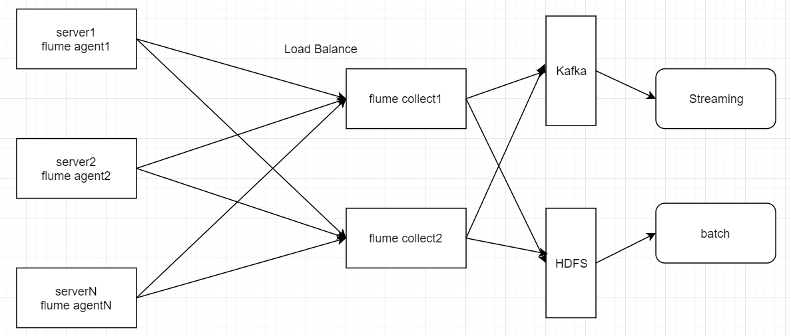

# 项目介绍


## 实时采集数据流设计

- 知道架构，搭建通即可，测试直接发送消息给kafka，sparkStreaming接收处理




## 框架版本选型

| 产品      | 版本   |
| --------- | ------ |
| Hadoop    | 2.7.2  |
| Flume     | 1.7.0  |
| MySQL     | 5.6.24 |
| Java      | 1.8    |
| Zookeeper | 3.4.10 |

- 注意：框架选型尽量不要选择最新的框架，选择最新框架半年前左右的稳定版


## 集群资源规划设计

| **服务**  | **子服务**       | hadoop102 | hadoop103 | hadoop104 |
| --------- | ---------------- | --------- | --------- | --------- |
| HDFS      | NameNode         | √         |           |           |
|           | DataNode         | √         | √         | √         |
| YARN      | ResourceManager  |           | √         |           |
|           | NodeManager      | √         | √         | √         |
| Zookeeper | Zookeeper Server | √         | √         | √         |
| Flume     | Flume(采集端)    | √         | √         | √         |
|           | Flume(汇聚端)    | √         | √         |           |
| Kafka     | Kafka Broker     | √         | √         | √         |
| Mysql     | Mysql Server     | √         |           |           |


## Kafka相关说明


### 部署

- 一般使用独立服务器部署
- 推荐配置为8核16线程，32G内存服务器
- 原则上最少3台


### 服务器层面配置

- 设置文件描述符为65536，表示一个文件可以同时有多少个线程修改
  - 默认值是1024

```bash
sudo vi /etc/security/limits.conf
#追加2行内容，*号代表对所有用户生效
\* soft nofile 65536
\* hard nofile 65536
```

- 配置后新打开窗口，使用ulimit -a查看，或者ulimit -n


### 配置

- log.dirs设置多个磁盘对应的目录，提高吞吐量
- JVM heap一般设置为4G即可，并且使用G1收集器


## 需求1：实时统计新增VIP数量

- 保证数据精确消费一次

- 按天、省份分组，最后统计结果类似于：2018-04-08北京新增VIP188人

   


## 需求2：异常订单用户及时运营

- 保证数据精确消费一次)
- 每隔30S，统计近60S的用户行为数据，当出现进入定单页（eventKey=enterOrderPage）>=3次，但是没有成功完成订单时(去业务数据库的实时备份表vip_users查询用户是否为VIP)，即将用户uid持久化到Mysql中
  