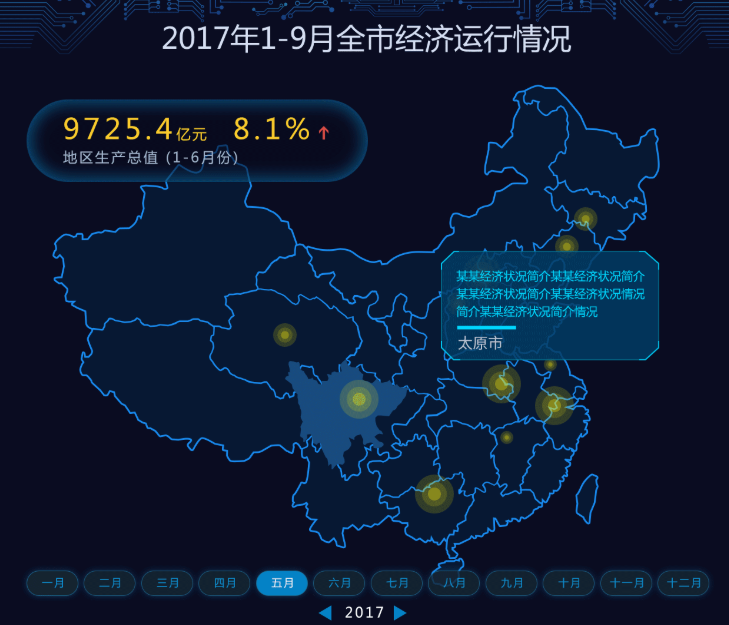

# 项目介绍


## 需求

- 实时统计新增VIP数量
- 保证数据精确消费一次
- 按天、省份分组，最后统计结果类似于：2018-04-08北京新增VIP188人
- 统计结果存储在Mysql中，表结构如下：

```sql
CREATE TABLE `vip_increment_analysis` (
    `province` varchar(128) DEFAULT NULL,
    `cnt` int(11) DEFAULT NULL,
    `dt` varchar(128) DEFAULT NULL  
) ENGINE=InnoDB DEFAULT CHARSET=utf8
```

- 使用ipip.net解析ip地址：https://github.com/ipipdotnet/ipdb-java
- 当eventKey为completeOrder时，代表成为VIP，只需统计事件中eventKey为completeOrder的数量即可


 创建topic：bin/kafka-topics.sh --create --zookeeper 192.168.137.10:2181 --replication-factor 3 --partitions 3 --topic user-behavior

模拟数据：
61027	61027	M	1	0	ios	toutiao	wifi	42.86.6.0	18701461027	0	0	0	0	2.0	completeOrder	1554652800


- 通过SparkStreaming技术，每10秒计算新增VIP用户量，计算结果保存到Mysql，并通过前端大屏不停刷新展示

 


## 实时采集数据流设计


## 框架版本选型

| 产品      | 版本   |
| --------- | ------ |
| Hadoop    | 2.7.2  |
| Flume     | 1.7.0  |
| MySQL     | 5.6.24 |
| Java      | 1.8    |
| Zookeeper | 3.4.10 |

- 注意：框架选型尽量不要选择最新的框架，选择最新框架半年前左右的稳定版


## 集群资源规划设计

| **服务**  | **子服务**       | hadoop102 | hadoop103 | hadoop104 |
| --------- | ---------------- | --------- | --------- | --------- |
| HDFS      | NameNode         | √         |           |           |
|           | DataNode         | √         | √         | √         |
| YARN      | ResourceManager  |           | √         |           |
|           | NodeManager      | √         | √         | √         |
| Zookeeper | Zookeeper Server | √         | √         | √         |
| Flume     | Flume(采集端)    | √         | √         | √         |
|           | Flume(汇聚端)    | √         | √         |           |
| Kafka     | Kafka Broker     | √         | √         | √         |
| Mysql     | Mysql Server     | √         |           |           |


## Kafka相关说明


### 部署

- 一般使用独立服务器部署
- 推荐配置为8核16线程，32G内存服务器
- 原则上最少3台


### 服务器层面配置

- 设置文件描述符为65536

```bash
sudo vi /etc/security/limits.conf
#追加2行内容，*号代表对所有用户生效
\* soft nofile 65536
\* hard nofile 65536
```

- 配置后新打开窗口，使用ulimit -a查看


### 配置

- log.dirs设置多个磁盘对应的目录，提高吞吐量
- JVM heap一般设置为4G即可，并且使用G1收集器


```

```


```

```


## SparkStreaming代码实现


# 面试题

### 面试题

- Kafka副本数为3，最大能容错几个副本？是否一定能够容错这些？
  最大容错2个逼本，当有副本不在ISR中时，就不能容错2个了
- 什么情况下副本不在ISR中？ 0.9版本之后，follwer落后leader [replica.log.time.max.ms](http://replica.log.time.max.ms/) 的时间后，即不在ISR中，默认为10S
- 如何保证某些消息在Kafka中可以全局有序的消费？

1. 为这部分消息设置key，所以相同的key会进入同一个分区
2. 如果问题变成保证某个Topic的消息要全局有序消费，那只能设置一个分区了