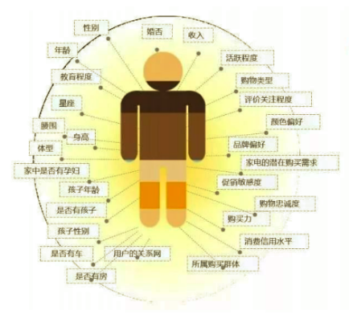
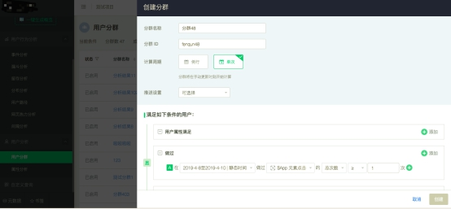
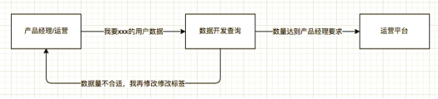
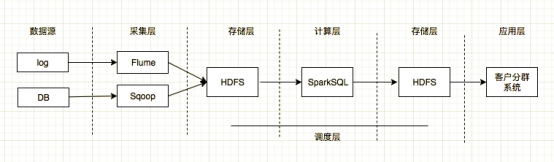
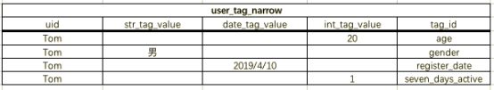

# 什么是用户画像

- 用户画像又称用户角色，作为一种勾画目标用户、联系用户诉求与设计方向的有效工具，用户画像在各领域得到了广泛的应用。

- 用数字化的标签描述用户个性特征的一种方法
- 给用户打标签
- 可算是数据仓库中的DM层
  - DM 数据集市：数据仓库的子集，依据不同的需求，从数据仓库抽取出特定的数据

 


## 用户画像应用方向

根据标签快速筛选人群

精准营销

- 新注册用户赠送首次购买VIP优惠券
- VIP快到期用户发放折扣券
- 新学年快开始时，给非VIP用户发放下一年级课程包优惠券


# 用户分群系统需求及架构设计


## 项目需求分析

- 通过Hive/Sparksql后端生成标签库

- 前端通过ui选择标签，通过JDBC形式提交到后端SparkSQL引擎，快速统计人数

- 可将符合筛选标签的用户ID快速导入运营平台或CRM，达到精准运营(比如平时我们收到的各种短信)

 

 


## 为什么会有这个需求？没有用户分群系统时是什么样的流程

 

通过用户分群系统，产品经理和运营等同事不再需要向数据开发反复提需求，只需自己在平台操作，并且可以将符合需求的用户直接导入到其它平台，全部流程不再需要手动执行，大大提高生产效率

 

##  项目主要模块

- 标签定义模块

- 标签开发模块

- 任务调度模块

- 用户分群UI模块

 

### 系统架构图设计

- DB是专门给大数据使用的备份数据库

 


### 框架版本选型

| 产品      | 版本   |
| --------- | ------ |
| Hadoop    | 2.7.2  |
| Flume     | 1.7.0  |
| Hive      | 1.2.1  |
| Sqoop     | 1.4.6  |
| MySQL     | 5.6.24 |
| Azkaban   | 2.5.0  |
| Java      | 1.8    |
| Zookeeper | 3.4.10 |

注意事项：框架选型尽量不要选择最新的框架，选择最新框架半年前左右的稳定版


### 集群资源规划设计

|                    | 服务器hadoop102  | 服务器hadoop103            | 服务器hadoop104           |
| ------------------ | ---------------- | -------------------------- | ------------------------- |
| HDFS               | NameNodeDataNode | DataNode                   | DataNodeSecondaryNameNode |
| Yarn               | NodeManager      | ResourcemanagerNodeManager | NodeManager               |
| Zookeeper          | Zookeeper        | Zookeeper                  | Zookeeper                 |
| Flume(采集日志)    | Flume            | Flume                      |                           |
| Kafka              | Kafka            | Kafka                      | Kafka                     |
| Flume（消费Kafka） |                  |                            | Flume                     |
| Hive               | Hive             |                            |                           |
| MySQL              | MySQL            |                            |                           |
| Presto             | Presto           |                            |                           |


# 标签设计模块


## 将所有标签分为如下两类

- 用户属性标签
- 用户行为标签
- 外部标签(数据交换)
  - 通过交流与其他公司交换数据时使用

 

- 用户属性标签
  - 性别
  - 年龄
  - 城市
  - 年级
  - 学校
  - 渠道
  - 注册时间
  - 哪门课程VIP
  - 是否是好友推荐（是否添写了邀请码）
  - …

- 用户行为标签
  - 喜欢在什么系统登录
  - 之前已购买VIP总时长
  - 是否7日内活跃(登录过) 0 ->不活跃，1 -> 活跃
  - 是否深度活跃(7日内看过5个视频以上)
  - 有付费意愿(单日内3次进入订单页且没有成为会员)
  - 是否乐于助人(7日内社区内回答超过3个问题)
  - 是否是学霸(7日内做题超过3次且完成等级为S)
  - …


## 说明

- 用户画像中的标签不是凭空捏造的，一定是产品经理或业务人员通过业务发现需求，提出的标签模型，在企业中开发时，需要对业务非常熟悉的人提出标签需求才能进入用户画像的开发

 

# 代码实现流程


## 用户标签窄表介绍


### Hive schema 窄表

```sql
create table if not exists dm.user_tag_narrow(
	uid STRING comment '用户id'，
	str_tag_value STRING comment '字符型标签值',
	date_tag_value DATE comment '日期型标签值',
	int_tag_value INT commnet '数字型标签值'
)partition by (tag_id STRING) row format delimited fields terminated by "\t";
```

- 现在ods有从业务数据库中同步过来的user表


### Mysql schema 源表

```sql
CREATE TABLE `users` (
  `id` int(11) NOT NULL AUTO_INCREMENT,
  `uid` varchar(32) DEFAULT NULL,
  `username` varchar(16) DEFAULT NULL,
  `age` tinyint(4) DEFAULT NULL,
  `gender` varchar(8) DEFAULT NULL,
  `province` varchar(16) DEFAULT NULL,
  `city` varchar(16) DEFAULT NULL,
  `channel` varchar(16) DEFAULT NULL,
  `invite_code` varchar(16) DEFAULT NULL,
  `register_date` datetime DEFAULT NULL,
  PRIMARY KEY (`id`)
) ENGINE=InnoDB DEFAULT CHARSET=utf8
```


### Sqoop导入语句

- 将mysql的用户表数据导入到hive表中
  - 如下的脚本的好处是不用手动创建hive表，由脚本自动创建，防止mysql表的schema会变化

```bash
sqoop import \
--connect jdbc:mysql://ip:3306/app \
--username root \
--password 123456 \
--table users \
--fields-terminated-by "\t" \
--delete-target-dir \ # 删除原先的数据
--num-mappers 8 \
--hive-import \
--hive-database ods \
--hive-table users \
--null-string '\\N' \
--null-non-string '\\N'
```


### 导入基础属性到窄表

- 将用户基础属性标签写入到用户标签窄表dm.user_tag_narrow中
- 此处只模拟插入3个属性标签，但全部类型已覆盖到

```sql
from ods.user 

insert overwrite table dm.user_tag_narrow partition(tag_id="age") 
select uid,null,null,age 

insert overwrite table dm.user_tag_narrow partition(tag_id="gender")
select uid,gender,null,null 

insert overwrite table dm.user_tag_narrow partition(tag_id="register_date")
select uid,null,register,null 

......
```


### 导入用户行为到窄表

- 将用户行为标签写入到用户标签窄表dm.user_tag_narrow中
- 以7日活跃为例
  - 7日内上线表示活跃

```sql
insert overwrite table dm.user_tag_narrow partition(tag_id="seven_days_active")
select uid,null,null,is_active 
from (
	select t1.uid as uid,if(t2.uid != null,1,0) as is_active 
    from (
        select uid 
        from ods.user t1
		left join (
        	select distinct uid
            from dwd.user_behavior 
            where day between ${startDay} and ${endDay}  
            and event_key = "startApp"
        ) t2
		on t1.uid = t2.uid)
    )
```


## 用户标签宽度介绍

- 宽表schema需要由窄表有多少指标来定

```sql
drop table if exists dm.user_tag;
create table if not exists dm.user_tag as
select
	uid,
	max(case when tag_id="age" then int_tag_vale end) as  age,
	max(case when tag_id="gender" then str_tag_value end) as gender,
	max(case when tag_id="register_date" then date_tag_value end) as register_date,
	max(case when tag_id="seven_days_active" then int_tag_value end) as seven_days_active
from dm.user_tag_narrow group by uid;
```

- 数据转换过程如下图：

 

 

 

# 程序部署说明

- 整套流程使用调度框架执行，每天凌晨执行一次

- ods.users表，每次使用sqoop全量导入，且自动生成Hive表，而不是手动创建。因为业务数据库的users表schema不固定

- dm.user_tag每日==先删除==再重新生成表，因为标签窄表非常可能增加或减少标签，所以schema也无法固定


# 优化

- sql优化，在形成宽表时，可以通过脚本自动生成，因为sql语句形式已经固定
- 查询优化，从宽表中查询，使用jdbc执行sparkSQL，时间在十几秒，那么考虑将宽表导入到ES中，或者使用kylin进行查询

