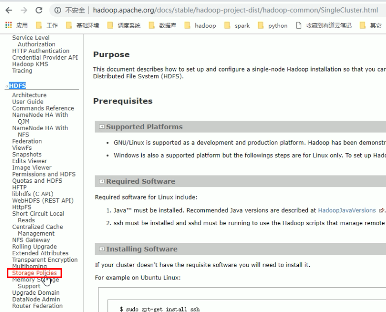
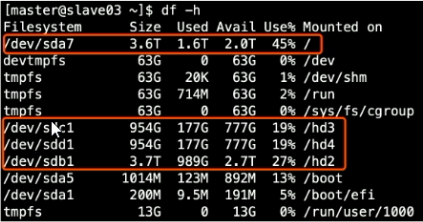
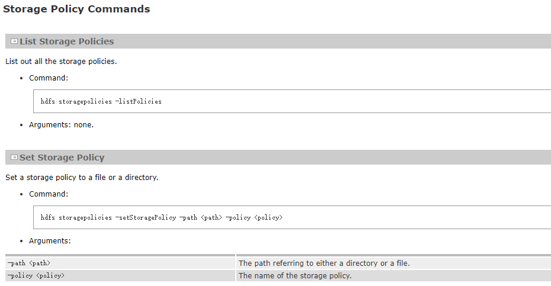
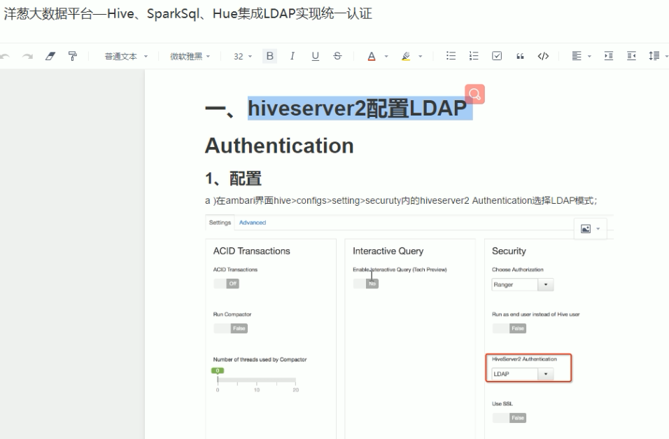

# 平台运行到一定时间后可能会遇到的问题


## rebalance

- 横向扩展
  - rebalance的必要性
    -  如果没有rebalance，则新加机器没有数据，那么yarn给新加的机器分配任务，会导致新加的机器去其他机器去获取数据进行计算，违背了移动计算不移动数据的思想
    - 为了更好的进行数据本地化计算
    - rebalance可以指定参数，指定IO传输速率
      - 如果不指定参数，可能集群不可用
    - `hdfs balancer -help`


## hdfs 分层存储

- 纵向扩展：分层存储

  - `spark-shell --master yarn` 执行命令后，查看hadoop102:4040页面，执行sc.textFile(path).count
    - 查看页面中的input大小，说明瓶颈最后在输入的数据的IO
  - 加入SSD
  - 将热点数据放入到SSD，普通的数据放在机械硬盘上
  - 那些是热点数据
    - 近半年的数据放在SSD上
    - 数仓的所有数据
  - 普通的数据
    - 其他的数据，半年以上的数据
  - 分层存储
    - hadoop2.6以后出现，存储策略如下
    - hot：所有副本存储在磁盘上
    - cold：ARCHIVE，将数据达成har包，存储在普通机器的磁盘上作为备份使用
    - warm：一些副本存储在磁盘上，一些副本以ARCHIVE的方式存储在磁盘上
    - All_SSD：所有副本都在SSD上
    - One_SSD：一个副本在SSD上，其他存储在磁盘上
    - Lazy_Persist：副本第一时间存储在RAM_DISK（内存）上，然后在懒持久化到DISK

  


| **Policy** **ID** | **Policy** **Name** | **Block Placement** **(n  replicas)** | **Fallback storages** **for creation** | **Fallback storages** **for replication** |
| :---------------- | :------------------ | :------------------------------------ | :------------------------------------- | :---------------------------------------- |
| 15                | Lazy_Persist        | RAM_DISK: 1, DISK: *n*-1              | DISK                                   | DISK                                      |
| 12                | All_SSD             | SSD: n                                | DISK                                   | DISK                                      |
| 10                | One_SSD             | SSD: 1, DISK: *n*-1                   | SSD, DISK                              | SSD, DISK                                 |
| 7                 | Hot (default)       | DISK: n                               | <none>                                 | ARCHIVE                                   |
| 5                 | Warm                | DISK: 1, ARCHIVE: *n*-1               | ARCHIVE, DISK                          | ARCHIVE, DISK                             |
| 2                 | Cold                | ARCHIVE: n                            | <none>                                 | <none>                                    |
| 1                 | Provided            | PROVIDED: 1, DISK: *n*-1              | PROVIDED, DISK                         | PROVIDED, DISK                            |


### 配置

hdfs-default.xml

- dfs.datanode.data.dir 配置hdfs存储的目录
  - 默认值：file://${hadoop.tmp.dir}/dfs/data
  - 示例：ssd，disk
    - [SSD]/opt/hfds/data
    - [DISK]/var/hdfs/data
  - 按图配置有，hd3，hd4是ssd
    
   - [SSD]/hd3/hdfs/data,[SSD]/hd4/hdfs/data,[DISK]/hadoop/data,[DISK]/hd2/hdfs/data
  - 注意：集群配置的每台机器最好目录一致，否则要单独配置
  - 配置完重启服务


### 设置策略



```bash
hdfs storagepolicies -setStoragePolicy -path <path> -policy <policy>

# 示例1，path中含有数据 path 指的是hdfs策略
hdfs storagepolicies -setStoragePolicy -path /user/hive/warehouse/ -policy One_SSD

# 执行数据转移命令后，才会将数据转移
hdfs mover -p /user/hive/warehouse

# 示例2 path中没有数，后期往目录中插入数据,不需要执行转移
hdfs storagepolicies -setStoragePolicy -path /user/hive/warehouse/new -policy All_SSD

# 查询策略信息
hdfs storagepolicies -listPolicies

# 取消策略,执行后注意要执行转移 hadoop2.9版本以上才有
hdfs storagepolicies -unsetStoreagePolicy -path <path>

# 获取路径策略
hdfs storagepolicies -getStoragePolicy -path <path>
```


## hdfs 配额

- 为什么做限额，有人产生了大量临时表，或者做了笛卡尔积，集群崩溃，因此对目录进行容量的限额


### Administrative Commands

Quotas are managed by a set of commands available only to the administrator.

- `hdfs dfsadmin -setQuota <N> <directory>...<directory>`

  Set the name quota to be N for each directory. Best effort for each directory, with faults reported if N is not a positive long integer, the directory does not exist or it is a file, or the directory would immediately exceed the new quota.

- `hdfs dfsadmin -clrQuota <directory>...<directory>`

  Remove any name quota for each directory. Best effort for each directory, with faults reported if the directory does not exist or it is a file. It is not a fault if the directory has no quota.

- `hdfs dfsadmin -setSpaceQuota <N> <directory>...<directory>`

  - 对文件目录下的所有文件的总大小做限制，包括副本在内总额度大小
  - 可以传递多个目录
  - 副本也算作限额中

  Set the space quota to be N bytes for each directory. This is a hard limit on total size of all the files under the directory tree. The space quota takes replication also into account, i.e. one GB of data with replication of 3 consumes 3GB of quota. N can also be specified with a binary prefix for convenience, for e.g. 50g for 50 gigabytes and 2t for 2 terabytes etc. Best effort for each directory, with faults reported if N is neither zero nor a positive integer, the directory does not exist or it is a file, or the directory would immediately exceed the new quota.

- `hdfs dfsadmin -clrSpaceQuota <directory>...<directory>`

  Remove any space quota for each directory. Best effort for each directory, with faults reported if the directory does not exist or it is a file. It is not a fault if the directory has no quota.

- `hdfs dfsadmin -setSpaceQuota <N> -storageType <storagetype> <directory>...<directory>`

  Set the storage type quota to be N bytes of storage type specified for each directory. This is a hard limit on total storage type usage for all the files under the directory tree. The storage type quota usage reflects the intended usage based on storage policy. For example, one GB of data with replication of 3 and ALL_SSD storage policy consumes 3GB of SSD quota. N can also be specified with a binary prefix for convenience, for e.g. 50g for 50 gigabytes and 2t for 2 terabytes etc. Best effort for each directory, with faults reported if N is neither zero nor a positive integer, the directory does not exist or it is a file, or the directory would immediately exceed the new quota. The storage type specific quota is set when -storageType option is specified. Available storageTypes are RAM_DISK,DISK,SSD,ARCHIVE.

- `hdfs dfsadmin -clrSpaceQuota -storageType <storagetype> <directory>...<directory>`

  Remove storage type quota specified for each directory. Best effort for each directory, with faults reported if the directory does not exist or it is a file. It is not a fault if the directory has no storage type quota on for storage type specified. The storage type specific quota is cleared when -storageType option is specified. Available storageTypes are RAM_DISK,DISK,SSD,ARCHIVE.


# flume 压测 benchmark

- 吞吐量：一般是60M/s极限，不含压缩

https://cwiki.apache.org/confluence/display/FLUME/Performance+Measurements+-+round+2

- 吞吐量，单台服务器，网卡流量
- 千兆网卡，120MB
- 不同的硬件压测的标准不一样

- eventSize：500byte events
- channel：file
- version：1.4
- source：4 个source，100k batchSize
- HDFS sink batch size：500,000
- 内存164G，志强处理器2640，机械硬盘

 

- 横向添加多个磁盘
- 纵向添加多个sink

 

- 含有压缩


# 企业级权限

- CDH
  - sentry 权限框架
- HDP
  - ranger 权限框架
- 认证



